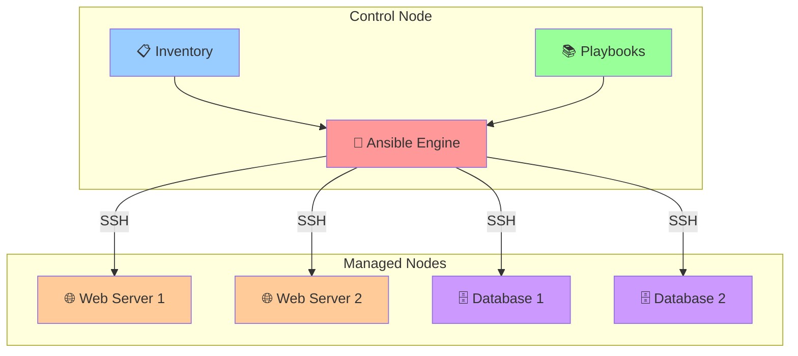
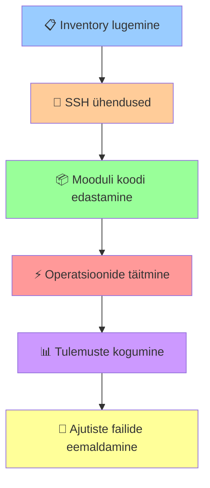

# 📚 Ansible Basics: Alused

# 2.1 Ansible Arhitektuur ja Põhimõtted

## Sissejuhatus automatiseerimisse

Süsteemiadministreerimine traditsioonilistel meetoditel tekitab skaleerumisel märkimisväärseid väljakutseid. Suurtes infrastruktuurides, kus hallatakse kümneid või sadu servereid, muutub käsitsi konfiguratsioonide haldamine aeganõudvaks ja vigadele vastuvõtlikuks.

Ansible on open-source automatiseerimisplatvorm, mis lahendab süsteemihalduse, rakenduste juurutamise ja konfiguratsioonide haldamise ülesandeid. Ansible'i peamised eelised on agentless arhitektuur, deklaratiivne süntaks ja idempotentsed operatsioonid.

## Ansible arhitektuur

### Agentless lähenemine

Ansible kasutab agentless arhitektuuri, mis eristab seda paljudest konkureerivtest lahendustest. See tähendab, et hallatavates süsteemides ei ole vaja installida ja hooldada täiendavat tarkvara.



**Nõuded hallatavates süsteemides:**
- SSH server aktiivsena
- Python interpreter (versioon 2.7 või 3.5+)
- Vajalikud süsteemi õigused operatsioonide sooritamiseks

### Põhikomponendid

#### Control Node
Control node on süsteem, kus Ansible on installitud ja kust käivitatakse automatiseerimise käsud. Control node nõuded:
- Unix-laadne operatsioonisüsteem (Linux, macOS)
- Python 3.8 või uuem versioon
- SSH klient

#### Managed Nodes
Managed nodes on sihtmärgid, mida Ansible haldab. Need võivad olla füüsilised serverid, virtuaalmasinad või pilveressursid.

#### Inventory
Inventory on struktureeritud fail või andmebaas, mis määratleb hallatavate süsteemide nimekirja ja nende grupeerimise loogika.

```ini
[webservers]
web1.example.com
web2.example.com

[databases] 
db1.example.com
db2.example.com

[production:children]
webservers
databases
```

#### Modules
Moodulid on abstraktsed ühikud, mis kapseldavad konkreetseid funktsionaalsusi. Ansible sisaldab üle 3000 mooduli, mis katavad süsteemihalduse, võrgukonfiguratsiooni, pilveplatformide ja rakenduste haldamise vajadused.

### Töövoog

Ansible'i täitmistsükkel koosneb järgmistest sammudest:



1. **Inventory lugemine** - süsteemide nimekirja laadimine
2. **SSH ühenduste loomine** - paralleelsed ühendused sihtmärkidega
3. **Mooduli koodi edastamine** - vajalike Python skriptide ajutine kopeerimine
4. **Operatsioonide täitmine** - käskude paralleelne käivitamine
5. **Tulemuste kogumine** - väljundi ja staatuse tagastamine
6. **Ajutiste failide eemaldamine** - puhastusoperatsioonid

## Idempotency printsiip

Idempotency on Ansible'i põhiprintsiip, mis tagab, et sama operatsiooni korduvkäivitamine ei muuda süsteemi olekut, kui soovitud olek on juba saavutatud.

```bash
# Esimene käivitamine - nginx installitakse
ansible all -m package -a "name=nginx state=present"

# Teine käivitamine - nginx on juba olemas, muudatusi ei tehta
ansible all -m package -a "name=nginx state=present"
```

Idempotency eelised:
- **Turvalisus** - operatsioonide korduvkäivitamine ei tekita kahjulikke kõrvalmõjusid
- **Etteennustatavus** - süsteemi lõppolek on alati sama
- **Usaldusväärsus** - automatiseerimise skriptid on stabiilsed

## Võrdlus konkurentidega

### Ansible vs Puppet

| Aspekt | Ansible | Puppet |
|--------|---------|---------|
| Arhitektuur | Agentless | Agent-põhine |
| Konfiguratsioon | YAML | Ruby DSL |
| Mudel | Push | Pull |
| Õppimiskõver | Madal | Kõrge |

### Ansible vs Chef

| Aspekt | Ansible | Chef |
|--------|---------|-------|
| Keel | YAML | Ruby |
| Seadistamine | Lihtne | Keeruline |
| Skaleeritavus | Hea | Väga hea |
| Ökosüsteem | Lai | Lai |

## Praktiline näide

Lihtne ühenduvuse testimine:

```bash
# SSH võtmete seadistamine
ssh-keygen -t ed25519 -f ~/.ssh/ansible_key
ssh-copy-id -i ~/.ssh/ansible_key.pub user@target_host

# Inventory loomine
echo "target_host ansible_user=user" > inventory

# Ühenduvuse testimine
ansible -i inventory target_host -m ping
```

Oodatav väljund:
```json
target_host | SUCCESS => {
    "ansible_facts": {
        "discovered_interpreter_python": "/usr/bin/python3"
    },
    "changed": false,
    "ping": "pong"
}
```

## Kokkuvõte

Ansible pakub tõhusat lahendust infrastruktuuri automatiseerimiseks. Agentless arhitektuur, lihtne YAML süntaks ja idempotentsed operatsioonid muudavad selle sobivaks nii väikestele kui suurtele keskkondadele. Järgnevates peatükkides käsitletakse SSH konfiguratsiooni, inventory haldamist ja playbook'ide arendamist.

# 2.2 SSH ja Inventory konfigureerimine

## SSH autentimise alused

Ansible tugineb SSH protokollile kommunikatsiooniks hallatavate süsteemidega. Tõhusa automatiseerimise saavutamiseks on vajalik seadistada võtme-põhine autentimine, mis elimineerib interaktiivse parooli sisestamise vajaduse.

### SSH võtmete genereerimine

SSH võtmepaaride loomine toimub `ssh-keygen` utiliidiga. Soovitatav on kasutada Ed25519 algoritmi turvalisuse ja jõudluse optimaalse tasakaalu saavutamiseks.

```bash
# Ed25519 võtme genereerimine
ssh-keygen -t ed25519 -C "ansible-automation" -f ~/.ssh/ansible_ed25519

# RSA võtme genereerimine (vajadusel)
ssh-keygen -t rsa -b 4096 -C "ansible-automation" -f ~/.ssh/ansible_rsa
```

**Parameetrite selgitus:**
- `-t` - krüptograafilise algoritmi määramine
- `-b` - võtme pikkus bittides (RSA jaoks)
- `-C` - kommentaar võtme identifitseerimiseks
- `-f` - väljundfaili asukoha määramine

### SSH agendi konfigureerimine

SSH agent hõlbustab privaatvõtmete haldamist, lubades autentimist ilma korduvate paroolide sisestamiseta.

```bash
# SSH agendi käivitamine
eval "$(ssh-agent -s)"

# Privaatvõtme lisamine agenti
ssh-add ~/.ssh/ansible_ed25519

# Agendis olevate võtmete kontroll
ssh-add -l
```

Automaatse agendi käivitamise seadistamine shell'i konfiguratsioonis:

```bash
# ~/.bashrc või ~/.zshrc
if [ -z "$SSH_AUTH_SOCK" ]; then
    eval "$(ssh-agent -s)"
    ssh-add ~/.ssh/ansible_ed25519 2>/dev/null
fi
```

### Avalike võtmete levitamine

Avalike võtmete autoriseeritud võtmete nimekirja lisamine:

```bash
# ssh-copy-id kasutamine (lihtsaim)
ssh-copy-id -i ~/.ssh/ansible_ed25519.pub kasutaja@sihtserver

# Käsitsi kopeerimine
cat ~/.ssh/ansible_ed25519.pub | ssh kasutaja@sihtserver \
  "mkdir -p ~/.ssh && cat >> ~/.ssh/authorized_keys"

# Batch levitamine
for server in server1 server2 server3; do
    ssh-copy-id -i ~/.ssh/ansible_ed25519.pub kasutaja@$server
done
```

## Inventory struktuur ja formaat

### INI formaat

Traditsiooniline inventory formaat, sobiv lihtsamatele konfiguratsioonidele:

```ini
# Üksikud hostid
mail.example.com
web1.example.com
web2.example.com

# Hostide grupid
[webservers]
web1.example.com
web2.example.com
web3.example.com

[dbservers]
db1.example.com ansible_port=5432
db2.example.com ansible_port=5432

# Grupihierarhia
[production:children]
webservers
dbservers

# Grupi muutujad
[webservers:vars]
http_port=80
https_port=443
nginx_user=www-data

[dbservers:vars]
db_port=3306
db_user=admin
```

### YAML formaat

Kaasaegne formaat, mis võimaldab keerulisemat struktureerimist:

```yaml
all:
  children:
    webservers:
      hosts:
        web1.example.com:
          ansible_user: ubuntu
        web2.example.com:
          ansible_user: ubuntu
          ansible_port: 2222
        web3.example.com:
          ansible_user: centos
      vars:
        http_port: 80
        https_port: 443
        nginx_user: www-data
    
    dbservers:
      hosts:
        db1.example.com:
          ansible_port: 5432
        db2.example.com:
          ansible_port: 5432
      vars:
        db_port: 3306
        db_user: admin
    
    production:
      children:
        webservers:
        dbservers:
```

### Dünaamiline inventory

Suurte või muutuvate infrastruktuuride jaoks võib implementeerida dünaamilise inventory genereerimise:

```python
#!/usr/bin/env python3
import json
import requests

def get_inventory():
    """Genereeri inventory välistest allikatest"""
    inventory = {
        'webservers': {
            'hosts': [],
            'vars': {'http_port': 80}
        },
        'dbservers': {
            'hosts': [],
            'vars': {'db_port': 3306}
        },
        '_meta': {
            'hostvars': {}
        }
    }
    
    # Näide: loe serverid API-st
    # servers = requests.get('https://api.company.com/servers').json()
    # for server in servers:
    #     inventory[server['group']]['hosts'].append(server['hostname'])
    
    return inventory

if __name__ == '__main__':
    print(json.dumps(get_inventory(), indent=2))
```

## Ansible konfigureerimine

### ansible.cfg faili struktuur

Ansible'i käitumist saab kohandada konfiguratsiooni faili abil. Soovitatav on hoida `ansible.cfg` faili projekti juurkaustas.

```ini
[defaults]
# Inventory asukoht
inventory = inventory/

# SSH seadistused
host_key_checking = False
remote_user = ansible
private_key_file = ~/.ssh/ansible_ed25519

# Paralleelsuse seadistused
forks = 10
timeout = 30

# Logimise seadistused
log_path = ./ansible.log
display_skipped_hosts = False

# Callback pluginide konfigureerimine
stdout_callback = yaml
bin_ansible_callbacks = True

[ssh_connection]
# SSH ühenduste optimeerimine
ssh_args = -o ControlMaster=auto -o ControlPersist=60s -o UserKnownHostsFile=/dev/null
control_path_dir = ~/.ansible/cp
pipelining = True
retries = 3

[privilege_escalation]
become = True
become_method = sudo
become_user = root
become_ask_pass = False
```

### Konfiguratsiooni prioriteet

Ansible otsib konfiguratsiooni järgmises järjekorras:

1. **ANSIBLE_CONFIG** keskkonna muutuja
2. **ansible.cfg** praeguses töökaustas
3. **~/.ansible.cfg** kasutaja kodukaustas
4. **/etc/ansible/ansible.cfg** süsteemi tasemel

Kehtiva konfiguratsiooni kontroll:

```bash
# Konfiguratsiooni vaatamine
ansible-config view

# Kõikide parameetrite dump
ansible-config dump
```

## Host patterns ja sihtmärkide valimine

Ansible võimaldab paindlikku serverite valimist erinevate mustrite abil:

```bash
# Kõik hostid
ansible all -m ping

# Konkreetne grupp
ansible webservers -m ping

# Mitu gruppi
ansible webservers:dbservers -m ping

# Välistamine
ansible all:!dbservers -m ping

# Lõikumine
ansible webservers:&production -m ping

# Regulaaravaldised
ansible ~web.* -m ping

# Vahemiku määramine
ansible web[1:3] -m ping
```

## Ühenduse diagnostika

### Põhilised testid

```bash
# Ühenduvuse test
ansible all -m ping

# SSH ühenduse detailne test
ansible all -m command -a "whoami" -vvv

# Süsteemi faktide kogumine
ansible all -m setup --tree /tmp/facts
```

### Tüüpilised probleemid ja lahendused

**SSH võtme probleemid:**
```bash
# Võtme õiguste kontroll
chmod 600 ~/.ssh/ansible_ed25519
chmod 644 ~/.ssh/ansible_ed25519.pub

# SSH agendi kontroll
ssh-add -l
```

**Host key verification:**
```bash
# Ajutine keelamine
export ANSIBLE_HOST_KEY_CHECKING=False

# Täielik keelamine
echo "host_key_checking = False" >> ansible.cfg
```

**Õiguste probleemid:**
```bash
# Sudo konfiguratsiooni test
ansible all -m command -a "sudo whoami"

# Sudoers faili kontroll
ansible all -m shell -a "sudo -l"
```

## Inventory best practices

### Suurte projektide struktuur

```
inventory/
├── production/
│   ├── hosts.yml
│   ├── group_vars/
│   │   ├── all/
│   │   │   ├── common.yml
│   │   │   └── vault.yml
│   │   ├── webservers.yml
│   │   └── dbservers.yml
│   └── host_vars/
│       ├── web1.example.com.yml
│       └── db1.example.com.yml
├── staging/
└── development/
```

### Muutujate hierarhia

Ansible muutujate prioriteet (kõrgem alistab madalam):

1. Extra vars (`ansible-playbook -e`)
2. Task vars
3. Block vars
4. Role ja include vars
5. Play vars
6. Host facts
7. Host vars (inventory)
8. Group vars (inventory)
9. Group vars (all)
10. Role defaults

### Turvalisuse aspektid

Tundliku informatsiooni kaitsmine Ansible Vault'iga:

```bash
# Vault faili loomine
ansible-vault create group_vars/all/vault.yml

# Vault faili redigeerimine
ansible-vault edit group_vars/all/vault.yml

# Vault parooliga käivitamine
ansible-playbook --ask-vault-pass site.yml
```

## Kokkuvõte

SSH võtme-põhine autentimine ja korrektselt struktureeritud inventory on Ansible automatiseerimise nurgakivid. Proper konfigureerimine tagab turvalisuse, skaleeritavuse ja hallatavuse. Järgmises peatükis käsitletakse ad-hoc käskude kasutamist operatiivsete ülesannete lahendamiseks.

# 2.3 Ad-hoc käskude kasutamine

## Ad-hoc käskude olemus ja rakendusala

Ad-hoc käsud on Ansible'i funktsioon, mis võimaldab käivitada ühekordse operatsioone otse käsurealt, ilma playbook'ide loomise vajaduseta. Need sobivad kiireteks uuringulisteks või diagnostilisteks toiminguteks.

### Kasutamise stsenaariumid

**Sobivad rakendused:**
- Süsteemi oleku kiire kontroll
- Diagnostiliste andmete kogumine
- Incident response operatsioonid
- Eksploratiivsed uuringud
- Monitoring ja alerting

**Ebasobivad rakendused:**
- Keerulised mitme sammuga konfiguratsioonid
- Regulaarsed hooldusoperatsioonid
- Dokumenteerimist nõudvad protseduurid
- Produktsiooni deployment'id

### Süntaksi struktuur

Ad-hoc käskude põhiline formaat:

```bash
ansible <target> -m <module> -a "<arguments>" [options]
```

**Komponendid:**
- `<target>` - inventory pattern või grupi nimi
- `<module>` - kasutatav Ansible moodul
- `<arguments>` - mooduli parameetrid
- `[options]` - täiendavad käsulipud

## Põhilised moodulid

### ping - Ühenduvuse testimine

Ping moodul kontrollib SSH ühenduvust ja Python interpreteri olemasolu:

```bash
# Kõikide hostide test
ansible all -m ping

# Konkreetse grupi test
ansible webservers -m ping

# Pattern matching
ansible 'web*' -m ping

# Väljund tüüpilise eduka vastuse korral
ansible web1.example.com -m ping
# web1.example.com | SUCCESS => {
#     "ansible_facts": {
#         "discovered_interpreter_python": "/usr/bin/python3"
#     },
#     "changed": false,
#     "ping": "pong"
# }
```

### command vs shell moodulid

#### command moodul
Turvalisem variant, mis ei luba shell'i funktsionaalsust:

```bash
# Süsteemi aja kuvamine
ansible all -m command -a "date"

# Protsesside loetelu
ansible all -m command -a "ps aux"

# Failisüsteemi statistika
ansible all -m command -a "df -h"

# Shell operaatorid EI tööta
ansible all -m command -a "ps aux | grep nginx"  # EBAÕNNESTUB
```

#### shell moodul
Võimaldab shell'i funktsionaalsust, kuid suurema turvariski hinnaga:

```bash
# Torudega käsud
ansible all -m shell -a "ps aux | grep nginx"

# Keskkonna muutujad
ansible all -m shell -a "echo $HOME"

# Käsu asendamine
ansible all -m shell -a "kill $(pgrep -f nginx)"

# Failide ümbersuunamine
ansible all -m shell -a "dmesg | tail -20 > /tmp/kernel.log"
```

### package - Tarkvarahaldus

Universaalne pakettide haldamise moodul:

```bash
# Ühe paketi installimine
ansible all -m package -a "name=htop state=present" --become

# Mitme paketi installimine
ansible all -m package -a "name=curl,wget,git state=present" --become

# Paketi eemaldamine
ansible webservers -m package -a "name=apache2 state=absent" --become

# Pakettide cache uuendamine (Debian/Ubuntu)
ansible ubuntu_hosts -m package -a "update_cache=yes" --become
```

Spetsiifilised pakettide haldurid:

```bash
# APT (Debian/Ubuntu)
ansible ubuntu_hosts -m apt -a "name=nginx state=present update_cache=yes" --become

# YUM (RHEL/CentOS 7)
ansible centos_hosts -m yum -a "name=nginx state=present" --become

# DNF (Fedora, RHEL 8+)
ansible fedora_hosts -m dnf -a "name=nginx state=present" --become
```

### service - Teenuste haldamine

Süsteemi teenuste kontroll:

```bash
# Teenuse käivitamine
ansible webservers -m service -a "name=nginx state=started" --become

# Teenuse peatamine
ansible webservers -m service -a "name=apache2 state=stopped" --become

# Teenuse taaskäivitamine
ansible webservers -m service -a "name=nginx state=restarted" --become

# Autostart'i lubamine
ansible webservers -m service -a "name=nginx enabled=yes" --become

# Kombineeritud operatsioon
ansible webservers -m service -a "name=nginx state=started enabled=yes" --become
```

### file - Failisüsteemi operatsioonid

Failide ja kataloogide haldamine:

```bash
# Kataloogi loomine
ansible all -m file -a "path=/opt/application state=directory mode=0755" --become

# Faili loomine (touch)
ansible all -m file -a "path=/tmp/marker state=touch"

# Õiguste muutmine
ansible all -m file -a "path=/etc/app.conf owner=app group=app mode=0640" --become

# Simbolilise lingi loomine
ansible all -m file -a "src=/usr/bin/python3 dest=/usr/bin/python state=link" --become

# Failide kustutamine
ansible all -m file -a "path=/tmp/tempfile state=absent"

# Rekursiivne õiguste määramine
ansible all -m file -a "path=/var/www state=directory owner=www-data group=www-data recurse=yes" --become
```

### copy - Failide edastamine

Sisu kopeerimine control node'st managed node'idesse:

```bash
# Faili kopeerimine
ansible webservers -m copy -a "src=/local/config.conf dest=/etc/app/config.conf" --become

# Backup'iga kopeerimine
ansible webservers -m copy -a "src=nginx.conf dest=/etc/nginx/nginx.conf backup=yes" --become

# Inline sisu loomine
ansible all -m copy -a "content='server_tokens off;' dest=/etc/nginx/conf.d/security.conf" --become

# Õigustega kopeerimine
ansible all -m copy -a "src=script.sh dest=/usr/local/bin/script.sh mode=0755 owner=root" --become
```

## Süsteemi diagnostika

### Riistvara ja süsteemi informatsioon

Setup moodul kogub põhjalikku informatsiooni hallatavate süsteemide kohta:

```bash
# Operatsioonisüsteemi informatsioon
ansible all -m setup -a "filter=ansible_distribution*"

# Mälu informatsioon
ansible all -m setup -a "filter=ansible_memory_mb"

# Võrgu konfiguratsioon
ansible all -m setup -a "filter=ansible_default_ipv4"

# CPU informatsioon
ansible all -m setup -a "filter=ansible_processor*"

# Kettaruumi informatsioon
ansible all -m setup -a "filter=ansible_mounts"

# Kõik faktid (mahukad andmed)
ansible all -m setup --tree /tmp/facts/
```

### Performance monitoring

Süsteemi jõudluse kontroll:

```bash
# Süsteemi koormus
ansible all -m command -a "uptime"

# Mälu kasutus
ansible all -m shell -a "free -h"

# Kettakasutus
ansible all -m shell -a "df -h"

# Top protsessid CPU järgi
ansible all -m shell -a "ps aux --sort=-%cpu | head -10"

# Top protsessid mälu järgi
ansible all -m shell -a "ps aux --sort=-%mem | head -10"

# I/O statistika
ansible all -m shell -a "iostat -x 1 1" 

# Network statistika
ansible all -m shell -a "ss -tuln"
```

### Logide analüüs

Süsteemi logide kiire uurimine:

```bash
# Süsteemi logide viimaseid ridu
ansible all -m shell -a "journalctl -n 20 --no-pager"

# Specific teenuse logid
ansible webservers -m shell -a "journalctl -u nginx -n 10 --no-pager"

# Error'ite otsimine
ansible all -m shell -a "journalctl --since='1 hour ago' -p err --no-pager"

# Kerneli sõnumid
ansible all -m shell -a "dmesg | tail -20"

# Faili-põhised logid
ansible webservers -m shell -a "tail -20 /var/log/nginx/error.log"
```

## Täpsemad operatsioonid

### Kasutajate haldamine

```bash
# Kasutaja loomine
ansible all -m user -a "name=appuser shell=/bin/bash home=/home/appuser" --become

# Kasutaja grupi muutmine
ansible all -m user -a "name=appuser groups=sudo,www-data append=yes" --become

# SSH võtme lisamine
ansible all -m authorized_key -a "user=appuser key='{{ lookup('file', '~/.ssh/id_rsa.pub') }}'" --become
```

### Võrgu diagnostika

```bash
# Ühenduvuse test
ansible all -m command -a "ping -c 3 google.com"

# DNS lahendamine
ansible all -m command -a "nslookup example.com"

# Pordid kuulamas
ansible all -m shell -a "netstat -tlnp"

# Aktiivsed ühendused
ansible all -m shell -a "ss -tupln"
```

## Käsurea lipud ja optioonid

### Privilege escalation

```bash
# Sudo kasutamine
ansible all -m package -a "name=htop state=present" --become

# Konkreetse kasutajana käivitamine
ansible all -m command -a "whoami" --become-user=postgres --become

# Sudo meetodi määramine
ansible all -m command -a "id" --become-method=su --become
```

### Paralleelsuse kontroll

```bash
# Järjestikune täitmine
ansible all -m ping --forks=1

# Suurem paralleelsus
ansible all -m setup --forks=20
```

### Sihtmärkide piiramine

```bash
# Pattern'iga piiramine
ansible 'web*' -m ping

# Grupi välistamine
ansible all:!databases -m command -a "uptime"

# Kombineeritud tingimused
ansible webservers:&production -m service -a "name=nginx state=restarted" --become

# Hosti limiteerimine
ansible all --limit web1.example.com,web2.example.com -m ping
```

### Kuiva käivitamise režiim

```bash
# Kontroll ilma muudatusteta
ansible all -m package -a "name=nginx state=present" --check

# Muudatuste kuvamine
ansible all -m copy -a "src=test.conf dest=/etc/test.conf" --check --diff
```

## Batch operatsioonid

### Mitme käsu järjestus

Keerulisemate ülesannete jaoks võib kombineerida mitu ad-hoc käsku:

```bash
#!/bin/bash
# Veebiserveri kiire restart
ansible webservers -m service -a "name=nginx state=stopped" --become
ansible webservers -m command -a "sleep 5"
ansible webservers -m service -a "name=nginx state=started" --become
ansible webservers -m shell -a "curl -I http://localhost" 
```

### Informatsioon kogumise skript

```bash
#!/bin/bash
# Süsteemi auditi skript
echo "=== System Information ===" > audit.log
ansible all -m setup -a "filter=ansible_distribution*" >> audit.log
echo "=== Disk Usage ===" >> audit.log  
ansible all -m shell -a "df -h" >> audit.log
echo "=== Memory Usage ===" >> audit.log
ansible all -m shell -a "free -h" >> audit.log
echo "=== Running Services ===" >> audit.log
ansible all -m shell -a "systemctl list-units --type=service --state=running --no-pager" >> audit.log
```

## Kokkuvõte

Ad-hoc käsud pakuvad võimsat tööriista operatiivsete ülesannete lahendamiseks Ansible infrastruktuuris. Kuigi need sobivad hästi diagnostikaks ja lihtsateks operatsioonideks, keerulisema automatiseerimise jaoks tuleks kasutada playbook'e. Järgmises peatükis käsitletakse YAML süntaksit ja playbook'ide struktuuri.

# 2.4 YAML süntaks ja Playbook'ide alused

## YAML konfiguratsioonikeel

YAML (YAML Ain't Markup Language) on inimloetav andmete serialiseerimise standard, mida Ansible kasutab konfiguratsioonifailide ja playbook'ide kirjutamiseks. YAML-i eesmärk on pakkuda lihtsat ja intuitiivset süntaksit keeruliste andmestruktuuride kirjeldamiseks.

### YAML vs alternatiivsed formaadid

**YAML:**
```yaml
application:
  name: "web-service"
  version: "1.2.3"
  ports:
    - 80
    - 443
  configuration:
    debug: false
    max_connections: 1000
```

**JSON ekvivalent:**
```json
{
  "application": {
    "name": "web-service",
    "version": "1.2.3",
    "ports": [80, 443],
    "configuration": {
      "debug": false,
      "max_connections": 1000
    }
  }
}
```

**XML ekvivalent:**
```xml
<application>
  <name>web-service</name>
  <version>1.2.3</version>
  <ports>
    <port>80</port>
    <port>443</port>
  </ports>
  <configuration>
    <debug>false</debug>
    <max_connections>1000</max_connections>
  </configuration>
</application>
```

## YAML süntaksi reeglid

### Taandrimise nõuded

YAML kasutab taandrimist hierarhia määramiseks. Taandrimine peab olema järjekindel ja kasutama tühikuid:

```yaml
# Õige struktuur
parent:
  child1: value1
  child2: value2
  nested_parent:
    nested_child: nested_value

# Vale struktuur
parent:
child1: value1          # Vale tase
  child2: value2
    nested_parent:      # Inconsistent indentation
  nested_child: value   # Vale tase
```

### Andmetüübid

**Skalaarid:**
```yaml
string_value: "Hello World"
integer_value: 42
float_value: 3.14159
boolean_true: true
boolean_false: false
null_value: null
```

**Loendid (Arrays):**
```yaml
# Kompaktne formaat
fruits: [apple, banana, orange]

# Laiendatud formaat
fruits:
  - apple
  - banana
  - orange

# Objektide loend
servers:
  - name: web1
    ip: 192.168.1.10
  - name: web2
    ip: 192.168.1.11
```

**Võtme-väärtuse paarid (Dictionaries):**
```yaml
server_config:
  hostname: web1.example.com
  port: 80
  ssl_enabled: true
  allowed_ips:
    - 192.168.1.0/24
    - 10.0.0.0/8
```

### Mitme rea stringid

**Literal style (|) - säilitab reavahetused:**
```yaml
description: |
  See on pikk kirjeldus,
  mis sisaldab mitut rida
  ja säilitab kõik reavahetused.
```

**Folded style (>) - ühendab ridadeks:**
```yaml
summary: >
  See tekst kirjutatakse
  mitmel real, aga tulemuseks
  on üks pikk rida.
```

## Playbook'ide struktuur

### Playbook'i anatoomia

Playbook koosneb ühest või mitmest "play'st", mis on suunatud konkreetsetele hostidele:

```yaml
---
- name: "Esimene play - veebiserveri seadistamine"
  hosts: webservers
  become: yes
  vars:
    http_port: 80
    server_name: example.com
  
  tasks:
    - name: "Nginx'i installimine"
      package:
        name: nginx
        state: present

- name: "Teine play - andmebaasi seadistamine"  
  hosts: dbservers
  become: yes
  
  tasks:
    - name: "MySQL installimine"
      package:
        name: mysql-server
        state: present
```

### Play komponendid

#### Hosts directive
Määrab sihtmärgid, kus play käivitatakse:

```yaml
hosts: all                    # Kõik inventory hostid
hosts: webservers            # Konkreetne grupp
hosts: web*.example.com      # Pattern matching
hosts: webservers:dbservers  # Mitme grupi kombinatsioon
hosts: all:!production       # Välistamisega
```

#### Variables
Muutujate defineerimine play tasemel:

```yaml
vars:
  app_name: "myapp"
  app_version: "2.1.0"
  app_port: 8080
  app_users:
    - admin
    - operator
  app_config:
    debug: false
    timeout: 30
```

#### Tasks
Ülesannete loend, mis täidetakse järjekorras:

```yaml
tasks:
  - name: "Lühike, kirjeldav ülesande nimi"
    module_name:
      parameter1: value1
      parameter2: value2
    when: condition
    tags: [tag1, tag2]
```

## Muutujate kasutamine

### Muutujate interpoleerimine

YAML-is kasutatakse Jinja2 template süntaksit muutujate asendamiseks:

```yaml
- name: "Rakenduse seadistamine"
  hosts: webservers
  vars:
    app_name: "webstore"
    app_port: 8080
    config_path: "/etc/{{ app_name }}"
  
  tasks:
    - name: "Loo konfiguratsioonikaust {{ config_path }}"
      file:
        path: "{{ config_path }}"
        state: directory
        mode: '0755'
    
    - name: "Genereeri konfiguratsioonifail"
      copy:
        content: |
          [application]
          name={{ app_name }}
          port={{ app_port }}
          debug=false
        dest: "{{ config_path }}/app.conf"
```

### Muutujate allikad

Ansible võtab muutujaid mitmest allikast hierarhilises järjekorras:

1. Extra vars (`-e` käsureal)
2. Task variables
3. Block variables  
4. Role variables
5. Play variables
6. Host facts
7. Host variables
8. Group variables
9. Default variables

```yaml
# group_vars/webservers.yml
nginx_port: 80
nginx_user: www-data
ssl_certificate: "/etc/ssl/certs/{{ ansible_fqdn }}.crt"

# host_vars/web1.example.com.yml  
nginx_port: 8080
custom_config: true
```

## Handlers süsteem

Handlers on erikülesanded, mis käivitatakse ainult notification'i peale ja alles play lõpus:

```yaml
- name: "Nginx'i konfigureerimine"
  hosts: webservers
  become: yes
  
  tasks:
    - name: "Nginx põhikonfiguratsiooni uuendamine"
      template:
        src: nginx.conf.j2
        dest: /etc/nginx/nginx.conf
      notify:
        - restart nginx
        - reload systemd
    
    - name: "SSL sertifikaadi paigaldamine"
      copy:
        src: "{{ ssl_cert_file }}"
        dest: /etc/ssl/certs/nginx.crt
      notify: restart nginx
  
  handlers:
    - name: restart nginx
      service:
        name: nginx
        state: restarted
    
    - name: reload systemd
      systemd:
        daemon_reload: yes
```

Handler'i käitumise reeglid:
- Käivitatakse ainult notification'i korral
- Käivitatakse play lõpus isegi siis, kui mitu task'i sama handler'it notify'ib
- Ei käivitata, kui task ebaõnnestub (v.a force_handlers: yes)

## Praktiline näide: LAMP stack

Kompleksne playbook veebiserveri infrastruktuuri seadistamiseks:

```yaml
---
- name: "LAMP stack'i paigaldamine ja konfigureerimine"
  hosts: webservers
  become: yes
  vars:
    mysql_root_password: "{{ vault_mysql_root_password }}"
    app_database: "webapp_db"
    app_user: "webapp_user"
    app_password: "{{ vault_app_password }}"
    web_root: "/var/www/html"
    php_packages:
      - php
      - php-mysql
      - php-curl
      - php-gd
      - libapache2-mod-php
  
  pre_tasks:
    - name: "Süsteemi uuendamine"
      package:
        update_cache: yes
        upgrade: dist
  
  tasks:
    - name: "Apache veebiserveri installimine"
      package:
        name: apache2
        state: present
      notify: enable apache
    
    - name: "MySQL serveri installimine"
      package:
        name:
          - mysql-server
          - python3-pymysql
        state: present
      notify: 
        - start mysql
        - secure mysql
    
    - name: "PHP ja moodulite installimine"
      package:
        name: "{{ php_packages }}"
        state: present
      notify: restart apache
    
    - name: "Apache moodulite lubamine"
      apache2_module:
        name: "{{ item }}"
        state: present
      loop:
        - rewrite
        - ssl
      notify: restart apache
    
    - name: "Rakenduse kataloogi loomine"
      file:
        path: "{{ web_root }}/{{ app_database }}"
        state: directory
        owner: www-data
        group: www-data
        mode: '0755'
    
    - name: "PHP test lehe loomine"
      template:
        src: index.php.j2
        dest: "{{ web_root }}/index.php"
        owner: www-data
        group: www-data
        mode: '0644'
    
    - name: "MySQL root parooli seadistamine"
      mysql_user:
        name: root
        password: "{{ mysql_root_password }}"
        login_unix_socket: /var/run/mysqld/mysqld.sock
        state: present
    
    - name: "Rakenduse andmebaasi loomine"
      mysql_db:
        name: "{{ app_database }}"
        login_user: root
        login_password: "{{ mysql_root_password }}"
        state: present
    
    - name: "Rakenduse kasutaja loomine"
      mysql_user:
        name: "{{ app_user }}"
        password: "{{ app_password }}"
        priv: "{{ app_database }}.*:ALL"
        login_user: root
        login_password: "{{ mysql_root_password }}"
        state: present
  
  handlers:
    - name: enable apache
      service:
        name: apache2
        enabled: yes
        state: started
    
    - name: restart apache
      service:
        name: apache2
        state: restarted
    
    - name: start mysql
      service:
        name: mysql
        state: started
        enabled: yes
    
    - name: secure mysql
      mysql_user:
        name: ""
        host_all: yes
        state: absent
        login_user: root
        login_password: "{{ mysql_root_password }}"
  
  post_tasks:
    - name: "Teenuste oleku kontroll"
      service_facts:
    
    - name: "Kinnitada Apache'i töötamine"
      uri:
        url: "http://{{ ansible_default_ipv4.address }}"
        method: GET
        status_code: 200
```

## Playbook'i käivitamine ja debugimine

### Põhilised käivitamise võimalused

```bash
# Tavapärane käivitamine
ansible-playbook site.yml

# Inventory määramine
ansible-playbook -i inventory/production site.yml

# Muutujate edastamine
ansible-playbook -e "app_version=2.1.0" site.yml

# Kuiv käivitamine
ansible-playbook --check site.yml

# Muudatuste kuvamine
ansible-playbook --check --diff site.yml
```

### Selektiivne käivitamine

```bash
# Ainult konkreetsed hostid
ansible-playbook --limit webservers site.yml

# Konkreetse task'iga alustamine
ansible-playbook --start-at-task "MySQL installimine" site.yml

# Tagide kasutamine
ansible-playbook --tags "database" site.yml

# Tagide välistamine
ansible-playbook --skip-tags "testing" site.yml
```

### Debugimine ja verbose väljund

```bash
# Põhiline verbose
ansible-playbook -v site.yml

# Detailsem väljund
ansible-playbook -vv site.yml

# Connection debugging
ansible-playbook -vvv site.yml

# SSH debugging
ansible-playbook -vvvv site.yml
```

## Best practices

### Playbook'i struktuur

```yaml
---
# Dokumentatsioon playbook'i alguses
# Autor: IT meeskond
# Eesmärk: Veebiserveri täielik seadistamine
# Versioon: 1.2.0

- name: "Selge ja kirjeldav play nimi"
  hosts: webservers
  become: yes
  gather_facts: yes
  
  vars:
    # Muutujate gruppeerimine ja kommentaarid
    # Rakenduse konfiguratsioon
    app_name: "webstore"
    app_version: "2.1.0"
    
    # Andmebaasi seadistused  
    db_name: "{{ app_name }}_production"
    db_user: "{{ app_name }}_user"
  
  pre_tasks:
    - name: "Eeltingimuste kontroll"
      assert:
        that:
          - app_name is defined
          - app_version is defined
        fail_msg: "Nõutavad muutujad ei ole määratud"
  
  tasks:
    - name: "Konkreetne ja arusaadav task'i nimi"
      module_name:
        parameter: value
      tags: [installation, webserver]
      when: ansible_os_family == "Debian"
      
  post_tasks:
    - name: "Lõpukontrollid ja validateerimised"
      uri:
        url: "http://localhost"
        status_code: 200
```

### Vigade käsitlemise strateegiad

```yaml
tasks:
  - name: "Kriitilise teenuse käivitamine"
    service:
      name: critical-service
      state: started
    register: service_result
    failed_when: service_result.rc != 0
    
  - name: "Mittekriitilise operatsiooni katse"
    command: /opt/scripts/optional-task.sh
    ignore_errors: yes
    
  - name: "Retry loogikaga operatsioon"
    uri:
      url: "http://api.external.com/status"
      method: GET
    retries: 3
    delay: 10
    until: result.status == 200
```

## Kokkuvõte

YAML süntaks ja playbook'ide struktuur moodustavad Ansible automatiseerimise aluse. Korrektselt struktureeritud playbook'id on loetavad, hallatavad ja usaldusväärsed. Järgmises peatükis käsitletakse advanced Ansible funktsionaalsusi nagu roles, templates ja error handling.