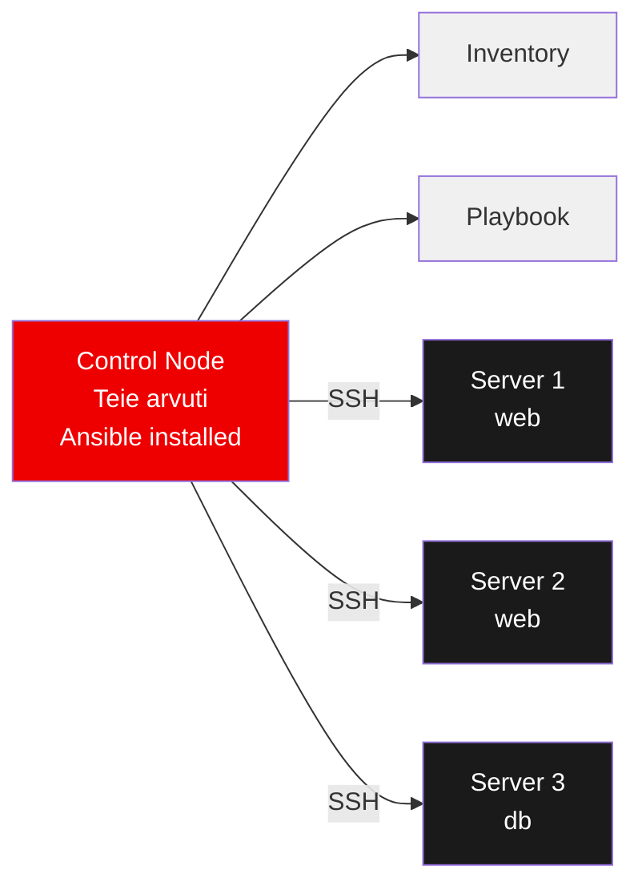
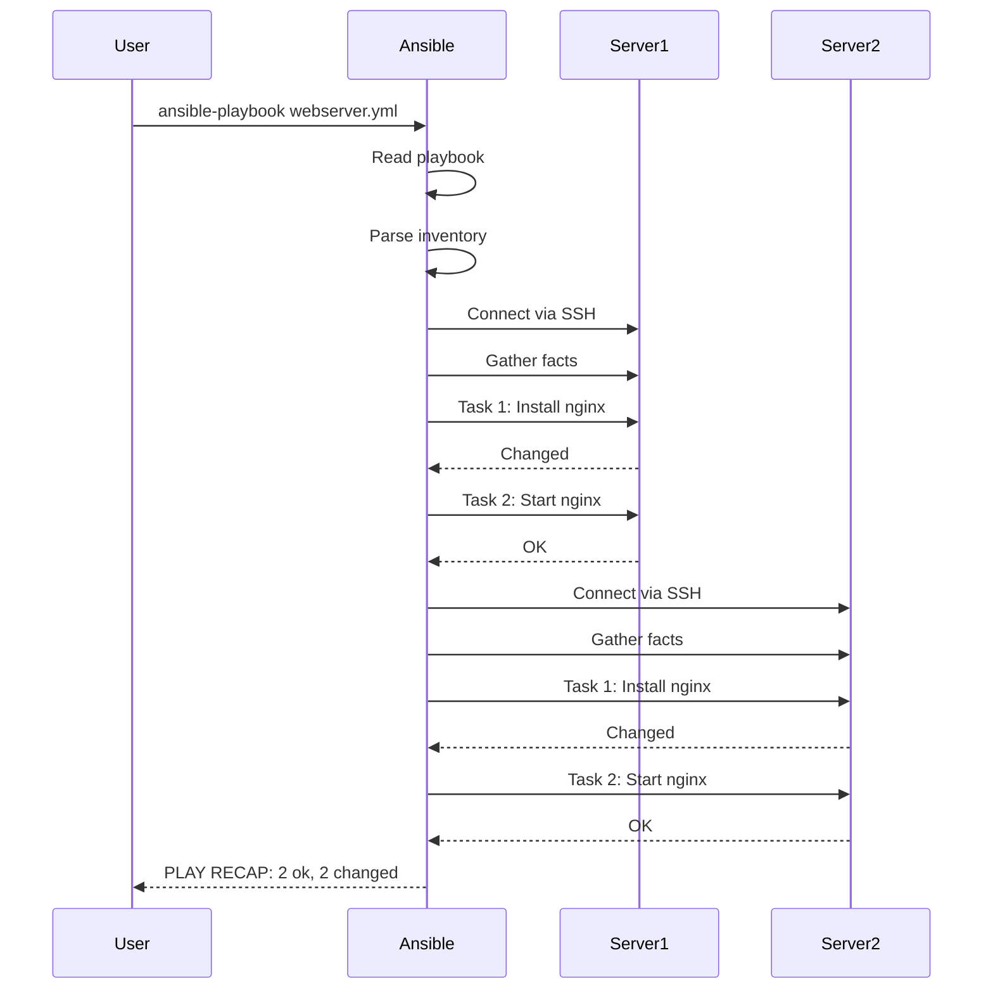

#  Ansible: Põhitõed

**Teemad:** Ansible arhitektuur, SSH setup, playbook'id, YAML, idempotence

---

##  Õpiväljundid

Pärast seda moodulit oskate:
- Selgitada, mis probleemi Ansible lahendab ja miks see on parem kui shell skriptid
- Seadistada SSH ühendusi ja inventory faile mitme serveri jaoks
- Kirjutada YAML süntaksiga playbook'e ja kasutada põhilisi mooduleid
- Kasutada ad-hoc käske kiireks serverite haldamiseks
- Rakendada idempotentsuse printsiipi ja best practices'eid

---

##  Mis on Ansible?

Selles jaotises selgitame, millist probleemi Ansible lahendab ja miks on mõistlik automatiseerida. Fookus on lihtsal vaatel: mida Ansible teeb teisiti kui käsitsi skriptimine.

Ansible on automatiseerimistööriist, mis laseb hallata mitmeid arvuteid korraga. Mõelge sellele nagu kaugjuhtimispuldile - ühest kohast saate kontrollida ja seadistada kümneid või sadu servereid. Kui tavaliselt peaksite iga serverisse eraldi SSH-ga sisse logima ja käske käsitsi sisestama, siis Ansible võimaldab sama toimingu teha kõikidel serveritel samaaegselt. See on erinevus, mis muudab ühe tunni töö viie minutiliseks.

### Miks Ansible on kasulik?

- **Aeg säästub** - ei pea iga serverisse eraldi sisse logima
- **Vead vähenevad** - automatiseerimine vähendab käsitsi tehtavaid vigu  
- **Järjepidevus** - kõik serverid saavad sama konfiguratsiooni
- **Skaleeritavus** - hõlpsalt lisada uusi servereid

## Kuidas Ansible töötab?

Kõrgtasemel voog: juhtarvuti (control node) + inventory + playbook + SSH. Joonis allpool näitab, kuidas käsud liiguvad ning miks agentita lähenemine on lihtsam haldada.



**Põhiprintsiibid:**
- **Agentless:** Ei pea serveritesse midagi installima (ainult SSH)
- **Push model:** Control node lükkab konfiguratsiooni serveritesse
- **Idempotent:** Sama käsk võib jooksutada mitu korda, tulemus on alati sama

Ansible kasutab SSH ühendust (sama, mida tavaliselt kasutate serverisse sisselogimiseks). Erinevalt paljudest teistest tööriistadest ei pea serveritesse midagi täiendavat installima. See tähendab, et teil pole vaja hallata lisatarkvara uuendusi ega muretseda, kas agent-tarkvara on kõikides serverites samas versioonis.

## Esimesed sammud

Alustame kolme sammuga: paigaldus, SSH võtmed ja inventory. Pärast seda saame esimese pingi testiga kinnitada, et ühendus töötab.

### 1. Ansible installimine

Ubuntu/Debian:
```bash
sudo apt update
sudo apt install ansible
```

CentOS/RHEL:
```bash
sudo yum install ansible
```

### 2. SSH võtmete seadistamine

Enne Ansible kasutamist peate seadistama SSH võtmed, et saaksite serveritesse sisse logida ilma parooli küsimiseta. SSH võtmete kasutamine on mitte ainult mugavam, vaid ka turvalisem kui paroolide kasutamine, sest võtmeid on praktiliselt võimatu ära arvata. Lisaks säästab see teilt vajadust sisestada parooli iga kord, kui Ansible serveritega ühendub - automatiseerimisel võib see tähendada sadu ühendusi päevas.

```bash
# Võtme genereerimine
ssh-keygen -t ed25519 -f ~/.ssh/ansible_key

# Võtme kopeerimine serverisse
ssh-copy-id -i ~/.ssh/ansible_key.pub kasutaja@server.ip
```

### 3. Inventory faili loomine

Inventory fail ütleb Ansible'ile, millised serverid teil on. Looge fail nimega `inventory`. Gruppide kasutamine inventory failis on oluline, sest sageli soovite teha erinevaid toiminguid erinevat tüüpi serveritele - näiteks veebiserveritest ja andmebaasidest.

```ini
[webservers]
web1.example.com
web2.example.com

[databases]
db1.example.com
```

### 4. Esimene test

Kontrollige, kas Ansible saab serveritega ühendust:

```bash
ansible all -i inventory -m ping
```

Kui kõik töötab, peaksite nägema midagi sellist:
```
web1.example.com | SUCCESS => {
    "changed": false,
    "ping": "pong"
}
```

## Ansible käsurida

Ansible CLI võimaldab käivitada üksikuid käske (ad‑hoc) või kogu playbook’i. Allpool on struktuur ja sagedasemad lipud, mida igapäevaselt vaja läheb.

### Ansible käskude struktuur

Kõik Ansible käsud järgivad sama mustrit:
```bash
ansible <sihtmärk> -i <inventory> -m <moodul> -a "<argumendid>" [lisaoptsioonid]
```

Komponentide selgitus:
- `<sihtmärk>` - millised serverid (all, webservers, konkreetne server)
- `-i <inventory>` - inventory faili asukoht
- `-m <moodul>` - millist moodulit kasutada
- `-a "<argumendid>"` - mooduli parameetrid
- `[lisaoptsioonid]` - täiendavad seadistused

### Kiired ühekordsed käsud (ad-hoc)

Ad-hoc käsud on mõeldud kiireks testimiseks ja ühekordseks tööks, mida pole mõtet playbook'i kirjutada. Need on ideaalsed, kui vajate kiiresti kontrollida serverite seisundit või teha väikest muudatust, mida te kunagi enam ei vaja.

```bash
# Kõikide serverite uptime
ansible all -i inventory -m command -a "uptime"

# Paketi installimine
ansible webservers -i inventory -m package -a "name=nginx state=present" --become

# Teenuse käivitamine
ansible webservers -i inventory -m service -a "name=nginx state=started" --become

# Faili kopeerimine
ansible all -i inventory -m copy -a "src=config.txt dest=/tmp/"

# Mälu kasutuse kontroll
ansible all -i inventory -m shell -a "free -h"

# Kettaruumi kontroll
ansible all -i inventory -m shell -a "df -h"

# Konkreetse serveriga töötamine
ansible web1.example.com -i inventory -m ping

# Mitme grupi valimine
ansible webservers:databases -i inventory -m command -a "hostname"

# Grupi välistamine
ansible all:!databases -i inventory -m ping
```

### Olulised käsurea võtmed

```bash
# Admin õigused (sudo)
--become

# Verbose väljund (rohkem infot)
-v, -vv, -vvv

# Kuiv käivitamine (muudatusi ei tehta)
--check

# Muudatuste eelvaade
--diff

# Paralleelsuse piiramine
--forks 5

# Sudo parooli küsimine
--ask-become-pass

# Konkreetsete serverite piiramine
--limit web1,web2

# Muutujate edastamine
-e "variable=value"
```

**Märkused:**
- `--become` kasutage siis, kui vajate admin õigusi (sudo)
- `-i inventory` määrab, millist inventory faili kasutada
- `command` vs `shell` - command on turvalisem, shell lubab pipe'e ja redirection'i

### Kasulikud moodulid algajatele

| Moodul | Otstarve | Näide |
|--------|----------|-------|
| `ping` | Ühenduse test | `ansible all -m ping` |
| `command` | Käsu käivitamine | `ansible all -m command -a "date"` |
| `package` | Tarkvara paigaldus | `ansible all -m package -a "name=vim state=present"` |
| `service` | Teenuste haldamine | `ansible all -m service -a "name=nginx state=started"` |
| `copy` | Failide kopeerimine | `ansible all -m copy -a "src=file.txt dest=/tmp/"` |
| `file` | Failide ja kaustade haldamine | `ansible all -m file -a "path=/tmp/test state=directory"` |

## Playbook'id - korduv automatiseerimine

Kui soovite teha keerulisemaid asju või salvestada oma käsud tulevikuks, kasutage playbook'e. Need on YAML failid, mis kirjeldavad, mida teha. Playbook'id on nagu restseptid - kirjutate üks kord, käivitate mitu korda. Erinevalt ad-hoc käskudest saate playbook'ides kasutada keerulisemat loogikat, muutujaid ja tingimusi.



### Lihtne playbook näide

Looge fail `webserver.yml`:

```yaml
---
- name: Veebiserveri seadistamine
  hosts: webservers
  become: yes
  
  tasks:
    - name: Nginx installimine
      package:
        name: nginx
        state: present
    
    - name: Nginx käivitamine
      service:
        name: nginx
        state: started
        enabled: yes
    
    - name: Tulemüüri port avamine
      ufw:
        rule: allow
        port: 80
```

Playbook'i käivitamine:
```bash
ansible-playbook -i inventory webserver.yml
```

### YAML süntaksi põhitõed

- Taandrid on olulised (kasutage tühikuid, mitte tab'e)
- Loendid algavad `-` märgiga
- Võti-väärtus paarid eraldatakse `:` märgiga

```yaml
# Kommentaar
muutuja: väärtus
loend:
  - esimene_element
  - teine_element
objekt:
  alamvõti: alamväärtus
```

## Muutujate kasutamine

Ansible'is saate kasutada muutujaid, et teha playbook'id paindlikumaks. Muutujad võimaldavad teil kirjutada ühe playbook'i, mis töötab erinevates keskkondades või erinevate konfiguratsioonidega, muutes ainult muutujate väärtusi.

```yaml
---
- name: Rakenduse paigaldus
  hosts: webservers
  vars:
    app_name: "myapp"
    app_port: 8080
    app_user: "appuser"
  
  tasks:
    - name: "Kasutaja {{ app_user }} loomine"
      user:
        name: "{{ app_user }}"
        shell: /bin/bash
    
    - name: "Rakendus {{ app_name }} paigaldamine"
      package:
        name: "{{ app_name }}"
        state: present
```

### Muutujate allikad

```bash
# Käsurealt muutuja edastamine
ansible-playbook -e "app_version=2.0" playbook.yml

# Inventory failis
[webservers]
web1.example.com app_port=8080
web2.example.com app_port=9080
```

## Handlers - reageerides muudatustele

Handlers käivitatakse ainult siis, kui midagi tõesti muutub. See on oluline, sest teenuste taaskäivitamine on kulukas operatsioon - te ei taha nginx'i restartidata, kui konfiguratsioon ei muutunud. Handlers käivitatakse alati playbook'i lõpus pärast kõiki taske, isegi kui mitmed taskid sama handlerit kutsuvad.

```yaml
tasks:
  - name: Nginx konfiguratsiooni uuendamine
    copy:
      src: nginx.conf
      dest: /etc/nginx/nginx.conf
    notify: restart nginx
    
  - name: SSL sertifikaadi lisamine  
    copy:
      src: cert.pem
      dest: /etc/ssl/cert.pem
    notify: restart nginx

handlers:
  - name: restart nginx
    service:
      name: nginx
      state: restarted
```

## Tingimused ja tsüklid

### When tingimused
```yaml
tasks:
  - name: Ubuntu paketid
    package:
      name: ufw
      state: present
    when: ansible_distribution == "Ubuntu"
    
  - name: CentOS paketid  
    package:
      name: firewalld
      state: present
    when: ansible_distribution == "CentOS"
```

### Loop tsüklid
```yaml
tasks:
  - name: Mitme paketi installimine
    package:
      name: "{{ item }}"
      state: present
    loop:
      - vim
      - git
      - curl
      - wget
```

## Faktide kasutamine

Ansible kogub automaatselt infot serverite kohta igal käivitamisel. Need faktid on nagu serveri "pass", mis sisaldab kõiki olulisi andmeid. Faktide kogumine toimub iga playbook'i käivitamisel automaatselt ning see võtab mõne sekundi - see on põhjus, miks näete "Gathering Facts" sammu iga playbook'i alguses.

```bash
# Kõigi faktide vaatamine (väga palju infot!)
ansible all -m setup

# Ainult võrgu info (filtreerimine on oluline)
ansible all -m setup -a "filter=ansible_default_ipv4"

# OS distributsioon ja versioon
ansible all -m setup -a "filter=ansible_distribution*"

# Mälu info megabaitides
ansible all -m setup -a "filter=ansible_memory_mb"

# CPU info
ansible all -m setup -a "filter=ansible_processor*"
```

**Kasulikumad faktid:**
- `ansible_hostname` - serveri nimi
- `ansible_default_ipv4.address` - IP aadress
- `ansible_distribution` - OS (Ubuntu, CentOS, Debian)
- `ansible_distribution_version` - OS versioon (20.04, 7, jne)
- `ansible_memtotal_mb` - kogu RAM megabaitides
- `ansible_processor_cores` - CPU tuumade arv

Faktide kasutamine playbook'is:
```yaml
tasks:
  - name: "Serveri {{ ansible_hostname }} seadistamine"
    debug:
      msg: "Seadistan {{ ansible_distribution }} {{ ansible_distribution_version }} serverit IP-ga {{ ansible_default_ipv4.address }}"
  
  - name: Suur mälu - paigaldan vahemälu
    package:
      name: memcached
      state: present
    when: ansible_memtotal_mb > 4096    # Ainult kui üle 4GB RAM

  - name: Logi faili asukohad erinevates OS'ides
    file:
      path: "{{ log_path }}"
      state: directory
    vars:
      log_path: "{{ '/var/log/myapp' if ansible_os_family == 'Debian' else '/var/log/messages' }}"
```

## Ansible.cfg konfigureerimine

Ansible.cfg fail määrab, kuidas Ansible käitub. See on nagu Ansible'i seadistuste fail, mis säästab teilt vajadust iga kord lisaparameetreid kirjutada. Ilma selle failita peaksite iga käsu juurde kirjutama `-i inventory`, `--become` ja teisi parameetreid - konfiguratsioonifail automatiseerib selle.

Looge projekti kausta fail `ansible.cfg`:

```ini
[defaults]
# Kus asub inventory (vaikimisi ./inventory)
inventory = inventory

# SSH host key kontroll välja lülitatud (turvalisuse vs. mugavuse kompromiss)
host_key_checking = False

# Vaikimisi kasutaja kõigil serveritel
remote_user = ubuntu

# SSH privaatvõtme asukoht
private_key_file = ~/.ssh/ansible_key

# Logi fail (debugimiseks kasulik)
log_path = ./ansible.log

# Paralleelsus - mitu serverit samaaegselt (vaikimisi 5)
forks = 10

# Ühenduse timeout sekundites
timeout = 30

[privilege_escalation]
# Automaatselt kasuta sudo kõikidel käskudel
become = True
become_method = sudo
become_user = root
# become_ask_pass = False  # Ei küsi sudo parooli (eeldab passwordless sudo)

[ssh_connection]
# SSH ühenduste optimeerimine (kiirendab palju!)
ssh_args = -o ControlMaster=auto -o ControlPersist=60s
pipelining = True
retries = 3
```

**Konfiguratsiooni otsingu järjekord:**
1. `ANSIBLE_CONFIG` keskkonna muutuja
2. `ansible.cfg` praeguses kaustas (soovitatud)
3. `~/.ansible.cfg` teie kodukaustas
4. `/etc/ansible/ansible.cfg` süsteemselt

**Konfiguratsiooni kontroll:**
```bash
# Vaata mis konfiguratsioon on kasutusel
ansible-config view

# Kõik võimalikud seadistused
ansible-config dump
```

## Tüüpilised vead ja lahendused

### 1. SSH ühenduse probleem
```
Permission denied (publickey)
```
**Lahendus:** Kontrollige SSH võtmete seadistust ja ansible.cfg. Kõige sagedamini tuleb see viga siis, kui Ansible kasutab valet SSH võtit või õiget võtit pole serverisse kopeeritud.

### 2. Sudo parool küsitakse
```
sudo: a password is required
```
**Lahendus:** Lisage `--ask-become-pass` või seadistage passwordless sudo. Ansible eeldab vaikimisi, et sudo ei küsi parooli, mis on tavaline produktsiooniserverites.

### 3. Python puudub
```
/usr/bin/python: not found
```
**Lahendus:** Installige Python või lisa inventory faili:
```ini
[webservers]
server1 ansible_python_interpreter=/usr/bin/python3
```

### 4. Idempotency rikutud
```
changed: [server] (item=command_that_always_runs)
```
**Lahendus:** Kasutage `creates` või `removes` parameetreid. Idempotentsus tähendab, et kui käivitate sama playbook'i mitu korda, siis pärast esimest korda ei peaks midagi enam muutuma - see on oluline, et vältida soovimatud muudatused.
```yaml
- name: Käsk mis peaks ainult üks kord käima
  command: /opt/install.sh
  args:
    creates: /opt/installed.flag
```

## Järgmised sammud

Kui olete põhitõed selgeks saanud:

1. **Õppige rohkem mooduleid** - vaadake Ansible dokumentatsiooni
2. **Kasutage rolle** - korduvkasutatavad playbook'i osad
3. **Vault** - paroolide ja tundliku info turvaliseks hoidmiseks
4. **Templates** - konfiguratsioonifailide dünaamiliseks genereerimiseks

## Kasulikud ressursid

- Ansible ametlik dokumentatsioon: https://docs.ansible.com/
- Ansible Galaxy: valmis rollide kogumik
- Ansible lint: playbook'ide kvaliteedi kontrollimiseks

---

**Meeldetuletus:** Alustage väiksest! Proovige esmalt ühe serveriga, seejärel laiendage rohkematele.