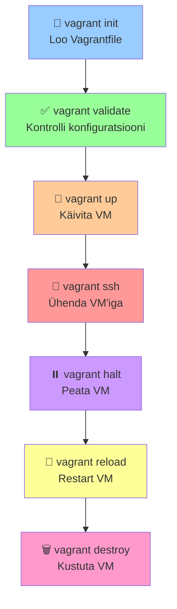

# 📚 Ansible Roles: Roles ja Puppet
## Teemad: Vagrant basics, Ansible roles structure, Role variables ja dependencies, Ansible Galaxy, Puppet fundamentals, Puppet vs Ansible võrdlus

Tere tulemast tagasi! Eelmisel nädalal õppisime Ansible'i variables, templates ja vault'i kasutamist. Täna astume järgmise suure sammu - õpime kirjutama **professionaalset infrastruktuuri koodi** ja võrdleme erinevaid tööriistu.

---

# Osa 1: Vagrant Testing Environment
## Loeng 1: Vagrant Basics for Testing (15 min)

## Miks me vajame testikeskkonda?

Kui töötate Ansible playbook'ide või Puppet manifest'idega, **ei saa neid testida toodangu serveritest**! Vajate turvalist keskkonda, kus:

- ✅ **Võib üles lüüa** - kui midagi läheb valesti
- ✅ **Kiire reset** - uus puhas server sekundites  
- ✅ **Erinevad OS'id** - Ubuntu, CentOS, Debian testimiseks
- ✅ **Ei maksa raha** - cloud VM'ide asemel

**Vagrant lahendab täpselt selle probleemi!**

## Mis on Vagrant?

**Vagrant** = Virtual Machine management tool:

```bash
# Looge VM sekunditega
vagrant init ubuntu/jammy64
vagrant up

# Ühendage VM'iga
vagrant ssh

# Hävitage ja alustage uuest
vagrant destroy -f
vagrant up
```

## Vagrant Project Setup

### Basic Vagrantfile:
```ruby
# Vagrantfile
Vagrant.configure("2") do |config|
  # Base box (OS image)
  config.vm.box = "ubuntu/jammy64"
  
  # VM resources
  config.vm.provider "virtualbox" do |vb|
    vb.memory = "2048"
    vb.cpus = 2
  end
  
  # Network settings
  config.vm.network "private_network", ip: "192.168.56.10"
  
  # Shared folders
  config.vm.synced_folder ".", "/vagrant"
  
  # Ansible provisioning
  config.vm.provision "ansible" do |ansible|
    ansible.playbook = "site.yml"
    ansible.inventory_path = "inventory/vagrant"
  end
end
```

### Multi-VM Setup:
```ruby
Vagrant.configure("2") do |config|
  # Ansible test VM
  config.vm.define "ansible-vm" do |ansible|
    ansible.vm.box = "ubuntu/jammy64"
    ansible.vm.network "private_network", ip: "192.168.56.11"
    ansible.vm.hostname = "ansible-test"
  end
  
  # Puppet test VM  
  config.vm.define "puppet-vm" do |puppet|
    puppet.vm.box = "ubuntu/jammy64"
    puppet.vm.network "private_network", ip: "192.168.56.12"
    puppet.vm.hostname = "puppet-test"
  end
end
```

## Vagrant Lifecycle



```bash
# Projekt setup
vagrant init                # Loo Vagrantfile
vagrant validate           # Kontrolli konfiguratsiooni

# VM management
vagrant up                 # Käivita VM
vagrant ssh                # Ühenda VM'iga
vagrant halt               # Peata VM
vagrant reload             # Restart VM
vagrant destroy            # Kustuta VM

# Snapshots ja info
vagrant snapshot save clean    # Salvesta snapshot
vagrant snapshot restore clean # Taasta snapshot
vagrant status                 # Vaata VM olekut
```

## Vagrant + Ansible Integration

**Automaatne provisioning:**
```ruby
config.vm.provision "ansible" do |ansible|
  ansible.playbook = "site.yml"
  ansible.inventory_path = "inventory"
  ansible.limit = "all"
  ansible.verbose = "v"
end
```

**Manual provisioning:**
```bash
# VM käimas, provisioning käsitsi
vagrant up --no-provision
vagrant ssh
# VM sees: install Ansible, run playbooks
```

## Demo: Quick Vagrant Test

```bash
# 1. Loo test projekt
mkdir vagrant-demo && cd vagrant-demo

# 2. Initialize Vagrant
vagrant init ubuntu/jammy64

# 3. Start VM
vagrant up

# 4. Connect and test
vagrant ssh
sudo apt update
exit

# 5. Cleanup
vagrant destroy -f
```

**💡 Protip:** Vagrant'iga saate testida sama playbook'i erinevatel OS'idel!

---

# Osa 2: Ansible Roles tutvustus  
## Loeng 2: Ansible Roles Architecture (18 min)

## Miks vajame role'e? Spagettikood probleem

Kujutage ette olukorda: teie boss tuleb teie juurde ja ütleb:
> "Palun seadista mulle 50 veebiserveri, 20 andmebaasiserveri ja 30 monitoring serveri. Kõik peavad olema identse konfiguratsiooniga ja ma vajan seda homme valmis."

**Kuidas te seda tegema hakkaksite?**

Enamik algajaid hakkab kirjutama üht suurt playbook'i:

```yaml
# monster-playbook.yml - 800+ rida õudust!
- name: "Kõik ühes failis - ära tehke kunagi nii!"
  hosts: all
  tasks:
    # 100 task'i nginx jaoks
    - name: "Install nginx"
    - name: "Configure nginx main config"  
    - name: "Setup nginx virtual hosts"
    - name: "Generate SSL certificates for nginx"
    - name: "Configure nginx security headers"
    # ... veel 95 task'i nginx jaoks
    
    # 80 task'i mysql jaoks
    - name: "Install mysql server"
    - name: "Configure mysql users"
    - name: "Setup mysql databases"
    # ... veel 77 task'i mysql jaoks
    
    # 60 task'i monitoring jaoks
    - name: "Install prometheus"
    - name: "Configure grafana"
    # ... veel 58 task'i monitoring jaoks
    
    # 40 task'i backup jaoks
    # 30 task'i SSL jaoks
    # 50 task'i security jaoks
    # ja nii edasi...
```

**See on kohutav lahendus!** Miks?

1. **Võimatu lugeda** - 800+ rida ühes failis
2. **Võimatu testida** - peate testima kogu faili korraga
3. **Ei saa korduvkasutada** - kui vajate nginx'i teises projektis?
4. **Meeskonnatöö võimatu** - kuidas jagada kolleegidega?
5. **Muudatused riskantne** - ühe asja muutmine võib midagi muud lõhkuda

Ma olen näinud selliseid 2000+ realisi playbook'e päris firmades. Need on nagu spagettikood - keegi ei tea, mis kuhu kuulub!

---

## Mis on Ansible Role? LEGO klotsid meetod

**Ansible Role on nagu LEGO klots.**

Mõelge LEGO peale:
- Iga klots teeb **ühte asja hästi** (auto ratas, sein, katus)
- Klotsid on **standardsed** - sobivad alati kokku
- Klotsid on **korduvkasutatavad** - sama ratas sobib auto ja lennuki külge
- Klotsid on **kombineeritavad** - saate ehitada maju, autosid, linnu

**Role'id töötavad täpselt samamoodi:**

```yaml
# site.yml - selge ja lihtne!
- name: "Web servers setup"
  hosts: webservers
  roles:
    - common      # Põhiseadistused (SSH, users, firewall)
    - nginx       # Ainult veebiserver  
    - php         # Ainult PHP runtime
    - ssl         # Ainult SSL sertifikaadid

- name: "Database servers setup"
  hosts: dbservers
  roles:
    - common      # SAMA common role!
    - mysql       # Ainult andmebaas
    - backup      # Ainult varundamine

- name: "Monitoring servers setup"
  hosts: monitoring
  roles:
    - common      # SAMA common role taas!
    - prometheus  # Ainult monitoring
    - grafana     # Ainult dashboardid
```

**Vaadake, mis toimus:**
- `common` role kasutatakse **kolmes erinevas kohas**
- Iga role teeb **ainult ühte asja**
- Kood on **selge ja loetav**
- Saame **osasid eraldi testida**

---

## Role'i anatoomia: Maja ehitamise meetod

Mõelge role'ile nagu maja ehitamisele. Igal osalisel on oma koht ja eesmärk:

```
nginx-role/
├── README.md              # "Kasutusjuhend" - kuidas role't kasutada
├── meta/main.yml          # "Ehitusluba" - dependencies, nõuded
├── defaults/main.yml      # "Standardmaterjalid" - vaikimisi seaded
├── vars/main.yml          # "Kindlad materjalid" - muutumatud seaded
├── tasks/main.yml         # "Ehitusplaan" - sammud järjest
├── handlers/main.yml      # "Häiresüsteemid" - reaktsioonid muudatustele
├── templates/             # "Kohandatavad osad" - konfiguratsioonifailid
│   └── nginx.conf.j2
├── files/                 # "Valmis detailid" - skriptid, sertifikaadid
│   └── startup.sh
└── tests/                 # "Kontrollid" - kas maja püsib püsti
    └── test.yml
```

### Iga kausta eesmärk:

**`tasks/`** = Ehitusplaan
- Sisaldab kõiki samme, mis role teeb
- **Alati alustage siit** role'i lugemisel

**`defaults/`** = Standardmaterjalid  
- Vaikimisi seaded, mida saab muuta
- **Madalaim prioriteet** - kõik muu kirjutab üle

**`vars/`** = Kindlad materjalid
- Seaded, mida role ise määrab
- **Kõrge prioriteet** - raske üle kirjutada

**`templates/`** = Kohandatavad osad
- Konfiguratsioonifailid, mida saab muutujatega kohandada
- Kasutab Jinja2 template engine'i

**`files/`** = Valmis detailid
- Staatilised failid, mis kopeeritakse otse
- Skriptid, sertifikaadid, etc.

**`handlers/`** = Häiresüsteemid
- Käivitatakse ainult siis, kui midagi muutus
- Tavaliselt teenuste restart'imine

**`meta/`** = Ehitusluba
- Kirjeldab, mida role vajab tööks
- Dependencies teiste role'idega

---

## Lihtne nginx role näide

Vaatame, kuidas lihtsaim nginx role välja näeks:

**`tasks/main.yml` - mis me teeme:**
```yaml
---
- name: "Install Nginx (alati kirjutage selged nimed!)"
  package:
    name: nginx
    state: present

- name: "Configure Nginx (kasutame template'i)"
  template:
    src: nginx.conf.j2
    dest: /etc/nginx/nginx.conf
  notify: restart nginx    # See käivitab handler'i!

- name: "Start Nginx (enable = autostart boot'imisel)"
  service:
    name: nginx
    state: started
    enabled: yes
```

**`defaults/main.yml` - vaikimisi seaded:**
```yaml
---
nginx_port: 80              # Enamik tahab port 80
nginx_user: www-data        # Ubuntu standard user
nginx_worker_processes: 2   # Mõistlik algus
nginx_max_connections: 1024 # Piisav väikesele saidile
```

**`templates/nginx.conf.j2` - konfiguratsioon:**
```nginx
user {{ nginx_user }};
worker_processes {{ nginx_worker_processes }};

events {
    worker_connections {{ nginx_max_connections }};
}

http {
    server {
        listen {{ nginx_port }};
        server_name _;
        root /var/www/html;
        index index.html;
    }
}
```

**`handlers/main.yml` - reaktsioonid:**
```yaml
---
- name: restart nginx
  service:
    name: nginx
    state: restarted
```

**Näete, kui lihtne see on?** Iga fail teeb ühte asja ja need töötavad koos!

---

## Variable Precedence: Muutujate hierarhia

Ansible'is on muutujatel tähtsusjärjekord. See on üks keerulisemaid teemasid, aga **väga oluline mõista!**

Kõrgemad kirjutavad üle madalamad:

```
1. Command line (-e var=value)    ← KÕIGE TUGEVAM (käsk)
2. Task vars                      
3. Block vars
4. Role vars                      ← vars/main.yml
5. Include vars
6. Set_facts
7. Registered vars
8. Host facts
9. Play vars
10. Host vars
11. Group vars  
12. Role defaults                 ← KÕIGE NÕRGEM (soovitus)
```

### Praktiline näide hierarhiast:

```yaml
# defaults/main.yml (kõige nõrgem)
nginx_port: 80

# vars/main.yml (tugev)
nginx_port: 8080

# playbook.yml (tugevam)
- role: nginx
  vars:
    nginx_port: 9000

# Käsureal (kõige tugevam)
ansible-playbook site.yml -e nginx_port=3000
```

**Tulemus:** nginx kuulab port **3000**!

### Kuidas seda meeles pidada:

- **Role defaults** = "Soovitused" (nõrgad)
- **Role vars** = "Reeglid" (tugevad)  
- **Play vars** = "Käsud" (tugevamad)
- **Extra vars** = "Käsklused" (kõige tugevamad)

---

## Role'ide kasutamine playbook'is

### 1. Lihtne kasutamine:
```yaml
- name: "Deploy web application"
  hosts: webservers
  become: yes
  roles:
    - nginx
    - php
    - mysql-client
```

### 2. Muutujatega kasutamine:
```yaml
- name: "Custom web server setup"
  hosts: webservers
  become: yes
  roles:
    - role: nginx
      vars:
        nginx_port: 8080
        nginx_ssl_enabled: true
        nginx_worker_processes: 4
```

### 3. Conditional role'id:
```yaml
- name: "Environment-specific deployment"
  hosts: all
  become: yes
  roles:
    - common
    - role: nginx
      when: "'webservers' in group_names"
    - role: mysql
      when: "'dbservers' in group_names"
    - role: monitoring
      when: app_env == "production"
```

---

# Osa 2: Role Creation Best Practices
## Loeng 2: Professionaalsed standardid (15 min)

Nüüd kui teate, mis on role, õpime, kuidas teha neid **õigesti**. Ma olen näinud tuhandeid halbu role'e - aga hea uudis on see, et on lihtsad reeglid, mis muudavad teie role'id professionaalseteks!

---

## Reegel 1: Single Responsibility Principle

**"Üks role = üks vastutus"**

See on kõige olulisem reegel. Iga role peaks tegema täpselt ühte asja ja tegema seda hästi.

### Hea lähenemine ✅
```
roles/
├── nginx/         # AINULT veebiserver
├── mysql/         # AINULT andmebaas
├── php/           # AINULT PHP runtime
├── ssl/           # AINULT SSL sertifikaadid
├── backup/        # AINULT varundamine
└── monitoring/    # AINULT jälgimine
```

### Halb lähenemine ❌
```
roles/
└── web-stack/     # Teeb KÕIKE korraga:
                   # nginx + mysql + php + ssl + backup + monitoring
```

**Miks see halb?**
- Kui MySQL vajab parandust, peate puutuma nginx'iga
- Ei saa nginx'i kasutada ilma MySQL'ita
- Raske testida - peate testima kõike korraga
- Suur ja keeruline - keegi ei saa aru

**Praktiline näide:**

Kujutage ette, et teil on `web-stack` role, mis teeb kõike. Siis tuleb uus projekt, kus vaja ainult nginx'i (ilma MySQL'ita). Mida te teete?

1. **Halvad valikud:**
   - Kopeerite koodi ja eemaldatae MySQL osad (DRY printsiibi rikkumine)
   - Lisate tuhandeeid `when` tingimusi (keeruline)
   - Kasutate kogu role'i ja ignoreerite MySQL'i (raisatud ressursid)

2. **Hea valik:**
   - Kasutate eraldi `nginx` role'i - töötab kohe!

---

## Reegel 2: 80/20 Konfigureeritavus

**80% juhtudest peaks role töötama vaikimisi seadetega!**

See tähendab, et algajad saavad kohe alustada, aga eksperdid saavad kõike muuta.

### Algajasõbralik defaults
```yaml
# defaults/main.yml - lihtne ja toimib kohe
webserver_port: 80                    # Kõik teavad port 80
webserver_ssl_enabled: false          # SSL on optional
webserver_user: www-data              # Ubuntu standard
webserver_worker_processes: 2         # Mõistlik algus

# Lihtsad moodulid
webserver_modules:
  - rewrite    # URL rewriting
  - ssl        # HTTPS support
```

### Eksperdi võimalused
```yaml
# playbook.yml - ekspert saab kõike muuta
- role: webserver
  vars:
    webserver_port: 443
    webserver_ssl_enabled: true
    webserver_ssl_cert: "/path/to/custom.pem"
    webserver_worker_processes: 8
    
    # Eksperdi moodulid
    webserver_modules:
      - rewrite
      - ssl
      - headers
      - deflate
      - geoip
      - rate_limit
    
    # Täiesti custom konfiguratsioon
    webserver_custom_config: |
      # Minu spetsiaalne konfiguratsioon
      gzip on;
      gzip_types text/css application/javascript;
      
      location /api/ {
          proxy_pass http://backend;
          proxy_set_header Host $host;
      }
```

**Võtmepunktid:**
- **Defaults** peavad olema turvalised ja mõistlikud
- **Kõik peab olema üle kirjutatav** advanced kasutajatele
- **Dokumendiga peab olema näidete** mõlemale tasemele

---

## Reegel 3: Multi-OS tugi

Professionaalne role toetab mitut operatsioonisüsteemi. See tähendab, et sama role töötab Ubuntu's, Debian'is, CentOS'is, jne.

### Kuidas seda organiseerida:

```
webserver-role/
├── vars/
│   ├── main.yml           # Ühised muutujad
│   ├── Debian.yml         # Ubuntu/Debian spetsiifilised
│   ├── RedHat.yml         # CentOS/RHEL spetsiifilised
│   └── Ubuntu.yml         # Ubuntu eripärad
└── tasks/
    ├── main.yml           # Peamine loogika
    ├── install-Debian.yml # Debian installeerimise viis
    └── install-RedHat.yml # RedHat installeerimise viis
```

### Smart approach - OS detection:

**`tasks/main.yml`:**
```yaml
---
- name: "Load OS-specific variables (smart trick!)"
  include_vars: "{{ item }}"
  with_first_found:
    - "{{ ansible_distribution }}.yml"        # Ubuntu.yml
    - "{{ ansible_os_family }}.yml"           # Debian.yml
    - "main.yml"                              # fallback

- name: "Install packages (OS-specific way)"
  include_tasks: "install-{{ ansible_os_family }}.yml"

- name: "Configure webserver (universal)"
  include_tasks: configure.yml
```

**`vars/Debian.yml` (Ubuntu/Debian):**
```yaml
---
webserver_package: "nginx"
webserver_service: "nginx"  
webserver_config_path: "/etc/nginx"
webserver_user: "www-data"        # Debian kasutab www-data
webserver_group: "www-data"
webserver_log_path: "/var/log/nginx"
```

**`vars/RedHat.yml` (CentOS/RHEL):**
```yaml
---
webserver_package: "nginx"
webserver_service: "nginx"
webserver_config_path: "/etc/nginx"
webserver_user: "nginx"           # RedHat kasutab nginx
webserver_group: "nginx"
webserver_log_path: "/var/log/nginx"
```

**Miks see on kasulik?**
- Role töötab automaatselt erinevates OS'ides
- Ei pea meeles pidama OS erinevusi
- Saate testida mitmes keskkonnas

---

## Reegel 4: Alati valideerige sisendeid!

Ma olen näinud tudengeid, kes unustavad valideerimise. Tulemus on segadus ja cryptic error message'id.

**Iga role peaks kontrollima:**
1. Kas kohustuslikud muutujad on määratud?
2. Kas muutujate väärtused on mõistlikud?
3. Kas süsteem vastab nõuetele?

### Parameetrite valideerimine

**`tasks/validate.yml`:**
```yaml
---
- name: "Validate port number (critical check!)"
  assert:
    that:
      - webserver_port is defined
      - webserver_port is number
      - webserver_port > 0
      - webserver_port < 65536
    fail_msg: |
      ERROR: webserver_port must be a valid port number (1-65535)
      Current value: {{ webserver_port | default('undefined') }}

- name: "Validate SSL settings when enabled"
  assert:
    that:
      - webserver_ssl_cert_path is defined
      - webserver_ssl_key_path is defined
      - webserver_ssl_cert_path | length > 0
      - webserver_ssl_key_path | length > 0
    fail_msg: |
      ERROR: SSL sertifikaadi teed peavad olema määratud kui SSL on lubatud!
      webserver_ssl_cert_path: {{ webserver_ssl_cert_path | default('undefined') }}
      webserver_ssl_key_path: {{ webserver_ssl_key_path | default('undefined') }}
  when: webserver_ssl_enabled | default(false)

- name: "Check available disk space"
  assert:
    that:
      - ansible_mounts | selectattr('mount', 'equalto', '/') | list | first | map(attribute='size_available') | first > 1000000000
    fail_msg: "ERROR: Vaja vähemalt 1GB vaba ruumi root partitsioonil"

- name: "Validate worker processes count"
  assert:
    that:
      - webserver_worker_processes is number
      - webserver_worker_processes > 0
      - webserver_worker_processes <= (ansible_processor_vcpus * 2)
    fail_msg: |
      ERROR: Worker processes arv peab olema 1 kuni {{ ansible_processor_vcpus * 2 }}
      (max 2x CPU core'ide arv)
      Current value: {{ webserver_worker_processes }}
```

### Süsteemi nõuete kontroll

```yaml
- name: "Check minimum RAM requirement"
  assert:
    that:
      - ansible_memtotal_mb >= 512
    fail_msg: "ERROR: Vaja vähemalt 512MB RAM'i. Hetkel: {{ ansible_memtotal_mb }}MB"

- name: "Check if required user exists or can be created"
  user:
    name: "{{ webserver_user }}"
    state: present
  check_mode: yes
  register: user_check
  failed_when: false

- name: "Create webserver user if doesn't exist"
  user:
    name: "{{ webserver_user }}"
    system: yes
    shell: /bin/false
    home: "/var/lib/{{ webserver_user }}"
    createhome: no
  when: user_check is failed
```

---

## Reegel 5: Task'ide organiseerimine

**`tasks/main.yml` peaks olema nagu sisukord** - selge ülevaade, mis toimub.

### Hea struktuur:
```yaml
---
# tasks/main.yml - sisukord
- name: "Validate input parameters (safety first!)"
  include_tasks: validate.yml

- name: "Load OS-specific variables"  
  include_vars: "{{ ansible_os_family }}.yml"

- name: "Install packages and dependencies"
  include_tasks: install.yml

- name: "Configure webserver"
  include_tasks: configure.yml

- name: "Setup SSL certificates"
  include_tasks: ssl.yml
  when: webserver_ssl_enabled | default(false)

- name: "Configure virtual hosts"
  include_tasks: vhosts.yml
  when: webserver_vhosts | length > 0

- name: "Start and enable services"
  include_tasks: service.yml

- name: "Run post-installation tests"
  include_tasks: test.yml
  when: webserver_run_tests | default(true)
```

### Miks see on hea?
1. **Selge ülevaade** - näete kohe, mis toimub
2. **Modulaarne** - iga osa eraldi failis
3. **Conditional** - mittevajaliud osad jäetakse vahele
4. **Testitav** - saate osi eraldi käivitada

### Task'ide nimetamine
**Head nimed:**
```yaml
- name: "Install Nginx and required dependencies"
- name: "Generate SSL certificate for {{ webserver_domain }}"
- name: "Configure Nginx virtual host for {{ item.domain }}"
- name: "Restart Nginx service if configuration changed"
```

**Halvad nimed:**
```yaml
- name: "install"
- name: "config"
- name: "setup stuff"
- name: "do things"
```

---

## Dependency Management

Mõnikord teie role vajab teisi role'e. Näiteks `wordpress` role vajab `nginx`, `php` ja `mysql` role'e.

### Meta dependencies:
```yaml
# meta/main.yml
dependencies:
  - role: common
    vars:
      common_packages:
        - curl
        - wget
        - unzip
  
  - role: nginx
    vars:
      nginx_modules:
        - rewrite
        - ssl
  
  - role: php
    vars:
      php_version: "8.1"
      php_extensions:
        - mysql
        - gd
        - curl
    when: wordpress_install_php | default(true)
  
  - role: mysql
    vars:
      mysql_databases:
        - name: "{{ wordpress_db_name }}"
      mysql_users:
        - name: "{{ wordpress_db_user }}"
          password: "{{ wordpress_db_password }}"
          priv: "{{ wordpress_db_name }}.*:ALL"
    when: wordpress_manage_database | default(true)
```

**Mis toimub:**
1. Kui kutsute `wordpress` role'i, käivitatakse automaatselt kõik dependencies
2. Igale dependency'le saate anda eraldi muutujad
3. Saate dependency'sid välja lülitada `when` tingimustega

---

# Osa 3: Ansible Galaxy
## Loeng 3: Galaxy ecosystem (12 min)

Nüüd kui oskate role'e luua, õpime, kuidas kasutada **maailma suurimat Ansible role'ide repositooriumi**. Miks teha kõike ise, kui saate kasutada teiste head tööd?

---

## Mis on Ansible Galaxy?

**Ansible Galaxy** on nagu **App Store programmeerijatele**:

📦 **20,000+ valmis role'i**  
🔍 **Kiire otsing ja filtreerimine**  
⭐ **Reitingud ja arvustused**  
📤 **Jagamine kogukonnaga**  

### Praktiline näide

**Probleem:** Boss tahab Jenkins + MySQL + SSL serveri homme valmis.

**Ilma Galaxy'ta:** 6 päeva role'ide kirjutamist  
**Galaxy'ga:** 45 minutit role'ide allalaadimist ja konfigureerimist

---

## Role'ide allalaadimine

### Otsimine
```bash
# Veebi kaudu (algajatele)
firefox https://galaxy.ansible.com/

# Käsurealt (kiire)
ansible-galaxy search nginx
ansible-galaxy search --author geerlingguy
```

### Installimine
```bash
# Üks role
ansible-galaxy install geerlingguy.nginx

# Konkreetne versioon (production!)
ansible-galaxy install geerlingguy.nginx,2.8.0

# GitHubist otse
ansible-galaxy install git+https://github.com/geerlingguy/ansible-role-nginx.git
```

### Requirements fail (professional way)
```yaml
# requirements.yml
---
- name: geerlingguy.nginx
  version: "2.8.0"        # Lukusta versioon!

- name: geerlingguy.mysql
  version: "4.3.0"

- name: geerlingguy.php
  version: "4.9.0"

# Custom GitHubi role
- src: https://github.com/mycompany/custom-role.git
  scm: git
  version: main
  name: mycompany.custom
```

```bash
# Installige kõik korraga
ansible-galaxy install -r requirements.yml
```

---

## Parimad Galaxy role'id

**Jeff Geerling** on Ansible kogukonna kuningas - tema role'id on alati head:

```yaml
# Top soovitused
- name: geerlingguy.apache     # Apache veebiserver
- name: geerlingguy.nginx      # Nginx veebiserver
- name: geerlingguy.mysql      # MySQL database
- name: geerlingguy.php        # PHP runtime  
- name: geerlingguy.docker     # Docker engine
- name: geerlingguy.certbot    # Let's Encrypt SSL
- name: geerlingguy.firewall   # UFW firewall
- name: geerlingguy.jenkins    # Jenkins CI/CD
```

### Täielik LAMP stack näide
```yaml
# site.yml - 10 minutiga valmis!
- name: "LAMP stack Galaxy role'idega"
  hosts: webservers
  become: yes
  
  vars:
    # Apache konfiguratsioon
    apache_vhosts:
      - servername: "mysite.com"
        documentroot: "/var/www/mysite"
    
    # MySQL andmebaas
    mysql_databases:
      - name: "mysite_db"
    mysql_users:
      - name: "mysite_user"
        password: "{{ vault_mysql_password }}"
        priv: "mysite_db.*:ALL"
    
    # PHP seaded
    php_packages:
      - php8.1
      - php8.1-mysql
      - php8.1-curl
  
  roles:
    - geerlingguy.apache
    - geerlingguy.mysql
    - geerlingguy.php
    - geerlingguy.certbot    # Automaatne HTTPS!
```

---

## Galaxy best practices

### 1. Versioonide lukustamine
```yaml
# Production'is ALATI fikseeritud versioonid
- name: geerlingguy.nginx
  version: "3.1.4"          # Täpne versioon
- name: geerlingguy.mysql  
  version: ">=4.0.0,<5.0.0" # Versioonivahemik
```

### 2. Role'ide uuendamine
```bash
# Kontrollige, mis on installitud
ansible-galaxy list

# Uuendage kõiki
ansible-galaxy install -r requirements.yml --force

# Uuendage ainult ühte
ansible-galaxy install geerlingguy.nginx --force
```

### 3. Role'ide kasutamine koos
```yaml
# Kombineerige Galaxy ja oma role'e
- name: "Hybrid deployment"
  hosts: webservers
  roles:
    - geerlingguy.nginx      # Galaxy'st
    - geerlingguy.certbot    # Galaxy'st  
    - my-custom-app          # Oma role
    - company.monitoring     # Firma role
```

---

## Oma role'ide publitseerimine

Kui teie role on valmis, saate selle Galaxy'sse panna:

1. **GitHub'i repo loomine**
2. **Galaxy metadata lisamine** (`meta/main.yml`)
3. **Role'i importimine** Galaxy'sse
4. **Automaatne sünkroniseerimine** seadistamine

---

# Osa 4: Puppet vs Ansible
## Loeng 4: Configuration Management võrdlus (20 min)

**Configuration Management** tööriistade maailmas on kaks suurt mängijat. Peate teadma mõlemat, et osata valida õiget tööriista õigeks tööks.

---

## Miks võrrelda Puppet'iga?

**Ansible** - mida me õpime, populaarne DevOps meeskondades  
**Puppet** - enterprise'i standard, suur ettevõtetes

**Analoogia:** Ansible on nagu **Tesla** (uus, innovaatiline), Puppet on nagu **Mercedes** (traditsiooniliselt usaldusvääre, enterprise fookus).

---

## Fundamentaalsed erinevused

### 1. Arhitektuur

**Ansible (Agentless - SSH põhine):**
```
Teie arvuti → SSH → Serverid
     ↓
   Te kontrollite
   Push mudel
```

**Puppet (Agent-based - Pull mudel):**
```
Puppet Master ← Agents küsivad ise (iga 30 min)
     ↓              ↓
  Manifest'id    Puppet Agent'id
```

**Praktiline erinevus:**
- **Ansible:** Te käivitate käsu → asjad juhtuvad kohe
- **Puppet:** Te muudate konfiguratsiooni → serverid küsivad hiljem muudatusi

### 2. Keele erinevus

**Ansible - YAML (tutav):**
```yaml
- name: "Install and start Apache"
  package:
    name: apache2
    state: present
    
- name: "Start Apache service"
  service:
    name: apache2
    state: started
    enabled: yes
```

**Puppet - DSL (uus keel):**
```puppet
package { 'apache2':
  ensure => installed,
}

service { 'apache2':
  ensure  => running,
  enable  => true,
  require => Package['apache2'],
}
```

**Õppimiskõver:**
- **Ansible:** Kui oskate YAML'i, oskate Ansible'i
- **Puppet:** Peate õppima uut keelt

---

## Praktiline võrdlus: Sama ülesanne mõlemas

**Ülesanne:** Nginx + SSL + automaatne käivitamine

### Ansible lahendus:
```yaml
- name: "Nginx with SSL setup"
  hosts: webservers
  become: yes
  tasks:
    - name: "Install packages"
      package:
        name: ['nginx', 'ssl-cert']
        state: present
      
    - name: "Generate SSL certificate"
      command: >
        openssl req -new -x509 -days 365 -nodes
        -out /etc/ssl/certs/server.crt
        -keyout /etc/ssl/private/server.key
        -subj "/C=EE/ST=Harju/L=Tallinn/O=Company/CN={{ ansible_fqdn }}"
      args:
        creates: /etc/ssl/certs/server.crt
        
    - name: "Configure Nginx"
      template:
        src: nginx.conf.j2
        dest: /etc/nginx/nginx.conf
      notify: reload nginx
      
    - name: "Start Nginx"
      service:
        name: nginx
        state: started
        enabled: yes
```

### Puppet lahendus:
```puppet
class webserver (
  String $ssl_cert_path = '/etc/ssl/certs/server.crt',
  String $ssl_key_path = '/etc/ssl/private/server.key',
) {
  
  package { ['nginx', 'ssl-cert']:
    ensure => installed,
  }
  
  exec { 'generate-ssl-cert':
    command => "openssl req -new -x509 -days 365 -nodes \
                -out ${ssl_cert_path} \
                -keyout ${ssl_key_path} \
                -subj '/C=EE/ST=Harju/L=Tallinn/O=Company/CN=${facts['fqdn']}'",
    creates => $ssl_cert_path,
    path    => ['/usr/bin', '/bin'],
    require => Package['nginx'],
  }
  
  file { '/etc/nginx/nginx.conf':
    ensure  => present,
    content => template('webserver/nginx.conf.erb'),
    require => Package['nginx'],
    notify  => Service['nginx'],
  }
  
  service { 'nginx':
    ensure  => running,
    enable  => true,
    require => File['/etc/nginx/nginx.conf'],
  }
}
```

**Mis erinevust märkate?**
- Ansible: käsk-käsult, loogiline järjekord
- Puppet: declarative, Puppet otsustab järjekorra

---

## Millal kasutada mida?

### Ansible on parem kui:

**✅ Väiksemad keskkonnad** (< 500 serverit)
> SSH connection'id ei skaleeeru hästi suurte arvudega

**✅ DevOps meeskonnad**  
> YAML on tuttav, hea CI/CD integratsioon

**✅ Kiire arendus ja deployment**
> Ei vaja agent'ide seadistamist, kohe valmis

**✅ Multi-cloud keskkonnad**
> SSH töötab kohalikult ja erinevates keskkondades

**✅ Container orchestration**
> Hea integratsioon Docker/Kubernetes'iga

**Näited:**
- Startup'i web application deployment
- Development environmentide seadistamine  
- CI/CD pipeline automation
- Cloud infrastructure provisioning

### Puppet on parem kui:

**✅ Suuremad keskkonnad** (1000+ serverit)
> Agent'id töötavad paralleelselt, Master koordineerib

**✅ Enterprise compliance nõuded**
> 24/7 monitoring, automatic configuration drift detection

**✅ Traditional IT meeskonnad**
> Rohkem infrastructure-focused, vähem development

**✅ Long-term infrastructure management**
> Agent'id jälgivad ja parandavad konfiguratsiooni pidevalt

**✅ Regulatory compliance**
> SOX, HIPAA, PCI DSS - built-in auditing ja reporting

**Näited:**
- Enterprise data center management
- Financial services (banking, insurance)  
- Healthcare systems (HIPAA compliance)
- Government agencies
- Large corporate Windows AD environments

---

## Skaleeritavuse võrdlus

### Ansible limitatsioonid:
```bash
# 1000 serveriga SSH võib olla aeglane
ansible-playbook -f 50 playbook.yml  # Max 50 paralleelset
```

**Probleemid suurtes keskkondades:**
- SSH connection pool täis
- Võrgu ribalaius
- Control machine'i CPU/memory

### Puppet eelised suurtes keskkondades:
```bash
# 10,000+ serverit ei ole probleem
# Iga agent pull'ib iseseisvalt
# Master delegeerib tööd
```

**Miks see töötab paremini:**
- Hajutatud arhitektuur
- Agents töötavad paralleelselt
- Master optimeerib ressursse

---

## Infrastructure Drift ja Compliance

### Ansible - "Fire and forget":
```
1. Käivitate playbook'i → serverid on õiges olekus
2. 2 nädalat hiljem → keegi muudab midagi käsitsi  
3. Ansible ei tea sellest midagi
4. Järgmine deployment → parandab tagasi
```

**Plussid:** Lihtne, ei vaja agente  
**Miinused:** Ei jälgi drift'i, võimalikud security augud

### Puppet - Pidev jälgimine:
```
1. Agent käib iga 30 minuti tagant
2. Kontrollib konfiguratsiooni
3. Parandab automaatselt drift'i
4. Reporteerib kõik muudatused PuppetDB'sse
5. Saate alert'e kui keegi konfiguratsiooni muudab
```

**Plussid:** Pidev compliance, drift detection  
**Miinused:** Keerulisem setup, vajab agente

---

## Decision Matrix

| Kriteerium | Väike env | Suur env | Dev team | Ops team | Startup | Enterprise |
|------------|-----------|----------|----------|----------|---------|------------|
| **Ansible** | ⭐⭐⭐⭐⭐ | ⭐⭐ | ⭐⭐⭐⭐⭐ | ⭐⭐⭐ | ⭐⭐⭐⭐⭐ | ⭐⭐⭐ |
| **Puppet** | ⭐⭐ | ⭐⭐⭐⭐⭐ | ⭐⭐ | ⭐⭐⭐⭐⭐ | ⭐⭐ | ⭐⭐⭐⭐⭐ |

### Enterprise features võrdlus

| Feature | Ansible | Puppet |
|---------|---------|---------|
| **Web UI** | AWX/Tower (complex setup) | Built-in Puppet Console |
| **Reporting** | Limited, manual | Comprehensive PuppetDB |
| **Role-based access** | Tower/AWX only | Built-in RBAC |
| **Compliance auditing** | Manual scripts | Automatic reporting |
| **Change tracking** | Git history | Built-in change tracking |
| **Node classification** | Inventory groups | External Node Classifier |

---

## Hybrid lähenemine

Paljud organisatsioonid kasutavad **mõlemat**:

```yaml
# Ansible infrastructure provisioning ja deployment
- name: "Initial server setup"
  hosts: new_servers
  tasks:
    - name: "Create local environment"
      local_action: ...
    
    - name: "Install Puppet agent"
      package: 
        name: puppet-agent 
        state: present

# Puppet ongoing configuration management
# Agents pull konfiguratsiooni iga 30 minutit
# Hoiab compliance ja drift prevention
```

---

## Minu soovitus

**Algajatele ja väiksematele projektidele:** Alustage **Ansible'iga**!
- Lihtsam õppida
- Kiirem alustada  
- Hea CI/CD integratsioon

**Kui vajadused kasvavad:**
- 1000+ serverit
- Strict compliance nõuded  
- 24/7 monitoring vajadus
- Enterprise audit requirements

**Siis kaaluge Puppet'i!**

---

## Kokkuvõte

Role'id lahendavad suured probleemid:

✅ **Korduvkasutatavus** - sama role mitmes projektis  
✅ **Testitavus** - iga role eraldi testida  
✅ **Loetavus** - selge struktuur  
✅ **Meeskonnatöö** - lihtne jagada  
✅ **Hooldatavus** - muudatused isoleeritud  

Mõlemad tööriistad on head, aga erinevatel juhtudel:

**Ansible = Tesla** - innovaatiline, kiire, sobib modernsele DevOps'ile  
**Puppet = Mercedes** - traditsiooniliselt usaldusvääre, enterprise-ready

---

**Järgmises osas:** Praktiline lab - loome oma nginx role'i!
