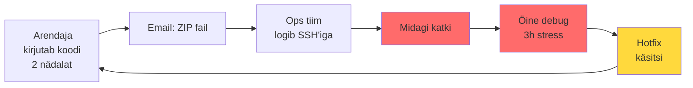
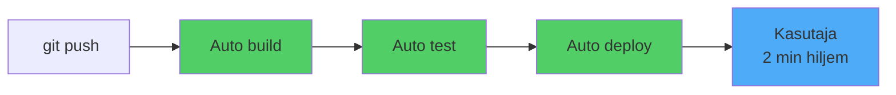
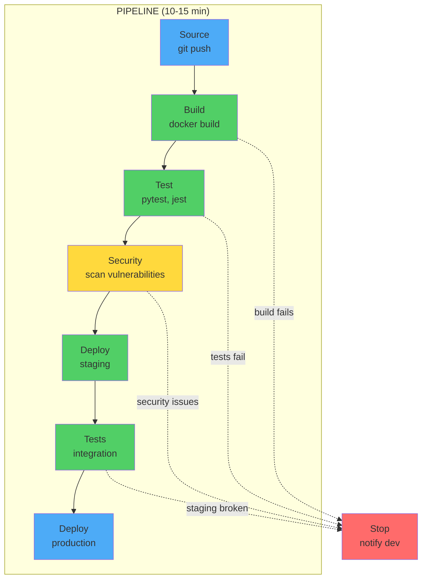
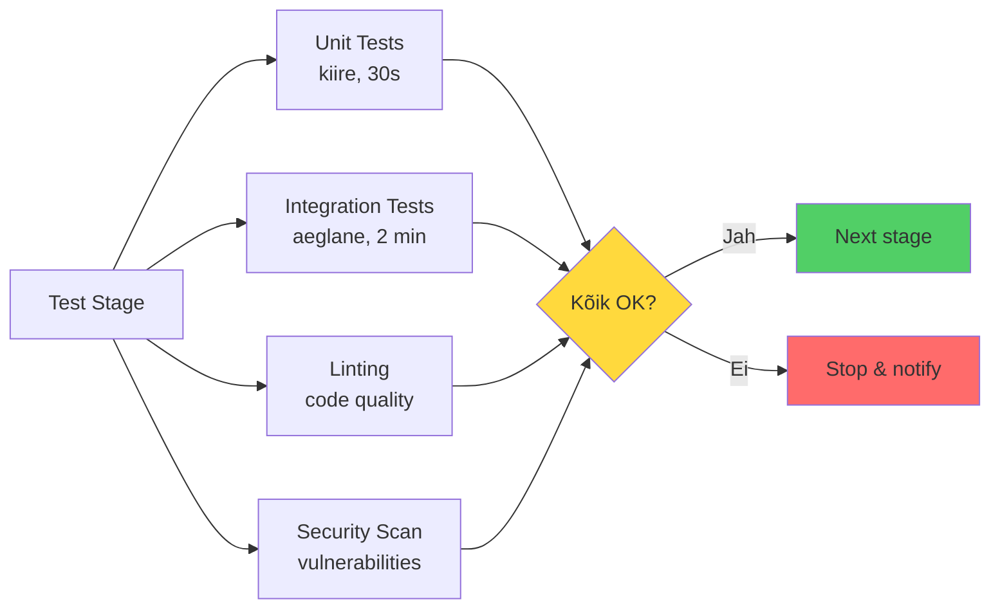
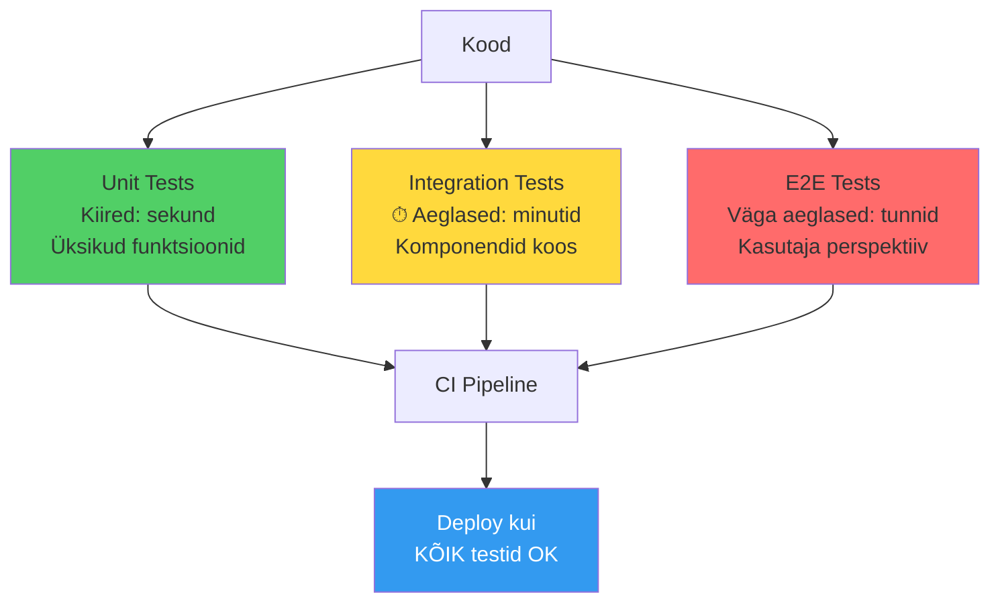
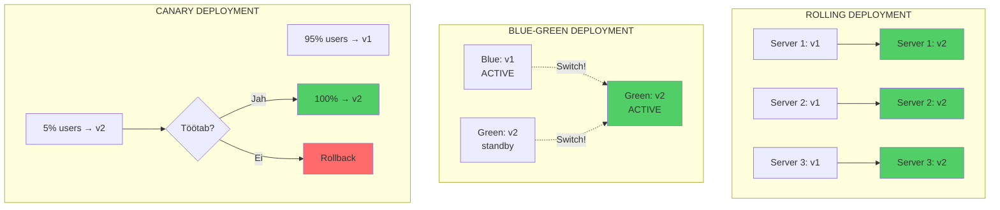
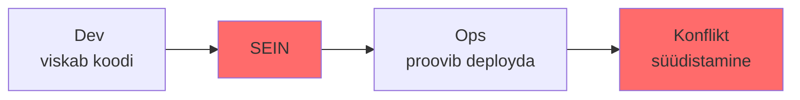
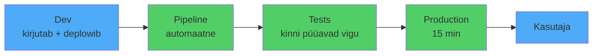

#  CI/CD: Pidev Integratsioon ja Tarnimine

**Eeldused:** Git põhitõed, Docker, käsurida, mõistmine kuidas tarkvaraarendus toimub

---

##  Õpiväljundid

Pärast seda loengut mõistad:
- **Miks CI/CD on vajalik** - millist probleemi see lahendab
- **Mis on Continuous Integration** - automaatne build ja test
- **Mis on Continuous Deployment** - automaatne deploy production'i
- **Kuidas pipeline töötab** - stages, jobs, automation
- **Kuidas Docker CI/CD-ga integreerib** - container images ja reproducibility

---

##  Miks me siin oleme?

Te olete kirjutanud koodi. Testinud. Töötab teie arvutis. Nüüd peab see jõudma kasutajateni. Kuidas see täpsemalt käib?

Vaatame klassikalist pilti, mida nähakse paljudes ettevõtetes tänapäevalgi. Arendaja kirjutab koodi nädalaid, siis tuleb "release day". Kõik on stressis. Operations tiim saab ZIP faili emailiga või Slack'is. Keegi peab käsitsi serverisse logima, failid õigesse kohta panema, teenused restartima. Midagi läheb valesti. Pooled ööd debugitakse. Järgmine päev tehakse "hotfix", mis läheb samuti käsitsi tootmisse. Ring kordub.



**See ei ole efektiivne.** See ei ole turvaline. See ei skaleeru. Ja mis kõige hullem - see on igav ning stressirohke töö, mis ei peaks üldse eksisteerima.

**CI/CD on vastus küsimusele:** kuidas viia kood arendaja käest kasutajani nii, et inimesed saaksid keskenduda huvitavale tööle, mitte käsitsi failide kopeerimisele?



---

## Mis on Continuous Integration?

Continuous Integration tähendab, et arendajad integreerivad oma koodi jagatud repositooriumi regulaarselt - ideaalis mitu korda päevas. Iga integratsioon kontrollitakse automaatse build'i ja testidega, et avastada vigu võimalikult kiiresti.

Kõlab lihtsalt, aga mõelge mis see tähendab. Traditsioonilises arenduses võivad arendajad töötada eraldi branch'ides nädalaid või kuid. Kui nad lõpuks oma koodi kokku viivad, tekib integratsiooni põrgu. Merge konfliktid, ühildumatud muudatused, keegi muutis API'd mida teine kasutab. Kõik läheb katki ja kulub päevi asjade parandamiseks.

CI lähenemine on teistmoodi. Kui integreerite sagedasti, siis iga muudatus on väike. Väikesi muudatusi on lihtne debugida. Kui midagi läheb katki, tead täpselt milline commit selle põhjustas. Ei pea otsima nädalate kaupa koodi läbi, et leida kus probleem tekkis.

Aga CI ei ole lihtsalt "push code often". CI nõuab automatiseerimist. Igal pushil peab juhtuma midagi:

**Build:** Kood kompileeritakse või paketeeritakse. Kas see üldse töötab? Kas kõik sõltuvused on olemas? Kas süntaks on korrektne?

**Test:** Jooksevad automaatsed testid. Unit testid kontrollivad üksikuid funktsioone. Integration testid kontrollivad kuidas komponendid koos töötavad. Regressioonitestid kontrollivad, et vanad featuurid ei läinud katki.

**Report:** Kui midagi läheb valesti, saavad arendajad kohe teada. Mitte homme, mitte järgmisel nädalal. Koheselt.

Selle tulemusena ei ole enam olukorda, kus keegi ütleb "aga minu arvutis see töötab". Kui see ei tööta CI keskkonnas, siis ei tööta. Ja sa said sellest teada 5 minutit pärast push'i, mitte 2 nädalat hiljem kui QA tiim seda testis.

---

## Mis on Continuous Deployment?

Continuous Deployment viib CI edasi. Kui kood läbis kõik testid ja kontrollid, siis see läheb automaatselt tootmisse. Ilma inimese sekkumiseta.

See kõlab paljudele hirmutavalt. "Automaatselt tootmisse? Ilma, et keegi kontrollib?" Aga mõelge sellele nii: kas inimene, kes kell 23:00 käsitsi deployb, on tõesti parem kontroll kui automatiseeritud süsteem, mis on testitud tuhandeid kordi?

Continuous Deployment ei tähenda "lase kõik lihtsalt läbi". See tähendab, et sul on niivõrd hea testimine, kvaliteedikontroll ja automatiseerimine, et sa usaldad seda protsessi rohkem kui käsitsi deployment'i.

Praktikas näeb see välja nii: arendaja mergeb pull request'i. Automaatselt algab protsess - testid, security scan, build, deployment staging keskkonda, automaatsed integration testid seal, kui kõik OK siis production. Kogu protsess võtab vahest 10-15 minutit. Kui midagi läheb valesti, rollback on sama automaatne.

Mõned ettevõtted kasutavad Continuous Delivery, mis on peaaegu sama, aga viimane samm (production deployment) vajab inimese kinnitust. See on hea vahevorm, kuni ettevõte saavutab piisava usalduse täielikult automatiseeritud protsessi vastu.

Mõelge erinevusele: ilma CD-ta võib arendaja kirjutatud kood jõuda kasutajateni nädalate või kuude pärast. CD-ga jõuab see sinna minutite või tundide jooksul. See tähendab kiiremat tagasisidet, kiiremat iteratsiooni, kiiremat väärtuse loomist.

---

## Pipeline: Kuidas see kõik kokku töötab

Pipeline on automatiseerimise selgroog. See defineerib täpselt, mis juhtub kui keegi pushib koodi.

**Kujutage pipeline'i kui tehase konveierit:** Alguses tuleb tooraine (source code), see läbib erinevaid jaamu (stages), igas jaamas tehakse kindlaid operatsioone (jobs), lõpus tuleb välja valmis toode (deployed application).



**Klassikaline pipeline näeb välja umbes selline:**

###  Source Stage
Koodi tõmbamine repositooriumist. See juhtub **automaatselt** kui keegi pushib või merge requestib.

###  Build Stage
Koodi kompileerimine või pakendamine.
- **Java:** Maven või Gradle build → JAR file
- **Node.js:** npm install + webpack bundle → JS bundle
- **Python:** wheel package loomine → .whl file
- **Docker:** `docker build` → container image

**Tulemus:** Midagi, mida saab käivitada.

###  Test Stage
Testide jooksutamine paralleelselt:


- **Unit testid:** Kiired (sekundid), kontrollivad üksikuid funktsioone
- **Integration testid:** Aeglasemad (minutid), kontrollivad komponentide koosmängu
- **E2E testid:** Simuleerivad kasutaja käitumist (klikid, vormid)
- **Performance testid:** Kas on kiire?
- **Security scannid:** Kas on turvaline?

###  Deploy Stage
Rakenduse paigaldamine keskkonda:
1. **Development** → arendajate mänguväljak
2. **Staging** → production'i koopia (test data)
3. **Production** → päris kasutajad! 

**Oluline reegel:** Kui üks stage ebaõnnestub, siis järgmised ei käivitu.

 Build fails → testid ei jookse  
 Testid failivad → ei deploy  
 Kõik OK → production! 

---

###  Miks pipeline on koodina (YAML)?

Pipeline on kirjeldatud **koodina** - tavaliselt YAML failina repositooriumis (`.gitlab-ci.yml` või `.github/workflows/`).

**See tähendab:**
-  Pipeline muudatused on **versioned** (näed ajalugu)
-  Pipeline on **reviewable** (code review nagu tavalisele koodile)
-  Pipeline on **testitav** (saad testida feature branch'is)
-  Kui keegi muudab pipeline'i, näed **täpselt mida ja miks**

**Näide (lihtne):**
```yaml
stages:
  - build
  - test
  - deploy

build_job:
  stage: build
  script:
    - docker build -t myapp .
    
test_job:
  stage: test
  script:
    - pytest tests/
    
deploy_job:
  stage: deploy
  script:
    - kubectl apply -f k8s/
  only:
    - main  # ainult main branch'is
```

---

## GitLab CI/CD kui konkreetne lahendus

Turul on palju CI/CD platvorme: Jenkins, GitHub Actions, CircleCI, Travis CI, TeamCity. Miks me räägime GitLab'ist?

GitLab on täielik DevOps platvorm. See tähendab, et teil on üks tööriist, mis sisaldab: koodi hoidmise (Git repository), issue tracking'u, code review, CI/CD, container registry, security scanning, monitoring. Kõik integreeritud. Te ei pea ühendama viit erinevat tööriista.

GitLab CI/CD konfiguratsioon elab `.gitlab-ci.yml` failis projekti root'is. See on YAML fail, mis kirjeldab täpselt mis peab juhtuma.

Lihtne näide ilma seletusteta:

```yaml
stages:
  - build
  - test
  - deploy

build_job:
  stage: build
  script:
    - echo "Compiling code..."
    - make build

test_job:
  stage: test
  script:
    - echo "Running tests..."
    - make test

deploy_job:
  stage: deploy
  script:
    - echo "Deploying application..."
    - make deploy
  only:
    - main
```

See defineerib kolm stage'i ja kolm job'i. Job'id jooksevad oma stage'ide sees. Deploy käib ainult main branch'is.

GitLab käivitab need job'id nn. runner'ites. Runner on masin (füüsiline või virtuaalne), kus tegelikult kood käivitatakse. GitLab.com pakub shared runner'eid tasuta, aga te võite ka oma runner'eid registreerida - näiteks kui vajate spetsiifilist riistvara või ligipääsu privaatvõrgule.

Job'id jooksevad tavaliselt Docker container'ites. See tähendab, et iga job saab puhta, isoleeritud keskkonna. Iga build alustab nullist, mis tähendab reproducible builds. Ei ole enam "aga minu arvutis see töötab" probleemi.

---

## Docker integration: Miks see on oluline?

Kui rääkida CI/CD-st tänapäeval, ei saa mööda Docker'ist. Need kaks tehnoloogiat täiendavad ideaalselt üksteist.

CI/CD probleemiks on alati olnud keskkondade erinevused. Arendaja masinal on Python 3.9, test serveril Python 3.8, production'il Python 3.10. Arendajal on ühed teegid, serveril teised versioonid. Midagi töötab ühes kohas, ei tööta teises.

Docker lahendab selle radikaalse lähenemisega: me ei paigalda rakendust otse serverisse. Me pakendame rakenduse koos kõigi sõltuvustega ühte container image'isse. See image sisaldab täpselt sama keskkonda igal pool - arendaja laptopil, CI süsteemis, staging'ul, production'il.

GitLab CI/CD kontekstis tähendab see kahte asja:

**Job'id jooksevad container'ites:** Iga job saab määrata, millises Docker image'is ta jookseb. Python job kasutab Python image'it, Node.js job kasutab Node image'it. Image'is on juba kõik vajalikud tööriistad. Te ei pea iga kord neid installima.

```yaml
test_python:
  image: python:3.9
  script:
    - pip install -r requirements.txt
    - pytest

test_node:
  image: node:16
  script:
    - npm install
    - npm test
```

**Build'ime container image'id:** Rakenduse deployment tähendab container image loomist ja selle paigaldamist.

```yaml
build_docker:
  image: docker:latest
  services:
    - docker:dind
  script:
    - docker build -t myapp:$CI_COMMIT_SHA .
    - docker push myapp:$CI_COMMIT_SHA
```

DinD (Docker-in-Docker) tähendab, et Docker jookseb Docker container'is. See kõlab kummaliselt, aga see on standard viis kuidas CI süsteemides Docker image'eid ehitada.

Tulemus on see, et meil on garanteeritud ühesugune keskkond. Kui testid läbivad CI-s, siis sama image töötab garanteeritult ka production'is. Ei ole enam situatsiooni, kus "testis töötas, aga production'is crashib".

---

##  Automated Testing: CI/CD südames

Kõige olulisem osa CI/CD'st ei ole ehitamine ega deploy - see on **testimine**. Automaatsed testid on see, mis annab meile kindluse, et kood töötab.

### Testide tüübid



**1. Unit Tests (Ühiktestid)**
- Testavad **üksikuid funktsioone** isolatsioonis
- **Kiired** - jooksevad sekundites
- **Palju neid** - iga funktsiooni jaoks
- **Näide:** Kas funktsioon `add(2, 3)` tagastab `5`?

```python
# app.py
def calculate_price(quantity, unit_price, discount=0):
    """Arvuta hind koos allahindlusega"""
    if quantity < 0 or unit_price < 0:
        raise ValueError("Quantity and price must be positive")
    
    subtotal = quantity * unit_price
    discount_amount = subtotal * (discount / 100)
    return subtotal - discount_amount

# test_app.py
import pytest
from app import calculate_price

def test_calculate_price_basic():
    """Test: põhiline hinnaarvutus"""
    assert calculate_price(10, 5.0) == 50.0

def test_calculate_price_with_discount():
    """Test: allahindlusega"""
    assert calculate_price(10, 10.0, discount=20) == 80.0

def test_calculate_price_negative_quantity():
    """Test: negatiivne kogus peaks andma vea"""
    with pytest.raises(ValueError):
        calculate_price(-5, 10.0)

def test_calculate_price_zero():
    """Test: null kogus"""
    assert calculate_price(0, 100.0) == 0.0
```

**2. Integration Tests (Integratsioonitestid)**
- Testavad **komponentide koosmängu**
- **Aeglasemad** - jooksevad minutites
- **Vähem neid** - kriitilised paths
- **Näide:** Kas API endpoint salvestab andmebaasi ja tagastab õige vastuse?

```python
# test_integration.py
import pytest
import requests

def test_api_create_order():
    """Test: tellimuse loomine API kaudu"""
    response = requests.post(
        "http://localhost:5000/api/orders",
        json={
            "items": [{"id": 1, "quantity": 2}],
            "customer_id": 123
        }
    )
    
    assert response.status_code == 201
    data = response.json()
    assert data["order_id"] is not None
    assert data["status"] == "pending"
    
    # Kontrolli, et andmebaasis on tellimus
    order = db.get_order(data["order_id"])
    assert order.customer_id == 123
```

**3. E2E Tests (End-to-End testid)**
- Testavad **tervet rakendust** kasutaja vaatenurgast
- **Väga aeglased** - jooksevad tundides
- **Väga vähe** - ainult kriitilised user flows
- **Näide:** Kas kasutaja saab sisse logida, toote korvi panna ja tellimuse esitada?

### Testing CI/CD pipeline'is

**GitLab CI näide koos testidega:**

```yaml
stages:
  - test
  - build
  - deploy

# Unit testid - kiired, jooksevad alati
unit_tests:
  stage: test
  image: python:3.11
  script:
    - pip install -r requirements.txt
    - pytest tests/unit/ -v --cov=app --cov-report=term
  coverage: '/TOTAL.*\s+(\d+%)$/'

# Integration testid - vajavad andmebaasi
integration_tests:
  stage: test
  image: python:3.11
  services:
    - postgres:14
  variables:
    POSTGRES_DB: test_db
    DATABASE_URL: postgresql://postgres@postgres/test_db
  script:
    - pip install -r requirements.txt
    - pytest tests/integration/ -v

# Linting ja code quality
code_quality:
  stage: test
  image: python:3.11
  script:
    - pip install flake8 black pylint
    - flake8 app/
    - black --check app/
    - pylint app/

# Build ainult kui testid läbivad
build_image:
  stage: build
  image: docker:latest
  services:
    - docker:dind
  script:
    - docker build -t myapp:$CI_COMMIT_SHA .
    - docker push myapp:$CI_COMMIT_SHA
  only:
    - main

# Deploy ainult kui build õnnestus
deploy_production:
  stage: deploy
  script:
    - kubectl set image deployment/myapp myapp=myapp:$CI_COMMIT_SHA
  only:
    - main
  when: manual  # Vajab käsitsi kinnitust
```

### Test Coverage (Testide katvus)

**Code coverage** näitab, kui palju koodist on testidega kaetud.

```bash
# Pytest coverage
pytest --cov=app --cov-report=html tests/

# Väljund:
# Name                Stmts   Miss  Cover
# ---------------------------------------
# app/__init__.py         5      0   100%
# app/models.py          45      3    93%
# app/api.py             78     12    85%
# ---------------------------------------
# TOTAL                 128     15    88%
```

**Hea tava:**
-  **80%+ coverage** on hea
-  **Kriitilised funktsioonid 100%** (nt payment, authentication)
-  **100% ei ole eesmärk** - kvaliteet > kvantiteet

### Mida testida? Test Pyramid

```
     /\
    /E2E\      ← Vähe, aeglased
   /------\
  /  Int  \    ← Mõned, keskmised
 /----------\
/   Unit     \ ← Palju, kiired
--------------
```

**Reegel:** 70% unit tests, 20% integration tests, 10% E2E tests

### Praktiline nipp: Test-Driven Development (TDD)

1. Kirjuta test (see failib)
2. Kirjuta minimaalne kood (test läbib)
3. Refaktori kood (test läbib edasi)

```python
# 1. Test enne
def test_calculate_discount():
    assert calculate_discount(100, 20) == 80

# 2. Minimaalne kood
def calculate_discount(price, percent):
    return price - (price * percent / 100)

# 3. Test läbib! 
```

---

## Environments ja deployment strateegiad

Harva deplowditakse otse production'i. Tavaliselt on mitu keskkonda:

**Development:** Arendajate mänguväljak. Siin võib kõik olla katki, see on normaalne.

**Staging:** Koopia production'ist. Sama konfiguratsioon, sama andmebaas (aga test andmetega), sama setup. Siin testitakse, et kõik töötab enne production'i.

**Production:** Päris kasutajad, päris andmed. Siin peab kõik töötama.

Mõnikord on ka rohkem: QA keskkond testimiseks, performance testing keskkond koormuseks, demo keskkond müügile.

GitLab'is saate defineerida environments:

```yaml
deploy_staging:
  stage: deploy
  script:
    - deploy_to_staging.sh
  environment:
    name: staging
    url: https://staging.myapp.com

deploy_production:
  stage: deploy
  script:
    - deploy_to_production.sh
  environment:
    name: production
    url: https://myapp.com
  when: manual
```

`when: manual` tähendab, et production deployment vajab inimese kinnitust. Te näete GitLab'is nuppu "Deploy to production", mida keegi peab vajutama.

Deployment strateegiad on erinevad sõltuvalt rakendusest:

**Rolling deployment:** Uuendatakse servereid järjest. Esimene server saab uue versiooni, kui see töötab, siis teine, jne. Rakendus on kogu aeg töös, aga hetkeliselt on osa servereid vanas versioonis, osa uues.

**Blue-green deployment:** On kaks identselt keskkonda - "blue" ja "green". Hetkel töötab blue. Uus versioon installitakse green'i. Kui green töötab, lülitatakse liiklus blue'lt green'le üle. Kui midagi läheb valesti, lülitakse tagasi. Kiire rollback.

**Canary deployment:** Uus versioon läheb ainult väikesele osale kasutajatest (näiteks 5%). Monitoritakse kas midagi läheb katki. Kui kõik OK, suurendatakse järk-järgult (10%, 25%, 50%, 100%). Kui midagi läheb valesti, tagasi.

Erinevatel strateegiatel on erinevad trade-off'id. Rolling on lihtne, aga läheb aega. Blue-green nõuab kahekordset ressurssi. Canary on keeruline seadistada, aga kõige turvalisem.

---

## Secrets ja turvalisus

Pipeline'id teevad tundlikke asju: logib serveritesse, pushib production'i, kasutab API võtmeid, ligipääseb andmebaasidele. Kuidas hoida seda turvaliselt?

Mitte kunagi, mitte kunagi ei pane te paroole või API võtmeid koodi sisse. Mitte isegi `.gitlab-ci.yml` faili. Need failid lähevad Giti, Git on version control, iga commit on seal igavesti. Kui te panete API võtme sinna, siis see on seal igavesti - isegi kui hiljem kustutate.

GitLab'il on CI/CD variables selleks. Te lähete Settings → CI/CD → Variables ja lisate seal:

- `DATABASE_PASSWORD`
- `API_KEY`
- `SSH_PRIVATE_KEY`
- `DOCKER_REGISTRY_PASSWORD`

Need on encrypted at rest ja masked in logs. Kui pipeline printib välja muutuja väärtuse, näete `***` logi asemel.

Pipeline'is kasutate neid kui keskkonna muutujaid:

```yaml
deploy:
  script:
    - echo "Deploying with API key..."
    - deploy.sh --api-key $API_KEY
    - mysql -p$DATABASE_PASSWORD -e "SELECT 1"
```

Protected variables lähevad ainult protected branch'idesse (näiteks main). See tähendab, et feature branch'is töötav arendaja ei saa ligi production paroole.

Masked variables ei näita väärtust logis. Kui isegi kogemata printite välja, näete ainult tärne.

Lisaks sellele peaks pipeline tegema security scan'e:

**Dependency scanning:** Kas kasutatavad teegid on turvalised? Kas on teadaolevaid haavatavusi?

**Container scanning:** Kas Docker image on turvaline? Kas base image on uuendatud?

**Secret detection:** Kas koodi sisse on kogemata jäänud paroole või võtmeid?

GitLab Ultimate'is on need built-in. Aga isegi tasuta versiooniga saate kasutada avatud lähtekoodiga tööriistu nagu Trivy, GitLeaks.

Turvalisus ei ole afterthought. See peab olema osa pipeline'ist algusest peale.

---

## Monitoring ja feedback

Pipeline jookseb. Kas see õnnestus? Kas ebaõnnestus? Kui kiiresti? Kus täpselt läks katki?

GitLab näitab pipeline'i staatust visuaalselt. Iga job on kas roheline (success), punane (failed), oranž (warning) või hall (manual/skipped). Näete kohe kus probleem on.

Kui job ebaõnnestub, klikkides selle peale näete täpset logi. Logi sisaldab kõike, mida job väljastas. Õppige logisid lugema - alguses on palju infot, aga õige viga on tavaliselt lõpu pool või seal, kus exit code muutus.

Pipeline võib saata notifikatsioone:

- Email kui ebaõnnestub
- Slack message kui deplowditakse production'i
- Webhook kui soovite integreerida kolmanda süsteemiga

Aga pipeline on ainult pool tõest. Teine pool on: mis toimub application'iga pärast deployment'i?

Seepärast on vaja monitoring'ut. Application peaks logima. Peaks olema metrics (response time, error rate, request count). Peaks olema alerts kui midagi läheb valesti.

Pipeline võib lisada deployment annotation monitoring süsteemi (Grafana, Datadog). Siis näete täpselt: "15:30 oli deployment, pärast seda kasvas error rate 500%". Correlation on selge.

Ideaalis pipeline ise kontrollib pärast deployment'i: "Kas application vastab?" Smoke test - lihtne HTTP request, kas saab 200 tagasi? Kui ei, rollback automaatselt.

Feedback loop peab olema kiire. Mida kiiremini te teate, et midagi läks valesti, seda kiiremini saate parandada. CI/CD ei ole ainult automatiseerimine - see on ka visibility ja control.

---

## Cache, artifacts, dependencies

Pipeline'id võivad võtta aega. Kui iga kord installite kõik node_modules või Python packages nullist, kulub minuteid. Kui teil on 50 jobi päevas, see on tunnid raisatud aega.

**Cache** on viis kuidas GitLab salvestab faile job'ide vahel. Tavaliselt kasutatakse dependency installimise kiirendamiseks:

```yaml
test:
  image: node:16
  cache:
    key: ${CI_COMMIT_REF_SLUG}
    paths:
      - node_modules/
  script:
    - npm install
    - npm test
```

Esimesel korral installitakse kõik. Tulemus salvestatakse cache'i. Teisel korral tõmbab cache'ist ja installeerib ainult muutunud dependency'd. Võib kokku hoida 80% ajast.

Cache key on oluline. Tavaliselt kasutatakse branch nime või lockfile hash'i. Kui lockfile (package-lock.json, Pipfile.lock) muutub, tähendab see et dependency'd muutusid, cache tuleb uuendada.

**Artifacts** on erinevad. Need on job'i väljund, mida järgmine stage vajab. Näiteks build stage kompileerib koodi, tulemus on artifact. Deploy stage võtab selle artifact'i ja paigaldab.

```yaml
build:
  stage: build
  script:
    - make build
  artifacts:
    paths:
      - build/
    expire_in: 1 week

deploy:
  stage: deploy
  script:
    - cp build/* /var/www/
  dependencies:
    - build
```

Artifact elab teatud aja (expire_in). Pärast seda kustutatakse, et säästa ruumi.

**Dependencies** määrab mis artifact'e job vajab. Vaikimisi saab job kõik eelmiste stage'ide artifact'id. Aga kui te ei vaja neid kõiki, võite määrata täpselt millised.

Cache vs Artifacts: Cache on optimisatsioon, Artifacts on funktsionaalsus. Kui cache puudub, töötab kõik ikka, ainult aeglasemalt. Kui artifacts puuduvad, ei tööta üldse.

---

## Deployment strateegiad (visuaalselt)



**Erinevused:**
- **Rolling:** Lihtne, aga võtab aega. Hetkeliselt on osa servereid vanas, osa uues versioonis.
- **Blue-green:** Kiire switch, kiire rollback. Aga nõuab 2× ressurssi (kaks identsed keskkonnad).
- **Canary:** Kõige turvalisem! Aga keeruline seadistada. Google ja Netflix kasutavad.

---

##  Kokkuvõte: Miks see kõik oluline on?

CI/CD ei ole lihtsalt tehniline detail. **See muudab fundamentaalselt kuidas tarkvara tehakse.**

###  Ilma CI/CD-ta:

- Arendus ja operations on **eraldi**
- Arendajad "viskavad koodi üle seina"
- Kui midagi läheb valesti → süüdistamine: "Kood on sitt" vs "Teie ei oska deployda"
- Integration juhtub **harva** ja on **valulik**
- Deploy = **stress** + öötöö

###  CI/CD-ga:

- Arendajad on **vastutavad** deployment'i eest
- Kui sa pusisid koodi ja see ei läinud deployment'i → **sinu probleem** (aga said kohe teada!)
- Integration juhtub **pidevalt** ja on **sujuv**
- Deploy = **tavapärane**, automaatne, usaldusväärne

###  Tulemused:

| Aspekt | Ilma CI/CD | CI/CD-ga |
|--------|-----------|----------|
| **Deploy sagedus** | 1× kuus (või harvem) | 10-100× päevas |
| **Deploy aeg** | Tunnid (käsitsi) | Minutid (auto) |
| **Vigade avastamine** | Päevad/nädalad hiljem | Minutid pärast push'i |
| **Stress level** |  (öötöö) |  (rahulik) |
| **Kvaliteet** |  (ootamatud vigu) |  (testitud auto) |

**Põhitõed:**
-  **Kiirem delivery** → saad kiiremini kasutajatele väärtust anda
-  **Parem kvaliteet** → automaatsed testid püüavad vigu kinni
-  **Väiksem stress** → deploy ei ole enam hirmutav
-  **Skaleerimine** → automatiseerimine → rohkem deployments

**CI/CD on DevOps kultuur koodina.** See on viis kuidas muuta "see pole minu probleem" kultuur → "me kõik vastutame" kultuuri.

---

##  Refleksioonküsimused (mõtle nende üle)

1. **Kui peaksid selgitama oma vanaisale, mis on CI/CD, siis mida ütleksid?**
   - Vihje: Mõtle lihtsamale analoogiale (tehase konveier? võlukepike?)

2. **Miks on automatiseerimine parem kui käsitsi deployment?**
   - Vihje: Mõtle kiirusele, vigadele, stressile

3. **Mis juhtub, kui pipeline testid ebaõnnestuvad?**
   - Vihje: Kas kood läheb production'i?

4. **Millal kasutaksid Canary deployment'i vs Rolling deployment'i?**
   - Vihje: Mõtle riskile ja kiiruse

5. **Kuidas Docker ja CI/CD kokku sobivad?**
   - Vihje: "Works on my machine" probleem

---

##  Järgmised sammud

**Lab'is täna:**
- Seadistame GitLab CI/CD pipeline'i
- Ehitame Docker image'i automaatselt
- Deploy'ime Kubernetes'e
- Testame rollback'i

**Õpi rohkem:**
- [GitLab CI/CD Docs](https://docs.gitlab.com/ee/ci/)
- [GitHub Actions](https://docs.github.com/en/actions)
- [The Phoenix Project](https://itrevolution.com/the-phoenix-project/) - raamat DevOps kultuuri kohta

---

##  Ressursid ja lugemine

**Kiirviited:**
- [GitLab CI/CD Tutorial](https://docs.gitlab.com/ee/ci/quick_start/)
- [YAML Syntax](https://docs.gitlab.com/ee/ci/yaml/)
- [Docker in CI/CD](https://docs.docker.com/ci-cd/)
- [Kubernetes + GitLab](https://docs.gitlab.com/ee/user/project/clusters/deploy_to_cluster.html)

**Videod (kui huvitav):**
- [CI/CD in 100 seconds](https://www.youtube.com/watch?v=scEDHsr3APg) - Fireship
- [GitLab CI/CD Tutorial](https://www.youtube.com/watch?v=qP8kir2GUgo)

**Miks see oluline?**
- CI/CD on üks **olulisemaid oskusi** kaasaegses tarkvaraarenduses
- Iga arendaja peab teadma, kuidas kood jõuab kasutajateni
- DevOps engineer'id kasutavad seda **iga päev**

---

**Küsimus enne lab'i alustamist:** Kui sa teeksid saidi/app'i ja tahaksid seda deploy'ida iga päev 10×, kas teeksid seda käsitsi? Miks / miks mitte? 
