# 📚 Nädal 25: Ettevõtte Infrastruktuuri Automatiseerimine ja Projekti Lõpetamine

## 📖 Loeng 25.1: Kuidas läheneda uuele DevOps projektile (20 min)

### Tere tagasi, kallid tudengid!

Eelmisel nädalal õppisime Terraform'iga infrastruktuuri koodina. Täna näitame, kuidas **KÕIK** oskused, mida me õppisime, kokku tulevad ühes päris projektis!

### 🏢 **Real Scenario: E-commerce startup automatiseerimine**

**Klient:** "TechShop" - väike e-commerce startup

**Praegune olukord:**
```bash
# Käsitsi deployment protsess (2-3 tundi)
1. SSH serverisse
2. Git pull latest code
3. Install dependencies
4. Restart application
5. Manual testing
6. Kui viga → panic ja rollback
```

**Probleem:** Arendajad deploy'ivad käsitsi, tihti vigu, aeglane protsess

### 🎯 **Meie lahendus: Täielik automatiseerimine**

**Kõik oskused, mida me õppisime, ühes projektis:**

#### 1. Git ja Version Control (Nädal 9)
```bash
# Struktureeritud Git workflow
main branch → development → feature branches
Pull request → code review → merge
```

#### 2. Ansible Configuration Management (Nädal 11-15)
```yaml
# server-setup.yml
- name: Setup web server
  hosts: webservers
  tasks:
    - name: Install nginx
      package:
        name: nginx
        state: present
    
    - name: Configure nginx
      template:
        src: nginx.conf.j2
        dest: /etc/nginx/nginx.conf
```

#### 3. Docker Containerization (Nädal 19-21)
```dockerfile
# Dockerfile
FROM python:3.9-slim
WORKDIR /app
COPY requirements.txt .
RUN pip install -r requirements.txt
COPY . .
EXPOSE 5000
CMD ["gunicorn", "--bind", "0.0.0.0:5000", "app:app"]
```

#### 4. Infrastructure as Code (Nädal 23)
```hcl
# main.tf
resource "local_file" "web_server_config" {
  ami           = "ami-123456"
  instance_type = "t3.micro"
  
  tags = {
    Name = "TechShop Web Server"
  }
}
```

#### 5. CI/CD Pipeline (Nädal 25)

```mermaid
flowchart LR
    A[📝 Code Commit] --> B[🧪 Test Stage]
    B --> C[📦 Build Stage]
    C --> D[🚀 Deploy Stage]
    D --> E[✅ Production]
    
    B --> F[❌ Test Failed]
    C --> G[❌ Build Failed]
    D --> H[❌ Deploy Failed]
    
    F --> I[🔧 Fix Issues]
    G --> I
    H --> I
    I --> A
    
    style A fill:#99ccff
    style B fill:#ffff99
    style C fill:#ffcc99
    style D fill:#99ff99
    style E fill:#cc99ff
    style F fill:#ff9999
    style G fill:#ff9999
    style H fill:#ff9999
    style I fill:#ff99cc
```



```yaml
# .gitlab-ci.yml
stages:
  - test
  - build
  - deploy

test:
  stage: test
  script:
    - python -m pytest

build:
  stage: build
  script:
    - docker build -t techshop:$CI_COMMIT_SHA .

deploy:
  stage: deploy
  script:
    - ansible-playbook deploy.yml
```

### 🛠️ **Täielik automatiseerimise workflow**

#### Samm 1: Infrastructure Setup (Terraform)
```bash
# 1. Create infrastructure
terraform init
terraform plan
terraform apply

# Tulemus: Kohalikud serverid, load balancer, database
```

#### Samm 2: Server Configuration (Ansible)
```bash
# 2. Configure servers
ansible-playbook -i inventory server-setup.yml

# Tulemus: Nginx, Python, dependencies installed
```

#### Samm 3: Application Deployment (Docker + CI/CD)
```bash
# 3. Deploy application
git push origin main
# → Triggers CI/CD pipeline
# → Builds Docker image
# → Deploys to servers
```

#### Samm 4: Monitoring (Prometheus + Grafana)
```yaml
# 4. Monitor everything
- name: Setup monitoring
  hosts: monitoring
  tasks:
    - name: Install Prometheus
      docker_container:
        name: prometheus
        image: prom/prometheus
```

### 📊 **Enne vs Pärast Automatiseerimist**

| Aspekt | Enne | Pärast |
|--------|------|--------|
| **Deployment aeg** | 2-3 tundi | 5 minutit |
| **Vigade arv** | 30% | 2% |
| **Rollback aeg** | 1 tund | 2 minutit |
| **Arendaja stress** | Kõrge | Madal |
| **Deployment sagedus** | 1x nädalas | 5x päevas |

---

## 📖 Loeng 25.2: Kuidas valida tehnoloogiaid (18 min)

### 🎯 **Real-world tehnoloogia valik meie projektis**

**Probleem:** TechShop vajab automatiseerimist

**Meie valikud ja põhjendused:**

#### 1. CI/CD Platform: GitLab CI
```yaml
# Miks GitLab CI?
Lihtne setup (GitLab + CI samas kohas)
Tasuta (startup budget)
Docker support
Ansible integration
❌ GitHub Actions (kallis)
❌ Jenkins (keeruline)
```

#### 2. Containerization: Docker
```bash
# Miks Docker?
Consistent environment
Easy deployment
Scalable
Industry standard
❌ VM (overkill)
❌ Direct install (inconsistent)
```

#### 3. Configuration Management: Ansible
```yaml
# Miks Ansible?
Agentless (no installation on servers)
YAML syntax (easy to read)
Large community
Terraform integration
❌ Puppet (complex)
❌ Chef (expensive)
```

#### 4. Infrastructure: Terraform
```hcl
# Miks Terraform?
Multi-cloud support
State management
Version control
Ansible integration
❌ CloudFormation (AWS only, not covered)
❌ Manual setup (error-prone)
```

### 🛠️ **Praktiline näide: Tehnoloogia valik**

**Ülesanne:** Vali monitoring lahendus TechShop'ile

```yaml
KRITEERIUMID:
1. Lihtne setup (väike tiim)
2. Tasuta (startup budget)
3. Docker support
4. Alerting

VALIKUD:
- Prometheus + Grafana
- Datadog
- New Relic
- CloudWatch
```

**Hindamine:**
```
Prometheus + Grafana: 4/5 + 5/5 + 5/5 + 4/5 = 18/20 ✅
Datadog: 3/5 + 1/5 + 5/5 + 5/5 = 14/20
New Relic: 3/5 + 1/5 + 4/5 + 4/5 = 12/20
CloudWatch: 4/5 + 3/5 + 3/5 + 4/5 = 14/20
```

**Tulemus: Prometheus + Grafana** (tasuta + võimas)

---

## 📖 Loeng 25.3: Kuidas troubleshoot'ida production issues (15 min)

### 🚨 **Real scenario: TechShop on maas**

**Probleem:** Website tagastab 502 Bad Gateway

### 🔍 **Systematic troubleshooting meie automatiseeritud süsteemis**

#### Samm 1: Information gathering

```bash
# 1. Check CI/CD pipeline status
gitlab-ci-lint .gitlab-ci.yml
# Tulemus: Pipeline OK

# 2. Check Docker containers
docker ps
# Tulemus: Container stopped

# 3. Check application logs
docker logs techshop-app
# Tulemus: Database connection failed
```

#### Samm 2: Hypothesis formation

```bash
# Hüpoteesid:
1. Database server down
2. Network connectivity issue
3. Application configuration error
4. Docker container crashed
```

#### Samm 3: Systematic testing

```bash
# Test 1: Database connectivity
mysql -h db.techshop.com -u user -p
# Tulemus: Connection refused

# Test 2: Check database server
terraform show
# Tulemus: Database instance running

# Test 3: Check security groups
# Local security check
# Tulemus: Port 3306 blocked
```

#### Samm 4: Solution implementation

```bash
# Probleem: Security group blocking database access
# Lahendus: Update Terraform configuration

# 1. Update security group
resource "local_file" "db_config" {
  ingress {
    from_port = 3306
    to_port   = 3306
    protocol  = "tcp"
    cidr_blocks = ["10.0.0.0/16"]
  }
}

# 2. Apply changes
terraform plan
terraform apply

# 3. Restart application
ansible-playbook restart-app.yml
```

### 🛠️ **Praktiline harjutus: Troubleshooting**

**Ülesanne:** TechShop API response time > 30s

**Sammud:**
1. Millised käsud sa käivitaksid?
2. Millised hüpoteesid sul on?
3. Kuidas sa lahendaksid?

---

## 📖 Loeng 25.4: Järgmised sammud karjääris (12 min)

### 🎓 **Kuidas kasutada oma TechShop projekti karjääris**

#### 1. Portfolio projekt

**GitHub repository:**
```bash
techshop-automation/
├── terraform/          # Infrastructure as Code
├── ansible/           # Configuration management
├── docker/            # Containerization
├── ci-cd/             # Pipeline configuration
├── monitoring/        # Prometheus + Grafana
└── README.md          # Project documentation
```

#### 2. CV ja LinkedIn

**Skills demonstrated:**
- Git workflow management
- Ansible automation
- Docker containerization
- Terraform infrastructure
- CI/CD pipeline design
- Monitoring setup
- Production troubleshooting

#### 3. Interview examples

**"Tell me about a project you automated":**
```
"Ma automatiseerisin e-commerce startup'i kogu deployment protsessi.
- Kasutasin Terraform'it infrastruktuuri loomiseks
- Ansible'it serverite konfigureerimiseks
- Docker'it rakenduse pakkimiseks
- GitLab CI/CD pipeline'i automatiseerimiseks
- Tulemus: deployment aeg vähenes 2 tunnilt 5 minutile"
```

### 🛠️ **Praktiline harjutus: Karjääri planeerimine**

**Ülesanne:** Tee oma TechShop projekti paremaks

```yaml
JÄRGMISED SAMMUD:
1. Lisa Kubernetes (container orchestration)
2. Lisa monitoring alerting
3. Lisa security scanning
4. Lisa backup automation
5. Lisa disaster recovery
```

---

## 🎯 **Nädala Kokkuvõte**

### **Mida me õppisime rakendama:**
- **Git + CI/CD**: Automated deployment pipeline
- **Ansible**: Server configuration automation
- **Docker**: Application containerization
- **Terraform**: Infrastructure as Code
- **Monitoring**: Production visibility
- **Troubleshooting**: Systematic problem solving

### 🚀 **Real-world projekt:**
- **TechShop e-commerce** - täielik automatiseerimine
- **Kõik oskused kokku** - ühes projektis
- **Production-ready** - päris kasutuses

### 📚 **Järgmised sammud:**
- Jätka õppimist cloud tehnoloogiateid
- Ehita oma portfolio projektid
- Osale DevOps kogukondades
- Praktiseeri real projektides

**🎉 Õnnitleme! Oled nüüd valmis automatiseerimise projektideks!**
