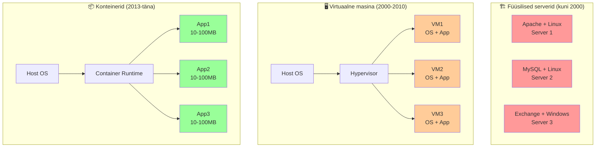

# 📚 Nädal 19: Docker Fundamentals
## Teemad: Container technology overview, Docker installation ja basic commands, Dockerfile creation, Docker networking ja volumes, Podman introduction ja comparison

Eelmisel nädalal õppisime Ansible role'e. Täna astume järgmisesse dimensiooni - **konteinerite maailm**.

Mõtle konteineritele kui **LEGO klotside** süsteemile - iga konteiner on üks klots, mis saab kiiresti kokku panna suuremateks rakendusteks.

---

# Osa 0: Docker Installatsioon ja Põhilised Mõisted
## Loeng 19.0: Getting Started with Docker (15 min)

### Mis on Docker?

**Docker** = tööriist konteinerite loomiseks ja haldamiseks.

**Lihtne definitsioon:** Docker võimaldab sul pakkida rakenduse koos kõigi sõltuvustega ühte "kasti" (konteiner), mis töötab igal arvutil.

### Põhilised mõisted

**Image** = Mall konteineri jaoks (nagu CD-ROM)
- Näiteks: `nginx:alpine`, `python:3.9`, `mysql:8.0`
- Sisaldab OS'i, rakendust ja sõltuvusi

**Container** = Käivitatud image (nagu programm arvutis)
- Elab ja töötab
- Võib peatada, kustutada, taaskäivitada

**Dockerfile** = Retsept image'i loomiseks
- Tekstifail, mis kirjeldab, kuidas image ehitada

**Registry** = Pood image'ite jaoks (Docker Hub)
- Nagu App Store, aga konteinerite jaoks

### Docker installatsioon

#### Ubuntu/Debian:
```bash
# 1. Update package list
sudo apt update

# 2. Install prerequisites
sudo apt install -y apt-transport-https ca-certificates curl gnupg lsb-release

# 3. Add Docker's official GPG key
curl -fsSL https://download.docker.com/linux/ubuntu/gpg | sudo gpg --dearmor -o /usr/share/keyrings/docker-archive-keyring.gpg

# 4. Add Docker repository
echo "deb [arch=amd64 signed-by=/usr/share/keyrings/docker-archive-keyring.gpg] https://download.docker.com/linux/ubuntu $(lsb_release -cs) stable" | sudo tee /etc/apt/sources.list.d/docker.list > /dev/null

# 5. Install Docker
sudo apt update
sudo apt install -y docker-ce docker-ce-cli containerd.io

# 6. Start Docker service
sudo systemctl start docker
sudo systemctl enable docker

# 7. Add user to docker group (vältida sudo kasutamist)
sudo usermod -aG docker $USER

# 8. Logout ja login uuesti, või käivita:
newgrp docker
```

#### macOS:
```bash
# Download ja install Docker Desktop
# https://www.docker.com/products/docker-desktop
```

#### Windows:
```bash
# Download ja install Docker Desktop
# https://www.docker.com/products/docker-desktop
```

### Esimene Docker käsk

```bash
# Testi installatsiooni
docker --version

# Käivita esimene konteiner
docker run hello-world

# Mida see tegi?
# 1. Laadis hello-world image Docker Hub'ist
# 2. Käivitas konteineri
# 3. Konteiner tervitas sind ja väljus
```

### Docker arhitektuur

```
┌─────────────────────────────────────────┐
│           Docker Client                 │
│     (docker käskude kasutaja)          │
└─────────────────┬───────────────────────┘
                  │
┌─────────────────▼───────────────────────┐
│           Docker Daemon                 │
│     (background service)                │
│  - Image management                     │
│  - Container lifecycle                  │
│  - Networking                          │
│  - Storage                             │
└─────────────────┬───────────────────────┘
                  │
┌─────────────────▼───────────────────────┐
│           Containers                    │
│  [Container 1] [Container 2] [Container 3]
└─────────────────────────────────────────┘
```

### Docker Hub - Image'ite pood

**Docker Hub** = Suurim konteinerite registry
- https://hub.docker.com
- Tuhanded valmis image'id
- Nagu GitHub, aga konteinerite jaoks

**Populaarsed image'id:**
- `nginx` - Web server
- `mysql` - Andmebaas
- `python` - Python runtime
- `node` - Node.js runtime
- `ubuntu` - Ubuntu OS
- `alpine` - Väike Linux OS

### Esimene praktiline näide

```bash
# 1. Käivita web server
docker run -d -p 8080:80 nginx

# Mida see teeb?
# -d = detached (taustal)
# -p 8080:80 = port mapping (host:container)
# nginx = image nimi

# 2. Testi brauseris
# Avage: http://localhost:8080

# 3. Vaata töötavaid konteinereid
docker ps

# 4. Peata konteiner
docker stop $(docker ps -q)

# 5. Kustuta konteiner
docker rm $(docker ps -aq)
```

### Kasulikud käsud algajale

```bash
# Image'ite haldamine
docker images                    # Näita kõiki image'eid
docker pull nginx               # Lae image alla
docker rmi nginx                # Kustuta image

# Container'ite haldamine
docker ps                       # Näita töötavaid konteinereid
docker ps -a                    # Näita kõiki konteinereid
docker logs container_name      # Vaata konteineri loge
docker exec -it container_name bash  # Sisene konteinerisse

# Süsteemi haldamine
docker system df                # Vaata ruumi kasutust
docker system prune             # Puhasta kasutamata objektid
docker info                     # Docker info
```

### Levinumad vead ja lahendused

**Viga 1: "Permission denied"**
```bash
# Probleem: User pole docker grupis
# Lahendus:
sudo usermod -aG docker $USER
# Logout ja login uuesti
```

**Viga 2: "Cannot connect to the Docker daemon"**
```bash
# Probleem: Docker daemon ei tööta
# Lahendus:
sudo systemctl start docker
sudo systemctl enable docker
```

**Viga 3: "Port already in use"**
```bash
# Probleem: Port juba kasutusel
# Lahendus:
docker ps                      # Leia konfliktne konteiner
docker stop container_name     # Peata see
# Või kasuta teist porti: -p 8081:80
```

### Docker vs traditsiooniline arendus

**Traditsiooniline lähenemine:**
```
"See töötab minu arvutil"
- Installeri Python 3.9
- Installeri nginx
- Seadista MySQL
- Konfigureeri firewall
- "Miks see ei tööta sinu arvutil?"
```

**Docker lähenemine:**
```
"See töötab igal arvutil"
docker run my-app
- Kõik sõltuvused on image's
- Sama keskkond igal pool
- Kiire deployment
```

### Järgmised sammud

Pärast installatsiooni ja põhiliste käskude õppimist:
1. **Container vs VM** - miks konteinerid on paremad?
2. **Dockerfile** - kuidas luua oma image'eid?
3. **Networking** - kuidas konteinerid suhtlevad?
4. **Volumes** - kuidas säilitada andmeid?

---

# Osa 1: Containers vs VMs
## Loeng 19.1: Container Technology Overview (12 min)

### Lühike evolutsioon



**Füüsilised serverid (kuni 2000):**
- Üks rakendus = Üks server
- Probleemid: Kallis, ineffektiivne (5-15% kasutus)

**Virtuaalne masina (2000-2010):**
- Üks server = Mitu VM'i
- Iga VM vajab täispikka OS'i: 1-2GB RAM, 20GB disk
- Parem, aga suur overhead

**Konteinerid (2013-täna):**
- Üks OS = Palju konteinereid
- Jagavad sama OS kernel'it: 10-100MB per container
- Maksimaalne efektiivsus!

### Peamine erinevus

**Virtual Machine = Terve arvuti sinus arvutis**
- Oma OS, oma kernel, oma mälu
- Nagu eraldi korter majas

**Container = Aplikatsioon + sõltuvused**
- Jagab host OS kernel'it
- Nagu tuba korteris - jagad köök ja vannituba

### Praktilised numbrid

| Kriteerium | Virtual Machines | Containers |
|------------|------------------|------------|
| **Käivitusaeg** | 1-5 minutit | 1-5 sekundit |
| **Mälu** | 1-8GB per VM | 10-100MB per container |
| **Mahtuvus** | 10-50 per server | 100-1000 per server |
| **Disk size** | 10-50GB | 100MB-1GB |

### Analoogia: Korterimaja vs Konteinerid

**VM = Korterimaja:**
- Iga korter (VM) on eraldi
- Igal on oma elekter, vesi, küte
- Turvaline, aga kallis

**Containers = Ühiselamu:**
- Jagavad infrastruktuuri (kernel)
- Kiirem, odavam
- Vähem isolatsiooni

### Millal kasutada mida?

**Kasuta VM'e kui:**
- Erinevad OS'id (Windows + Linux)
- Maksimum turvalisus (pank, haigla)
- Legacy süsteemid
- Pikaajalised teenused

**Kasuta konteinereid kui:**
- Kaasaegsed web rakendused
- Development/testing
- Microservices
- CI/CD pipelines
- Kiire deployment

### Kiire näide

**WordPress sait:**

VM lahendus:
- 3 VM'i: Web (2GB), Database (4GB), Load Balancer (1GB)
- Kokku: 7GB RAM, 90GB disk, 6 min deployment

Container lahendus:
- 3 konteinerit: Web, DB, LB
- Kokku: 650MB RAM, 650MB disk, 17 sek deployment

**Tulemus: 10x vähem ressursse, 20x kiirem!**

### Kokkuvõte

Konteinerid ei asenda VM'e - nad lahendavad erinevaid probleeme:
- **VM'id** = maksimaalne isolatsioon ja turvalisus
- **Konteinerid** = maksimaalne efektiivsus ja kiirus

---

# Osa 2: Docker Commands
## Loeng 19.2: Docker CLI Basics (15 min)

### Docker CLI põhialused

Docker CLI on teie peamine tööriist. Õpime **AINULT Docker käske** - Podman tuleb järgmises loengus!

```bash
docker [OPTIONS] COMMAND [ARG...]

# Näited:
docker run nginx              # Käivita nginx
docker ps                     # Näita containers
docker images                 # Näita image'e
```

### Image'ide haldamine

```bash
# 1. Image'ide allalaadimine
docker pull nginx             # Viimane versioon
docker pull nginx:1.21        # Konkreetne versioon
docker pull ubuntu:20.04      # Erinevad base image'id

# 2. Image'ide vaatamine
docker images                 # Kõik lokaalsed image'id
docker image inspect nginx    # Detailne info
docker search mysql           # Otsi Docker Hub'ist

# 3. Cleanup
docker rmi nginx              # Kustuta image
docker image prune            # Kustuta kasutamata image'id
```

### Container'ite käivitamine

```bash
# Põhilised käsud
docker run nginx                    # Foreground (blokeerib terminal)
docker run -d nginx                 # Detached (background)
docker run --name my-web nginx     # Anna nimi
docker run -p 8080:80 nginx        # Port mapping: host:container

# Interaktiivne kasutamine
docker run -it ubuntu bash         # Interactive terminal
docker exec -it container_name bash # Käivita käsk olemasolevs
```

### Container'ite jälgimine

```bash
# Ülevaade
docker ps                     # Töötavad containers
docker ps -a                  # Kõik (ka peatatud)
docker stats                  # Live resource kasutus
docker logs container_name    # Container logid
docker logs -f container_name # Follow logs (real-time)
```

### Container lifecycle

```bash
docker start container_name   # Käivita peatatud
docker stop container_name    # Peata gracefully
docker restart container_name # Restart
docker rm container_name      # Kustuta container
docker rm -f container_name   # Force kustutamine
```

### Praktilised näited

#### Näide 1: Lihtne web server
```bash
# Käivita Nginx
docker run -d --name my-web -p 80:80 nginx

# Testi
curl http://localhost

# Vaata loge
docker logs my-web

# Cleanup
docker stop my-web && docker rm my-web
```

#### Näide 2: Database
```bash
# MySQL andmebaas
docker run -d \
  --name mysql-db \
  -e MYSQL_ROOT_PASSWORD=secret123 \
  -e MYSQL_DATABASE=testdb \
  -p 3306:3306 \
  mysql:8.0

# Ühenda
docker exec -it mysql-db mysql -u root -p
```

#### Näide 3: Development
```bash
# Python development
docker run -it \
  --name python-dev \
  -v $(pwd):/workspace \
  -w /workspace \
  python:3.9 bash

# Nüüd saad editeerida faile host'is!
```

### Environment variables

```bash
# Üks muutuja
docker run -e NODE_ENV=production node-app

# Mitu muutujat
docker run \
  -e DB_HOST=localhost \
  -e DB_PORT=5432 \
  -e DEBUG=true \
  my-app

# Env file'ist
docker run --env-file .env my-app
```

### Volume mounting (quick intro)

```bash
# Host kaust → container kaust
docker run -v /host/path:/container/path nginx

# Current directory
docker run -v $(pwd):/app -w /app node:16 npm install

# Named volume (advanced - õpime hiljem)
docker volume create my-data
docker run -v my-data:/data nginx
```

### Kasulikud aliased

Lisa oma `~/.bashrc` faili:
```bash
alias dps='docker ps'
alias dpsa='docker ps -a'
alias dimg='docker images'
alias dstop='docker stop $(docker ps -q)'
alias drm='docker rm $(docker ps -aq)'
```

### System cleanup

```bash
docker info                  # Docker info
docker system df             # Disk kasutus
docker system prune          # Kustuta unused objects
docker system prune -a       # Kustuta KÕIK unused
```

### Algaja vead ja lahendused

**Viga 1:** "Permission denied"
```bash
# Probleem: User pole docker grupis
sudo usermod -aG docker $USER
# Logout ja login uuesti
```

**Viga 2:** "Port already in use"
```bash
# Probleem: Port juba kasutusel
docker ps                    # Leia conflicting container
docker stop container_name   # Peata see
# Või kasuta teist porti: -p 8081:80
```

**Viga 3:** Container kohe väljub
```bash
# Kontrolli loge
docker logs container_name

# Tihti puudub foreground protsess
# Lisa CMD või ENTRYPOINT Dockerfile'is
```

### Näpunäited

1. **Alati kasuta `-d`** production containers jaoks
2. **Anna containers nimed** `--name` flagiga  
3. **Port mapping** on oluline: `-p host:container`
4. **Cleanup regulaarselt** `docker system prune`
5. **Kasuta `docker logs`** debug'imiseks

---

# Osa 3: Podman Introduction
## Loeng 19.3: Podman vs Docker (8 min)

### Mis on Podman?

**Podman** (Pod Manager) on Docker'i alternatiiv Red Hat'i poolt. 

**Peamine erinevus:** Podman töötab **ILMA daemon'ita**!

### Docker vs Podman arhitektuur

**Docker:**
```
You → Docker Client → Docker Daemon → Container
              ↑              ↑
           Terminal      Always running
                         as ROOT user
```

**Podman:**
```
You → Podman → Container
         ↑
    Direct execution
    NO daemon needed!
```

### Peamised erinevused

| Aspekt | Docker | Podman |
|---------|---------|---------|
| **Daemon** | Vajab dockerd | EI vaja daemon'it |
| **Root** | Vajab root õigusi | Töötab rootless |
| **Startup** | Daemon peab töötama | Kohe kasutamisvalmis |
| **Security** | docker group = root | Tavaline user |

### Installation

**Docker installation (ülevaade):**
```bash
sudo apt install docker.io
sudo systemctl start docker      # Start daemon
sudo usermod -aG docker $USER    # Add to group
# Logout/login required
```

**Podman installation:**
```bash
sudo apt install podman
# That's it! Kohe kasutamisvalmis
```

### Commands - peaaegu identne!

```bash
# Docker                 →    Podman
docker pull nginx       →    podman pull nginx
docker run -d nginx     →    podman run -d nginx
docker ps               →    podman ps
docker logs name        →    podman logs name
docker exec -it name bash → podman exec -it name bash
```

**Magic trick:** Podman alias
```bash
# Lisa ~/.bashrc faili
alias docker=podman

# Nüüd kõik docker käsud töötavad!
docker run nginx  # Tegelikult: podman run nginx
```

### Rootless containers (SUUR eelis!)

**Docker probleem:**
```bash
# docker group = root equivalent
docker run -v /:/host -it alpine chroot /host bash
# Oled nüüd ROOT host süsteemis! 😱
```

**Podman lahendus:**
```bash
# Töötab tava userina
podman run -it alpine id
# uid=0(root) gid=0(root)  ← Inside container
whoami  # user ← On host

# User namespace mapping:
# Container root (0) = Host user (1000)
```

### Podman unique features

#### 1. Pods (Kubernetes-like)
```bash
# Loo pod (containers group)
podman pod create --name web-pod -p 8080:80

# Lisa containers pod'i
podman run -d --pod web-pod --name web nginx
podman run -d --pod web-pod --name cache redis

# Containers pod'is jagavad:
# - Network (localhost communication)
# - Storage
# - IP address
```

#### 2. Systemd integration
```bash
# Generate systemd service
podman run -d --name my-app nginx
podman generate systemd --new --files --name my-app

# Install USER service (no sudo!)
mkdir -p ~/.config/systemd/user
mv *.service ~/.config/systemd/user/
systemctl --user enable container-my-app.service
```

#### 3. Kubernetes YAML support
```bash
# Generate Kubernetes YAML
podman generate kube web-pod > pod.yaml

# Deploy Kubernetes'es
kubectl apply -f pod.yaml

# Või kasuta Podman'iga
podman play kube pod.yaml
```

### Performance võrdlus

**Memory usage:**
- Docker: ~50-200MB daemon + containers
- Podman: 0MB daemon (ainult containers)

**Startup speed:**
- Docker: ~2-3 sekundit (daemon communication)  
- Podman: ~1-2 sekundit (direct execution)

### Millal kasutada mida?

#### Vali Docker kui:
- Team tunneb juba Docker'it
- Vajad Docker-specific tooling'ut
- Windows/macOS development
- Olemasolev Docker infrastruktuur

#### Vali Podman kui:
- Turvalisus on prioriteet
- RHEL/CentOS/Fedora keskkonnas
- Ei taha daemon overhead'i
- Rootless containers vajalik
- Kubernetes workflows

### Lihtne migratsioon

```bash
# 1. Install Podman
sudo apt install podman

# 2. Add alias
echo "alias docker=podman" >> ~/.bashrc
source ~/.bashrc

# 3. Install podman-compose (if needed)
pip3 install podman-compose

# 4. Use existing docker-compose.yml
podman-compose up -d
```

### Praktiline näide

**Same application, different tools:**

Docker:
```bash
docker run -d --name web -p 8080:80 nginx
docker logs web
docker exec -it web bash
```

Podman:
```bash
podman run -d --name web -p 8080:80 nginx
podman logs web  
podman exec -it web bash
```

**Result:** Identne kasutuskogemus, turvalisem backend!

### Kokkuvõte

- **Podman = Docker without daemon**
- **Commands peaaegu identne**
- **Turvalisem (rootless)**
- **Kubernetes native support**
- **Easy migration with aliases**

---

# Osa 4: Dockerfile Best Practices
## Loeng 19.4: Container Build Optimization (20 min)

### Mis on Dockerfile?

**Dockerfile** = retsept teie rakenduse konteineri loomiseks.

Mõtle sellele kui **IKEA mööbli kokkupaneku juhendile** - sammhaaval juhised, kuidas komponentidest valmis toode teha.

```dockerfile
# See on Dockerfile - simple text file
FROM nginx:alpine
COPY index.html /usr/share/nginx/html/
EXPOSE 80
CMD ["nginx", "-g", "daemon off;"]
```

### Põhiinstruktsioonid

#### FROM - Base image
```dockerfile
# Official image (ALATI eelistatud)
FROM nginx:alpine
FROM python:3.9
FROM node:16

# Konkreetne versioon (production)
FROM node:16.14.2-alpine
FROM python:3.9.16-slim

# ÄRA tee nii:
FROM nginx  # latest tag - ette arvamatu!
```

#### COPY vs ADD
```dockerfile
# COPY - lihtne kopeerimine (kasuta seda!)
COPY app.py /app/
COPY src/ /app/src/
COPY . /app/

# ADD - automaatne ekstraktimine (harva vajad)
ADD archive.tar.gz /app/  # Automaatselt pakib lahti
ADD http://example.com/file.txt /app/  # Laeb URL'ist

# REEGEL: Kasuta COPY, välja arvatud kui vajad ADD funktsioone
```

#### RUN - Commands
```dockerfile
# VALE: Palju layer'eid
RUN apt-get update
RUN apt-get install -y curl
RUN apt-get clean

# ÕIGE: Üks layer
RUN apt-get update && \
    apt-get install -y curl && \
    apt-get clean && \
    rm -rf /var/lib/apt/lists/*
```

#### WORKDIR - Working directory
```dockerfile
# ÕIGE viis
WORKDIR /app
COPY package.json .
RUN npm install

# VALE viis
COPY package.json /app/package.json
RUN cd /app && npm install
```

#### CMD vs ENTRYPOINT
```dockerfile
# CMD - default command (override'itav)
CMD ["python", "app.py"]
# docker run myapp              → python app.py
# docker run myapp echo hello   → echo hello

# ENTRYPOINT - alati jookseb
ENTRYPOINT ["python", "app.py"]  
# docker run myapp              → python app.py
# docker run myapp --debug      → python app.py --debug

# Koos (best practice)
ENTRYPOINT ["python", "app.py"]
CMD ["--help"]
# docker run myapp              → python app.py --help
# docker run myapp --prod       → python app.py --prod
```

### Best Practice #1: Layer Cache Optimization

**Probleem:** Iga kord kui muudad koodi, installib dependencies uuesti.

**VALE järjekord:**
```dockerfile
FROM node:16
COPY . /app/          # Kõik kood kopeeritakse kohe
WORKDIR /app
RUN npm install      # Dependencies installib uuesti kui kood muutub
CMD ["npm", "start"]
```

**ÕIGE järjekord:**
```dockerfile
FROM node:16
WORKDIR /app

# 1. Copy dependency files (muutuvad harva)
COPY package*.json ./
RUN npm install

# 2. Copy source code (muutub tihti) 
COPY . .
CMD ["npm", "start"]
```

**Miks töötab:** Docker cache'ib layer'eid. Dependencies muutuvad harva!

### Best Practice #2: Multi-stage Builds

**Probleem:** Build tools suurendavad production image'i.

**Single-stage (SUUR ~1GB):**
```dockerfile
FROM node:16
WORKDIR /app
COPY package*.json ./
RUN npm install        # Dev dependencies ka!
COPY . .
RUN npm run build
CMD ["npm", "start"]
```

**Multi-stage (VÄIKE ~200MB):**
```dockerfile
# Stage 1: Build
FROM node:16 AS builder
WORKDIR /app
COPY package*.json ./
RUN npm install
COPY . .
RUN npm run build

# Stage 2: Production
FROM node:16-alpine
WORKDIR /app
COPY package*.json ./
RUN npm install --only=production
COPY --from=builder /app/dist ./dist
CMD ["npm", "start"]
```

**Tulemus:** 80% väiksem image!

### Best Practice #3: Security

```dockerfile
# 1. Konkreetsed versioonid
FROM node:16.14.2-alpine  # Mitte: FROM node

# 2. Non-root user
RUN addgroup -g 1001 -S appuser && \
    adduser -S appuser -u 1001

# 3. Ära jookse root'ina
USER appuser

# 4. Ownership
COPY --chown=appuser:appuser . .

# 5. Minimal packages
RUN apk add --no-cache curl
```

### Best Practice #4: Size Optimization

```dockerfile
# 1. Alpine images (väiksemad)
FROM python:3.9-alpine  # vs python:3.9

# 2. Clean up same layer'is
RUN apk add --no-cache build-base && \
    pip install -r requirements.txt && \
    apk del build-base

# 3. .dockerignore file
```

**.dockerignore näide:**
```
node_modules
.git
*.md
.env
test/
docs/
coverage/
```

### Praktiline näide: Python Flask

```dockerfile
FROM python:3.9-slim

# Non-root user
RUN groupadd -r appuser && useradd -r -g appuser appuser

WORKDIR /app

# Dependencies first
COPY requirements.txt .
RUN pip install --no-cache-dir -r requirements.txt

# Source code last
COPY --chown=appuser:appuser . .

# Switch to non-root
USER appuser

# Health check
HEALTHCHECK --interval=30s --timeout=10s \
    CMD curl -f http://localhost:5000/health || exit 1

EXPOSE 5000
CMD ["gunicorn", "--bind", "0.0.0.0:5000", "app:app"]
```

### Advanced: Extreme size optimization

**Go application (5MB image!):**
```dockerfile
# Build stage
FROM golang:1.19-alpine AS builder
WORKDIR /app
COPY . .
RUN CGO_ENABLED=0 go build -o app

# Runtime stage
FROM scratch  # Tühi image!
COPY --from=builder /app/app /app
EXPOSE 8080
CMD ["/app"]
```

### Common mistakes

#### Mistake 1: Cached package lists
```dockerfile
# VALE
RUN apt-get update
RUN apt-get install -y curl  # Kasutab vana cache'i

# ÕIGE  
RUN apt-get update && apt-get install -y curl
```

#### Mistake 2: Root user
```dockerfile
# VALE
FROM ubuntu
COPY app /app
CMD ["/app"]  # Jookseb root'ina

# ÕIGE
FROM ubuntu
RUN useradd -m appuser
USER appuser
COPY app /app
CMD ["/app"]
```

#### Mistake 3: Secrets in layers
```dockerfile
# VALE - secrets jäävad image'i
COPY secret.key /app/
RUN echo "PASSWORD=secret" > /app/.env

# ÕIGE - runtime secrets
ENV PASSWORD_FILE=/run/secrets/password
CMD ["sh", "-c", "PASSWORD=$(cat $PASSWORD_FILE) /app"]
```

### Dockerfile linting

```bash
# Install Hadolint
docker run --rm -i hadolint/hadolint < Dockerfile

# Common warnings:
# - DL3008: Pin versions in apt install
# - DL3025: Use JSON array for CMD
# - DL3059: Multiple consecutive RUN
```

### Golden Rules

1. **Official base images**
2. **Dependencies enne, kood pärast** (cache optimization)
3. **Multi-stage builds** production'is
4. **Non-root user**
5. **Pin package versions**
6. **Combine RUN statements**
7. **Use .dockerignore**
8. **Add health checks**
9. **Lint with Hadolint**

### Build ja test

```bash
# Build
docker build -t myapp:v1.0 .

# Test different stages
docker build --target builder -t myapp:builder .

# Test security
docker run --rm -it myapp:v1.0 whoami  # Should NOT be root
```

---

# Osa 5: Networks ja Volumes
## Loeng 19.5: Container Connectivity & Data Persistence (10 min)

### Docker Networking

**Probleem:** Kuidas containers omavahel suhtlevad?

**Analoogia:** Container = korter majas. Network = telefonikaabel korterite vahel.

### Default networks

```bash
# Vaata kõiki võrke
docker network ls

# Default networks:
# bridge    ← Default network
# host      ← Host network
# none      ← No network
```

### Bridge network (default)

```bash
# Default käitumine
docker run -d --name web1 nginx
docker run -d --name web2 nginx

# Containers saavad IP aadressid:
# web1: 172.17.0.2
# web2: 172.17.0.3

# Saavad ping'ida IP kaudu
docker exec web1 ping 172.17.0.3  # ✅ Töötab

# AGA EI SAA kasutada nimesid
docker exec web1 ping web2        # ❌ Ei tööta
```

### Custom networks (SOOVITATUD!)

```bash
# Loo custom network
docker network create myapp-network

# Käivita containers custom network'is
docker run -d --name web --network myapp-network nginx
docker run -d --name api --network myapp-network python:3.9

# Nüüd hostname resolution töötab!
docker exec web ping api          # ✅ Töötab!
docker exec api ping web          # ✅ Töötab!
```

### Praktiline näide: 3-tier app

```bash
# Loo networks
docker network create frontend   # Web ↔ API
docker network create backend    # API ↔ Database

# Database (ainult backend)
docker run -d --name db \
  --network backend \
  -e POSTGRES_PASSWORD=secret \
  postgres:13

# API (mõlemas networks)
docker run -d --name api \
  --network backend \
  python:3.9
docker network connect frontend api

# Web (ainult frontend)  
docker run -d --name web \
  --network frontend \
  -p 80:80 \
  nginx
```

**Topology:**
```
Internet → [web] → [api] → [db]
          frontend backend
```

### Host networking

```bash
# Container kasutab host network'i
docker run -d --network host nginx

# Container port'id on otse host'is
# Ei vaja port mapping'ut!
curl http://localhost:80  # Töötab kohe
```

### Docker Volumes

**Probleem:** Container kustutamisel KÕIK andmed kaovad!

**Analoogia:** Volume = väline kõvaketas, mida saad container'ite vahel jagada.

### Volume tüübid

#### 1. Named volumes (SOOVITATUD)

```bash
# Loo named volume
docker volume create mydata

# Kasuta volume'i
docker run -d \
  --name database \
  -v mydata:/var/lib/mysql \
  mysql:8.0

# Volume info
docker volume ls
docker volume inspect mydata
```

#### 2. Bind mounts (host kaustade kinnitamine)

```bash
# Mount host directory → container
docker run -d \
  --name web \
  -v /home/user/website:/usr/share/nginx/html \
  nginx

# Muudatused host'is on kohe nähtavad container'is!
echo "<h1>Hello</h1>" > /home/user/website/index.html
curl http://localhost  # Uus sisu!
```

#### 3. tmpfs mounts (RAM-based)

```bash
# Temporary storage (ainult RAM'is)
docker run -d \
  --name cache \
  --tmpfs /tmp \
  redis:alpine

# /tmp data kaob container'i restart'imisel
```

### Praktiline näide: Persistent database

```bash
# 1. Loo volume
docker volume create postgres_data

# 2. Käivita database volume'iga
docker run -d \
  --name mydb \
  -e POSTGRES_PASSWORD=secret \
  -v postgres_data:/var/lib/postgresql/data \
  postgres:13

# 3. Loo andmeid
docker exec -it mydb psql -U postgres
# CREATE TABLE users (id SERIAL, name TEXT);
# INSERT INTO users (name) VALUES ('Alice'), ('Bob');

# 4. Kustuta container
docker stop mydb && docker rm mydb

# 5. Käivita uus container SAMA volume'iga
docker run -d \
  --name newdb \
  -e POSTGRES_PASSWORD=secret \
  -v postgres_data:/var/lib/postgresql/data \
  postgres:13

# 6. Andmed on alles!
docker exec -it newdb psql -U postgres -c "SELECT * FROM users;"
```

### Development workflow

```bash
# Mount source code arendamiseks
docker run -it \
  --name dev \
  -v $(pwd):/workspace \
  -w /workspace \
  -p 3000:3000 \
  node:16 bash

# Edita faile host'is, jooksu container'is!
```

### Volume cleanup

```bash
# Vaata volumes
docker volume ls

# Kustuta volume
docker volume rm mydata

# Kustuta kasutamata volumes
docker volume prune
```

### Kokkuvõte

**Networks:** Containers suhtlevad custom network'ides hostname'ide kaudu

**Volumes:** Andmed püsivad container'ite kustutamisel

**Best practices:**
- Kasuta custom networks
- Named volumes production'is
- Bind mounts development'is

---

## Kokkuvõte: Week 19 Docker Fundamentals

Selles nädalas õppisime:

### 🎯 **Peamised teemad:**

1. **Containers vs VMs**
   - Container efektiivsus ja kiirus
   - Ressursside optimeerimine
   - Deployment stsenaariumi valikud

2. **Docker CLI Mastery**
   - Container lifecycle management
   - Image operations ja cleanup
   - Development workflows

3. **Podman Alternative**
   - Daemonless architecture
   - Rootless security
   - Kubernetes integration

4. **Dockerfile Optimization**
   - Layer caching strategies
   - Multi-stage builds
   - Security best practices
   - Size optimization

5. **Networking & Storage**
   - Custom networks ja service discovery
   - Volume persistence strategies
   - Development ja production patterns

### 🛠️ **Praktilised oskused:**

- Container technology mõistmine
- Docker CLI commands fluently
- Dockerfile kirjutamine optimaalselt
- Network ja volume management
- Docker vs Podman trade-offs

### 📚 **Järgmine nädal:**

**Nädal 21 - Docker Compose ja Orchestration:**
- Multi-container applications
- Service orchestration
- Environment management
- Production deployment strategies

**Valmistumine:** Mõelge, kuidas hallata keerulist rakendust, mis vajab andmebaasi, web serverit, cache'i ja monitoring'ut kõike koos?

---

**Head containeriseerimist!** 🐳
