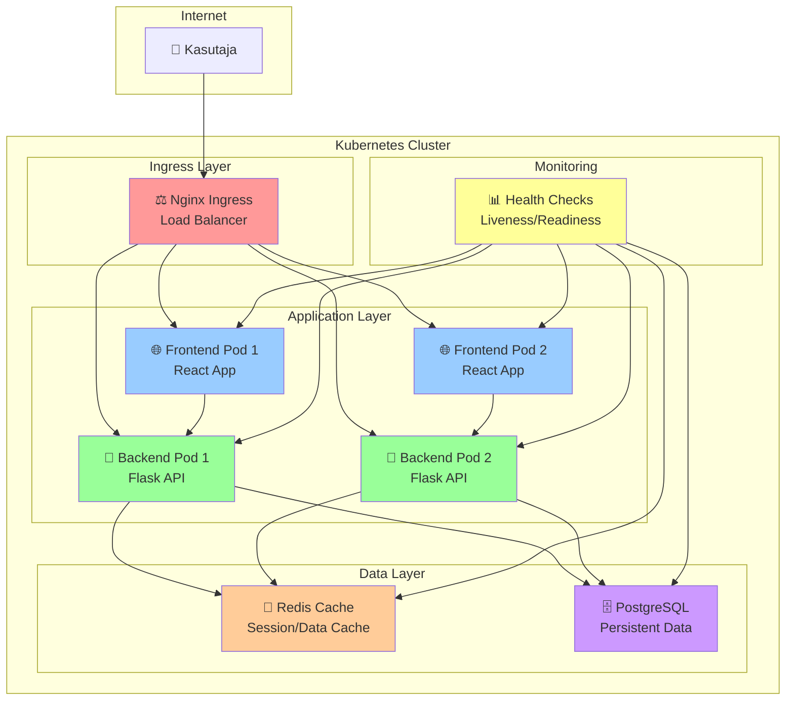

# 📝 Nädal 21 Kodutöö: Docker Compose ja Kubernetes Praktika

**Tähtaeg:** Järgmise nädala alguseks  
**Eesmärk:** Docker Compose ja Kubernetes praktiline kasutamine  
**Aeg:** 2-3 tundi praktilist tööd

---

## 🎯 **Projekt: Multi-Container Rakendus Docker Compose'iga ja Kubernetes'il**

**Docker Compose** võimaldab hallata mitut container'it kui ühte rakendust. **Kubernetes** võimaldab hallata mitut container'it mitmel masinal. Selles kodutöös õpite mõlemat lähenemist.

### Mida te ehitate?

**🌐 Frontend** - Lihtne web rakendus (HTML/CSS/JS) kasutajaliidese jaoks
**🔧 Backend** - Flask API äriloogika ja andmete töötlemiseks  
**🗄️ Database** - PostgreSQL andmete salvestamiseks
**📊 Monitoring** - Health checks ja logide vaatamine

**🔗 Teenuste suhtlus:**
```
Kasutaja → Frontend → Backend → Database
     ↑                                    ↓
     ←────────── Vastus ────────────────←
```

### Arhitektuuri diagramm



## 📁 **Samm 1: Keskkonna seadistamine**

### Kontrollige keskkonda:
```bash
docker --version
docker-compose --version
minikube status
kubectl get nodes
```

### Loo projekti struktuur:
```bash
mkdir ~/docker-orchestration-homework
cd ~/docker-orchestration-homework
mkdir -p app/{frontend,backend}
git init
echo "node_modules/\n.env\n*.log" > .gitignore
```

---

## 🔧 **Samm 2: Rakenduse komponentide loomine (60 min)**

Nüüd hakkame tegelikult midagi tegema. Siin näeme, kuidas kõik töötab.

Kujutage ette, et ehitame maja. Meil on plaan, meil on materjalid, ja nüüd hakkame ehitama. Frontend on nagu maja esiukse - see, mida kõik näevad. Backend on nagu maja "aju" - seal toimub kõik loogika. Ja andmebaas? See on nagu maja keldri - seal hoitakse kõiki olulisi asju.

Ma tean, et see võib tunduda keeruline, aga teeme seda sammhaaval. Iga samm on lihtne, ja kui teeme kõik õigesti, siis lõpuks töötab kõik koos nagu orkester.

Mida me täpselt teeme? No, kõigepealt loome lihtsa veebilehe. Siis teeme API, mis töötleb andmeid. Ja lõpuks ühendame kõike andmebaasiga. Kõik on lihtne, kui teeme seda sammhaaval.

Ja mida te õpite? No, kõigepealt õpite, kuidas veebirakendused töötavad. Siis õpite, kuidas erinevad osad omavahel suhtlevad. Ja lõpuks õpite, kuidas kõike koos hoida ja probleeme lahendada.

### 2.1 Lihtne Frontend

Nüüd kopeerime frontend'i failid. See on automation kursus, seega me ei kirjuta HTML koodi - me lihtsalt kopeerime valmis failid.

Frontend on nagu kontrollpaneel - see näitab kasutajale, mis toimub ja võimaldab neil rakendust testida.

Kuidas me seda teeme? No, kõigepealt kopeerime failid teacher_repo'st. See on nagu valmis maja ostmine - me ei ehita seda, me lihtsalt kasutame seda.

```bash
# Kopeerige Docker Compose fail
cp teacher_repo/docker-orchestration-starter/templates/docker-compose.yml.example docker-compose.yml
```

Mida te täpselt teete? No, kõigepealt minge teacher_repo kausta ja kopeerige frontend failid oma projekti kausta. See on lihtne - ainult kopeerige failid õigesse kohta.

```bash
# Kopeerige frontend failid
cp teacher_repo/docker-orchestration-starter/templates/app/frontend/* app/frontend/
```

Kuidas testida? Kui failid on kopeeritud, avage brauser, minge `http://localhost:8080` ja vajutage nuppe. Vaadake, kas midagi juhtub.

Mida te õpite? Kuidas kasutada valmis komponente, kuidas suhelda backend API-ga ja kuidas testida rakenduse tööd.

Ja kui midagi ei tööta? Kontrollige, et failid on õiges kaustas ja veenduge, et backend töötab.

### 2.2 Lihtne Backend

Nüüd kopeerime backend'i failid. See on automation kursus, seega me ei kirjuta Python koodi - me lihtsalt kopeerime valmis failid.

Backend on nagu restorani köök - kasutajad ei näe seda, aga kõik töö toimub seal. Frontend saadab tellimused, backend töötleb need ja tagastab tulemused.

Kuidas me seda teeme? No, kõigepealt kopeerime Python failid teacher_repo'st. See on nagu valmis köögi retsept - me ei kirjuta seda, me lihtsalt kasutame seda.

Mida te täpselt teete? No, kõigepealt minge teacher_repo kausta ja kopeerige backend failid oma projekti kausta. See on lihtne - ainult kopeerige failid õigesse kohta.

```bash
# Kopeerige backend failid
cp teacher_repo/docker-orchestration-starter/templates/app/backend/* app/backend/
```

Kuidas testida? Kui failid on kopeeritud, käivitage `python app.py`, avage brauser ja minge `http://localhost:5000/api/status`. Peaksite nägema JSON vastust.

Mida te õpite? Kuidas kasutada valmis API-d, kuidas ühenduda andmebaasiga ja kuidas testida backend'i tööd.

Ja kui midagi ei tööta? Kontrollige, et failid on õiges kaustas, kontrollige, et Python on installitud ja veenduge, et andmebaas töötab.

---

## 🚀 **Samm 3: Kubernetes Praktika (60 min)**

**Nüüd hakkame õppima Kubernetes'i - see on nagu õppima, kuidas hallata mitut restorani korraga!**

**Miks me seda teeme?**
Kubernetes on nagu restoraniketi juht - see võimaldab hallata mitut rakendust mitmel masinal korraga. Docker Compose oli nagu ühe restorani juht, aga Kubernetes on nagu kogu keti juht.

**Kuidas me seda teeme?**
1. **Seadistame Kubernetes keskkonna** - nagu restorani kohvikuga varustamine
2. **Loome manifeste** - need on nagu restorani tööjuhendid
3. **Juurutame rakenduse** - nagu restorani avamine
4. **Testime tööd** - nagu kvaliteedi kontroll

### 3.1 Kubernetes Keskkonna Seadistamine

**Enne kui hakkame restorani avama, peame veenduma, et kõik tööriistad on kohal.**

**Miks me seda teeme?**
Kubernetes vajab erilist keskkonda - nagu restoran vajab kööki, laudasid ja personali. Minikube simuleerib tõelist Kubernetes clustrit teie arvutil.

**Kuidas me seda teeme?**
1. **Kontrollige kubectl** - see on nagu restorani juhtimise tööriist
2. **Kontrollige Minikube** - see on nagu restorani kohvik
3. **Testige ühendust** - veenduge, et kõik töötab

**Kontrollige Minikube'i:**
```bash
# Kontrollige kubectl konfiguratsiooni - see näitab, millist restorani juhtida
kubectl config current-context

# Minikube konteksti seadistamine - valige õige restoran
kubectl config use-context minikube

# Testige ühendust - veenduge, et restoran on avatud
kubectl cluster-info
```

**Mida peaksite nägema?**
- `minikube` kontekst
- Cluster info koos URL'iga
- Mitte ühtegi veateadet

### 3.2 Kubernetes Manifests Loomine

**Nüüd loome restorani tööjuhendid - need on nagu retseptid, mis ütlevad, kuidas iga teenus töötab.**

**Miks me seda teeme?**
Manifestid on nagu restorani tööjuhendid - need ütlevad Kubernetes'ile, mida ja kuidas teha. Ilma nendeta ei tea Kubernetes, mida teha.

**Kuidas me seda teeme?**
1. **Loome kaustade struktuuri** - nagu restorani osakondade korraldamine
2. **Loome iga komponendi manifesti** - nagu iga osakonna tööjuhend
3. **Seadistame teenuste suhtluse** - nagu osakondade vahelise koostöö

**Mida peate tegema:**

1. **Loo projekti struktuur:**
   ```bash
   # Looge kaustad nagu restorani osakonnad
   mkdir -p k8s/{namespace,database,backend,frontend}
   ```

2. **Loo Namespace (k8s/namespace/namespace.yaml):**
   - See on nagu restorani nimi - eraldab teie rakenduse teistest
   - Kasuta `apiVersion: v1`
   - Lisa `kind: Namespace`
   - Lisa metadata nimega `docker-orchestration-app`

3. **Loo Database komponendid:**
   - **Deployment (k8s/database/deployment.yaml):** PostgreSQL container, 1 replica
     - See on nagu andmebaasi serveri seadistamine
   - **PVC (k8s/database/pvc.yaml):** 1Gi salvestusruum
     - See on nagu andmete salvestamise ruum
   - **Service (k8s/database/service.yaml):** ClusterIP teenus pordil 5432
     - See on nagu andmebaasi telefoninumber

4. **Loo Backend komponendid:**
   - **Deployment (k8s/backend/deployment.yaml):** Flask app, 2 replicas, health checks
     - See on nagu backend serverite seadistamine
   - **Service (k8s/backend/service.yaml):** ClusterIP teenus pordil 5000
     - See on nagu backend'i telefoninumber

5. **Loo Frontend komponendid:**
   - **Deployment (k8s/frontend/deployment.yaml):** Nginx container, 2 replicas
     - See on nagu frontend serverite seadistamine
   - **ConfigMap (k8s/frontend/configmap.yaml):** HTML sisu
     - See on nagu frontend'i sisu
   - **Service (k8s/frontend/service.yaml):** LoadBalancer teenus pordil 80
     - See on nagu frontend'i telefoninumber

**Kuidas testida?**
1. Looge kõik failid
2. Kontrollige YAML süntaksit
3. Veenduge, et failid on õiges kaustas

**Mida õpite:**
- Kuidas luua Kubernetes manifeste
- Kuidas kasutada Deployments, Services, ConfigMaps
- Kuidas seadistada health checks
- Kuidas kasutada PersistentVolumeClaims
- Kuidas konfigureerida teenuste võrguühendused

**Kui midagi ei tööta:**
- Kontrollige YAML süntaksit (indentatsioon on oluline!)
- Veenduge, et failid on õiges kaustas
- Kontrollige, et Minikube töötab

### 3.3 Kubernetes Juurutamine

**Nüüd avame restorani - see on nagu kõigi tööjuhendite rakendamine ja restorani avamine külastajatele.**

**Miks me seda teeme?**
Juurutamine on nagu restorani avamine - kõik tööjuhendid on valmis, personal on kohal ja nüüd avame uksed külastajatele.

**Kuidas me seda teeme?**
1. **Juurutame iga komponendi** - nagu iga osakonna käivitamine
2. **Kontrollime juurutamist** - nagu kvaliteedi kontroll
3. **Testime tööd** - nagu esimeste külastajate vastuvõtmine

**Juurutage kõik komponendid:**
```bash
# Namespace - looge restorani nimi
kubectl apply -f k8s/namespace/

# Database - käivitage andmebaasi server
kubectl apply -f k8s/database/

# Backend - käivitage backend serverid
kubectl apply -f k8s/backend/

# Frontend - käivitage frontend serverid
kubectl apply -f k8s/frontend/
```

**Mida peaksite nägema?**
- `namespace/docker-orchestration-app created`
- `deployment.apps/database-deployment created`
- `service/database-service created`
- `deployment.apps/backend-deployment created`
- `service/backend-service created`
- `deployment.apps/frontend-deployment created`
- `service/frontend-service created`

**Kontrollige juurutamist:**
```bash
# Kontrollige kõiki ressurssideid - nagu restorani ülevaatus
kubectl get all -n docker-orchestration-app

# Kontrollige podide staatust - nagu personali kontroll
kubectl get pods -n docker-orchestration-app

# Vaadake logisid - nagu töö jälgimine
kubectl logs -f deployment/backend-deployment -n docker-orchestration-app
```

**Mida peaksite nägema?**
- Kõik podid oleksid `Running` staatuses
- Mitte ühtegi `Pending` või `Error` staatust
- Logides peaks olema `Running on http://0.0.0.0:5000`

**Kui midagi ei tööta:**
- Kontrollige, et kõik failid on juurutatud
- Vaadake podide logisid vigade jaoks
- Kontrollige, et Minikube'l on piisavalt ressursse

---

## 🔧 **Samm 4: Docker Compose ja Kubernetes Võrdlus (60 min)**

**Tere! Nüüd võrdleme kahte lähenemist - see on nagu võrdlema ühe restorani juhtimist vs kogu restoraniketi juhtimist.**

**Miks me seda teeme?**
Võrdlus aitab mõista, millal kasutada Docker Compose'i ja millal Kubernetes'i. See on nagu valida ühe restorani ja kogu keti vahel.

**Kuidas me seda teeme?**
1. **Juurutame Docker Compose rakenduse** - nagu ühe restorani avamine
2. **Juurutame Kubernetes rakenduse** - nagu kogu keti avamine
3. **Võrdleme tööd** - nagu kvaliteedi võrdlus
4. **Analüüsime erinevusi** - nagu juhtimise võrdlus

### 4.1 Docker Compose Juurutamine

**Tere! Nüüd avame ühe restorani - see on lihtne ja kiire.**

**Miks me seda teeme?**
Docker Compose on nagu ühe restorani avamine - lihtne, kiire ja kõik on ühel kohal. See on ideaalne arenduseks ja testimiseks.

**Kuidas me seda teeme?**
1. **Loome Docker Compose faili** - see on nagu restorani menüü
2. **Käivitame rakenduse** - nagu restorani avamine
3. **Kontrollime tööd** - nagu kvaliteedi kontroll

**Käivita Docker Compose rakendus:**
```bash
# Docker Compose faili loomine - see on nagu restorani menüü kirjutamine
cat > docker-compose.yml << 'EOF'
version: '3.8'

services:
  frontend:
    image: nginx:alpine
    ports:
      - "8080:80"
    volumes:
      - ./app/frontend:/usr/share/nginx/html:ro
    depends_on:
      - backend

  backend:
    build: ./app/backend
    ports:
      - "5000:5000"
    environment:
      - DB_HOST=db
      - DB_NAME=app
      - DB_USER=postgres
      - DB_PASSWORD=secret
    depends_on:
      - db

  db:
    image: postgres:13
    environment:
      - POSTGRES_DB=app
      - POSTGRES_USER=postgres
      - POSTGRES_PASSWORD=secret
    volumes:
      - db_data:/var/lib/postgresql/data

volumes:
  db_data:
EOF

# Käivita rakendus - nagu restorani avamine
docker-compose up -d

# Kontrolli teenuseid - nagu personali kontroll
docker-compose ps
```

**Mida peaksite nägema?**
- `frontend` - `Up` staatus
- `backend` - `Up` staatus  
- `db` - `Up` staatus
- Mitte ühtegi `Exit` või `Error` staatust

**Kuidas testida?**
1. Avage brauser ja minge `http://localhost:8080`
2. Peaksite nägema frontend'i
3. Vajutage nuppe ja testige funktsionaalsust

### 4.2 Kubernetes Juurutamine

**Juuruta sama rakendus Kubernetes'il:**
```bash
# Backend image build ja load
cd app/backend
docker build -t docker-orchestration-backend:latest .
minikube image load docker-orchestration-backend:latest

# Juuruta kõik komponendid
kubectl apply -f k8s/namespace/
kubectl apply -f k8s/database/
kubectl apply -f k8s/backend/
kubectl apply -f k8s/frontend/

# Kontrolli juurutamist
kubectl get all -n docker-orchestration-app
```

### 4.3 Võrdlus ja Testimine

**Testi mõlemat rakendust:**
```bash
# Docker Compose test
curl http://localhost:8080
curl http://localhost:5000/api/status

# Kubernetes test
kubectl port-forward service/frontend-service 8081:80 -n docker-orchestration-app &
kubectl port-forward service/backend-service 5001:5000 -n docker-orchestration-app &

curl http://localhost:8081
curl http://localhost:5001/api/status
```

**Võrdlus tabel:**

| Aspekt | Docker Compose | Kubernetes |
|--------|----------------|------------|
| **Juhtimine** | `docker-compose up/down` | `kubectl apply/delete` |
| **Skaleerimine** | Käsitsi replica arv | `kubectl scale deployment` |
| **Load Balancing** | Ei ole | Automaatne |
| **Health Checks** | Käsitsi | Liveness/Readiness probes |
| **Storage** | Volumes | PVC/PV |
| **Networking** | Lihtne | Services, Ingress |
| **Monitoring** | Käsitsi | Automaatne |

---

## 📊 **Samm 5: Scaling and Monitoring (30 min)**

### 5.1 Application Scaling

```bash
# Skaleerige backend teenust
kubectl scale deployment backend-deployment --replicas=3 -n docker-orchestration-app

# Skaleerige frontend teenust
kubectl scale deployment frontend-deployment --replicas=3 -n docker-orchestration-app

# Kontrollige skaleerimist
kubectl get pods -n docker-orchestration-app
```

### 5.2 Basic Monitoring

```bash
# Podide ressursside kasutus
kubectl top pods -n docker-orchestration-app

# Node ressursside kasutus
kubectl top nodes

# Podide logide vaatamine
kubectl logs -l app=backend -n docker-orchestration-app --tail=50
```

### 5.3 Health Checks

```bash
# Testige health endpoint'i
kubectl port-forward service/backend-service 5000:5000 -n docker-orchestration-app
curl http://localhost:5000/api/health

# Testige status endpoint'i
curl http://localhost:5000/api/status
```

---

## 🎯 **Samm 6: Advanced Features (Optional - 30 min)**

### 6.1 ConfigMap ja Secrets

**k8s/config/configmap.yaml:**
```yaml
apiVersion: v1
kind: ConfigMap
metadata:
  name: app-config
  namespace: docker-orchestration-app
data:
  NODE_ENV: "production"
  DB_NAME: "app"
  REDIS_PORT: "6379"
```

**k8s/config/secret.yaml:**
```yaml
apiVersion: v1
kind: Secret
metadata:
  name: app-secrets
  namespace: docker-orchestration-app
type: Opaque
data:
  DB_PASSWORD: c2VjcmV0  # base64 encoded "secret"
  DB_USER: cG9zdGdyZXM=  # base64 encoded "postgres"
```

### 6.2 Horizontal Pod Autoscaler

**k8s/scaling/hpa.yaml:**
```yaml
apiVersion: autoscaling/v2
kind: HorizontalPodAutoscaler
metadata:
  name: backend-hpa
  namespace: docker-orchestration-app
spec:
  scaleTargetRef:
    apiVersion: apps/v1
    kind: Deployment
    name: backend-deployment
  minReplicas: 2
  maxReplicas: 10
  metrics:
  - type: Resource
    resource:
      name: cpu
      target:
        type: Utilization
        averageUtilization: 70
```

---

## 📝 **Samm 7: Documentation ja Submission (30 min)**

### 7.1 README.md loomine

```markdown
# Docker Orchestration Kubernetes Homework

## Projekt kirjeldus
Multi-tier web application Kubernetes'il koos frontend, backend, database ja cache teenustega.

## Komponendid
- Frontend: React application
- Backend: Python Flask API
- Database: PostgreSQL
- Cache: Redis
- Ingress: Nginx

## Juurutamine
```bash
kubectl apply -f k8s/
```

## Testimine
```bash
kubectl port-forward service/frontend-service 8080:3000 -n docker-orchestration-app
```

## Skaleerimine
```bash
kubectl scale deployment backend-deployment --replicas=3 -n docker-orchestration-app
```
```

### 7.2 Git commit ja push

```bash
# Lisa kõik failid
git add .

# Esimene commit
git commit -m "Initial Kubernetes deployment setup"

# Push GitHub'i
git push -u origin main
```

---

## 🔧 **Troubleshooting**

### Levinud probleemid:

**Probleem:** Pod ei käivitu
```bash
# Kontrollige podi staatust
kubectl describe pod <pod-name> -n docker-orchestration-app

# Vaadake logisid
kubectl logs <pod-name> -n docker-orchestration-app
```

**Probleem:** Service ei ühendu
```bash
# Kontrollige service konfiguratsiooni
kubectl describe service <service-name> -n docker-orchestration-app

# Testige endpoint'i
kubectl port-forward service/<service-name> <port> -n docker-orchestration-app
```

**Probleem:** Image ei leia
```bash
# Kontrollige image olemasolu
docker images | grep docker-orchestration

# Load image Minikube'i
minikube image load docker-orchestration-backend:latest
```

**Probleem:** Kodu masina seadistamine
- Vaadake eraldi juhendit: [`kodu_masina_ehitus_juhend.md`](./kodu_masina_ehitus_juhend.md)

---

## 📚 **Lisaressursid**

- [Kubernetes Documentation](https://kubernetes.io/docs/)
- [Minikube Getting Started](https://minikube.sigs.k8s.io/docs/start/)
- [Kubernetes YAML Reference](https://kubernetes.io/docs/reference/generated/kubernetes-api/v1.25/)
- [Kubernetes Best Practices](https://kubernetes.io/docs/concepts/configuration/overview/)
- [Kubernetes Architecture](https://kubernetes.io/docs/concepts/architecture/)
- [Microservices Patterns](https://microservices.io/patterns/)

### Alternative Orchestrators:
- [Docker Swarm](https://docs.docker.com/engine/swarm/)
- [HashiCorp Nomad](https://www.nomadproject.io/)
- [Apache Mesos](http://mesos.apache.org/)
- [Docker Swarm vs Kubernetes](https://docs.docker.com/get-started/orchestration/)

### 🏠 **Kodu masina seadistamine:**
- [Kodu Masina Ehitus Juhend](./kodu_masina_ehitus_juhend.md) - Täielik juhend VM, VSCode ja SSH seadistamiseks

---