# Lab: Docker Compose - Ehitame päris rakenduse

## 🎯 Mida ja miks me ehitame?

Täna ehitame **päris töötava rakenduse** - ülesannete halduse süsteemi (todo app). Miks just see? Sest see on piisavalt lihtne mõistmiseks, aga samas piisavalt keeruline, et õppida kõiki olulisi kontsepte.

**Miks multi-container arhitektuur?**

Kujutage ette, et olete väike meeskond, kes ehitab startup'i. Alguses panete kõik ühte serverisse - andmebaas, API, frontend. Kõik töötab... kuni ei tööta. Mis juhtub kui:
- Andmebaas vajab rohkem mälu, aga frontend ei vaja?
- Tahate uuendada Node.js versiooni API jaoks, aga ei taha puutuda andmebaasi?
- Üks arendaja tahab töödata ainult frontend'iga?

Siin tulebki mängu **teenuste eraldamine**. Iga komponent oma konteineris, iga meeskonna liige saab arendada oma osa, iga teenust saab skaleerida iseseisvalt.


---

## 📖 Arhitektuuri planeerimine

### Miks need komponendid?

Enne kui hakkame koodi kirjutama, mõtleme läbi, mida me tegelikult vajame. See on nagu maja ehitamine - enne kui hakkad telliseid laduma, pead teadma, millise maja tahad.

**1. PostgreSQL andmebaas**
- **Miks:** Vajame kusagil andmeid hoida. PostgreSQL on tööstusstandardn, tugev ja usaldusväärne.
- **Alternatiiv võiks olla:** MySQL, MongoDB
- **Miks mitte SQLite:** SQLite on hea arenduseks, aga ei sobi production'iks multi-user rakendustele

**2. Redis cache**
- **Miks:** Andmebaasi päringud on kallid (aeglased). Redis hoiab tihti kasutatavaid andmeid mälus.
- **Reaalne näide:** Kui 100 kasutajat küsivad korraga todo liste, siis ilma cache'ita teeb andmebaas 100 päringut. Redis'ega ainult 1 päring, ülejäänud saavad mälust.

**3. Node.js API**
- **Miks:** Vajame äriloogikat - kes tohib todos'sid näha? Kuidas valideerida sisendeid?
- **Miks Node.js:** Lihtne alustada, sama keel mis frontend'is (JavaScript)

**4. React Frontend**
- **Miks:** Kasutajad vajavad ilusat interface'i
- **Võiksime ka:** Servida lihtsalt HTML-i API-st, aga React annab parema UX-i

**5. Nginx**
- **Miks:** Reverse proxy ja load balancer. Tulevikus saame lisada SSL-i, cache'ida staatilist sisu, jaotada koormust mitme API serveri vahel

**6. Adminer**
- **Miks:** Arenduse ajal on vaja andmebaasi näha ja debuggida. Production'is seda ei kasutaks!

```mermaid
graph TB
    subgraph "Kasutaja teekond"
        User[Kasutaja avab браузeri]
        Request[Küsib todo listi]
        Nginx[Nginx võtab vastu]
        Route{Kuhu suunata?}
        Frontend[Static files - React]
        API[API päring]
        Cache{On cache-is?}
        Redis[Võta Redis-est]
        DB[Päri andmebaasist]
        Response[Tagasta vastus]
    end
    
    User --> Request
    Request --> Nginx
    Nginx --> Route
    Route -->|"/"| Frontend
    Route -->|"/api"| API
    API --> Cache
    Cache -->|Jah| Redis
    Cache -->|Ei| DB
    Redis --> Response
    DB --> Response
    
    style User fill:#ffcc99
    style Response fill:#99ff99
```



---

## 🚀 Alustame ehitamist

### Projekti loomine

Alustame nullist. See on oluline - kui õpid ise looma, saad aru kuidas asjad töötavad:

```bash
# Loome projekti kausta
mkdir todo-app
cd todo-app

# Miks need kaustad?
mkdir api        # Backend loogika
mkdir frontend   # React rakendus
mkdir nginx      # Reverse proxy konfiguratsioon
mkdir database   # Andmebaasi init skriptid
```

### Docker Compose fail - süsteemi süda

Alustame `docker-compose.yml` failiga. See on nagu orkestri partituur - ütleb igale "muusikule" (konteinerile) mida teha:

```yaml
# docker-compose.yml
version: '3.8'

# Miks versioon 3.8? 
# - 3.x on production-ready
# - 3.8+ toetab kõiki vajalikke feature'id
# - Uuem kui 3.8 pole veel laialdaselt toetatud

services:
  # Andmebaas - kõige aluseks
  # Miks esimesena? Sest teised sõltuvad sellest
  database:
    image: postgres:14-alpine
    # Miks alpine? 10x väiksem kui tavaline image (150MB vs 1.5GB)
    container_name: todo_db
    environment:
      # Need muutujad PostgreSQL ootab
      POSTGRES_DB: tododb
      POSTGRES_USER: todouser
      POSTGRES_PASSWORD: ${DB_PASSWORD:-defaultpass}
      # ${VAR:-default} tähendab: võta .env failist või kasuta defaulti
    volumes:
      # Andmed peavad püsima ka peale konteineri restardi
      - postgres_data:/var/lib/postgresql/data
      # Init skript käivitub esimesel käivitusel
      - ./database/init.sql:/docker-entrypoint-initdb.d/init.sql
    networks:
      - backend_network
    healthcheck:
      # Miks healthcheck? depends_on ei oota muidu kuni DB päriselt töötab
      test: ["CMD-SHELL", "pg_isready -U todouser -d tododb"]
      interval: 10s
      timeout: 5s
      retries: 5
      start_period: 30s

  # Redis cache
  redis:
    image: redis:7-alpine
    container_name: todo_redis
    command: redis-server --appendonly yes --maxmemory 100mb --maxmemory-policy allkeys-lru
    # --appendonly yes: salvesta andmed kettale (persistence)
    # --maxmemory 100mb: ära kasuta üle 100MB RAM-i
    # --maxmemory-policy allkeys-lru: kui mälu täis, kustuta vähemkasutatud
    volumes:
      - redis_data:/data
    networks:
      - backend_network
    healthcheck:
      test: ["CMD", "redis-cli", "ping"]
      interval: 10s
      timeout: 5s
      retries: 3

  # API server
  api:
    build: 
      context: ./api
      dockerfile: Dockerfile
    container_name: todo_api
    environment:
      NODE_ENV: ${NODE_ENV:-development}
      PORT: 3000
      DATABASE_URL: postgres://todouser:${DB_PASSWORD:-defaultpass}@database:5432/tododb
      # Miks @database, mitte @localhost? 
      # Docker Compose loob DNS kirje iga teenuse jaoks
      REDIS_URL: redis://redis:6379
    volumes:
      # Development jaoks - hot reload
      - ./api:/app
      - /app/node_modules  # Ära üle kirjuta node_modules
    depends_on:
      # Oota kuni need on "healthy", mitte lihtsalt käivitunud
      database:
        condition: service_healthy
      redis:
        condition: service_healthy
    networks:
      - backend_network
      - frontend_network

  # Frontend
  frontend:
    build:
      context: ./frontend
      dockerfile: Dockerfile
    container_name: todo_frontend
    environment:
      REACT_APP_API_URL: http://api:3000
    volumes:
      - ./frontend:/app
      - /app/node_modules
    networks:
      - frontend_network

  # Nginx - värav välismaailma
  nginx:
    image: nginx:alpine
    container_name: todo_nginx
    ports:
      - "80:80"      # HTTP
      - "443:443"    # HTTPS (tulevikuks)
    volumes:
      - ./nginx/nginx.conf:/etc/nginx/nginx.conf:ro
      # :ro tähendab read-only - turvalisuse jaoks
    depends_on:
      - api
      - frontend
    networks:
      - frontend_network

  # Adminer - andmebaasi UI (ainult development!)
  adminer:
    image: adminer:latest
    container_name: todo_adminer
    ports:
      - "8080:8080"
    environment:
      ADMINER_DEFAULT_SERVER: database
    networks:
      - backend_network
    profiles:
      - dev  # Käivitub ainult kui --profile dev

networks:
  # Miks kaks võrku?
  # Turvalisus - andmebaas ei pea olema frontend võrgus
  backend_network:
    driver: bridge
    internal: true  # Pole internetti vaja
  frontend_network:
    driver: bridge

volumes:
  # Named volumes - Docker haldab, püsivad restart'ide vahel
  postgres_data:
  redis_data:
```

---

## 🗄️ Andmebaasi seadistamine

### Miks alustada andmebaasist?

Andmebaas on rakenduse vundament. Kui andmestruktuur on vale, on kõik muu ka vale. See on nagu maja vundament - kui see on kõver, on kogu maja kõver.

Loome `database/init.sql`:

```sql
-- Miks UUID primary key, mitte serial?
-- 1. Turvalisem - ei saa ennustada järgmist ID-d
-- 2. Saab genereerida kliendi poolel
-- 3. Töötab hästi distributed süsteemides

-- Enable UUID extension
CREATE EXTENSION IF NOT EXISTS "uuid-ossp";

-- Todos tabel
CREATE TABLE IF NOT EXISTS todos (
    id UUID PRIMARY KEY DEFAULT uuid_generate_v4(),
    title VARCHAR(255) NOT NULL,
    description TEXT,
    completed BOOLEAN DEFAULT FALSE,
    created_at TIMESTAMP WITH TIME ZONE DEFAULT CURRENT_TIMESTAMP,
    updated_at TIMESTAMP WITH TIME ZONE DEFAULT CURRENT_TIMESTAMP
);

-- Miks indeksid?
-- Ilma indeksita peab DB iga päringu puhul kogu tabeli läbi vaatama
CREATE INDEX idx_todos_completed ON todos(completed);
CREATE INDEX idx_todos_created_at ON todos(created_at DESC);

-- Trigger updated_at välja uuendamiseks
-- Miks trigger? Garanteerib, et updated_at on alati õige
CREATE OR REPLACE FUNCTION update_updated_at_column()
RETURNS TRIGGER AS $$
BEGIN
    NEW.updated_at = CURRENT_TIMESTAMP;
    RETURN NEW;
END;
$$ language 'plpgsql';

CREATE TRIGGER update_todos_updated_at 
    BEFORE UPDATE ON todos 
    FOR EACH ROW 
    EXECUTE FUNCTION update_updated_at_column();

-- Lisa test andmed
INSERT INTO todos (title, description) VALUES 
    ('Õpi Docker Compose', 'Ehita multi-container rakendus'),
    ('Kirjuta dokumentatsioon', 'Lisa README ja kommentaarid'),
    ('Test rakendust', 'Kirjuta testid ja kontrolli kõik üle');
```

---

## 🔧 API teenuse ehitamine

### Miks Node.js API?

API on rakenduse aju - kogu äriloogika on siin. Miks eraldi API, miks mitte otse andmebaasiga rääkida?

1. **Turvalisus** - Kunagi ära lase frontend'il otse andmebaasi puutuda
2. **Valideerimine** - Kontrolli sisendeid enne andmebaasi
3. **Cache** - Optimeeri päringuid
4. **Äriloogika** - Reeglid, õigused, arvutused

### API struktuur

Loome `api/package.json`:

```json
{
  "name": "todo-api",
  "version": "1.0.0",
  "main": "server.js",
  "scripts": {
    "start": "node server.js",
    "dev": "nodemon server.js"
  },
  "dependencies": {
    "express": "^4.18.2",
    "pg": "^8.11.0",
    "redis": "^4.6.7",
    "cors": "^2.8.5",
    "helmet": "^7.0.0",
    "morgan": "^1.10.0",
    "joi": "^17.9.2"
  },
  "devDependencies": {
    "nodemon": "^2.0.22"
  }
}
```

### Miks need paketid?

- **express** - Web framework, lihtne ja kiire
- **pg** - PostgreSQL klient
- **redis** - Redis klient cache jaoks
- **cors** - Lubab frontend'il API-ga suhelda
- **helmet** - Lisab turvalisuse headereid
- **morgan** - Logib kõik päringud (debugging)
- **joi** - Valideerib sisendeid (ära kunagi usalda kasutaja sisendit!)
- **nodemon** - Restardib serveri kui kood muutub (development)

### API server

Loome `api/server.js`:

```javascript
const express = require('express');
const { Pool } = require('pg');
const redis = require('redis');
const cors = require('cors');
const helmet = require('helmet');
const morgan = require('morgan');
const Joi = require('joi');

const app = express();
const port = process.env.PORT || 3000;

// Miks middleware'id selles järjekorras?
// 1. Turvalisus (helmet) - esimesena, kaitseb kõike
// 2. Logimine (morgan) - logib kõik päringud
// 3. CORS - lubab browser'il API-ga suhelda
// 4. JSON parser - parsib request body
app.use(helmet());
app.use(morgan('combined'));
app.use(cors());
app.use(express.json());

// PostgreSQL connection pool
// Miks pool, mitte üks connection?
// Pool hoiab mitut ühendust avatuna, kiirem
const pool = new Pool({
  connectionString: process.env.DATABASE_URL,
  max: 20,  // Max 20 ühendust
  idleTimeoutMillis: 30000,  // Sulge idle ühendused 30s pärast
  connectionTimeoutMillis: 2000,  // Timeout uue ühenduse loomisel
});

// Test database connection
pool.on('connect', () => {
  console.log('Connected to PostgreSQL');
});

pool.on('error', (err) => {
  console.error('PostgreSQL error:', err);
  process.exit(-1);  // Suri andmebaas, suri ka API
});

// Redis client
const redisClient = redis.createClient({
  url: process.env.REDIS_URL,
  socket: {
    reconnectStrategy: (retries) => {
      // Proovi uuesti üha harvemini
      if (retries > 10) return false;
      return Math.min(retries * 50, 500);
    }
  }
});

// Redis error handling
redisClient.on('error', (err) => console.log('Redis error:', err));
redisClient.on('connect', () => console.log('Connected to Redis'));

// Connect to Redis
(async () => {
  try {
    await redisClient.connect();
  } catch (err) {
    console.error('Failed to connect to Redis:', err);
    // Jätkame ilma cache'ita - better than crashing
  }
})();

// Input validation schemas
// Miks Joi? Valideerib ja puhastab sisendid
const todoSchema = Joi.object({
  title: Joi.string().min(1).max(255).required(),
  description: Joi.string().max(1000).optional(),
  completed: Joi.boolean().optional()
});

// Health check endpoint
// Kubernetes/Docker vajab seda
app.get('/health', async (req, res) => {
  const health = {
    uptime: process.uptime(),
    timestamp: Date.now(),
    status: 'OK',
    services: {}
  };

  try {
    // Check database
    const dbResult = await pool.query('SELECT NOW()');
    health.services.database = 'healthy';
  } catch (err) {
    health.services.database = 'unhealthy';
    health.status = 'DEGRADED';
  }

  try {
    // Check Redis
    await redisClient.ping();
    health.services.redis = 'healthy';
  } catch (err) {
    health.services.redis = 'unhealthy';
    // Redis pole kriitiline, jätkame
  }

  const statusCode = health.status === 'OK' ? 200 : 503;
  res.status(statusCode).json(health);
});

// GET all todos
app.get('/api/todos', async (req, res) => {
  try {
    // 1. Check cache first
    const cacheKey = 'todos:all';
    
    if (redisClient.isOpen) {
      const cached = await redisClient.get(cacheKey);
      if (cached) {
        console.log('Cache hit!');
        return res.json(JSON.parse(cached));
      }
    }

    // 2. Query database
    console.log('Cache miss, querying database');
    const result = await pool.query(`
      SELECT 
        id, 
        title, 
        description, 
        completed, 
        created_at, 
        updated_at 
      FROM todos 
      ORDER BY created_at DESC
    `);

    // 3. Cache result
    if (redisClient.isOpen) {
      await redisClient.setEx(
        cacheKey, 
        60,  // TTL 60 seconds
        JSON.stringify(result.rows)
      );
    }

    res.json(result.rows);
  } catch (err) {
    console.error('Error fetching todos:', err);
    res.status(500).json({ 
      error: 'Failed to fetch todos',
      details: process.env.NODE_ENV === 'development' ? err.message : undefined
    });
  }
});

// GET single todo
app.get('/api/todos/:id', async (req, res) => {
  const { id } = req.params;

  // Validate UUID format
  const uuidRegex = /^[0-9a-f]{8}-[0-9a-f]{4}-[0-9a-f]{4}-[0-9a-f]{4}-[0-9a-f]{12}$/i;
  if (!uuidRegex.test(id)) {
    return res.status(400).json({ error: 'Invalid ID format' });
  }

  try {
    // Check cache
    const cacheKey = `todo:${id}`;
    if (redisClient.isOpen) {
      const cached = await redisClient.get(cacheKey);
      if (cached) {
        return res.json(JSON.parse(cached));
      }
    }

    const result = await pool.query(
      'SELECT * FROM todos WHERE id = $1',
      [id]
    );

    if (result.rows.length === 0) {
      return res.status(404).json({ error: 'Todo not found' });
    }

    // Cache individual todo
    if (redisClient.isOpen) {
      await redisClient.setEx(
        cacheKey,
        300,  // 5 minutes
        JSON.stringify(result.rows[0])
      );
    }

    res.json(result.rows[0]);
  } catch (err) {
    console.error('Error fetching todo:', err);
    res.status(500).json({ error: 'Failed to fetch todo' });
  }
});

// CREATE new todo
app.post('/api/todos', async (req, res) => {
  // Validate input
  const { error, value } = todoSchema.validate(req.body);
  if (error) {
    return res.status(400).json({ 
      error: 'Invalid input',
      details: error.details.map(d => d.message)
    });
  }

  const { title, description } = value;

  try {
    const result = await pool.query(
      `INSERT INTO todos (title, description) 
       VALUES ($1, $2) 
       RETURNING *`,
      [title, description]
    );

    // Invalidate cache
    if (redisClient.isOpen) {
      await redisClient.del('todos:all');
    }

    res.status(201).json(result.rows[0]);
  } catch (err) {
    console.error('Error creating todo:', err);
    res.status(500).json({ error: 'Failed to create todo' });
  }
});

// UPDATE todo
app.put('/api/todos/:id', async (req, res) => {
  const { id } = req.params;

  // Validate input
  const { error, value } = todoSchema.validate(req.body);
  if (error) {
    return res.status(400).json({ 
      error: 'Invalid input',
      details: error.details.map(d => d.message)
    });
  }

  const { title, description, completed } = value;

  try {
    const result = await pool.query(
      `UPDATE todos 
       SET title = COALESCE($1, title),
           description = COALESCE($2, description),
           completed = COALESCE($3, completed),
           updated_at = CURRENT_TIMESTAMP
       WHERE id = $4
       RETURNING *`,
      [title, description, completed, id]
    );

    if (result.rows.length === 0) {
      return res.status(404).json({ error: 'Todo not found' });
    }

    // Invalidate cache
    if (redisClient.isOpen) {
      await redisClient.del('todos:all');
      await redisClient.del(`todo:${id}`);
    }

    res.json(result.rows[0]);
  } catch (err) {
    console.error('Error updating todo:', err);
    res.status(500).json({ error: 'Failed to update todo' });
  }
});

// DELETE todo
app.delete('/api/todos/:id', async (req, res) => {
  const { id } = req.params;

  try {
    const result = await pool.query(
      'DELETE FROM todos WHERE id = $1 RETURNING id',
      [id]
    );

    if (result.rows.length === 0) {
      return res.status(404).json({ error: 'Todo not found' });
    }

    // Invalidate cache
    if (redisClient.isOpen) {
      await redisClient.del('todos:all');
      await redisClient.del(`todo:${id}`);
    }

    res.status(204).send();
  } catch (err) {
    console.error('Error deleting todo:', err);
    res.status(500).json({ error: 'Failed to delete todo' });
  }
});

// 404 handler
app.use((req, res) => {
  res.status(404).json({ error: 'Endpoint not found' });
});

// Error handler
app.use((err, req, res, next) => {
  console.error('Unhandled error:', err);
  res.status(500).json({ 
    error: 'Internal server error',
    details: process.env.NODE_ENV === 'development' ? err.message : undefined
  });
});

// Start server
app.listen(port, () => {
  console.log(`API server running on port ${port}`);
  console.log(`Environment: ${process.env.NODE_ENV}`);
});

// Graceful shutdown
// Miks see oluline? Ootame kuni kõik päringud on lõpetatud
process.on('SIGTERM', async () => {
  console.log('SIGTERM received, shutting down gracefully');
  
  // Stop accepting new requests
  server.close(() => {
    console.log('HTTP server closed');
  });

  // Close database pool
  await pool.end();
  console.log('Database pool closed');

  // Close Redis
  await redisClient.quit();
  console.log('Redis connection closed');

  process.exit(0);
});
```

### API Dockerfile

Loome `api/Dockerfile`:

```dockerfile
# Multi-stage build - miks?
# 1. Väiksem lõplik image (pole build tööriistu)
# 2. Turvalisem (pole source koodi)
# 3. Kiirem deployment

# Build stage
FROM node:16-alpine AS builder

WORKDIR /app

# Miks package*.json eraldi?
# Docker cache - kui package.json ei muutu, 
# siis npm install tulemust ei pea uuesti tegema
COPY package*.json ./

# ci vs install?
# ci on kiirem ja deterministlik (kasutab package-lock.json)
RUN npm ci --only=production

# Production stage
FROM node:16-alpine

# Turvalisus - ära jooksuta root kasutajana
RUN addgroup -g 1001 -S nodejs && \
    adduser -S nodejs -u 1001

WORKDIR /app

# Kopeeri ainult vajalik
COPY --from=builder --chown=nodejs:nodejs /app/node_modules ./node_modules
COPY --chown=nodejs:nodejs . .

# Vaheta kasutaja
USER nodejs

EXPOSE 3000

# Health check Dockerfile'is või Compose'is?
# Dockerfile'is = image'i osa, töötab igal pool
# Compose'is = ainult selle deploymentiga
HEALTHCHECK --interval=30s --timeout=3s --start-period=5s --retries=3 \
    CMD node -e "require('http').get('http://localhost:3000/health', (r) => {if(r.statusCode !== 200) throw new Error()})"

CMD ["node", "server.js"]
```

---

## 🌐 Frontend ehitamine

### Miks React?

React on de facto standard. Alternatiivid: Vue, Angular, Svelte. Kõik head, aga React'il on suurim community.

Loome `frontend/package.json`:

```json
{
  "name": "todo-frontend",
  "version": "1.0.0",
  "dependencies": {
    "react": "^18.2.0",
    "react-dom": "^18.2.0",
    "axios": "^1.4.0"
  },
  "scripts": {
    "start": "react-scripts start",
    "build": "react-scripts build"
  },
  "devDependencies": {
    "react-scripts": "5.0.1"
  }
}
```

Loome `frontend/src/App.js`:

```javascript
import React, { useState, useEffect } from 'react';
import axios from 'axios';
import './App.css';

// API URL tuleb environment muutujast
const API_URL = process.env.REACT_APP_API_URL || 'http://localhost:3000';

function App() {
  const [todos, setTodos] = useState([]);
  const [loading, setLoading] = useState(true);
  const [error, setError] = useState(null);
  const [newTodo, setNewTodo] = useState({ title: '', description: '' });

  // Fetch todos on mount
  useEffect(() => {
    fetchTodos();
  }, []);

  const fetchTodos = async () => {
    try {
      setLoading(true);
      const response = await axios.get(`${API_URL}/api/todos`);
      setTodos(response.data);
      setError(null);
    } catch (err) {
      setError('Failed to fetch todos');
      console.error('Error:', err);
    } finally {
      setLoading(false);
    }
  };

  const createTodo = async (e) => {
    e.preventDefault();
    if (!newTodo.title.trim()) return;

    try {
      const response = await axios.post(`${API_URL}/api/todos`, newTodo);
      setTodos([response.data, ...todos]);
      setNewTodo({ title: '', description: '' });
    } catch (err) {
      setError('Failed to create todo');
    }
  };

  const toggleTodo = async (id, completed) => {
    try {
      await axios.put(`${API_URL}/api/todos/${id}`, { completed: !completed });
      setTodos(todos.map(todo => 
        todo.id === id ? { ...todo, completed: !completed } : todo
      ));
    } catch (err) {
      setError('Failed to update todo');
    }
  };

  const deleteTodo = async (id) => {
    try {
      await axios.delete(`${API_URL}/api/todos/${id}`);
      setTodos(todos.filter(todo => todo.id !== id));
    } catch (err) {
      setError('Failed to delete todo');
    }
  };

  if (loading) return <div className="loading">Loading...</div>;
  if (error) return <div className="error">{error}</div>;

  return (
    <div className="App">
      <header>
        <h1>📝 Todo App</h1>
        <p>Built with Docker Compose</p>
      </header>

      <form onSubmit={createTodo} className="todo-form">
        <input
          type="text"
          placeholder="What needs to be done?"
          value={newTodo.title}
          onChange={(e) => setNewTodo({...newTodo, title: e.target.value})}
        />
        <textarea
          placeholder="Description (optional)"
          value={newTodo.description}
          onChange={(e) => setNewTodo({...newTodo, description: e.target.value})}
        />
        <button type="submit">Add Todo</button>
      </form>

      <div className="todos-list">
        {todos.length === 0 ? (
          <p className="no-todos">No todos yet. Create one!</p>
        ) : (
          todos.map(todo => (
            <div key={todo.id} className={`todo-item ${todo.completed ? 'completed' : ''}`}>
              <input
                type="checkbox"
                checked={todo.completed}
                onChange={() => toggleTodo(todo.id, todo.completed)}
              />
              <div className="todo-content">
                <h3>{todo.title}</h3>
                {todo.description && <p>{todo.description}</p>}
                <small>
                  Created: {new Date(todo.created_at).toLocaleDateString()}
                </small>
              </div>
              <button onClick={() => deleteTodo(todo.id)} className="delete-btn">
                🗑️
              </button>
            </div>
          ))
        )}
      </div>
    </div>
  );
}

export default App;
```

### Frontend Dockerfile

Loome `frontend/Dockerfile`:

```dockerfile
# Build stage
FROM node:16-alpine AS builder

WORKDIR /app

COPY package*.json ./
RUN npm ci

COPY . .
RUN npm run build

# Production stage - servime nginx'iga
FROM nginx:alpine

# Kopeeri build React'ist
COPY --from=builder /app/build /usr/share/nginx/html

# Custom nginx config React router'i jaoks
RUN echo 'server { \
    listen 80; \
    location / { \
        root /usr/share/nginx/html; \
        index index.html; \
        try_files $uri $uri/ /index.html; \
    } \
}' > /etc/nginx/conf.d/default.conf

EXPOSE 80

CMD ["nginx", "-g", "daemon off;"]
```

---

## 🔧 Nginx konfiguratsioon

### Miks Nginx?

Nginx on värav välismaailma. See:
1. Suunab päringud õigesse kohta (routing)
2. Servib staatilisi faile (kiire)
3. Lisab turvalisuse (rate limiting, SSL)
4. Cache'ib vastuseid
5. Load balancing (mitme API serveri korral)

Loome `nginx/nginx.conf`:

```nginx
# Miks see number? Tavaliselt = CPU tuumade arv
worker_processes auto;

# Kui palju ühendusi üks worker haldab
events {
    worker_connections 1024;
}

http {
    # MIME types - brauser teab, mis tüüpi failid
    include /etc/nginx/mime.types;
    default_type application/octet-stream;

    # Logimine
    access_log /var/log/nginx/access.log;
    error_log /var/log/nginx/error.log;

    # Performance tuning
    sendfile on;  # Kernel kopeerib failid, kiirem
    tcp_nopush on;  # Saada suuremaid pakette
    tcp_nodelay on;  # Ära oota, saada kohe
    keepalive_timeout 65;  # Hoia ühendus 65s avatuna

    # Gzip compression
    gzip on;
    gzip_types text/plain text/css application/json application/javascript text/xml;

    # Rate limiting - kaitse DDoS vastu
    limit_req_zone $binary_remote_addr zone=api:10m rate=10r/s;

    # Upstream servers - mitme API serveri korral
    upstream api_backend {
        server api:3000;
        # Tulevikus saab lisada:
        # server api2:3000;
        # server api3:3000;
    }

    server {
        listen 80;
        server_name localhost;

        # Security headers
        add_header X-Frame-Options "SAMEORIGIN";
        add_header X-Content-Type-Options "nosniff";
        add_header X-XSS-Protection "1; mode=block";

        # Frontend
        location / {
            proxy_pass http://frontend;
            proxy_set_header Host $host;
            proxy_set_header X-Real-IP $remote_addr;
            proxy_set_header X-Forwarded-For $proxy_add_x_forwarded_for;
            proxy_set_header X-Forwarded-Proto $scheme;
        }

        # API endpoints
        location /api {
            # Rate limiting
            limit_req zone=api burst=20;

            proxy_pass http://api_backend;
            proxy_set_header Host $host;
            proxy_set_header X-Real-IP $remote_addr;
            proxy_set_header X-Forwarded-For $proxy_add_x_forwarded_for;
            proxy_set_header X-Forwarded-Proto $scheme;

            # WebSocket support (kui vaja)
            proxy_http_version 1.1;
            proxy_set_header Upgrade $http_upgrade;
            proxy_set_header Connection "upgrade";

            # Timeout'id pikematele päringutele
            proxy_connect_timeout 60s;
            proxy_send_timeout 60s;
            proxy_read_timeout 60s;
        }

        # Health check endpoint
        location /health {
            access_log off;  # Ära logi health check'e
            return 200 "OK\n";
        }
    }
}
```

---

## 🚀 Rakenduse käivitamine

### Environment muutujad

Loome `.env` faili (ära kunagi commit'i Git'i!):

```bash
# .env
NODE_ENV=development
DB_PASSWORD=supersecret123
REDIS_PASSWORD=redissecret456
```

Loome `.env.example` (see võib Git'i minna):

```bash
# .env.example
NODE_ENV=
DB_PASSWORD=
REDIS_PASSWORD=
```

### Käivitamine

Nüüd kui kõik on valmis, käivitame:

```bash
# Ehita ja käivita kõik teenused
docker-compose up --build

# Või taustal
docker-compose up --build -d

# Vaata logisid
docker-compose logs -f

# Vaata ainult API logisid
docker-compose logs -f api

# Kui tahad Adminer'it ka (dev profile)
docker-compose --profile dev up
```

### Testimine

1. Ava brauser: http://localhost
2. Adminer (kui dev profile): http://localhost:8080
   - Server: `database`
   - Username: `todouser`
   - Password: `defaultpass` (või .env failist)
   - Database: `tododb`

### Debugging käsud

```bash
# Vaata mis konteinerid töötavad
docker-compose ps

# Mine API konteinerisse
docker-compose exec api sh

# Testi andmebaasi ühendust
docker-compose exec api node -e "
  const { Pool } = require('pg');
  const pool = new Pool({
    connectionString: process.env.DATABASE_URL
  });
  pool.query('SELECT NOW()').then(console.log).catch(console.error);
"

# Testi Redis ühendust
docker-compose exec redis redis-cli ping

# Vaata võrke
docker network ls
docker network inspect todo-app_backend_network

# Puhasta kõik ja alusta uuesti
docker-compose down -v
docker-compose up --build
```

---

## 🔍 Troubleshooting

### Tüüpilised probleemid ja lahendused

**1. "Cannot connect to database"**

```bash
# Kontrolli, kas DB on valmis
docker-compose exec database pg_isready

# Vaata DB logisid
docker-compose logs database

# Lahendus: oota kuni DB on healthy
depends_on:
  database:
    condition: service_healthy
```

**2. "Port already in use"**

```bash
# Vaata, mis kasutab porti
sudo lsof -i :80

# Lahendus: muuda porti või tapa protsess
ports:
  - "8081:80"  # Kasuta teist porti
```

**3. "Module not found"**

```bash
# Lahendus: ära mapi node_modules kausta
volumes:
  - ./api:/app
  - /app/node_modules  # Anonymous volume
```

**4. Cache ei tööta**

```bash
# Kontrolli Redis'e
docker-compose exec api node -e "
  const redis = require('redis');
  const client = redis.createClient({url: process.env.REDIS_URL});
  client.connect().then(() => client.ping()).then(console.log);
"
```

---

## 🎯 Kokkuvõte ja edasiarendus

### Mida me ehitasime?

1. **Production-ready arhitektuur** - eraldatud teenused, skaleeritav
2. **Turvaline** - võrgud eraldatud, healthcheck'id, validation
3. **Kiire** - Redis cache, optimeeritud päringud
4. **Debuggitav** - logid, health endpointid, monitoring valmidus

### Kuidas edasi arendada?

1. **Lisa autentimine** - JWT tokenid, kasutajate haldus
2. **Lisa testid** - Jest API jaoks, React Testing Library frontendile
3. **Lisa CI/CD** - GitHub Actions, automaatne deployment
4. **Lisa monitoring** - Prometheus + Grafana
5. **Lisa backup** - automaatne andmebaasi backup

### Production deployment

```yaml
# docker-compose.prod.yml
version: '3.8'

services:
  api:
    restart: unless-stopped
    deploy:
      replicas: 3
      resources:
        limits:
          cpus: '0.5'
          memory: 512M

  database:
    restart: unless-stopped
    volumes:
      - postgres_backups:/backups
    environment:
      POSTGRES_PASSWORD: ${SECURE_DB_PASSWORD}

  redis:
    restart: unless-stopped
    command: redis-server --requirepass ${REDIS_PASSWORD}
```

Käivitamine production'is:

```bash
docker-compose -f docker-compose.yml -f docker-compose.prod.yml up -d
```
