# 📚 Nädal 21: Docker Compose ja Orchestration

**Kestus:** 4 tundi  
**Teemad:** Docker Compose põhialused, Lihtsad multi-container rakendused, Keskkondade haldamine, Alternatiivide tutvustus

---

## 🎯 Õpiväljundid

Pärast seda nädalat oskate:
- **Kirjutada lihtsaid Docker Compose faile** - põhilised teenused ja nende seosed
- **Käivitada multi-container rakendusi** - ühe käsuga kogu rakendus
- **Mõista põhimõtteid** - miks orkestreerimine vajalik
- **Tutvuda alternatiividega** - teada, et Kubernetes pole ainus valik
- **Kasutada dokumentatsiooni** - oskus leida abi ja näiteid

---

## 📖 Loeng 21.1: Docker Compose Overview (12 min)

### Tere tulemast orkestreerimise maailma!

Tere tagasi! Eelmisel nädalal õppisime üksikute container'ite haldamist. Täna astume järgmisele tasemele - õpime **mitme container'i korraga haldamist**, **teenuste orkestreerimist** ja **production-ready** süsteemide ehitamist.

### Mis on orkestreerimine ja miks see vajalik?

**Orkestreerimine** tähendab mitme container'i koordineerimist, et need koos töötaksid kui üks rakendus. Kujutage ette orkestrit - iga muusik (container) mängib oma instrumenti, aga dirigent (orkestreerija) koordineerib kõiki, et nad koos ilusalt mängiks.

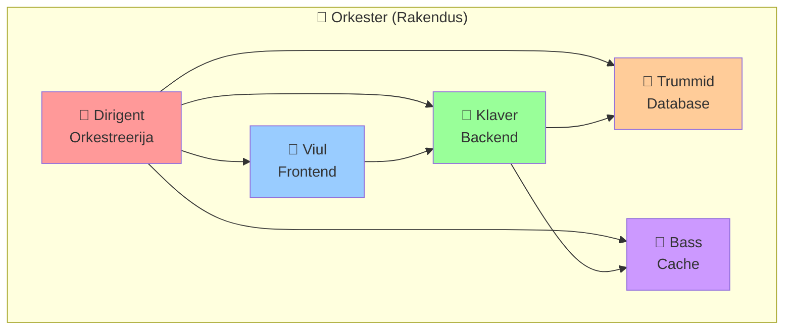

**Miks orkestreerimine on oluline?**
- **Keerukad rakendused** - tänapäeva web rakendused koosnevad mitmest komponendist
- **Sõltuvused** - erinevad teenused sõltuvad üksteisest
- **Skaleerimine** - vajadus käivitada mitu koopiat samast teenusest
- **Turvalisus** - erinevate teenuste isoleerimine

### Reaalne probleem: Web rakenduse käivitamine

**Kujutage ette, et teil on tänapäevane web rakendus:**

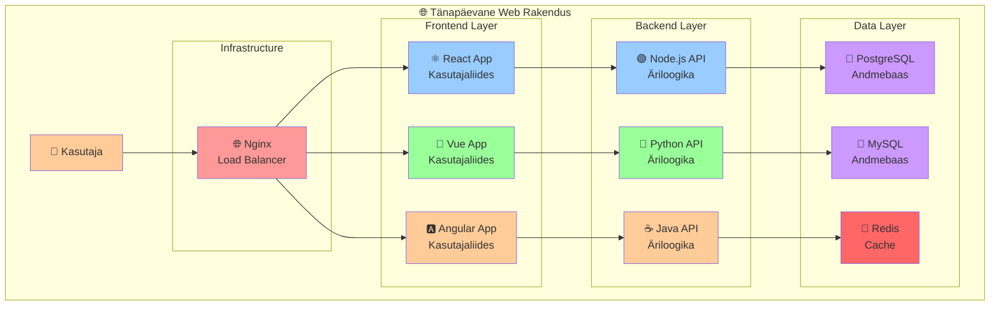

**Ilma orkestreerimise tööriistata** peate käivitama kõik need komponendid käsitsi:

### Probleem ilma Compose'ita

```bash
# Ilma Compose'ita peate käivitama:

# 1. Database - andmete salvestamine
docker run -d \
  --name myapp-db \
  -e POSTGRES_PASSWORD=secret \
  -e POSTGRES_DB=myapp \
  -v myapp_db_data:/var/lib/postgresql/data \
  postgres:13

# 2. Redis cache - kiire andmete juurdepääs
docker run -d \
  --name myapp-redis \
  -v myapp_redis_data:/data \
  redis:alpine

# 3. Backend API - äriloogika ja andmete töötlemine
docker run -d \
  --name myapp-api \
  --link myapp-db:db \
  --link myapp-redis:redis \
  -e DATABASE_URL=postgres://postgres:secret@db:5432/myapp \
  -e REDIS_URL=redis://redis:6379 \
  myapp/api:latest

# 4. Frontend - kasutajaliides
docker run -d \
  --name myapp-web \
  --link myapp-api:api \
  -p 80:80 \
  -e API_URL=http://api:3000 \
  myapp/web:latest

# 5. Nginx reverse proxy - koormuse jaotus ja SSL
docker run -d \
  --name myapp-nginx \
  --link myapp-web:web \
  --link myapp-api:api \
  -p 443:443 \
  -v ./nginx.conf:/etc/nginx/nginx.conf \
  nginx:alpine
```

**Mida iga käsk teeb?**
- **`docker run -d`** - käivitab container taustal (detached mode)
- **`--name`** - annab container'ile nime, et seda hiljem leida
- **`-e`** - seadistab keskkonnamuutujad (environment variables)
- **`-v`** - seob hosti kausta container'iga (volume)
- **`--link`** - loob võrguühenduse teiste container'itega
- **`-p`** - avab pordid välismaailmale

**Probleemid käsitsi käivitamisega:**

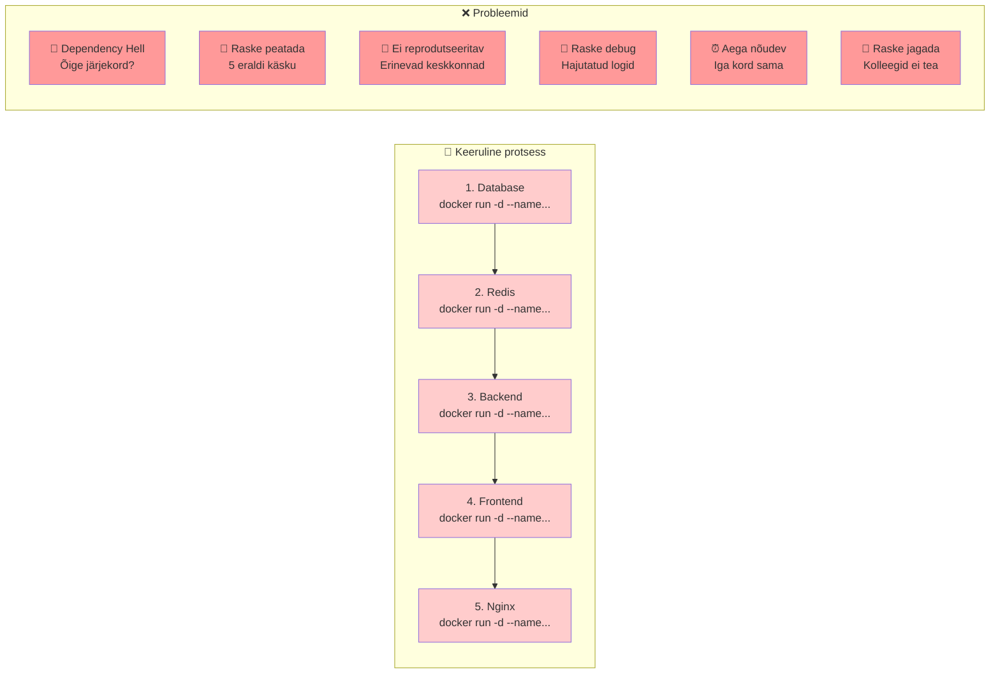

🤯 **Keeruline meelde jätta** - 5 erinevat käsku, igaühel oma parameetrid  
🔗 **Dependency hell** - peate teadma õiget järjekorda (db → redis → api → web → nginx)  
🚫 **Raske peatada** - peate peatama 5 eraldi container'it käsitsi  
📝 **Ei ole reprodutseeritav** - erinevad keskkonnad, erinevad seaded  
🔧 **Raske debuggida** - logid on hajutatud erinevatesse container'itesse  
⏰ **Aega nõudev** - iga kord sama protsess uuesti  
👥 **Raske jagada** - teie kolleegid ei tea, milliseid käske kasutada

### Docker Compose lahendus

**Docker Compose** on tööriist, mis võimaldab kirjeldada kogu rakenduse konfiguratsiooni ühes failis. See on nagu "retsept" - kirjeldate, milliseid komponente vajate ja kuidas need omavahel seotud on.

**Miks Docker Compose on parem?**
- **Üks fail** - kogu konfiguratsioon ühes kohas
- **Deklaratiivne** - kirjeldate, mida tahate, mitte kuidas seda teha
- **Reprodutseeritav** - sama tulemus igal masinal
- **Lihtne jagada** - faili saate jagada kolleegidega
- **Automaatne järjekord** - Compose teab, mis järjekorras käivitada

**Sama rakendus Docker Compose'iga:**

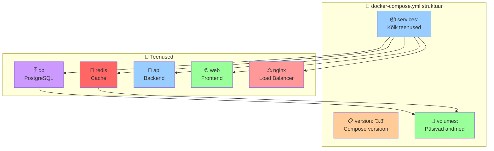

```yaml
# docker-compose.yml
# See fail kirjeldab kogu rakenduse struktuuri

version: '3.8'  # Compose faili versioon

services:  # Kõik teenused (container'id)
  # Database teenus - andmete salvestamine
  db:
    image: postgres:13  # Millist image'i kasutada
    environment:  # Keskkonnamuutujad
      POSTGRES_PASSWORD: secret
      POSTGRES_DB: myapp
    volumes:  # Püsivad andmed
      - db_data:/var/lib/postgresql/data

  # Cache teenus - kiire andmete juurdepääs
  redis:
    image: redis:alpine
    volumes:
      - redis_data:/data

  # Backend API - äriloogika ja andmete töötlemine
  api:
    image: myapp/api:latest
    environment:
      DATABASE_URL: postgres://postgres:secret@db:5432/myapp
      REDIS_URL: redis://redis:6379
    depends_on:  # Sõltuvused - mis teenused peavad käivituma enne
      - db
      - redis

  # Frontend - kasutajaliides
  web:
    image: myapp/web:latest
    environment:
      API_URL: http://api:3000
    depends_on:
      - api

  # Load balancer - koormuse jaotus ja SSL
  nginx:
    image: nginx:alpine
    ports:  # Avab pordid välismaailmale
      - "443:443"
    volumes:  # Seob konfiguratsioonifaili
      - ./nginx.conf:/etc/nginx/nginx.conf
    depends_on:
      - web
      - api

volumes:  # Püsivad andmed, mis säilivad container'ite vahel
  db_data:
  redis_data:
```

**Mida iga osa teeb?**

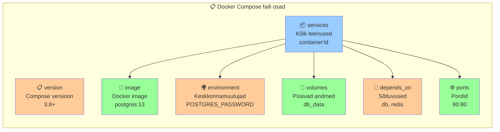

- **`version`** - Compose faili versioon (kasuta alati 3.8+)
- **`services`** - kõik teenused, mida rakendus vajab
- **`image`** - millist Docker image'i kasutada
- **`environment`** - keskkonnamuutujad (nagu `-e` käsus)
- **`volumes`** - püsivad andmed (nagu `-v` käsus)
- **`depends_on`** - sõltuvused (mis teenus käivitub enne)
- **`ports`** - avab pordid (nagu `-p` käsus)

**Kasu võrreldes käsitsi käivitamisega:**

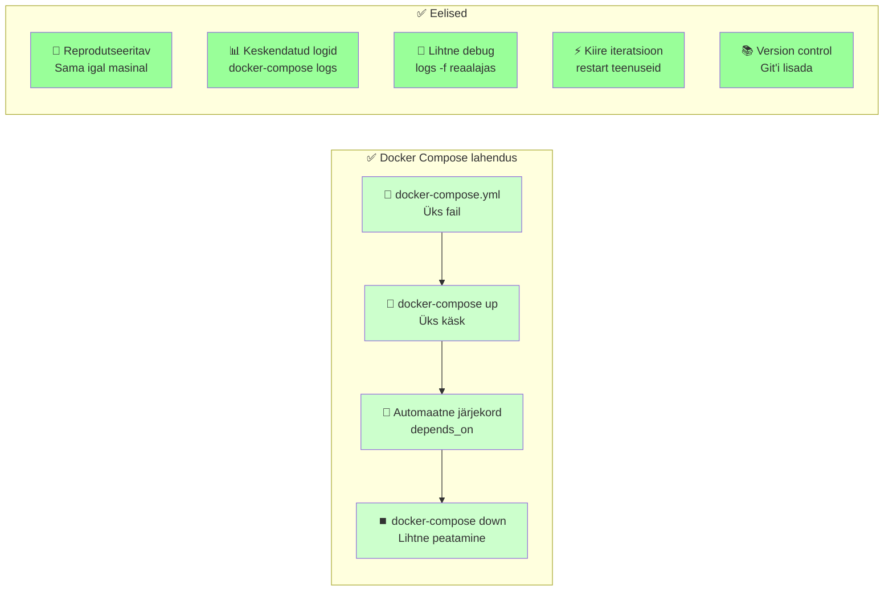

✅ **Üks käsk** - `docker-compose up` vs 5 eraldi käsku  
✅ **Automaatne järjekord** - `depends_on` teeb kindlaks, mis käivitub enne  
✅ **Lihtne peatamine** - `docker-compose down` peatab kõik korraga  
✅ **Reprodutseeritav** - sama tulemus igal masinal, igal arendajal  
✅ **Keskendatud logid** - `docker-compose logs` näitab kõiki logisid  
✅ **Lihtne debug** - `docker-compose logs -f` jälgib logisid reaalajas  
✅ **Kiire iteratsioon** - `docker-compose restart` taaskäivitab teenuse  
✅ **Version control** - faili saate Git'i lisada ja jagada

### Docker Compose põhimõtted

#### 1. Deklaratiivne konfiguratsioon
Sa kirjeldad, **mida** tahad, mitte **kuidas** seda saavutada. See on nagu restorani menüü - sa ütled, mida tahad süüa, mitte kuidas seda valmistada.

```mermaid
graph LR
    subgraph "🍽️ Restorani analoogia"
        Menu[📋 Menüü<br/>"Tahan pitsa"]
        Kitchen[👨‍🍳 Köök<br/>Teab kuidas valmistada]
        Food[🍕 Pitsa<br/>Valmis toit]
    end
    
    subgraph "🐳 Docker Compose"
        YAML[📄 docker-compose.yml<br/>"Tahan PostgreSQL"]
        Compose[⚙️ Compose<br/>Teab kuidas käivitada]
        Container[🐘 PostgreSQL<br/>Käivitatud andmebaas]
    end
    
    Menu --> Kitchen
    Kitchen --> Food
    
    YAML --> Compose
    Compose --> Container
    
    style Menu fill:#ffcc99
    style Kitchen fill:#99ccff
    style Food fill:#99ff99
    style YAML fill:#ffcc99
    style Compose fill:#99ccff
    style Container fill:#99ff99
```

**Näide:**
```yaml
# Sa ütled: "Tahan PostgreSQL andmebaasi"
db:
  image: postgres:13
  environment:
    POSTGRES_PASSWORD: secret
```
**Compose teeb:** Käivitab PostgreSQL container'i, seadistab parooli, loob andmebaasi

#### 2. Teenused (Services)
Iga konteiner on "teenus" - tal on nimi ja roll. Teenused on nagu restorani osakonnad - köök, teenindus, kassa.

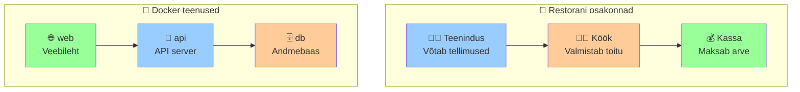

**Näide:**
```yaml
services:
  db:      # Teenuse nimi - andmebaas
  api:     # Teenuse nimi - API server
  web:     # Teenuse nimi - veebileht
```

#### 3. Võrgud ja andmete jagamine
Compose loob automaatselt võrgu, kus kõik teenused saavad omavahel suhelda. See on nagu restorani sisevõrk - köök saab suhelda teenindusega.

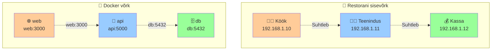

**Automaatne võrk:**
- Kõik teenused samas võrgus
- Teenused saavad üksteist leida nime järgi
- Näiteks: `db:5432` ühendub andmebaasi teenusega

## 🔍 **Põhilised mõisted ja protsessid**

### Kust tulevad Docker image'id?

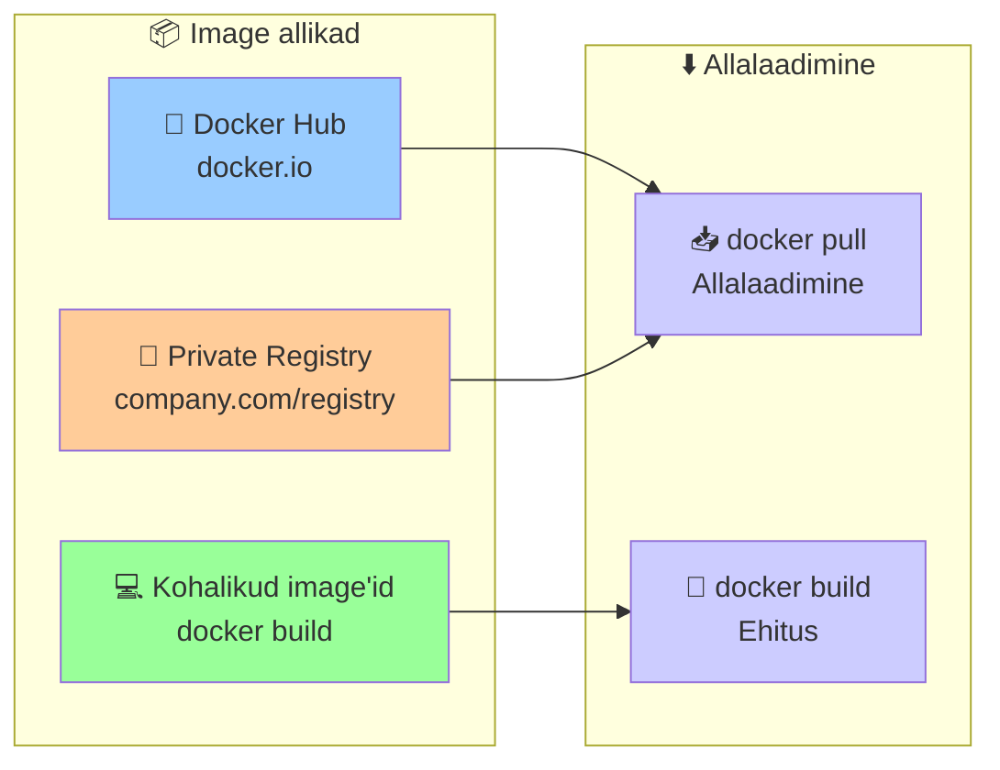

**Docker Hub** - avalik pood, kust saad alla laadida valmis image'id
- `docker pull nginx` - laeb alla nginx image'i
- `docker pull postgres:13` - laeb alla PostgreSQL versiooni 13

**Private Registry** - ettevõtte oma image'ite pood
- `docker pull company.com/myapp:latest`

**Kohalik ehitus** - teed ise image'i
- `docker build -t myapp .` - ehitad image'i kohalikult

### Kuidas image'id ehitatakse?

```mermaid
graph TB
    subgraph "🔨 Image ehitus"
        Dockerfile[📄 Dockerfile<br/>"Retsept"]
        Build[🔨 docker build<br/>Ehitus]
        Image[📦 Image<br/>Valmis pakett]
    end
    
    subgraph "📋 Dockerfile sisu"
        Base[🐧 Base Image<br/>Ubuntu, Alpine]
        Copy[📋 COPY<br/>Failide kopeerimine]
        Install[📦 RUN<br/>Paketite installimine]
        Expose[🌐 EXPOSE<br/>Pordi avamine]
        CMD[▶️ CMD<br/>Käivitamiskäsk]
    end
    
    Dockerfile --> Build
    Build --> Image
    
    Base --> Copy
    Copy --> Install
    Install --> Expose
    Expose --> CMD
    
    style Dockerfile fill:#ffcc99
    style Build fill:#99ccff
    style Image fill:#99ff99
    style Base fill:#ccccff
    style Copy fill:#ccccff
    style Install fill:#ccccff
    style Expose fill:#ccccff
    style CMD fill:#ccccff
```

**Dockerfile** - "retsept" image'i jaoks:
```dockerfile
# Base image - millest alustada
FROM node:16-alpine

# Töökataloog
WORKDIR /app

# Kopeeri failid
COPY package*.json ./
RUN npm install

# Kopeeri rakenduse failid
COPY . .

# Ava port
EXPOSE 3000

# Käivitamiskäsk
CMD ["npm", "start"]
```

### Millest koosneb Docker image?

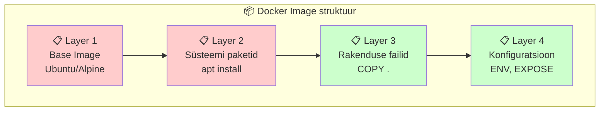

**Image koosneb kihtidest (layers):**
- **Base layer** - operatsioonisüsteem (Ubuntu, Alpine)
- **System layer** - süsteemi paketid ja tööriistad
- **Application layer** - sinu rakenduse failid
- **Config layer** - keskkonnamuutujad ja seaded

### Kuidas container'id töötavad?

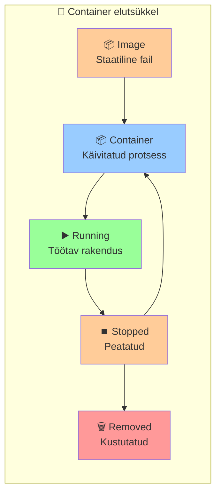

**Container elutsükkel:**
1. **Image** - staatiline fail (nagu ZIP)
2. **Container** - käivitatud image (nagu programm)
3. **Running** - töötav rakendus
4. **Stopped** - peatatud, aga alles
5. **Removed** - kustutatud

### Põhikäsud

Docker Compose'iga on kõik lihtne - ainult mõni põhikäsk, mida peate teadma:

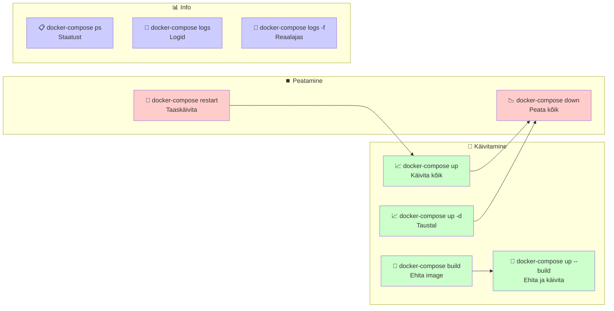

```bash
# Käivita kõik teenused (näete logisid)
docker-compose up

# Käivita taustal (detached mode - ei näe logisid)
docker-compose up -d

# Peata ja eemalda kõik teenused
docker-compose down

# Vaata teenuste staatust
docker-compose ps

# Vaata konkreetse teenuse logisid
docker-compose logs web

# Jälgi logisid reaalajas (nagu tail -f)
docker-compose logs -f

# Taaskäivita konkreetne teenus
docker-compose restart api

# Ehita image uuesti (kui muutsite Dockerfile'i)
docker-compose build

# Ehita ja käivita uuesti
docker-compose up --build
```

**Praktiline näide:**
```bash
# 1. Käivita rakendus
docker-compose up -d

# 2. Vaata, kas kõik töötab
docker-compose ps

# 3. Vaata logisid, kui midagi ei tööta
docker-compose logs -f

# 4. Peata rakendus
docker-compose down
```

---

## 📖 Loeng 21.2: Multi-service Applications (15 min)

### Teenuste tüübid ja rollid

#### Web Application Stack

```yaml
version: '3.8'

services:
  # Frontend - kasutajaliides
  frontend:
    image: nginx:alpine
    ports:
      - "80:80"
    volumes:
      - ./frontend:/usr/share/nginx/html
    depends_on:
      - backend

  # Backend - API server
  backend:
    build: ./backend
    environment:
      - DATABASE_URL=postgres://user:pass@db:5432/app
      - REDIS_URL=redis://cache:6379
    depends_on:
      - db
      - cache

  # Database - andmete salvestamine
  db:
    image: postgres:13
    environment:
      - POSTGRES_DB=app
      - POSTGRES_USER=user
      - POSTGRES_PASSWORD=pass
    volumes:
      - postgres_data:/var/lib/postgresql/data

  # Cache - kiire andmete juurdepääs
  cache:
    image: redis:alpine
    volumes:
      - redis_data:/data

volumes:
  postgres_data:
  redis_data:
```

### Dependency Management

#### depends_on - teenuste järjekord

```yaml
services:
  app:
    image: myapp:latest
    depends_on:
      - db
      - redis
      - elasticsearch

  db:
    image: postgres:13
    healthcheck:
      test: ["CMD-SHELL", "pg_isready -U postgres"]
      interval: 10s
      timeout: 5s
      retries: 5

  redis:
    image: redis:alpine
    healthcheck:
      test: ["CMD", "redis-cli", "ping"]
      interval: 10s
      timeout: 3s
      retries: 5
```

### Networking

#### Default Network
Compose loob automaatselt võrgu, kus teenused saavad omavahel suhelda teenuse nimede abil.

```yaml
services:
  web:
    image: nginx
    # Saab ühenduda db teenusega: db:5432

  db:
    image: postgres
    # Teenuse nimi 'db' on automaatselt DNS-is
```

#### Custom Networks

```yaml
services:
  web:
    image: nginx
    networks:
      - frontend
      - backend

  api:
    image: myapp/api
    networks:
      - backend

  db:
    image: postgres
    networks:
      - backend

networks:
  frontend:
    driver: bridge
  backend:
    driver: bridge
    internal: true  # Ainult sisemine võrk
```

---

## 📖 Loeng 21.3: Lihtne orkestreerimine (5 min)

### Miks Docker Compose on piisav?

**Docker Compose** on lihtne ja piisav enamiku rakenduste jaoks. Ära keeruta lihtsaid asju keeruliseks!

### Millal vajad midagi keerukamat?

**Docker Compose sobib, kui:**
- Sul on väike kuni keskmine rakendus
- Kõik teenused jooksevad ühel masinal
- Sul pole vaja automaatset skaleerimist
- Tahad lihtsat ja kiiret setup'i

**Vajad midagi keerukamat, kui:**
- Sul on palju masinaid (cluster)
- Vajad automaatset skaleerimist
- Sul on väga suur rakendus
- Vajad kõrget kättesaadavust

### Lihtne soovitus

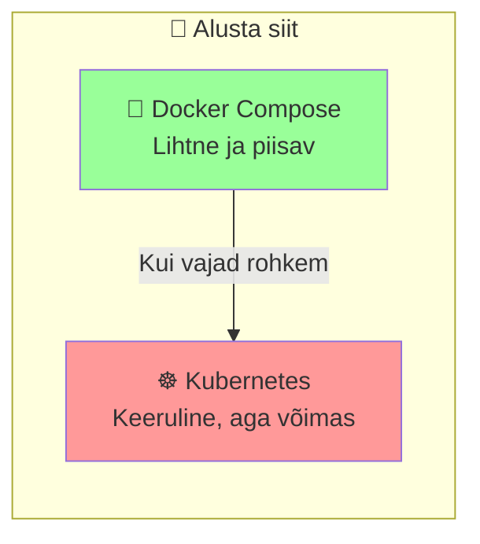

**Õppimise järjekord:**
1. **Docker Compose** - alusta siit
2. **Kubernetes** - kui vajad rohkem
3. **Alternatiivid** - kui K8s pole õige valik

**Lihtne reegel:** Ära kasuta Kubernetes'i, kui Docker Compose töötab!

---

## 📖 Loeng 21.4: Environment Management (10 min)

### Environment-specific configurations

#### Development vs Production

```yaml
# docker-compose.yml (base)
version: '3.8'

services:
  web:
    image: nginx:alpine
    ports:
      - "${WEB_PORT:-80}:80"
    environment:
      - NODE_ENV=${NODE_ENV:-development}
      - DEBUG=${DEBUG:-true}
    volumes:
      - ./src:/app/src:ro

  db:
    image: postgres:13
    environment:
      - POSTGRES_DB=${DB_NAME:-app}
      - POSTGRES_USER=${DB_USER:-user}
      - POSTGRES_PASSWORD=${DB_PASSWORD:-pass}
```

#### Environment Files

```bash
# .env.development
WEB_PORT=3000
NODE_ENV=development
DEBUG=true
DB_NAME=app_dev
DB_USER=dev_user
DB_PASSWORD=dev_pass

# .env.production
WEB_PORT=80
NODE_ENV=production
DEBUG=false
DB_NAME=app_prod
DB_USER=prod_user
DB_PASSWORD=prod_pass
```

#### Environment-specific Compose Files

```yaml
# docker-compose.override.yml (development)
version: '3.8'

services:
  web:
    volumes:
      - ./src:/app/src:ro
      - ./logs:/app/logs
    environment:
      - DEBUG=true
      - LOG_LEVEL=debug

  db:
    ports:
      - "5432:5432"  # Expose for debugging
```

```yaml
# docker-compose.prod.yml (production)
version: '3.8'

services:
  web:
    restart: unless-stopped
    environment:
      - DEBUG=false
      - LOG_LEVEL=warn
    deploy:
      replicas: 3

  db:
    restart: unless-stopped
    volumes:
      - postgres_data:/var/lib/postgresql/data
```

### Kasutamine erinevates keskkondades

```bash
# Development
docker-compose up

# Production
docker-compose -f docker-compose.yml -f docker-compose.prod.yml up -d

# Staging
docker-compose -f docker-compose.yml -f docker-compose.staging.yml up -d
```

---

## 📖 Loeng 21.5: Kubernetes Introduction (15 min)

### Miks Kubernetes?

#### Docker Compose piirangud
- **Single host** - ainult ühel masinal
- **No auto-scaling** - käsitsi skaleerimine
- **Limited orchestration** - lihtne orkestreerimine
- **No self-healing** - käsitsi taaskäivitamine

#### Kubernetes eelised
- **Multi-host** - mitmel masinal
- **Auto-scaling** - automaatne skaleerimine
- **Self-healing** - automaatne taaskäivitamine
- **Load balancing** - automaatne koormuse jaotus
- **Rolling updates** - katkestusteta uuendused

### Kubernetes põhikomponendid

#### Pod
```yaml
apiVersion: v1
kind: Pod
metadata:
  name: web-pod
spec:
  containers:
  - name: web
    image: nginx:alpine
    ports:
    - containerPort: 80
```

#### Deployment
```yaml
apiVersion: apps/v1
kind: Deployment
metadata:
  name: web-deployment
spec:
  replicas: 3
  selector:
    matchLabels:
      app: web
  template:
    metadata:
      labels:
        app: web
    spec:
      containers:
      - name: web
        image: nginx:alpine
        ports:
        - containerPort: 80
```

#### Service
```yaml
apiVersion: v1
kind: Service
metadata:
  name: web-service
spec:
  selector:
    app: web
  ports:
  - port: 80
    targetPort: 80
  type: LoadBalancer
```

### Minikube - Local Kubernetes

```bash
# Install Minikube
curl -LO https://storage.googleapis.com/minikube/releases/latest/minikube-linux-amd64
sudo install minikube-linux-amd64 /usr/local/bin/minikube

# Start cluster
minikube start

# Deploy application
kubectl apply -f deployment.yaml

# Access application
minikube service web-service
```

### Docker Compose vs Kubernetes

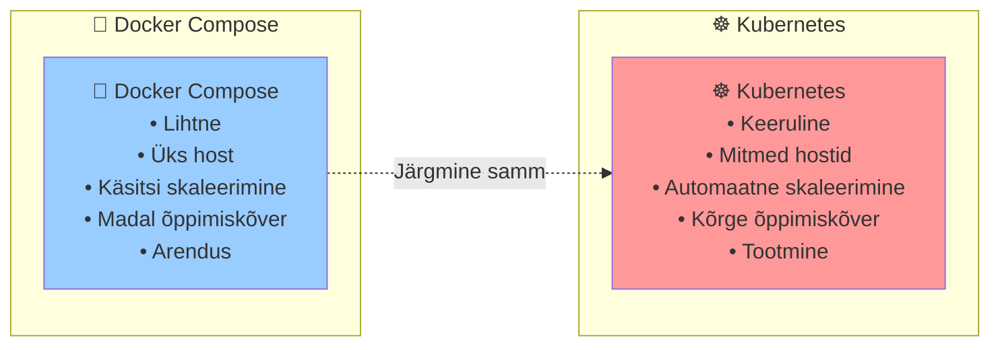

| Feature | Docker Compose | Kubernetes |
|---------|----------------|------------|
| **Complexity** | Lihtne | Keeruline |
| **Hosts** | Single | Multiple |
| **Scaling** | Manual | Auto |
| **Learning curve** | Madal | Kõrge |
| **Use case** | Development | Production |

---

## 🎯 Kokkuvõte

Pärast seda nädalat oskate:

✅ **Docker Compose** - multi-container rakenduste haldamine  
✅ **Environment management** - erinevate keskkondade konfigureerimine  
✅ **Podman alternatives** - rootless container orkestreerimine  
✅ **Kubernetes basics** - production-ready orkestreerimise alused  
✅ **Best practices** - turvaline ja skaleeritav arhitektuur  

### 🎯 **Praktiline soovitus:**

**Alusta lihtsast:**
1. **Docker Compose** - lihtsate rakenduste jaoks
2. **Kubernetes** - kui vajad rohkem funktsionaalsust
3. **Alternatiivid** - kui K8s on liiga keeruline

**Õppimise järjekord:**
- **Nädal 21:** Docker Compose põhialused
- **Järgmised nädalad:** Kubernetes sügavamalt
- **Tulevikus:** Alternatiivide tutvustus

**Järgmine samm:** Laboris praktiseerime lihtsa rakenduse juurutamist!

---

## 🤔 **Lihtne mõte: Ära järgi hüpe**

### Miks see oluline on?

Oleme õppinud Docker Compose'i ja orkestreerimist, aga on oluline mõista: **lihtne on parem**.

### Lihtne vs keeruline

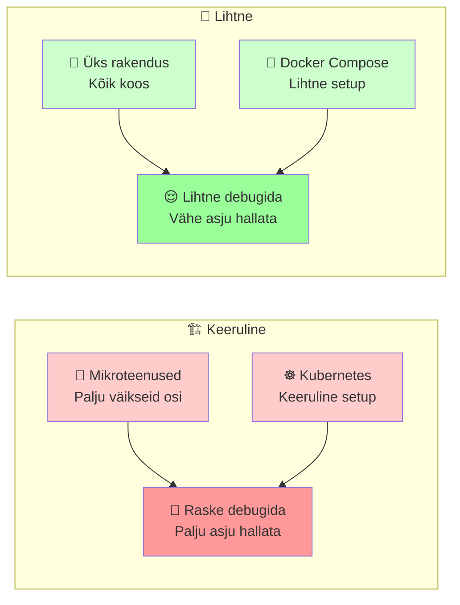

### Lihtne õpetus

**Alusta lihtsast:**
- Üks rakendus, üks andmebaas
- Docker Compose lihtsateks asjadeks
- Lisa keerukust ainult siis, kui vajad

**Ära järgi hüpe:**
- Mikroteenused pole alati parem
- Kubernetes pole alati vajalik
- Lihtne on parem kui keeruline

### Lõppmõte

**Vali see, mis töötab sinu jaoks.** Mõnikord on lihtne lahendus parim lahendus.

---

## 📚 Lisaressursid ja dokumentatsioon

### 🎓 **Õppimiseks:**
- [Docker Compose Documentation](https://docs.docker.com/compose/) - ametlik dokumentatsioon
- [Docker Compose Quickstart](https://docs.docker.com/compose/gettingstarted/) - kiire algus
- [Docker Compose Examples](https://github.com/docker/awesome-compose) - palju näiteid

### 🔧 **Praktikaks:**
- [Docker Compose Reference](https://docs.docker.com/compose/compose-file/) - kõik võimalikud seaded
- [Docker Compose Best Practices](https://docs.docker.com/compose/production/) - tootmiskeskkonna nõuded
- [Docker Compose Networking](https://docs.docker.com/compose/networking/) - võrgu konfiguratsioon

### 🆘 **Abi saamiseks:**
- [Docker Community](https://forums.docker.com/) - foorumid
- [Stack Overflow](https://stackoverflow.com/questions/tagged/docker-compose) - küsimused ja vastused
- [Docker Hub](https://hub.docker.com/) - valmis image'id

### 📖 **Alternatiivide kohta:**
- [Podman Compose](https://github.com/containers/podman-compose) - rootless alternatiiv
- [Kubernetes Documentation](https://kubernetes.io/docs/) - kui vajate rohkem
- [Minikube](https://minikube.sigs.k8s.io/docs/) - kohalik Kubernetes

### 🤔 **Lihtsate lahenduste kohta:**
- [Start Simple](https://martinfowler.com/bliki/MonolithFirst.html) - Alusta lihtsast
- [Docker Compose Best Practices](https://docs.docker.com/compose/production/) - Tootmiskeskkonna nõuded

### 📚 **Rohkem lugemist orkestreerimise kohta:**
- [16 Most Useful Container Orchestration Tools in 2025](https://spacelift.io/blog/container-orchestration-tools) - Ülevaade erinevatest orkestreerimise tööriistadest
