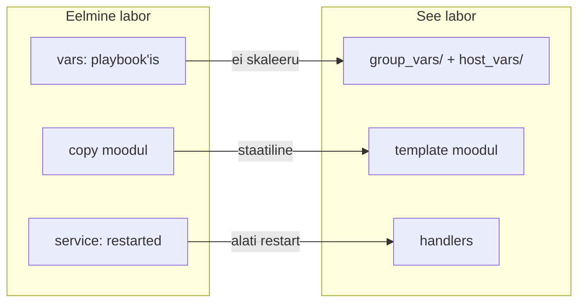
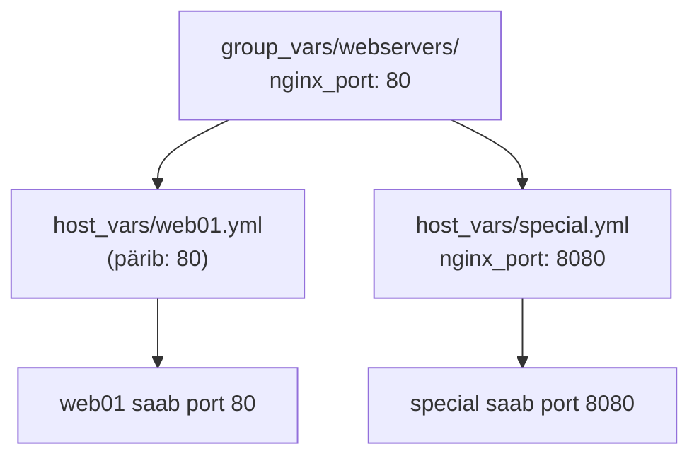
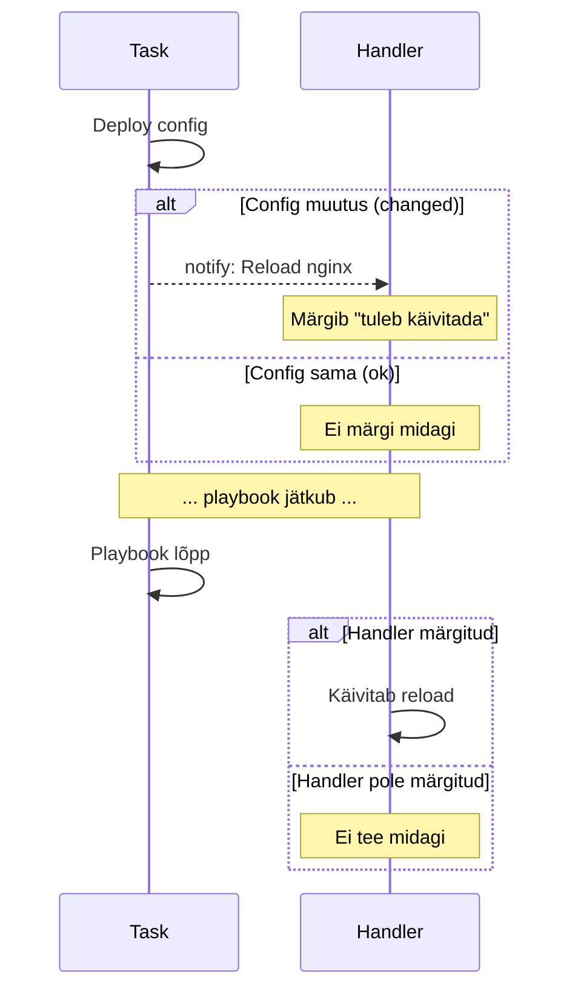
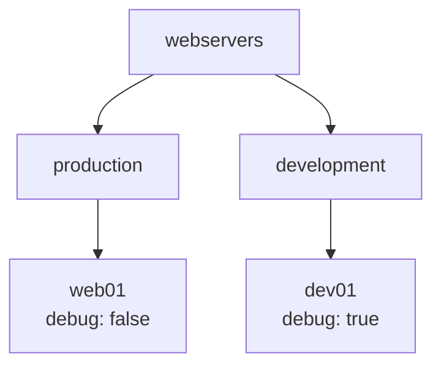

# Ansible Edasijõudnud Labor

**Eeldused:** Ansible alused labor läbitud  
**Platvorm:** Ubuntu 24.04, Proxmox  
**Kestus:** ~2 tundi

---

## Sisukord

1. [Õpiväljundid](#õpiväljundid)
2. [Eelmise Labori Meeldetuletus](#eelmise-labori-meeldetuletus)
3. [Selle Labori Uued Teemad](#selle-labori-uued-teemad)
4. [Muutujate Hierarhia](#1-muutujate-hierarhia)
5. [Jinja2 Template'id](#2-jinja2-templateid)
6. [Handler'id](#3-handlerid)
7. [Deployment Playbook](#4-deployment-playbook)
8. [Mitme Keskkonna Lisamine](#5-mitme-keskkonna-lisamine)
9. [Lõplik Kontroll](#lõplik-kontroll)
10. [Boonus: Ansible Vault](#boonus-ansible-vault)
11. [Viited](#viited)

---

## Õpiväljundid

Pärast laborit oskad:

- Kasutada muutujate hierarhiat (group_vars → host_vars)
- Luua Jinja2 template'eid tingimuslausetega
- Rakendada handler'eid teenuste haldamiseks
- Ehitada struktureeritud Ansible projekti Git'iga

---

## Eelmise Labori Meeldetuletus

Eelmises laboris õppisid Ansible põhitõdesid. Tegid inventory faili, kus kirjeldasid oma serverid. Kasutasid ad-hoc käske kiireks testimiseks. Lõid esimese playbook'i, kus olid task'id ja moodulid nagu `apt`, `copy`, `service`.

| Teema | Mida tegid |
|-------|------------|
| Inventory | Hostide nimekiri YAML formaadis |
| Ad-hoc | `ansible -m ping`, `ansible -m shell` |
| Playbook | YAML fail: `hosts:`, `tasks:`, `become:` |
| Moodulid | `apt`, `copy`, `service`, `file` |

Kui midagi on ununenud, vaata eelmise labori materjale enne jätkamist.

---

## Selle Labori Uued Teemad

Eelmises laboris töötasid muutujatega otse playbook'i sees `vars:` blokis. See toimib, aga tekitab probleeme kui sul on palju servereid. Samuti kasutasid `copy` moodulit, mis kopeerib faili täpselt nii nagu ta on - aga mis siis kui iga server vajab veidi erinevat konfiguratsiooni?

Selles laboris õpid kolm uut tehnikat, mis lahendavad need probleemid:



| Probleem | Lahendus |
|----------|----------|
| Muutujad playbook'is - kõik hostid saavad sama | group_vars → host_vars hierarhia |
| `copy` - fail 1:1, ei muutu | `template` - asendab {{ muutujad }} |
| `service: restarted` - käivitub iga kord | handler - käivitub ainult kui config muutus |

---

## 1. Muutujate Hierarhia

### 1.1 Miks Me Seda Vajame?

Kujuta ette olukorda: sul on 50 serverit. 45 neist kasutavad nginx porti 80, aga 5 serverit peavad kasutama porti 8080. Kuidas sa seda lahendaksid eelmise labori teadmistega?

Üks võimalus oleks teha 50 erinevat playbook'i - aga see on hull. Teine võimalus oleks kirjutada üks playbook 50 erineva `when:` tingimusega - aga see muutub kiiresti loetamatuks.

Ansible pakub parema lahenduse: muutujate hierarhia. Sa defineerid vaikeväärtuse grupile (näiteks "kõik webserverid kasutavad porti 80") ja siis kirjutad üle ainult seal, kus vaja (näiteks "aga server5 kasutab porti 8080").



Alumine tase võidab alati. Kui defineerid sama muutuja mitmes kohas, siis kõige spetsiifilisem väärtus kehtib.

### 1.2 Projekti Struktuuri Loomine

Jätka samas kaustas, kus tegid eelmise labori. Seal on juba Git ja inventory olemas.

```bash
cd ~/ansible-alused   # Või kuhu tegid eelmise labori
```

Lisa juurde uued kaustad:

```bash
mkdir -p group_vars/webservers host_vars templates
```

Nüüd loome kaustade struktuuri. Ansible otsib muutujaid automaatselt kindlatest kohtadest - sa ei pea ütlema "lae muutujad siit failist", Ansible leiab need ise üles:

```bash
mkdir -p group_vars/webservers host_vars templates
```

See loob järgmise struktuuri:

| Kaust | Mida Ansible teeb |
|-------|-------------------|
| `group_vars/webservers/` | Laeb automaatselt kõigile hostidele, kes kuuluvad `webservers` gruppi |
| `host_vars/` | Laeb automaatselt hostile, kelle nimi vastab faili nimele |
| `templates/` | Siia paneme Jinja2 template failid |

### 1.3 Inventory Uuendamine

Sul peaks eelmisest laborist olema `inventory.yml` juba olemas. Kontrolli, et seal on `webservers` grupp:

```yaml
---
all:
  children:
    webservers:
      hosts:
        web01:
          ansible_host: <sinu-ubuntu2-ip>   # Sinu Ubuntu 2 IP
          ansible_user: ansible
```

Kui struktuur on teistsugune, uuenda see selliseks. Grupi nimi `webservers` on oluline, sest `group_vars/webservers/` kaust peab vastama.

Kontrolli ühendust:

```bash
ansible -i inventory.yml all -m ping
```

### 1.4 Grupi Muutujad

Nüüd loome muutujad, mis kehtivad kõigile `webservers` grupi serveritele. Loo fail `group_vars/webservers/main.yml`:

```yaml
---
# Nginx seaded - kehtivad KÕIGILE webservers grupis
nginx_port: 80
nginx_root: "/var/www/html"
nginx_user: "www-data"
nginx_worker_connections: 1024

# Rakenduse info
app_name: "MinuApp"
app_environment: "production"
```

Miks faili nimi on `main.yml`? Ansible laeb tegelikult kõik YAML failid sellest kaustast automaatselt. `main.yml` on lihtsalt konventsioon peamise faili jaoks. Suurtes projektides võid muutujad jagada mitmesse faili: `main.yml`, `nginx.yml`, `database.yml` jne.

### 1.5 Hosti Muutujad

Mõnikord vajab konkreetne server erinevaid seadeid kui teised. Selleks kasutame `host_vars` kausta. Loo fail `host_vars/web01.yml`:

```yaml
---
server_name: "<sinu-ubuntu2-ip>"
debug_mode: false
```

Pane siia oma Ubuntu 2 IP-aadress. Miks me kasutame IP-d, mitte hostname'i nagu `web01.minunimi.local`? Nginx `server_name` direktiiv töötab hostname'iga ainult siis, kui DNS server või `/etc/hosts` fail teab seda nime. Meie laboris pole DNS serverit seadistatud, seega brauserist pääseme ligi ainult IP-aadressiga. Kui paneksime sinna hostname'i, siis nginx töötaks küll, aga see oleks segadusttekitav.

### 1.6 Muutujate Testimine

Kontrollime, kas Ansible leiab meie muutujad üles. Loo lihtne test playbook `test_vars.yml`:

```yaml
---
- name: Test variables
  hosts: webservers
  gather_facts: no
  
  tasks:
    - name: Show variables
      ansible.builtin.debug:
        msg: |
          App: {{ app_name }}
          Server: {{ server_name }}
          Port: {{ nginx_port }}
          Debug: {{ debug_mode }}
```

See playbook ei tee midagi serveris - ta lihtsalt näitab muutujate väärtusi. Pane tähele, et me ei defineeri muutujaid kusagil playbook'i sees. Ansible leiab need automaatselt `group_vars/` ja `host_vars/` kaustadest.

Käivita:

```bash
ansible-playbook -i inventory.yml test_vars.yml
```

Sa peaksid nägema kõiki muutujaid koos nende väärtustega. Kui mõni muutuja on "undefined", siis kontrolli faili nimesid ja kausta struktuuri.

Salvesta töö Git'i:

```bash
git add .
git commit -m "Add variable hierarchy"
```

### Kontroll

- [ ] `group_vars/webservers/main.yml` olemas ja sisaldab nginx muutujaid
- [ ] `host_vars/web01.yml` olemas ja sisaldab server_name muutujat
- [ ] Test playbook näitab kõiki muutujaid õigesti

---

## 2. Jinja2 Template'id

### 2.1 Miks Template'id?

Eelmises laboris kasutasid `copy` moodulit failide kopeerimiseks serverisse. See töötab hästi staatiliste failide jaoks, mis on kõigil serveritel täpselt samad.

Aga mis siis, kui nginx konfiguratsioon peab sisaldama serveri nime, mis on igal serveril erinev? Või kui development serveris tahad näha rohkem logisid kui production serveris?

`copy` mooduliga peaksid tegema eraldi konfiguratsioonifaili iga serveri jaoks. 50 serverit = 50 faili. Ja kui tahad midagi muuta, pead muutma kõigis 50 failis.

Template lahendab selle probleemi elegantselt. Sa kirjutad ühe faili, kus on "tühikud" muutujate jaoks: `{{ server_name }}`. Ansible asendab need tühikud iga serveri jaoks õige väärtusega.

### 2.2 Jinja2 Süntaks

Ansible kasutab Jinja2 nimelist template keelt. Siin on põhilised konstruktsioonid:

| Süntaks | Mida teeb | Näide |
|---------|-----------|-------|
| `{{ muutuja }}` | Asendab muutuja väärtusega | `{{ nginx_port }}` → `80` |
| `` | Algab tingimusplokk | `` |
| `` | Alternatiivne haru | `` |
| `` | Lõpetab tingimusploki | `` |
| `{{ muutuja \| filter }}` | Rakendab filtri | `{{ nimi \| upper }}` → `NIMI` |

Tingimuslaused on eriti kasulikud. Sa saad öelda: "kui see on development server, siis lisa debug konfiguratsioon, muidu ära lisa."

### 2.3 Nginx Konfiguratsiooni Template

Nüüd loome päris template faili. See on nginx konfiguratsioon, mis kasutab meie muutujaid. Loo fail `templates/nginx.conf.j2` (`.j2` laiend näitab, et tegemist on Jinja2 template'iga):

```nginx
# {{ ansible_managed }}
# Server: {{ server_name }}

user {{ nginx_user }};
worker_processes auto;
pid /run/nginx.pid;

events {
    worker_connections {{ nginx_worker_connections }};
}

http {
    include /etc/nginx/mime.types;
    default_type application/octet-stream;
    sendfile on;
    keepalive_timeout 65;


    # DEBUG: verbose logging
    access_log /var/log/nginx/access.log;
    error_log /var/log/nginx/error.log debug;

    # PRODUCTION: minimal logging
    access_log /var/log/nginx/access.log;
    error_log /var/log/nginx/error.log warn;


    server {
        listen {{ nginx_port }};
        server_name {{ server_name }};
        root {{ nginx_root }};
        index index.html;

        location / {
            try_files $uri $uri/ =404;
        }


        # Security headers (production only)
        add_header X-Frame-Options "SAMEORIGIN" always;
        add_header X-Content-Type-Options "nosniff" always;

    }
}
```

Vaata seda template'i hoolikalt:

- `{{ ansible_managed }}` - see on spetsiaalne Ansible muutuja, mis lisab kommentaari "Ansible generated, do not edit manually"
- `{{ nginx_user }}`, `{{ nginx_port }}` jne - need asendatakse meie muutujate väärtustega
- `...` - see osa lisatakse ainult siis, kui `debug_mode` on `true`
- `` - see osa lisatakse ainult siis, kui `debug_mode` on `false`

### 2.4 Ülesanne: HTML Template

Nüüd on sinu kord. Loo fail `templates/index.html.j2`, mis on lihtne veebileht. See peaks:

- Näitama `{{ app_name }}` pealkirjana (`<h1>` tag)
- Näitama `{{ server_name }}` ja `{{ app_environment }}`
- Kui `debug_mode` on true, näitama lisaks: `{{ ansible_hostname }}` ja `{{ ansible_distribution }}`

Vihje: kasuta `...` struktuuri debug info jaoks.

Kui oled valmis, salvesta töö:

```bash
git add .
git commit -m "Add Jinja2 templates"
```

### Kontroll

- [ ] `templates/nginx.conf.j2` olemas ja kasutab muutujaid
- [ ] `templates/nginx.conf.j2` sisaldab `` tingimust
- [ ] `templates/index.html.j2` loodud ja kasutab muutujaid

---

## 3. Handler'id

### 3.1 Miks Handler'id?

Kui sa muudad nginx konfiguratsiooni, peab nginx uue konfiguratsiooni laadima. Eelmises laboris oleksid võib-olla kirjutanud midagi sellist:

```yaml
tasks:
  - name: Deploy config
    ansible.builtin.copy:
      src: nginx.conf
      dest: /etc/nginx/nginx.conf
  
  - name: Restart nginx
    ansible.builtin.service:
      name: nginx
      state: restarted
```

See töötab, aga on üks probleem: nginx restart'itakse IGA KORD kui playbook jookseb, isegi siis kui konfiguratsioon ei muutunud üldse. See on mõttetu ja katkestab kasutajate ühendused.

Handler lahendab selle. Handler on spetsiaalne task, mis käivitub ainult siis, kui teine task talle "märku annab" (notify) JA see teine task tegelikult midagi muutis.

```yaml
handlers:
  - name: Reload nginx
    ansible.builtin.service:
      name: nginx
      state: reloaded

tasks:
  - name: Deploy config
    ansible.builtin.template:
      src: nginx.conf.j2
      dest: /etc/nginx/nginx.conf
    notify: Reload nginx
```

Nüüd nginx reload'itakse ainult siis, kui konfiguratsioonifail tegelikult muutus.

### 3.2 Kuidas Handler Töötab?

Handler'i käitumine on järgmine:

1. Task jookseb ja teeb mingit tööd
2. Kui task midagi muutis (`changed`), siis ta saadab notify oma handler'ile
3. Handler ei käivitu kohe - ta jätab meelde, et teda kutsuti
4. Playbook'i lõpus käivituvad kõik handler'id, keda kutsuti



### 3.3 Reload vs Restart

Pane tähele, et me kasutame `state: reloaded`, mitte `state: restarted`. Mis vahe on?

| Tegevus | Mida teeb | Millal kasutada |
|---------|-----------|-----------------|
| `state: restarted` | Peatab teenuse täielikult, siis käivitab uuesti | Harva - katkestab kõik ühendused |
| `state: reloaded` | Laeb konfiguratsiooni uuesti, teenus jookseb edasi | Konfiguratsiooni muudatus - ühendused püsivad |

Production keskkonnas eelistame alati reload'i, sest see ei katkesta kasutajate tööd.

---

## 4. Deployment Playbook

### 4.1 Kõik Koos

Nüüd paneme kõik õpitu kokku ühte playbook'i. See playbook paigaldab nginx, seadistab konfiguratsiooni meie template'ist ja paneb veebilehe üles. Loo fail `deploy.yml`:

```yaml
---
- name: Deploy Nginx
  hosts: webservers
  become: yes
  gather_facts: yes

  handlers:
    - name: Reload nginx
      ansible.builtin.service:
        name: nginx
        state: reloaded

  tasks:
    - name: Install nginx
      ansible.builtin.apt:
        name: nginx
        state: present
        update_cache: yes
        cache_valid_time: 3600

    - name: Deploy nginx configuration
      ansible.builtin.template:
        src: templates/nginx.conf.j2
        dest: /etc/nginx/nginx.conf
        owner: root
        group: root
        mode: '0644'
        validate: "nginx -t -c %s"
      notify: Reload nginx

    - name: Deploy website
      ansible.builtin.template:
        src: templates/index.html.j2
        dest: "{{ nginx_root }}/index.html"
        owner: "{{ nginx_user }}"
        group: "{{ nginx_user }}"
        mode: '0644'

    - name: Ensure nginx is running
      ansible.builtin.service:
        name: nginx
        state: started
        enabled: yes
```

Mõned olulised asjad selles playbook'is:

- `gather_facts: yes` - Ansible kogub infot serveri kohta (OS, IP, hostname jne), mida saame template'ides kasutada
- `validate: "nginx -t -c %s"` - enne kui Ansible kirjutab uue konfiguratsiooni, testib ta seda. Kui config on vigane, siis vana jääb alles ja playbook annab vea
- `notify: Reload nginx` - kui template fail muutus, anna handler'ile märku

### 4.2 Käivitamine

Enne päris käivitamist on hea kontrollida, kas playbook on süntaktiliselt korrektne:

```bash
ansible-playbook -i inventory.yml deploy.yml --syntax-check
```

Kui vigu pole, võid teha "kuiva" käivituse, mis näitab mida playbook teeks, aga ei muuda tegelikult midagi:

```bash
ansible-playbook -i inventory.yml deploy.yml --check --diff
```

Kui kõik näeb hea välja, käivita päriselt:

```bash
ansible-playbook -i inventory.yml deploy.yml
```

### 4.3 Kontrollimine

Ava oma arvutis brauser ja mine aadressile `http://<sinu-ubuntu2-ip>`. Sa peaksid nägema oma HTML lehte, mis näitab rakenduse nime ja serveri infot.

Kui leht ei avane:
- Kontrolli kas nginx jookseb: `ansible -i inventory.yml web01 -m shell -a "systemctl status nginx" --become`
- Kontrolli kas port on lahti: `ansible -i inventory.yml web01 -m shell -a "ss -tlnp | grep 80" --become`

### 4.4 Idempotentsuse Test

Ansible üks olulisemaid omadusi on idempotentsus: sama playbook'i võib käivitada mitu korda ja tulemus on alati sama. Käivita playbook uuesti:

```bash
ansible-playbook -i inventory.yml deploy.yml
```

Vaata väljundi lõpus `PLAY RECAP` rida. `changed=` peaks olema 0 - see tähendab, et Ansible ei muutnud midagi, sest kõik oli juba õiges olekus.

See on väga oluline production keskkonnas. Sa võid playbook'i käivitada igal ajal ja olla kindel, et see ei tee midagi halba kui kõik on juba korras.

### 4.5 Handler'i Test

Nüüd testime, kas handler töötab õigesti. Muuda midagi nginx konfiguratsioonis:

```bash
nano group_vars/webservers/main.yml
```

Muuda näiteks `nginx_worker_connections` väärtust 1024 → 2048. Salvesta ja käivita playbook:

```bash
ansible-playbook -i inventory.yml deploy.yml
```

Vaata väljundit. Sa peaksid nägema:
- "Deploy nginx configuration" task näitab `changed`
- "Reload nginx" handler käivitub playbook'i lõpus

See on handler'i võlu - ta käivitub ainult siis, kui konfiguratsiooni fail tegelikult muutus.

Salvesta töö:

```bash
git add .
git commit -m "Add deployment playbook with handlers"
```

### Kontroll

- [ ] Playbook töötab vigadeta
- [ ] Veebileht on nähtav brauseris
- [ ] Teine käivitus näitab `changed=0`
- [ ] Konfiguratsiooni muutus käivitab handler'i

---

## 5. Mitme Keskkonna Lisamine

### 5.1 Eesmärk

Päris projektides on tavaliselt mitu keskkonda: development (arendus), staging (testimine), production (päris). Igal keskkonnal on veidi erinevad seaded.

Meie laboris lisame development keskkonna, kus `debug_mode: true`. Production jääb `debug_mode: false`. Nii näeme, kuidas template'id genereerivad erinevat sisu olenevalt keskkonnast.



### 5.2 Inventory Laiendamine

Muuda oma `inventory.yml` faili nii, et seal on kaks alamgruppi:

```yaml
---
all:
  children:
    webservers:
      children:
        production:
          hosts:
            web01:
              ansible_host: <sinu-ubuntu2-ip>
              ansible_user: ansible
        development:
          hosts:
            dev01:
              ansible_host: <sinu-ubuntu1-ip>
              ansible_user: ansible
```

Pane tähele struktuuri: `webservers` grupil on nüüd kaks "last" - `production` ja `development`. Mõlemad pärivad `webservers` grupi muutujad, aga saavad ka oma spetsiifilised muutujad.

### 5.3 Keskkonna Muutujad

Loo kaustad ja failid keskkonna-spetsiifiliste muutujate jaoks:

```bash
mkdir -p group_vars/production group_vars/development
```

Loo `group_vars/production/main.yml`:

```yaml
---
app_environment: "production"
debug_mode: false
```

Loo `group_vars/development/main.yml`:

```yaml
---
app_environment: "development"
debug_mode: true
```

### 5.4 Ülesanne: Dev01 Host Vars

Loo ise fail `host_vars/dev01.yml` - lisa `server_name` muutuja oma Ubuntu 1 IP-ga.

### 5.5 Selektiivne Deploy

Nüüd saad valida, millisesse keskkonda deploy'd:

```bash
# Ainult production serverid
ansible-playbook -i inventory.yml deploy.yml --limit production

# Ainult development serverid
ansible-playbook -i inventory.yml deploy.yml --limit development

# Kõik serverid
ansible-playbook -i inventory.yml deploy.yml
```

`--limit` on väga kasulik kui tahad testida muudatusi esmalt development'is enne production'i minekut.

### 5.6 Kontrollimine

Ava brauseris mõlemad aadressid:

- Production (`http://<ubuntu2-ip>`): leht EI näita debug infot
- Development (`http://<ubuntu1-ip>`): leht NÄITAB debug infot (hostname, OS jne)

See on sama template, aga genereerib erinevat HTML-i olenevalt `debug_mode` muutuja väärtusest.

Salvesta töö:

```bash
git add .
git commit -m "Add multi-environment support"
```

---

## Lõplik Kontroll

### Projekti Struktuur

Sinu projekt peaks nüüd välja nägema selline (lisaks eelmise labori failidele):

```
ansible-alused/          # Või sinu kausta nimi
├── .git/
├── inventory.yml        # Uuendatud
├── deploy.yml           # UUS
├── test_vars.yml        # UUS
├── group_vars/          # UUS kaust
│   ├── webservers/main.yml
│   ├── production/main.yml
│   └── development/main.yml
├── host_vars/           # UUS kaust
│   ├── web01.yml
│   └── dev01.yml
└── templates/           # UUS kaust
    ├── nginx.conf.j2
    └── index.html.j2
```

### Git Ajalugu

Kontrolli oma commit'e:

```bash
git log --oneline
```

Peaks olema vähemalt 4 commit'i, mis näitavad projekti arengut samm-sammult.

### Lõplik Kontrollnimekiri

- [ ] Muutujate hierarhia töötab (group_vars → host_vars)
- [ ] Template'id kasutavad muutujaid ja tingimuslauseid
- [ ] Handler käivitub ainult konfiguratsiooni muudatuse korral
- [ ] Production: debug=false, development: debug=true
- [ ] Mõlemad veebilehed töötavad brauseris
- [ ] Git ajalugu näitab loogilist arengut

---

## Troubleshooting

Kui midagi ei tööta, siin on levinumad probleemid ja lahendused:

| Probleem | Põhjus | Lahendus |
|----------|--------|----------|
| Permission denied (SSH) | SSH võti pole kopeeritud | `ssh-copy-id ansible@<ip>` |
| sudo password required | Sudo küsib parooli | Lisa käsule `--ask-become-pass` |
| Undefined variable | Kirjaviga muutuja nimes või fail puudu | Kontrolli failinimesid, kausta struktuuri |
| nginx config test failed | Template'is on viga | Logi serverisse: `ssh <ip>` ja `sudo nginx -t` |
| Handler ei käivitu | `notify` nimi ei klapi handler nimega | Kontrolli et nimed on TÄPSELT samad |
| Veebileht ei avane | nginx ei jookse või port kinni | `sudo systemctl status nginx` ja `sudo ss -tlnp | grep 80` |

---

## Boonus: Ansible Vault

Kui põhiosa on tehtud ja aega jääb üle, proovi Ansible Vault'i. Vault võimaldab krüpteerida tundlikke andmeid (paroolid, API võtmed) nii, et neid saab turvaliselt Git'i panna.

### Vault Faili Loomine

```bash
ansible-vault create group_vars/webservers/vault.yml
```

Ansible küsib parooli - vali midagi lihtsat testimiseks, näiteks `vault123`. Seejärel avaneb tekstiredaktor. Lisa sinna:

```yaml
---
vault_db_password: "SuperSecret123"
vault_api_key: "abc123xyz789"
```

Salvesta ja välju. Fail on nüüd krüpteeritud - kui avad selle tavalise `cat` käsuga, näed ainult krüpteeritud jama.

### Vault Muutujate Kasutamine

Vault muutujaid saad kasutada nagu tavalisi muutujaid. Lisa näiteks `templates/index.html.j2` faili:

```html
<!-- API Key: {{ vault_api_key }} -->
```

### Playbook Käivitamine Vault'iga

Kui playbook kasutab vault faile, pead ütlema Ansible'ile parooli:

```bash
# Küsib parooli interaktiivselt
ansible-playbook -i inventory.yml deploy.yml --ask-vault-pass

# Või kasuta paroolifaili (ära pane Git'i!)
echo "vault123" > .vault_pass
chmod 600 .vault_pass
ansible-playbook -i inventory.yml deploy.yml --vault-password-file .vault_pass
```

### Vault Käsud

| Käsk | Mida teeb |
|------|-----------|
| `ansible-vault create fail.yml` | Loo uus krüpteeritud fail |
| `ansible-vault edit fail.yml` | Muuda krüpteeritud faili |
| `ansible-vault view fail.yml` | Vaata sisu (ei muuda) |
| `ansible-vault encrypt fail.yml` | Krüpteeri olemasolev fail |
| `ansible-vault decrypt fail.yml` | Dekrüpteeri (ettevaatust!) |

**Oluline:** `.vault_pass` fail on juba `.gitignore`'is kui tegid projekti alguses õigesti. Kunagi ära pane vault parooli Git'i!

---

## Viited

| Teema | Link |
|-------|------|
| Variable Precedence | [docs.ansible.com/.../playbooks_variables.html](https://docs.ansible.com/ansible/latest/playbook_guide/playbooks_variables.html#variable-precedence-where-should-i-put-a-variable) |
| Jinja2 Templating | [docs.ansible.com/.../playbooks_templating.html](https://docs.ansible.com/ansible/latest/playbook_guide/playbooks_templating.html) |
| Handlers | [docs.ansible.com/.../playbooks_handlers.html](https://docs.ansible.com/ansible/latest/playbook_guide/playbooks_handlers.html) |
| Template Module | [docs.ansible.com/.../template_module.html](https://docs.ansible.com/ansible/latest/collections/ansible/builtin/template_module.html) |
| Directory Layout | [docs.ansible.com/.../sample_setup.html](https://docs.ansible.com/ansible/latest/tips_tricks/sample_setup.html) |
| Ansible Vault | [docs.ansible.com/.../vault.html](https://docs.ansible.com/ansible/latest/vault_guide/index.html) |
