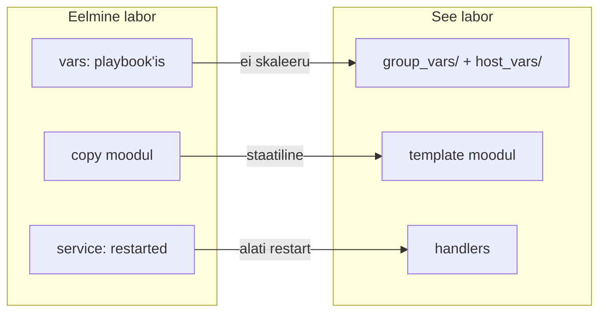
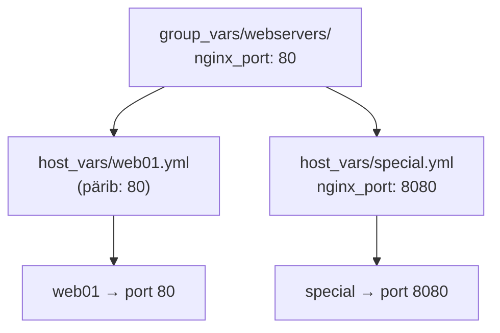
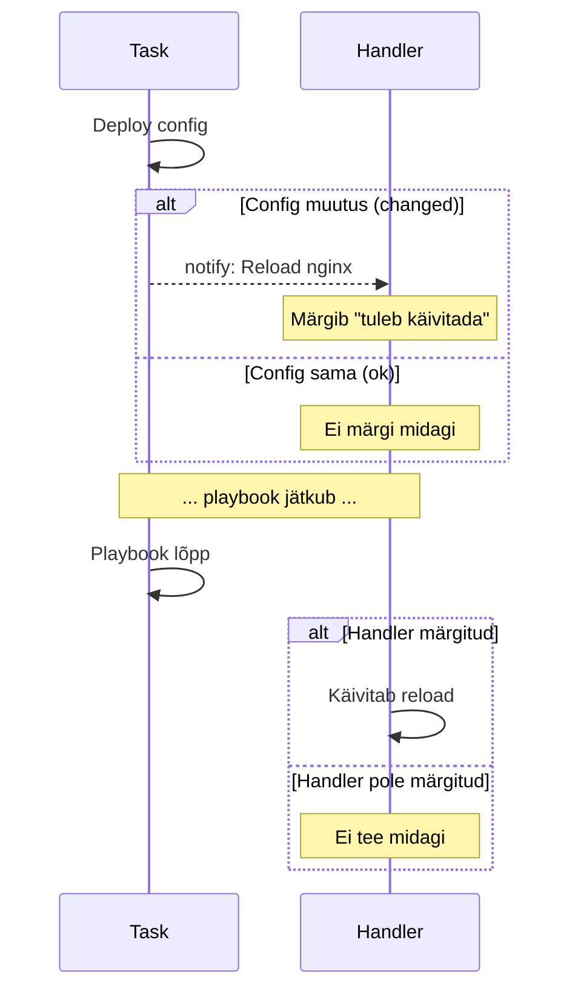
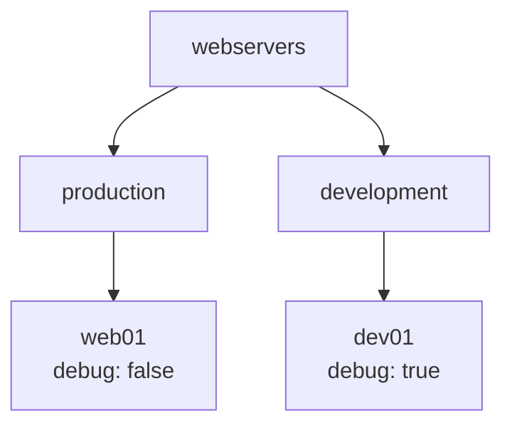

# Ansible Edasijõudnud Labor

**Eeldused:** Ansible alused labor läbitud  
**Platvorm:** Ubuntu 24.04, Proxmox  
**Kestus:** ~2 tundi

---

## Sisukord

1. [Õpiväljundid](#õpiväljundid)
2. [Eelmise Labori Meeldetuletus](#eelmise-labori-meeldetuletus)
3. [Selle Labori Uued Teemad](#selle-labori-uued-teemad)
4. [Muutujate Hierarhia](#1-muutujate-hierarhia)
5. [Jinja2 Template'id](#2-jinja2-templateid)
6. [Handler'id](#3-handlerid)
7. [Deployment Playbook](#4-deployment-playbook)
8. [Mitme Keskkonna Lisamine](#5-mitme-keskkonna-lisamine)
9. [Lõplik Kontroll](#lõplik-kontroll)
10. [Viited](#viited)

---

## Õpiväljundid

Pärast laborit oskad:

- Kasutada muutujate hierarhiat (group_vars → host_vars)
- Luua Jinja2 template'eid tingimuslausetega
- Rakendada handler'eid teenuste haldamiseks
- Ehitada struktureeritud Ansible projekti Git'iga

---

## Eelmise Labori Meeldetuletus

| Teema | Mida tegid |
|-------|------------|
| Inventory | Hostide nimekiri YAML formaadis |
| Ad-hoc | `ansible -m ping`, `ansible -m shell` |
| Playbook | YAML fail: `hosts:`, `tasks:`, `become:` |
| Moodulid | `apt`, `copy`, `service`, `file` |

---

## Selle Labori Uued Teemad



| Probleem | Lahendus |
|----------|----------|
| Muutujad playbook'is - kõik hostid sama | group_vars → host_vars hierarhia |
| `copy` - fail 1:1, ei muutu | `template` - asendab {{ muutujad }} |
| `service: restarted` - iga kord | handler - ainult kui config muutus |

---

## 1. Muutujate Hierarhia

### 1.1 Miks?

50 serverit. 45 kasutavad porti 80, 5 kasutavad 8080.

Eelmise labori teadmistega: 50 erinevat playbook'i? Või üks playbook 50 `when:` tingimusega?

Hierarhiaga: üks vaikeväärtus grupile, override ainult seal kus vaja.



### 1.2 Projekti Struktuur

Loo uus projekt Git repona:

```bash
cd ~
mkdir ansible-nginx && cd ansible-nginx
git init
mkdir -p group_vars/webservers host_vars templates
```

Ansible otsib muutujaid automaatselt:

| Kaust | Mida Ansible teeb |
|-------|-------------------|
| `group_vars/webservers/` | Laeb kõigile webservers grupi hostidele |
| `host_vars/web01.yml` | Laeb ainult hostile nimega web01 |

### 1.3 Inventory

Loo `inventory.yml`:

```yaml
---
all:
  children:
    webservers:
      hosts:
        web01:
          ansible_host: <sinu-ubuntu2-ip>   # Asenda oma IP-ga
          ansible_user: ansible
```

Testi:

```bash
ansible -i inventory.yml all -m ping
```

### 1.4 Grupi Muutujad

Loo `group_vars/webservers/main.yml`:

```yaml
---
# Nginx seaded - kehtivad KÕIGILE webservers grupis
nginx_port: 80
nginx_root: "/var/www/html"
nginx_user: "www-data"
nginx_worker_connections: 1024

# Rakenduse info
app_name: "MinuApp"
app_environment: "production"
```

### 1.5 Hosti Muutujad

Loo `host_vars/web01.yml`:

```yaml
---
# Ainult web01 jaoks - kirjutab grupi muutujad üle
server_name: "web01.yourname.local"
debug_mode: false
```

### 1.6 Testimine

Loo `test_vars.yml`:

```yaml
---
- name: Test variables
  hosts: webservers
  gather_facts: no
  
  tasks:
    - name: Show variables
      ansible.builtin.debug:
        msg: |
          App: {{ app_name }}
          Server: {{ server_name }}
          Port: {{ nginx_port }}
          Debug: {{ debug_mode }}
```

Käivita:

```bash
ansible-playbook -i inventory.yml test_vars.yml
```

Kontrolli väljundit - kõik muutujad peaksid töötama.

```bash
git add . && git commit -m "Add variable hierarchy"
```

### Kontroll

- [ ] `group_vars/webservers/main.yml` olemas
- [ ] `host_vars/web01.yml` olemas
- [ ] Test playbook näitab õigeid väärtusi

---

## 2. Jinja2 Template'id

### 2.1 Miks?

`copy` moodul kopeerib faili täpselt nagu ta on. Aga kui nginx.conf peab sisaldama serveri nime, mis on igal serveril erinev?

Template lahendab: kirjutad `{{ server_name }}` ja Ansible asendab selle muutuja väärtusega.

### 2.2 Jinja2 Süntaks

| Süntaks | Tähendus | Näide |
|---------|----------|-------|
| `{{ var }}` | Muutuja väärtus | `{{ nginx_port }}` → `80` |
| `` | Tingimus algus | `` |
| `` | Tingimus muidu | `` |
| `` | Tingimus lõpp | `` |
| `{{ x \| filter }}` | Filter | `{{ name \| upper }}` |

### 2.3 Nginx Template

Loo `templates/nginx.conf.j2`:

```nginx
# {{ ansible_managed }}
# Server: {{ server_name }}

user {{ nginx_user }};
worker_processes auto;
pid /run/nginx.pid;

events {
    worker_connections {{ nginx_worker_connections }};
}

http {
    include /etc/nginx/mime.types;
    default_type application/octet-stream;
    sendfile on;
    keepalive_timeout 65;


    # DEBUG: verbose logging
    access_log /var/log/nginx/access.log;
    error_log /var/log/nginx/error.log debug;

    # PRODUCTION: minimal logging
    access_log /var/log/nginx/access.log;
    error_log /var/log/nginx/error.log warn;


    server {
        listen {{ nginx_port }};
        server_name {{ server_name }};
        root {{ nginx_root }};
        index index.html;

        location / {
            try_files $uri $uri/ =404;
        }


        # Security headers (production only)
        add_header X-Frame-Options "SAMEORIGIN" always;
        add_header X-Content-Type-Options "nosniff" always;

    }
}
```

### 2.4 Ülesanne: HTML Template

Loo ise `templates/index.html.j2` mis:

- Näitab `{{ app_name }}` pealkirjana (`<h1>`)
- Näitab `{{ server_name }}` ja `{{ app_environment }}`
- Kui `debug_mode` on true, näitab lisaks: `{{ ansible_hostname }}`, `{{ ansible_distribution }}`

Vihje: kasuta `...` struktuuri.

```bash
git add . && git commit -m "Add Jinja2 templates"
```

### Kontroll

- [ ] nginx.conf.j2 kasutab muutujaid ja ``
- [ ] index.html.j2 loodud ise

---

## 3. Handler'id

### 3.1 Miks?

**Ilma handler'ita:**

```yaml
tasks:
  - name: Deploy config
    ansible.builtin.copy:
      src: nginx.conf
      dest: /etc/nginx/nginx.conf
  
  - name: Restart nginx
    ansible.builtin.service:
      name: nginx
      state: restarted   # Käivitub IGA kord!
```

Probleem: nginx restart'itakse ka siis, kui config ei muutunud. Mõttetu ja katkestab ühendused.

**Handler'iga:**

```yaml
handlers:
  - name: Reload nginx
    ansible.builtin.service:
      name: nginx
      state: reloaded

tasks:
  - name: Deploy config
    ansible.builtin.template:
      src: nginx.conf.j2
      dest: /etc/nginx/nginx.conf
    notify: Reload nginx   # Käivitub AINULT kui fail muutus
```

### 3.2 Kuidas Töötab



### 3.3 Reload vs Restart

| Tegevus | Mida teeb | Millal kasutada |
|---------|-----------|-----------------|
| `state: restarted` | Peatab teenuse, käivitab uuesti | Harva - katkestab ühendused |
| `state: reloaded` | Laeb config uuesti, teenus jookseb edasi | Config muutus - ühendused püsivad |

---

## 4. Deployment Playbook

### 4.1 Playbook

Loo `deploy.yml`:

```yaml
---
- name: Deploy Nginx
  hosts: webservers
  become: yes
  gather_facts: yes

  handlers:
    - name: Reload nginx
      ansible.builtin.service:
        name: nginx
        state: reloaded

  tasks:
    - name: Install nginx
      ansible.builtin.apt:
        name: nginx
        state: present
        update_cache: yes
        cache_valid_time: 3600

    - name: Deploy nginx configuration
      ansible.builtin.template:
        src: templates/nginx.conf.j2
        dest: /etc/nginx/nginx.conf
        owner: root
        group: root
        mode: '0644'
        validate: "nginx -t -c %s"
      notify: Reload nginx

    - name: Deploy website
      ansible.builtin.template:
        src: templates/index.html.j2
        dest: "{{ nginx_root }}/index.html"
        owner: "{{ nginx_user }}"
        group: "{{ nginx_user }}"
        mode: '0644'

    - name: Ensure nginx is running
      ansible.builtin.service:
        name: nginx
        state: started
        enabled: yes
```

**Märkus:** `validate: "nginx -t -c %s"` testib config'i ENNE rakendamist. Kui config on vigane, task ebaõnnestub ja vana config jääb alles.

### 4.2 Käivitamine

```bash
# Süntaksi kontroll
ansible-playbook -i inventory.yml deploy.yml --syntax-check

# Dry-run - näitab mida teeks, ei muuda midagi
ansible-playbook -i inventory.yml deploy.yml --check --diff

# Päris käivitamine
ansible-playbook -i inventory.yml deploy.yml
```

### 4.3 Kontrollimine

Ava brauseris: `http://<sinu-ubuntu2-ip>`

Peaks nägema sinu HTML lehte.

### 4.4 Idempotentsuse Test

Käivita playbook uuesti:

```bash
ansible-playbook -i inventory.yml deploy.yml
```

**Küsimus:** Mis on `changed=` väärtus? Peaks olema 0 - midagi ei muudetud.

### 4.5 Handler'i Test

Muuda midagi config'is:

```bash
# Muuda worker_connections väärtust
nano group_vars/webservers/main.yml
```

Käivita uuesti:

```bash
ansible-playbook -i inventory.yml deploy.yml
```

**Küsimus:** Kas "Reload nginx" handler käivitus? Miks?

```bash
git add . && git commit -m "Add deployment playbook with handlers"
```

### Kontroll

- [ ] Playbook töötab vigadeta
- [ ] Veebileht nähtav brauseris
- [ ] Teine käivitus: `changed=0`
- [ ] Config muutus → handler käivitub

---

## 5. Mitme Keskkonna Lisamine

### 5.1 Eesmärk

Lisa development keskkond kus `debug_mode: true`. Production jääb `debug_mode: false`.



### 5.2 Muuda Inventory

Muuda `inventory.yml`:

```yaml
---
all:
  children:
    webservers:
      children:
        production:
          hosts:
            web01:
              ansible_host: <sinu-ubuntu2-ip>
              ansible_user: ansible
        development:
          hosts:
            dev01:
              ansible_host: <sinu-ubuntu1-ip>
              ansible_user: ansible
```

### 5.3 Keskkonna Muutujad

Loo keskkondade kaustad:

```bash
mkdir -p group_vars/production group_vars/development
```

Loo `group_vars/production/main.yml`:

```yaml
---
app_environment: "production"
debug_mode: false
```

Loo `group_vars/development/main.yml`:

```yaml
---
app_environment: "development"
debug_mode: true
```

### 5.4 Ülesanne: Host Vars

Loo ise `host_vars/dev01.yml` failis `server_name` muutuja dev01 jaoks.

### 5.5 Selektiivne Deploy

```bash
# Ainult production
ansible-playbook -i inventory.yml deploy.yml --limit production

# Ainult development
ansible-playbook -i inventory.yml deploy.yml --limit development

# Kõik korraga
ansible-playbook -i inventory.yml deploy.yml
```

### 5.6 Kontrolli

Ava brauseris:

- Production (`http://<ubuntu2-ip>`): debug info **EI** ole nähtav
- Development (`http://<ubuntu1-ip>`): debug info **ON** nähtav

```bash
git add . && git commit -m "Add multi-environment support"
```

### Kontroll

- [ ] Inventory sisaldab production ja development gruppe
- [ ] Keskkonna muutujad töötavad
- [ ] `--limit` töötab
- [ ] Debug info nähtav ainult development'is

---

## Lõplik Kontroll

### Projekti Struktuur

```
ansible-nginx/
├── .git/
├── inventory.yml
├── deploy.yml
├── test_vars.yml
├── group_vars/
│   ├── webservers/main.yml
│   ├── production/main.yml
│   └── development/main.yml
├── host_vars/
│   ├── web01.yml
│   └── dev01.yml
└── templates/
    ├── nginx.conf.j2
    └── index.html.j2
```

### Git Ajalugu

```bash
git log --oneline
```

Peaks olema vähemalt 4 commit'i.

### Lõplik Kontrollnimekiri

- [ ] Muutujate hierarhia töötab (group → host override)
- [ ] Template'id kasutavad muutujaid ja tingimuslauseid
- [ ] Handler käivitub ainult muudatuse korral
- [ ] Production: debug=false, development: debug=true
- [ ] Mõlemad veebilehed töötavad brauseris

---

## Troubleshooting

| Probleem | Põhjus | Lahendus |
|----------|--------|----------|
| Permission denied | SSH võti puudu | `ssh-copy-id ansible@<ip>` |
| sudo password required | Sudo õigused | Lisa `--ask-become-pass` |
| Undefined variable | Kirjaviga või fail puudu | `ansible -m debug -a "var=muutuja"` |
| nginx config failed | Template viga | `ssh <ip>` ja `sudo nginx -t` |
| Handler ei käivitu | notify nimi vale | Kontrolli täpset nime handler'is |

---

## Viited

| Teema | Link |
|-------|------|
| Variable Precedence | [docs.ansible.com/.../playbooks_variables.html](https://docs.ansible.com/ansible/latest/playbook_guide/playbooks_variables.html#variable-precedence-where-should-i-put-a-variable) |
| Jinja2 Templating | [docs.ansible.com/.../playbooks_templating.html](https://docs.ansible.com/ansible/latest/playbook_guide/playbooks_templating.html) |
| Handlers | [docs.ansible.com/.../playbooks_handlers.html](https://docs.ansible.com/ansible/latest/playbook_guide/playbooks_handlers.html) |
| Template Module | [docs.ansible.com/.../template_module.html](https://docs.ansible.com/ansible/latest/collections/ansible/builtin/template_module.html) |
| Directory Layout | [docs.ansible.com/.../sample_setup.html](https://docs.ansible.com/ansible/latest/tips_tricks/sample_setup.html) |
