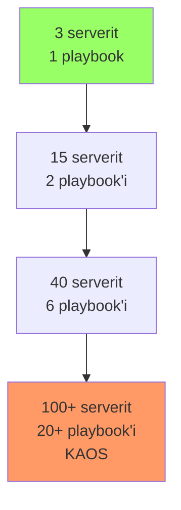
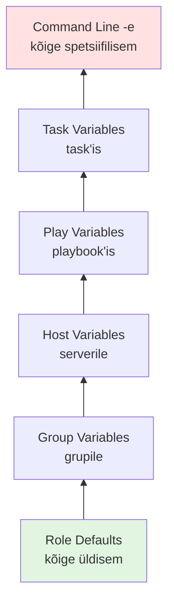
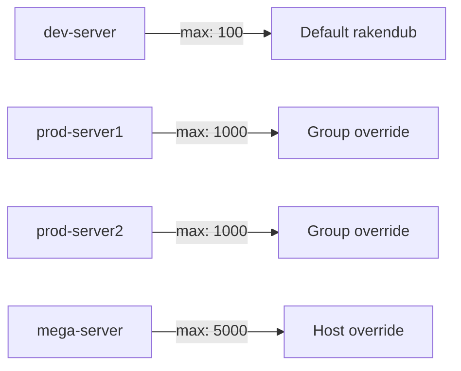
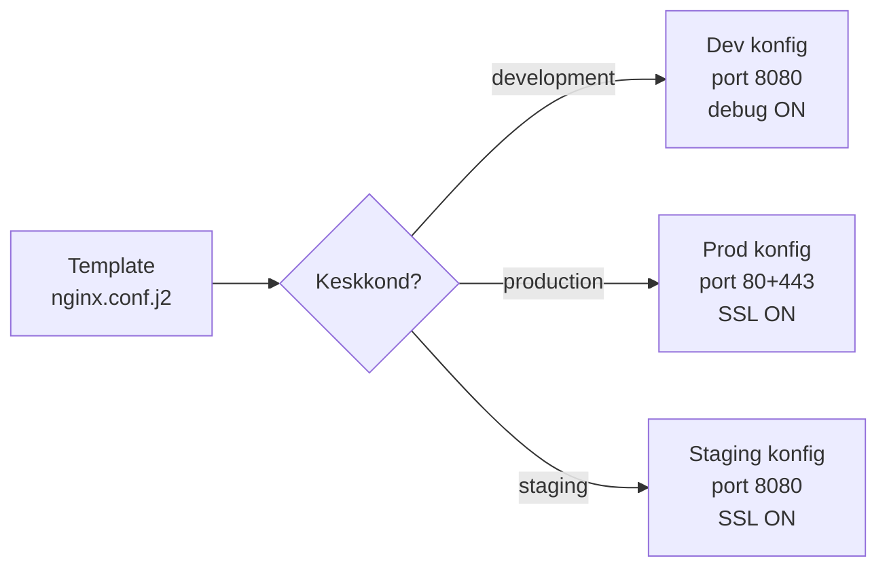
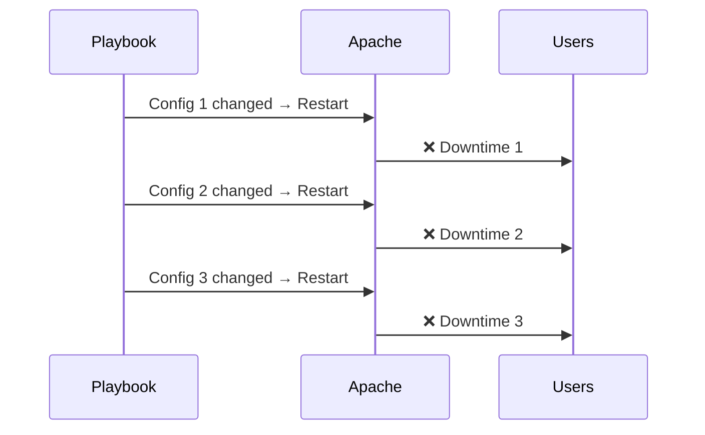
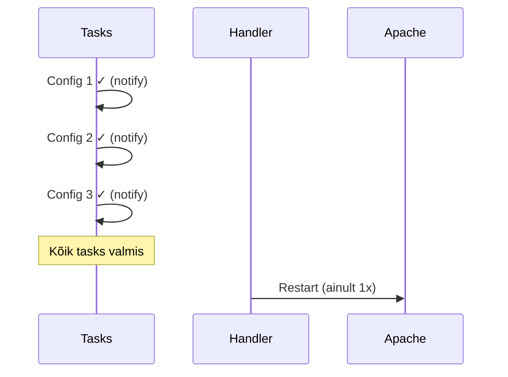
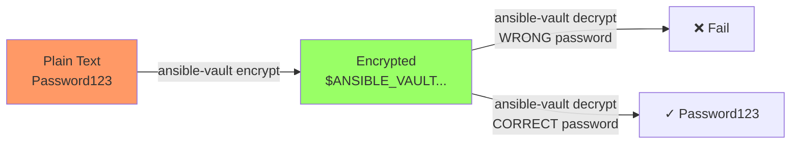
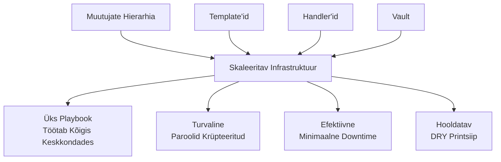

# Ansible Edasijõudnud Funktsioonid

**Eeldused:** Ansible põhiteadmised, YAML süntaks, Linux CLI  
**Platvorm:** Ansible 2.9+, Ubuntu/Debian/RHEL/CentOS

## Õpiväljundid

Pärast seda loengut õpilane:

- Mõistab muutujate hierarhia põhimõtteid ja nende praktilist väärtust
- Selgitab template'ide eeliseid staatiliste failide ees
- Eristab handler'ite ja tavalist task'ide kasutusviise
- Võrdleb paroolide haldamise lähenemisi ja Vault'i rolli
- Rakendab neid kontseptsioone reaalse infrastruktuuri automatiseerimisel

---

## 1. Skaleeritavuse Väljakutse

Väike infrastruktuur on lihtne hallata. Kolm serverit, kõik identsed - üks playbook ja valmis. Aga mis juhtub, kui ettevõte kasvab?

### Kui Lihtne Lähenemine Enam Ei Tööta

Kujutage ette arengut:

**Nädal 1:** 3 serverit, kõik Ubuntu 20.04, kõik identse konfiguratsiooniga. Üks playbook kopeerib faile ja restart'ib teenused.

**Kuu 3:** 15 serverit. Osa on veebiserveri, osa andmebaasid. Teete kaks playbook'i - ühe web'ile, teise db'le. Kui midagi ühist muuta, muudate mõlemas.

**Kuu 6:** 40 serverit kolmes keskkonnas (dev, staging, prod). Nüüd on teil 6 playbook'i. Muudatus tähendab 6 faili muutmist. Teete vea ühes, sama viga korduv kuues.

**Aasta 1:** 100+ serverit, mitu keskkonda, erinevad OS-id, erinevad konfiguratsioonid. Playbook'e on kümneid. Muudatuste tegemine võtab tunde. Code review on võimatu - keegi ei mäleta, mis kus on.



### Miks See Lähenemine Ebaõnnestub

Probleem pole serverite arvus - probleem on **korduses**. Iga kord kui kopeerite koodi:
- Kasvab hoolduskoormus eksponentsiaalselt
- Vigade tõenäosus suureneb
- Muudatused muutuvad aeglaseks ja ohtlikuks
- Code review on võimatu
- Uued tiimiliikmeed ei saa aru, mis toimub

See on fundamentaalne skaleeritavuse probleem. Ansible põhifunktsioonid aitavad automatiseerida üksikuid servereid. Edasijõudnud funktsioonid lahendavad **suure infrastruktuuri haldamise** probleemi.

---

## 2. Muutujate Hierarhia Kontseptsioon

### Probleem: Üks Playbook, Paljud Kontekstid

Teie rakendus peab töötama erinevates kontekstides:
- Arenduses port 3000, tootmises port 80
- Arenduses debug sisse, tootmises välja
- Serveritel erinev RAM, CPU - konfiguratsioon peab kohanema
- Test server vajab täiesti erinevat seadistust

Kuidas kirjutada ÜKS playbook, mis töötab kõigis nendes kontekstides?

### Lahendus: Hierarhiline Override System

Ansible rakendab prioriteetide süsteemi - spetsiifilisem alati võidab üldisema. See pole juhuslik - see peegeldab, kuidas inimesed mõtlevad konfiguratsioonist.



**Miks see töötab?**

Inimesed mõtlevad konfiguratsioonist loomulikus hierarhias:
1. "Tavaliselt on see nii" (defaults)
2. "Aga selle grupi puhul on teisiti" (group vars)
3. "Välja arvatud see üks server" (host vars)
4. "Praegu tahan testida midagi muud" (command line)

Hierarhia võimaldab järgida **DRY (Don't Repeat Yourself)** printsiipi. Defineerite üldise reegli üks kord, override'ite ainult erandeid.

### Praktiline Näide

Kujutage ette, et konfigureerite web servereid:

```yaml
# Kõigile serveritele - üldine reegel
max_connections: 100

# Aga production serverid on võimsamad
# group_vars/production.yml
max_connections: 1000

# Üks server on eriti võimas
# host_vars/mega-server.yml
max_connections: 5000
```

Playbook kasutab lihtsalt `{{ max_connections }}` - Ansible valib automaatselt õige väärtuse.



### Faktid: Automaatne Kontekst

Ansible kogub automaatselt iga serveri kohta faktiinfot. See on nagu automaatne host_vars, mida te ei pea ise kirjutama:

- CPU tuumade arv
- RAM kogus
- Operatsioonisüsteem
- Võrgu konfiguratsioon
- Ketta maht

**Miks see oluline?**

Saate teha intelligentseid otsuseid ilma käsitsi konfiguratsiooni kirjutamata:

```yaml
# Apache workers automaatselt CPU järgi
apache_workers: "{{ ansible_processor_vcpus * 2 }}"

# MySQL buffer automaatselt RAM järgi
mysql_buffer: "{{ (ansible_memtotal_mb * 0.7) | int }}M"

# Pakett automaatselt OS järgi
package_name: "{{ 'apache2' if ansible_os_family == 'Debian' else 'httpd' }}"
```

Server ise ütleb Ansible'ile, mis ta vajab. Te ei pea teadma, kas serveril on 2GB või 16GB RAM-i - Ansible kohandab automaatselt.

---

## 3. Template'id: Dünaamilised Konfiguratsioonid

### Probleem: Staatilised Failid Ei Skaleeru

Teil on Nginx konfiguratsioon. Arenduses ja tootmises on erinev:

**Development:**
- Port 8080
- Debug logging
- Cache välja
- SSL välja

**Production:**
- Port 80 ja 443
- Error logging ainult
- Cache sisse
- SSL sisse

Staatiline lähenemine = kaks faili. Muudatus tähendab kahe faili muutmist. Copy-paste vigu. Sünkroniseerimisprobleeme.

### Lahendus: Üks Mall, Palju Väljundeid

Template on fail, kus osad asjad on **parameetrid**, mitte fikseeritud väärtused. Üks mall genereerib erinevaid väljundeid vastavalt kontekstile.



**Põhiidee:**

Template sisaldab:
1. **Muutujad** - asendatakse väärtustega: `{{ port }}`
2. **Tingimused** - lisab/eemaldab sektsioone: ``
3. **Tsüklid** - genereerib korduvaid struktuure: ``

### Jinja2 Loogika

Jinja2 on template engine - see teisendab malli lõplikuks failiks.

**Tingimused:**
```jinja2

# Production seaded

# Development seaded

```

See pole lihtsalt teksti asendamine - see on **programmeerimiskeeleline loogika** faili genereerimiseks.

**Tsüklid:**
```jinja2

<VirtualHost>
  ServerName {{ vhost.domain }}
</VirtualHost>

```

Kui teil on list 3 domeenist, genereerib see 3 VirtualHost plokki. Lisate 4. domeeni listile - mall genereerib automaatselt 4 plokki.

**Filtrid:**
```jinja2
{{ ansible_memtotal_mb * 0.7 | int }}M
```

Filtrid töötlevad andmeid - arvutavad, vormindavad, teisendavad. See on nagu väikesed funktsioonid template'is.

### Miks See On Võimas

1. **Üks tõde** - mall on üks fail, mitte kümneid koopiaid
2. **Automaatne kohandamine** - sama mall kohandub keskkonnale
3. **Vähem vigu** - viga on ühes kohas, parandus ka ühes kohas
4. **Loetavam** - näete loogikat, mitte fikseeritud väärtusi

Template'id lahendavad configuration management'i fundamentaalse probleemi - kuidas hallata sarnaseid aga mitte identseid konfiguratsioone ilma korduseta.

---

## 4. Handler'id: Intelligentne Teenuste Haldamine

### Probleem: Ülearused Restartid

Konfiguratsioonifaili muutmine nõuab teenuse taaskäivitamist. Aga teil on 5 task'i, mis muudavad 5 erinevat Apache konfiguratsioonifaili.

Naiivne lähenemine:
```
Task 1: Muuda config1 → Restart Apache
Task 2: Muuda config2 → Restart Apache  
Task 3: Muuda config3 → Restart Apache
Task 4: Muuda config4 → Restart Apache
Task 5: Muuda config5 → Restart Apache
```

Apache taaskäivitub 5 korda. Iga restart katkestab ühendused. Kasutajad näevad vigu. Aega läheb raisku.



### Lahendus: Handler'id

Handler on **laisalt täidetav task**. See:
1. Käivitub ainult kui midagi **tegelikult muutus**
2. Käivitub ainult **üks kord**
3. Käivitub **playbook'i lõpus**, mitte kohe

```yaml
tasks:
  - name: Config 1
    template: ...
    notify: restart apache
  
  - name: Config 2
    template: ...
    notify: restart apache
    
handlers:
  - name: restart apache
    service: ...
```

Isegi kui 5 task'i teavitavad handler'it, käivitub see ainult üks kord lõpus.



**Miks see on parem?**

- **Efektiivsus** - üks restart, mitte viis
- **Vähem downtime** - kasutajad näevad viga ainult üks kord
- **Intelligentsus** - kui midagi ei muutu, ei restart'i
- **Idempotentsus** - saate playbook'i käivitada mitu korda turvaliselt

### Restart vs Reload

Paljud teenused toetavad kahte viisi:

**Restart:**
- Peatab teenuse täielikult
- Katkestab kõik ühendused
- Aeglane
- Vajalik suurte muudatuste puhul

**Reload:**
- Laeb konfiguratsioon uuesti
- Ei katkesta ühendusi
- Kiire
- Piisav enamike muudatuste jaoks

Handler võimaldab valida õige strateegia:

```yaml
notify: reload apache  # Väike muudatus
notify: restart apache # Suur muudatus
```

Handler'id lahendavad teenuste haldamise fundamentaalse probleemi - kuidas taaskäivitada teenuseid efektiivselt ja turvaliselt.

---

## 5. Ansible Vault: Turvalisuse Fundamentaalid

### Probleem: Paroolid Koodis

Teie playbook vajab MySQL parooli. Kõige lihtsam viis:

```yaml
mysql_password: "SuperSecret123"
```

See läheb Git'i. Nüüd on parool:
- Igale inimesele nähtav, kellel on repo ligipääs
- Git ajaloos igavesti (isegi kui kustutate)
- Endistele töötajatele ligipääsetav
- Forkitud koopiatesse kopeeritud

**Turvaprobleem:**

Kui üks inimene lahkub ettevõttest, peate:
1. Muutma kõiki paroole (kümneid/sadu)
2. Uuendama kõiki playbook'e
3. Redeployma kõiki servereid
4. Lootma, et ei unustanud midagi

Kui parool lekkib (ja private repo'st võib lekkida):
- Ründajal on ligipääs kogu infrastruktuurile
- Te ei tea, millal leke toimus
- Te ei tea, kas keegi kasutas parooli ära

### Lahendus: Krüpteerimine

Vault krüpteerib failid AES-256 algoritmiga. Krüpteeritud fail näeb välja nii:

```
$ANSIBLE_VAULT;1.1;AES256
66383439383437366337643938376139323531...
38336233353664386139383665656439616238...
```

Ilma vault paroolita on see lihtsalt juhuslik andmehunnik. Isegi kui keegi saab repo kätte, ei saa ta paroole kätte.



### Kuidas See Töötab

1. **Faili loomine:** `ansible-vault create secrets.yml`
   - Küsib vault parooli
   - Salvestades krüpteerib automaatselt

2. **Playbook kasutab:** Viitab vault muutujatele
   ```yaml
   mysql_password: "{{ vault_mysql_password }}"
   ```

3. **Käivitamine:** `ansible-playbook site.yml --ask-vault-pass`
   - Küsib vault parooli
   - Dekrüpteerib ajutiselt mälus
   - Kasutab väärtusi
   - Pole kunagi plain text kettale

### Organisatsiooni Mudel

Best practice: eraldi vault failid tavalistest failidest.

```
group_vars/
  production/
    vars.yml       # Avalik - konfiguratsioon
    vault.yml      # Krüpteeritud - paroolid
```

**vars.yml** (avalik, Git'is):
```yaml
database_host: "prod-db.example.com"
database_user: "app_user"
database_password: "{{ vault_database_password }}"
```

**vault.yml** (krüpteeritud, Git'is):
```yaml
vault_database_password: "ActualSecretPassword123"
```

Nimetamiskonventsioon `vault_` prefiksiga muudab kohe selgeks, mis on krüpteeritud.

### Miks See On Parem

**Turvalisus:**
- Paroolid on krüpteeritud isegi Git'is
- Ainult õigete inimestega vault parooli
- Vault parooli saab vahetada ilma infrastruktuuri muutmata

**Auditeerimine:**
- Näete Git'is, millal vault faili muudeti
- Ei näe, millised väärtused muutusid (krüpteeritud)
- Saate kontrollida, kes millal ligi pääses

**Turvatsoon:**
- Repo võib lekkida - paroolid on turvalised
- Endised töötajad võivad säilitada ligipääsu repo'le - paroolid on turvalised
- Vahetate vault parooli - kõik senised ligipääsud kehtetuks

Vault lahendab configuration management'i turvaprobleemi - kuidas hoida saladusi versioonikontrollis ilma neid paljastamata.

---

## 6. Kõik Koos: Arhitektuuri Mõistmine

Need neli kontseptsiooni ei ole isoleeritud trikid - need töötavad koos, moodustades skaleeritava arhitektuuri.



### Kuidas Need Ühenduvad

**Stsenaarium:** WordPress hosting platvorm 3 keskkonnas.

**Muutujate hierarhia** määrab:
- `group_vars/all/` - ühised seaded (WordPress versioon, timezone)
- `group_vars/production/` - tootmise seaded (SSL sisse, debug välja)
- `group_vars/development/` - arenduse seaded (SSL välja, debug sisse)

**Template'id** genereerivad:
- Nginx konfiguratsioon kohandub keskkonnale
- WordPress config failis õiged paroolid igal keskkonnal
- PHP settings kohanduvad serveri RAM-ile

**Handler'id** haldavad:
- Nginx reload kui konfig muutub
- PHP-FPM restart kui versioon uuendub
- Ainult üks kord playbook'i lõpus

**Vault** krüpteerib:
- Database paroolid igal keskkonnal
- WordPress security keys
- SSL privaatvõtmed

### Tulemus

Üks playbook käivitub erinevates keskkondades:

```bash
# Development
ansible-playbook site.yml -i inventory/dev --ask-vault-pass

# Production  
ansible-playbook site.yml -i inventory/prod --ask-vault-pass
```

SAMA playbook, erinevad tulemused:
- Dev: port 8080, debug ON, SSL OFF, dev paroolid
- Prod: port 80+443, debug OFF, SSL ON, prod paroolid

Infrastruktuur kohandub automaatselt:
- 2GB RAM server → PHP memory 256M
- 16GB RAM server → PHP memory 512M
- 4 CPU tuuma → 8 PHP worker'it

Kõik on turvaline:
- Paroolid krüpteeritud
- SSL võtmed krüpteeritud
- API võtmed krüpteeritud

Kõik on efektiivne:
- Teenused restart'ivad ainult kui vaja
- Ainult üks restart playbook'i kohta
- Muudatused rakenduvad kiiresti

---

## 7. Miks Need Kontseptsioonid On Olulised

### Ilma Nende Funktsioonideta

**Väike projekt (3-10 serverit):**
- Läheb veel kuidagi
- Copy-paste töötab
- Kõik meelde jääb

**Keskmine projekt (10-50 serverit):**
- Copy-paste muutub koormuseks
- Vead hakkavad ilmnema
- Muudatused võtavad tunde

**Suur projekt (50+ serverit):**
- Ilma nende funktsioonideta on hooldamine võimatu
- Muudatused võtavad päevi
- Vigade risk on kriitiline

### Nende Funktsioonidega

**Skaleerub lõputult:**
- 3 serverit → sama playbook
- 300 serverit → sama playbook
- 3000 serverit → sama playbook

**Hooldatav:**
- Muudatus ühes kohas
- Rakendub kõigis keskkondades
- Code review on võimalik

**Turvaline:**
- Paroolid pole plain text'is
- Ligipääsu saab kontrollida
- Audit trail eksisteerib

**Professionaalne:**
- Industry standard praktikad
- Tunnustatud iga DevOps insener
- Kasutusel suurtes ettevõtetes

---

## 8. Õppeprotsess

### Mida Te Nüüd Teate

**Kontseptuaalne mõistmine:**
- Miks muutujate hierarhia on vajalik
- Kuidas template'id lahendavad korduse probleemi
- Miks handler'id on efektiivsemad kui otsesed restartid
- Kuidas vault lahendab turvaprobleemi

**Arhitektuuri mõistmine:**
- Kuidas need funktsioonid töötavad koos
- Kuidas ehitada skaleeritav infrastruktuur
- Mis teeb Ansible projekti professionaalseks

### Järgmine Samm: Praktika

Labor'is rakendatakse neid kontseptsioone:
- Loote muutujate hierarhia
- Kirjutate template'eid
- Seadistate handler'eid
- Krüpteerite paroolid vault'iga

**Oluline:** Loeng andis MÕISTMISE, labor annab OSKUSE.

Ei piisa teadmisest, mis on template - peate kirjutama template'eid. Ei piisa mõistmisest, kuidas vault töötab - peate seda kasutama.

### Edasi

**Järgmisel nädalal:**
- Ansible Roles - kuidas teha korduvkasutatavad komponendid
- Galaxy - kuidas kasutada teiste rollee
- Testing - kuidas testida playbook'e enne production'i

**Pikemas perspektiivis:**
- Need on fundamentaalsed oskused DevOps töös
- Iga Ansible projekt kasutab neid tehnikaid
- Mõistmine võimaldab lugeda ja kirjutada professionaalset koodi

---

## Kokkuvõte

Ansible põhifunktsioonid lahendavad ühe serveri automatiseerimise. Edasijõudnud funktsioonid lahendavad **suure infrastruktuuri** automatiseerimise.

**Neli fundamentaalset kontseptsiooni:**

1. **Muutujate hierarhia** - üks playbook, palju kontekste
2. **Template'id** - üks mall, palju väljundeid  
3. **Handler'id** - intelligentne teenuste haldamine
4. **Vault** - turvaline paroolide haldamine

Need pole isoleeritud trikid - need on **arhitektuurilised printsiibid**, mis võimaldavad ehitada skaleeritavat, hooldatavat ja turvalist infrastruktuuri.

Labor annab teile praktilise kogemuse nende kontseptsioonide rakendamisel. Kasutage seda võimalust - kirjutage koodi, tehke vigu, õppige parandama. Kontseptuaalne mõistmine + praktiline kogemus = professionaalne oskus.