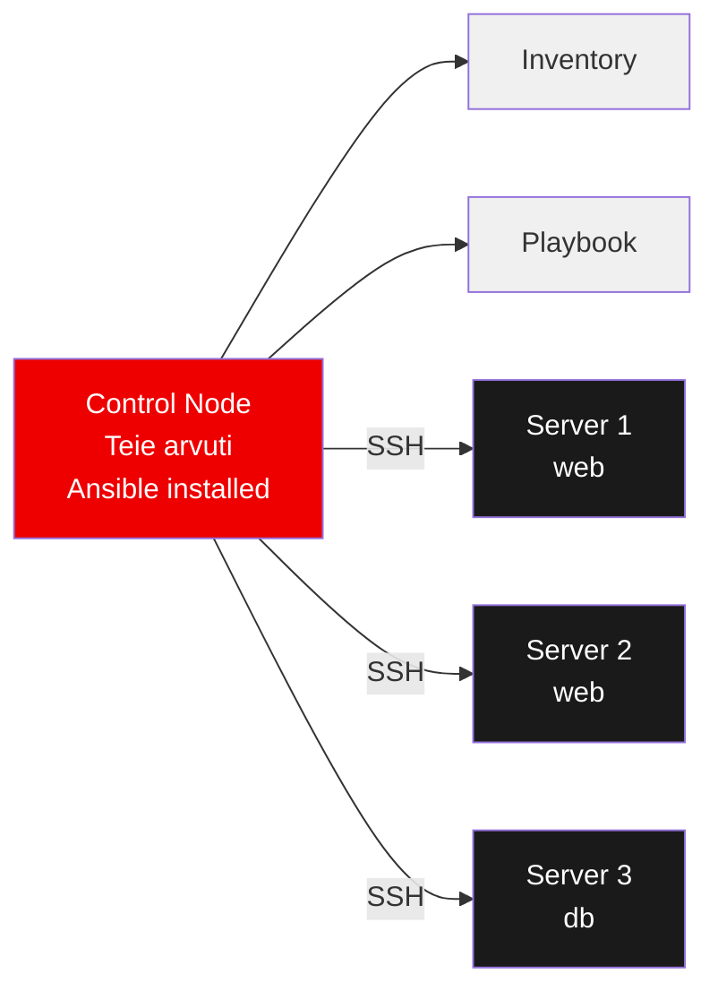
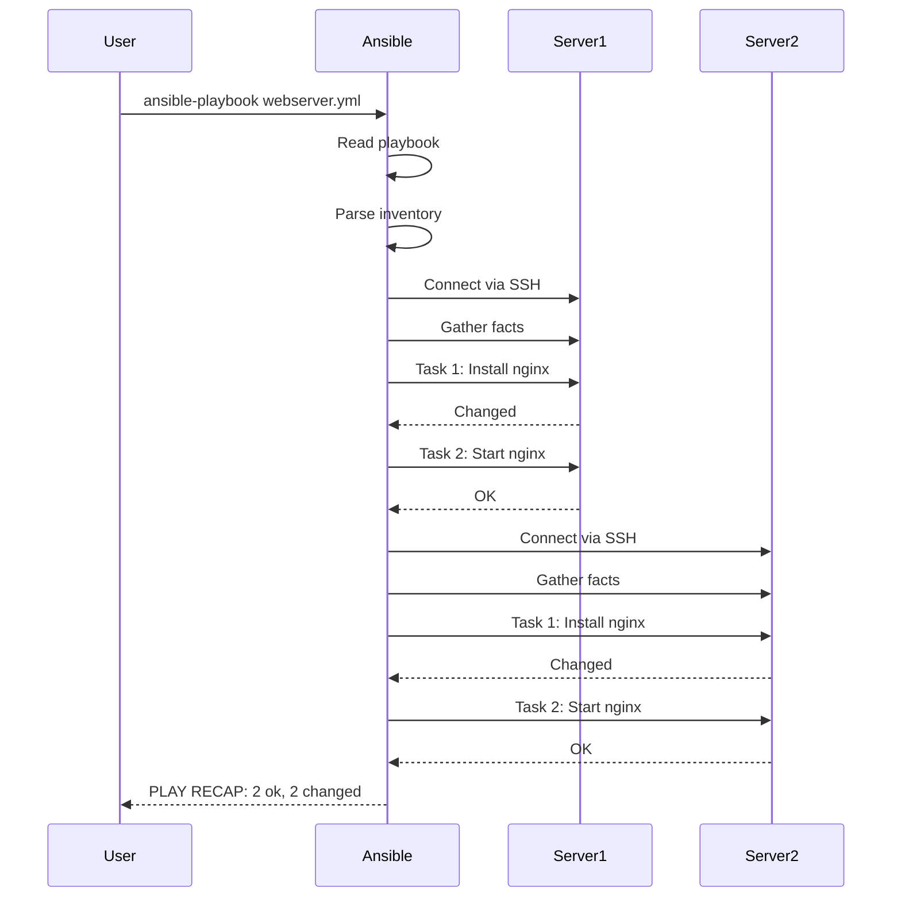

# Ansible

**Eeldused:** Linux CLI põhitõed, SSH ühendused, YAML süntaksi alused  
**Platvorm:** Ubuntu 24.04 (võib kasutada ka teisi Linux distributsioone)

---

## Õpiväljundid

Pärast seda moodulit oskate:

- Selgitada, mis probleemi Ansible lahendab ja miks see on parem kui shell skriptid
- Seadistada SSH ühendusi ja inventory faile mitme serveri jaoks
- Kirjutada YAML süntaksiga playbook'e ja kasutada põhilisi mooduleid
- Kasutada ad-hoc käske kiireks serverite haldamiseks
- Rakendada idempotentsuse printsiipi ja best practices'eid

---

## 1. Mis on Ansible ja miks seda vaja?

Selles jaotises selgitame, millist probleemi Ansible lahendab ja miks on mõistlik automatiseerida. Fookus on lihtsal vaatel: mida Ansible teeb teisiti kui käsitsi skriptimine.

**Ansible** on automatiseerimistööriist, mis laseb hallata mitmeid arvuteid korraga. Mõelge sellele nagu kaugjuhtimispuldile - ühest kohast saate kontrollida ja seadistada kümneid või sadu servereid. Kui tavaliselt peaksite iga serverisse eraldi SSH-ga sisse logima ja käske käsitsi sisestama, siis Ansible võimaldab sama toimingu teha kõikidel serveritel samaaegselt. See on erinevus, mis muudab ühe tunni töö viie minutiliseks.

### Miks Ansible on kasulik?

Reaalsetes IT keskkondades on tavaliselt kümneid, sageli sadu servereid. Kui peate igasse serverisse käsitsi sisse logima ja konfiguratsioone tegema, kulub sellele tohutult aega. Veelgi hullem - käsitsi töö tähendab vigu. Unustate ühest serverist paketi paigaldamise, teise serverisse panete vale konfiguratsiooni. Ansible lahendab need probleemid:

- **Aeg säästub** - ei pea iga serverisse eraldi sisse logima
- **Vead vähenevad** - automatiseerimine vähendab käsitsi tehtavaid vigu  
- **Järjepidevus** - kõik serverid saavad sama konfiguratsiooni
- **Skaleeritavus** - hõlpsalt lisada uusi servereid

Ansible ei ole ainuke automatiseerimistööriist turul. Puppet, Chef ja SaltStack teevad sarnaseid asju. Kuid Ansible eristub oma lihtsuse poolest - te ei pea õppima uut programmeerimiskeelt ega paigaldama serveritesse agente.

## 2. Kuidas Ansible töötab?

Kõrgtasemel voog: **juhtarvuti** (control node) + **inventory** + **playbook** + SSH. Joonis allpool näitab, kuidas käsud liiguvad ning miks agentita lähenemine on lihtsam haldada.



Põhiprintsiibid:

- **Agentless:** Ei pea serveritesse midagi installima (ainult SSH)
- **Push model:** Control node lükkab konfiguratsiooni serveritesse
- **Idempotent:** Sama käsk võib jooksutada mitu korda, tulemus on alati sama

Ansible kasutab SSH ühendust (sama, mida tavaliselt kasutate serverisse sisselogimiseks). Erinevalt paljudest teistest tööriistadest ei pea serveritesse midagi täiendavat installima. See tähendab, et teil pole vaja hallata lisatarkvara uuendusi ega muretseda, kas agent-tarkvara on kõikides serverites samas versioonis.

**Idempotentsus** on kriitiline kontseptsioon. See tähendab, et kui käivitate sama Ansible käsu kaks korda, siis teine kord midagi ei muutu. Näiteks kui käsite Ansible'il paigaldada nginx, siis esimesel korral paigaldatakse see. Teisel korral kontrollib Ansible, et nginx on juba olemas ja jätab selle sammu vahele. See erinevus muudab Ansible'i palju turvalisemaks kui tavalised shell skriptid, kus sama skripti kahekordne käivitamine võib süsteemi sassi ajada.

## 3. Esimesed sammud

Alustame kolme sammuga: paigaldus, SSH võtmed ja inventory. Pärast seda saame esimese pingi testiga kinnitada, et ühendus töötab.

### 3.1. Ansible installimine

Ubuntu/Debian:
```bash
sudo apt update
sudo apt install ansible
```

CentOS/RHEL:
```bash
sudo yum install ansible
```

Kontrollime installatsiooni:
```bash
ansible --version
```

Peaksite nägema versiooni infot ja Python teed. Kui näete veateadet, kontrollige, kas pakett paigaldus õnnestus.

### 3.2. SSH võtmete seadistamine

Enne Ansible kasutamist peate seadistama SSH võtmed, et saaksite serveritesse sisse logida ilma parooli küsimiseta. SSH võtmete kasutamine on mitte ainult mugavam, vaid ka turvalisem kui paroolide kasutamine, sest võtmeid on praktiliselt võimatu ära arvata. Lisaks säästab see teilt vajadust sisestada parooli iga kord, kui Ansible serveritega ühendub - automatiseerimisel võib see tähendada sadu ühendusi päevas.

Võtme genereerimine:
```bash
ssh-keygen -t ed25519 -f ~/.ssh/ansible_key
```

Vajutage Enter kõikidele küsimustele (passphrase võite jätta tühjaks testimise ajaks, produktsioonis kasutage passphrase'i).

Võtme kopeerimine serverisse:
```bash
ssh-copy-id -i ~/.ssh/ansible_key.pub kasutaja@server.ip
```

Testimine:
```bash
ssh -i ~/.ssh/ansible_key kasutaja@server.ip
```

Kui saate sisse logida ilma parooli küsimiseta, on SSH võtmed õigesti seadistatud.

### 3.3. Inventory faili loomine

**Inventory** fail ütleb Ansible'ile, millised serverid teil on. Looge fail nimega `inventory`. Gruppide kasutamine inventory failis on oluline, sest sageli soovite teha erinevaid toiminguid erinevat tüüpi serveritele - näiteks veebiserveritest ja andmebaasidest.

```ini
[webservers]
web1.example.com
web2.example.com

[databases]
db1.example.com
```

Inventory formaat on INI fail. Kandilised sulud tähistavad gruppe. Grupid lasevad teil käske suunata ainult teatud tüüpi serveritele. Näiteks saate käsu käivitada ainult andmebaasidele ilma, et see mõjutaks veebiserveid.

### 3.4. Esimene test

Kontrollige, kas Ansible saab serveritega ühendust:

```bash
ansible all -i inventory -m ping
```

Kui kõik töötab, peaksite nägema midagi sellist:
```
web1.example.com | SUCCESS => {
    "changed": false,
    "ping": "pong"
}
```

Kui näete "UNREACHABLE" või "FAILED", kontrollige:

- Kas SSH võti on õigesti kopeeritud
- Kas serveri IP aadress on õige
- Kas SSH teenus töötab sihtserveris

## 4. Ansible käsurida

Ansible CLI võimaldab käivitada üksikuid käske (ad-hoc) või kogu playbook'i. Allpool on struktuur ja sagedasemad lipud, mida igapäevaselt vaja läheb.

### 4.1. Ansible käskude struktuur

Kõik Ansible käsud järgivad sama mustrit:
```bash
ansible <sihtmärk> -i <inventory> -m <moodul> -a "<argumendid>" [lisaoptsioonid]
```

Komponentide selgitus:

- `<sihtmärk>` - millised serverid (all, webservers, konkreetne server)
- `-i <inventory>` - inventory faili asukoht
- `-m <moodul>` - millist moodulit kasutada
- `-a "<argumendid>"` - mooduli parameetrid
- `[lisaoptsioonid]` - täiendavad seadistused

### 4.2. Kiired ühekordsed käsud (ad-hoc)

**Ad-hoc** käsud on mõeldud kiireks testimiseks ja ühekordseks tööks, mida pole mõtet playbook'i kirjutada. Need on ideaalsed, kui vajate kiiresti kontrollida serverite seisundit või teha väikest muudatust, mida te kunagi enam ei vaja.

Kõikide serverite uptime:
```bash
ansible all -i inventory -m command -a "uptime"
```

Paketi installimine:
```bash
ansible webservers -i inventory -m package -a "name=nginx state=present" --become
```

Teenuse käivitamine:
```bash
ansible webservers -i inventory -m service -a "name=nginx state=started" --become
```

Faili kopeerimine:
```bash
ansible all -i inventory -m copy -a "src=config.txt dest=/tmp/"
```

Mälu kasutuse kontroll:
```bash
ansible all -i inventory -m shell -a "free -h"
```

Kettaruumi kontroll:
```bash
ansible all -i inventory -m shell -a "df -h"
```

Konkreetse serveriga töötamine:
```bash
ansible web1.example.com -i inventory -m ping
```

Mitme grupi valimine:
```bash
ansible webservers:databases -i inventory -m command -a "hostname"
```

Grupi välistamine:
```bash
ansible all:!databases -i inventory -m ping
```

### 4.3. Olulised käsurea võtmed

Admin õigused (sudo):
```bash
--become
```

Verbose väljund (rohkem infot):
```bash
-v, -vv, -vvv
```

Kuiv käivitamine (muudatusi ei tehta):
```bash
--check
```

Muudatuste eelvaade:
```bash
--diff
```

Paralleelsuse piiramine:
```bash
--forks 5
```

Sudo parooli küsimine:
```bash
--ask-become-pass
```

Konkreetsete serverite piiramine:
```bash
--limit web1,web2
```

Muutujate edastamine:
```bash
-e "variable=value"
```

Märkused:

- `--become` kasutage siis, kui vajate admin õigusi (sudo)
- `-i inventory` määrab, millist inventory faili kasutada
- `command` vs `shell` - command on turvalisem, shell lubab pipe'e ja redirection'i

### 4.4. Kasulikud moodulid algajatele

| Moodul | Otstarve | Näide |
|--------|----------|-------|
| `ping` | Ühenduse test | `ansible all -m ping` |
| `command` | Käsu käivitamine | `ansible all -m command -a "date"` |
| `package` | Tarkvara paigaldus | `ansible all -m package -a "name=vim state=present"` |
| `service` | Teenuste haldamine | `ansible all -m service -a "name=nginx state=started"` |
| `copy` | Failide kopeerimine | `ansible all -m copy -a "src=file.txt dest=/tmp/"` |
| `file` | Failide ja kaustade haldamine | `ansible all -m file -a "path=/tmp/test state=directory"` |

## 5. Playbook'id - korduv automatiseerimine

Kui soovite teha keerulisemaid asju või salvestada oma käsud tulevikuks, kasutage playbook'e. Need on YAML failid, mis kirjeldavad, mida teha. Playbook'id on nagu retseptid - kirjutate üks kord, käivitate mitu korda. Erinevalt ad-hoc käskudest saate playbook'ides kasutada keerulisemat loogikat, muutujaid ja tingimusi.



### 5.1. Lihtne playbook näide

Looge fail `webserver.yml`:

```yaml
---
- name: Veebiserveri seadistamine
  hosts: webservers
  become: yes
  
  tasks:
    - name: Nginx installimine
      package:
        name: nginx
        state: present
    
    - name: Nginx käivitamine
      service:
        name: nginx
        state: started
        enabled: yes
    
    - name: Tulemüüri port avamine
      ufw:
        rule: allow
        port: 80
```

Playbook'i käivitamine:
```bash
ansible-playbook -i inventory webserver.yml
```

Väljund näitab iga taski tulemust:

- `ok` - task käivitati, kuid midagi ei muutunud
- `changed` - task tegi muudatuse
- `failed` - task ebaõnnestus

### 5.2. YAML süntaksi põhitõed

YAML (YAML Ain't Markup Language) on inimloetav andmete serialiseerimise formaat. Ansible kasutab YAML-i, sest see on lihtsam lugeda kui JSON või XML.

Olulised reeglid:

- Taandrid on olulised (kasutage tühikuid, mitte tab'e)
- Loendid algavad `-` märgiga
- Võti-väärtus paarid eraldatakse `:` märgiga

```yaml
# Kommentaar
muutuja: väärtus
loend:
  - esimene_element
  - teine_element
objekt:
  alamvõti: alamväärtus
```

Tüüpilised vead:

- Tab'ide kasutamine (kasutage alati 2 tühikut)
- Vale taanduse tase
- Puuduvad koolonid

## 6. Muutujate kasutamine

Ansible'is saate kasutada muutujaid, et teha playbook'id paindlikumaks. Muutujad võimaldavad teil kirjutada ühe playbook'i, mis töötab erinevates keskkondades või erinevate konfiguratsioonidega, muutes ainult muutujate väärtusi.

```yaml
---
- name: Rakenduse paigaldus
  hosts: webservers
  vars:
    app_name: "myapp"
    app_port: 8080
    app_user: "appuser"
  
  tasks:
    - name: "Kasutaja {{ app_user }} loomine"
      user:
        name: "{{ app_user }}"
        shell: /bin/bash
    
    - name: "Rakendus {{ app_name }} paigaldamine"
      package:
        name: "{{ app_name }}"
        state: present
```

Muutujate kasutamine playbook'is toimub Jinja2 template süntaksiga: `{{ muutuja_nimi }}`. See võimaldab dünaamilist sisu genereerimist.

### 6.1. Muutujate allikad

Käsurealt muutuja edastamine:
```bash
ansible-playbook -e "app_version=2.0" playbook.yml
```

Inventory failis:
```ini
[webservers]
web1.example.com app_port=8080
web2.example.com app_port=9080
```

Eraldi muutujate fail:
```yaml
# vars.yml
app_name: myapp
app_port: 8080
```

Kasutamine playbook'is:
```yaml
- name: Rakendus
  hosts: webservers
  vars_files:
    - vars.yml
```

## 7. Handlers - reageerides muudatustele

**Handlers** käivitatakse ainult siis, kui midagi tõesti muutub. See on oluline, sest teenuste taaskäivitamine on kulukas operatsioon - te ei taha nginx'i restartidata, kui konfiguratsioon ei muutunud. Handlers käivitatakse alati playbook'i lõpus pärast kõiki taske, isegi kui mitmed taskid sama handlerit kutsuvad.

```yaml
tasks:
  - name: Nginx konfiguratsiooni uuendamine
    copy:
      src: nginx.conf
      dest: /etc/nginx/nginx.conf
    notify: restart nginx
    
  - name: SSL sertifikaadi lisamine  
    copy:
      src: cert.pem
      dest: /etc/ssl/cert.pem
    notify: restart nginx

handlers:
  - name: restart nginx
    service:
      name: nginx
      state: restarted
```

Oluline punkt: kui kaks taski kutsuvad sama handlerit, siis handler käivitatakse ainult üks kord. See tähendab, et nginx restarditakse ainult üks kord pärast kõiki muudatusi, mitte iga taski järel eraldi.

## 8. Tingimused ja tsüklid

### 8.1. When tingimused

Tingimused lasevad teil käivitada taske ainult teatud tingimustel. See on kasulik, kui erinevad operatsioonisüsteemid vajavad erinevaid käske.

```yaml
tasks:
  - name: Ubuntu paketid
    package:
      name: ufw
      state: present
    when: ansible_distribution == "Ubuntu"
    
  - name: CentOS paketid  
    package:
      name: firewalld
      state: present
    when: ansible_distribution == "CentOS"
```

Tingimused võivad kasutada:

- Võrdlusoperaatoreid: `==`, `!=`, `<`, `>`
- Loogilisi operaatoreid: `and`, `or`, `not`
- Muutujate olemasolu: `when: variable is defined`

### 8.2. Loop tsüklid

Tsüklid lasevad teil sama taski käivitada mitme elemendiga. See vältib koodi kordamist.

```yaml
tasks:
  - name: Mitme paketi installimine
    package:
      name: "{{ item }}"
      state: present
    loop:
      - vim
      - git
      - curl
      - wget
```

Ilma tsüklita peaks kirjutama neli eraldi taski. Tsükkel muudab koodi lühemaks ja hõlpsamini hooldatavaks.

## 9. Faktide kasutamine

Ansible kogub automaatselt infot serverite kohta igal käivitamisel. Need **faktid** on nagu serveri "pass", mis sisaldab kõiki olulisi andmeid. Faktide kogumine toimub iga playbook'i käivitamisel automaatselt ning see võtab mõne sekundi - see on põhjus, miks näete "Gathering Facts" sammu iga playbook'i alguses.

Kõigi faktide vaatamine (väga palju infot!):
```bash
ansible all -m setup
```

Ainult võrgu info (filtreerimine on oluline):
```bash
ansible all -m setup -a "filter=ansible_default_ipv4"
```

OS distributsioon ja versioon:
```bash
ansible all -m setup -a "filter=ansible_distribution*"
```

Mälu info megabaitides:
```bash
ansible all -m setup -a "filter=ansible_memory_mb"
```

CPU info:
```bash
ansible all -m setup -a "filter=ansible_processor*"
```

### 9.1. Kasulikumad faktid

- `ansible_hostname` - serveri nimi
- `ansible_default_ipv4.address` - IP aadress
- `ansible_distribution` - OS (Ubuntu, CentOS, Debian)
- `ansible_distribution_version` - OS versioon (20.04, 7, jne)
- `ansible_memtotal_mb` - kogu RAM megabaitides
- `ansible_processor_cores` - CPU tuumade arv

### 9.2. Faktide kasutamine playbook'is

```yaml
tasks:
  - name: "Serveri {{ ansible_hostname }} seadistamine"
    debug:
      msg: "Seadistan {{ ansible_distribution }} {{ ansible_distribution_version }} serverit IP-ga {{ ansible_default_ipv4.address }}"
  
  - name: Suur mälu - paigaldan vahemälu
    package:
      name: memcached
      state: present
    when: ansible_memtotal_mb > 4096

  - name: Logi faili asukohad erinevates OS'ides
    file:
      path: "{{ log_path }}"
      state: directory
    vars:
      log_path: "{{ '/var/log/myapp' if ansible_os_family == 'Debian' else '/var/log/messages' }}"
```

Faktid teevad playbook'id intelligentsemaks. Te ei pea käsitsi määrama, milline OS serveris on - Ansible leiab selle automaatselt ja kasutab õigeid käske.

## 10. Ansible.cfg konfigureerimine

Ansible.cfg fail määrab, kuidas Ansible käitub. See on nagu Ansible'i seadistuste fail, mis säästab teilt vajadust iga kord lisaparameetreid kirjutada. Ilma selle failita peaksite iga käsu juurde kirjutama `-i inventory`, `--become` ja teisi parameetreid - konfiguratsioonifail automatiseerib selle.

Looge projekti kausta fail `ansible.cfg`:

```ini
[defaults]
# Kus asub inventory (vaikimisi ./inventory)
inventory = inventory

# SSH host key kontroll välja lülitatud
host_key_checking = False

# Vaikimisi kasutaja kõigil serveritel
remote_user = ubuntu

# SSH privaatvõtme asukoht
private_key_file = ~/.ssh/ansible_key

# Logi fail
log_path = ./ansible.log

# Paralleelsus - mitu serverit samaaegselt
forks = 10

# Ühenduse timeout sekundites
timeout = 30

[privilege_escalation]
# Automaatselt kasuta sudo kõikidel käskudel
become = True
become_method = sudo
become_user = root

[ssh_connection]
# SSH ühenduste optimeerimine
ssh_args = -o ControlMaster=auto -o ControlPersist=60s
pipelining = True
retries = 3
```

Konfiguratsiooni otsingu järjekord:

1. `ANSIBLE_CONFIG` keskkonna muutuja
2. `ansible.cfg` praeguses kaustas (soovitatud)
3. `~/.ansible.cfg` teie kodukaustas
4. `/etc/ansible/ansible.cfg` süsteemselt

Konfiguratsiooni kontroll:
```bash
# Vaata mis konfiguratsioon on kasutusel
ansible-config view

# Kõik võimalikud seadistused
ansible-config dump
```

## 11. Tüüpilised vead ja lahendused

### 11.1. SSH ühenduse probleem

```
Permission denied (publickey)
```

Lahendus: Kontrollige SSH võtmete seadistust ja ansible.cfg. Kõige sagedamini tuleb see viga siis, kui Ansible kasutab valet SSH võtit või õiget võtit pole serverisse kopeeritud.

### 11.2. Sudo parool küsitakse

```
sudo: a password is required
```

Lahendus: Lisage `--ask-become-pass` või seadistage passwordless sudo. Ansible eeldab vaikimisi, et sudo ei küsi parooli, mis on tavaline produktsiooniserverites.

### 11.3. Python puudub

```
/usr/bin/python: not found
```

Lahendus: Installige Python või lisa inventory faili:
```ini
[webservers]
server1 ansible_python_interpreter=/usr/bin/python3
```

### 11.4. Idempotency rikutud

```
changed: [server] (item=command_that_always_runs)
```

Lahendus: Kasutage `creates` või `removes` parameetreid. Idempotentsus tähendab, et kui käivitate sama playbook'i mitu korda, siis pärast esimest korda ei peaks midagi enam muutuma - see on oluline, et vältida soovimatud muudatused.

```yaml
- name: Käsk mis peaks ainult üks kord käima
  command: /opt/install.sh
  args:
    creates: /opt/installed.flag
```

## 12. Järgmised sammud

Kui olete põhitõed selgeks saanud, järgmised teemad:

1. **Õppige rohkem mooduleid** - vaadake Ansible dokumentatsiooni
2. **Kasutage rolle** - korduvkasutatavad playbook'i osad
3. **Vault** - paroolide ja tundliku info turvaliseks hoidmiseks
4. **Templates** - konfiguratsioonifailide dünaamiliseks genereerimiseks

Kasulikud ressursid:

- Ansible ametlik dokumentatsioon: https://docs.ansible.com/
- Ansible Galaxy: valmis rollide kogumik
- Ansible lint: playbook'ide kvaliteedi kontrollimiseks

---

Meeldetuletus: Alustage väiksest! Proovige esmalt ühe serveriga, seejärel laiendage rohkematele.