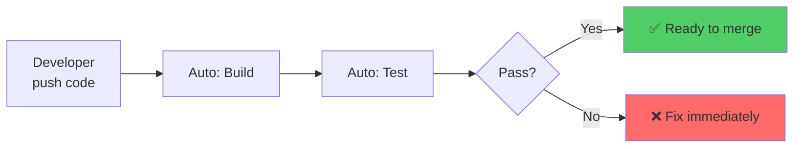
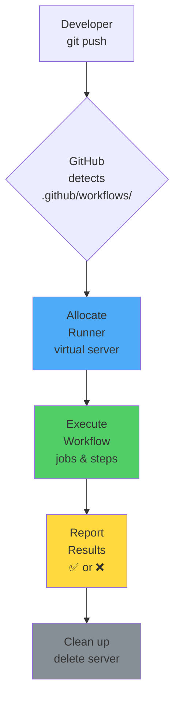

# CI/CD Alused

**Eeldused:** Git põhitõed, käsurida  
**Platvorm:** GitHub Actions  
**Kestus:** 20 minutit

---

## Õpiväljundid

- Selgitad miks CI/CD on vajalik ja millist probleemi see lahendab
- Eristad Continuous Integration ja Continuous Deployment kontseptsioone
- Mõistad GitHub Actions arhitektuuri ja põhikomponente
- Kirjeldad millal ja kuidas kasutada GitHub Actions'i

---

## 1. Miks Me Vajame CI/CD? (4 min)

### Klassikaline Probleem

Iga tarkvaraarenduse meeskond seisab silmitsi sama küsimusega: kuidas viia kood arendajate arvutitest kasutajateni?

Traditsiooniline lähenemine on käsitsi deployment. Keegi logib serverisse SSH'iga, käivitab käske käsitsi, kontrollib kas töötab. See võtab aega - tavaliselt 1-3 tundi. Järgmine kord võib protsess olla veidi erinev, sest inimesed eksivad, unustavad samme.

Aga peamine probleem pole aeg. Peamine probleem on see, et see **ei skaleeru**. Kui teil on üks arendaja ja üks server, on käsitsi deployment ok. Kui teil on 10 arendajat ja 20 serverit, on see juba keeruline. Kui teil on 100 arendajat ja cloud infrastruktuur, on käsitsi deployment võimatu.

**Kontrollküsimus:** Miks on käsitsi deployment probleem kui meeskond kasvab?

### Integration Hell

Teine suur probleem on "integration hell". Kujutage ette: kaks arendajat töötavad eraldi branch'ides kaks nädalat. Mõlemad teevad oma muudatusi, kirjutavad koodi, testivad. Siis tulevad nad kokku ja proovivad oma koodi merge'ida. 

Mis juhtub? 
- Merge konfliktid
- Kood ei kompileeru
- Testid failivad
- API'd on muutunud

Kulub 2-3 päeva et asju parandada.

Miks see juhtub? Sest nad ei integreerinud piisavalt sageli. Nad töötasid isolatsioonis liiga kaua.

### CI/CD Lahendus


*Allikas: [ByteByteGo - CI/CD Pipeline Explained](https://blog.bytebytego.com/p/ep71-cicd-pipeline-explained-in-simple)*

Vaadake seda diagrammi. See näitab software development lifecycle'i koos CI/CD-ga.

**Development → Testing → Deployment → Maintenance**

Iga samm on automatiseeritud:
- Developer push'ib koodi → automaatselt buildib
- Automaatselt testib
- Kui testid läbivad → automaatselt deploy'ib
- Kui midagi ebaõnnestub → developer saab koheselt teada

See on CI/CD põhimõte: **automatiseeri kogu protsess alates koodi kirjutamisest kuni kasutajateni jõudmiseni**.

---

## 2. Mis on CI ja CD? (4 min)

### Continuous Integration (CI)

Continuous Integration tähendab: **integreeri sageli ja kontrolli automaatselt**.

Põhimõte on lihtne: iga kord kui arendaja push'ib koodi (iga päev või isegi mitu korda päevas):

1. Automaatselt build kood
2. Automaatselt jooksuta testid
3. Automaatselt kontrolli koodi kvaliteeti
4. Teata koheselt kui midagi valesti



Kui midagi ebaõnnestub, arendaja saab teada **5 minutit pärast push'i**. Mitte homme. Mitte järgmisel nädalal. Kohe. Kui kontekst on veel meeles.

**Miks see töötab?** Väikesed muudatused on lihtne debugida. Kui 10 rida koodi on vale, leiad vea kiiresti. Kui 1000 rida koodi on vale, võtab päevi.

**Kontrollküsimus:** Mis juhtub kui testid failivad CI's?

### Continuous Deployment (CD)

Continuous Deployment läheb sammu edasi: **kui testid läbitud, deploy automaatselt**.

Praktikas on kaks varianti:

**Continuous Delivery:**
- Kood on automaatselt valmis production'i minema
- Kõik testid läbitud, artefaktid ehitatud
- Aga viimane samm vajab inimese kinnitust
- Inimene vaatab üle ja vajutab "deploy" nuppu

**Continuous Deployment:**
- Täiesti automaatne
- Kui testid läbivad → läheb automaatselt production'i
- Inimest ei küsita

Enamik ettevõtteid alustab **Delivery'ga** (inimene vajutab nuppu) ja liigub järk-järgult **Deployment'i** poole (täiesti automaatne) kui usaldus kasvab.

**Kontrollküsimus:** Mis vahe on Continuous Delivery ja Continuous Deployment vahel?

### Pipeline Samm-Sammult

Vaatame uuesti ByteByteGo diagrammi. Klassikaline pipeline:

1. **Developer commits code** → git push
2. **CI server detects changes** → GitHub Actions märkab
3. **Code is compiled, tested** → build ja testid
4. **Test results reported** → ✅ või ❌
5. **Artifacts deployed to staging** → testimiskeskkond
6. **Further testing** → E2E testid
7. **CD system deploys to production** → kasutajad saavad

**Oluline:** Kui üks samm ebaõnnestub, järgmised ei käivitu. Kui testid failivad, ei lähe production'i.

---

## 3. GitHub Actions (10 min)

### Miks GitHub Actions?

CI/CD platvorme on palju: Jenkins, GitLab CI, CircleCI. Miks me õpime GitHub Actions'i?

✅ **Sisse-ehitatud** - Kui on GitHub repo, on Actions. Zero setup.  
✅ **Tasuta** - Avalikele projektidele täiesti tasuta  
✅ **Lihtne** - YAML konfiguratsioon, hea dokumentatsioon  
✅ **Suur kogukond** - 13,000+ valmis action'eid Marketplace'is  
✅ **Integratsioon** - Täielik GitHub integratsioon

### Kuidas See Töötab?



Kui te push'ite koodi:

1. **GitHub detekteerib** - näeb `.github/workflows/*.yml` faili
2. **Allocate runner** - GitHub loob virtuaalserveri (Ubuntu/Windows/macOS)
3. **Execute workflow** - käivitab teie workflow'i
4. **Report results** - näitab GitHubis ✅ või ❌
5. **Clean up** - kustutab serveri ära

Te ei pea serverit haldama. GitHub teeb kõik.

**Kontrollküsimus:** Mis juhtub pärast seda kui workflow lõpeb?

### Põhikontseptsioonid

GitHub Actions koosneb neljast põhikomponendist:

#### 1. Workflow

**Workflow** = terve automatiseerimise protsess.

- YAML fail `.github/workflows/` kaustas
- Iga fail = üks workflow
- Defineerib: millal käivitub, mida teeb

Näiteks:
- `ci.yml` - testid ja build
- `deploy.yml` - deployment
- `cron.yml` - scheduled tasks

#### 2. Job

**Job** = üks suur tükk tööd.

Näiteks workflow'is:
- `build` job - kompileeri rakendus
- `test` job - jooksuta testid
- `deploy` job - deploy production'i

Job'id võivad olla:
- **Paralleelsed** - kõik samal ajal (kiirem)
- **Järjestikused** - üks pärast teist (`needs:`)

Iga job jookseb **eraldi serveris** (eraldi runner).

#### 3. Step

**Step** = üks konkreetne operatsioon job'i sees.

Step'id jooksevad **järjestikku**. Kui üks ebaõnnestub, järgmised ei käivitu.

Näiteks `test` job'is:
1. Step: lae kood alla
2. Step: installi Python
3. Step: installi sõltuvused
4. Step: jooksuta testid

#### 4. Action

**Action** = taaskasutav komponent.

Keegi on kirjutanud, testinud, dokumenteerinud. Sina kasutad.

Näited:
- `actions/checkout@v3` - lae kood alla
- `actions/setup-python@v4` - installi Python
- `actions/cache@v3` - salvesta cache

GitHub Marketplace'is 13,000+ action'eid.

**Kontrollküsimus:** Mis vahe on job'il ja step'il?

### Runner

**Runner** = virtuaalserver kus workflow jookseb.

GitHub pakub:
- **Ubuntu Linux** - kõige levinum
- **Windows** - kui vajad Windows'i
- **macOS** - kui vajad macOS'i (iOS app build)

Runner'is on juba palju installitud:
- Git, Docker
- Node.js, Python, Ruby, Java
- AWS CLI, Azure CLI

### Events ja Triggers

Workflow peab teadma millal käivituda.

#### push Event

Kõige levinum. Käivitub kui keegi push'ib.

```yaml
on:
  push:
    branches: [ main, develop ]
```

#### pull_request Event

Käivitub kui keegi teeb PR.

```yaml
on:
  pull_request:
    branches: [ main ]
```

**Oluline!** Testid jooksevad enne merge'i. Kui testid failivad, ei saa merge'ida.

### Lihtne Näide

```yaml
name: CI

on:
  push:
    branches: [ main ]

jobs:
  test:
    runs-on: ubuntu-latest
    steps:
      - uses: actions/checkout@v3
      - uses: actions/setup-python@v4
        with:
          python-version: '3.9'
      - run: pip install -r requirements.txt
      - run: pytest tests/
```

**Mis siin on?**

- `name: CI` - workflow nimi
- `on: push` - käivitub kui push main'i
- `jobs: test:` - üks job nimega "test"
- `runs-on: ubuntu-latest` - Ubuntu server
- `uses: actions/checkout@v3` - valmis action (lae kood)
- `uses: actions/setup-python@v4` - valmis action (installi Python)
- `run: pip install...` - käivita käsk
- `run: pytest...` - käivita testid

**12 rida = töötav CI pipeline!**

**Kontrollküsimus:** Kus see fail peab olema?

### GitHub Actions GitHubis


**Actions Tab:**
- Iga repo üleval on "Actions" tab
- Näed kõiki workflow'e
- Kollane = jookseb, Roheline = õnnestus, Punane = ebaõnnestus

**Workflow Detail:**
- Kliki workflow peale
- Näed kõiki job'e
- Iga job'i kõiki step'e
- Error message'eid kui ebaõnnestus

**Pull Request:**
- PR juures näed check'e
- ✅ "All checks have passed"
- ❌ "Some checks failed"
- Ei saa merge'ida kui checks punased (branch protection)

---

## 4. Teised CI/CD Platvormid (2 min)

GitHub Actions pole ainus. Lühike ülevaade alternatiividest:

### GitLab CI/CD

**Millal:** Kui kasutad GitLab'i või vajad self-hosted.

**Eelised:**
- Täielik DevOps platvorm
- Tasuta self-hosted
- Väga võimas

**Kasutajad:** CERN, Siemens, EU ettevõtted

### Jenkins

**Millal:** Enterprise, legacy süsteemid.

**Eelised:**
- Vanim (2011)
- 1800+ pluginat
- Täielik kontroll

**Miinused:**
- Vana UI
- Raske setup

**Kasutajad:** Pangad, suured ettevõtted

### Bitbucket Pipelines

**Millal:** Kui kasutad Atlassian'i (Jira, Confluence).

### CircleCI

**Millal:** Kui vajad maksimaalset kiirust ja saad tasuda.

### Võrdlus

| Platvorm | Kasuta Kui | Hind |
|----------|-----------|------|
| **GitHub Actions** | Kasutad GitHub'i | Tasuta/Odav |
| **GitLab CI** | Vajad self-hosted | Tasuta/Kallis |
| **Jenkins** | Enterprise, kontroll | Tasuta |
| **Bitbucket** | Atlassian stack | Kallis |
| **CircleCI** | Kiirus | Kallis |

**Praktikas:** 90% juhtudest - kui kasutad GitHub'i, vali GitHub Actions.

---

## Kokkuvõte

### Põhipunktid

**CI/CD lahendab:**
- ❌ Käsitsi deployment (2h) → ✅ Automaatne (10 min)
- ❌ Integration hell → ✅ Integreeri sageli
- ❌ Testid unustatud → ✅ Automaatsed testid
- ❌ Stress → ✅ Igav rutiinne protsess

**GitHub Actions:**
- **Workflow** = YAML fail `.github/workflows/`
- **Job** = suur samm (jookseb eraldi serveris)
- **Step** = väike operatsioon
- **Action** = taaskasutav komponent
- **Runner** = GitHub'i virtuaalserver

**CI/CD Pipeline:**
```
Developer push → Build → Test → Deploy Staging → Deploy Production
```

### Järgmised Sammud

**Labor:** Praktiline töö järgmine kord
- Loome oma projekti
- Seadistame GitHub Actions
- Vaatame Actions tab'is tulemust
- Debugime kui midagi läheb valesti

---

## Kontrollküsimused Kordamiseks

1. **Miks on käsitsi deployment probleem?**
   - Aeglane, vigane, ei skaleeru

2. **Mis juhtub kui testid failivad CI's?**
   - Workflow stopib, ei deploy, developer saab notification

3. **Mis vahe on Continuous Delivery ja Deployment vahel?**
   - Delivery = inimene vajutab deploy nuppu
   - Deployment = täiesti automaatne

4. **Mis juhtub pärast workflow lõppu?**
   - GitHub kustutab virtuaalserveri ära

5. **Mis vahe on job'il ja step'il?**
   - Job = suur samm (eraldi server)
   - Step = väike operatsioon (ühe job'i sees)

6. **Kus workflow fail peab olema?**
   - `.github/workflows/` kaustas

---

## Ressursid

**Dokumentatsioon:**
- [GitHub Actions Docs](https://docs.github.com/en/actions)
- [ByteByteGo - CI/CD Pipeline](https://blog.bytebytego.com/p/ep71-cicd-pipeline-explained-in-simple)

**Õppematerjalid:**
- [GitHub Beginner's Guide](https://github.blog/developer-skills/github/a-beginners-guide-to-ci-cd-and-automation-on-github/)
- [GitHub Skills](https://skills.github.com/)
- [CI/CD in 100 Seconds](https://www.youtube.com/watch?v=scEDHsr3APg)

---

**Järgmine kord:** Labor - Praktiline GitHub Actions workflow loomine
