# Pidev Integratsioon ja Tarnimine (CI/CD)

**Eeldused:** Git põhitõed, Docker, käsurida, mõistmine kuidas tarkvaraarendus toimub  
**Platvorm:** GitHub Actions, GitLab CI, Jenkins (võrdlevalt)

---

## Õpiväljundid

Pärast seda loengut:

- **Selgitad** miks CI/CD on vajalik ja millist probleemi see lahendab
- **Eristab** Continuous Integration ja Continuous Deployment kontseptsioone
- **Võrdleb** erinevaid CI/CD platvorme (GitHub Actions, GitLab CI, Jenkins)
- **Mõistab** kuidas pipeline stages ja jobs koos töötavad
- **Rakendab** Docker integratsioon CI/CD pipeline'is

---

## 1. Miks CI/CD on Vajalik

Te olete kirjutanud koodi. Testinud. Töötab teie arvutis. Nüüd peab see jõudma kasutajateni. Kuidas see täpsemalt käib?

Vaatame klassikalist pilti, mida nähakse paljudes ettevõtetes tänapäevalgi. Arendaja kirjutab koodi nädalaid, siis tuleb "release day". Kõik on stressis. Operations tiim saab ZIP faili emailiga või Slack'is. Keegi peab käsitsi serverisse logima, failid õigesse kohta panema, teenused restartima. Midagi läheb valesti. Pooled ööd debugitakse. Järgmine päev tehakse "hotfix", mis läheb samuti käsitsi tootmisse. Ring kordub.
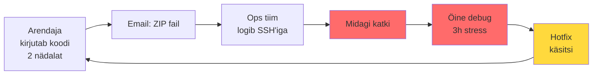

See ei ole efektiivne. See ei ole turvaline. See ei skaleeru. Ja mis kõige hullem - see on igav ning stressirohke töö, mis ei peaks üldse eksisteerima.

CI/CD on vastus küsimusele: kuidas viia kood arendaja käest kasutajani nii, et inimesed saaksid keskenduda huvitavale tööle, mitte käsitsi failide kopeerimisele?
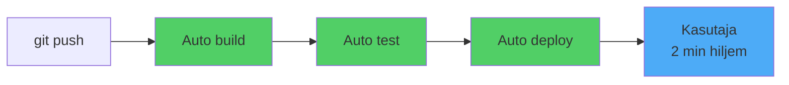

### Miks on see Oluline?

Käsitsi deployment'i probleemid pole lihtsalt ebamugavus. Need on fundamentaalsed äririskid. Iga käsitsi operatsioon on võimalus teha viga. Mida rohkem samme, seda suurem risk. Väsinud inimene kell 23:00 teeb vigu. Automatiseeritud süsteem ei väsi.

CI/CD võimaldab ettevõtetel liikuda kiiremini. Väiksemad muudatused sagedamini tähendab väiksemat riski. Kui midagi läheb valesti, on kerge tagasi pöörata. Kaks nädalat koodi muudatusi on raske debugida. Viis minutit koodi on lihtne.

---

## 2. Continuous Integration

Continuous Integration tähendab, et arendajad integreerivad oma koodi jagatud repositooriumi regulaarselt - ideaalis mitu korda päevas. Iga integratsioon kontrollitakse automaatse build'i ja testidega, et avastada vigu võimalikult kiiresti.

Kõlab lihtsalt, aga mõelge mis see tähendab. Traditsioonilises arenduses võivad arendajad töötada eraldi branch'ides nädalaid või kuid. Kui nad lõpuks oma koodi kokku viivad, tekib integratsiooni põrgu. Merge konfliktid, ühildumatud muudatused, keegi muutis API'd mida teine kasutab. Kõik läheb katki ja kulub päevi asjade parandamiseks.

CI lähenemine on teistmoodi. Kui integreerite sagedasti, siis iga muudatus on väike. Väikesi muudatusi on lihtne debugida. Kui midagi läheb katki, tead täpselt milline commit selle põhjustas. Ei pea otsima nädalate kaupa koodi läbi, et leida kus probleem tekkis.
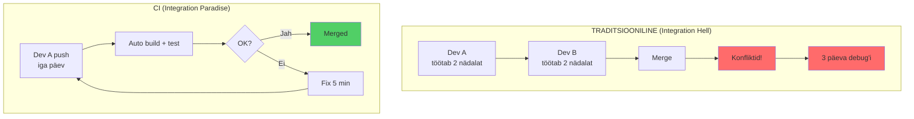

### CI Põhikomponendid

Aga CI ei ole lihtsalt "push code often". CI nõuab automatiseerimist. Igal pushil peab juhtuma midagi:

Build protsess kompileerib või paketeerib koodi. Kas see üldse töötab? Kas kõik sõltuvused on olemas? Kas süntaks on korrektne? Kui kompileerimine ebaõnnestub, kood ei lähe edasi.

Test faas jooksutab automaatsed testid. Unit testid kontrollivad üksikuid funktsioone. Integration testid kontrollivad kuidas komponendid koos töötavad. Regressioonitestid kontrollivad, et vanad featuurid ei läinud katki.

Report süsteem teavitab arendajaid koheselt. Kui midagi läheb valesti, saavad arendajad kohe teada. Mitte homme, mitte järgmisel nädalal. Koheselt.

Selle tulemusena ei ole enam olukorda, kus keegi ütleb "aga minu arvutis see töötab". Kui see ei tööta CI keskkonnas, siis ei tööta. Ja sa said sellest teada 5 minutit pärast push'i, mitte 2 nädalat hiljem kui QA tiim seda testis.

### Miks on see Oluline?

CI muudab kogu meeskonna töövoogu. Arendajad saavad kohest tagasisidet. Kui nad muutsid midagi, mis teiste koodi katki pani, teavad nad sellest kohe. Saavad kohe parandada, kui kontekst on veel meeles. Mitte nädal hiljem kui nad enam ei mäleta miks nad muudatuse tegid.

CI kultuur tähendab ka, et kod on alati releasable olekus. Igal hetkel saad production'i deployda. See ei tähenda, et sa deployid iga commit'i, aga võiksid. Kood on alati valmis.

---

## 3. Continuous Deployment

Continuous Deployment viib CI edasi. Kui kood läbis kõik testid ja kontrollid, siis see läheb automaatselt tootmisse. Ilma inimese sekkumiseta.

See kõlab paljudele hirmutavalt. "Automaatselt tootmisse? Ilma, et keegi kontrollib?"

Aga mõelge sellele nii: kas inimene, kes kell 23:00 käsitsi deployb, on tõesti parem kontroll kui automatiseeritud süsteem, mis on testitud tuhandeid kordi? Continuous Deployment ei tähenda "lase kõik lihtsalt läbi". See tähendab, et sul on niivõrd hea testimine, kvaliteedikontroll ja automatiseerimine, et sa usaldad seda protsessi rohkem kui käsitsi deployment'i.
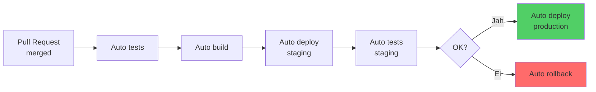

Praktikas näeb see välja nii:

- arendaja mergeb pull request'i. Automaatselt algab protsess
- testid, security scan, build, deployment staging keskkonda, automaatsed integration testid seal, kui kõik OK siis production. Kogu protsess võtab vahest 10-15 minutit. Kui midagi läheb valesti, rollback on sama automaatne.

### Continuous Delivery vs Continuous Deployment

Mõned ettevõtted kasutavad Continuous Delivery, mis on peaaegu sama, aga viimane samm (production deployment) vajab inimese kinnitust. See on hea vahevorm, kuni ettevõte saavutab piisava usalduse täielikult automatiseeritud protsessi vastu.

Mõelge erinevusele: ilma CD-ta võib arendaja kirjutatud kood jõuda kasutajateni nädalate või kuude pärast. CD-ga jõuab see sinna minutite või tundide jooksul. See tähendab kiiremat tagasisidet, kiiremat iteratsiooni, kiiremat väärtuse loomist.

### Miks on see Oluline?

Kiirem feedback loop tähendab paremat toodet. Kui kasutajad saavad uue feature'i tunnid pärast arendamist, siis sa näed kohe kas see toimib. Kas kasutajad seda kasutavad? Kas tekivad bugid? Kas performance on OK? Mida kiiremini sa seda tead, seda kiiremini saad parandada või itereerida.

---

## 4. Pipeline Arhitektuur

Pipeline on automatiseerimise selgroog. See defineerib täpselt, mis juhtub kui keegi pushib koodi.

Kujutage pipeline'i kui tehase konveierit: Alguses tuleb tooraine (source code), see läbib erinevaid jaamu (stages), igas jaamas tehakse kindlaid operatsioone (jobs), lõpus tuleb välja valmis toode (deployed application).
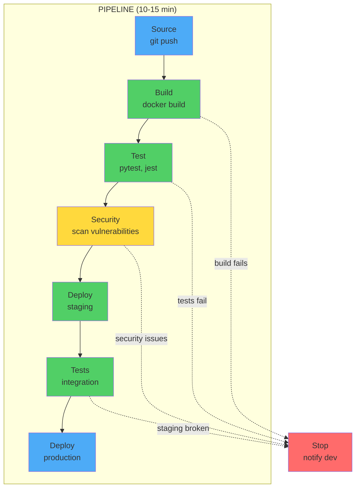

### Pipeline Stages

Klassikaline pipeline näeb välja umbes selline:

Source stage tõmbab koodi repositooriumist. See juhtub automaatselt kui keegi pushib või merge requestib. Pole vaja kellegi käsitsi sekkumist.

Build stage kompileerib või paketeerib koodi. Java projektides Maven või Gradle loob JAR faili. Node.js projektides npm install ja webpack teeb bundle'i. Python projektides tekib wheel package. Docker projektides käivitub docker build ja tekib container image. Tulemus on midagi, mida saab käivitada.

Test stage jooksutab teste paralleelselt. Unit testid on kiired (sekundid) ja kontrollivad üksikuid funktsioone. Integration testid on aeglasemad (minutid) ja kontrollivad komponentide koosmängu. E2E testid simuleerivad kasutaja käitumist - klikid, vormid, töövood. Performance testid kontrollivad, kas rakendus on piisavalt kiire. Security scannid otsivad turvaprobleeme.
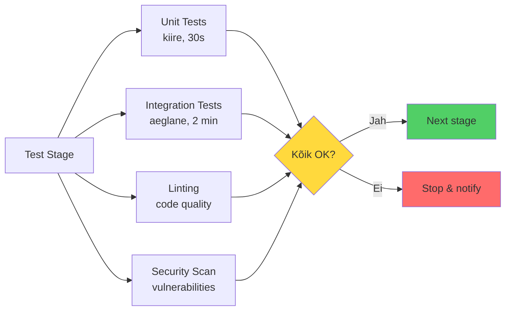

Deploy stage paigaldab rakenduse keskkonda. Development keskkond on arendajate mänguväljak, kus võib kõik olla katki. Staging on production'i koopia test andmetega. Production on päris kasutajad ja päris andmed.

Oluline reegel:

- Kui üks stage ebaõnnestub, siis järgmised ei käivitu. Build ebaõnnestub
- testid ei jookse. Testid failivad
- ei deploy. Kõik OK
- production!

### Pipeline Koodina

Pipeline on kirjeldatud koodina - tavaliselt YAML failina repositooriumis. See tähendab mitmeid olulisi asju.

Pipeline muudatused on versioned. Näed ajalugu, kes mida muutis ja millal. Pipeline on reviewable - saad teha code review nagu tavalisele koodile. Pipeline on testitav - saad testida feature branch'is enne kui merge'id. Kui keegi muudab pipeline'i, näed täpselt mida ja miks.

### Miks on see Oluline?

Pipeline koodina tähendab, et deployment protsess on dokumenteeritud ja reprodutseeritav. Pole enam olukorda, kus ainult üks inimene teab kuidas deployda. Pole enam "works on my machine" probleeme. Pipeline defineerib täpselt kuidas build toimub, millises keskkonnas, milliste sõltuvustega. See on sama kõigile.

---

## 5. CI/CD Platvormid

Turul on palju CI/CD platvorme. Vaatame peamisi ja nende tugevusi.

### GitHub Actions

Kasutus: Väikesed ja keskmised projektid, open source

Tugevused hõlmavad integratsioon GitHub'iga, mis tähendab null setup'i. Tasuta public repos jaoks. Suur marketplace kus on tuhandeid valmis action'eid. Lihtne õppida, hea dokumentatsioon.

Nõrkused: ainult GitHub repos. Limited free minutes private repos jaoks.

Kasutajad: Stripe, Shopify, Spotify

### GitLab CI/CD

Kasutus: Suured ettevõtted, self-hosted vajadus

Tugevused: täielik DevOps platvorm mis sisaldab Git, CI/CD, Container Registry ja Monitoring'u. Tasuta self-hosted variant. Võimas feature set kõigile vajadustele. Built-in Container Registry.

Nõrkused: keerulisem õppida kui GitHub Actions. UI võib olla overwhelming algajatele.

Kasutajad: CERN, NASA, Siemens

### Jenkins

Kasutus: Enterprise, legacy systems

Tugevused:

- vanim ja kõige rohkem kasutatav CI/CD tööriist. Tohutu plugin'ite ökosüsteem
- on plugin peaaegu igaks asjaks. Täielik kontroll kõige üle. Tasuta ja open source.

Nõrkused: vana UI mis pole kasutajasõbralik. Raske seadistada ja hooldada. Ainult self-hosted, pole cloud varianti.

Kasutajad: Netflix, LinkedIn, Samsung

### CircleCI

Kasutus: Startup'id, kui kiirus on kriitiline

Tugevused: väga kiire tänu heale parallelism'ile. Lihtne kasutada, hea UX. Docker-native arhitektuur.

Nõrkused: kallis võrreldes alternatiividega. Limited free tier.

Kasutajad: Facebook, GoPro, Spotify

### Võrdlus

| Platform | Parim | Halvim | Õppimiskõver | Hind |
|----------|-------|--------|--------------|------|
| GitHub Actions | Lihtsus | Limited features | Lihtne | Tasuta/Odav |
| GitLab CI | Täielik platform | Complexity | Keskmine | Tasuta/Kallis |
| Jenkins | Kontroll | Hooldus | Raske | Tasuta |
| CircleCI | Kiirus | Hind | Lihtne | Kallis |

### Kuidas Valida?

Valik sõltub mitmest tegurist. Esiteks, mis Git platvormi kasutate? Kui GitHub, siis GitHub Actions on lihtsaim valik. Kui GitLab, siis GitLab CI on built-in. Kui kasutate mitut platvormi, siis Jenkins või CircleCI.

Teiseks, kas vajate self-hosted või cloud lahendust? Cloud'i jaoks sobivad GitHub Actions ja CircleCI. Self-hosted jaoks Jenkins ja GitLab self-hosted.

Kolmandaks, mis on meeskonna skill level? Algajatele sobib GitHub Actions. Kogenud tiimidele GitLab CI. DevOps tiimile Jenkins.

Neljandaks, mis on teie tech stack? .NET ja Azure projektidele sobib Azure Pipelines. Modern web projektidele GitHub Actions või GitLab CI. Legacy süsteemidele Jenkins.

### GitHub Actions Praktikas

Meie kursuses kasutame GitHub Actions't. Vaatame kuidas see töötab.

Workflow on pipeline - YAML fail `.github/workflows/` kaustas. Job on stage. Step on task job'i sees. Action on taaskasutav komponent marketplace'ist.

Lihtne näide:
```yaml
name: CI

on:
  push:
    branches: [ main ]
  pull_request:
    branches: [ main ]

jobs:
  test:
    runs-on: ubuntu-latest
    steps:

      - uses: actions/checkout@v3
      
      - name: Set up Python
        uses: actions/setup-python@v4
        with:
          python-version: '3.9'
      
      - name: Run tests
        run: pytest tests/
```

### Sama Pipeline Erinevatel Platvormidel

GitHub Actions:
```yaml
name: CI/CD
on:
  push:
    branches: [ main ]

jobs:
  build:
    runs-on: ubuntu-latest
    steps:

      - uses: actions/checkout@v3
      - run: docker build -t myapp .
```

GitLab CI:
```yaml
stages:

  - build

build:
  stage: build
  image: docker:latest
  script:

    - docker build -t myapp .
```

Jenkins:
```groovy
pipeline {
    agent any
    stages {
        stage('Build') {
            steps {
                sh 'docker build -t myapp .'
            }
        }
    }
}
```

Näete: sama loogika, erinev süntaks. Kui õpite üht, teine on lihtne.

### GitHub Actions Marketplace

GitHub'il on marketplace kus on tuhandeid valmis action'eid. Ei pea ise kirjutama - keegi on juba teinud.
```yaml
jobs:
  deploy:
    runs-on: ubuntu-latest
    steps:
      # Docker build and push
      - uses: docker/build-push-action@v4
        with:
          push: true
          tags: myapp:latest
      
      # Slack notification
      - uses: 8398a7/action-slack@v3
        with:
          status: ${{ job.status }}
          webhook_url: ${{ secrets.SLACK_WEBHOOK }}
```

---

## 6. Docker ja CI/CD Integratsioon

Kui rääkida CI/CD-st tänapäeval, ei saa mööda Docker'ist. Need kaks tehnoloogiat täiendavad ideaalselt üksteist.

CI/CD probleemiks on alati olnud keskkondade erinevused. Arendaja masinal on Python 3.9, test serveril Python 3.8, production'il Python 3.10. Arendajal on ühed teegid, serveril teised versioonid. Midagi töötab ühes kohas, ei tööta teises.
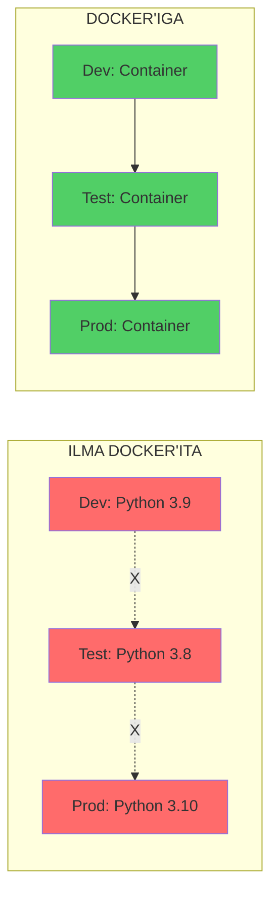

Docker lahendab selle radikaalse lähenemisega: me ei paigalda rakendust otse serverisse. Me pakendame rakenduse koos kõigi sõltuvustega ühte container image'isse. See image sisaldab täpselt sama keskkonda igal pool - arendaja laptopil, CI süsteemis, staging'ul, production'il.

### CI/CD Kontekstis

CI/CD kontekstis tähendab see kahte asja. Esiteks, job'id jooksevad container'ites. Iga job saab määrata, millises Docker image'is ta jookseb.

GitHub Actions:
```yaml
jobs:
  test:
    runs-on: ubuntu-latest
    container:
      image: python:3.9
    steps:

      - run: pytest
```

GitLab CI:
```yaml
test:
  image: python:3.9
  script:

    - pytest
```

Teiseks, me build'ime container image'id. Rakenduse deployment tähendab container image loomist.

GitHub Actions:
```yaml
- name: Build and push
  run: |
    docker build -t myapp:${{ github.sha }} .
    docker push myapp:${{ github.sha }}
```

GitLab CI:
```yaml
build:
  image: docker:latest
  services:

    - docker:dind
  script:

    - docker build -t myapp:$CI_COMMIT_SHA .
    - docker push myapp:$CI_COMMIT_SHA
```

Tulemus: garanteeritud ühesugune keskkond. Kui testid läbivad CI-s, siis sama image töötab ka production'is.

### Miks on see Oluline?

Docker + CI/CD kombinatsioon elimineerib "works on my machine" probleemi täielikult. Kõik keskkonnad kasutavad täpselt sama container image'i. Sama Python versioon, samad teegid, samad sõltuvused. Kui see töötab CI-s, töötab ka production'is.

---

## 7. Automated Testing

Kõige olulisem osa CI/CD'st ei ole ehitamine ega deploy - see on testimine. Automaatsed testid on see, mis annab meile kindluse, et kood töötab.

### Testide Tüübid
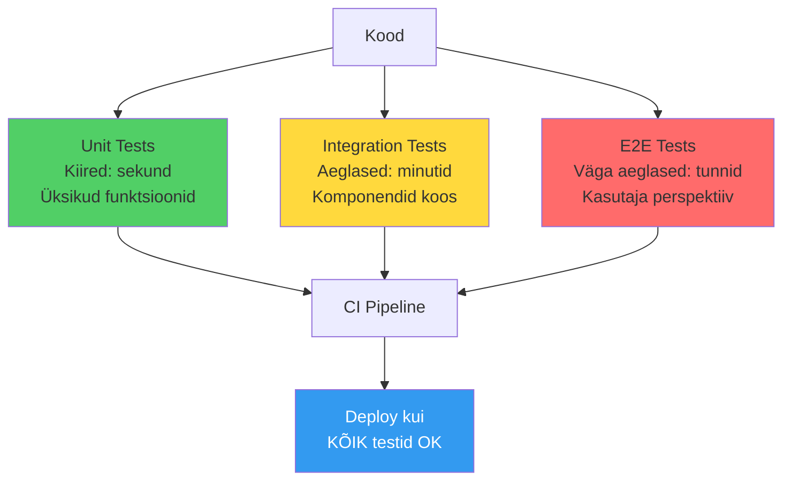

Unit testid testavad üksikuid funktsioone isolatsioonis. Need on kiired - jooksevad sekundites. Neid on palju - iga funktsiooni jaoks.
```python
# app.py
def calculate_price(quantity, unit_price, discount=0):
    if quantity < 0 or unit_price < 0:
        raise ValueError("Must be positive")
    subtotal = quantity * unit_price
    return subtotal - (subtotal * discount / 100)

# test_app.py
def test_calculate_price():
    assert calculate_price(10, 5.0) == 50.0
    assert calculate_price(10, 10.0, discount=20) == 80.0
```

Integration testid testavad komponentide koosmängu. Need on aeglasemad - jooksevad minutites. Kontrollivad kas API, andmebaas ja muud komponendid töötavad koos.
```python
def test_api_create_order():
    response = requests.post("/api/orders", json={
        "items": [{"id": 1, "qty": 2}]
    })
    assert response.status_code == 201
    # Kontrolli andmebaasis
    order = db.get_order(response.json()["order_id"])
    assert order is not None
```

E2E testid testavad tervet rakendust kasutaja vaatenurgast. Need on väga aeglased - jooksevad tundides. Simuleerivad päris kasutaja tegevusi - klikid, vormide täitmine, töövood.

### Test Coverage

Code coverage näitab, kui palju koodist on testidega kaetud.
```bash
pytest --cov=app --cov-report=html

# Name                Stmts   Miss  Cover
# ---------------------------------------
# app/__init__.py         5      0   100%
# app/models.py          45      3    93%
# app/api.py             78     12    85%
# ---------------------------------------
# TOTAL                 128     15    88%
```

Tööstuse standard:

- 80%+ coverage on hea. Kriitilised funktsioonid (payment, authentication) peavad olema 100%. Aga 100% ei ole eesmärk
- kvaliteet on tähtsam kui kvantiteet.

### Test Pyramid
```
     /\
    /E2E\      ← Vähe, aeglased
   /------\
  /  Int  \    ← Mõned, keskmised
 /----------\
/   Unit     \ ← Palju, kiired
--------------
```

Reegel: 70% unit, 20% integration, 10% E2E

### Miks on see Oluline?

Ilma testideta on CI/CD lihtsalt kiire viis production'i katki panna. Testid on see, mis annab kindluse. Kui kõik testid on rohelised, võid deployment'iga jätkata. Kui mõni test on punane, peatad. Parandad. Proovid uuesti.

Automaatsed testid tähendavad ka, et sa ei pea käsitsi testimisele aega kulutama. Arvuti testib sinu eest. Sa võid keskenduda huvitavale tööle - uute featuuride loomisele.

---

## 8. Deployment Strateegiad

Harva deployditakse otse production'i. Tavaliselt on mitu keskkonda.

Development on arendajate mänguväljak. Siin võib kõik olla katki. Staging on koopia production'ist - sama konfiguratsioon, aga test andmetega. Production on päris kasutajad ja päris andmed.
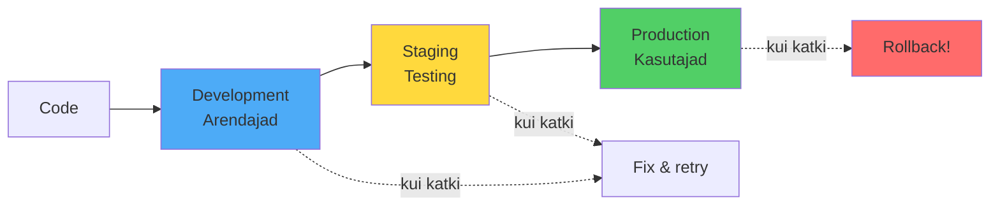

GitHub Actions:
```yaml
deploy:
  environment:
    name: production
    url: https://myapp.com
  steps:

    - run: deploy.sh
```

GitLab CI:
```yaml
deploy:
  environment:
    name: production
    url: https://myapp.com
  script:

    - deploy.sh
```

### Deployment Meetodid

Rolling deployment uuendab servereid järjest. Lihtne implementeerida, aga võtab aega. Downtime on minimaalne, aga on periood kus erinevad versioonid töötavad paralleelselt.

Blue-green deployment kasutab kaht keskkonda. Blue on praegune production. Green on uus versioon. Kui green on valmis ja testitud, switchid traffic'u blue'lt green'le. Kiire rollback - lihtsalt switchi tagasi. Aga vajab 2× ressursse.

Canary deployment alustab väikese kasutajate grupiga. 5% kasutajatest saab uue versiooni. Kui kõik on OK, järk-järgult 10%, 25%, 50%, 100%. Kui midagi läheb valesti, rollback mõjutab ainult väikest osa kasutajatest. Kõige turvalisem, aga kõige keerulisem implementeerida.
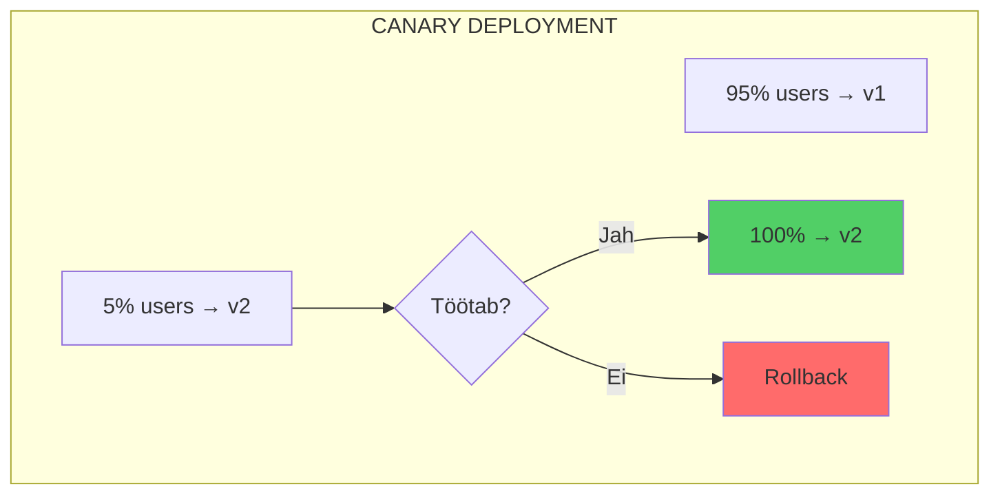

### Miks on see Oluline?

Deployment strateegia valik määrab, kui kiiresti saad uusi feature'id kasutajateni viia ja kui kiiresti saad vigadest taastuda. Hea strateegia minimeerib riski ja maksimeerib kiirust.

---

## 9. Turvalisus ja Secrets

Pipeline'id kasutavad tundlikke andmeid: paroole, API võtmeid, SSH key'sid. Mitte kunagi pane neid koodi sisse!
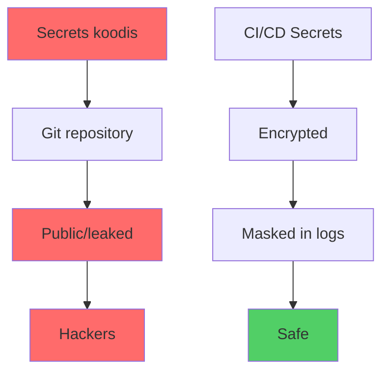

GitHub Actions: Settings → Secrets and variables → Actions. Kasuta `${{ secrets.API_KEY }}` workflow'des.

GitLab CI: Settings → CI/CD → Variables. Kasuta `$API_KEY` pipeline'ides.

Kõik platvormid: Encrypted at rest. Masked in logs. Protected branches.

### Security Scanning

Security scanning peaks olema osa pipeline'ist. Dependency scanning kontrollib kas teegid on turvalised. Container scanning kontrollib kas Docker image on turvaline. Secret detection kontrollib kas koodi sisse on jäänud paroole.

Tools: Trivy, Snyk, GitLeaks

### Miks on see Oluline?

Turvalisus ei ole midagi, mida lisatakse hiljem. See peab olema sisse ehitatud algusest peale. Iga commit läbib security scanni. Iga image scannitakse vulnerabilities'te suhtes. Secrets on encrypted. Logs on masked. See on part of the process, mitte afterthought.

---

## 10. Monitoring ja Feedback

Pipeline jookseb. Kas õnnestus? Kas ebaõnnestus? Kus läks katki?

Kõik CI/CD platvormid näitavad pipeline status'it (roheline/punane), job loge, execution time'i ja error messages'eid. Aga pipeline on ainult pool tõest. Teine pool: mis toimub application'iga pärast deployment'i?

### Health Checks
```yaml
deploy:
  steps:

    - run: deploy.sh
    - run: sleep 10
    - run: curl -f https://myapp.com/health || exit 1
```

Pärast deployment'i kontrolli kas rakendus vastab. Kui ei vasta, rollback.

### Notifications

Slack webhooks saadavad sõnumeid Slack kanalisse. Email teavitab arendajaid. PagerDuty äratab inimesi kell 3 öösel kui production on katki.
```yaml
- uses: 8398a7/action-slack@v3
  with:
    status: ${{ job.status }}
    webhook_url: ${{ secrets.SLACK_WEBHOOK }}
```

### Deployment Annotations

Pipeline võib lisada deployment annotation monitoring süsteemi (Grafana, Datadog). Siis näete täpselt: "15:30 oli deployment, pärast seda kasvas error rate 500%". Saate korreleerida deploymente metrikatega.

Feedback loop peab olema kiire. Mida kiiremini te teate, et midagi läks valesti, seda kiiremini saate parandada.

### Miks on see Oluline?

Ilma monitoring'uta ei tea sa kas deployment õnnestus. Pipeline võib olla roheline, aga production on katki. Health check'id ja monitoring'u kinnitavad, et rakendus tõesti töötab. Notifications tagavad, et õiged inimesed saavad õigel ajal teada.

---

## 11. Optimeerimine ja Best Practices

Pipeline'id võivad võtta aega. Kui iga kord installite kõik dependencies nullist, kulub minuteid.

### Cache

Cache on viis kuidas salvestada faile job'ide vahel. Dependencies ei muutu iga commit'iga. Miks alla laadida uuesti?

GitHub Actions:
```yaml
- uses: actions/cache@v3
  with:
    path: ~/.cache/pip
    key: ${{ runner.os }}-pip-${{ hashFiles('**/requirements.txt') }}
```

GitLab CI:
```yaml
cache:
  key: ${CI_COMMIT_REF_SLUG}
  paths:

    - node_modules/
```

### Artifacts

Artifacts on job'i väljund, mida järgmine stage vajab. Build stage loob JAR faili. Deploy stage vajab seda JAR faili. Artifacts võimaldavad seda jagada.

GitHub Actions:
```yaml
- uses: actions/upload-artifact@v3
  with:
    name: build
    path: build/
```

GitLab CI:
```yaml
artifacts:
  paths:

    - build/
  expire_in: 1 week
```

Cache vs Artifacts: Cache on optimisatsioon (kiirendab), Artifacts on funktsionaalsus (vajalik).

### Miks on see Oluline?

Kiire pipeline tähendab kiiremat feedback loop'i. Kui pipeline võtab 20 minutit, siis arendaja läheb teist tööd tegema. Unustab konteksti. Kui pipeline võtab 5 minutit, siis arendaja jääb ootama. Saab kohest tagasisidet. Cache ja Artifacts aitavad pipeline'i kiirendada.

---

## Kokkuvõte

CI/CD muudab fundamentaalselt kuidas tarkvara tehakse.

### Tulemused

| Aspekt | Ilma CI/CD | CI/CD-ga |
|--------|-----------|----------|
| Deploy sagedus | 1× kuus | 10-100× päevas |
| Deploy aeg | Tunnid | Minutid |
| Vigade avastamine | Päevad hiljem | Minutid pärast push'i |
| Stress level | Kõrge | Madal |

Põhitõed: kiirem delivery, parem kvaliteet, väiksem stress, võimalus skaleerida.

CI/CD on DevOps kultuur koodina. See ei ole lihtsalt tööriist. See on viis mõelda kuidas tarkvara tehakse. Väikesed muudatused sagedamini. Automaatne testimine. Kiire feedback. Pidev parendamine.

---

## Järgmised Sammud

Lab'is seadistame GitHub Actions pipeline'i. Ehitame Docker image'i automaatselt. Deploy'ime (simuleeritud keskkonda). Testame pipeline'i ja näeme kuidas kõik kokku töötab.

Õpi rohkem:

- [GitHub Actions Docs](https://docs.github.com/actions)
- [GitLab CI/CD Docs](https://docs.gitlab.com/ee/ci/)
- [The Phoenix Project](https://itrevolution.com/the-phoenix-project/) - DevOps kultuurist

---

## Ressursid

**Dokumentatsioon:**

- [GitHub Actions](https://docs.github.com/actions)
- [GitLab CI/CD](https://docs.gitlab.com/ee/ci/)
- [Docker in CI/CD](https://docs.docker.com/ci-cd/)

**Videod:**

- [CI/CD in 100 seconds](https://www.youtube.com/watch?v=scEDHsr3APg) - Fireship
- [GitHub Actions Tutorial](https://www.youtube.com/watch?v=R8_veQiYBjI)

**Miks see oluline:**

- CI/CD on üks olulisemaid oskusi kaasaegses tarkvaraarenduses
- Iga arendaja peab teadma, kuidas kood jõuab kasutajateni
- DevOps engineer'id kasutavad seda iga päev