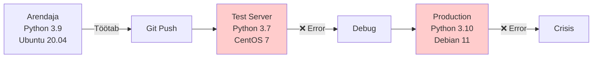
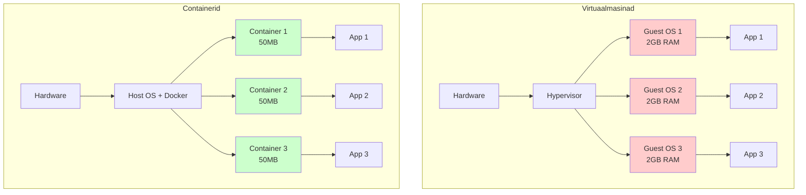
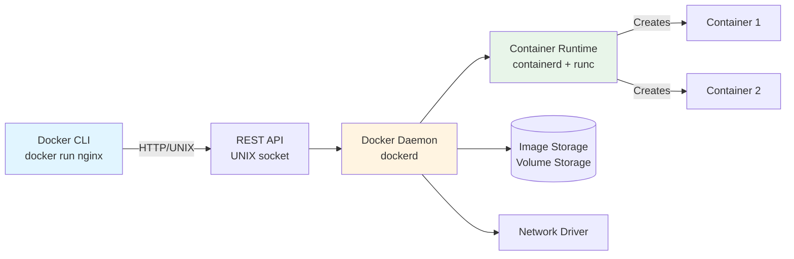
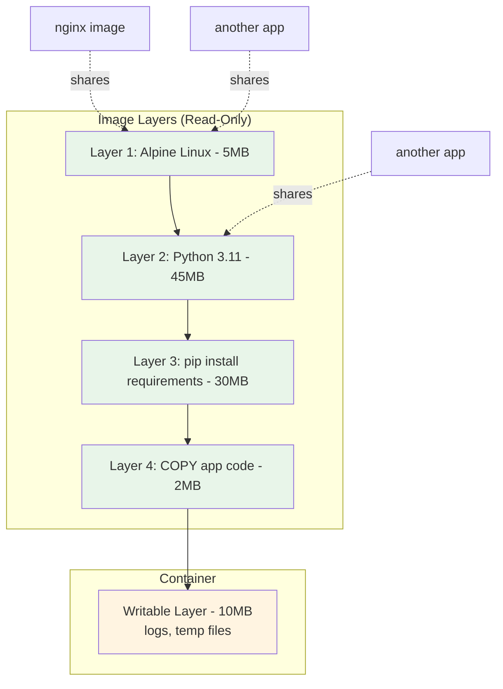
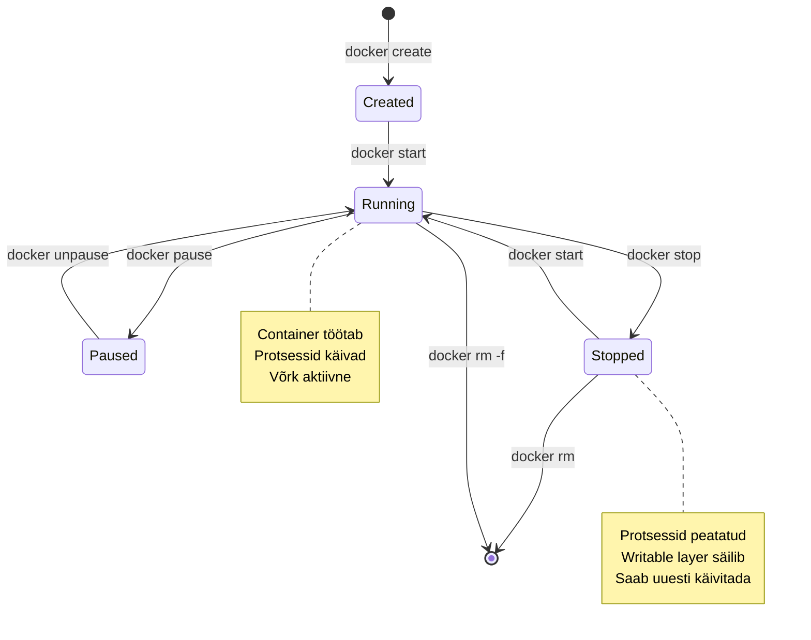
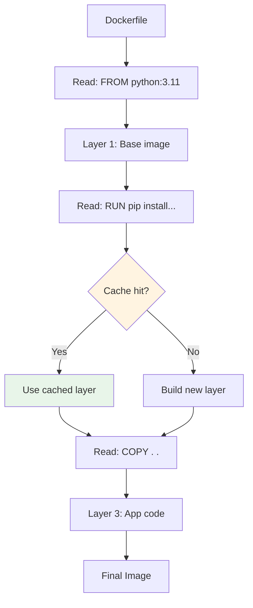
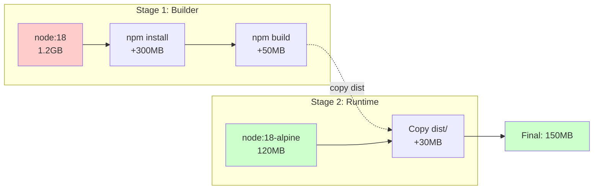
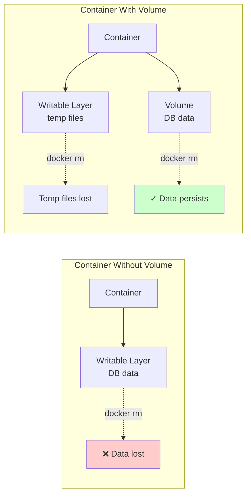
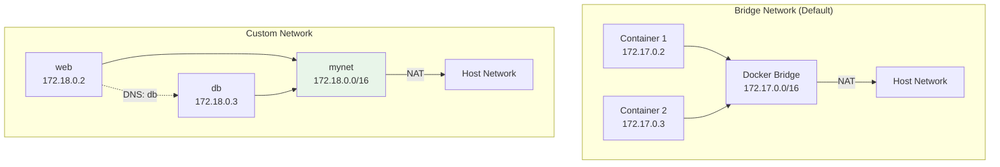
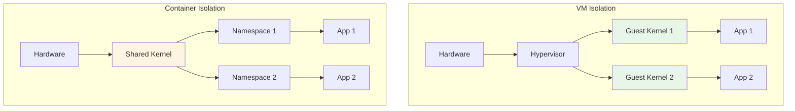

# Docker: Konteinerite Põhitõed

**Eeldused:** Linux CLI põhitõed, tekstiredaktor  
**Platvorm:** Docker (platform-agnostic), Podman

**Dokumentatsioon:** [docs.docker.com](https://docs.docker.com/)

## Õpiväljundid

- Selgitad konteinerite tehnoloogia vajadust ja eeliseid
- Eristab Docker'i arhitektuuri komponente
- Võrdleb konteineri tehnoloogiaid virtuaalmasinatega
- Mõistad image'ide ja container'ite vahelist suhet
- Kirjeldad Dockerfile'i struktuuri ja ehitusprotsessi
- Kasutad volume'e andmete püsivuse tagamiseks

---

## 1. Konteinerite Tehnoloogia Motiiv

### 1.1 Keskkondade Probleem

IT infrastruktuuris on alati eksisteerinud konfiguratsioonide lahknevus. Arendaja laptop sisaldab Pythoni versiooni 3.9 Ubuntu 20.04 peal, testimisserver kasutab Pythoni 3.7 CentOS'il, produktsioonikeskkond jooksutab Pythoni 3.10 Debian'il. Igaüks nendest keskkondadest sisaldab erinevaid süsteemiteeke, sõltuvusi ja seadistusi.



Tulemus on ennustatav: kood töötab ühes keskkonnas, ebaõnnestub teises. Arendajad kulutavad tunde keskkondade sünkroniseerimisele, DevOps meeskonnad haldavad keerukaid deployment skripte, testimine muutub ebausaldusväärseks. Need probleemid pole uued, kuid nende mõju kasvab eksponentsiaalselt koos rakenduste keerukusega.

### 1.2 Varasemad Lahendused

Virtuaalmasinad pakkusid 2000-2010 isolatsiooni probleemile lahendust, kuid hinnaga. Iga VM sisaldab täielikku operatsioonisüsteemi koopiat, mida haldab hypervisor. See tähendab gigabaitide jagu kettaruumi ja RAM'i igale rakendusele, koos 30-60 sekundilise käivitusajaga. Serveri ressursid ammenduvad kiiresti.

Configuration Management tööriistad nagu Puppet, Ansible ja Chef automatiseerisid serveri seadistamise 2010-2015. Probleem püsib - serverid muutuvad aja jooksul, **drift** on vältimatu. Manuaalsed sekkumised, sõltuvuste uuendused ja logifailide kuhjumine muudavad iga serveri unikaalseks. Süsteemi taastamine või replikatsioon muutub iga korraga keerulisemaks.

### 1.3 Docker'i Revolutsioon

Docker kasutas 2013. aastal Linux'i kernel'i olemasolevaid võimeid uudsel viisil. Linux'i **namespaces** isoleerivad protsesse, **cgroups** piiravad ressursse. Docker raames container'id jagavad host'i kernel'it, kuid on protsesside tasandil täielikult isoleeritud.



Võrdlus näitab erinevust:

| Kriteerium | Container | Virtuaalmasin |
|------------|-----------|---------------|
| Käivitusaeg | 1-3 sekundit | 30-60 sekundit |
| Mälukasutus | 10-100 MB | 512 MB - 8 GB |
| Kettaruum | 100 MB - 1 GB | 10-50 GB |
| Server mahutab | 100-1000+ | 10-50 |
| Isolatsioon | Kernel jagatud | Täielik |

Container'i käivitamine on sisuliselt protsessi käivitamine koos isolatsioonimeetmetega. VM käivitamine tähendab terve OS'i boot'imist. See fundamentaalne erinevus selgitab jõudluse ja ressursikasutuse erinevusi.

### 1.4 Tööstuse Kasutusnäited

Netflix käivitab üle miljardi container'i nädalas oma sisuhaldus- ja soovitussüsteemides. Google'i infrastruktuur on alates 2000. aastatest olnud container-põhine, alustades Borg süsteemist, mis hiljem arenes Kuberneteseks. Wise (endine TransferWise) kasutab konteineri tehnoloogiat mikroteenuste arhitektuuris, võimaldades igas riigis eraldi regulatiivsetele nõuetele vastavat deployment'i.

87% IT ettevõtetest kasutab konteinereid produktsioonis 2024. aasta seisuga. See pole enam eksperimentaalne tehnoloogia, vaid standardne lähenemine rakenduste käivitamisele.

---

## 2. Docker Arhitektuur ja Mõisted

### 2.1 Client-Server Mudel

Docker kasutab klassikalist **client-server arhitektuuri**. Docker CLI (client) suhtleb Docker daemoniga (dockerd) üle UNIX socket'i või HTTP API. Daemon haldab image'eid, container'eid, võrke ja volume'e. See eraldamine võimaldab remote haldust - CLI võib asuda ühes masinas, daemon teises.



Daemon kasutab **containerd** runtime'i, mis omakorda kasutab **runc**'i container'ite käivitamiseks. See kihistatud arhitektuur järgib Unix filosoofiat - iga komponent teeb üht asja hästi.

### 2.2 Image

**Image** on read-only template, mis sisaldab operatsioonisüsteemi baasi, runtime'i, sõltuvusi ja rakenduse koodi. Image on immutable - pärast loomist ei muutu kunagi. Iga muudatus loob uue image'i versiooni. See immutability tagab reprodutseeritavuse.

Image koosneb **layer'itest**. Iga Dockerfile käsk loob uue layer'i, mis salvestatakse overlay failisüsteemis. Layer'id on jagatud - kui kümme image't kasutab sama base layer'it, salvestatakse see kettale ainult üks kord. Layer'id on ka cacheable - kui Dockerfile'is ei muutu rida, kasutatakse vana layer'it cache'ist, kiirendades järgnevaid build'e.



Base layer võib olla `alpine` (5MB), `ubuntu` (30MB) või `debian` (120MB). Igale lisandub rakenduse layer'id. Optimeeritud image võib olla 50-100MB, optimeerimata võib ulatuda gigabaitideni.

### 2.3 Container

**Container** on töötav instantsi image'ist. Container saab writable layer'i image'i peale, kuhu saab kirjutada ajutisi faile. See layer on ajutine - container kustutamisel kaob ka writable layer koos kõigi muudatustega. Container isoleerib protsesse, võrku, failisüsteemi ja ressursse.



Container ei ole VM. See on isoleeritud protsess host operatsioonisüsteemis. Container jagab kernel'it host'iga, seega ei saa native Windows container'it käivitada Linux host'il ilma virtualisatsioonita. WSL2 Windows'is kasutab taustal kerget VM'i, et pakkuda Linux kernel'it.

### 2.4 Registry

**Registry** on image'ide ladu. Docker Hub on avalik registry, kust saab alla laadida tuhandeid valmis image'eid. Ametlikud image'd nagu nginx, postgres, python on Docker Inc poolt auditeeritud. Ettevõtted kasutavad private registry'sid (AWS ECR, Google Container Registry, Harbor) kontrolli ja turvalisuse jaoks.

Image'i täisnimi järgib formaati: `registry/namespace/repository:tag`

- Docker Hub: `nginx:alpine` on lühend täisnimest `docker.io/library/nginx:alpine`
- Private: `gcr.io/my-project/api-server:v1.2.3`

Tag on optional - kui puudub, kasutatakse `latest`. **Oluline:** `latest` ei tähenda kõige uuemat versiooni, vaid default tag'i. Produktsioonis kasuta alati spetsiifilisi versioone.

---

## 3. Docker vs Podman vs Virtuaalmasinad

### 3.1 Arhitektuuriline Võrdlus

| Kriteerium | Docker | Podman | VM (KVM/VMware) |
|------------|--------|--------|-----------------|
| Daemon | Vajab dockerd | Daemonless | Hypervisor |
| Õigused | Root privileegid vajalikud | Rootless võimalik | Root + hypervisor |
| Networking | Bridge/overlay/host | Sama | Virtual NIC |
| Image formaat | OCI compliant | OCI compliant | Disk image (qcow2, vmdk) |
| Orchestration | Swarm/Kubernetes | Kubernetes native | - |
| Pod support | Ei (ainult containers) | Jah | - |

**OCI** (Open Container Initiative) määratleb image ja runtime standardid. Podman ja Docker kasutavad sama formaati, seega `docker pull` image töötab `podman run` käsuga. See standardiseerimine võimaldab vendor lock-in'i vältimist.

### 3.2 Millal Kasutada Mida

**Docker:** Küps ökosüsteem, Docker Compose de facto standard arenduses, lai tööstuslik toetus. Õppimiskõvera algus on lihtne. Kubernetes'e migratsiooni tee on hästi dokumenteeritud.

**Podman:** Turvalisem arhitektuur tänu rootless režiimile, ei vaja daemon'it (vähem attack surface), pod kontseptsiooni native tugi. Sobib hästi ettevõtete turvapõhimõtetega. Drop-in asendus Docker CLI'le.

**VM:** Erinev OS kernel (Windows rakendus Linux host'il), range turvaisolatsioon kriitiliste süsteemide jaoks, legacy rakendused mis vajavad spetsiifilist kernel versiooni või driver'eid.

Praktikas kasutatakse sageli koos - VM'id füüsilise infrastruktuuri isoleerimiseks, container'id rakenduste isoleerimiseks.

---

## 4. Dockerfile ja Image'ide Loomine

### 4.1 Dockerfile Süntaks

Dockerfile on tekstifail käskudega image'i ehitamiseks. Iga rida loob potentsiaalselt uue layer'i. Formaadilt lihtne, kuid optimeerimise võimalused on sügavad.

**Põhilised käsud:**

| Käsk | Otstarve | Näide |
|------|----------|-------|
| **FROM** | Base image | `FROM python:3.11-alpine` |
| **WORKDIR** | Töökataloog | `WORKDIR /app` |
| **COPY** | Kopeeri failid | `COPY . .` |
| **RUN** | Käivita build ajal | `RUN pip install -r requirements.txt` |
| **ENV** | Environment variable | `ENV PORT=8000` |
| **EXPOSE** | Dokumenteeri port | `EXPOSE 8000` |
| **CMD** | Vaikimisi käsk | `CMD ["python", "app.py"]` |
| **ENTRYPOINT** | Peamine käsk | `ENTRYPOINT ["nginx"]` |

**Lihtsustatud näide:**

```dockerfile
FROM python:3.11-alpine
WORKDIR /app
COPY requirements.txt .
RUN pip install -r requirements.txt
COPY . .
CMD ["python", "app.py"]
```

### 4.2 Build Protsess

```bash
docker build -t myapp:v1.0 .
```

Docker loeb Dockerfile'i, käivitab iga käsu järjest temporary container'is, commitib tulemuse uueks layer'iks. **Cache'imine** on kriitiline jõudluse jaoks - kui layer ei ole muutunud, kasutab Docker cached versiooni.



Build context (`.` eelmises näites) saadetakse daemonile. Suur context aeglustab build'i. Kasuta `.dockerignore` et välistada `node_modules/`, `.git/`, log failid.

### 4.3 Multi-Stage Build

Suurte rakenduste puhul on build dependencies oluliselt suuremad kui runtime vajadus. Multi-stage build eraldab need:

```dockerfile
# Build stage
FROM node:18 AS builder
WORKDIR /app
COPY package*.json ./
RUN npm ci
COPY . .
RUN npm run build

# Runtime stage  
FROM node:18-alpine
WORKDIR /app
COPY --from=builder /app/dist ./dist
CMD ["node", "dist/main.js"]
```

Tulemus: final image sisaldab ainult runtime'i ja kompileeritud koodi, mitte build tools'e. Image suurus väheneb 1.2GB → 150MB.



### 4.4 Image Optimeerimise Põhimõtted

**Vali väiksem base image:** `python:3.11-alpine` (50MB) vs `python:3.11` (900MB).

**Kombineeri RUN käsud:** Iga `RUN` loob layer'i. Kolm `RUN` käsku = kolm layer'it.

**Järjesta Dockerfile:** Harvem muutuvad read algusesse. `COPY requirements.txt` enne `COPY . .` võimaldab cache'ida sõltuvuste installimist.

**.dockerignore näide:**
```
node_modules/
.git/
*.log
.env
__pycache__/
*.pyc
.pytest_cache/
```
---

## 5. Volumes ja Andmehaldus

### 5.1 Probleem

Container'i writable layer on ajutine. Container kustutamisel kaovad andmed. Andmebaasid, logid, kasutaja-poolt laaditud failid vajavad püsivat salvestust.



### 5.2 Volume Tüübid

**Named volumes:** Docker haldab volume'i asukohta. Soovitatav produktsioonis.

```bash
docker volume create pgdata
docker run -d -v pgdata:/var/lib/postgresql/data postgres
```

**Bind mounts:** Host'i kataloog mountitakse container'isse. Kasutatakse arenduses.

```bash
docker run -d -v /host/path:/container/path nginx
```

**tmpfs mounts:** Salvestab RAM'is. Kiire, aga kaob restart'imisel.

| Tüüp | Kasutus | Püsivus | Jõudlus |
|------|---------|---------|---------|
| Named volume | Production data | Püsiv | Hea |
| Bind mount | Development | Püsiv | Host'ist sõltuv |
| tmpfs | Cache, temp | Kadub | Väga kiire |

### 5.3 Volume Elutsükkel

Volume eksisteerib iseseisvalt container'ist:

```bash
# Container 1 kirjutab
docker run -v mydata:/data alpine sh -c 'echo "test" > /data/file.txt'

# Container 2 loeb sama volume'i
docker run -v mydata:/data alpine cat /data/file.txt  # "test"
```

Volume ei kustutata automaatselt. Kasuta `docker volume prune` kasutamata volume'ide kustutamiseks.

---

## 6. Networking

### 6.1 Network Driver'id

**Bridge (default):** Privaatne võrk host'is. Container'id saavad omavahel suhelda.

**Host:** Container kasutab host'i võrku otse. Kõige kiirem, kuid vähem isoleeritud.

**None:** Container'il pole võrguühendust.



### 6.2 Container-to-Container Communication

```bash
docker network create mynet
docker run -d --name db --network mynet postgres
docker run -d --name api --network mynet myapi
```

Container'id samas network'is näevad üksteist DNS'i kaudu. Container `db` on kättesaadav hostname'iga `db`. Port mapping (`-p`) on välise ligipääsu jaoks.

---

## 7. Turvalisus

### 7.1 Container vs VM Turvalisus

Container'id jagavad kernel'it - kernel exploit võib mõjutada host'i. VM'id on isoleeritud hypervisori tasemel.



### 7.2 Best Practices

**Non-root user:**
```dockerfile
RUN adduser -D appuser
USER appuser
```

**Read-only filesystem:**
```bash
docker run --read-only --tmpfs /tmp myapp
```

**Image scanning:**
```bash
trivy image myapp:latest
```

**Minimal base images:** Alpine (5MB) vs Ubuntu (100MB) - vähem pakette = vähem haavatavusi.

---

## Kokkuvõte

Docker lahendab keskkondade sünkroniseerimise probleemi container'ite kaudu. Container'id on kiired, kerged ja portaalsed. Dockerfile kirjeldab image'i loomist, volume'id säilitavad andmeid, network'id võimaldavad suhtlust.

**Põhimõisted:**
- **Image** - immutable template
- **Container** - töötav instantsi 
- **Volume** - püsiv andmete salvestus
- **Network** - container'ite vaheline suhtlus

**Järgmised sammud:**
- Praktiline labor Docker käskude ja Dockerfile'idega
- Docker Compose mitme container'i haldamiseks
- Kubernetes orkestreerimiseks produktsioonis

---
