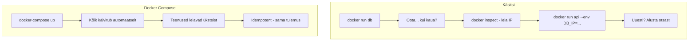
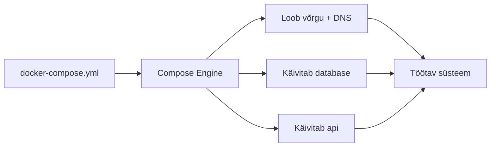
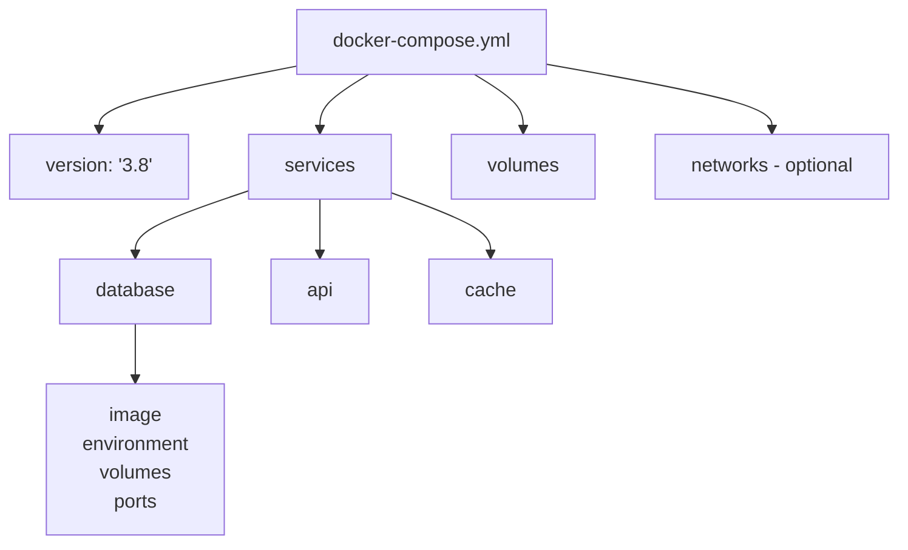
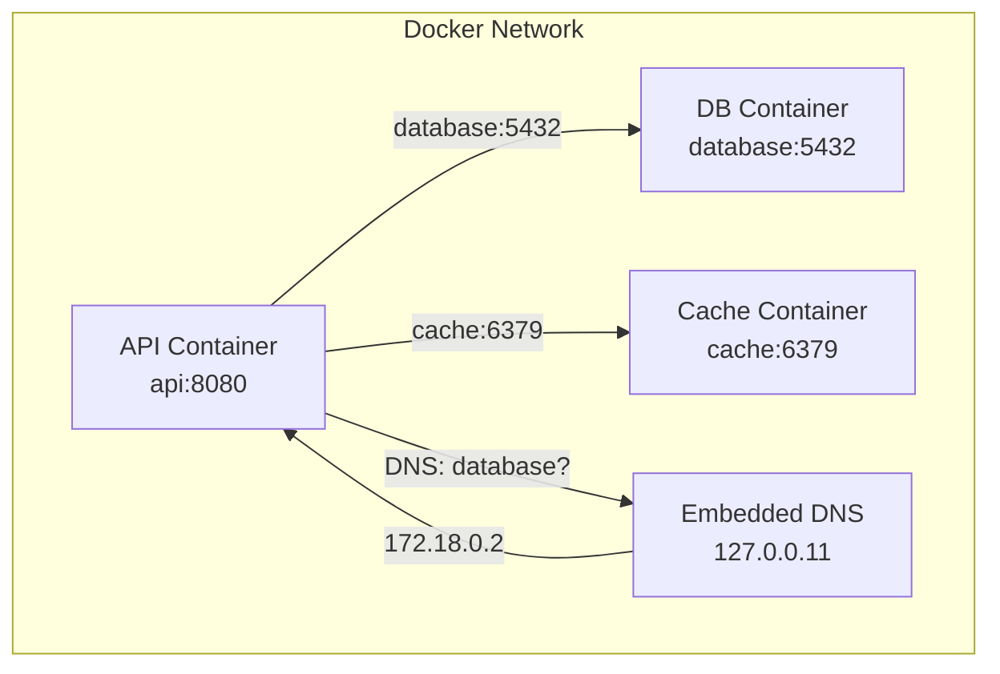
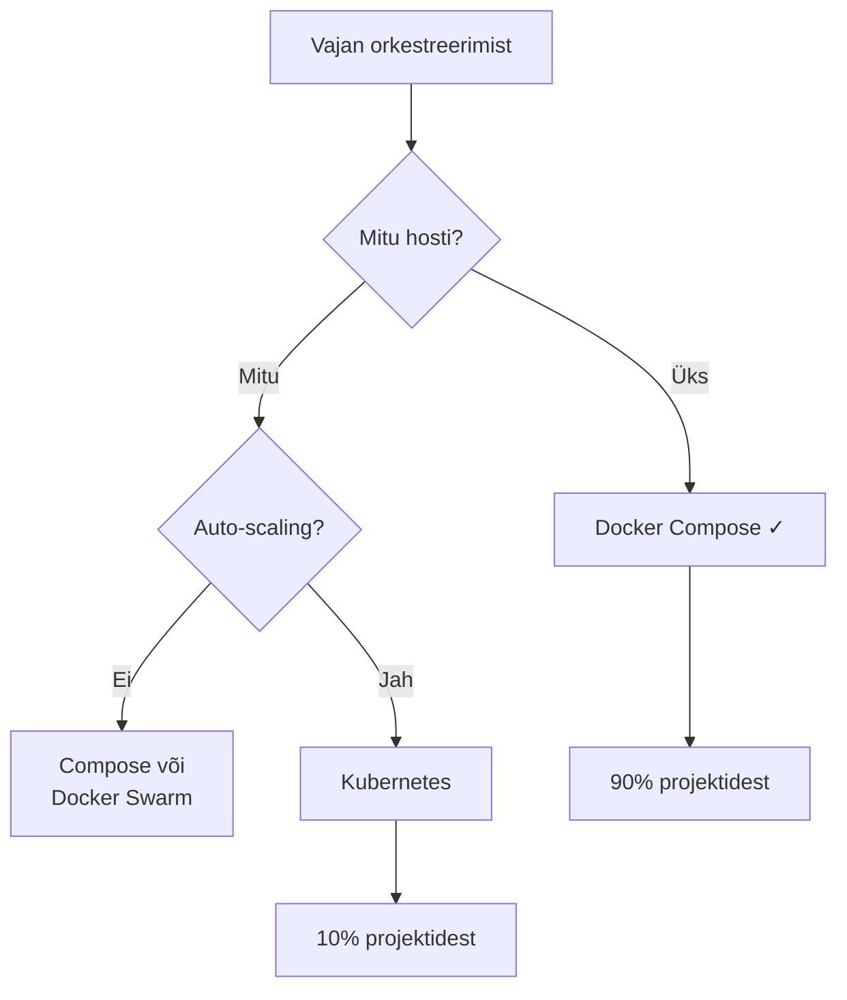

# Docker Compose ja Mitme Konteineri Haldamine

**Eeldused:** Docker fundamentals, container concepts, basic YAML syntax  
**Platvorm:** Docker Engine 20.10+, Docker Compose v2  
**Dokumentatsioon:** [docs.docker.com/compose](https://docs.docker.com/compose/)

## Õpiväljundid

Pärast seda loengut oskate:

- Kirjutada ja käivitada Docker Compose faile
- Ehitada multi-container rakendusi
- Mõista teenuste vahelist suhtlust ja võrgustikku
- Hallata erinevaid keskkondi (development, production)
- Mõista orkestreerimise põhimõtteid ja vajadust

---

Kaasaegne veebirakendus koosneb erinevatest komponentidest: andmebaas hoiab andmeid, API server käsitleb ärilogikat, frontend näitab kasutajaliidest, cache teeb süsteemi kiireks. Igaüks neist töötab eraldi konteineris. See on mikroteenuste arhitektuuri põhiprintsiip - iga komponent on eraldatud, et saaks seda sõltumatult arendada ja skaleerida.

Küsimus: kuidas neid kõiki koos hallata?

## 1. Käsitsi Haldamise Probleem

Sul on kaks komponenti: PostgreSQL andmebaas ja Node.js API server. Käivitad andmebaasi käsuga `docker run -d --name mydb postgres:13`. Aga nüüd API vajab andmebaasi aadressi. Milline see on? Docker genereerib IP dünaamiliselt. Pead käsitsi välja uurima (`docker inspect mydb | grep IPAddress`) ja lisama API käivitamise käsku.

Järgmine päev käivitad uuesti - IP on erinev. Kolleeg proovib projekti käivitada - IP'd on täiesti erinevad. Kui API käivitub enne kui andmebaas on valmis, crashib see. Pead kirjutama bash skripti mis ootab, kontrollib, proovib uuesti.

Kui sul on 5-6 komponenti, muutub see haldamatuks. Iga uus meeskonnaliige kulutab päeva projekti üles seadmisele.



## 2. Docker Compose Lahendus

Compose'i põhiidee: kirjelda kogu süsteem ühes failis. See on deklaratiivne lähenemine - kirjeldad soovitud lõpptulemust, mitte samme sinna jõudmiseks.

Loome faili `docker-compose.yml`. Kirjeldame kaks teenust: "database" kasutab PostgreSQL'i, "api" kasutab meie koodi. Ütleme et API sõltub andmebaasist.

Käivitame: `docker-compose up`. Compose loeb faili ja teeb kõik vajaliku - loob võrgu, käivitab teenused õiges järjekorras, seadistab DNS'i. Kõik automaatselt.

Kõige olulisem: me ei kirjuta IP aadresse. Kirjutame lihtsalt teenuse nime "database" ja Compose ühendab teenused automaatselt. Sisemiselt loob Compose DNS serveri mis lahendab teenuste nimed IP aadressideks.



## 3. Compose Faili Struktuur

Compose fail on YAML formaadis. Struktuur on määratud taandetega - täpselt nagu Python koodis. YAML on inimestele loetavam kui JSON, aga piisavalt struktureeritud et masinad saaksid seda töödelda.

Fail algab versiooniga. Kasuta vähemalt `3.8` - piisavalt uus et kõik kasulikud võimalused oleksid olemas. Vanemad versioonid (2.x, 1.x) on deprecated.

```yaml
version: '3.8'

services:
  database:
    image: postgres:13
    environment:
      POSTGRES_PASSWORD: secret
    volumes:
      - db_data:/var/lib/postgresql/data

  api:
    build: ./api
    ports:
      - "8080:8080"
    depends_on:
      - database
    environment:
      DATABASE_URL: postgresql://database:5432/mydb

volumes:
  db_data:
```

Peamised sektsioonid:

**services** - rakenduse komponendid. Igaüks saab oma konteineri. Kirjeldad millise image'i kasutada, millised pordid avada, millised seaded on vajalikud.

**volumes** - püsivad andmehoidlad. Defineerid siin, siis ühendad teenuste juurde. Võimaldab jagada sama volume'i mitme teenuse vahel.

**networks** - tavaliselt ei vaja. Compose loob automaatselt võrgu kõigile. Custom networks on kasulikud kui tahad isolatsiooni - näiteks frontend ei näe andmebaasi otse.



## 4. Teenused ja Nende Suhtlus

Teenus on rakenduse komponent. Kui mõtled rakendusele kui firmale, on teenused osakonnad - üks vastutab andmete eest, teine äriloogika eest, kolmas kasutajaliidese eest. Iga teenus on isoleeritud ja vastutab ainult oma ülesande eest.

Lihtsaim teenus vajab ainult nime ja image't:

```yaml
services:
  cache:
    image: redis:7
```

Compose tõmbab Redis image'i ja käivitab konteineri. Konteiner on kättesaadav teistele teenustele nimega "cache". Hostname = teenuse nimi, automaatselt.

Tavaliselt vajad rohkem: pordid (kui brauser peab ligi pääsema), keskkonnamuutujad (paroolid, API võtmed), volumes (failide jagamiseks), depends_on (kui teenused sõltuvad üksteisest).

### Service Discovery

Kui käivitad teenused Compose'iga, loob see automaatselt sisemise võrgu. Selles võrgus töötab DNS server mis teab kõigi teenuste nimesid ja IP aadresse. See DNS on Docker Engine osa ja töötab automaatselt - port 127.0.0.11 igas konteineris.

Kui sul on teenus "database", saab iga teine teenus sellega ühenduda kasutades lihtsalt nime "database". Mitte IP'd - lihtsalt nime. Docker lahendab automaatselt õigeks IP'ks.



Praktikas: kui API vajab andmebaasi, kirjutad konfiguratsioonifailis `DATABASE_URL=postgresql://database:5432/mydb`. Pole vaja teada IP'd. Pole vaja muretseda et IP muutub. Töötab isegi kui kustutad konteineri ja teed uue - DNS uuendatakse automaatselt.

DNS töötab ainult Compose võrgu sees. Kui tahad et väljastpoolt (brauser) saaks teenusele ligi, pead pordi avama:

```yaml
ports:
  - "8080:8080"  # host:container
```

## 5. Andmete Püsimine

Konteinerid on ajutised. Kui kustutad konteineri, kaob kõik mis seal oli. See on disain - konteinerid peaksid olema "cattle not pets". Aga andmebaas ei saa olla ajutine. Siin tulevad mängu volumes.

Volume on Docker'i abstrakt andmehoidla - eraldatud konteineri failisüsteemist ja elab kauem kui konteiner. Nagu väline kõvaketas mille saad külge ühendada.

```yaml
services:
  database:
    image: postgres:13
    volumes:
      - db_data:/var/lib/postgresql/data  # volume:container_path

volumes:
  db_data:  # deklareerime volume
```

Kui konteiner kirjutab andmeid volume'i, jäävad need püsivalt. Isegi kui konteiner kustutatakse ja tehakse uus, ühendatakse sama volume uuesti ja andmed on tagasi.

On ka bind mount - ühendab otse hosti kausta:

```yaml
volumes:
  - ./code:/app  # development - koodi muudatused nähtavad kohe
```

Aga bind mount'id on ohtlikud produktsioonis - sõltuvad host'i failisüsteemist.

## 6. Teenuste Järjekord ja Health Checks

API ei saa töötada kui andmebaas pole käivitunud. Määrad `depends_on`:

```yaml
services:
  api:
    depends_on:
      - database
```

Aga depends_on ootab ainult kuni konteiner käivitub, mitte kuni teenus on päriselt valmis. PostgreSQL konteiner käivitub sekundiga, aga PostgreSQL ise võtab 5-10 sekundit. API käivitub ja crashib.

Lahendus on health check:

```yaml
services:
  database:
    image: postgres:13
    healthcheck:
      test: ["CMD-SHELL", "pg_isready -U postgres"]
      interval: 5s
      timeout: 5s
      retries: 5
  
  api:
    depends_on:
      database:
        condition: service_healthy  # oota kuni healthy
```

Compose käivitab `pg_isready` iga 5 sekundi tagant. Kui õnnestub, on teenus "healthy" ja API võib käivituda.

## 7. Keskkonnamuutujad

Konteinerid vajavad seadeid: paroolid, API võtmed, porte. Need antakse keskkonnamuutujate kaudu - 12-factor app metodoloogia.

Ära kirjuta paroole otse YAML faili! Kasuta `.env` faili:

```bash
# .env
DB_PASSWORD=secret123
API_KEY=abc-xyz
```

```yaml
# docker-compose.yml
services:
  database:
    environment:
      POSTGRES_PASSWORD: ${DB_PASSWORD}
```

Compose loeb `.env` automaatselt ja asendab muutujad. Pane `.env` faili `.gitignore`'i! Tee `.env.example` kus on samad muutujad aga placeholder väärtustega.

## 8. Põhilised Käsud

```bash
# Käivita kõik teenused
docker-compose up           # foreground, näed logisid
docker-compose up -d        # detached, taustal

# Vaata mis töötab
docker-compose ps

# Vaata logisid
docker-compose logs         # kõik teenused
docker-compose logs -f api  # ainult API, realtime

# Peata (konteinerid jäävad alles)
docker-compose stop

# Käivita uuesti
docker-compose start

# Kustuta kõik (volumes jäävad!)
docker-compose down

# Kustuta kõik + volumes (ANDMED KAOVAD!)
docker-compose down -v

# Mine konteineri sisse
docker-compose exec api sh

# Valideeri YAML
docker-compose config
```

## 9. Debugging

Kui midagi ei tööta:

```bash
# 1. Kontrolli staatust
docker-compose ps
# Exit 0 = lõpetas edukalt (imelik teenuse puhul)
# Exit 1 = viga

# 2. Vaata logisid
docker-compose logs database
# Otsi: ERROR, FATAL, failed, exception

# 3. Kontrolli võrku
docker-compose exec api ping database
# Ei tööta? DNS probleem

# 4. Kontrolli muutujaid
docker-compose config
# Näitab parsitud faili
```

## 10. Millal Kasutada Compose

Compose on suurepärane väikeste ja keskmiste projektide jaoks. Kui arendad lokaalselt, on Compose ideaalne. Kui sul on üks server, piisab Compose'ist. Enamik startup'e töötavad edukalt ainult Compose'iga.

Compose ei ole loodud suurte jaotatud süsteemide jaoks. Kui vajad mitut serverit, auto-scaling'ut või keerukat failover'i, vaata Kubernetes'e või Docker Swarm'i. Compose töötab ainult ühel host'il.

Aga ausalt - 90% projektidest piisab Compose'ist. Ära mine Kubernetes'e ainult sellepärast et see on "cool". Mine sinna kui sul on päris vajadus. Kubernetes toob kaasa märkimisväärse keerukuse.



## Kokkuvõte

Docker Compose lahendab mitme konteineri haldamise. Kirjeldad rakenduse ühes YAML failis - millised teenused, kuidas nad suhtlevad, millised seaded. Compose hoolitseb ülejäänu eest: loob võrgu, käivitab teenused õiges järjekorras, seadistab DNS'i.

Peamised mõisted: **services** on rakenduse komponendid, **volumes** hoiavad andmeid püsivalt, **networks** võimaldavad suhtlust, **depends_on** määrab järjekorra, **healthcheck** tagab teenuse valmiduse.

Üks YAML fail asendab kümneid `docker run` käske ja bash skripte. Järgmises labs ehitad ise mitme teenusega rakenduse kasutades Compose'i.

---

## Kasulikud Ressursid

**Dokumentatsioon:**
- [Docker Compose Documentation](https://docs.docker.com/compose/)
- [Compose File Reference](https://docs.docker.com/compose/compose-file/)
- [Docker Networking](https://docs.docker.com/network/)

**Tööriistad:**
- **docker-compose config** - valideerib YAML faili
- **ctop** - konteinrite monitoring

**Näited:**
- [Awesome Compose](https://github.com/docker/awesome-compose) - valmis näited erinevate tech stack'idega
