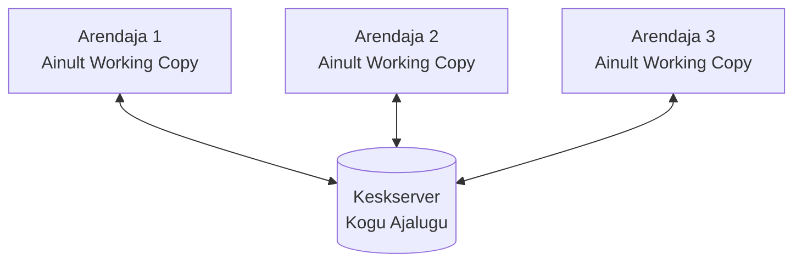
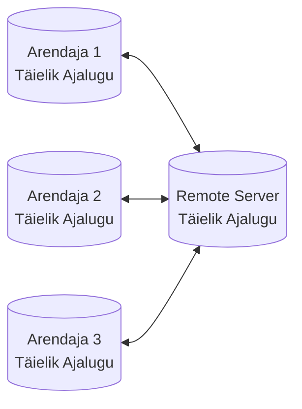
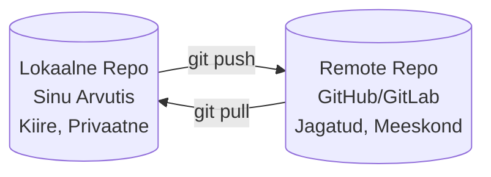
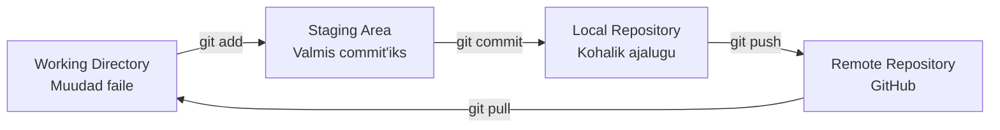
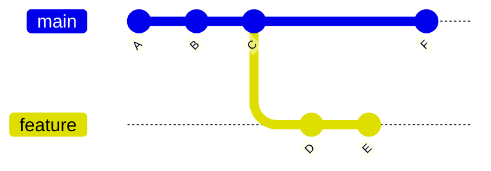
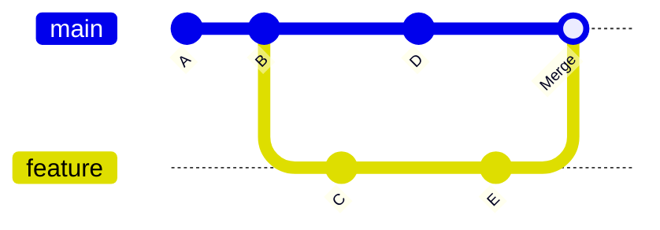

# Git: Versioonihaldus ja Koostöö

**Eeldused:** Baastasemel käsurea kasutamine  
**Platvorm:** Git, GitHub  
**Kestus:** 30min loeng + iseseisvalt 2-3h

---

## Õpiväljundid

Pärast seda moodulit õpilane:

1. **Mõistab** hajutatud versioonihalduse kontseptsiooni ja eeliseid
2. **Selgitab** Git'i sisemist töömehhanismi (working directory, staging area, repository)
3. **Eristab** lokaalseid ja remote repositooriume
4. **Rakendab** põhilist töövooga: pull, branch, add, commit, push, merge
5. **Lahendab** lihtsaid merge konflikte

---

## 1. Mis on Git ja Miks Seda Vaja?

Iga tarkvaraarendaja seisab silmitsi küsimusega: kuidas hallata koodi muutumist ajas? Projektid muutuvad pidevalt, eksperimendid võivad ebaõnnestuda, mitu inimest töötab samaaegselt ja vead peavad olema parandatavad.

Ilma versioonihalduseta lõpeb see kaosega: failid nimetega `projekt_FINAL_v2_TÕESTI_VIIMANE.zip` ja keegi ei tea, milline versioon on õige või kes mida muutis.

Versioonihaldussüsteem on nagu **ajamasin** projektile. See salvestab iga mõistliku muudatuse, võimaldab tagasi minna, näitab kes mida muutis ja laseb mitmel inimesel paralleelselt töötada ilma üksteist segamata. Git on üks (ja kõige populaarsem) versioonihaldussüsteem.

---

## 2. Ajalugu: Tsentraliseeritud vs Hajutatud

### Vanad Süsteemid (1970-2005)

Varajased versioonihaldussüsteemid nagu CVS ja Subversion töötasid tsentraliseeritud mudeli järgi. Kogu projekti ajalugu asus ühes keskserveris. Arendajad ühendusid selle serveriga, et salvestada muudatusi või vaadata ajalugu.



**Probleemid:** Aeglane (iga operatsioon nõudis võrguühendust), võrgusõltuv (ilma internetita ei saanud tööd teha), üks pudelikael (kõik sõltusid ühest serverist) ja katastroofiriski (kui server kaob, kaob ka ajalugu).

### Git - Hajutatud Lähenemine (2005)

Linus Torvalds lõi Git'i 2005. aastal Linux kerneli arendamiseks, kus tuhandeid arendajaid töötavad paralleelselt. Git on **hajutatud** süsteem - iga arendaja omab täielikku koopiat kogu projekti ajaloost oma arvutis. Pole ühtegi "peamist" serverit tehnilises mõttes.



**Eelised:** Välkkiire (kõik operatsioonid lokaalsel kettal), offline töö (commit'id ilma internetita), turvaline (iga koopia on varukoopia) ja paralleelne (tuhandeid arendajaid samaaegselt).

---

## 3. Lokaalne vs Remote

### Lokaalne Repositoorium

**Lokaalne** repositoorium asub sinu arvutis. See sisaldab kogu projekti ajalugu - kõik commit'id, branch'id, muudatused. Kui teed commit'i, salvestatakse see kohalikult, mitte kohe serverisse. See on kiire (kõik kettal), privaatne (keegi teine ei näe) ja töötab ilma internetita.

### Remote Repositoorium

**Remote** repositoorium asub serveris või pilves (GitHub, GitLab, Bitbucket). See on jagatud versioon, mida kogu meeskond kasutab. Organisatsiooniliselt käsitletakse seda "autoriteetse" versioonina.



**Tüüpiline töövoog:** Töötad lokaalsel (teed muudatusi, commit'e), kui valmis siis saadad remote'i (`git push`), teised tõmbavad sinu töö (`git pull`).

---

## 4. Git'i Põhiidee - Neli Kohta

Git'i töövoog liigub läbi nelja tsooni. Iga tsooni mõistmine on võti Git'i tõhusaks kasutamiseks.



### Working Directory

Tavaline kaust sinu arvutis, kus asuvad projekti failid. Siin sa muudad koodi, lisad faile, kustutad faile. Git jälgib, mis on muutunud, aga ei salvesta automaatselt.

### Staging Area

Vahemälu, mis määratleb täpselt, milline sinu järgmine commit olema saab. See on nagu "ostukorv" - paned sinna (`git add`), mis tahad järgmises commit'is olla. Võid muuta 5 faili, aga tahad teha 2 eraldi commit'i: üks bug fix'iks, teine uue feature'iks. Staging area võimaldab valida, mis kummasse commit'i läheb.

### Local Repository

Sinu arvutis olev `.git` kaust, mis sisaldab kogu projekti ajalugu: kõik commit'id, branch'id, muudatused. Kui teed `git commit`, salvestatakse muudatus siia.

### Remote Repository

Server pilves (GitHub, GitLab), kus asub jagatud versioon. Kui teed `git push`, saadetakse lokaalsed commit'id sinna. Kui teed `git pull`, tõmbad sealt teiste töö.

---

## 5. Branch'id - Paralleelsed Tööd

### Mis on Branch?

Branch on **liikuv osuti** commit'ile. Kujuta ette projekti ajalugu kui ahelat commit'e. Branch on märgis, mis osutab ühele commit'ile selles ahelas. Kui teed uue commit'i, liigub see märgis automaatselt edasi. Oluline: branch **ei kopeeri** faile - see on lihtsalt osuti, seega on branch'i loomine välkkiire.



### Miks Branch'e Kasutada?

Kujuta ette, et töötad projekti kallal ja tahad lisada uue feature'i, aga sa pole kindel, kas see töötab. Kui hakkad otse peamises (`main`) branch'is muutma ja midagi läheb katki, on kogu projekt katki. Lahendus: loo uus branch, eksperimenteeri seal. Kui töötab, liiday `main`'iga tagasi. Kui ei tööta, kustutad branch'i ja `main` on puutumatu.

### Merge - Liitmine

Kui oled feature branch'is töö lõpetanud, tahad selle `main`'iga kokku liita. Kahte põhilist viisi:

**Fast-forward merge:** Kui `main` pole muutunud ajal, kui sa feature branch'is töötasid, siis Git lihtsalt liigutab `main` osuti feature branch'i viimasele commit'ile.

**Three-way merge:** Kui `main` on vahepeal edasi liikunud (keegi teine tegi muudatusi), siis Git leiab ühise eellase, võrdleb mõlema branch'i muudatusi ja loob uue merge commit'i.



### Konfliktid

Kui mõlemad branch'id muutsid **sama faili sama osa**, ei tea Git, kumba versiooni eelistada. Tekib **konflikt**, mida inimene peab käsitsi lahendama.

---

## 6. Praktiline Töövoog

### Samm-sammult

**1. Kopeeri projekt:**
```bash
git clone https://github.com/user/projekt.git
cd projekt
```

**2. Too teiste muudatused (ALATI ENNE!):**
```bash
git pull
```

**3. Loo oma branch:**
```bash
git checkout -b feature-login
```

**4. Tee muudatused:**
```bash
# Muuda faile oma redaktoris
```

**5. Vaata, mis muutus:**
```bash
git status
git diff
```

**6. Lisa muudatused staging'u:**
```bash
git add .
```

**7. Tee commit:**
```bash
git commit -m "Lisa kasutaja sisselogimise funktsioon"
```

**8. Saada GitHub'i:**
```bash
git push -u origin feature-login
```

**9. Loo Pull Request (GitHub'is):**
Mine GitHub'i veebilehele → vajuta "Compare & pull request"

**10. Code Review:**
Kolleegid vaatavad koodi üle ja kommenteerivad

**11. Merge:**
Kui kõik OK, keegi vajutab "Merge" nuppu

**12. Kustuta branch:**
```bash
git checkout main
git pull
git branch -d feature-login
```

---

## 7. Konfliktide Lahendamine

### Kunas Tekib?

Konflikt tekib, kui kaks inimest muutsid sama faili sama osa paralleelselt. Git ei tea, kumba versiooni eelistada.

### Kuidas Näeb Välja?

```python
def greeting():
<<<<<<< HEAD
    return "Tere"
=======
    return "Hello"
>>>>>>> feature-branch
```

### Kuidas Lahendada?

1. Ava fail ja vaata mõlemat versiooni
2. Otsusta: kas hoida üks, teine, mõlemad või kombinatsioon
3. Kustuta marker'id (`<<<<<<<`, `=======`, `>>>>>>>`)
4. Salvesta fail

```python
def greeting():
    return "Tere / Hello"
```

5. Lisa ja commit:
```bash
git add app.py
git commit -m "Lahenda konflikt"
git push
```

### Kuidas Vältida?

Sage pull/push (väikesed konfliktid lihtsamad), selge töö jagunemine (ära muuda samu faile paralleelselt) ja väikesed commit'id (aatomilised muudatused).

---

## 8. Parimad Praktikad

### Hea Commit

**Atoomiline:** Teeb üht asja, mitte "täna tehtud töö"  
**Pöörduv:** Saab tagasi võtta ilma midagi rikkumata  
**Mõistetav:** Sõnum selgitab **miks**, mitte mis

**Halb:**
```bash
git commit -m "fix"
```

**Hea:**
```bash
git commit -m "Paranda null pointer error kasutaja sisselogimisel

Kontrollime nüüd email'i olemasolu enne andmebaasi päringut.
Closes #42"
```

### Branch'ide Nimed

Kirjeldavad:
```bash
feature/user-authentication
bugfix/login-error
hotfix/security-patch
```

### Sage Pull/Push

Tee `git pull` enne töö alustamist ja `git push` päeva lõpus (või varem). Nii väldid suuri konflikte.

---

## Kokkuvõte

**Git on hajutatud versioonihaldussüsteem:**
- Iga arendaja omab täielikku ajalugu
- Kiire, turvaline, paralleelne

**Neli kohta:**
- Working Directory → Staging Area → Local Repository → Remote Repository

**Branch'id:**
- Liikuvad osutid commit'ile
- Võimaldavad paralleelset tööd ilma põhiprojekti mõjutamata

**Põhiline töövoog:**
```
pull → branch → muuda → add → commit → push → PR → merge
```