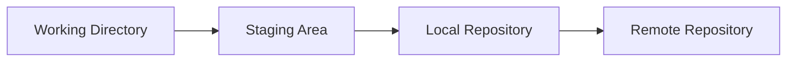

# Git: Versioonihaldus ja Koostöö

**Eeldused:** Baastasemel käsurea kasutamine, tekstitöötluse põhimõtted, failisüsteemi navigeerimine  
**Platvorm:** Git (platform-agnostic), GitHub, GitLab, Bitbucket

## Õpiväljundid

Pärast seda moodulit õpilane:

1. **Mõistab** hajutatud versioonihalduse kontseptsiooni ja selle eeliseid tsentraliseeritud süsteemide ees
2. **Selgitab** Git'i sisemist töömehhanismi läbi working directory, staging area ja repository suhete
3. **Eristab** erinevaid versioonihalduse töövoogusid ja nende sobivust erinevatele meeskondadele
4. **Võrdleb** branching strateegiaid nagu Git Flow, GitHub Flow ja trunk-based development
5. **Rakendab** professionaalseid versioonihalduse tavasid läbi kvaliteetsete commit'ide ja koostöö protokollide

---

## 1. Versioonihalduse Olemus ja Vajadus

Iga tarkvaraarendaja seisab varem või hiljem silmitsi küsimusega: kuidas hallata koodi muutumist ajas? See ei ole pelgalt tehniline probleem, vaid fundamentaalne väljakutse, mis mõjutab kogu arendusprotsessi kvaliteeti ja tulemuslikkust.

Versioonihaldussüsteemide ajalugu ulatub 1970ndatesse, kui tekkisid esimesed SCCS (Source Code Control System) ja RCS (Revision Control System) lahendused. Need varajased süsteemid olid tsentraliseeritud - kogu ajalugu hoiti ühes keskserveris ja arendajad pidid ühenduma selle serveriga iga muudatuse salvestamiseks. Selline arhitektuur oli loomulik ajastul, mil võrguühendused olid aeglased ja arvutite kettamaht piiratud. CVS (Concurrent Versions System) ja hiljem Subversion täiustasid seda lähenemist, kuid põhimõte jäi samaks: üks tõde, üks server, üks pudelikael.

Git esindab fundamentaalset paradigma muutust. Kui Linus Torvalds lõi Git'i 2005. aastal Linux kerneli arenduse jaoks, siis oli põhjuseks vajadus süsteemi järele, mis toetaks tuhandeid paralleelseid arendajaid ilma keskse koordineerimispunktita. Git on hajutatud süsteem (distributed version control system), kus iga arendaja omab täielikku koopiat kogu projekti ajaloost. See tähendab, et iga Git'i repositoorium on võrdväärne - pole "peamist" koopiat tehnilises mõttes, kuigi organisatsiooniliselt võib selline määratlus eksisteerida.

Miks on see oluline? Esiteks, hajutatus tähendab, et versioonihaldus toimub lokaalselt ja on seega välkkiire. Commit'ide tegemine, ajaloo vaatamine, branch'ide loomine - kõik toimub ilma võrguühenduseta. Teiseks, iga arendaja omab täielikku varukoopiат projekti ajaloost, mis tähendab katastroofikindlust. Kolmandaks võimaldab see paralleelset tööd enneolematul skaalal - arendajad saavad töötada päevade või nädalalate kaupa isolatsioonis, eksperimenteerida vabalt ja seejärel oma muudatused integreerida.

Git'i disain lähtub mitmest põhimõttest. Esiteks on see **snapshot-based** süsteem, mitte delta-based. See tähendab, et iga commit salvestab täieliku pildi projekti seisust, mitte ainult muudatusi eelmise versiooni suhtes. Kuigi see võib tunduda raiskav, on tegelikult efektiivne tänu snapshot'ide sarnasuste kompresseerimisele. Teiseks kasutatakse **kryptograafilisi räsisid** (SHA-1, uuemates versioonides SHA-256) iga objekti identifitseerimiseks, mis garanteerib andmete terviklikkuse. Kolmandaks on Git peaaegu eranditult **append-only** - andmeid lisatakse, kuid harva kustutatakse, mis teeb ajaloo muutmise tahtmatult peaaegu võimatuks.

---

## 2. Git'i Andmemudel ja Sisemised Mehhanismid

Git'i mõistmiseks ei piisa käskude pähe õppimisest - on vaja mõista selle sisemist struktuuri. Git ei ole lihtsalt failide salvestamise süsteem, vaid content-addressable filesystem, mille peale on ehitatud versioonihalduse kiht.

Git'i töövoog visualiseerituna:



Git'i südames on neli objekti tüüpi. **Blob** (binary large object) on faili sisu - lihtsalt baidid ilma metaandmeteta. Kaks identsete sisulistega faili salvestatakse Git'is ühe blob'ina. **Tree** on kataloogistruktuuri esitus, mis sisaldab viiteid blob'idele ja teistele tree'dele koos failinimedega. **Commit** on snapshot hetkel koos metaandmetega: autor, kuupäev, sõnum ja viide parent commit'idele. **Tag** on nimega viide kindlale commit'ile, mida kasutatakse versioonide märgistamiseks.

Need objektid salvestatakse `.git/objects/` kataloogi, kus iga objekti nimi tuleneb selle sisu SHA-1 räsist. See on content-addressable süsteemi olemus: sisu määrab aadressi. Kui kaks objekti on identsed, on ka nende räsid identsed, ja Git salvestab nad ainult üks kord. See on üks efektiivsuse allikaid - identne sisu ei dubleerita kunagi.

Working directory on tavaliselt arusaadav: see on kataloog kettale, kus asuvad sinu projekti failid redigeerimiskõlblikul kujul. Repository on `.git` kataloog, mis sisaldab kogu versiooniajalogu. Kuid mis on **staging area** ehk **index**? See on vahepealne seis, mis määratleb, milline sinu järgmine commit täpselt olema saab. Staging area ei ole lihtsalt muudatuste nimekiri - see on täielik snapshot'i prototüüp. Kui teed `git add`, siis salvestatakse faili sisu juba blob'ina objektide andmebaasi ja staging area registreerib viite sellele blob'ile. Commit tegemine on seejärel kiire - lihtsalt tree ja commit objekti loomine.

Miks on staging area vajalik? Ilma selleta oleks iga muudatus kas committimata või committitud - binaarne seis. Staging area võimaldab konstrueerida "loogiliset commit'e" - sa võid muuta viit faili, kuid committida ainult osa neist muudatustest, luues seega commit'id, mis esindavad loogilisi aatomilisi muudatusi, mitte lihtsalt hetkeseisu kõigist poolikutest töödest.

Git'i branch on lihtsalt liigutatav osuti commit'ile. See on kõik. Branch ei ole failide koopia ega eraldi kataloog - see on 40-baidine tekstifail, mis sisaldab SHA-1 räsi. Branch'ide loomine on seega triviaalne operatsioon, mis ei ole seotud projekti suurusega. Käesolev branch määratakse **HEAD** viitega, mis tavaliselt osutab branch'ile, mis omakorda osutab commit'ile. Kui teed uue commit'i, siis liigub käesolev branch automaatselt uuele commit'ile.

Merging on Git'is kaks põhilist strateegiat. **Fast-forward merge** toimub, kui target branch on lihtsalt source branch'i ajaloos - siis liigutatakse osutit edasi ilma uut merge commit'i loomata. **Three-way merge** on vajalik, kui branch'id on divergeerunud. Git leiab ühise eellase (merge base), võrdleb mõlema branch'i muudatusi selle suhtes ja loob uue merge commit'i, millel on kaks parent'it. Kui mõlemad branch'id muutsid sama faili sama osa, tekib **conflict**, mida inimene peab käsitsi lahendama.

---

## 3. Põhilised Töövood ja Käsud

Git'i praktiline kasutamine järgib teatud mustreid, mida on oluline mõista kontseptuaalselt enne üksikute käskude uurimist.

Repositooriumi initsialiseerimine algab kas `git init` käsuga olemasoleva kataloogi jaoks või `git clone` käsuga olemasoleva repositooriumi kopeerimiseks. Init loob `.git` kataloogi minimaalse struktuuriga: config fail, objects ja refs kataloogid, HEAD viide. Clone teeb sama, kuid lisaks tõmbab kõik objektid remote repositooriumist ja seadistab tracking branch'id.

Igapäevane tsükkel koosneb järgmistest sammudest. Esiteks, teed muudatusi failides working directory's. `git status` näitab, mis on muutunud - untracked failid, modified failid, staged muudatused. `git diff` näitab täpseid muudatusi working directory ja staging area vahel, samal ajal kui `git diff --staged` näitab staging area ja viimase commit'i vahelist erinevust.

Kui oled rahul muudatustega, kasutad `git add` nende lisamiks staging area'sse. Oluline mõista, et `git add` ei lisa faili projekti - see lisab faili praeguse sisu järgmise commit'i staging area'sse. Kui muudad faili pärast `git add`, siis need uued muudatused jäävad working directory'sse ja ei kajastu commit'is, välja arvatud juhul, kui teed uuesti `git add`.

Commit'i tegemine `git commit` käsuga võtab staging area sisu ja loob uue commit objekti. Iga commit peaks esindama loogilist muudatust - mitte "päeva lõpu salvestus" ega ka "muutsin üht tühikut". Hea commit on atoomiline (teeb üht asja), pöörduv (selle tagasivõtmine ei riku midagi) ja mõistetav (commit sõnum selgitab miks, mitte mis).

Branch'ide haldamine on Git'i võtmevõimalus. `git branch` loob uue branch'i, kuid ei lülitu sellele. `git checkout branch-name` lülitub branch'ile, muutes HEAD viite ja uuendades working directory vastavalt selle branch'i seisule. `git checkout -b new-branch` kombineerib mõlemad operatsioonid. Uuemates Git versioonides (2.23+) on `git switch` ja `git restore` käsud, mis lahutavad branch'ide vahetamise ja failide taastamise funktsionaalsused.

Merge'imine toimub `git merge` käsuga. Kui oled branch'il A ja teed `git merge B`, siis integreeritud B branch'i muudatused A'sse. Kui merge on fast-forward, pole vaja muud teha. Kui on three-way merge, loob Git automaatselt merge commit'i. Kui tekivad konfliktid, peatab Git protsessi ja märgistab konflikteeruvad failid. Konfliktide lahendamiseks tuleb muuta faile käsitsi, eemaldades conflict marker'id (`<<<<<<<`, `=======`, `>>>>>>>`), ja seejärel lisada lahendatud failid `git add` käsuga ning lõpetada `git commit`.

---

## 4. Remote Repositooriumid ja Koostöö

Git on hajutatud süsteem, kuid praktikas töötavad meeskonnad tavaliselt jagatud remote repositooriumiga, mis toimib koordineerimispunktina. See remote pole tehniliselt "pea" repositoorium, kuid organisatsiooniliselt käsitletakse seda autoriteetse versioonina.

Remote'ide haldamine algab `git remote add` käsuga. Tavalised nimed on `origin` (tavaline nimi clone'itud repositooriumi jaoks) ja `upstream` (kui oled forkinud teise projekti). `git remote -v` näitab kõiki konfigureeritud remote'e koos URL'idega fetch ja push operatsioonide jaoks. Oluline on mõista, et remote on lihtsalt alias URL'i jaoks - see ei ole füüsiline ühendus ega pideva sünkroniseerimise mehhanism.

Fetch vs pull on oluline eristus. `git fetch` tõmbab remote repositooriumist kõik uued commit'id ja branch'id, kuid ei muuda sinu working directory'd ega käesolevat branch'i. See uuendab **remote-tracking branch'e** nagu `origin/main`, mis on lokaalsed esitused remote branch'ide seisust. `git pull` on kombinatsioon: fetch + merge. See tõmbab muudatused ja merge'ib need automaatselt käesolevasse branch'i. Mõned arendajad eelistavad kasutada `git fetch` järgneva `git merge` käsuga, et omada kontroll merge protsessi üle.

Push'imine `git push` käsuga saadab lokaalsed commit'id remote'i. Esimene push vajab `--set-upstream` (või `-u`) lippu, et luua tracking seos lokaali ja remote branch'i vahel: `git push -u origin feature-branch`. Pärast seda piisab lihtsalt `git push`. Kui keegi teine on samas branch'is muudatusi teinud, siis `git push` ebaõnnestub koos sõnumiga "updates were rejected". See on kaitsemehhanism: Git ei lase kunagi kaotada commit'e "peale kirjutades". Lahendus on pull (fetch + merge) teha esmalt, konfliktid lahendada ja seejärel uuesti push'ida.

Autentimine remote'idega toimub kas HTTPS või SSH kaudu. HTTPS kasutab username/password või personal access token'it. GitHub ja teised platvormid on lõpetanud parooli kasutamise toetamise turvakaalutlustel - nüüd nõutakse token'eid. SSH kasutab võtmepaari: private key jääb sinu arvutisse, public key lisatakse GitHubis profiili. SSH seadistamine on ühekordne vaev, kuid pärast seda toimib autentimine sujuvalt ilma paroolide sisestamiseta.

Remote'ide võtmekontseptsioonid hõlmavad ka **tracking branches**. Kui teed `git checkout feature-branch` ja see branch eksisteerib remote'is `origin/feature-branch`, siis Git loob automaatselt tracking branch'i. See tähendab, et `git status` näitab, kui palju commit'e ees või taga oled remote branch'ist. `git push` ja `git pull` teavad automaatselt, millisesse remote branch'i suhelda.

---

## 5. Branching Strateegiad ja Töövood

Branch'id on Git'i kõige võimsam omadus, kuid nende efektiivne kasutamine nõuab organisatsioonlist struktuuri. Erinevad meeskonnad ja projektid on välja töötanud erinevaid branching strateegiaid, millel on igaühel oma kompromissid.

**Git Flow** on üks vanematest ja kõige formaalsemaid strateegiaid. See defineerib range branch'ide hierarhia: `main` branch sisaldab ainult production-ready koodi, `develop` branch on integratsioonipunkt käimasolevaks tööks, `feature` branch'id luuakse `develop`'ist iga uue funktsionaalsuse jaoks, `release` branch'id valmistavad ette release'e ja `hotfix` branch'id parandavad kriitilisi production'i vigu. Git Flow on disainitud pikaajaliste release tsüklitega projektidele, kus tarkvara väljastatakse harvade planeeritud release'idega. Selle puuduseks on kompleksus - palju paralleelseid branch'e ja potentsiaalselt keerulised merge'imised.

**GitHub Flow** on radikaalses lihtsus. On ainult `main` branch ja feature branch'id. Reegel on lihtne: `main` on alati deployitav. Kui alustad uue funktsionaalsuse kallal, lood branch'i `main`'ist, töötad seal, teed pull request'i, keegi vaatab üle ja merge'ib tagasi `main`'i. Iga merge võib ja peaks olema koheselt deployitud. See strateegia sobib meeskondadele, kes praktiseerivad continuous deployment'i ja kellel on tugev automaatne testimine.

**Trunk-Based Development** viib lihtsuse veelgi kaugemale. Arendajad töötavad otse `main` branch'is või lühiealistest feature branch'ides (mõnest tunnist paari päevani). Commit'id merge'itakse `main`'i väga sageli. Täielikult realiseeritud trunk-based development nõuab feature flag'e, et pooleliolevaid funktsioone production'is peita, ja väga kõrget automaatse testimise taseme, et tagada `main` stabiilsus.

Pull request'id (või merge request'id GitLab'is) on koodi ülevaatuse ja diskussiooni mehhanism. PR ei ole Git'i osa - see on GitHub'i, GitLab'i jt platvormide lisafunktsioon. PR mudel on järgmine: lood branch'i, teed muudatused, push'id remote'i, lood PR'i web UI kaudu, kolleegid vaatavad koodi, kommenteerivad, sa teed täiendavaid commit'e vastuseks tagasisidele, lõpuks keegi approve'ib ja merge'ib.

Code review on oluline kvaliteedikontroll. Hea code review ei ole lihtsalt vigade leidmine - see on teadmiste jagamine, arhitektuuri järjepidevuse tagamine ja meeskonna koodistandardite jõustamine. PR'ides peaks vastama küsimustele: kas kood teeb seda, mida väidab? Kas see on loetav? Kas see järgib projekti konventsioone? Kas testid on piisavad? Kas on edge case'e, mida ei käsitleta?

---

## 6. Konfliktide Lahendamine ja Ajaloo Manipuleerimine

Merge konfliktid on paratamatu osa koostööst. Git märgib konflikti siis, kui sama faili sama osa on muudetud kahes erinevas branch'is paralleelselt. Konflikti marker'id näevad välja nii:

```
<<<<<<< HEAD
Sinu versioon
=======
Teise versioon
>>>>>>> feature-branch
```

Konfliktide lahendamine nõuab inimese otsustust: kas hoida üks versioon, teine versioon, mõlemad, kumbki ega kombinatsioon? Pärast marker'ite eemaldamist ja faili salvestamist tuleb `git add` teha ja merge lõpetada `git commit`.

Enamiku konfliktide vältimiseks on mõned strateegiad: sage pull'imine ja push'imine (et konfliktid jääksid väikeseks), selge töö jagunemine (et mitte muuta samu faile paralleelselt), väikesed atomic commit'id (et konflikte oleks lihtsam lahendada).

Ajaloo manipuleerimise käsud on võimsad ja ohtlikud. `git rebase` on alternatiiv merge'ile: see "kordab" commit'e ühe branch'i peale teise. Erinevalt merge'ist, mis loob merge commit'i, rebase kirjutab ajaloo ümber nii, nagu su branch oleks kogu aeg põhinenud target branch'i uusimaist seisust. Reegleid rebase'imiseks: ära tee rebase'i avalikus branch'is (mida teised kasutavad), kasuta ainult lokaalse ajaloo puhastamiseks.

`git reset` liigutab branch'i osutit tagasi, tühistades commit'e. On kolm režiimi: `--soft` (säilitab muudatused staging area's), `--mixed` (vaikimisi, säilitab muudatused working directory's) ja `--hard` (kustutab muudatused täielikult). `git reset --hard` on ohtlik - see on üks väheseid käske, millega saab andmeid kaotada.

`git revert` on ohutum alternatiiv - see loob uue commit'i, mis tühistab eelmise commit'i muudatused. See ei muuda ajalugu, mis tähendab, et see on ohutu kasutada avalikes branch'ides.

---

## 7. .gitignore ja Repositooriumide Hügieen

Mida peaks versioonihaldusesse panema ja mida mitte? See ei ole triviaalne küsimus. Üldine põhimõte on: versioonihalduses peaks olema **source code** ja **configuration** (mis määratleb, kuidas projekti buildida ja käivitada), kuid **mitte generated files** (mis saab luua source code'ist) ega **secrets** (paroolid, API võtmed).

`.gitignore` fail loetakse iga `git add` operatsiooni ajal. Iga rida defineerib mustri: `*.log` ignoreerib kõiki `.log` laiendiga faile, `/build` ignoreerib root level `build` kataloogi, `node_modules/` ignoreerib `node_modules` kataloogi kõikjal. Tärniga `!` saab teha erandeid: `*.log` järgneb `!important.log` ignoreerib kõiki loge, välja arvatud `important.log`.

Tüüpilised .gitignore mustrid keele kaupa:

**Python:**
```gitignore
__pycache__/
*.py[cod]
*$py.class
.venv/
venv/
ENV/
.env
*.so
.pytest_cache/
```

**Node.js:**
```gitignore
node_modules/
npm-debug.log
.env
dist/
build/
```

**Java:**
```gitignore
*.class
target/
.gradle/
build/
```

IDE ja OS spetsiifilised failid peaks samuti ignoreerima: `.vscode/`, `.idea/`, `.DS_Store`, `Thumbs.db`. Mõned meeskonnad includivad IDE seaded versioonihalduses, et jagada konfiguratsioone, kuid see on kontroversialne - eelistused erinevad.

Secrets ja krediide ei tohi kunagi versioonihaldusesse jõuda. Kui need on juba committitud, ei piisa nende kustutamisest - nad jäävad ajalukku. Secrets'i eemaldamiseks ajaloost on vaja `git filter-branch` või spetsialiseeritud tööriista nagu BFG Repo-Cleaner. Parim praktika on kasutada keskkonna muutujaid ja `.env` faile, mis on lisatud `.gitignore`'sse.

Suurte failide probleem: Git ei ole disainitud suurte binaarfailide jaoks (videod, andmekogumid, builded binaarid). Iga muudatus loob uue blob'i ja repositoorium kasvab kiiresti. Lahendus on Git LFS (Large File Storage), mis salvestab suured failid eraldi ja hoiab repositooriumis ainult osuteid.

---

## 8. GitHub ja Platvormispetsiifilised Funktsioonid

GitHub on rohkem kui Git repositooriumide hosting. See on platvorm kogu arenduse lifecycle'i jaoks.

**Issues** on ülesannete haldamise süsteem. Issue võib olla bug report, feature request, küsimus või ülesanne. Issues'id saab märgistada label'itega (bug, enhancement, documentation), määrata assignee'sid, siduda milestone'idega. Issues'te sulgemine saab toimuda automaatselt commit'ides märkusega "Fixes #123".

**Projects** on Kanban-stiilis töölaudad, mis organiseerivad issues'id ja pull request'eid. Projects võivad olla repository-põhised või organisatsiooni-põhised, sidudes mitut repositooriumi.

**Actions** on CI/CD platvorm, mis töötab YAML workflow failide põhjal. Workflow saab käivitada push'ide, pull request'ide, schedule'ite või webhook'ide peale. Actions'id võivad buildida koodi, jooksutada teste, deployida rakendusi, publitseerida pakette. See kõik toimub "runner'ites" - virtuaalmasinates, mida GitHub hostib või mida saab ise hostida.

**GitHub Pages** võimaldab hostida staatilisi veebilehti otse repositooriumist. See on populaarne dokumentatsiooni, projektide lehekülgede ja isiklike portfooliode jaoks. Pages saab buildida Jekyll'i või muu static site generator'iga Actions'ide kaudu.

**Wikis** pakub dokumentatsiooni ruumi otse repositooriumi juures. Wiki on ise Git repositoorium ja saab clone'ida, muuta lokaalselt ja push'ida tagasi.

**Security features** hõlmavad Dependabot'i (dependency update'id ja turva hoiatused), code scanning'i (leiab turvaauke koodis) ja secret scanning'i (leiab kogemata committitud API võtmeid).

GitLab ja Bitbucket pakuvad sarnaseid funktsioone oma variatsioonidega. GitLab'i eripäraks on integreeritud CI/CD (GitLab Runner) ja DevOps lifecycle'i fookus. Bitbucket integreerib tugevalt Atlassiani tööriistadega nagu Jira.

---

## 9. Parimad Praktikad ja Professionaalsed Standardid

Commit'ide kvaliteet eristab professionaalseid arendajaid algajatest. Hea commit on kolme asja summa: aatomilisus, kirjeldav sõnum ja loogiline kooskõla.

**Aatomilisus** tähendab, et commit teeb üht asja. Mitte "täna tehtud töö" ega "fix", vaid "Lisa kasutaja autentimise validatsioon" või "Paranda null pointer error user service'is". Aatomiline commit on reviewitav (saab kiiresti hinnata, mis muutus), pööratav (saab tagasi võtta, kui osutub halvaks) ja debugitav (saab binary search'iga leida, millal bug ilmus).

**Commit sõnumid** järgivad konventsiooni. Esimene rida (subject line) on imperatiivne lühikokkuvõte (50 tähemärki): "Add user authentication", mitte "Added" ega "Adds". Tühi rida. Body selgitab **miks**, mitte **mis** (mis on nähtav diff'ist): miks oli see muudatus vajalik? Mis probleemi see lahendab? Kas on kasulikke kontekste või trade-off'e?

Näide professionaalsest commit sõnumist:

```
Add rate limiting to API endpoints

Implemented token bucket algorithm to prevent API abuse.
Limits: 100 requests/hour for unauthenticated, 1000 for
authenticated users.

This addresses the recent incidents where scrapers were
overloading the database. Alternative considered was
leaky bucket, but token bucket provides better burst
handling for legitimate mobile clients.

Closes #234
```

**Branching nimede konventsioonid** aitavad organiseerida tööd: `feature/user-auth`, `bugfix/null-pointer-fix`, `hotfix/security-patch`, `refactor/database-layer`. Mõned meeskonnad kaasavad issue numbrid: `feature/123-user-auth`.

**Code review'de standardid** peaksid olema projekti README või CONTRIBUTING failis. Mis on oodatud review ajaks? Kui palju approve'e vajab PR? Kas on automaatsed nõuded (tests must pass, no merge conflicts)? Hea praktika on "approve with comments" - väikesed nit'id ei peaks blokeerima merge'i, kui põhiline arhitektuur on korras.

**Pre-commit hook'id** võivad automatiseerida standardeid. Git hook'id on skriptid, mis käivituvad enne või pärast Git operatsioone. Pre-commit hook saab jooksutada linter'id, formatter'id, testid. Kui hook ebaõnnestub, commit tühistatakse. Kuid hook'id on lokaalsed - nad ei liigu clone'iga. Meeskonnad kasutavad tööriistasid nagu `pre-commit` (Python) või `husky` (Node.js), et jagada hook konfiguratsiooni.

---

## 10. Edasijõudnud Kontseptsioonid ja Tõrkeotsing

Git'i sügavam mõistmine avab ukse keerulisemate probleemide lahendamisele.

**Reflog** on lokaalse ajaloo päästja. Isegi kui teed `git reset --hard` ja arvad, et commit'id on kadunud, on nad tegelikult olemas - HEAD liigutused logitakse reflog'i. `git reflog` näitab viimaste liigutuste ajalugu ja `git reset --hard HEAD@{2}` taastab seisu kahe liigutuse tagasi.

**Bisect** on binary search tööriist vigade leidmiseks. Kui tead, et versioon A oli hea ja versioon B on halb, kuid ei tea, kus vahepeal bug tekkis: `git bisect start`, `git bisect bad` (märgi praegune versioon halvaks), `git checkout <good-commit>`, `git bisect good` (märgi see heaks). Git hüppab keskele, sa testid, märgid kas good või bad, ja protsess jätkub kuni leiad täpse commit'i, kus bug ilmus.

**Cherry-pick** võtab commit'i ühest branch'ist ja rakendab teise. See on kasulik, kui vajad spetsiifilist fix'i, kuid ei taha merge'ida kogu branch'i. Kuid cherry-picking loob uue commit'i teise SHA'ga - see on sisuliselt copy, mitte move.

**Submodules** võimaldavad hoida üht Git repositooriumi teise sees. See on kasulik dependency management'iks või kui on jagatud komponendid mitme projekti vahel. Kuid submodule'id on keerulised - nad säilitavad spetsiifilise commit SHA ja nõuavad explicit update'i, kui parent repo soovib uuemat versiooni.

**Subtree** on alternatiiv submodule'idele, kus subrepo sisu kopeeritakse parent repo'sse. See on lihtsam kasutada, kuid vähem selge eraldatus.

**Worktrees** võimaldavad mitut working directory'd sama repositooriumi jaoks. Kasulik, kui tahad vaadata kahte branch'i korraga või jooksutada teste paralleelselt.

Tavalised vead ja nende lahendused:

**"Detached HEAD"** tekib, kui check'id otse commit'i, mitte branch'i. Kui teed selles seisus commit'e, on nad "kadunud" kui check'id branch'i tagasi (kuid leitavad reflog'iga). Lahendus: loo branch detached HEAD'is (`git checkout -b rescue-branch`).

**"Everything is a merge conflict"** juhtub sageli rebasing'i või cherry-picking'i ajal. Kui konfliktid on vastuvõetamatud, on `git rebase --abort` või `git cherry-pick --abort` abiks, tagastades eelmise seisu.

**"I committed secrets"** nõuab history rewriting'i. `git filter-branch` või BFG Repo-Cleaner saavad eemaldada faile kogu ajaloost. Kuid kui oled juba push'inud, on repo compromised ja secrets tuleb roteerida (asendada uutega).