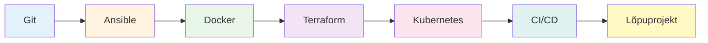

# DevOps Automatiseerimine

<p style="font-size: 1.2em; color: #666;">
Praktiline kursus DevOps tööriistadest ja automatiseerimisest.<br>
<strong>65 tundi • 11 moodulit • 100% hands-on</strong>
</p>

!!! tip "💡 Kursuse fookus"
    Õpi automatiseerima infrastruktuuri ja deployment protsesse praktiliste projektidega. Iga moodul sisaldab loengut, labori harjutusi ja kodutööd.

---

## Moodulid

| # | Teema | Kestus | Sisu |
|---|-------|--------|------|
| 1 | **Git Versioonihaldus** | 5.5h | Branches, merge, GitHub workflow → [Alusta](git/loeng.md) |
| 2 | **Ansible Alused** | 5.5h | Playbooks, inventory, modules → [Loeng](ansible_basics/loeng.md) |
| 3 | **Docker Alused** | 5.5h | Containers, Dockerfile, images → [Loeng](docker_basics/loeng.md) |
| 4 | **Docker Orkestratsioon** | 5.5h | Docker Compose, networks → [Loeng](docker_orchestration/loeng.md) |
| 5 | **Ansible Edasijõudnud** | 5.5h | Vault, templates, optimization → [Loeng](ansible_advanced/loeng.md) |
| 6 | **Ansible Rollid** | 5.5h | Reusable playbooks, Galaxy → [Loeng](ansible_roles/loeng.md) |
| 7 | **Terraform Alused** | 5.5h | IaC, HCL, state management → [Loeng](terraform_basics/loeng.md) |
| 8 | **Terraform Edasijõudnud** | 5.5h | Cloud resources, workspaces → [Loeng](terraform_advanced/loeng.md) |
| 9 | **Kubernetes** | 5.5h | Pods, deployments, services → [Loeng](kubernetes/loeng.md) |
| 10 | **CI/CD** | 5.5h | Pipelines, testing, deployment → [Loeng](ci_cd/loeng.md) |
| 11 | **Lõpuprojekt** | 10h | Integreeri 2-3 tööriista → [Ülesanne](lopuprojekt/loeng.md) |

---

## Mida õpid?



---

## Iga mooduli struktuur

| Osa | Kirjeldus | Aeg |
|-----|-----------|-----|
| **Loeng** | Teooria, kontseptsioonid, näited | ~45 min |
| **Labor** | Praktilised harjutused, step-by-step | 3 x 45 min |
| **Kodutöö** | Iseseisev töö, GitHub Actions check | ~1.5h |
| **Lisapraktika** | Boonus ülesanded (valikuline) | - |

---

## Hindamine

| Komponent | Kaal | Kirjeldus |
|-----------|------|-----------|
| Praktilised tööd | 50% | Labor + Kodutöö |
| Lõpuprojekt | 40% | 2-3 tööriista integratsioon |
| Portfoolio | 10% | GitHub repositoorium |

**Hinded:** "3" (töötab) • "4" (best practices) • "5" (professionaalne)

---

## Kuidas alustada?

1. **Clone repositoorium**
   ```bash
   git clone https://github.com/mtalvik/automatiseerimine_ext.git
   ```

2. **Alusta Gitist**  
   [Git põhitõed](git/loeng.md) → [Labor](git/labor.md) → [Kodutöö](git/kodutoo.md)

3. **Jätka järgmiste moodulitega**  
   Järgi tabelis toodud järjekorda

---

## 🚀 Valmis alustama?

Vali moodul ja ava loeng või hüppa otse [Git põhitõed](git/loeng.md) juurde!
