# Kubernetes Multi-Node Klaster

**Eeldused:** kubernetes-labor.md läbitud, Linux CLI, SSH, võrgunduse alused

**Platvorm:** 3× Proxmox VM (Ubuntu 22.04), k3s

**Aeg:** 2-3 tundi

## Õpiväljundid

- Ehitad 3-node Kubernetes klasteri (1 master + 2 worker)
- Mõistad High Availability põhimõtteid
- Haldad node'ide ressursse (taints, affinity)
- Jälgid klasteri tervist
- Debugid multi-node probleeme

---

## Sissejuhatus: Miks Multi-Node?

### Single-Node vs Multi-Node

**Single-node (labor.md):**
```
┌─────────────────────────┐
│   VM1 (kõik ühes)      │
│  ┌──────────────────┐  │
│  │ Control Plane    │  │
│  │ + Worker         │  │
│  │ Pod Pod Pod      │  │
│  └──────────────────┘  │
└─────────────────────────┘
    ↓ Kui kukub
   💥 KÕIK KATKI
```

**Multi-node (production):**
```
┌─────────────┐  ┌─────────────┐  ┌─────────────┐
│ VM1 Master  │  │ VM2 Worker  │  │ VM3 Worker  │
│ ┌─────────┐ │  │ ┌─────────┐ │  │ ┌─────────┐ │
│ │ Control │ │  │ │ Pod Pod │ │  │ │ Pod Pod │ │
│ │  Plane  │ │  │ │ Pod Pod │ │  │ │ Pod Pod │ │
│ └─────────┘ │  │ └─────────┘ │  │ └─────────┘ │
└─────────────┘  └─────────────┘  └─────────────┘
       ↓ Kui VM2 kukub
    VM3 võtab üle! ✅
```

### Eelised

| Aspekt | Single-Node | Multi-Node |
|--------|-------------|------------|
| **HA** | Ei ole - kui kukub, kõik katki | Jah - teised node'd võtavad üle |
| **Koormus** | Kõik ühes masinas | Jaotatud mitmele |
| **Skaleeritavus** | Piiratud VM ressurssidega | Lisa uus node = rohkem ressursse |
| **Testimine** | Ei saa testida node failure | Saad testida päris HA |
| **Tootmiskõlblikkus** | Ainult dev/test | Production-ready |

### Arhitektuur


**Komponendid:**

**Control Plane (master node):**
- **API Server** - klastri "aju", kõik käsud lähevad siia
- **etcd** - distributed database, hoiab kogu state'i
- **Scheduler** - otsustab millisesse node'i Pod läheb
- **Controller Manager** - jälgib ja parandab (self-healing)

**Worker Node:**
- **kubelet** - node agent, käivitab Pod'e
- **kube-proxy** - võrgundus, suunab liiklust
- **Container Runtime** - Docker/containerd

---

## 1. Klasteri Setup (30 min)

### 1.1 VM'id

Eeldus: õpetaja on loonud 3 VM'd Proxmox'is.

```bash
# Kontrolli VM'id
# VM1: 10.82.1.30 (master)
# VM2: 10.82.1.31 (worker1)
# VM3: 10.82.1.32 (worker2)

# Test connectivity
ping -c 3 10.82.1.30
ping -c 3 10.82.1.31
ping -c 3 10.82.1.32
```

**Võrgu nõuded:**
- Kõik VM'd peavad nägema üksteist
- Port 6443 (API server) peab olema avatud
- Ports 10250-10255 (kubelet, metrics)

### 1.2 Master Node Setup

```bash
# ===== VM1 (MASTER) =====
ssh student@10.82.1.30

# Update süsteem
sudo apt update && sudo apt upgrade -y

# Installi k3s master
curl -sfL https://get.k3s.io | sh -

# Kontrolli
sudo systemctl status k3s
# Active: active (running)

# Setup kubectl
mkdir -p ~/.kube
sudo cp /etc/rancher/k3s/k3s.yaml ~/.kube/config
sudo chown $USER:$USER ~/.kube/config
chmod 600 ~/.kube/config

# Test
kubectl get nodes
# NAME   STATUS   ROLES                  AGE   VERSION
# vm1    Ready    control-plane,master   1m    v1.28.x+k3s1
```

**Mis toimus:**
1. k3s installer laadis binary'd
2. Lõi systemd service
3. Käivitas control plane komponendid
4. Lõi kubeconfig faili

**Võta TOKEN (KRIITILINE!):**
```bash
sudo cat /var/lib/rancher/k3s/server/node-token
```

Output näeb välja umbes selline:
```
K107a3b9c8d2e4f5a6b7c8d9e0f1a2b3c4d5e6f7a8b9c0d1e2f3a4b5c6d7e8f9::server:a1b2c3d4e5f6
```

**KOPEERI SEE!** Vajad worker node'ide liitmiseks.

**Token selgitus:**
- Token on salajane võti
- Tõestab et worker on usaldusväärne
- Ilma õige token'ita ei saa liituda
- Ära pane Git'i! (salajane)

### 1.3 Worker Node 1 Setup

```bash
# ===== VM2 (WORKER1) =====
ssh student@10.82.1.31

# Update
sudo apt update && sudo apt upgrade -y

# Installi k3s worker (asenda TOKEN!)
export K3S_URL="https://10.82.1.30:6443"
export K3S_TOKEN="K107a3b9c8d2e4f5a6b7c8d9e0f1a2b3c4d5e6f7a8b9c0d1e2f3a4b5c6d7e8f9::server:a1b2c3d4e5f6"

curl -sfL https://get.k3s.io | sh -

# Kontrolli
sudo systemctl status k3s-agent
# Active: active (running)
```

**Mis toimus:**
1. k3s installer nägi `K3S_URL` ja `K3S_TOKEN`
2. Mõistis et see on worker node
3. Installis k3s-agent (mitte server)
4. Liitus klastriga kasutades token'it

**Worker liitumise protsess:**


### 1.4 Worker Node 2 Setup

```bash
# ===== VM3 (WORKER2) =====
ssh student@10.82.1.32

# Sama protseduur
sudo apt update && sudo apt upgrade -y

export K3S_URL="https://10.82.1.30:6443"
export K3S_TOKEN="K107a3b9c8d2e4f5a6b7c8d9e0f1a2b3c4d5e6f7a8b9c0d1e2f3a4b5c6d7e8f9::server:a1b2c3d4e5f6"

curl -sfL https://get.k3s.io | sh -

sudo systemctl status k3s-agent
```

### 1.5 Kontrolli Klasteri

```bash
# VM1 (MASTER)
kubectl get nodes
```

**Peaks nägema:**
```
NAME   STATUS   ROLES                  AGE   VERSION
vm1    Ready    control-plane,master   10m   v1.28.5+k3s1
vm2    Ready    <none>                 5m    v1.28.5+k3s1
vm3    Ready    <none>                 2m    v1.28.5+k3s1
```

**Detailne info:**
```bash
kubectl get nodes -o wide
```

Output:
```
NAME   STATUS   ROLES     INTERNAL-IP   EXTERNAL-IP   OS-IMAGE
vm1    Ready    master    10.82.1.30    <none>        Ubuntu 22.04
vm2    Ready    <none>    10.82.1.31    <none>        Ubuntu 22.04
vm3    Ready    <none>    10.82.1.32    <none>        Ubuntu 22.04
```

**Validation:**
- [ ] 3 node'i STATUS "Ready"
- [ ] vm1 on ROLES "control-plane,master"
- [ ] vm2, vm3 on ROLES `<none>` (worker'id)
- [ ] INTERNAL-IP klapib VM IP'dega

**Kui node on NotReady:**
```bash
kubectl describe node vm2
# Vaata Conditions sektsiooni

# Worker node'is kontrolli
sudo journalctl -u k3s-agent -f
```

---

## 2. Pod'ide Jaotamine (30 min)

### 2.1 Default Scheduling

Kubernetes Scheduler otsustab kuhu Pod läheb. Default: valib node, kus on kõige rohkem vaba ressursse.

**Deploy test rakendus:**
```bash
# VM1 (master)
kubectl create deployment nginx --image=nginx:alpine --replicas=6

# Vaata kuhu läksid
kubectl get pods -o wide
```

**Output näide:**
```
NAME                     READY   NODE
nginx-7d8f5c9b4d-abc12   1/1     vm2
nginx-7d8f5c9b4d-def34   1/1     vm3
nginx-7d8f5c9b4d-ghi56   1/1     vm2
nginx-7d8f5c9b4d-jkl78   1/1     vm3
nginx-7d8f5c9b4d-mno90   1/1     vm2
nginx-7d8f5c9b4d-pqr12   1/1     vm3
```

**Märka:** Pod'id on vm2 ja vm3'l, MITTE vm1'l!

**Miks?** k3s lisab master node'ile automaatselt **taint**:
```
node-role.kubernetes.io/master:NoSchedule
```

See tähendab: "Ära pane siia tavaliseid Pod'e, see on control plane!"

### 2.2 Node Capacity

**Kontrolli ressursse:**
```bash
kubectl describe node vm2 | grep -A 5 "Allocated resources"
```

Output:
```
Allocated resources:
  Resource           Requests    Limits
  --------           --------    ------
  cpu                550m (27%)  1100m (55%)
  memory             512Mi (25%) 1Gi (50%)
```

**Selgitus:**
- **Requests** - minimum, mida Pod vajab
- **Limits** - maximum, mida Pod võib kasutada
- **%** - kui palju node'i ressurssidest kasutusel

### 2.3 Scheduler Otsused

**Kuidas Scheduler valib node'i:**


**Filtreerimine:**
1. Kas node on Ready?
2. Kas node'il on piisavalt ressursse?
3. Kas node on tainted ja Pod'il tolerationi?
4. Kas node affinity/anti-affinity match?

**Skoreerimine:**
- Eelistatakse node, kus on rohkem vaba
- Load balancing - jaota Pod'id ühtlaselt
- Data locality - sama node kui volume

### 2.4 Harjutus: Skalee ja Jälgi

**Nõuded:**
- [ ] Deploy nginx 12 replikaga
- [ ] Kontrolli jaotust: `kubectl get pods -o wide | grep vm2 | wc -l`
- [ ] Peaks olema ~6 vm2'l, ~6 vm3'l
- [ ] Skalee 3 replikale - vaata mis juhtub

```bash
kubectl create deployment nginx --image=nginx:alpine --replicas=12

# Oota kuni kõik Running
kubectl rollout status deployment/nginx

# Jälgi jaotust
kubectl get pods -o wide | awk '{print $7}' | sort | uniq -c
#   6 vm2
#   6 vm3

# Skalee alla
kubectl scale deployment nginx --replicas=3

# Vaata millised Pod'id kustutatakse
kubectl get pods -o wide -w
```

---

## 3. Node Affinity ja Taints (45 min)

### 3.1 Node Labels

Label'id võimaldavad grupeerida node'id.

**Lisa label'id:**
```bash
# vm2 = SSD disk
kubectl label node vm2 disktype=ssd

# vm3 = HDD disk
kubectl label node vm3 disktype=hdd

# vm2 = production zone
kubectl label node vm2 zone=production

# vm3 = staging zone  
kubectl label node vm3 zone=staging

# Vaata
kubectl get nodes --show-labels
```

### 3.2 Node Selector (lihtne)

**postgres.yaml:**
```yaml
apiVersion: apps/v1
kind: Deployment
metadata:
  name: postgres
spec:
  replicas: 1
  selector:
    matchLabels:
      app: postgres
  template:
    metadata:
      labels:
        app: postgres
    spec:
      nodeSelector:                    # Lihtne viis
        disktype: ssd                  # Ainult SSD node'd (vm2)
      containers:
      - name: postgres
        image: postgres:14-alpine
        env:
        - name: POSTGRES_PASSWORD
          value: "postgres123"
```

```bash
kubectl apply -f postgres.yaml

kubectl get pods -o wide
# postgres-xxx   vm2   <- Alati vm2 (SSD)!
```

### 3.3 Node Affinity (advanced)

**app.yaml:**
```yaml
apiVersion: apps/v1
kind: Deployment
metadata:
  name: webapp
spec:
  replicas: 3
  selector:
    matchLabels:
      app: webapp
  template:
    metadata:
      labels:
        app: webapp
    spec:
      affinity:
        nodeAffinity:
          # "PEAB" olema production zone
          requiredDuringSchedulingIgnoredDuringExecution:
            nodeSelectorTerms:
            - matchExpressions:
              - key: zone
                operator: In
                values:
                - production                # Ainult vm2
          
          # "EELISTAB" SSD'd
          preferredDuringSchedulingIgnoredDuringExecution:
          - weight: 100
            preference:
              matchExpressions:
              - key: disktype
                operator: In
                values:
                - ssd
      containers:
      - name: webapp
        image: nginx:alpine
```

**Required vs Preferred:**
- **Required** - kui ei ole sobivat node'i, Pod jääb Pending
- **Preferred** - proovib, aga kui ei ole, läheb teise

```bash
kubectl apply -f app.yaml

kubectl get pods -o wide
# Kõik 3 on vm2'l (production zone)
```

### 3.4 Pod Anti-Affinity

Taga et Pod'id **EI OLE** samas node'is (high availability).

**ha-app.yaml:**
```yaml
apiVersion: apps/v1
kind: Deployment
metadata:
  name: ha-app
spec:
  replicas: 2
  selector:
    matchLabels:
      app: ha-app
  template:
    metadata:
      labels:
        app: ha-app
    spec:
      affinity:
        podAntiAffinity:
          requiredDuringSchedulingIgnoredDuringExecution:
          - labelSelector:
              matchExpressions:
              - key: app
                operator: In
                values:
                - ha-app
            topologyKey: kubernetes.io/hostname    # Erinevad host'id
      containers:
      - name: app
        image: nginx:alpine
```

```bash
kubectl apply -f ha-app.yaml

kubectl get pods -o wide
# ha-app-xxx   vm2
# ha-app-yyy   vm3   <- ALATI eri node'is!
```

### 3.5 Taints ja Tolerations

**Taint** = "Ära tule siia kui sul pole luba!"

**Lisa taint vm3'le:**
```bash
kubectl taint nodes vm3 special=true:NoSchedule
```

Nüüd Pod'id EI LÄHE vm3'le (kui neil pole tolerationi).

**Deployment koos toleration'iga:**
```yaml
apiVersion: apps/v1
kind: Deployment
metadata:
  name: special-app
spec:
  replicas: 2
  selector:
    matchLabels:
      app: special
  template:
    metadata:
      labels:
        app: special
    spec:
      tolerations:                    # "Mul on luba!"
      - key: special
        operator: Equal
        value: "true"
        effect: NoSchedule
      containers:
      - name: app
        image: nginx:alpine
```

**Taint effect'id:**
- **NoSchedule** - uued Pod'id ei lähe
- **PreferNoSchedule** - proovib vältida, aga võib minna
- **NoExecute** - kustutab olemasolevad Pod'id ka!

**Eemalda taint:**
```bash
kubectl taint nodes vm3 special=true:NoSchedule-
#                                              ^ minus!
```

### 3.6 Harjutus: Database Production Zone

**Nõuded:**
- [ ] Lisa vm2'le label `tier=database`
- [ ] Deploy PostgreSQL 1 replikaga
- [ ] Kasuta nodeSelector: `tier=database`
- [ ] Kontrolli et Pod on vm2'l
- [ ] Skalee 2 replikale - peaks Pending olema! (pole 2. database tier node'i)

```bash
kubectl label node vm2 tier=database

# postgres-deploy.yaml
kubectl apply -f - <<EOF
apiVersion: apps/v1
kind: Deployment
metadata:
  name: postgres
spec:
  replicas: 1
  selector:
    matchLabels:
      app: postgres
  template:
    metadata:
      labels:
        app: postgres
    spec:
      nodeSelector:
        tier: database
      containers:
      - name: postgres
        image: postgres:14-alpine
        env:
        - name: POSTGRES_PASSWORD
          value: "test123"
EOF

kubectl get pods -o wide
# postgres-xxx   vm2

# Skalee 2'le
kubectl scale deployment postgres --replicas=2

kubectl get pods
# postgres-xxx   Running    vm2
# postgres-yyy   Pending    <none>   <- Pole sobivat node'i!

# Vaata miks
kubectl describe pod postgres-yyy | grep -A 5 Events
# 0/3 nodes available: 1 node had untolerated taint, 2 didn't match Pod's node affinity
```

---

## 4. High Availability Testimine (45 min)

### 4.1 Worker Node Failure

**Stsenaarium:** Worker node kukub. Mis juhtub Pod'idega?

**Setup:**
```bash
# Deploy test app
kubectl create deployment test --image=nginx:alpine --replicas=6

kubectl get pods -o wide
# test-xxx   vm2
# test-yyy   vm3
# test-zzz   vm2
# ...
```

**Simuleeeri crash:**
```bash
# VM2 (worker1)
sudo systemctl stop k3s-agent
```

**Jälgi master'ist (VM1):**
```bash
watch kubectl get nodes
```

**Timeline:**

```
0s:   vm2 STATUS Ready -> NotReady
30s:  vm2 NotReady (Kubernetes ootab)
5min: Kubernetes otsustab et vm2 on TÕESTI kadunud
      Pod'id vm2'l -> Terminating
      Uued Pod'id vm3'le -> ContainerCreating
6min: Kõik Pod'id vm3'l Running
```

**Miks nii kaua?** Kubernetes ei taha olla liiga kiire. Võib-olla vm2 tuleb kohe tagasi (võrk katkes 10s). Default timeout on 5 minutit.

**Vaata detaile:**
```bash
kubectl describe node vm2 | grep Conditions -A 10
```

Output:
```
Conditions:
  Type             Status  LastHeartbeatTime
  ----             ------  -----------------
  Ready            Unknown Mon, 03 Nov 2025 10:30:15 +0000
  MemoryPressure   Unknown
  DiskPressure     Unknown
```

**Taasta node:**
```bash
# VM2
sudo systemctl start k3s-agent

# VM1 - vaata
kubectl get nodes
# vm2 Ready!

# Pod'id jäävad vm3'le (ei liigu automaatselt tagasi)
```

### 4.2 Master Node Failure

**HOIATUS:** Master node failure on tõsine! Multi-master setup vajab vähemalt 3 master node'i (etcd quorum).

**Meie labors (1 master):**
```bash
# VM1 (master)
sudo systemctl stop k3s
```

**Mis juhtub:**
- API server katki - ei saa `kubectl` käske teha
- etcd katki - ei salvesta state'i
- Scheduler katki - ei saa uusi Pod'e luua
- **AGA** olemasolevad Pod'id worker'ites jätkavad töötamist!

```bash
# VM2 või VM3 - vaata Pod'e
sudo k3s crictl pods
# Nginx Pod'id töötavad edasi!
```

**Taasta:**
```bash
# VM1
sudo systemctl start k3s

kubectl get nodes
# Kõik Ready
```

### 4.3 Network Partition

**Stsenaarium:** vm2 ja vm3 ei näe üksteist (võrgu probleem).

**Simuleer (advanced):**
```bash
# VM2 - blokeeri vm3
sudo iptables -A INPUT -s 10.82.1.32 -j DROP
sudo iptables -A OUTPUT -d 10.82.1.32 -j DROP
```

**Vaata master'ist:**
```bash
kubectl get nodes
# Mõlemad on Ready (näevad master'it)

# Aga Service load balancing võib failida
```

**Cleanup:**
```bash
# VM2
sudo iptables -F
```

### 4.4 Harjutus: Pod Eviction

**Nõuded:**
- [ ] Deploy test app 6 replikaga
- [ ] Stop vm2 k3s-agent
- [ ] Jälgi kuidas Pod'id liiguvad vm3'le
- [ ] Restart vm2
- [ ] Deploy uus app - vaata et kasutab mõlemat node'i

**Test script:**
```bash
# 1. Deploy
kubectl create deployment eviction-test --image=nginx:alpine --replicas=6

# 2. Jälgi
watch kubectl get pods -o wide

# 3. Teises terminal'is - stop vm2
# (ssh vm2, sudo systemctl stop k3s-agent)

# 4. Oota 5-6 min
# 5. Restart vm2
# 6. Deploy uus
kubectl create deployment new-app --image=nginx:alpine --replicas=4

# 7. Vaata jaotust
kubectl get pods -o wide | awk '{print $7}' | sort | uniq -c
```

**Validation:**
- [ ] Pod'id liikusid pärast 5-6 min
- [ ] Uus deployment kasutab mõlemat node'i
- [ ] Vanad Pod'id jäid vm3'le

---

## 5. Monitooring ja Debugging (30 min)

### 5.1 Node Health

**Kontrolli node'ide tervist:**
```bash
kubectl get nodes -o wide

kubectl describe node vm2 | grep -A 20 Conditions
```

**Conditions:**
- **Ready** - kas kubelet vastab
- **MemoryPressure** - kas mälu on täis
- **DiskPressure** - kas disk on täis
- **PIDPressure** - kas process'e on liiga palju
- **NetworkUnavailable** - kas võrk töötab

### 5.2 Resource Usage

**Install metrics-server:**
```bash
kubectl apply -f https://github.com/kubernetes-sigs/metrics-server/releases/latest/download/components.yaml

# k3s'is:
kubectl apply -f https://github.com/kubernetes-sigs/metrics-server/releases/latest/download/components.yaml

# Oota 2 min
kubectl top nodes
```

Output:
```
NAME   CPU(cores)   CPU%   MEMORY(bytes)   MEMORY%
vm1    245m         12%    1256Mi          31%
vm2    482m         24%    2048Mi          51%
vm3    331m         16%    1512Mi          37%
```

**Pod'ide ressursid:**
```bash
kubectl top pods -A
```

### 5.3 Events

Vaata klastri event'e:
```bash
kubectl get events --sort-by='.lastTimestamp'

# Filter'da Node event'id
kubectl get events --field-selector involvedObject.kind=Node

# Jälgi reaalajas
kubectl get events -w
```

### 5.4 Logs

**Node log'id:**
```bash
# Master (VM1)
sudo journalctl -u k3s -f

# Worker (VM2/VM3)
sudo journalctl -u k3s-agent -f
```

**Levinud probleemid:**

| Probleem | Log'is | Lahendus |
|----------|--------|----------|
| Worker ei saa master'iga ühendust | `connection refused :6443` | Kontrolli network/firewall |
| Token error | `invalid token` | Kontrolli token'i õigsust |
| Certificate error | `x509: certificate` | Kellaajad ei klapi |
| etcd timeout | `etcd request timeout` | Master overloaded |

### 5.5 Troubleshooting Workflow

```mermaid
graph TD
    A[Node NotReady?] --> B{kubectl describe node}
    B --> C{Conditions}
    C -->|MemoryPressure| D[Vabasta mälu]
    C -->|DiskPressure| E[Vabasta disk]
    C -->|Ready=Unknown| F[Kontrolli kubelet]
    
    F --> G{journalctl -u k3s-agent}
    G --> H{Network issue?}
    H -->|Jah| I[ping master<br/>telnet master:6443]
    H -->|Token?| J[Kontrolli token]
```



### 5.6 Harjutus: Node Debugging

**Stsenaarium:** vm3 on NotReady. Debugi!

**Simuleer:**
```bash
# VM3
sudo systemctl stop k3s-agent
```

**Debugi (VM1):**
```bash
# 1. Vaata node status
kubectl get nodes
# vm3 NotReady

# 2. Describe
kubectl describe node vm3 | grep -A 20 Conditions

# 3. Events
kubectl get events --field-selector involvedObject.name=vm3

# 4. SSH vm3 ja vaata log'e
# VM3
sudo journalctl -u k3s-agent | tail -50

# 5. Start service
sudo systemctl start k3s-agent

# 6. Kontrolli
# VM1
kubectl get nodes
# vm3 Ready
```

**Validation:**
- [ ] Tuvastasid probleemi (service stopped)
- [ ] Vaatasid õigeid log'e
- [ ] Lahendasid probleemi
- [ ] Node on Ready

---

## Cleanup

```bash
# Kustuta kõik test deployment'id
kubectl delete deployment nginx test eviction-test new-app ha-app webapp postgres special-app

# Eemalda label'id
kubectl label node vm2 disktype- zone- tier-
kubectl label node vm3 disktype- zone-

# Eemalda taint'id (kui lisasid)
kubectl taint nodes vm3 special-
```

---

## Järgmised Sammud

**Õpitud:**
- ✅ Multi-node klaster setup
- ✅ Pod scheduling ja affinity
- ✅ Node failure handling
- ✅ Taints ja tolerations
- ✅ Monitoring ja debugging

**Jätka:**
1. **Helm** - package manager Kubernetes'ele
2. **Ingress** - HTTP routing ja load balancing
3. **StatefulSets** - stateful rakendused
4. **Persistent Volumes** - püsiv salvestus
5. **Network Policies** - turvalisus

---

## Dokumentatsioon

- [Kubernetes Multi-Node](https://kubernetes.io/docs/setup/production-environment/)
- [k3s Multi-Server](https://docs.k3s.io/architecture#high-availability-with-an-external-db)
- [Node Affinity](https://kubernetes.io/docs/concepts/scheduling-eviction/assign-pod-node/)
- [Taints and Tolerations](https://kubernetes.io/docs/concepts/scheduling-eviction/taint-and-toleration/)

---

**Multi-node klaster on sinu tootmiskeskkonna alus. Edukat õppimist!**