# Kubernetes Labor

**Eeldused:** Docker, Linux CLI, YAML süntaks

**Platvorm:** Proxmox VM (Ubuntu 22.04), k3s

**Aeg:** 3 tundi (3×45 min)

## Õpiväljundid

- Paigaldad k3s Kubernetes klasteri
- Lood ja haldad Pod'e ja Deployment'e
- Eksponeerid rakendusi Service'idega
- Skaaleerid rakendusi
- Debugid probleeme kubectl'iga

---

## Tund 1: k3s Setup + Esimene Pod (45 min)

### 1.1 VM Kontrollimine

Teie õpetaja on loonud Proxmox VM. Logige sisse SSH kaudu.

```bash
# Logige sisse (kasutage oma IP'd)
ssh student@10.82.1.10
# Parool: õpetaja annab

# Kontrollige süsteemi
uname -a
# Linux ubuntu 5.15.0-xxx-generic

cat /etc/os-release | grep VERSION
# Ubuntu 22.04

# Kontrollige võrku
ping -c 3 8.8.8.8
# 3 packets transmitted, 3 received

# Kontrollige Docker'i
docker --version
# Docker version 24.0.x
```

Kui Docker'it pole:
```bash
sudo apt update
sudo apt install -y docker.io
sudo usermod -aG docker $USER
newgrp docker
```

### 1.2 k3s Installimine

k3s on kerge Kubernetes - ideaalne õppimiseks.

**k3s vs Päris Kubernetes Klaster:**

Päris production'is on Kubernetes klaster jaotatud mitmele masinale:
- **Control Plane node'd** (3+ masinat) - "aju", haldab klasteri
- **Worker node'd** (10+ masinat) - "lihased", kus Pod'id töötavad


**Meie labors (k3s):**
- Kõik ühes VM's - Control Plane + Worker sama masin
- Lihtsam õppimiseks, vähem ressursse
- **Loogika on TÄPSELT SAMA** kui päris klaster!

Hiljem (lisa_labor.md) õpid multi-node setupi.

```bash
# Installige k3s (võtab 1-2 min)
curl -sfL https://get.k3s.io | sh -

# Kontrollige
sudo systemctl status k3s
# Active: active (running)

# Seadistage kubectl
sudo mkdir -p ~/.kube
sudo cp /etc/rancher/k3s/k3s.yaml ~/.kube/config
sudo chown $USER:$USER ~/.kube/config
chmod 600 ~/.kube/config

# VÕI kasutage aliast
echo 'alias kubectl="sudo k3s kubectl"' >> ~/.bashrc
source ~/.bashrc

# Kontrollige klasteri
kubectl get nodes
# NAME     STATUS   ROLES                  AGE   VERSION
# ubuntu   Ready    control-plane,master   2m    v1.28.x+k3s1
```

**Validation:**
- [ ] `kubectl get nodes` näitab STATUS "Ready"
- [ ] `kubectl get pods -n kube-system` näitab pod'e Running

### 1.3 Esimene Pod

Loome nginx Pod'i.

**Mis on Pod?**

Pod on Kubernetes'i väikseim ühik. Pod = 1 või mitu konteineri mis töötavad koos. Tavaliselt 1 Pod = 1 konteiner (nagu meie nginx).


**Pod'i elutsükkel:**
1. `ContainerCreating` - tõmbab image'i (10-30s)
2. `Running` - konteiner töötab
3. `Completed` - konteiner lõpetas (exitCode 0)
4. `Error` või `CrashLoopBackOff` - midagi läks valesti

```bash
# Looge kataloog
mkdir ~/k8s-lab
cd ~/k8s-lab

# Looge Pod
kubectl run nginx-test --image=nginx:1.25 --port=80

# Kontrollige
kubectl get pods
# NAME         READY   STATUS    RESTARTS   AGE
# nginx-test   1/1     Running   0          15s
```

STATUS `ContainerCreating` → `Running` võtab 10-30 sekundit.

### 1.4 Pod'i Uurimine

```bash
# Detailne info
kubectl describe pod nginx-test
# Vaadake Events sektsiooni - näitab täpset ajalugu

# Vaadake logi
kubectl logs nginx-test
# nginx käivitamise logid

# Logige sisse
kubectl exec -it nginx-test -- /bin/bash
# Nüüd olete Pod'i sees

root@nginx-test:/# curl localhost
# <!DOCTYPE html>...

root@nginx-test:/# exit
```

### 1.5 YAML Failist Pod

Imperative käsud on head testimiseks, YAML failid on produktsiooniks.

**nginx-pod.yaml:**
```yaml
apiVersion: v1                   # API versioon - põhiressursid kasutavad v1
kind: Pod                        # Ressursi tüüp
metadata:
  name: nginx-yaml               # Nimi (unikaalne namespace'is)
  labels:
    app: nginx                   # Label - võti-väärtus paar (Service leiab selle järgi)
spec:
  containers:                    # Konteinerite list (vähemalt 1)
  - name: nginx
    image: nginx:1.25            # Docker image (registry/repo:tag)
    ports:
    - containerPort: 80          # Dokumenteeriv - ütleb et port 80 kuulatakse
```

**YAML struktuur:**
- `apiVersion: v1` - põhiressursid (Pod, Service), `apps/v1` kõrgemad (Deployment)
- `metadata.labels` - Service ja Deployment kasutavad neid Pod'ide leidmiseks
- `spec.containers` on list - Pod võib olla mitu konteineri (harvem)
- `containerPort` ei ava porti - lihtsalt dokumentatsioon (Service kasutab)

```bash
# Looge Pod
kubectl apply -f nginx-pod.yaml

# Kontrollige
kubectl get pods
# nginx-test    1/1   Running
# nginx-yaml    1/1   Running

# Kustutage mõlemad
kubectl delete pod nginx-test nginx-yaml
```

**Validation:**
- [ ] Pod jõudis STATUS "Running"
- [ ] `kubectl logs` näitas nginx logi
- [ ] `kubectl exec` võimaldas Pod'i sisse logida
- [ ] YAML failist loodud Pod töötab

---

## Tund 2: Deployment + Self-Healing (45 min)

### 2.1 Miks Deployment?

Pod on liiga madal - kui ta kukub, on läinud. Deployment hoiab alati õige arvu Pod'e töös.

**Kuidas Deployment töötab:**

```mermaid
graph TD
    A[Deployment: nginx-deploy] -->|Haldab| B[ReplicaSet]
    B -->|Loob| C[Pod 1: nginx-xxx]
    B -->|Loob| D[Pod 2: nginx-yyy]
    B -->|Loob| E[Pod 3: nginx-zzz]
    
    C -.->|Crashib!| F[X]
    F -->|Deployment märkab| B
    B -->|Loob uue| G[Pod 4: nginx-aaa]
    
    style F fill:#f88,stroke:#f00
    style G fill:#8f8,stroke:#0f0
```



Deployment jälgib pidevalt Pod'e. Kui üks kukub, Deployment näeb kohe et on ainult 2/3 ja loob automaatselt uue. See on nagu "elushoiusüsteem" - hoiab alati õige arvu töös.

**Kolmekihiline arhitektuur:**
- **Deployment** - soovitud olek (replicas: 3)
- **ReplicaSet** - haldab Pod'e (Deployment poolt loodud)
- **Pods** - tegelikud konteinerid (ReplicaSet poolt loodud)

**nginx-deployment.yaml:**
```yaml
apiVersion: apps/v1              # Apps API group - kõrgemad ressursid (Deployment, StatefulSet)
kind: Deployment
metadata:
  name: nginx-deploy
spec:
  replicas: 3                    # Soovitud koopiate arv - Kubernetes tagab selle
  selector:
    matchLabels:
      app: nginx                 # ⚠️ Kuidas leiab oma Pod'e - PEAB klapima template.labels'iga!
  template:                      # Pod'i mall - identne Pod YAML'iga (nested)
    metadata:
      labels:
        app: nginx               # Deployment leiab Pod'e selle järgi
    spec:
      containers:
      - name: nginx
        image: nginx:1.25
        ports:
        - containerPort: 80
        resources:
          requests:              # "Vajan seda" - Scheduler paigutab ainult kui Node'il on vaba
            memory: "32Mi"
            cpu: "50m"           # 50 millicore = 0.05 CPU tuuma
          limits:                # "Rohkem ei tohi" - üle selle tapetakse (OOMKilled)
            memory: "64Mi"
            cpu: "100m"
```

**YAML selgitus:**
- `apps/v1` vs `v1` - kõrgemad ressursid (Deployment) vs põhiressursid (Pod)
- `selector.matchLabels` peab **täpselt** klapima `template.metadata.labels`'iga (levinuim viga!)
- `template` on Pod YAML nested Deployment'i sisse - igast loodud Pod'ist kasutatakse seda malli
- `requests` = minimum (Scheduler), `limits` = maximum (runtime)
- Deployment → ReplicaSet → Pods (kolmekihiline)

```bash
# Looge Deployment
kubectl apply -f nginx-deployment.yaml

# Kontrollige
kubectl get deployments
# NAME           READY   UP-TO-DATE   AVAILABLE   AGE
# nginx-deploy   3/3     3            3           20s

kubectl get pods
# nginx-deploy-xxx   1/1   Running
# nginx-deploy-yyy   1/1   Running
# nginx-deploy-zzz   1/1   Running
```

Deployment lõi automaatselt 3 Pod'i. Pod nimed on `<deployment>-<hash>-<random>`.

### 2.2 Self-Healing

Kubernetes'i võimsaim feature - automaatne taastamine.

```bash
# Kustutage üks Pod
POD=$(kubectl get pods -l app=nginx -o jsonpath='{.items[0].metadata.name}')
kubectl delete pod $POD

# Kontrollige kohe
kubectl get pods
# nginx-deploy-xxx   1/1   Terminating
# nginx-deploy-new   0/1   ContainerCreating  <- UUS!

# 10 sekundi pärast
kubectl get pods
# 3 Pod'i töötab, vana on kadunud, uus asendab
```

Deployment märkas et on ainult 2 Pod'i ja lõi automaatselt uue!

### 2.3 Skaleerimine

```bash
# Skalee 5 koopiaks
kubectl scale deployment nginx-deploy --replicas=5

kubectl get pods
# 5 Pod'i

# Skalee tagasi 2-le
kubectl scale deployment nginx-deploy --replicas=2

kubectl get pods
# 2 Pod'i (3 kustutati)
```

### 2.4 Rolling Update

Uuenda nginx 1.25 → 1.26 ilma downtime'ita.

```bash
# Vaata praegust versiooni
kubectl describe deployment nginx-deploy | grep Image:
# Image: nginx:1.25

# Uuenda
kubectl set image deployment/nginx-deploy nginx=nginx:1.26

# Jälgi
kubectl rollout status deployment/nginx-deploy
# Waiting for deployment rollout...
# deployment successfully rolled out

# Kontrolli
kubectl describe deployment nginx-deploy | grep Image:
# Image: nginx:1.26
```

Rolling update kustutab 1 vana Pod'i, loob 1 uue, ootab valmis, siis järgmine. Zero downtime!

### 2.5 Rollback

```bash
# Vaata ajalugu
kubectl rollout history deployment/nginx-deploy

# Tagasi eelmisele
kubectl rollout undo deployment/nginx-deploy

# Kontrolli
kubectl describe deployment nginx-deploy | grep Image:
# Image: nginx:1.25
```

**Validation:**
- [ ] Deployment lõi 3 Pod'i automaatselt
- [ ] Pod'i kustutamisel tekkis uus (self-healing)
- [ ] Skaleerimine muutis Pod'ide arvu
- [ ] Rolling update töötas
- [ ] Rollback töötas

---

## Tund 3: Service + Lihtne Rakendus (45 min)

### 3.1 Service - Püsiv IP

Pod IP'd muutuvad. Service annab püsiva IP ja DNS nime.

**Kuidas Service töötab:**


Service on **virtuaalne load balancer**:
1. Klient saadab päring'u `nginx-service` (DNS)
2. DNS resolve'ib Service IP'le
3. Service valib ühe Pod'i (round-robin)
4. Päring jõuab Pod'i

**Service vs Pod IP:**
- **Pod IP** muutub iga restart'iga (ei saa usaldada)
- **Service IP** on püsiv (alati sama)
- **DNS nimi** on veel parem (`nginx-service` vs `10.43.123.45`)

**nginx-service.yaml:**
```yaml
apiVersion: v1
kind: Service
metadata:
  name: nginx-service
spec:
  selector:                      # Leiab Pod'e label'ite abil
    app: nginx                   # Kõik Pod'id mis on app=nginx
  ports:
  - port: 80                     # Service port (kuhu kliendid saadavad)
    targetPort: 80               # Pod port (kus nginx kuulab) - võivad olla erinevad!
  type: ClusterIP                # Ainult klastri sees - default, turvaline
```

**YAML selgitus:**
- `selector` leiab Pod'e dünaamiliselt - kui Pod ilmub/kaob, Endpoints uueneb automaatselt
- `port` (Service) vs `targetPort` (Pod) - võivad olla erinevad (nt 8080 → 80)
- `type: ClusterIP` = ainult sisevõrk - Service IP vahemik 10.43.x.x või 10.96.x.x
- DNS: `nginx-service` või `nginx-service.default.svc.cluster.local`
- Endpoints = Pod IP:port list (vaata: `kubectl get endpoints nginx-service`)

```bash
# Looge Service
kubectl apply -f nginx-service.yaml

# Kontrollige
kubectl get services
# NAME            TYPE        CLUSTER-IP      PORT(S)
# nginx-service   ClusterIP   10.43.123.45    80/TCP

# Vaata Endpoints
kubectl get endpoints nginx-service
# ENDPOINTS              AGE
# 10.42.0.5:80,10.42.0.6:80   15s
```

Endpoints on Pod'ide IP'd. Service suunab liikluse nendele.

### 3.2 DNS Test

```bash
# Testi DNS'i
kubectl run test-pod --image=busybox --rm -it --restart=Never -- sh

# Busybox'is:
nslookup nginx-service
# Address: 10.43.123.45

wget -q -O- http://nginx-service
# <!DOCTYPE html>...

exit
```

DNS nimi `nginx-service` töötab! Service IP ei muutu kunagi.

### 3.3 NodePort - Väline Ligipääs

ClusterIP on ainult klastri sees. NodePort avab pordi node'il.

**NodePort liikluse voog:**


**Kolm kihti:**
1. **Node Port (30080)** - väline port, kõigil Node'idel
2. **Service Port (80)** - sisene port, ClusterIP
3. **Pod Port (80)** - konteiner port

**Miks port 30000+?** Linux'is pordid alla 1024 vajavad root õigusi. Kubernetes töötab non-root, seega kasutab kõrgeid porte.

**nginx-nodeport.yaml:**
```yaml
apiVersion: v1
kind: Service
metadata:
  name: nginx-nodeport
spec:
  selector:
    app: nginx
  ports:
  - port: 80                     # Service port (sisene)
    targetPort: 80               # Pod port
    nodePort: 30080              # Node port (30000-32767) - avatud kõigil Node'idel
  type: NodePort                 # Väline ligipääs - liiklus: NodeIP:30080 → ServiceIP:80 → PodIP:80
```

**YAML selgitus:**
- `type: NodePort` = ClusterIP + avab pordi kõigil Node'idel
- `nodePort: 30080` - kui ei määra, Kubernetes valib automaatselt (30000-32767)
- Liikluse voog: `192.168.1.10:30080` (Node) → `10.43.x.x:80` (Service) → `10.42.x.x:80` (Pod)
- Kõik Node'id kuulavad sama porti - HA (kui üks Node kukub, teine töötab)
- Produktsioonis: kasuta Ingress (SSL, hostname routing) või LoadBalancer (cloud)

```bash
# Looge NodePort
kubectl apply -f nginx-nodeport.yaml

# Leia node IP
kubectl get nodes -o wide
# INTERNAL-IP: 10.82.1.10

# Avage brauseris:
# http://10.82.1.10:30080
```

Peaksite nägema nginx welcome lehte!

### 3.4 Lihtne 2-Tier Rakendus

Loome PostgreSQL + test app.

**2-Tier arhitektuur:**


**Kuidas Secret töötab:**
1. Secret luuakse (base64 encoded)
2. Deployment viitab Secret'ile (`valueFrom.secretKeyRef`)
3. Pod käivitamisel Kubernetes seadistab env variable
4. PostgreSQL loeb env variable (`POSTGRES_PASSWORD`)
5. Secret on **ainult** Pod'i mälus, EI OLE failis!

**Turvalisus:** Secret on base64 encoded, MITTE krüpteeritud. Kes saab k8s access, näeb Secret'e. Production'is kasuta Sealed Secrets või Vault.

**postgres.yaml:**
```yaml
apiVersion: v1
kind: Secret                     # Salajased andmed (paroolid, API key'd)
metadata:
  name: postgres-secret
type: Opaque                     # Generic Secret (võti-väärtus paarid)
data:
  password: cGFzc3dvcmQxMjM=     # password123 base64 encoded (echo -n "password123" | base64)
---                              # Kolm ressurssi ühes failis (Secret, Deployment, Service)
apiVersion: apps/v1
kind: Deployment
metadata:
  name: postgres
spec:
  replicas: 1                    # PostgreSQL on stateful - ei saa lihtsalt skaleerida
  selector:
    matchLabels:
      app: postgres
  template:
    metadata:
      labels:
        app: postgres
    spec:
      containers:
      - name: postgres
        image: postgres:14-alpine
        env:                     # Keskkonnamuutujad
        - name: POSTGRES_DB
          value: "testdb"
        - name: POSTGRES_USER
          value: "testuser"
        - name: POSTGRES_PASSWORD
          valueFrom:             # Võta Secret'ist - EI OLE hard-coded YAML'is!
            secretKeyRef:
              name: postgres-secret
              key: password
        ports:
        - containerPort: 5432
        resources:
          requests:
            memory: "128Mi"
            cpu: "100m"
          limits:
            memory: "256Mi"
            cpu: "200m"
---
apiVersion: v1
kind: Service
metadata:
  name: postgres-service
spec:
  selector:
    app: postgres
  ports:
  - port: 5432
    targetPort: 5432
  type: ClusterIP                # Ainult sisevõrk - andmebaas ei tohi olla väljast kättesaadav!
```

**YAML selgitus:**
- `---` eraldab kolme ressurssi ühes failis - luuakse järjekorras
- Secret `data` on base64 encoded (EI OLE krüpteeritud!) - ÄRA pane Git'i
- `valueFrom.secretKeyRef` viitab Secret'ile - parool on Pod'i mälus, mitte YAML'is
- Kui Secret muutub, Pod EI uuenda - pead tegema `kubectl rollout restart`
- `type: ClusterIP` on õige - andmebaas ainult klastri sees, DNS: `postgres-service:5432`

```bash
# Deploy PostgreSQL
kubectl apply -f postgres.yaml

# Kontrolli
kubectl get pods -l app=postgres
# postgres-xxx   1/1   Running

# Test ühendust
kubectl run psql-test --image=postgres:14-alpine --rm -it --restart=Never -- \
  psql -h postgres-service -U testuser -d testdb

# SQL shell'is:
# \l  (näita andmebaase)
# \q  (välja)
```

PostgreSQL töötab! Service DNS `postgres-service` suunas meid õigesse Pod'i.

### 3.5 Cleanup

```bash
# Kustuta kõik
kubectl delete deployment nginx-deploy postgres
kubectl delete service nginx-service nginx-nodeport postgres-service
kubectl delete secret postgres-secret

# Kontrolli
kubectl get all
# Ainult kubernetes Service peaks olema
```

**Validation:**
- [ ] ClusterIP Service loodud
- [ ] DNS nimi `nginx-service` töötas
- [ ] NodePort Service kättesaadav brauserist
- [ ] PostgreSQL käivitus ja Service töötas
- [ ] Saite ühenduda PostgreSQL'iga DNS nime kaudu

---

## Kasulikud Käsud

**Pods:**
```bash
kubectl get pods                    # Kõik Pod'id
kubectl describe pod <POD>          # Detailne info
kubectl logs <POD>                  # Logid
kubectl exec -it <POD> -- sh        # Sisene Pod'i
kubectl delete pod <POD>            # Kustuta
```

**Deployments:**
```bash
kubectl get deployments
kubectl scale deployment <N> --replicas=5
kubectl set image deployment/<N> <CONTAINER>=<IMAGE>
kubectl rollout status deployment/<N>
kubectl rollout undo deployment/<N>
```

**Services:**
```bash
kubectl get services
kubectl get endpoints <SERVICE>
kubectl describe service <SERVICE>
```

**Debugging:**
```bash
kubectl get events                  # Klasteri event'id
kubectl top nodes                   # Node ressursid (kui metrics-server)
kubectl top pods                    # Pod ressursid
```

---

## Troubleshooting

**Pod ei käivitu?**
```bash
kubectl describe pod <POD>
# Vaata Events sektsiooni
```

**Levinud probleemid:**

| Sümptom | Põhjus | Lahendus |
|---------|--------|----------|
| `ImagePullBackOff` | Vale image nimi või tag | Kontrolli `image:` välja, kas typo? |
| `CrashLoopBackOff` | Konteiner crashib kohe | `kubectl logs <pod>` - vaata viga |
| `Pending` | Pole ressursse | `kubectl describe nodes` - CPU/memory full? |
| `CreateContainerConfigError` | ConfigMap/Secret puudub | Kontrolli kas ConfigMap/Secret olemas |
| Service ei tööta | Selector ei klapi | `kubectl get endpoints` - kas tühi? |

**Debug workflow:**


**Image ei tõmba?**
```bash
kubectl get pods
# STATUS = ImagePullBackOff
# Kontrolli image nime ja tag'i
```

**Konteiner crashib?**
```bash
kubectl logs <POD>
# Vaata mis viga
```

**Service ei tööta?**
```bash
kubectl get endpoints <SERVICE>
# Kui tühi, siis selector ei klapi Pod label'idega
```

**Kasulikud debug käsud:**
```bash
# Vaata kõiki resource'e
kubectl get all

# Detailne info resource'i kohta
kubectl describe <TYPE> <NAME>

# Vaata Pod'i sisemust
kubectl exec -it <POD> -- sh

# Vaata klastri event'e
kubectl get events --sort-by='.lastTimestamp'

# Vaata ressursi kasutust
kubectl top nodes
kubectl top pods
```

---

## Dokumentatsioon

- [k3s Documentation](https://docs.k3s.io/)
- [Kubernetes Docs](https://kubernetes.io/docs/home/)
- [kubectl Cheat Sheet](https://kubernetes.io/docs/reference/kubectl/cheatsheet/)

---

**Labor lõppenud!** Järgmine: kodutöö või lisapraktika.