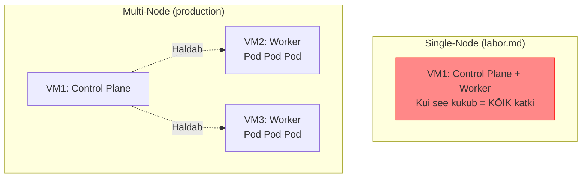
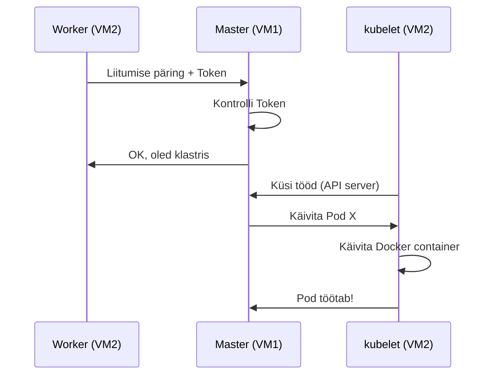

# Kubernetes Lisapraktika

**Eeldused:** Kubernetes labor.md läbitud, e-pood töötab, Minikube seadistatud  
**Platvorm:** Minikube, kubectl CLI

---

Need harjutused täiendavad põhilabi ja lähevad sügavamale Kubernetes kontseptsioonidesse. Kui labor.md tutvustas põhimõisteid, siis siin praktiseerid neid tõsisemates stsenaariumides.

**Eeldus:** Oled teinud labor.md lõpuni ja e-pood töötab (postgres, backend, frontend deployment'id on rakendatud).

**Mida õpid:**

- Labor näitas kuidas deployment luua → Siin õpid seda skaleerima ja load balancing'ut testima
- Labor näitas ConfigMap'e → Siin õpid neid muutma ilma downtime'ita
- Labor näitas probe'sid → Siin õpid neid seadistama ja testima

**Nõuded:**

- Minikube töötab (`minikube status`)
- kubectl installitud ja töötab
- Põhilab e-pood rakendatud (`kubectl get pods` näitab postgres-0, backend-api-xxx, frontend-xxx)

---

## 1. Skaleerimine ja Load Balancing

Labor.md näitas `kubectl scale` käsku põgusalt. Siin õpid skaleerima backend'i mitmeks koopiaks ja testima kuidas Kubernetes Service teeb load balancing'u. Backend skaleeritakse 1 → 5 pod'i ja vaatame kuidas päringud jaotuvad.

Service teeb round-robin load balancing: päring 1 → pod 1, päring 2 → pod 2, jne.

### 1.1 Probleem

Ühe pod'iga backend ei suuda käsitleda suurt päringute hulka. Kui kasutajaid on palju, tekivad latency probleemid või pod crashib high load all. Lahendus on skaleerida mitmeks pod'iks ja lasta Service'l jagada päringuid nende vahel.

### 1.2 Lahendus

Kubernetes Service teeb automaatset load balancing'ut kõigi tervete pod'ide vahel. Kui skaleeriksime backend'i 5 pod'iks, jagab Service päringud ühtlaselt kõigi vahel.
```bash
# Vaata praegust seisu
kubectl get pods -l app=backend

# Skalee 5 koopiaks
kubectl scale deployment backend-api --replicas=5

# Vaata kuidas pod'id luuakse
kubectl get pods -l app=backend -w
# Ctrl+C pärast kui kõik Running

# Kontrolli - peaks olema 5 pod'i
kubectl get pods -l app=backend
```

**Testimine:**

Lisa backend koodi juurde pod hostname, et näha kumba pod'i päring läks.
```bash
# Muuda backend ConfigMap
nano ~/k8s-lab/backend/1-configmap.yaml
```

Lisa `server.js` faili `/api/products` endpoint'i juurde hostname:
```javascript
    // API: kõik tooted
    app.get('/api/products', async (req, res) => {
      try {
        const result = await pool.query('SELECT * FROM products ORDER BY id');
        res.json({ 
          success: true,
          count: result.rows.length,
          pod: process.env.HOSTNAME,  // ← LISA SEE RIDA
          data: result.rows 
        });
      } catch (err) {
        console.error('Database error:', err);
        res.status(500).json({ error: err.message });
      }
    });
```
```bash
# Rakenda muudatus
kubectl apply -f ~/k8s-lab/backend/1-configmap.yaml

# Restart pod'id
kubectl rollout restart deployment backend-api
kubectl rollout status deployment backend-api

# Port forward
kubectl port-forward service/backend-service 3000:3000 &

# Tee 10 päringut ja vaata pod'i nimesid
for i in {1..10}; do
  curl -s http://localhost:3000/api/products | grep -o '"pod":"[^"]*"'
  sleep 0.5
done

kill %1
```

Näed erinevaid pod nimesid - päringud jaotuvad kõigi pod'ide vahel!

### 1.3 Harjutus: Testi Load Balancing'u

**Nõuded:**

- [ ] Backend skaleeritud vähemalt 3 pod'iks
- [ ] Endpoint tagastab pod hostname'i
- [ ] 20 järjestikust päringut näitavad erinevaid pod nimesid
- [ ] Vaata Service endpoints: `kubectl get endpoints backend-service`

**Näpunäiteid:**

- Service hoiab kõigi pod'ide IP'd: `kubectl describe endpoints backend-service`
- Kui pod'id ei käivitu, kontrolli ressursse: `kubectl describe nodes`
- Vähenda replikaid kui VM'il pole piisavalt ressursse

**Testimine:**
```bash
# Kontrolli et Service leiab kõik pod'id
kubectl get endpoints backend-service
# Peaks näitama 3+ IP aadressi

# Test load distribution
for i in {1..20}; do
  curl -s http://localhost:3000/api/products | jq -r '.pod'
done | sort | uniq -c
# Peaks näitama ühtlast jaotust
```

**Boonus:**

- Tapa üks pod käsitsi: `kubectl delete pod <pod-name>` ja vaata kuidas Service automaatselt eemaldab selle endpoints'ist
- Skalee 10 pod'iks ja mõõda response time'i erinevust

---

## 2. Rolling Update ja Rollback

Labor.md näitas deployment'i loomist. Siin õpid uuendama rakendust zero downtime'iga. Kubernetes teeb rolling update - loob uued pod'id enne vanade kustutamist.

### 2.1 Probleem

Produktsioonis ei saa lihtsalt kõiki pod'e kustutada ja uued luua - tekib downtime. Kasutajad näeksid errori lehti update'i ajal. Rolling update lahendab selle luues uued pod'id järk-järgult ja kustutades vanad alles kui uued töötavad.

### 2.2 Lahendus

Kubernetes rolling update garanteerib, et alati on vähemalt 1 pod töötamas. Protsess:
1. Loo 1 uus pod uue versiooniga
2. Oota kuni see valmis (readiness probe)
3. Kustuta 1 vana pod
4. Korda kuni kõik uuendatud
```bash
# Vaata praegust versiooni
kubectl rollout history deployment/frontend

# Uuenda frontend (v2.0)
nano ~/k8s-lab/frontend/1-html.yaml
```

Muuda:
1. Background gradient (rea ~13):
```html
background: linear-gradient(135deg, #f093fb 0%, #f5576c 100%);  <!-- Roosa -->
```

2. Versiooni number (rea ~25):
```html
<p><strong>Versioon:</strong> <span style="color: blue;">v2.0</span></p>
```
```bash
# Rakenda muudatus
kubectl apply -f ~/k8s-lab/frontend/1-html.yaml

# Restart deployment (rolling update)
kubectl rollout restart deployment/frontend

# Jälgi rolling update'i
kubectl rollout status deployment/frontend
```

**Rollback kui vaja:**
```bash
# Vaata ajalugu
kubectl rollout history deployment/frontend

# Rollback eelmisele versioonile
kubectl rollout undo deployment/frontend

# Jälgi
kubectl rollout status deployment/frontend
```

### 2.3 Harjutus: Zero-Downtime Update

**Nõuded:**

- [ ] Frontend skaleeritud 3 pod'iks
- [ ] Deployment strategy seadistatud: maxUnavailable=1, maxSurge=1
- [ ] Tee update, mis muudab visuaali (värv või tekst)
- [ ] Jälgi rolling update protsessi: `kubectl get pods -w`
- [ ] Tee rollback eelmisele versioonile

**Näpunäiteid:**

- Muuda deployment strategy: `nano ~/k8s-lab/frontend/3-deployment.yaml`
- Lisa `spec.strategy.rollingUpdate` sektsioon
- Update'i ajal peaks alati olema vähemalt 2 pod'i running (kui 3 kokku)

**Testimine:**
```bash
# Muuda strategy
kubectl edit deployment frontend
# Lisa:
# strategy:
#   type: RollingUpdate
#   rollingUpdate:
#     maxUnavailable: 1
#     maxSurge: 1

# Tee update ja jälgi
kubectl set image deployment/frontend frontend=nginx:alpine
kubectl get pods -w
# Näed kuidas vanad pod'id termineeruvad järk-järgult
```

**Boonus:**

- Määra annotation rollout history'le: `kubernetes.io/change-cause: "Updated to v2.0"`
- Tee Blue-Green deployment simulatsioon kahe deployment'iga

---

## 3. ConfigMap Muutmine

Labor.md lõi ConfigMap'e, aga ei näidanud kuidas neid muuta. ConfigMap muutus EI UUENDA automaatselt pod'e - pead pod'id restartima.

### 3.1 Probleem

Backend vajab uut endpoint'i, aga ConfigMap muutmine ei rakendu automaatselt pod'ides. Pod'id mountivad ConfigMap'i käivituse ajal ja ei jälgi muudatusi.

### 3.2 Lahendus

Muuda ConfigMap'i ja restart pod'id rolling update'iga. Pod'id võtavad uue ConfigMap'i sisu käivituse ajal.
```bash
# Lisa backend'i uus endpoint
nano ~/k8s-lab/backend/1-configmap.yaml
```

Lisa `server.js` faili lõppu:
```javascript
    // Uus endpoint - info
    app.get('/api/info', (req, res) => {
      res.json({
        version: '1.0',
        pod: process.env.HOSTNAME || 'unknown',
        uptime: process.uptime(),
        timestamp: new Date()
      });
    });
```
```bash
# Rakenda ConfigMap muudatus
kubectl apply -f ~/k8s-lab/backend/1-configmap.yaml

# TÄHTIS: ConfigMap on uuendatud, AGA pod'id kasutavad ikka vana!

# Test - vana kood veel töötab
kubectl port-forward service/backend-service 3000:3000 &
curl http://localhost:3000/api/info
# 404 Not Found ← Vana kood
kill %1

# Restart pod'id
kubectl rollout restart deployment backend-api
kubectl rollout status deployment backend-api

# Test - uus kood töötab
kubectl port-forward service/backend-service 3000:3000 &
curl http://localhost:3000/api/info
# {"version":"1.0","pod":"backend-api-xxx",...}
kill %1
```

### 3.3 Harjutus: Uuenda API Endpoint'i

**Nõuded:**

- [ ] Lisa backend ConfigMap'i uus endpoint `/api/health`
- [ ] Endpoint tagastab JSON: `{status: "healthy", checks: {...}}`
- [ ] Rakenda ConfigMap ilma pod'ide restartita
- [ ] Kontrolli et vana kood veel töötab
- [ ] Restart pod'id ja kontrolli et uus kood töötab

**Näpunäiteid:**

- ConfigMap muutus nähtav: `kubectl get configmap backend-code -o yaml`
- Pod'id kasutavad vana kuni restart'ini
- Rolling restart: `kubectl rollout restart deployment backend-api`

**Testimine:**
```bash
# Kontrolli ConfigMap
kubectl describe configmap backend-code | grep -A10 "/api/health"

# Test enne restart'i (peaks failima)
curl http://localhost:3000/api/health

# Test pärast restart'i (peaks töötama)
curl http://localhost:3000/api/health
```

**Boonus:**

- Kasuta `subPath` volume mount'is, et muuta ainult üht faili ConfigMap'is
- Kasuta `immutable: true` ConfigMap'ile, et vältida kogemata muutmist

---

## 4. Multi-Node Klaster

Labor.md kasutasin single-node k3s (kõik ühes VM's). Siin õpid looma 2-node klasteri - nagu päris production'is.

### 4.1 Probleem

Single-node on hea õppimiseks, aga production'is on alati mitu node'i. Põhjused:
- **High Availability** - kui üks server kukub, rakendus töötab edasi
- **Load Distribution** - Pod'id jaotuvad mitme serveri vahel
- **Resource Isolation** - saad eraldada töökoormuseid (database oma node'il, web app teises)



**Stsenaarium:** VM1 kukub. Single-node'is on kõik kadunud. Multi-node'is jätkavad VM2 ja VM3.

### 4.2 Lahendus: k3s Multi-Node

Loome 2 VM'i klasteri:
- **VM1 (master)** - Control Plane (API server, scheduler, etcd)
- **VM2 (worker)** - töötab Pod'e

**Eeldus:** Sul on 2 Proxmox VM'd (õpetaja loonud):
- VM1: `10.82.1.20` (master)
- VM2: `10.82.1.21` (worker)

```bash
# ===== VM1 (MASTER) =====
ssh student@10.82.1.20

# Installi k3s master
curl -sfL https://get.k3s.io | sh -

# Kontrolli
sudo systemctl status k3s
# Active: active (running)

kubectl get nodes
# NAME   STATUS   ROLES                  AGE   VERSION
# vm1    Ready    control-plane,master   30s   v1.28.x+k3s1

# VÕTA TOKEN (vajad VM2 jaoks!)
sudo cat /var/lib/rancher/k3s/server/node-token
# K10abc123def456...KOPEERI SEE!
```

**Token selgitus:** Worker node vajab seda, et liituda klastriga. Token tõestab et worker on usaldusväärne.

```bash
# ===== VM2 (WORKER) =====
ssh student@10.82.1.21

# Installi k3s worker (asenda TOKEN!)
curl -sfL https://get.k3s.io | K3S_URL=https://10.82.1.20:6443 \
  K3S_TOKEN=K10abc123def456... sh -

# Kontrolli
sudo systemctl status k3s-agent
# Active: active (running)
```

**Kontrolli klastrit (VM1'is):**
```bash
# VM1 (master)
kubectl get nodes
# NAME   STATUS   ROLES                  AGE   VERSION
# vm1    Ready    control-plane,master   5m    v1.28.x+k3s1
# vm2    Ready    <none>                 1m    v1.28.x+k3s1

# Vaata detaile
kubectl get nodes -o wide
# INTERNAL-IP näitab VM IP'd
```

**Kuidas see töötab:**



### 4.3 Harjutus: Deploy Pod'e Erinevatesse Node'idesse

**Nõuded:**
- [ ] 2-node klaster töötab (`kubectl get nodes` näitab 2 node'i)
- [ ] Deploy nginx 3 replikaga
- [ ] Kontrolli et Pod'id on mõlemas node'is
- [ ] Tapa worker node ja vaata mis juhtub

**Deploy nginx:**
```bash
# VM1 (master)
kubectl create deployment nginx --image=nginx:alpine --replicas=3

# Vaata kus Pod'id on
kubectl get pods -o wide
# NODE veerg näitab vm1 või vm2
```

**Peaks nägema:**
```
NAME                     NODE
nginx-xxx                vm1
nginx-yyy                vm2  
nginx-zzz                vm2
```

Scheduler jaotab Pod'id automaatselt!

**Test: Tapa worker node**
```bash
# VM2 (worker)
sudo systemctl stop k3s-agent

# VM1 (master) - vaata mis juhtub
kubectl get nodes
# vm2 on NotReady

kubectl get pods -o wide
# Pod'id vm2'l on Terminating...
# Peale 5 min luuakse vm1'le uued
```

Kubernetes märkab et vm2 on kadunud ja liigutab Pod'id vm1'le!

**Näpunäiteid:**
- `kubectl describe node vm2` näitab miks NotReady
- `kubectl top nodes` näitab ressursse (kui metrics-server)
- Restart worker: `sudo systemctl start k3s-agent`

**Boonus: Node Affinity**

Sunni PostgreSQL alati vm1'le (master'ile):
```yaml
apiVersion: apps/v1
kind: Deployment
metadata:
  name: postgres
spec:
  template:
    spec:
      affinity:
        nodeAffinity:
          requiredDuringSchedulingIgnoredDuringExecution:
            nodeSelectorTerms:
            - matchExpressions:
              - key: kubernetes.io/hostname
                operator: In
                values:
                - vm1  # Ainult master node
      containers:
      - name: postgres
        image: postgres:14-alpine
```

**Taint & Toleration** (advanced):

Blokeeri master node tavalistele Pod'idele:
```bash
# VM1 - lisa taint
kubectl taint nodes vm1 node-role.kubernetes.io/master=:NoSchedule

# Nüüd Pod'id lähevad ainult vm2'le
kubectl create deployment test --image=nginx --replicas=3
kubectl get pods -o wide
# Kõik vm2'l

# Eemalda taint
kubectl taint nodes vm1 node-role.kubernetes.io/master-
```

**Validation:**
- [ ] 2 node'i klastris (vm1 master, vm2 worker)
- [ ] Pod'id jagunevad mõlema vahel
- [ ] Worker node stopimisel liiguvad Pod'id master'ile
- [ ] Node affinity töötab (Pod ainult valitud node'il)

---

## Kasulikud Ressursid

**Dokumentatsioon:**

- [Kubernetes Deployments](https://kubernetes.io/docs/concepts/workloads/controllers/deployment/)
- [Kubernetes Services](https://kubernetes.io/docs/concepts/services-networking/service/)
- [ConfigMaps](https://kubernetes.io/docs/concepts/configuration/configmap/)
- [Health Checks](https://kubernetes.io/docs/tasks/configure-pod-container/configure-liveness-readiness-startup-probes/)

**Tööriistad:**

- **k9s**
- Terminal UI Kubernetes'ele: `brew install k9s`
- **kubectl plugins**
- Laiendused: `kubectl krew install neat`
- **Lens**
- Desktop IDE: https://k8slens.dev/

**Näited:**

- [Kubernetes Examples Repository](https://github.com/kubernetes/examples)
- [Minikube Tutorials](https://minikube.sigs.k8s.io/docs/tutorials/)

Need harjutused on mõeldud süvendama teie Kubernetes oskusi. Alustage esimesest ja liikuge järk-järgult keerulisemate poole. Kui miski ei tööta, kasutage `kubectl describe` ja `kubectl logs` käske debugimiseks.