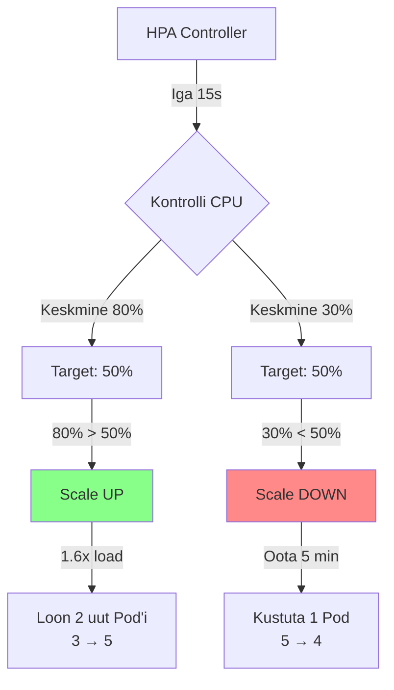
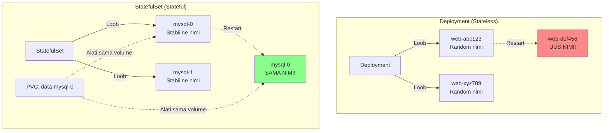
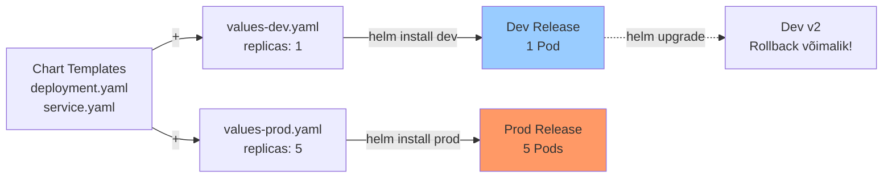

# Kubernetes Lisapraktika

Need harjutused katavad keerukamaid Kubernetes teemasid, mis lähevad kaugemale põhilaborist. Iga harjutus on ehitatud 30-45 minutiks ja õpetab ühte fokuseeritud advanced kontseptsiooni, mida kasutatakse päris produktsioonis.

**Eeldused:** Kubernetes põhitõed (Pods, Deployments, Services), kubectl baaskäsud, YAML süntaks, loeng.md ja labor.md läbitud

---

## 1. Horizontal Pod Autoscaler

### 1.1 Probleem

Käsitsi pod'ide arvu muutmine on aeglane ja ebaefektiivne. Kui liiklus järsku kasvab kell 20:00, võib rakendus kokku kukkuda enne kui jõuate `kubectl scale` käivitada. Kui hoiate ööseks 10 pod'i käimas aga liiklus on null, raiskate raha.

Produktsioonis muutub koormus pidevalt - Black Friday võib tuua 100x rohkem liiklust. Staatilise replica arvu puhul kas raiskate ressursse või kannatate downtime'i. Vajate automaatset skaleerimist, mis reageerib real-time metrics'itele.

### 1.2 Lahendus

Horizontal Pod Autoscaler (HPA) jälgib metrics'eid ja muudab automaatselt replicate arvu. HPA töötab tsüklis - iga 15 sekundi tagant kontrollib pod'ide keskmist CPU/memory kasutust ja võrdleb target'iga.

**Kuidas HPA töötab:**



**HPA loogika:**
1. Metrics Server kogub CPU/memory kasutust
2. HPA arvutab keskmise kõigi Pod'ide pealt
3. Kui keskmine > target → scale up
4. Kui keskmine < target → scale down (5 min cooldown)
5. Formula: `desiredReplicas = ceil(currentReplicas * (currentMetric / targetMetric))`

**Näide:**
- 3 Pod'i, keskmine CPU 80%, target 50%
- Formula: `ceil(3 * (80 / 50))` = `ceil(4.8)` = **5 Pod'i**

HPA vajab Metrics Server'it, mis kogub ressursi kasutust kõigist node'idest. Minikube'is: `minikube addons enable metrics-server`.

**Kuidas HPA töötab:**

- Deployment määrab `resources.requests.cpu: 200m`
- HPA määrab target: `averageUtilization: 50`
- Kui pod'id kasutavad keskmiselt 80% CPU → HPA loob uusi pod'e
- Kui koormus langeb alla 50% → HPA kustutab pod'e (5 min pärast)

**Loe veel:**

- loeng.md
- pole veel selles loengus, aga deployment'i ja resource limits't leiad seal
- labor.md
- "## 2. Multi-tier rakendus" näitab deployment'i struktuuri
- [Kubernetes HPA dokumentatsioon](https://kubernetes.io/docs/tasks/run-application/horizontal-pod-autoscale/)
- [Metrics Server](https://github.com/kubernetes-sigs/metrics-server)

**Minimaalne näide:**
```yaml
# HPA põhistruktuur
apiVersion: autoscaling/v2
kind: HorizontalPodAutoscaler
metadata:
  name: minu-app-hpa
spec:
  scaleTargetRef:
    apiVersion: apps/v1
    kind: Deployment
    name: minu-app              # Millise deployment'i skaleerib
  minReplicas: 1
  maxReplicas: 10
  metrics:

  - type: Resource
    resource:
      name: cpu
      target:
        type: Utilization
        averageUtilization: 50  # Target CPU %
```

### 1.3 Harjutus: Autoscaling Test

**SINU ÜLESANNE - ehita need failid:**

**Nõuded:**

- [ ] Luba Metrics Server (`minikube addons enable metrics-server`)
- [ ] Loo `deployment.yaml`: kasuta image `registry.k8s.io/hpa-example`, port 80
- [ ] Lisa deployment'i: `resources.requests.cpu: 200m` ja `limits.cpu: 500m`
- [ ] Loo `service.yaml`: ClusterIP, port 80
- [ ] Loo `hpa.yaml`: skaleerib 1-10 pod'i kui CPU > 50%
- [ ] Rakenda kõik failid: `kubectl apply -f ...`
- [ ] Genereeri load busybox'iga ja vaata kuidas pod'id skaleeruvad
- [ ] Dokumenteeri: screenshot või log kus näha pod'ide arvu kasv

**Näpunäiteid:**

- Metrics Server vajab 30-60 sekundit enne kui metrics'id ilmuvad
- Kontrolli metrics: `kubectl top nodes` ja `kubectl top pods`
- HPA vaatamiseks: `kubectl get hpa --watch`
- Load generator: `kubectl run load-generator --image=busybox --restart=Never -- /bin/sh -c "while sleep 0.01; do wget -q -O- http://SINU-SERVICE:80; done"`
- Scale-down võtab ~5 minutit (cooldown periood)

**Testimine:**
```bash
# 1. Kontrolli et Metrics Server töötab
kubectl top nodes

# 2. Vaata HPA staatust
kubectl get hpa

# 3. Käivita load generator (uus terminal)
kubectl run load-generator --image=busybox --restart=Never -- /bin/sh -c "while sleep 0.01; do wget -q -O- http://SINU-SERVICE:80; done"

# 4. Jälgi scaling'ut
kubectl get hpa --watch
kubectl get pods --watch

# 5. Peata load
kubectl delete pod load-generator

# 6. Vaata scale-down
kubectl get hpa --watch
```

**Boonus:**

- Lisa memory-based scaling (targetAverageUtilization: 70)
- Muuda scale-down kiiremaks: lisa `behavior.scaleDown.stabilizationWindowSeconds: 60`
- Proovi erinevaid CPU target väärtusi (30%, 80%)

---

## 2. StatefulSets ja Persistent Storage

### 2.1 Probleem

Deployment'id on head stateless rakendustele, aga andmebaasid vajavad hoopis teistsugust lähenemist. Kui Deployment pod restart'ib, saab ta uue nime (`myapp-abc123` → `myapp-xyz789`), uue IP aadressi, ja pole garantiid et sama volume mount'itakse.

Andmebaasi master peab alati olema `mysql-0`, mitte random nimi. Kui pod kukub, peab uus `mysql-0` kasutama täpselt sama PersistentVolume'd - data ei tohi kaduda. Samuti peab master käivituma enne replica'sid. Deployment ei garanteeri midagi sellest.

### 2.2 Lahendus

StatefulSet garanteerib stabiilse identiteedi. Iga pod saab indeksi (0, 1, 2) mis ei muutu kunagi. Pod'id luuakse järjekorras (0 → 1 → 2) ja kustutatakse vastupidises järjekorras (2 → 1 → 0).

**Deployment vs StatefulSet:**



StatefulSet kasutab Headless Service'i (`clusterIP: None`), mis annab igale pod'ile DNS kirje: `mysql-0.mysql.default.svc.cluster.local`. VolumeClaimTemplate loob automaatselt PVC iga pod'i jaoks - kui `mysql-0` kustutatakse ja uuesti luuakse, mount'ib Kubernetes sama PVC nimega `data-mysql-0`.

**Peamised erinevused Deployment'ist:**

| Aspekt | Deployment | StatefulSet |
|--------|-----------|-------------|
| Pod nimi | random (myapp-abc123) | stabiilne (mysql-0) |
| DNS | ei garanteeri | mysql-0.mysql.svc |
| PVC | shared või ei ole | iga pod'il oma PVC |
| Järjekord | parallel | sequential (0→1→2) |
| Kasutus | Stateless apps | Andmebaasid, queue'id |

**Loe veel:**

- loeng.md
- "## 5. Storage ja ConfigMaps" - PVC ja volume'id
- labor.md
- "## 4. PostgreSQL Andmebaas" - näide StatefulSet'ist
- [Kubernetes StatefulSets](https://kubernetes.io/docs/concepts/workloads/controllers/statefulset/)
- [Persistent Volumes](https://kubernetes.io/docs/concepts/storage/persistent-volumes/)

**Minimaalne näide:**
```yaml
# Headless Service (clusterIP: None)
apiVersion: v1
kind: Service
metadata:
  name: mysql
spec:
  clusterIP: None      # Headless!
  selector:
    app: mysql
  ports:

  - port: 3306

---
# StatefulSet põhistruktuur
apiVersion: apps/v1
kind: StatefulSet
metadata:
  name: mysql
spec:
  serviceName: mysql   # Headless service nimi
  replicas: 1
  selector:
    matchLabels:
      app: mysql
  template:
    metadata:
      labels:
        app: mysql
    spec:
      containers:

      - name: mysql
        image: mysql:8.0
        env:

        - name: MYSQL_ROOT_PASSWORD
          value: "password"
        volumeMounts:

        - name: data
          mountPath: /var/lib/mysql
  volumeClaimTemplates:    # Loob PVC iga pod'i jaoks
  - metadata:
      name: data
    spec:
      accessModes: ["ReadWriteOnce"]
      resources:
        requests:
          storage: 1Gi
```

### 2.3 Harjutus: Data Persistence Test

**SINU ÜLESANNE - ehita need failid:**

**Nõuded:**

- [ ] Loo `mysql-secret.yaml`: parool base64 formaadis (echo -n 'rootpass' | base64)
- [ ] Loo `mysql-statefulset.yaml`: MySQL 8.0, kasuta secret'i parooliks
- [ ] Lisa StatefulSet'i: volumeClaimTemplate 1Gi storage'iga
- [ ] Lisa StatefulSet'i: liveness ja readiness probe'id
- [ ] Loo Headless Service: `clusterIP: None`, port 3306
- [ ] Rakenda kõik ja oota kuni pod valmis
- [ ] Loo andmebaas ja tabel pod'i sees
- [ ] Lisa andmeid tabelisse
- [ ] Kustuta pod: `kubectl delete pod mysql-0`
- [ ] Kontrolli et andmed on ALLES pärast pod'i restart'i

**Näpunäiteid:**

- Base64 encoding: `echo -n 'password' | base64`
- MySQL probe näide: `exec.command: ["mysqladmin", "ping"]`
- Ühenda pod'iga: `kubectl exec -it mysql-0 -- mysql -p`
- Pod võtab 30-60 sek enne kui valmis (MySQL init)
- PVC jääb alles isegi kui pod kustutatakse

**Testimine:**
```bash
# 1. Rakenda kõik failid
kubectl apply -f mysql-secret.yaml
kubectl apply -f mysql-statefulset.yaml

# 2. Oota valmis
kubectl wait --for=condition=ready pod/mysql-0 --timeout=120s

# 3. Ühenda ja loo andmed
kubectl exec -it mysql-0 -- mysql -p

# MySQL shell'is:
CREATE DATABASE testdb;
USE testdb;
CREATE TABLE users (id INT PRIMARY KEY, name VARCHAR(50));
INSERT INTO users VALUES (1, 'Alice'), (2, 'Bob');
SELECT * FROM users;
exit;

# 4. Kontrolli PVC'd
kubectl get pvc
# Peaksid nägema: data-mysql-0

# 5. Kustuta pod
kubectl delete pod mysql-0

# 6. Oota uus pod
kubectl wait --for=condition=ready pod/mysql-0 --timeout=120s

# 7. Kontrolli andmeid
kubectl exec -it mysql-0 -- mysql -p -e "USE testdb; SELECT * FROM users;"

# Alice ja Bob peavad olema alles!
```

**Boonus:**

- Loo 3-replica StatefulSet (mysql-0, mysql-1, mysql-2)
- Lisa init container: genereeri unikaalne server-id iga pod'i jaoks
- Implementeeri MySQL master-replica setup
- Loo CronJob automated backup'ideks

---

## 3. Helm Charts

### 3.1 Probleem

Kui teil on 10 YAML faili (Deployment, Service, ConfigMap, Secret, Ingress, HPA, PVC...), siis nende haldamine muutub keeruliseks. Kuidas deployda sama rakendust development, staging ja production keskkonnas erinevate seadetega? Kas kopeerite kõik YAML failid ja muudate käsitsi?

Kuidas hallata versioone? Kui deployment fail muutub, kuidas tagada et kõik seotud ressursid muutuvad samuti? Kuidas teha rollback kui midagi läheb valesti? Kui teil on 50 mikroteenust, siis 500 YAML faili käsitsi haldamine on võimatu.

### 3.2 Lahendus

Helm on "package manager" Kubernetes'i jaoks (nagu apt/yum Linux'is). Helm Chart on bundle YAML template'idest, mida saab konfigureerida ühe `values.yaml` failiga.

**Helm workflow:**



**Helm põhikontseptsioonid:**

- **Chart**: Package YAML template'idest (nagu npm package)
- **Release**: Chart'i installitud instance (nt. myapp-dev, myapp-prod)
- **Values**: Konfiguratsioon (values.yaml, values-dev.yaml)
- **Template**: YAML kus on muutujad (`{{ .Values.replicaCount }}`)

Üks chart, mitu environment'i: development kasutab `values-dev.yaml` (1 replica, väikesed resources), production kasutab `values-prod.yaml` (5 replicas, suured resources). Helm jälgib versioone - saate teha rollback ühe käsuga. Helm teeb ka dependency management'i - kui teie app vajab PostgreSQL'i, võite lisada PostgreSQL chart'i dependency'na.

**Chart struktuur:**
```
myapp/
├── Chart.yaml              # Metadata (nimi, versioon)
├── values.yaml             # Default väärtused
├── templates/              # YAML template'id
│   ├── deployment.yaml
│   ├── service.yaml
│   └── _helpers.tpl        # Helper funktsioonid
└── charts/                 # Dependencies
```

**Loe veel:**

- loeng.md
- YAML struktuurid (deployment, service)
- labor.md
- näed kuidas Deployment ja Service töötavad
- [Helm dokumentatsioon](https://helm.sh/docs/)
- [Helm Best Practices](https://helm.sh/docs/chart_best_practices/)

**Template näide:**
```yaml
# templates/deployment.yaml
apiVersion: apps/v1
kind: Deployment
metadata:
  name: {{ .Release.Name }}-app    # Muutuja Chart.yaml'ist
spec:
  replicas: {{ .Values.replicaCount }}    # Muutuja values.yaml'ist
  template:
    spec:
      containers:

      - name: app
        image: "{{ .Values.image.repository }}:{{ .Values.image.tag }}"
        resources:
          {{- toYaml .Values.resources | nindent 10 }}    # Kopeeri terve YAML block
```
```yaml
# values.yaml
replicaCount: 2
image:
  repository: nginx
  tag: "alpine"
resources:
  limits:
    cpu: 200m
    memory: 256Mi
```

**Helm käsud:**
```bash
# Loo chart
helm create myapp

# Install
helm install myrelease ./myapp

# Install teise values failiga
helm install myrelease ./myapp -f values-prod.yaml

# Upgrade
helm upgrade myrelease ./myapp --set replicaCount=5

# Rollback
helm rollback myrelease 1

# Uninstall
helm uninstall myrelease
```

### 3.3 Harjutus: Multi-Environment Deployment

**SINU ÜLESANNE:**

**Nõuded:**

- [ ] Loo Helm chart: `helm create myshop`
- [ ] Muuda `Chart.yaml`: pane oma nimi, versioon 1.0.0, description
- [ ] Muuda `values.yaml`: nginx image, 2 replicas, ClusterIP service
- [ ] Vaata `templates/deployment.yaml` - kuidas see kasutab values'eid
- [ ] Loo `values-dev.yaml`: 1 replica, cpu: 100m, memory: 128Mi
- [ ] Loo `values-prod.yaml`: 3 replicas, cpu: 500m, memory: 512Mi
- [ ] Install DEV: `helm install myshop-dev ./myshop -f values-dev.yaml`
- [ ] Install PROD: `helm install myshop-prod ./myshop -f values-prod.yaml`
- [ ] Kontrolli et DEV'il on 1 pod, PROD'il 3 pod'i
- [ ] Tee upgrade: muuda `values.yaml` image tag → "latest"
- [ ] Upgrade DEV: `helm upgrade myshop-dev ./myshop -f values-dev.yaml`
- [ ] Vaata ajalugu: `helm history myshop-dev`
- [ ] Rollback: `helm rollback myshop-dev 1`

**Näpunäiteid:**

- `helm create` genereerib valmis template'id
- ära kirjuta üle, kasuta neid!
- Dry-run testimiseks: `helm install --dry-run --debug myshop ./myshop`
- Template rendering vaatamiseks: `helm template myshop ./myshop`
- Kui muudad template faile, pead tegema `helm upgrade`
- `helm list` näitab kõiki release'e
- `helm uninstall` kustutab kõik ressursid (Deployment, Service, jne)

**Testimine:**
```bash
# 1. Loo chart
helm create myshop
cd myshop/

# 2. Kontrolli Chart.yaml
cat Chart.yaml

# 3. Muuda values.yaml (näide)
cat > values.yaml << 'EOF'
replicaCount: 2
image:
  repository: nginx
  tag: "alpine"
  pullPolicy: IfNotPresent
service:
  type: ClusterIP
  port: 80
resources:
  limits:
    cpu: 200m
    memory: 256Mi
  requests:
    cpu: 100m
    memory: 128Mi
EOF

# 4. Loo values-dev.yaml
cat > values-dev.yaml << 'EOF'
replicaCount: 1
resources:
  limits:
    cpu: 100m
    memory: 128Mi
  requests:
    cpu: 50m
    memory: 64Mi
EOF

# 5. Loo values-prod.yaml
cat > values-prod.yaml << 'EOF'
replicaCount: 3
resources:
  limits:
    cpu: 500m
    memory: 512Mi
  requests:
    cpu: 250m
    memory: 256Mi
EOF

# 6. Test dry-run
helm install --dry-run --debug myshop-dev . -f values-dev.yaml

# 7. Install DEV
helm install myshop-dev . -f values-dev.yaml

# 8. Install PROD
helm install myshop-prod . -f values-prod.yaml

# 9. Kontrolli
kubectl get pods -l app.kubernetes.io/instance=myshop-dev
kubectl get pods -l app.kubernetes.io/instance=myshop-prod
helm list

# 10. Upgrade DEV
helm upgrade myshop-dev . -f values-dev.yaml --set image.tag=latest

# 11. Vaata ajalugu
helm history myshop-dev

# 12. Rollback
helm rollback myshop-dev 1

# 13. Cleanup
helm uninstall myshop-dev
helm uninstall myshop-prod
```

**Boonus:**

- Lisa conditional Ingress: `{{- if .Values.ingress.enabled }}`
- Loo `values-staging.yaml` kolmanda environment'i jaoks
- Lisa HorizontalPodAutoscaler template
- Implementeeri chart dependency: lisa PostgreSQL chart

---

## Kasulikud Ressursid

**Dokumentatsioon:**

- [Kubernetes HPA](https://kubernetes.io/docs/tasks/run-application/horizontal-pod-autoscale/)
- [StatefulSets](https://kubernetes.io/docs/concepts/workloads/controllers/statefulset/)
- [Persistent Volumes](https://kubernetes.io/docs/concepts/storage/persistent-volumes/)
- [Helm Documentation](https://helm.sh/docs/)
- [Helm Chart Best Practices](https://helm.sh/docs/chart_best_practices/)

**Tööriistad:**

- **k9s**
- Terminal UI Kubernetes'ile: `brew install k9s` või `snap install k9s`
- **kubectx/kubens**
- Kiire context/namespace switching: `brew install kubectx`
- **stern**
- Multi-pod log tailing: `brew install stern`
- **Lens**
- Desktop GUI Kubernetes'ile: https://k8slens.dev/

**Näited:**

- [Kubernetes Examples](https://github.com/kubernetes/examples)
- [Helm Charts Repository](https://github.com/helm/charts)
- [Artifact Hub](https://artifacthub.io/) - Helm charts'i otsing

Need harjutused on mõeldud süvendama teie Kubernetes oskusi. Alustage esimesest ja liikuge järk-järgult keerulisemate poole.