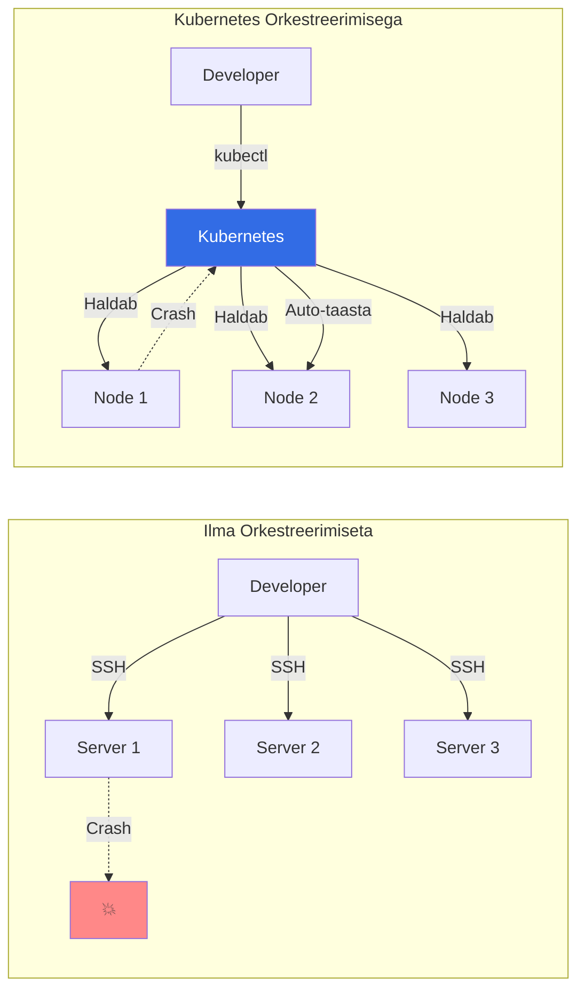
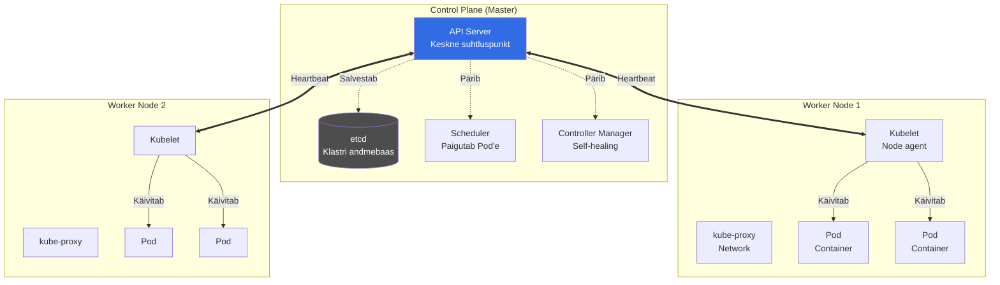
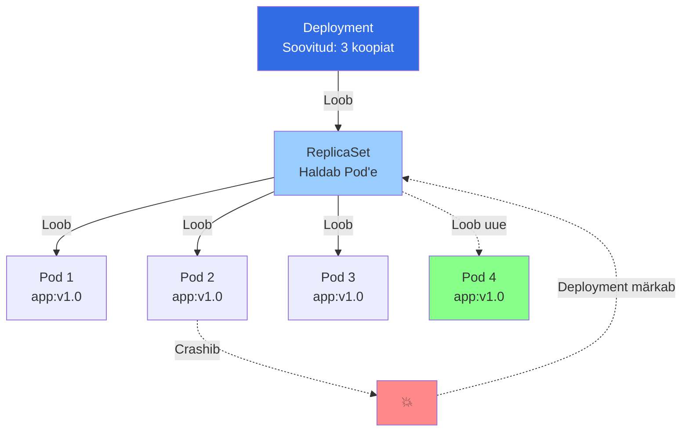
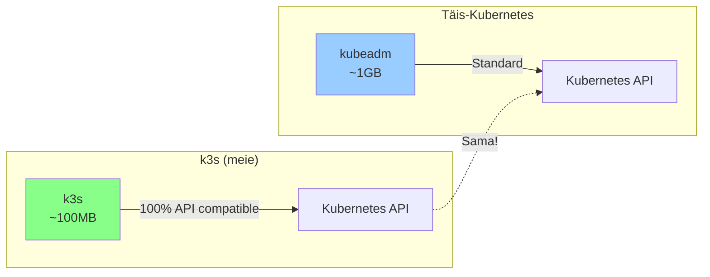

# Kubernetes Alused

**Eeldused:** Docker, Linux CLI, YAML süntaks

**Platvorm:** Kubernetes (platvormiülesene)

**Dokumentatsioon:** [kubernetes.io/docs](https://kubernetes.io/docs)

## Õpiväljundid

- Selgitad konteinerite orkestreerimise vajadust
- Eristád Kubernetes'e teistest orkestraatoritest
- Kirjeldad Kubernetes'e arhitektuuri
- Mõistad deklaratiivset ressursihaldust
- Kirjutad Kubernetes YAML manifeste
- Haldad rakendusi kubectl abil

---

## 1. Miks Me Vajame Kubernetes'e?

### Docker Compose Piirid

Olete õppinud Docker'it ja Docker Compose'i. Üks `docker-compose.yml` fail, `docker-compose up` käsk ja teie rakendus töötab. See on suurepärane väikeste projektide jaoks - paar konteinerit ühel masinaal.

Kuid mis juhtub, kui teie ettevõte kasvab? Tallinna startup algab kahe konteineri ga (veebileht + andmebaas), kuid aasta pärast on olukord hoopis teine. Te vajate 50 mikroteenust, mis peavad töötama 10 serveril. Iga mikroteenust tuleb eraldi uuendada, skaleerida ja monitoorida. Docker Compose ei oska:

**Mitut serverit korraga hallata.** Compose töötab ainult ühel masinal. Kui teil on 5 serverit, peate SSH'ga sisse logima igasse serverisse eraldi ja käivitama compose käsitsi. Koordineerimist pole.

**Automaatselt taastada krahhinud konteinereid.** Kui konteiner kukub, jääb ta lihtsalt seisma. Keegi ei käivita seda automaatselt uuesti. Te peate ise monitoorima ja reageerima.

**Liiklust jaotada mitme instantsi vahel.** Kui teil on 10 koopiat ühest teenusest (load balancing), siis Docker Compose ei oska automaatselt liiklust nende vahel jaotada. Peate ise nginx'i või midagi muud seadistama.

**Järk-järgult uuendada ilma downtime'ita.** Uue versiooni deploy? Compose peatab kõik vanad konteinerid ja käivitab uued. Tulemus: 30 sekundit downtime'i. Kliendid näevad erroreid.

### Bolt Näide

Bolt käivitab sadu mikroteenuseid kümnetes riikides. 2016. aastal kasutasid nad Docker Compose'i ja Bash skripte. Iga deploy võttis tunde, sest DevOps insenerid pidid käsitsi SSH'ga serveritesse logima ja konteinereid restartima. Iga serveri rike tähendas käsitsi parandamist - keegi pidi kell 3 öösel üles tõusma ja asju parandama.

2017. aastal liikusid nad Kubernetes'ele. Muutused olid dramaatilised. Deploy aeg langes 2-3 tunnilt 10 minutile. Kubernetes hakkas automaatselt taastama krahhinud konteinereid - pole enam öised äratused. Skaaleerimine muutus automaatseks - kui liiklus kasvab, lisab Kubernetes ise instantse juurde.

### Mis on Orkestreerimine?

Kujutage ette 50-liikmelise orkestriti. Kui ei ole dirigenti, on kaos - keegi ei tea millal alustada, millist tempot hoida, millal vaiksem olla. Dirigent koordineerib kõike. Kubernetes on teie konteinerite dirigent.



Orkestreerimine tähendab:

**Planeerimine (scheduling).** Otsustamine, millisele serverile konteiner paigutada. Kubernetes vaatab, millel serveril on vaba CPU ja RAM, ja teeb aruka valiku.

**Tervise jälgimine.** Pidev kontroll, kas konteinerid töötavad. Kui mitte, käivita uuesti automaatselt. Isegi kui terve server kukub, liigutab Kubernetes konteinerid teistele serveritele.

**Skaleerimine.** Liiklus kasvas? Lisa instantse. Öö hakkas peale ja liiklus vähenes? Eemalda üleliigsed instantsid (kokkuhoid).

**Uuendamine.** Deploy uut versiooni järk-järgult. Lase osa vana versiooni töötada seni, kuni uus versioon on stabiilne. Zero downtime.

---

## 2. Mis on Kubernetes?

Kubernetes (lühendatult K8s, sest "ubernete" on 8 tähte) on Google'i loodud avatud lähtekoodiga platvorm. Google kasutab sisemiselt süsteemi nimega Borg, mis haldab miljardeid konteinereid nädalas juba üle 15 aasta. Kubernetes on Borg'i õppetundide avalik versioon, mille Google avalikustas 2014. aastal.


Tänapäeval haldab Kubernetes'i arendust Cloud Native Computing Foundation (CNCF), mis tagab et ükski üksik ettevõte ei kontrolli platvormi arengut. See on muutunud tööstuse standardiks - 96% Fortune 100 ettevõtetest kasutab Kubernetes'e.

### Kubernetes vs Docker


Paljud arvavad ekslikult, et Kubernetes ja Docker on konkurendid. See pole tõsi. Docker on konteinerite loomise ja käitamise tehnoloogia. Kubernetes on süsteem, mis haldab neid konteinereid suurel skaalal.

Docker ütleb KUIDAS üks konteiner töötab. Kubernetes otsustab KUS see töötab, KUI PALJU neid töötab, ja KUIDAS nad omavahel suhtlevad. Tegelikult kasutab Kubernetes ise Docker'it (või teisi runtime'e nagu containerd) konteinerite käitamiseks. Need on komplementaarsed tehnoloogiad, mitte konkurendid.

### Kubernetes Eestis

Eestis kasutavad Kubernetes'e kõik suuremad tech ettevõtted: Bolt, Wise (endine TransferWise), Pipedrive, Veriff, Cleveron. Põhjus on lihtne - ilma Kubernetes'eta ei suudaks nad oma teenuseid nii kiiresti skaleerida ja arendada.

Wise näiteks käitab rahvusvahelist maksesüsteemi, kus downtime maksab kümneid tuhandeid eurosid minutis. Kubernetes tagab neile 99.95% uptime'i ja võimaldab teha 50+ deploy'd päevas ilma teenuse katkestusteta.

---

## 3. Kubernetes Arhitektuur

Kubernetes klaster koosneb kahest osast: Control Plane (juhtimistasand) ja Worker Nodes (töötajad).



### Control Plane - Aju

Control Plane on klastri "aju", kus tehakse otsuseid. See ei käita konteinereid ise, vaid koordineerib kõike. Produktsioonis on tavaliselt 3-5 control plane node'i kõrge käideldavuse tagamiseks.

**API Server** on Kubernetes'e keskne suhtluspunkt. Kõik käsud - olgu need kubectl'ist, dashboardist või teistest komponentidest - käivad läbi API Serveri. See valideerib päringuid, kontrollib õiguseid ja salvestab muudatused andmebaasi.

**etcd** on hajutatud võti-väärtus andmebaas, mis hoiab kogu klastri olekut. Iga Deployment, Service, Pod - kõik on etcd's. Kui etcd kaob, kaob klastri "mälu". Seepärast on backup kriitilise tähtsusega.

**Scheduler** otsustab, millisele Node'ile uus Pod paigutada. See vaatab, millel node'il on piisavalt CPU ja RAM-i, kas on spetsiaalseid nõudeid (nt SSD ketas), ja teeb aruka valiku. Scheduler ei käivita Pod'i ise - see ainult määrab asukoha.

**Controller Manager** jooksutab kontrollereid, mis pidevalt jälgivad klastri olekut. Deployment Controller tagab, et õige arv Pod'e töötab. Node Controller jälgib, kas node'id on elus. Need kontrollerid töötavad lõputus tsüklis, võrreldes soovitud olekut reaalsusega ja tehes vajalikke muudatusi.

### Worker Nodes - Töötajad

Worker Node'id käitavad tegelikult konteinereid. Igal node'il töötavad kolm peamist komponenti.

**Kubelet** on "agent" igal node'il. See küsib API serverilt, milliseid Pod'e peaks käitama, ja tagab et need Pod'id töötavad. Kui konteiner kukub, proovib kubelet seda restartida. Kubelet saadab regulaarselt olekuinfot API serverisse.

**Kube-proxy** haldab võrgureegleid, et Pod'id saaksid omavahel suhelda isegi kui nad on erinevatel node'idel. See programmeerib iptables reegleid, et liiklus jõuaks õigesse kohta.

**Container Runtime** (Docker, containerd või CRI-O) käitab konteinereid. Kubernetes ise ei käita konteinereid otse - see kasutab runtime'i. Tänapäeval kasutavad enamik klastrid containerd'i, mis on Dockerist lihtsam ja kiirem.

---

## 4. Kubernetes Core Kontseptsioonid

### Pod - Väikseim Ühik


Pod on Kubernetes'e väikseim juurutatav ühik. See ei ole konteiner - see on ümbris ühele või mitmele konteinerile. Tavaliselt on Pod'is üks konteiner, kuid mõnikord võib olla ka kõrvalmahuteid (sidecar containers) - näiteks logide kogumiseks.

Pod'i sees jagavad kõik konteinerid sama võrku (IP aadress) ja salvestusruumi (volumes). Nad on nagu ühe arvuti protsessid - saavad suhelda `localhost` kaudu.

Pod on ajutine (ephemeral). Kui Pod kustub, kaovad andmed (kui pole eraldi volume'd). IP aadress muutub iga restart'iga. Seepärast ei haldagi me Pod'e otse - kasutame Deployment'e.

### Deployment - Deklaratiivne Haldus

Deployment on kõrgema taseme abstrakt, mis haldab Pod'e. Te ütlete "tahan 3 koopiat oma rakendusest" ja Kubernetes tagab, et need 3 koopiat alati töötavad.



Kui üks Pod kukub, loob Deployment automaatselt uue (self-healing). Kui uuendate rakendust, teeb Deployment rolling update - loob järk-järgult uued Pod'id enne vanade kustutamist. Kunagi ei ole kõik Pod'id korraga maas.

Deployment → ReplicaSet → Pod'id. ReplicaSet tagab õige arvu Pod'e. Deployment haldab ReplicaSet'e - iga versioon on eraldi ReplicaSet. See võimaldab kiirelt rollback'i teha.

### Service - Püsiv Võrguaadress


Pod'idel on IP aadressid, kuid need muutuvad. Iga restart toob uue IP. Service lahendab selle probleemi, andes püsiva IP aadressi ja DNS nime.

Service leiab Pod'id label'i järgi. Näiteks kõik Pod'id label'iga `app: nginx` grupeeritakse. Service teeb automaatselt load balancing'u - päringud jaotatakse kõigile tervete Pod'ide vahel.

**ClusterIP** (vaikimisi) - sisemine IP, kättesaadav ainult klastri seest. **NodePort** avab pordi kõigil node'idel (30000-32767), võimaldades välist ligipääsu. **LoadBalancer** loob cloud provider'i load balancer'i (AWS ELB, Azure LB).

DNS on oluline. Iga Service saab automaatselt DNS nime formaadis `<service-name>.<namespace>.svc.cluster.local`. See tähendab, et teised Pod'id saavad ühenduda lihtsalt nimega, mitte IP'ga.

### ConfigMap ja Secret


**ConfigMap** hoiab konfiguratsiooni, mis pole salajane - andmebaasi URL, pordi number, logi tase. ConfigMap võimaldab konfiguratsiooni muuta ilma konteinerit uuesti ehitamata.

**Secret** hoiab tundlikku infot - paroole, API võtmeid. Kubernetes salvestab Secret'id base64 kodeeritult (see EI OLE krüpteerimine!). Produktsioonis tuleks kasutada väliseid vault'e nagu HashiCorp Vault.

Mõlemad saab Pod'i mount'ida kas keskkonna muutujatena või failidena. Keskkonnamuutujad sobivad lühikeste väärtuste jaoks, failid on paremad konfiguratsioonifailide jaoks.

### Namespace - Loogiline Eraldamine

Namespace on nagu kaust failisüsteemis. See eraldab ressursse loogiliselt - võite luua namespace'id erinevatele keskakondadele (dev, staging, prod) või meeskondadele.

Vaikimisi on namespace `default`. Namespace'id ei ole turvalisuse piir (kui ei kasuta network policies), kuid nad aitavad organiseerida ja isoleerida ressursse. Saate määrata resource quota'sid per namespace, et üks meeskond ei võtaks kõiki ressursse.

---

## 5. Kubernetes Workflow

### kubectl - Peamine Tööriist


kubectl on Kubernetes'i käsurea tööriist. See räägib API serveriga ja võimaldab luua, muuta, kustutada ja jälgida ressursse.

Põhikäsud, mida vajate iga päev:

`kubectl get pods` - näita kõiki Pod'e. `kubectl describe pod <nimi>` - täielik info Pod'i kohta, sealhulgas event'id. `kubectl logs <pod>` - vaata Pod'i logi. `kubectl exec -it <pod> -- sh` - logi Pod'i sisse (nagu SSH).

`kubectl apply -f deployment.yaml` - loo või uuenda ressursse YAML failist. See on deklaratiivne lähenemine - te kirjeldate soovitud olekut ja Kubernetes teeb selle reaalsuseks.

### Deklaratiivne vs Imperatiivne

Kubernetes töötab deklaratiivselt. Te ei ütle "loo 3 Pod'i", vaid "peab olema 3 Pod'i". Vahe on suur.

Imperatiivne käsk: `kubectl run nginx --image=nginx:1.25`. See käsk loob Pod'i kohe. Kui käivitate uuesti, teeb see vea - Pod juba eksisteerib.

Deklaratiivne YAML fail kirjeldab soovitud olekut:
```yaml
apiVersion: apps/v1
kind: Deployment
metadata:
  name: nginx
spec:
  replicas: 3
```

`kubectl apply` on idempotent - te võite käivitada seda mitu korda, tulemus on sama. Kubernetes võrdleb praegust olekut soovituga ja teeb ainult vajalikud muudatused.

### Rolling Update ja Rollback

Kubernetes'i üks võimsamaid feature'eid on zero-downtime deployment. Kui uuendate Deployment'i, teeb Kubernetes rolling update:

1. Loob 1 uue Pod'i uue versiooniga
2. Ootab kuni see on valmis (readiness probe)
3. Kustutab 1 vana Pod'i
4. Kordab, kuni kõik uuendatud

Kunagi ei ole kõik Pod'id korraga maas. Kui uus versioon crashib, peatab Kubernetes update'i automaatselt. Te saate teha rollback'i ühe käsuga: `kubectl rollout undo deployment/<nimi>`.

---

## 6. Õppimise Platvormid

Kubernetes'e saab õppida mitmel viisil - kõik kasutavad sama API't!

### Kohalikud Lahendused

| Platvorm | Kirjeldus | Paigaldus | Kasutus | Meie kursusel |
|----------|-----------|-----------|---------|---------------|
| **k3s** | Kerge Kubernetes (100MB) | 1 käsk | Production-ready, edge | ✅ Labor + Multi-node |
| **Minikube** | Kõige populaarsem õppimiseks | Installer | Ainult õppimine | ❌ |
| **Kind** | Kubernetes in Docker | Binary | Kiire, CI/CD test | ❌ |
| **Docker Desktop** | Sisseehitatud K8s | Checkbox | Mac/Windows õppimine | ❌ |

### k3s vs Täis-Kubernetes



**Oluline:** k3s on PÄRIS Kubernetes - sama API, samad kontseptsioonid! Lihtsalt:
- Väiksem (~100MB vs ~1GB)
- Lihtsam paigaldada (1 käsk vs 10+ sammu)
- Optimeeritud edge/IoT jaoks
- Ideaalne õppimiseks!

Kõik mis õpite k3s'iga, töötab täis-Kubernetes'is. Labor.md kasutab k3s'i, multi-node labor kasutab samuti k3s'i.

---

## 7. Miks Kubernetes on Väärtuslik?

### Automaatne Skaaleerimine

Horizontal Pod Autoscaler (HPA) jälgib CPU kasutust ja muudab automaatselt Pod'ide arvu. Kui liiklus kasvab ja CPU läheb üle 70%, lisab HPA instantse. Kui koormus langeb, vähendab instantse. Kokkuhoid öö ajal, võimsus päeval.

### Self-Healing

Kui Pod kukub, loob Kubernetes uue. Kui Node kukub, liigutab Kubernetes kõik Pod'id teistele Node'idele. Kui image pull fail (nt vale tag), näitab Kubernetes selget error'it. Süsteem püüab alati jõuda soovitud olekuni.

### Deklaratiivne Infrastruktuur

Kõik on kirjeldatud YAML failides Git'is. Saate versioonidata, teha code review'd, rollback'e. Infrastructure as Code põhimõte - infrastruktuur on sama kontrollitud kui rakenduse kood.

### Multicloud ja Portaalsus

Kubernetes töötab ühte moodi AWS's, Azure's, GCP's ja on-prem. Sama YAML failid töötavad kõikjal. See annab vabaduse - te ei ole lukustatud ühte cloud provider'isse.

---

## Kokkuvõte

Kubernetes lahendab konteinerite haldamise probleemi suurel skaalal. See võtab teilt ära käsitsi töö - te ei pea SSH'ga serveritesse logima, käsitsi konteinereid restartima või liiklust jaotama. Kubernetes teeb selle kõik automaatselt.

Põhikontseptsioonid on lihtsad. **Pod** on väikseim ühik - konteinerite ümbris. **Deployment** haldab Pod'e ja tagab, et alati on õige arv töös. **Service** annab püsiva võrguaadressi ja teeb load balancing'u. Need kolm moodustavad 80% igapäevasest kasutusest.

Kubernetes on keeruline süsteem ja õppimiskõver on järsk. Kuid kui te olete selle valdanud, avanevad uksed. Peaaegu iga kaasaegne tech ettevõte kasutab Kubernetes'e. Oskus Kubernetes'ega töötada on väga väärtuslik - see on muutunud tööstuse standardiks ja nõudlus ainult kasvab.

Järgmises tunnis hakkame praktiseerima - paigaldame k3s'i, loome Pod'e, Deployment'e ja Service'id. Näeme kuidas Kubernetes praktikas töötab.

---

## Ressursid

**Dokumentatsioon:**
- [Kubernetes Docs](https://kubernetes.io/docs/home/)
- [kubectl Cheat Sheet](https://kubernetes.io/docs/reference/kubectl/cheatsheet/)
- [k3s Documentation](https://docs.k3s.io/)

**Õppimine:**
- [Kubernetes Tutorial](https://kubernetes.io/docs/tutorials/)
- [Play with Kubernetes](https://labs.play-with-k8s.io/) - tasuta online lab

**Kogukond:**
- [Kubernetes Slack](https://slack.k8s.io/)
- DevOps Estonia meetup'id

---

**Järgmine tund:** Praktika - paigaldame k3s'i Proxmox VM-s ja loome oma esimese Pod'i.