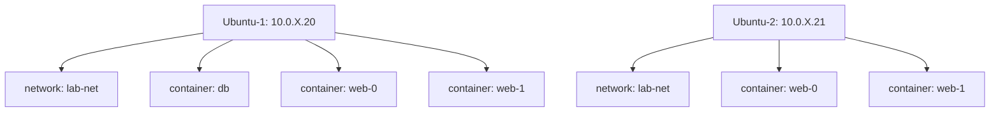

# Terraform Docker Labor: State ja Dependency Management

**Eesmärk:** Mõista Terraform'i põhitööd - kuidas ta haldab infrastruktuuri läbi state'i ja dependency graph'i

**Ajakulu:** 2h (120 min)

**Fookus:** 90% Terraform kontseptsioonid, 10% Docker setup

---

## Mis On Terraform? (Enne Kui Alustad)

**Terraform = Infrastruktuuri Menedžer**

**5 põhiülesannet:**
1. **Loeb koodi** → mõistab mida sa tahad
2. **Teab mis on olemas** (state fail) → ei loo duplikaate
3. **Arvutab erinevused** (plan) → näitab mis muutub
4. **Täidab muudatused** (apply) → õiges järjekorras
5. **Salvestab tulemuse** (state update) → järgmine kord teab

**Labor stsenaarium:**
```
WinKlient (Terraform jookseb siin)
    │
    ├─ SSH tunnel → Ubuntu-1 (Docker daemon)
    │                 Loob: DB + 2 web
    │
    └─ SSH tunnel → Ubuntu-2 (Docker daemon)
                      Loob: 2 web

Terraform teab KUS on MIDA (state fail WinKlient'is)
```

---

## Setup

### Docker Install (Ansible)

**Miks Ansible?** Terraform loob infrastruktuuri, Ansible seadistab. Me vajame Docker'it enne Terraform'i.

```powershell
mkdir C:\terraform-docker-lab
cd C:\terraform-docker-lab
```

**inventory.ini:**
```ini
[all]
10.0.X.20
10.0.X.21

[all:vars]
ansible_user=student
ansible_ssh_private_key_file=C:/Users/YourName/.ssh/id_rsa
```

**docker-setup.yml:**
```yaml
---
- hosts: all
  become: yes
  tasks:
    - apt: name=docker.io state=present
    - systemd: name=docker state=started enabled=yes
    - user: name=student groups=docker append=yes
```

```powershell
pip install ansible
ansible-playbook -i inventory.ini docker-setup.yml
```

**Test:**
```bash
ssh student@10.0.X.20 "docker ps"  # Ei küsi sudo
ssh student@10.0.X.21 "docker ps"
```

**KONTROLLI:** [ ] Docker töötab mõlemas serveris

---

### Terraform Projekt

**main.tf:**
```hcl
terraform {
  required_providers {
    docker = { source = "kreuzwerker/docker", version = "~> 3.0" }
  }
}

provider "docker" {
  alias = "u1"
  host  = "ssh://student@10.0.X.20:22"
  ssh_opts = ["-i", "C:/Users/YourName/.ssh/id_rsa", "-o", "StrictHostKeyChecking=no"]
}

provider "docker" {
  alias = "u2"
  host  = "ssh://student@10.0.X.21:22"
  ssh_opts = ["-i", "C:/Users/YourName/.ssh/id_rsa", "-o", "StrictHostKeyChecking=no"]
}
```

**Selgitus:**
- `provider "docker"` = plugin mis teab kuidas Docker'iga rääkida
- `alias = "u1"` = nimi sellele provider'ile (kaks serverit = kaks provider'it)
- `host = "ssh://..."` = kuidas ühenduda (SSH tunnel)

```powershell
terraform init
```

**Mis juhtus?**
```
Terraform:
1. Luges terraform {} block'i
2. Leidis: vajab docker provider'it
3. Laadis alla: .terraform/providers/kreuzwerker/docker/
4. Provider valmis kasutamiseks
```

**KONTROLLI:** [ ] `.terraform/` kataloog on olemas

---

## OSA 1: Dependency Graph - Kuidas Terraform Teab Järjekorda?

### Kontseptsioon

**Probleem:** Sul on 4 ressurssi:
```
network
volume
image
container (vajab network'i, volume'it, image'it)
```

Millises järjekorras luua?

**Käsitsi (Bash):**
```bash
docker network create mynet           # 1
docker volume create mydata           # 2
docker pull postgres                  # 3
docker run --network=mynet -v mydata postgres  # 4
```

Sa pead **ise** teadma järjekorda. Kui teed vale järjekorra:
```bash
docker run --network=mynet ...  # ERROR: network doesn't exist
```

**Terraform:**
```hcl
resource "docker_network" "net" { ... }
resource "docker_volume" "vol" { ... }
resource "docker_image" "img" { ... }
resource "docker_container" "db" {
  networks_advanced { name = docker_network.net.name }  # ← VIIDE
  volumes { volume_name = docker_volume.vol.name }      # ← VIIDE
  image = docker_image.img.image_id                     # ← VIIDE
}
```

**Terraform näeb viiteid ja ehitab "dependency graph":**
```
network ─┐
volume  ─┼─→ container
image   ─┘
```

Terraform teab: "Network, volume ja image enne → siis container."

**Sa ei pea** järjekorda mõtlema. Terraform arvutab ise.

---

### Praktika: Loo Ressursid ja Visualiseeri Graph

**Lisa main.tf'i:**
```hcl
# Ubuntu-1 ressursid
resource "docker_network" "u1_net" {
  provider = docker.u1
  name     = "lab-net"
}

resource "docker_volume" "u1_vol" {
  provider = docker.u1
  name     = "db-data"
}

resource "docker_image" "postgres" {
  provider = docker.u1
  name     = "postgres:15-alpine"
}

resource "docker_container" "db" {
  provider = docker.u1
  name     = "db"
  image    = docker_image.postgres.image_id  # VIIDE image'ile
  
  networks_advanced {
    name = docker_network.u1_net.name  # VIIDE network'ile
  }
  
  volumes {
    volume_name    = docker_volume.u1_vol.name  # VIIDE volume'ile
    container_path = "/var/lib/postgresql/data"
  }
  
  env = ["POSTGRES_PASSWORD=secret123"]
}
```

**Genereeri dependency graph:**
```powershell
terraform graph > graph.dot
```

**Visualiseeri:** Ava http://viz-js.com/ ja kopeeri `graph.dot` sisu sinna.

**Mida näed?**

```
Graph näitab nooltega:
  docker_network.u1_net ──→ docker_container.db
  docker_volume.u1_vol  ──→ docker_container.db
  docker_image.postgres ──→ docker_container.db
```

**See tähendab:** Container sõltub kolmest asjast → need kolm enne container'it.

---

### Ülesanded ja Küsimused

**1.1 Vaata graph'i:** 

Mis järjekorras Terraform loob ressursse? Kirjuta üles:
```
1. ___________
2. ___________
3. ___________
4. ___________
```

<details>
<summary>Vastus</summary>

```
1. Network, Volume, Image (paralleelselt - neil pole omavahel sõltuvusi)
2. Container (pärast kõiki kolme)
```
</details>

**1.2 Eksperiment:**

Eemalda KÕIK viited container'ist:
```hcl
resource "docker_container" "db" {
  provider = docker.u1
  name     = "db"
  image    = "postgres:15-alpine"  # String, mitte viide!
  # Pole networks_advanced
  # Pole volumes
}
```

```powershell
terraform graph > graph2.dot
```

**Küsimus:** Mis muutus graph'is? Kas container sõltub veel millegist?

<details>
<summary>Vastus</summary>
Ei! Graph näitab nüüd et kõik 4 ressurssi võivad luua paralleelselt - neil pole omavahel viiteid. Terraform ei tea et container VAJAB network'i (sest pole viidet koodis).
</details>

**Taasta viited tagasi!** (copy-paste eelmine variant)

**KONTROLLI:**
- [ ] Graph näitab 3 noolt container'i poole
- [ ] Mõistan: viide koodis = nool graph'is = dependency

---

## OSA 2: Plan vs State - Kuidas Terraform Teab Mis Muuta? (30 min)

### Kontseptsioon

**Terraform workflow:**

```
1. LOE main.tf       → "Mida SA tahad"
2. LOE state fail    → "Mis PRAEGU on"
3. VÕRDLE            → "Mis ERINEVUS"
4. NÄITA plan'i      → "Teen sellised muudatused"
5. APPLY             → "Täida muudatused"
6. SALVESTA state    → "Uuenda mis on"
```

**Näide:**

```
main.tf ütleb:        count = 5 containerit
state ütleb:          count = 3 containerit on olemas
Terraform arvutab:    5 - 3 = 2 puudu
Plan näitab:          + 2 to add
```

**Käsitsi (Bash script):**
```bash
for i in {0..4}; do
  docker run --name web-$i nginx
done
```

**Probleem:** Script ei tea et 3 on juba olemas!
```
docker run --name web-0 nginx  # ERROR: name exists
docker run --name web-1 nginx  # ERROR: name exists
docker run --name web-2 nginx  # ERROR: name exists
docker run --name web-3 nginx  # OK
docker run --name web-4 nginx  # OK
```

**Terraform:** State teab → loob ainult 3 ja 4.

---

### Praktika: Plan Analüüs ENNE Apply'd

```powershell
terraform plan -out=tfplan
```

**Vaata väljundit:**
```
Terraform will perform the following actions:

  # docker_network.u1_net will be created
  + resource "docker_network" "u1_net" {
      + name = "lab-net"
      + id   = (known after apply)  # ← Terraform EI TEA VEEL
    }

  # docker_image.postgres will be created
  + resource "docker_image" "postgres" {
      + name     = "postgres:15-alpine"
      + image_id = (known after apply)  # ← SHA256 ilmub apply ajal
    }

  # docker_container.db will be created
  + resource "docker_container" "db" {
      + name  = "db"
      + id    = (known after apply)
      + image = (known after apply)
    }

Plan: 4 to add, 0 to change, 0 to destroy.
```

**Miks "(known after apply)"?**

Terraform ei tea Docker API vastuseid enne kui tõesti loob:
- Network ID = Docker genereerib
- Image SHA256 = Docker pull'ib ja tagastab hash'i
- Container ID = Docker loob ja tagastab

**Plan on "ennustus", mitte "tõde".**

---

### Ülesanded ja Küsimused

**2.1 Salvesta plan JSON'i:**
```powershell
terraform show -json tfplan > plan.json
```

Ava `plan.json`, otsi üles:
- `resource_changes` array
- `docker_image.postgres` element
- `after` object → `image_id` väärtus

**Küsimus:** Mis on `image_id` väärtus plan'is?

<details>
<summary>Vastus</summary>
`null` või `"known after apply"` - Terraform ei tea SHA256 enne pull'i
</details>

**2.2 Apply:**
```powershell
terraform apply tfplan
```

**Mis juhtub sisemiselt:**

```
Terraform:
├─ Ava SSH → Ubuntu-1
│
├─ Käsk 1: docker network create lab-net
│   Ubuntu-1: OK, ID=abc123
│   Terraform: Salvesta state'i: network.id = abc123
│
├─ Käsk 2: docker volume create db-data
│   Ubuntu-1: OK
│
├─ Käsk 3: docker pull postgres:15-alpine
│   Ubuntu-1: OK, SHA256=def456789...
│   Terraform: Salvesta state'i: image.image_id = sha256:def456...
│
├─ Käsk 4: docker run --name db --network lab-net -v db-data postgres
│   Ubuntu-1: OK, container ID=xyz789
│   Terraform: Salvesta state'i: container.id = xyz789
│
└─ Sulge SSH
```

**2.3 Vaata state PÄRAST apply'd:**
```powershell
terraform state show docker_image.postgres
```

**Väljund:**
```hcl
resource "docker_image" "postgres" {
    id       = "sha256:def456789abcdef..."  # ← Nüüd ON!
    image_id = "sha256:def456789abcdef..."
    name     = "postgres:15-alpine"
}
```

**VÕRDLE:**
- **ENNE (plan):** `image_id = (known after apply)`
- **PÄRAST (state):** `image_id = sha256:def456...`

**Küsimus 2.3:** Kust see SHA256 tuli?

<details>
<summary>Vastus</summary>
Docker pull'is image ja tagastas hash'i. Terraform provider sai Docker API'lt vastuse ja salvest state'i. State on Docker API vastuste "peegel".
</details>

**2.4 Valideeri Ubuntu's:**
```bash
ssh student@10.0.X.20

# Network olemas?
docker network ls | grep lab-net

# Volume olemas?
docker volume ls | grep db-data

# Container jookseb?
docker ps | grep db

# Image olemas?
docker images | grep postgres
# Kopeeri IMAGE ID

exit
```

```powershell
# Võrdle state'iga
terraform state show docker_image.postgres | Select-String "image_id"
```

**Küsimus:** Kas Docker'is olev IMAGE ID = state'is olev `image_id`?

<details>
<summary>Vastus</summary>
Jah! State peegeldab Docker'i reaalsust. Terraform küsis Docker API'lt ja salvest.
</details>

**KONTROLLI:**
- [ ] State sisaldab SHA256 (mitte "known after apply")
- [ ] Docker'is ID = state'is ID
- [ ] Mõistan: plan = wishlist, state = reality

---

## OSA 3: Count ja Declarative Scaling

### Kontseptsioon

**Probleem:** Vaja 10 identset containerit.

**Imperatiivne (Bash):**
```bash
# Ütled KUIDAS
docker run --name web-0 nginx
docker run --name web-1 nginx
...
docker run --name web-9 nginx
```

**Deklaratiivne (Terraform):**
```hcl
# Ütled MIDA
resource "docker_container" "web" {
  count = 10
  name = "web-${count.index}"
}
```

**Terraform sisemiselt:**
```
1. Parse count = 10
2. Loo internal array:
   web[0], web[1], web[2], ..., web[9]
3. Iga element = eraldi resource state'is
```

**Eelis:** Muuda `count = 10` → `count = 20`:
- Terraform võrdleb: 10 on olemas, 20 peaks olema
- Terraform arvutab: Lisa 10 juurde
- **EI PUUTU olemasolevaid 10!**

---

### Praktika: Web Containers Count'iga

**Lisa main.tf'i:**
```hcl
resource "docker_image" "nginx" {
  provider = docker.u1
  name     = "nginx:alpine"
}

resource "docker_container" "web" {
  provider = docker.u1
  count    = 2  # Alusta 2'ga
  
  name  = "web-${count.index}"  # web-0, web-1
  image = docker_image.nginx.image_id
  
  networks_advanced {
    name = docker_network.u1_net.name
  }
  
  ports {
    internal = 80
    external = 8080 + count.index  # 8080, 8081
  }
  
  depends_on = [docker_container.db]  # Oota DB'd
}
```

**Selgitus:**
- `count = 2` → Terraform loob 2 container'it
- `count.index` → 0 esimesel, 1 teisel iteratsioonil
- `8080 + count.index` → 8080 + 0 = 8080, 8080 + 1 = 8081
- `depends_on` → Explicit dependency (container vajab DB'd)

```powershell
terraform apply
```

**Vaata state:**
```powershell
terraform state list | Select-String "web"
```

**Väljund:**
```
docker_container.web[0]
docker_container.web[1]
```

**Kaks eraldi resource'i state'is!**

---

### Ülesanded: Count Scaling Test

**3.1 Muuda count 2 → 3:**

```hcl
resource "docker_container" "web" {
  count = 3  # oli 2
  # ...
}
```

**ENNE plan'i:** Ennusta, mis juhtub?

- [ ] A) Terraform kustutab web[0], web[1] ja loob 3 uut
- [ ] B) Terraform jätab web[0], web[1] ja lisab web[2]
- [ ] C) Terraform rebuild'ib kõiki

```powershell
terraform plan
```

**Küsimus 3.1:** Mida plan näitas? Kas su ennustus oli õige?

<details>
<summary>Vastus</summary>
**B) Lisab ainult web[2]**

```
Plan: 1 to add, 0 to change, 0 to destroy.

+ docker_container.web[2]
```

Terraform võrdleb:
- State: web[0], web[1] on olemas
- Config: count = 3 → peaks olema web[0], web[1], web[2]
- Diff: Puudu web[2]
→ Lisa web[2], EI PUUTU [0] ja [1]
</details>

```powershell
terraform apply
```

**Valideeri:**
```bash
ssh student@10.0.X.20 "docker ps | grep web"
# Peaks näitama: web-0, web-1, web-2
```

**Test brauseris:** `http://10.0.X.20:8082`

**3.2 Muuda tagasi count 3 → 2:**

```hcl
count = 2  # oli 3
```

```powershell
terraform plan
```

**Küsimus 3.2:** Mida plan näitab?

<details>
<summary>Vastus</summary>
```
Plan: 0 to add, 0 to change, 1 to destroy.

- docker_container.web[2]
```

Terraform: "Config ütleb count=2, aga state'is on 3. Kustutan [2]."
</details>

```powershell
terraform apply
```

**KONTROLLI:**
- [ ] Saan aru: `count` on deklaratiivne (ütled "mitu kokku", mitte "lisa X")
- [ ] Terraform ei rebuild existeering resources
- [ ] State'is on array: web[0], web[1], web[2]

---

## OSA 4: Drift Detection - Terraform vs Käsitsi Muudatused

### Kontseptsioon

**Drift** = keegi muutis ressursse väljaspool Terraform'i (SSH + docker käsud).

**Näide:**
```
1. Terraform loob container (running)
2. Keegi SSH'ib: docker stop container
3. Config ütleb: "running"
4. Reality: "stopped"
→ DRIFT!
```

Terraform plan näitab drift'i:
```
~ docker_container.web[0]
    ~ status: "exited" → "running"
```

Terraform tahab "parandada" (tagasi running'iks).

---

### Praktika: Käsitsi Muutmine

**4.1 Peatage container:**
```bash
ssh student@10.0.X.20 "docker stop web-0"
```

**Terraform plan:**
```powershell
terraform plan
```

**Mida näed?**
```
~ docker_container.web[0] must be updated
    ~ status: "exited" → "running"
```

**Küsimus 4.1:** Kuidas Terraform teadis et midagi on valesti?

<details>
<summary>Vastus</summary>

```
Terraform:
1. Loe config: container peaks olema "running" (default)
2. Küsi Docker API: mis on container'i status?
   Docker: "exited"
3. Võrdle: config vs reality
   Config: running
   Reality: exited
   → DRIFT!
4. Plan: "Käivitan uuesti"
```
</details>

```powershell
terraform apply  # Start'ib uuesti
```

**4.2 Kustutage container:**
```bash
ssh student@10.0.X.20 "docker rm -f web-1"
```

```powershell
terraform plan
```

**Mida näed?**
```
+ docker_container.web[1] must be created
```

**Küsimus 4.2:** Miks Terraform tahab LUUA (mitte muuta)?

<details>
<summary>Vastus</summary>

```
Terraform:
1. State ütleb: web[1] on olemas (ID=xyz)
2. Küsi Docker API: kas ID=xyz eksisteerib?
   Docker: "No such container"
3. Järeldus: Resource on kadunud
4. Plan: "Loon uuesti"
```
</details>

```powershell
terraform apply  # Recreate
```

**KONTROLLI:**
- [ ] Saan aru: drift = config vs reality erinevus
- [ ] Terraform "parandab" drift'i apply'ga
- [ ] Plan näitab täpselt mis muutus

---

## OSA 5: State Manipulation

### State Commands

```powershell
# Kõik ressursid
terraform state list

# Ainult containerid
terraform state list | Select-String "container"

# Ühe resource detail
terraform state show docker_container.web[0]
```

**Mis on state?**

State = Terraform'i "andmebaas" kus on KÕIK info:
- Milline resource
- Mis provider (ubuntu1 vs ubuntu2)
- Docker API ID
- Atribuudid (name, image, ports...)

**State on WinKlient'is, aga sisaldab infot MÕLEMA Ubuntu serveri kohta.**

---

### Praktika: State vs Docker

**5.1 Leia container ID state'ist:**
```powershell
terraform state show docker_container.web[0]
```

**Väljund:**
```hcl
resource "docker_container" "web" {
    id    = "abc123def456..."  # ← Kopeeri see
    name  = "web-0"
    image = "sha256:..."
}
```

**5.2 Võrdle Docker'iga:**
```bash
ssh student@10.0.X.20 "docker ps --no-trunc | grep web-0"
```

**Väljund:**
```
abc123def456...  nginx:alpine  "web-0"
```

**Küsimus 5.1:** Kas state'is ID = Docker'is CONTAINER ID?

<details>
<summary>Vastus</summary>
Jah! State on Docker API vastuse peegel. Terraform küsis Docker'ilt ID ja salvest state'i.
</details>

**5.3 State Remove (Eksperiment - ÄRA TEE PRODUCTION'IS!):**

```powershell
# Eemalda state'ist (EI KUSTUTA Docker'ist!)
terraform state rm docker_container.web[1]

# Vaata state
terraform state list | Select-String "web"
# Peaks näitama ainult web[0]
```

**Docker'is:**
```bash
ssh student@10.0.X.20 "docker ps | grep web"
# Peaks näitama web-0 JA web-1 (state rm ei puutu Docker'it!)
```

**Plan:**
```powershell
terraform plan
```

**Mida näed?**
```
Plan: 1 to add

+ docker_container.web[1]
```

**Küsimus 5.3:** Miks Terraform tahab LUUA web[1]?

<details>
<summary>Vastus</summary>

```
Terraform:
1. Loe config: count = 2 → peaks olema web[0] ja web[1]
2. Loe state: ainult web[0] on olemas
   (web[1] state'ist eemaldatud!)
3. Järeldus: web[1] puudub → peab looma
4. Plan: + web[1]
```

Aga Docker'is on web[1] juba olemas → name conflict → apply failibks!
</details>

**Fix:**
```bash
ssh student@10.0.X.20 "docker rm -f web-1"
```

```powershell
terraform apply  # Nüüd loob uuesti
```

**ÕPPETUND:** State = Terraform'i "tõde". Kui state ei vasta reaalsusele → probleemid. **ÄRA MUUDA STATE'I KÄSITSI!**

---

## OSA 6: Ubuntu-2

**Ülesanne:** Loo ENDA KÄSI Ubuntu-2'sse 2 web containerit.

**Nõuded:**
- Provider: `docker.u2`
- Network: `lab-net`
- Count: 2
- Name: `web-${count.index}`
- Portid: 8080, 8081
- Image: nginx:alpine

**Template:**
```hcl
# main.tf (lisa)

resource "docker_network" "u2_net" {
  provider = docker.u2
  # TODO: täida
}

resource "docker_image" "u2_nginx" {
  # TODO
}

resource "docker_container" "u2_web" {
  # TODO: count = 2
}
```

**Vihje:** Copy-paste Ubuntu-1 block ja muuda:
- `u1` → `u2`
- `docker.u1` → `docker.u2`
- Eemalda `depends_on` (Ubuntu-2's pole DB'd)

**Test:**
- `http://10.0.X.21:8080`
- `http://10.0.X.21:8081`

**KONTROLLI:**
- [ ] Ubuntu-2 network olemas
- [ ] Ubuntu-2 containerid jooksevad
- [ ] State sisaldab MÕLEMA Ubuntu serveri ressursse

```powershell
terraform state list | Select-String "u2"
# Peaks näitama u2_net, u2_nginx, u2_web[0], u2_web[1]
```

---

## Cleanup ja Esitamine

```powershell
terraform destroy
```

**Mis juhtub:**
```
Terraform:
1. Loe state → tea mis on olemas
2. Arvuta: kõik state'is olevad ressursid → kustuta
3. Dependency graph REVERSE:
   - Esmalt containerid (sõltuvad network'ist)
   - Siis network/volume/image
4. Täida kustutamine õiges järjekorras
5. State tühi
```

**.gitignore:**
```
.terraform/
*.tfstate*
*.backup
```

**Miks state pole git'is?**
- Sisaldab ID'sid, võib sisaldada saladusi
- Production: remote backend (S3 + locking)

**README.md:**
```markdown
# Terraform Docker Lab

## Õppisin:
1. Dependency graph - Terraform arvutab järjekorra
2. Plan vs State - võrdleb "wishlist" vs "reality"
3. Count - deklaratiivne scaling
4. Drift detection - leiab käsitsi muudatused
5. State - Terraform'i "mälu"

## Käivita:
terraform init
terraform apply

## Test:
- Ubuntu-1: http://10.0.X.20:8080, :8081
- Ubuntu-2: http://10.0.X.21:8080, :8081
```

**Esita:**
- [ ] GitHub link
- [ ] Screenshot: `terraform graph` (visualized at viz-js.com)
- [ ] Screenshot: `terraform state list`
- [ ] Screenshot: Brauseris kõik 4 URL'i

---

## Reflektsioon (5 lauset, 2-3 lauset igale)

**1. Dependency Graph:**
Kuidas Terraform teab millises järjekorras ressursse luua? Anna näide oma labor'ist.

**2. State Fail:**
Mis on state'i eesmärk? Mis juhtub kui state kaob?

**3. Count Meta-Argument:**
Mis on erinevus `count` vs käsitsi copy-paste resource'ide vahel? Miks count on parem?

**4. Drift Detection:**
Mis juhtub kui keegi muudab ressursse käsitsi (mitte Terraform'iga)? Kuidas Terraform seda leiab?

**5. Production:**
Mis selles labor'is EI OLE production-ready? Nimeta 3 asja ja selgita miks.

---

## Boonus (+10%)

**Ülesanne B.1:** Visualiseeri state

Loo Python/PowerShell script mis:
1. Loeb `terraform.tfstate`
2. Genereerib Mermaid diagrammi:
   - Näitab milline resource millises serveris
   - Värvidega: ubuntu1=sinine, ubuntu2=roheline

**Näide:**

