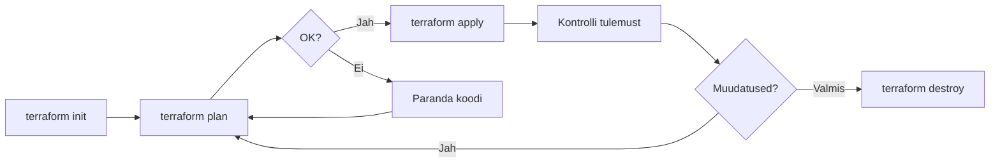

# Terraform Kodutöö: Kohalik Infrastruktuur

Loo kohalik infrastruktuur Terraform'iga. Õpid Infrastructure as Code põhimõtteid praktiliselt - kirjutad koodi mis loob faile ja konfiguratsioone automaatselt. Kodutöö võtab umbes 90 minutit.

**Eeldused:** Terraform basics labor tehtud, HCL süntaks tuttav  
**Esitamine:** GitHub link Google Classroom'i  
**Tähtaeg:** Kokkulepitud tähtajaks

---

## 1. Projekti Ülevaade

Selles kodutöös lood Terraform'iga projekti struktuuri, mis sisaldab kaustu, konfiguratsioonifaile ja skripte. See simuleerib päris elu olukorda, kus uue projekti alustamisel on vaja luua standardne kaustastruktuur.

Käsitsi teeksid seda `mkdir` ja `touch` käskudega. Terraform'iga kirjeldad soovitud lõpptulemust koodina - mis failid peavad olemas olema ja mis neis on. Kui käivitad `terraform apply`, loob Terraform kõik automaatselt. Kui muudad muutujat (nt projekti nime), uuendab Terraform kõik failid.

Lood järgmise struktuuri:

```
minu-projekt/
├── README.md           # Projekti dokumentatsioon
├── config/
│   ├── project.json    # JSON konfiguratsioon
│   └── app.yaml        # YAML konfiguratsioon
└── scripts/
    └── startup.sh      # Käivitatav skript
```

---

## 2. Failide Loomine

### 2.1 Projekti Struktuur

Looge kaust ja failid:

```bash
mkdir terraform-homework
cd terraform-homework
```

Looge 4 faili:

- `main.tf` - ressursside definitsioonid
- `variables.tf` - sisendmuutujad
- `outputs.tf` - väljundid
- `terraform.tfvars` - muutujate väärtused

### 2.2 main.tf

See on Terraformi põhifail, kus defineerid ressursid - asjad, mida Terraform loob. Iga `resource` plokk kirjeldab üht faili: mis sisu seal on ja kuhu see salvestatakse. Terraform loob failid täpselt sellises järjekorras nagu vaja - sa ei pea selle pärast muretsema.

Esimene osa määrab, millist providerit kasutame. Local provider on lihtne - ta loob faile sinu arvutis, ei vaja pilve kontot ega maksekaarti.

```hcl
# =============================================================================
# PROVIDER KONFIGURATSIOON
# =============================================================================
# Ütleme Terraformile, et kasutame local providerit.
# See provider oskab luua faile kohalikku failisüsteemi.

terraform {
  required_providers {
    local = {
      source  = "hashicorp/local"   # Terraform Registry'st
      version = "~> 2.0"            # Versioon 2.x
    }
  }
}
```

Järgmised ressursid loovad konfiguratsioonifailid. `jsonencode()` ja `yamlencode()` on Terraformi funktsioonid, mis teevad HCL andmestruktuurist JSON/YAML formaadi. See on mugavam kui käsitsi JSON-i kirjutada - Terraform hoolitseb süntaksi eest.

```hcl
# =============================================================================
# KONFIGURATSIOONIFAILID
# =============================================================================
# Loome JSON ja YAML failid, kasutades Terraformi encode funktsioone.
# See on mugavam kui käsitsi JSON-i kirjutada - süntaksivead on välistatud.

# JSON konfiguratsioon - masinloetav formaat
resource "local_file" "project_config" {
  # jsonencode() teeb HCL objektist JSON stringi
  # Väljund on korralikult vormindatud JSON
  content = jsonencode({
    project_name = var.project_name    # Muutuja väärtus
    environment  = var.environment     # Muutuja väärtus
    version      = "1.0.0"             # Staatiline väärtus
    created_at   = timestamp()         # Terraform funktsioon - praegune aeg
  })
  
  # Faili asukoht - loob automaatselt config/ kausta
  filename = "${var.project_name}/config/project.json"
}

# YAML konfiguratsioon - inimloetav formaat
resource "local_file" "app_config" {
  # yamlencode() teeb HCL objektist YAML stringi
  # Pesastatud struktuur -> YAML taanded
  content = yamlencode({
    app = {
      name = var.project_name
      port = 8080
    }
    database = {
      type = "sqlite"
      file = "app.db"
    }
  })
  filename = "${var.project_name}/config/app.yaml"
}
```

Skriptide loomisel kasutame `<<-EOF ... EOF` süntaksit, mis võimaldab kirjutada mitmerealist teksti. `file_permission = "0755"` teeb faili käivitatavaks (nagu `chmod +x`).

```hcl
# =============================================================================
# SKRIPTID JA DOKUMENTATSIOON
# =============================================================================

# Startup skript - käivitatav bash skript
resource "local_file" "startup_script" {
  # <<-EOF on heredoc - mitmerealine string
  # Muutujad ${var.xxx} asendatakse väärtustega
  content = <<-EOF
    #!/bin/bash
    # See skript käivitub projekti stardil
    
    echo "Tere tulemast ${var.project_name} projekti!"
    echo "Keskkond: ${var.environment}"
    echo ""
    echo "Konfiguratsioon:"
    # dirname $0 = skripti asukoha kaust
    # ../config/ = üks tase üles, siis config kausta
    cat "$(dirname "$0")/../config/project.json"
  EOF
  
  filename        = "${var.project_name}/scripts/startup.sh"
  file_permission = "0755"   # rwxr-xr-x = käivitatav
}

# README dokumentatsioon
resource "local_file" "readme" {
  content = <<-EOF
    # ${var.project_name}

    Projekt loodud Terraform'iga.

    ## Struktuur

    ```
    ${var.project_name}/
    ├── README.md
    ├── config/
    │   ├── project.json
    │   └── app.yaml
    └── scripts/
        └── startup.sh
    ```

    ## Kasutamine

    1. Käivita: `./scripts/startup.sh`
    2. Vaata config: `cat config/project.json`

    ## Info

    - Keskkond: ${var.environment}
    - Loodud: Terraform'iga
  EOF
  filename = "${var.project_name}/README.md"
}
```

### 2.3 variables.tf

Muutujad teevad konfiguratsiooni paindlikuks. Selle asemel, et kirjutada "minu-projekt" igale poole otse koodi, kasutad muutujat `var.project_name`. Kui tahad nime muuta, muudad ühes kohas ja Terraform uuendab kõik failid automaatselt.

`validation` plokid kontrollivad sisendi õigsust enne kui Terraform midagi teeb. Näiteks ei lase vale keskkonda valida ega liiga lühikest nime panna. See aitab vigu vältida.

```hcl
# =============================================================================
# SISENDMUUTUJAD
# =============================================================================
# Muutujad võimaldavad sama koodi kasutada erinevate väärtustega.
# Muuda siin ühe koha pealt - Terraform uuendab kõik failid.

variable "project_name" {
  description = "Projekti nimi (kasutatakse kausta nimena)"
  type        = string
  default     = "minu-projekt"

  # Validation 1: Nimi peab olema piisavalt pikk
  validation {
    condition     = length(var.project_name) >= 3
    error_message = "Projekti nimi peab olema vähemalt 3 tähemärki."
  }

  # Validation 2: Ainult lubatud märgid (failisüsteemi ühilduvus)
  # regex() kontrollib mustrit, can() püüab kinni vead
  # ^[a-z0-9-]+$ = algusest lõpuni ainult väiksed tähed, numbrid, kriipsud
  validation {
    condition     = can(regex("^[a-z0-9-]+$", var.project_name))
    error_message = "Projekti nimi võib sisaldada ainult väikseid tähti, numbreid ja kriipse."
  }
}

variable "environment" {
  description = "Keskkond (development, staging, production)"
  type        = string
  default     = "development"

  # contains() kontrollib, kas väärtus on lubatud nimekirjas
  validation {
    condition     = contains(["development", "staging", "production"], var.environment)
    error_message = "Keskkond peab olema: development, staging või production."
  }
}
```

### 2.4 outputs.tf

Väljundid näitavad infot pärast `terraform apply` käivitamist. See on kasulik, et näha, mis failid loodi ja kuhu. Päris infrastruktuuris kasutad väljundeid näiteks serveri IP-aadressi või andmebaasi URL-i kuvamiseks.

```hcl
# =============================================================================
# VÄLJUNDID
# =============================================================================
# Outputs näitavad infot pärast apply käivitamist.
# Saad neid lugeda ka: terraform output <nimi>

output "project_path" {
  description = "Projekti kausta tee"
  value       = var.project_name
}

# Keerulisem output - mitu väärtust ühes objektis
# Näitab kõigi loodud failide asukohti
output "created_files" {
  description = "Loodud failide teed"
  value = {
    readme  = local_file.readme.filename           # Viide ressursi atribuudile
    config  = local_file.project_config.filename   # local_file.<NIMI>.filename
    yaml    = local_file.app_config.filename
    script  = local_file.startup_script.filename
  }
}

output "environment" {
  description = "Valitud keskkond"
  value       = var.environment
}
```

### 2.5 terraform.tfvars

See fail sisaldab muutujate tegelikke väärtusi. Terraform loeb selle faili automaatselt. Kui tahad projekti nime või keskkonda muuta, muudad siin - mitte main.tf failis.

```hcl
# =============================================================================
# MUUTUJATE VÄÄRTUSED
# =============================================================================
# Terraform loeb selle faili automaatselt.
# Muuda siin - main.tf jääb puutumata.

project_name = "minu-projekt"      # Muuda oma projekti nimeks
environment  = "development"       # development | staging | production
```

---

## 3. Projekti Käivitamine



Nüüd on kõik failid valmis. Terraformi kasutamine käib kolmes etapis: init laeb provideri, plan näitab mida tehakse, apply teeb päriselt.

Käivita Terraform käsud:

```bash
# Initsialiseeri (laeb provider'i)
terraform init
```

Init käsk loob `.terraform` kausta ja laeb alla local provideri. Seda tuleb teha ainult üks kord projekti alguses.

```bash
# Vaata mida tehakse
terraform plan
```

Plan näitab, mitu ressurssi luuakse ja millised failid tekivad. Siin ei muudeta veel midagi - ainult vaadatakse. Harjuta alati enne apply't plan käivitama.

```bash
# Loo failid
terraform apply
```

Apply küsib kinnitust ("yes") ja loob failid. Pärast näed väljundeid - loodud failide teid.

Kontrolli tulemust:

```bash
# Vaata väljundeid
terraform output

# Vaata loodud struktuuri
tree minu-projekt/
# või kui tree pole installitud:
find minu-projekt/ -type f

# Käivita skript
./minu-projekt/scripts/startup.sh

# Vaata JSON konfiguratsioonifaili
cat minu-projekt/config/project.json

# Vaata YAML konfiguratsioonifaili
cat minu-projekt/config/app.yaml
```

---

## 4. Muudatuste Tegemine

Siin näed Terraformi tõelist jõudu. Kui tahad projekti nime muuta, ei pea käsitsi kaustu ümber nimetama ega faile muutma. Muudad ainult muutuja väärtust ja Terraform teeb ülejäänu.

Muuda `terraform.tfvars`:

```hcl
project_name = "uus-projekt"
environment  = "production"
```

Rakenda muudatused:

```bash
terraform plan    # Näitab: kustutatakse vanad, luuakse uued
terraform apply
```

Plan väljundis näed punast teksti (kustutatakse) ja rohelist (luuakse). Terraform mõistab, et failiteed muutusid ja peab vanad failid kustutama ning uued looma. See on deklaratiivse lähenemise võlu - sa kirjeldad soovitud lõppseisu ja Terraform väljastab sammud sinna jõudmiseks.

---

## 5. Lisaülesanne: Cleanup Skript

Nüüd lisad olemasolevale projektile uue ressursi. See näitab, kuidas Terraform käsitleb muudatusi - ta ei loo kõike uuesti, vaid lisab ainult puuduva.

Lisa `main.tf` faili lõppu veel üks ressurss:

```hcl
# Cleanup skript
resource "local_file" "cleanup_script" {
  content = <<-EOF
    #!/bin/bash
    echo "Puhastan ${var.project_name}..."
    cd "$(dirname "$0")/.."
    rm -f *.tmp *.log *.bak
    echo "Ajutised failid kustutatud!"
  EOF
  filename        = "${var.project_name}/scripts/cleanup.sh"
  file_permission = "0755"
}
```

Lisa `outputs.tf` faili `created_files` outputi uus rida:

```hcl
output "created_files" {
  description = "Loodud failide teed"
  value = {
    readme  = local_file.readme.filename
    config  = local_file.project_config.filename
    yaml    = local_file.app_config.filename
    script  = local_file.startup_script.filename
    cleanup = local_file.cleanup_script.filename  # Lisa see rida
  }
}
```

Rakenda ja testi:

```bash
terraform plan   # Näitab: 1 to add (ainult cleanup.sh)
terraform apply
./minu-projekt/scripts/cleanup.sh
```

Pane tähele, et plan näitab "1 to add" - Terraform teab, et teised failid on juba olemas ja lisab ainult uue.

---

## 6. Puhastamine

Kui oled lõpetanud, saad Terraformiga kõik loodud ressursid kustutada. See on oluline oskus - päris infrastruktuuris ei taha sa maksta ressursside eest, mida enam ei kasuta.

```bash
terraform destroy
```

Terraform näitab, mida kavatseb kustutada ja küsib kinnitust. Kirjuta "yes" ja kõik Terraformi loodud failid kustutatakse.

Tühjad kaustad võivad jääda alles - Terraform haldab ainult faile, mitte kaustu. Kustuta need käsitsi kui soovid:

```bash
rm -rf minu-projekt/
```

---

## Esitamine

### Kontroll Enne Esitamist

- [ ] Kõik 4 Terraform faili on loodud (main.tf, variables.tf, outputs.tf, terraform.tfvars)
- [ ] `terraform init` töötab
- [ ] `terraform plan` näitab 4+ ressurssi
- [ ] `terraform apply` loob struktuuri ilma vigadeta
- [ ] Loodud failide struktuur on õige:

```
minu-projekt/
├── README.md
├── config/
│   ├── project.json
│   └── app.yaml
└── scripts/
    └── startup.sh
```

- [ ] Skript käivitub: `./minu-projekt/scripts/startup.sh`
- [ ] `terraform output` näitab loodud failide teid
- [ ] Muutujate muutmine ja uuesti apply töötab
- [ ] Lisaülesanne tehtud (cleanup skript)
- [ ] `terraform destroy` kustutab failid
- [ ] Kõik failid on GitHub'is

### GitHub Repository

```bash
# Lisa .gitignore ENNE commitimist
cat > .gitignore << 'EOF'
# Terraform
.terraform/
*.tfstate
*.tfstate.*
.terraform.lock.hcl

# Loodud projekt (see on output, mitte source)
minu-projekt/
uus-projekt/
EOF

# Initsialiseeri ja commit
git init
git add .
git commit -m "Terraform homework - local infrastructure"
git branch -M main
git remote add origin https://github.com/[sinu-kasutaja]/terraform-homework.git
git push -u origin main
```

### Esitamine Google Classroom'i

Esita oma GitHub repository link Google Classroom'i. Veendu, et repository on avalik (public) või anna õpetajale ligipääs.

---

## Refleksioon

Vasta küsimustele (2-3 lauset igaüks):

1. **Mis oli kõige lihtsam osa Terraform'i juures?**

   [Sinu vastus]

2. **Mis oli keerulisem kui arvasid?**

   [Sinu vastus]

3. **Kuidas Infrastructure as Code erineb käsitsi failide loomisest?**

   [Sinu vastus]

4. **Kus saaksid seda päris töös kasutada?**

   [Sinu vastus]

5. **Mida tahaksid järgmisena Terraform'i kohta õppida?**

   [Sinu vastus]

---

## Hindamiskriteeriumid

| Kriteerium | Punktid | Kirjeldus |
|------------|---------|-----------|
| **Põhifunktsioonid** | 60% | |
| - Terraform failid olemas | 15% | main.tf, variables.tf, outputs.tf, terraform.tfvars |
| - Terraform töötab | 15% | init, plan, apply käsud töötavad |
| - Failide struktuur õige | 15% | config/, scripts/, README.md |
| - Skript käivitub | 15% | startup.sh töötab |
| **Kood** | 20% | |
| - Variables kasutatud | 10% | Muutujad on eraldi failis |
| - Outputs defineeritud | 10% | Näitab loodud failide teid |
| **Dokumentatsioon** | 20% | |
| - README selge | 10% | Selgitab mis ja kuidas |
| - Refleksioon täidetud | 10% | Vastused on mõtestatud |
| **Boonus** | +10% | |
| - Cleanup skript | +5% | Lisaülesanne tehtud |
| - Production backup | +5% | Tingimuslik ressurss |

---

## Boonus (+10%)

### 1. Cleanup Skript (+5%)

Kui tegid lisaülesande (sektsioon 5), saad 5% boonust.

### 2. Production Backup Skript (+5%)

See ülesanne õpetab tingimuslikku ressursi loomist. Mõnikord tahad, et teatud ressurss eksisteeriks ainult teatud tingimustel - näiteks backup skript ainult production keskkonnas, sest development'is pole seda vaja.

`count` argument koos tingimusega teeb seda: kui `count = 1`, siis ressurss luuakse; kui `count = 0`, siis mitte.

Lisa `main.tf` faili ressurss mis loob backup skripti **ainult** production keskkonnas:

```hcl
# Backup skript - ainult production keskkonnas
resource "local_file" "backup_script" {
  count = var.environment == "production" ? 1 : 0

  content = <<-EOF
    #!/bin/bash
    echo "Backup käivitatud: $(date)"
    tar -czf backup-$(date +%Y%m%d).tar.gz config/
    echo "Backup loodud!"
  EOF
  filename        = "${var.project_name}/scripts/backup.sh"
  file_permission = "0755"
}
```

Kui tahad backup faili ka outputs'is näidata, lisa `outputs.tf` faili:

```hcl
output "backup_script" {
  description = "Backup skripti tee (ainult production)"
  value       = try(local_file.backup_script[0].filename, null)
}
```

`try()` funktsioon tagastab `null` kui ressurssi ei eksisteeri (st development/staging keskkonnas). Ilma `try()` funktsioonita saaksid vea, sest `count = 0` korral ei ole `backup_script[0]` olemas.

Testi:

```bash
# Development - backup.sh EI looda
terraform apply -var="environment=development"
ls minu-projekt/scripts/  # ainult startup.sh

# Production - backup.sh luuakse
terraform apply -var="environment=production"
ls minu-projekt/scripts/  # startup.sh JA backup.sh
```

---

## Abi ja Troubleshooting

### "Error: Could not load plugin"

```bash
terraform init
```

### "Error creating file: no such directory"

Local provider loob kataloogid automaatselt. Kui siiski viga, kontrolli et `project_name` ei sisalda keelatud märke.

### Permission denied skripti käivitamisel

```bash
chmod +x minu-projekt/scripts/startup.sh
```

### Terraform destroy ei kustuta kaustu

Terraform kustutab ainult failid, mitte tühje kaustu. Kustuta käsitsi:

```bash
rm -rf minu-projekt/
```

### Vale keskkond valitud

```bash
terraform apply -var="environment=development"
# või muuda terraform.tfvars faili
```

---

Edu kodutööga!
