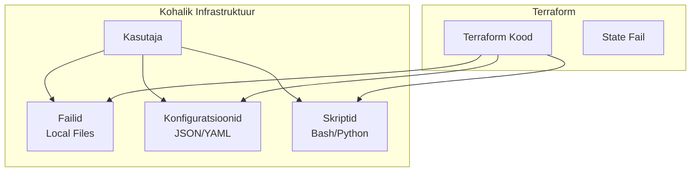

# Terraform Kodutöö: AWS Backup (Alternatiiv)

**Tähtaeg:** Järgmise nädala alguseks  
**Eesmärk:** AWS ressursside loomine Terraform'iga  
**Raskusaste:** Keskmine

---

## Ülesande kirjeldus

AWS-põhine alternatiiv Terraform kodutööle. Fookus on AWS ressursside loomisel Terraform'iga!

---

## **Projekt: Kohalik Infrastruktuur Terraform'iga**

### Mis on see projekt?

Looge kohalik infrastruktuur Terraform'i abil. See on nagu "digitaalse maja ehitamine" kohalikus arvutis - kirjutate üles, mida soovite, ja Terraform teeb selle teie eest.

### Mida te ehitate?

** Kohalik Infrastruktuur**
- **Failid ja kaustad** - projektifailide struktuur
- **Konfiguratsioonid** - JSON ja YAML failid
- **Skriptid** - automatiseerimise skriptid

### Miks see on kasulik?

- **Õpite Terraform'i** - praktiline kogemus
- **Lihtne alustada** - töötab kohalikus arvutis
- **Reaalne projekt** - failide ja konfiguratsiooni haldamine
- **Taaskasutatav** - sama kood töötab erinevates arvutites

### Miks see arhitektuur on hea õppimiseks?

** Lihtne ja selge:**
- **Kohalik** - ei vaja internetti ega pilve
- **Praktiline** - õpite Terraform'i põhitõdesid
- **Skaleeritav** - saate hiljem liikuda pilve

** Infrastruktuuri komponendid:**
```
Kohalik Infrastruktuur:
├── Projektifailid
├── Konfiguratsioonid (JSON/YAML)
└── Skriptid ja dokumentatsioon
```

** Mida õpite:**
- Kuidas kirjutada Terraform koodi
- Kuidas kasutada variable'id ja outputs
- Kuidas seadistada kohalikke ressursse
- Kuidas debugida probleeme

### Arhitektuuri diagramm



---

##  **Ülesanne 1: Projekti struktuuri loomine**

### Samm 1: Projekti kataloogi struktuur

**Looge lihtne kataloogi struktuur:**

```bash
terraform-basics-homework/
├── main.tf          # Põhiline Terraform fail
├── variables.tf     # Muutujad
├── outputs.tf       # Väljundid
├── terraform.tfvars # Muutujate väärtused
└── README.md        # Projekti kirjeldus
```

**Või kasutage valmis näidet:**

```bash
# Kopeerige valmis struktuur
cp -r teacher_repo/terraform-basics-starter/templates/* .
```

### Samm 2: Providers konfiguratsioon

**Looge `providers.tf`:**

```hcl
# Configure Terraform
terraform {
  required_version = ">= 1.0"
  
  required_providers {
    local = {
      source  = "hashicorp/local"
      version = "~> 2.0"
    }
    random = {
      source  = "hashicorp/random"
      version = "~> 3.0"
    }
  }
}

# Local provider - töötab kohalikus failisüsteemis
# Ei vaja mingeid lisaseadeid
```

**Märkus state haldamise kohta:**

Kohalikus keskkonnas kasutame `terraform.tfstate` faili, mis luuakse automaatselt. See on OK õppimiseks, aga real-world projektides kasutage remote state'd.

---

##  **Ülesanne 2: Lihtne Terraform projekt**

### Samm 1: Provider konfiguratsioon

**Alustame `main.tf` faili loomisega. See fail ütleb Terraform'ile, milliseid teenuseid kasutame:**

```hcl
terraform {
  required_providers {
    local = {
      source  = "hashicorp/local"
      version = "~> 2.0"
    }
    random = {
      source  = "hashicorp/random"
      version = "~> 3.0"
    }
  }
}

# Local provider - töötab kohalikus failisüsteemis
# Random provider - genereerib juhuslikke väärtusi
```

**Miks see vajalik on?**
- `terraform` blokk ütleb Terraform'ile: "Hei, ma tahan kasutada kohalikke teenuseid"
- `local` provider töötab failisüsteemiga
- `random` provider aitab luua unikaalseid nimesid

**Mida see teeb?**
- Terraform teab nüüd, et peab kasutama kohalikke ressursse
- Kõik failid luuakse kohalikus arvutis
- Ei vaja internetti ega pilve

### Samm 2: Kataloogi loomine

**Nüüd loome projekti kataloogi. Mõtle seda nagu "maja" failisüsteemis:**

```hcl
# Projekti kaust
resource "local_directory" "project_root" {
  path = "${path.module}/${var.project_name}"
}

# Alamkaustad
resource "local_directory" "config" {
  path = "${local_directory.project_root.path}/config"
}

resource "local_directory" "scripts" {
  path = "${local_directory.project_root.path}/scripts"
}
```

**Miks see vajalik on?**
- Ilma kaustateta ei saa organiseerida faile
- Kaustad on nagu "toad majas" - iga tüüp faile elab omas kohas
- `path.module` näitab, kus praegune Terraform fail asub

**Mida see teeb?**
- Loob projekti põhikausta
- Loob alamkaustad konfiguratsioonide ja skriptide jaoks
- Kõik järgmised failid saab organiseeritult paigutada

### Samm 3: Konfiguratsioonifailide loomine

**Nüüd loome konfiguratsioonifaile. Mõtle seda nagu seadete failid:**

```hcl
# Projekti konfiguratsioon JSON vormingus
resource "local_file" "project_config" {
  content = jsonencode({
    project_name = var.project_name
    environment  = var.environment
    version      = "1.0.0"
    created_at   = timestamp()
    author       = "Terraform Student"
  })
  filename = "${local_directory.config.path}/project.json"
}
```

**Miks see vajalik on?**
- Konfiguratsioonifailid hoiavad projekti seadeid
- JSON formaat on masinloetav ja inimloetav
- `jsonencode()` muudab Terraform objekti JSON stringiks

**Mida see teeb?**
- Loob JSON faili projekti konfiguratsiooniga
- Sisaldab projekti nime, versiooni ja loomise aega
- Fail salvestatakse config/ kausta

### Samm 4: Skriptifailide loomine

**Nüüd loome skriptifaile. Mõtle seda nagu automatiseerimise tööriistad:**

```hcl
# Käivitamise skript
resource "local_file" "startup_script" {
  content = <<-EOF
#!/bin/bash
    echo "Tere tulemast ${var.project_name} projekti!"
    echo "Keskkond: ${var.environment}"
    echo "Versioon: 1.0.0"
    echo "Kuupäev: $(date)"
    echo "Kaust: $(pwd)"
  EOF
  filename = "${local_directory.scripts.path}/startup.sh"
  file_permission = "0755"  # Täitmisõigus
}
```

**Miks see vajalik on?**
- Skriptid automatiseerivad korduvaid ülesandeid
- `file_permission = "0755"` annab täitmisõiguse
- `<<-EOF` võimaldab kirjutada mitmerealine tekst

**Mida see teeb?**
- Loob Bash skripti, mis kuvab projekti infot
- Annab skriptile täitmisõigused
- Kasutab muutujaid projekti nime ja keskkonna jaoks

### Samm 5: Route Table

**Nüüd loome marsruutimistabeli. See ütleb, kuidas liiklus liigub:**

```hcl
# Route Table - marsruutimistabel
resource "aws_route_table" "public" {
  vpc_id = aws_vpc.main.id
  
  route {
    cidr_block = "0.0.0.0/0"  # Kõik liiklus
    gateway_id = aws_internet_gateway.main.id  # Läheb internetti
  }
  
  tags = {
    Name = "${var.project_name}-public-rt"
  }
}

# Route Table Association - seob marsruutimistabeli subnet'iga
resource "aws_route_table_association" "public" {
  subnet_id      = aws_subnet.public.id
  route_table_id = aws_route_table.public.id
}
```

**Miks see vajalik on?**
- Ilma marsruutimistabelita ei tea serverid, kuhu liiklus saata
- `0.0.0.0/0` tähendab "kõik liiklus"
- `association` seob selle reegli subnet'iga

**Mida see teeb?**
- `route` ütleb: "Kõik liiklus (0.0.0.0/0) läheb internetti"
- `association` ütleb: "See reegel kehtib kõigile serveritele selles subnet'is"
- Nüüd saavad serverid internetti pääseda

### Samm 6: Security Group

**Nüüd loome Security Group. Mõtle seda nagu tulemüür:**

```hcl
# Security Group - tulemüür reeglid
resource "aws_security_group" "web" {
  name        = "${var.project_name}-web-sg"
  description = "Security group for web server"
  vpc_id      = aws_vpc.main.id
  
# Lubame HTTP liiklust (port 80)
  ingress {
    description = "HTTP"
    from_port   = 80
    to_port     = 80
    protocol    = "tcp"
    cidr_blocks = ["0.0.0.0/0"]  # Kõikidele
  }
  
# Lubame SSH liiklust (port 22)
  ingress {
    description = "SSH"
    from_port   = 22
    to_port     = 22
    protocol    = "tcp"
    cidr_blocks = ["0.0.0.0/0"]  # Kõikidele
  }
  
# Lubame kõiki väljuvat liiklust
  egress {
    from_port   = 0
    to_port     = 0
    protocol    = "-1"
    cidr_blocks = ["0.0.0.0/0"]
  }
  
  tags = {
    Name = "${var.project_name}-web-sg"
  }
}
```

**Miks see vajalik on?**
- Ilma Security Group'ita on serverid avatud kõigile
- See on nagu "tulemüür" - kontrollib, kes pääseb serverisse
- Port 80 = veebilehed (HTTP)
- Port 22 = serveri haldamine (SSH)

**Mida see teeb?**
- `ingress` = sissetulev liiklus (kellele lubame pääseda)
- `egress` = väljuv liiklus (kuhu lubame minna)
- Port 80 = lubame kõigile vaadata veebilehte
- Port 22 = lubame kõigile ühenduda serveriga (SSH)

### Samm 7: EC2 Instance

**Nüüd loome web serveri. See on nagu arvuti pilves:**

```hcl
# EC2 Instance - web server
resource "aws_instance" "web" {
  ami           = data.aws_ami.ubuntu.id
  instance_type = var.instance_type
  
  subnet_id                   = aws_subnet.public.id
  vpc_security_group_ids      = [aws_security_group.web.id]
  associate_public_ip_address = true
  
# Skript, mis käivitub serveri käivitamisel
  user_data = <<-EOF
#!/bin/bash
              apt-get update
              apt-get install -y nginx
              systemctl start nginx
              systemctl enable nginx
              EOF
  
  tags = {
    Name = "${var.project_name}-web-server"
  }
}
```

**Miks see vajalik on?**
- See on meie web server - siin jookseb veebileht
- `user_data` installib automaatselt nginx'i
- `associate_public_ip_address = true` annab avaliku IP

**Mida see teeb?**
- `ami` = operatsioonisüsteemi pilt (Ubuntu)
- `instance_type` = serveri tüüp (t3.micro = väike ja odav)
- `user_data` = skript, mis installib nginx'i serveri käivitamisel
- `associate_public_ip_address = true` = annab avaliku IP, et saaksime serverile pääseda

### Samm 8: Data Source

**Viimane samm - leiame Ubuntu AMI:**

```hcl
# Data source - leiab uusima Ubuntu AMI
data "aws_ami" "ubuntu" {
  most_recent = true
  owners      = ["099720109477"]  # Canonical (Ubuntu looja)
  
  filter {
    name   = "name"
    values = ["ubuntu/images/hvm-ssd/ubuntu-focal-20.04-amd64-server-*"]
  }
}
```

**Miks see vajalik on?**
- `data` blokk ei loo uut ressurssi, vaid otsib olemasolevat
- Meil on vaja Ubuntu AMI't serveri jaoks
- `most_recent = true` võtab uusima versiooni

**Mida see teeb?**
- `data` blokk otsib olemasolevat ressurssi (ei loo uut)
- `most_recent = true` = võtab uusima versiooni
- `filter` = otsib ainult Ubuntu 20.04 AMI'sid
- `owners` = ainult Canonical (Ubuntu looja) AMI'd

### Samm 2: VPC loomine

**Lisa VPC (Virtual Private Cloud) - see on nagu privaatne võrk AWS's:**

```hcl
# VPC - privaatne võrk AWS's
resource "aws_vpc" "main" {
  cidr_block = "10.0.0.0/16"
  
  tags = {
    Name = "${var.project_name}-vpc"
  }
}
```

**Mida see teeb?**
- Loob privaatse võrgu AWS's
- `cidr_block` määrab võrgu suuruse (10.0.0.0/16 = 65,536 IP aadressi)
- `tags` aitab identifitseerida ressurssi

### Samm 3: Subnet loomine

**Lisa subnet - see on nagu alamvõrk VPC sees:**

```hcl
# Public Subnet - alamvõrk, mis on avalik internetile
resource "aws_subnet" "public" {
  vpc_id                  = aws_vpc.main.id
  cidr_block              = "10.0.1.0/24"
  availability_zone       = "${var.aws_region}a"
  map_public_ip_on_launch = true
  
  tags = {
    Name = "${var.project_name}-public-subnet"
  }
}
```

**Mida see teeb?**
- Loob alamvõrgu VPC sees
- `map_public_ip_on_launch = true` annab serveritele avaliku IP
- `availability_zone` määrab, millises AWS tsoonis asub

### Samm 4: Internet Gateway

**Lisa Internet Gateway - see ühendab võrgu internetti:**

```hcl
# Internet Gateway - ühendab võrgu internetti
resource "aws_internet_gateway" "main" {
  vpc_id = aws_vpc.main.id
  
  tags = {
    Name = "${var.project_name}-igw"
  }
}
```

**Mida see teeb?**
- Loob "värava" internetti
- Ilma selleta ei saa serverid internetti pääseda

### Samm 5: Route Table

**Lisa marsruutimistabel - see ütleb, kuidas liiklus liigub:**

```hcl
# Route Table - marsruutimistabel
resource "aws_route_table" "public" {
  vpc_id = aws_vpc.main.id
  
  route {
    cidr_block = "0.0.0.0/0"  # Kõik liiklus
    gateway_id = aws_internet_gateway.main.id  # Läheb internetti
  }
  
  tags = {
    Name = "${var.project_name}-public-rt"
  }
}

# Route Table Association - seob marsruutimistabeli subnet'iga
resource "aws_route_table_association" "public" {
  subnet_id      = aws_subnet.public.id
  route_table_id = aws_route_table.public.id
}
```

**Mida see teeb?**
- `route` ütleb: "kõik liiklus (0.0.0.0/0) läheb internetti"
- `association` seob selle reegli subnet'iga

### Samm 6: Security Group

**Lisa Security Group - see on nagu tulemüür:**

```hcl
# Security Group - tulemüür reeglid
resource "aws_security_group" "web" {
  name        = "${var.project_name}-web-sg"
  description = "Security group for web server"
  vpc_id      = aws_vpc.main.id
  
# Lubame HTTP liiklust (port 80)
  ingress {
    description = "HTTP"
    from_port   = 80
    to_port     = 80
    protocol    = "tcp"
    cidr_blocks = ["0.0.0.0/0"]  # Kõikidele
  }
  
# Lubame SSH liiklust (port 22)
  ingress {
    description = "SSH"
    from_port   = 22
    to_port     = 22
    protocol    = "tcp"
    cidr_blocks = ["0.0.0.0/0"]  # Kõikidele
  }
  
# Lubame kõiki väljuvat liiklust
  egress {
    from_port   = 0
    to_port     = 0
    protocol    = "-1"
    cidr_blocks = ["0.0.0.0/0"]
  }
  
  tags = {
    Name = "${var.project_name}-web-sg"
  }
}
```

**Mida see teeb?**
- `ingress` = sissetulev liiklus (kellele lubame pääseda)
- `egress` = väljuv liiklus (kuhu lubame minna)
- Port 80 = HTTP (veebilehed)
- Port 22 = SSH (serveri haldamine)

### Samm 7: EC2 Instance

**Lisa web server:**

```hcl
# EC2 Instance - web server
resource "aws_instance" "web" {
  ami           = data.aws_ami.ubuntu.id
  instance_type = var.instance_type
  
  subnet_id                   = aws_subnet.public.id
  vpc_security_group_ids      = [aws_security_group.web.id]
  associate_public_ip_address = true
  
# Skript, mis käivitub serveri käivitamisel
  user_data = <<-EOF
#!/bin/bash
              apt-get update
              apt-get install -y nginx
              systemctl start nginx
              systemctl enable nginx
              EOF
  
  tags = {
    Name = "${var.project_name}-web-server"
  }
}
```

**Mida see teeb?**
- `ami` = operatsioonisüsteemi pilt (Ubuntu)
- `instance_type` = serveri tüüp (t3.micro = väike ja odav)
- `user_data` = skript, mis installib nginx'i
- `associate_public_ip_address = true` = annab avaliku IP

### Samm 8: Data Source

**Lisa data source Ubuntu AMI jaoks:**

```hcl
# Data source - leiab uusima Ubuntu AMI
data "aws_ami" "ubuntu" {
  most_recent = true
  owners      = ["099720109477"]  # Canonical (Ubuntu looja)
  
  filter {
    name   = "name"
    values = ["ubuntu/images/hvm-ssd/ubuntu-focal-20.04-amd64-server-*"]
  }
}
```

**Mida see teeb?**
- `data` blokk otsib olemasolevat ressurssi (ei loo uut)
- `most_recent = true` = võtab uusima versiooni
- `filter` = otsib ainult Ubuntu 20.04 AMI'sid

---

##  **Ülesanne 3: Variables ja outputs failid**

### Samm 1: Variables fail

**Nüüd loome `variables.tf` faili. See fail määrab muutujad, mida saame muuta:**

```hcl
variable "project_name" {
  description = "Projekti nimi"
  type        = string
  default     = "terraform-basics-homework"
}

variable "environment" {
  description = "Keskkonna nimi"
  type        = string
  default     = "development"
  
  validation {
    condition     = contains(["development", "staging", "production"], var.environment)
    error_message = "Keskkond peab olema: development, staging või production."
  }
}

variable "file_count" {
  description = "Loodavate näidisfailide arv"
  type        = number
  default     = 5
  
  validation {
    condition     = var.file_count > 0 && var.file_count <= 20
    error_message = "Failide arv peab olema vahemikus 1-20."
  }
}
```

**Miks see vajalik on?**
- `variables` võimaldavad meil muuta väärtusi ilma koodi muutmata
- `default` väärtused tähendavad, et kui me ei määra midagi, kasutatakse neid
- `validation` kontrollib, et väärtused oleksid korrektsed

**Mida see teeb?**
- `project_name` = projekti nimi, mida kasutatakse failide nimetamisel
- `environment` = keskkonna nimi (development, staging, production)
- `file_count` = kui palju näidisfaile luua (1-20 vahel)

### Samm 2: Outputs fail

**Nüüd loome `outputs.tf` faili. See fail näitab meile olulisi infosid pärast käivitamist:**

```hcl
output "project_directory" {
  description = "Projekti kausta tee"
  value       = local_directory.project_root.path
}

output "config_files" {
  description = "Loodud konfiguratsioonifailide nimekiri"
  value = [
    local_file.project_config.filename,
  ]
}

output "script_files" {
  description = "Loodud skriptifailide nimekiri"
  value = [
    local_file.startup_script.filename,
  ]
}

output "project_summary" {
  description = "Projekti kokkuvõte"
  value = "Projekt '${var.project_name}' keskkond '${var.environment}' loodud ${timestamp()}"
}
```

**Miks see vajalik on?**
- `outputs` näitavad meile olulisi infosid pärast `terraform apply`
- Ilma nendeta peaksime käsitsi failisüsteemist otsima
- `project_summary` annab meile kohe ülevaate projektist

**Mida see teeb?**
- `project_directory` = Projekti kausta asukoht
- `config_files` = Kõik loodud konfiguratsioonifailid
- `script_files` = Kõik loodud skriptifailid
- `project_summary` = Projekti kokkuvõtte string

### Samm 3: Terraform.tfvars fail

**Nüüd loome `terraform.tfvars` faili. See fail määrab muutujate väärtused:**

```hcl
aws_region   = "us-east-1"
project_name = "terraform-basics-homework"
instance_type = "t3.micro"
```

**Miks see vajalik on?**
- `terraform.tfvars` fail määrab muutujate väärtused
- Saame muuta väärtusi ilma koodi muutmata
- Kui tahame muuta regiooni, muudame ainult `aws_region` väärtust

**Mida see teeb?**
- `aws_region = "us-east-1"` = töötame US East regioonis
- `project_name = "terraform-basics-homework"` = projekti nimi
- `instance_type = "t3.micro"` = kasutame väikest ja odavat serverit

### Samm 4: Projekti käivitamine

**Nüüd käivitame projekti. Järgige samme täpselt:**

```bash
# Samm 1: Initsialiseerige Terraform
terraform init
```

**Mida see teeb?**
- Allalaadib AWS provider'i
- Seadistab Terraform'i töötama

```bash
# Samm 2: Vaadake, mida luuakse
terraform plan
```

**Mida see teeb?**
- Näitab, mida Terraform kavatseb luua
- Kontrollige, et kõik õige on
- Kui midagi valesti, parandage ja käivitage uuesti

```bash
# Samm 3: Looge infrastruktuur
terraform apply
```

**Mida see teeb?**
- Loob kõik ressursid AWS's
- Võtab umbes 2-3 minutit
- Kui küsib kinnitust, kirjutage "yes"

### Samm 5: Testige web serverit

**Pärast `terraform apply` lõppemist näete outputs:**

```
web_server_public_ip = "3.123.45.67"
web_server_url = "http://3.123.45.67"
```

**Avage brauser ja minge aadressile:**
```
http://[web_server_public_ip]
```

**Mida peaksite nägema?**
- Nginx tervitusleht: "Welcome to nginx!"
- See tähendab, et kõik töötab õigesti!

**Miks see töötab?**
- Server on käivitatud Ubuntu'ga
- Nginx on automaatselt installitud (`user_data` skript)
- Security Group lubab HTTP liiklust (port 80)
- Avalik IP võimaldab meil serverile pääseda
  password = var.db_password
  
  vpc_security_group_ids = var.security_group_ids
  db_subnet_group_name   = aws_db_subnet_group.main.name
  
  skip_final_snapshot = true
  deletion_protection = var.environment == "production" ? true : false
  
  tags = {
    Name = "${var.project_name}-${var.environment}-db"
  }
}
```

### Samm 3: Database module outputs

**Looge `modules/database/outputs.tf`:**

```hcl
output "db_instance_id" {
  description = "ID of the RDS instance"
  value       = aws_db_instance.main.id
}

output "db_endpoint" {
  description = "Endpoint of the RDS instance"
  value       = aws_db_instance.main.endpoint
}

output "db_port" {
  description = "Port of the RDS instance"
  value       = aws_db_instance.main.port
}
```

---

##  **Ülesanne 4: AWS konsooli uurimine**

### Samm 1: AWS konsooli avamine

**Avage AWS konsool ja vaadake, mida Terraform on loonud:**

1. **Minge AWS konsooli:** https://console.aws.amazon.com
2. **Valige regioon:** Vaadake, kas on valitud õige regioon (us-east-1)
3. **Vaadake EC2 teenust:** Minge EC2 → Instances

**Mida peaksite nägema?**
- Üks EC2 instance nimega "terraform-basics-homework-web-server"
- Instance state peaks olema "running"
- Public IP peaks olema sama, mis Terraform outputs'is

### Samm 2: VPC uurimine

**Minge VPC teenusse ja vaadake võrku:**

1. **Minge VPC teenusse:** VPC → Your VPCs
2. **Vaadake VPC't:** Peaksite nägema VPC't nimega "terraform-basics-homework-vpc"
3. **Vaadake subnets:** Minge Subnets ja vaadake subnet'i

**Mida peaksite nägema?**
- VPC CIDR: 10.0.0.0/16
- Subnet CIDR: 10.0.1.0/24
- Subnet on "public" (map public IP = yes)

### Samm 3: Security Groups uurimine

**Minge Security Groups ja vaadake tulemüüri reegleid:**

1. **Minge Security Groups:** VPC → Security Groups
2. **Vaadake web security group'i:** Nimi peaks olema "terraform-basics-homework-web-sg"

**Mida peaksite nägema?**
- Inbound rules: Port 80 (HTTP) ja Port 22 (SSH)
- Outbound rules: All traffic (0.0.0.0/0)

**Miks see oluline on?**
- Security Groups on nagu tulemüür
- Need kontrollivad, kes pääseb serverisse
- Ilma nendeta ei saaks veebilehte vaadata

##  **Ülesanne 5: Eksperimenteerimine ja muutmine**

### Samm 1: Regiooni muutmine

**Muutke AWS regiooni ja vaadake, mis juhtub:**

1. **Muutke `terraform.tfvars` faili:**
```hcl
aws_region   = "eu-west-1"  # Muutke us-east-1 asemel
project_name = "terraform-basics-homework"
instance_type = "t3.micro"
```

2. **Käivitage uuesti:**
```bash
terraform plan
terraform apply
```

**Mida peaksite nägema?**
- Terraform ütleb: "aws_vpc.main: Destroying" ja "aws_vpc.main: Creating"
- Kõik ressursid luuakse uues regioonis
- Uus IP aadress

**Miks see juhtub?**
- AWS regioonid on erinevad andmekeskused
- Ressursid ei saa liikuda regioonide vahel
- Terraform kustutab vanad ja loob uued

### Samm 2: Instance tüübi muutmine

**Muutke serveri tüüpi ja vaadake erinevust:**

1. **Muutke `terraform.tfvars` faili:**
```hcl
aws_region   = "eu-west-1"
project_name = "terraform-basics-homework"
instance_type = "t3.small"  # Muutke t3.micro asemel
```

2. **Käivitage:**
```bash
terraform plan
terraform apply
```

**Mida peaksite nägema?**
- Terraform ütleb: "aws_instance.web: Modifying"
- Server taaskäivitatakse
- Veebileht jääb samaks

**Miks see juhtub?**
- Instance tüüp määrab serveri võimsuse
- `t3.small` on võimsam kui `t3.micro`
- Server peab taaskäivituma, et muutused jõuaksid kohale

### Samm 3: HTTPS lisamine

**Lisage HTTPS tugi (port 443):**

1. **Muutke `main.tf` faili security group'i:**
```hcl
# Lisa see ingress reegel olemasoleva HTTP reegli juurde
ingress {
  description = "HTTPS"
  from_port   = 443
  to_port     = 443
  protocol    = "tcp"
  cidr_blocks = ["0.0.0.0/0"]
}
```

2. **Käivitage:**
```bash
terraform plan
terraform apply
```

**Mida peaksite nägema?**
- Terraform ütleb: "aws_security_group.web: Modifying"
- Security group muudetakse ilma serveri taaskäivitamata

**Miks see juhtub?**
- Security Groups on võrgu tasemel
- Server ei pea taaskäivituma
- Muutused on kohe aktiivsed

### Samm 4: Custom veebileht

**Lisage oma veebileht serverile:**

1. **Muutke `main.tf` faili user_data skripti:**
```hcl
user_data = <<-EOF
#!/bin/bash
apt-get update
apt-get install -y nginx
systemctl start nginx
systemctl enable nginx

# Lisa custom veebileht
cat > /var/www/html/index.html << 'HTML'
<!DOCTYPE html>
<html>
<head>
    <title>Minu Terraform Projekt</title>
</head>
<body>
    <h1>Tere! See on minu Terraform projekt</h1>
    <p>Server: $(hostname)</p>
    <p>Kuupäev: $(date)</p>
    <p>Regioon: eu-west-1</p>
</body>
</html>
HTML
EOF
```

2. **Käivitage:**
```bash
terraform plan
terraform apply
```

**Mida peaksite nägema?**
- Terraform ütleb: "aws_instance.web: Modifying"
- Server taaskäivitatakse
- Brauseris näete oma custom veebilehte

**Miks server taaskäivitatakse?**
- `user_data` muutub ainult serveri taaskäivitamisel
- Terraform kustutab vana serveri ja loob uue

##  **Ülesanne 6: Probleemide lahendamine**

### Samm 1: Vale regioon

**Proovige kasutada vale regiooni ja vaadake, mis juhtub:**

1. **Muutke `terraform.tfvars` faili:**
```hcl
aws_region   = "invalid-region"  # Vale regioon
project_name = "terraform-basics-homework"
instance_type = "t3.micro"
```

2. **Käivitage:**
```bash
terraform plan
```

**Mida peaksite nägema?**
- Error: "Invalid region"
- Terraform ei saa töötada

**Kuidas parandada?**
- Muutke regioon tagasi õigeks (nt eu-west-1)
- Käivitage `terraform plan` uuesti

### Samm 2: Vale instance tüüp

**Proovige kasutada vale instance tüüpi:**

1. **Muutke `terraform.tfvars` faili:**
```hcl
aws_region   = "eu-west-1"
project_name = "terraform-basics-homework"
instance_type = "invalid-type"  # Vale tüüp
```

2. **Käivitage:**
```bash
terraform plan
```

**Mida peaksite nägema?**
- Error: "Invalid instance type"
- Terraform ei saa luua serverit

**Kuidas parandada?**
- Muutke tüüp tagasi õigeks (nt t3.micro)
- Käivitage `terraform plan` uuesti

### Samm 3: Vale CIDR blokk

**Proovige kasutada vale VPC CIDR blokki:**

1. **Muutke `main.tf` faili VPC CIDR:**
```hcl
cidr_block = "256.256.256.256/16"  # Vale CIDR
```

2. **Käivitage:**
```bash
terraform plan
```

**Mida peaksite nägema?**
- Error: "Invalid CIDR block"
- Terraform ei saa luua VPC't

**Kuidas parandada?**
- Muutke CIDR tagasi õigeks (10.0.0.0/16)
- Käivitage `terraform plan` uuesti

##  **Ülesanne 7: Projekti testimine ja puhastamine**

### Samm 1: Testige kõiki muudatusi

**Testige, et kõik töötab:**

1. **Avage brauser ja minge aadressile:**
```
http://[web_server_public_ip]
```

2. **Vaadake, et näete oma custom veebilehte**

3. **Kontrollige AWS konsoolis, et kõik ressursid on olemas**

### Samm 2: Puhastage ressursid

**Kustutage kõik ressursid:**

```bash
terraform destroy
```

**Miks see oluline on?**
- AWS võtab raha iga tunni eest
- `t3.small` maksab umbes $0.02/tund
- Kustutades säästame raha

**Mida peaksite nägema?**
- "Destroy complete!" - kõik ressursid on kustutatud
- AWS konsoolis ei peaks olema ühtegi ressurssi
    
    transition {
      days          = 30
      storage_class = "STANDARD_IA"
    }
    
    transition {
      days          = 90
      storage_class = "GLACIER"
    }
    
    expiration {
      days = 365
    }
  }
}
```

### Samm 3: Storage module outputs

**Looge `modules/storage/outputs.tf`:**

```hcl
output "bucket_id" {
  description = "ID of the S3 bucket"
  value       = aws_s3_bucket.main.id
}

output "bucket_arn" {
  description = "ARN of the S3 bucket"
  value       = aws_s3_bucket.main.arn
}

output "bucket_name" {
  description = "Name of the S3 bucket"
  value       = aws_s3_bucket.main.bucket
}
```

---

##  **Ülesanne 6: Environment konfiguratsioonid**

### Samm 1: Development environment

**Looge `environments/dev/main.tf`:**

```hcl
# Import shared configuration
terraform {
  source = "../../shared"
}

# Import modules
module "networking" {
  source = "../../modules/networking"
  
  environment         = "dev"
  project_name        = "terraform-basics-homework"
  vpc_cidr           = "10.0.0.0/16"
  public_subnet_cidr = "10.0.1.0/24"
  private_subnet_cidr = "10.0.2.0/24"
  availability_zone  = "us-west-2a"
}

module "compute" {
  source = "../../modules/compute"
  
  environment        = "dev"
  project_name       = "terraform-basics-homework"
  subnet_id          = module.networking.public_subnet_id
  security_group_ids = [module.networking.web_security_group_id]
  instance_type      = "t2.micro"
  instance_count     = 1
  enable_autoscaling = false
}

module "database" {
  source = "../../modules/database"
  
  environment         = "dev"
  project_name        = "terraform-basics-homework"
  subnet_id           = module.networking.private_subnet_id
  security_group_ids  = [module.networking.database_security_group_id]
  instance_class      = "db.t3.micro"
  allocated_storage   = 20
  db_name             = "webapp_dev"
  db_username         = "admin"
  db_password         = var.db_password
}

module "storage" {
  source = "../../modules/storage"
  
  environment        = "dev"
  project_name       = "terraform-basics-homework"
  bucket_name        = "terraform-basics-homework-dev-logs-${random_id.bucket_suffix.hex}"
  enable_versioning  = false
  enable_logging     = true
}

# Random ID for unique bucket names
resource "random_id" "bucket_suffix" {
  byte_length = 4
}
```

**Looge `environments/dev/variables.tf`:**

```hcl
variable "aws_region" {
  description = "AWS region"
  type        = string
  default     = "us-west-2"
}

variable "environment" {
  description = "Environment name"
  type        = string
  default     = "dev"
}

variable "project_name" {
  description = "Project name"
  type        = string
  default     = "terraform-basics-homework"
}

variable "db_password" {
  description = "Database password"
  type        = string
  sensitive   = true
}
```

**Looge `environments/dev/terraform.tfvars`:**

```hcl
aws_region   = "us-west-2"
environment  = "dev"
project_name = "terraform-basics-homework"
db_password  = "dev_password_123"
```

### Samm 2: Staging environment

**Looge `environments/staging/main.tf`:**

```hcl
# Import shared configuration
terraform {
  source = "../../shared"
}

# Import modules
module "networking" {
  source = "../../modules/networking"
  
  environment         = "staging"
  project_name        = "terraform-basics-homework"
  vpc_cidr           = "10.1.0.0/16"
  public_subnet_cidr = "10.1.1.0/24"
  private_subnet_cidr = "10.1.2.0/24"
  availability_zone  = "us-west-2a"
}

module "compute" {
  source = "../../modules/compute"
  
  environment        = "staging"
  project_name       = "terraform-basics-homework"
  subnet_id          = module.networking.public_subnet_id
  security_group_ids = [module.networking.web_security_group_id]
  instance_type      = "t2.small"
  instance_count     = 1
  enable_autoscaling = false
}

module "database" {
  source = "../../modules/database"
  
  environment         = "staging"
  project_name        = "terraform-basics-homework"
  subnet_id           = module.networking.private_subnet_id
  security_group_ids  = [module.networking.database_security_group_id]
  instance_class      = "db.t3.small"
  allocated_storage   = 50
  db_name             = "webapp_staging"
  db_username         = "admin"
  db_password         = var.db_password
}

module "storage" {
  source = "../../modules/storage"
  
  environment        = "staging"
  project_name       = "terraform-basics-homework"
  bucket_name        = "terraform-basics-homework-staging-logs-${random_id.bucket_suffix.hex}"
  enable_versioning  = true
  enable_logging     = true
}

# Random ID for unique bucket names
resource "random_id" "bucket_suffix" {
  byte_length = 4
}
```

**Looge `environments/staging/terraform.tfvars`:**

```hcl
aws_region   = "us-west-2"
environment  = "staging"
project_name = "terraform-basics-homework"
db_password  = "staging_password_456"
```

### Samm 3: Production environment

**Looge `environments/prod/main.tf`:**

```hcl
# Import shared configuration
terraform {
  source = "../../shared"
}

# Import modules
module "networking" {
  source = "../../modules/networking"
  
  environment         = "prod"
  project_name        = "terraform-basics-homework"
  vpc_cidr           = "10.2.0.0/16"
  public_subnet_cidr = "10.2.1.0/24"
  private_subnet_cidr = "10.2.2.0/24"
  availability_zone  = "us-west-2a"
}

module "compute" {
  source = "../../modules/compute"
  
  environment        = "prod"
  project_name       = "terraform-basics-homework"
  subnet_id          = module.networking.public_subnet_id
  security_group_ids = [module.networking.web_security_group_id]
  instance_type      = "t2.medium"
  instance_count     = 2
  enable_autoscaling = true
  min_size           = 2
  max_size           = 5
  desired_capacity   = 2
}

module "database" {
  source = "../../modules/database"
  
  environment         = "prod"
  project_name        = "terraform-basics-homework"
  subnet_id           = module.networking.private_subnet_id
  security_group_ids  = [module.networking.database_security_group_id]
  instance_class      = "db.t3.medium"
  allocated_storage   = 100
  db_name             = "webapp_prod"
  db_username         = "admin"
  db_password         = var.db_password
}

module "storage" {
  source = "../../modules/storage"
  
  environment        = "prod"
  project_name       = "terraform-basics-homework"
  bucket_name        = "terraform-basics-homework-prod-logs-${random_id.bucket_suffix.hex}"
  enable_versioning  = true
  enable_logging     = true
}

# Random ID for unique bucket names
resource "random_id" "bucket_suffix" {
  byte_length = 4
}
```

**Looge `environments/prod/terraform.tfvars`:**

```hcl
aws_region   = "us-west-2"
environment  = "prod"
project_name = "terraform-basics-homework"
db_password  = "prod_password_789"
```

---

##  **Ülesanne 7: Juurutamine ja testimine**

### Samm 1: Development keskkonna juurutamine

```bash
# Navigate to development environment
cd environments/dev

# Initialize Terraform
terraform init

# Plan the deployment
terraform plan

# Apply the configuration
terraform apply
```

### Samm 2: Staging keskkonna juurutamine

```bash
# Navigate to staging environment
cd ../staging

# Initialize Terraform
terraform init

# Plan the deployment
terraform plan

# Apply the configuration
terraform apply
```

### Samm 3: Production keskkonna juurutamine

```bash
# Navigate to production environment
cd ../prod

# Initialize Terraform
terraform init

# Plan the deployment
terraform plan

# Apply the configuration
terraform apply
```

### Samm 4: Tulemuste kontrollimine

**Kontrollige loodud ressursse:**

```bash
# Check development environment
cd ../dev
terraform output

# Check staging environment
cd ../staging
terraform output

# Check production environment
cd ../prod
terraform output
```

**Testige web rakendusi:**

```bash
# Get public IPs
terraform output instance_public_ips

# Test web application
curl http://<public-ip>
```

---

##  **Ülesanne 8: Dokumentatsioon ja cleanup**

### Samm 1: README faili loomine

**Looge `README.md`:**

```markdown
# Nädal 23 Kodutöö: Multi-Environment Terraform Infrastructure

## Ülevaade

See projekt demonstreerib, kuidas kasutada Terraform'i multi-environment infrastruktuuri haldamiseks web rakenduse jaoks.

## Arhitektuur

Infrastruktuur sisaldab:
- **Võrk**: VPC, subnets, security groups
- **Arvutus**: EC2 instances või Auto Scaling Groups
- **Andmebaas**: RDS PostgreSQL instances
- **Salvestamine**: S3 buckets logide jaoks

## Keskkonnad

- **Development**: Üks instance, minimaalsed ressursid
- **Staging**: Üks instance, keskmised ressursid
- **Production**: Auto Scaling Group, kõrge kättesaadavus

## Kasutamine

### Eeltingimused

- Terraform >= 1.0
- AWS CLI seadistatud
- Sobivad AWS õigused

### Juurutamine

1. **Development keskkond:**
   ```bash
   cd environments/dev
   terraform init
   terraform plan
   terraform apply
   ```

2. **Staging keskkond:**
   ```bash
   cd environments/staging
   terraform init
   terraform plan
   terraform apply
   ```

3. **Production keskkond:**
   ```bash
   cd environments/prod
   terraform init
   terraform plan
   terraform apply
   ```

### Puhastamine

Kõikide ressursside kustutamiseks:
```bash
terraform destroy
```

## Projekti struktuur

```
terraform-basics-homework/
├── environments/          # Keskkonna-spetsiifilised konfiguratsioonid
├── modules/              # Taaskasutatavad Terraform moodulid
├── shared/               # Jagatud provider konfiguratsioon
└── README.md            # See fail
```

## Turvalisuse märkused

- Andmebaasi paroolid on salvestatud muutujatena (kasutage AWS Secrets Manager production'is)
- Security groups on seadistatud põhiliseks web juurdepääsuks
- S3 buckets on avalik juurdepääs blokeeritud
- Production keskkonnal on kustutamise kaitse lubatud

## Kulude optimeerimine

- Development ja staging kasutavad väiksemaid instance tüüpe
- Auto scaling on lubatud ainult production'is
- S3 lifecycle policies on seadistatud kulude optimeerimiseks
```

### Samm 2: Ressursside kustutamine

```bash
# Destroy production environment
cd environments/prod
terraform destroy

# Destroy staging environment
cd ../staging
terraform destroy

# Destroy development environment
cd ../dev
terraform destroy
```

---

 

## **Lisaressursid**

- **Terraform AWS Provider:** https://registry.terraform.io/providers/hashicorp/aws/latest/docs
- **Terraform Modules:** https://www.terraform.io/docs/language/modules
- **AWS Best Practices:** https://docs.aws.amazon.com/wellarchitected/latest/framework/
- **Terraform State Management:** https://www.terraform.io/docs/language/state

---

##  **Küsimused ja abi**

Kui teil on küsimusi või probleeme:

1. **Kontrollige dokumentatsiooni** - Terraform ja AWS dokumentatsioon
2. **Vaadake näiteid** - Terraform registry ja GitHub
3. **Debugige sammud** - kasutage `terraform plan` ja `terraform validate`
4. **Küsige abi** - õpetajalt või klassikaaslastelt

**Edu kodutööga!** 
