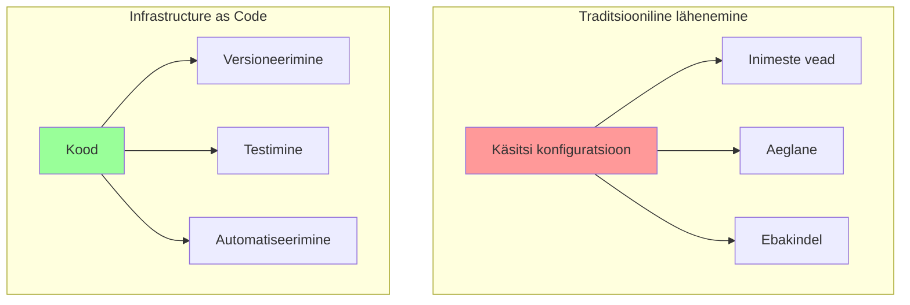
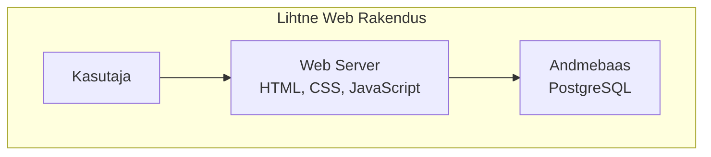
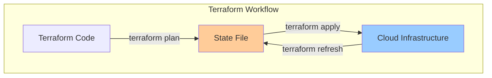

# Terraform: Infrastruktuur Koodina

**Teemad:** Infrastructure as Code, HCL süntaks, state haldamine, variables, best practices

---

## Õpiväljundid

Pärast seda moodulit oskate:
- Selgitada, mis on Infrastructure as Code ja miks see on vajalik
- Kirjutada lihtsat Terraform HCL koodi ja kasutada local provider'it
- Käivitada Terraform workflow'i: `init`, `plan`, `apply`, `destroy`
- Mõista state faili rolli ja kuidas Terraform jälgib ressursse
- Rakendada põhilisi best practices'eid (variables, outputs, `.gitignore`)

---

## Infrastruktuur Koodina - Kontseptsioonid

### Tere tulemast Infrastructure as Code maailma!

õpime **infrastruktuuri kui koodi** haldamist.

### Mis on Infrastructure as Code (IaC)?

**Infrastructure as Code** tähendab, et infrastruktuuri (serverid, võrgud, andmebaasid) kirjeldatakse ja hallatakse koodi abil, mitte käsitsi konfiguratsioonide abil.

**Kujutage ette seda nii:**
- **Traditsiooniline lähenemine:** Käsitsi serverite loomine ja konfiguratsioon
- **IaC lähenemine:** Kood kirjeldab, mida soovid, ja tööriist teeb selle sinu eest

### Miks IaC on oluline?

- **Konsistentsus** - sama infrastruktuur igal kord
- **Kiirus** - automatiseeritud juurutamine
- **Turvalisus** - vähem inimeste vigu
- **Skaleerimine** - lihtne kopeerida ja muuta



**Miks IaC on oluline?**

### Reaalne probleem: Lihtne web rakendus

**Kujutage ette, et teil on lihtne web rakendus:**



**Traditsiooniline lähenemine:**
1. Käsitsi serveri loomine
2. Käsitsi andmebaasi seadistamine
3. Käsitsi ühenduste konfigureerimine

**IaC lähenemine:**
1. Kood kirjeldab, mida soovid
2. Terraform teeb selle sinu eest
3. Sama kood töötab igal kord

### Terraform vs teised IaC tööriistad

**Terraform** on populaarne valik, aga pole ainus:

| Tööriist | Tugevused | Nõrkused | Parim kasutamine |
|----------|-----------|----------|------------------|
| **Terraform** | Multi-cloud, declarative, state management | Kõrge õppimiskõver, HCL süntaks | Cloud infrastruktuur |
| **Ansible** | Agentless, YAML, idempotent | Limited infrastructure | Configuration management |
| **CloudFormation** | AWS native, JSON/YAML | AWS only, complex syntax | AWS environments (not covered) |
| **Pulumi** | General programming languages | Newer, smaller community | Complex logic |

**Miks Terraform?**
- **Multi-cloud** - töötab kohalikult, VirtualBox, Docker jne (meie kursusel kohalik)
- **Declarative** - kirjeldad mida tahad, mitte kuidas
- **State management** - teab, mis on juba olemas
- **Large community** - palju dokumentatsiooni ja näiteid

---

## HCL Süntaks ja Provider'id

### HashiCorp Configuration Language (HCL)

**HCL** on Terraform'i konfiguratsioonikeel. See on lihtne, loetav ja võimas. Kujutage ette HCL-i kui "infrastruktuuri kirjeldamise keelt" - nagu HTML kirjeldab veebilehte, kirjeldab HCL teie infrastruktuuri.

**Miks HCL?**
- **Loetav** - sarnane JSON-iga, aga lihtsam
- **Võimas** - toetab funktsioone ja loogikat
- **Turvaline** - tüübi kontroll ja valideerimine
- **Dokumenteeritud** - kood ise on dokumentatsioon

### Põhiline HCL süntaks

HCL koosneb neljast põhilistest ploki tüübist, mis on nagu laused looduses. Iga plokk kirjeldab midagi konkreetset ja on oma süntaksiga.

#### 1. Resource Block - ressursi loomine

**Resource** on Terraform'i põhiline üksus - see kirjeldab, mida soovid luua. Kujutage ette seda kui "tellimust" - sa ütled Terraform'ile: "loo mulle see ja see".

Resource'i süntaks on: `resource "provider_type" "local_name" { konfiguratsioon }`

**Näide - Kohaliku faili loomine:**

```hcl
resource "local_file" "web_config" {
  content  = "Server configuration for web application"
  filename = "web_config.txt"
  
  tags = {
    Name = "Web Config"
    Environment = "Local"
    Project = "Terraform Basics Lab"
    CreatedBy = "Terraform"
  }
}
```

**Mida see teeb?**
- `local_file` - kohaliku faili tüüp
- `web_config` - kohalik nimi (saad seda kasutada viitamiseks)
- `content` - faili sisu
- `filename` - faili nimi ja asukoht
- `tags` - siltid, mis aitavad identifitseerida ja organiseerida

#### 2. Data Source - olemasoleva info lugemine

**Data source** ei loo midagi uut, vaid loeb olemasolevat infot. See on nagu "küsimus" - sa küsid: "anna mulle see ja see info".

**Näide - Kohaliku faili lugemine:**

```hcl
data "local_file" "config" {
  filename = "config.txt"
}
```

**Mida see teeb?**
- Loeb olemasoleva kohaliku faili sisu
- `filename` - faili asukoht
- Saad kasutada `data.local_file.config.content` muutujana

#### 3. Variable - dünaamiline väärtus

**Variable** võimaldab muuta väärtusi ilma koodi muutmata. See on nagu "seadistus" - sama kood, aga erinevad väärtused.

**Näide - instance type muutuja:**

```hcl
variable "file_name" {
  description = "Local file name"
  type        = string
  default     = "config.txt"
  
  validation {
    condition     = contains(["t2.micro", "t2.small", "t2.medium"], var.instance_type)
    error_message = "Instance type must be t2.micro, t2.small, or t2.medium."
  }
}
```

**Mida see teeb?**
- `description` - kirjeldus, mida muutuja teeb
- `type` - andmetüüp (string, number, bool, list, map)
- `default` - vaikeväärtus
- `validation` - kontrollib, et väärtus oleks korrektne

#### 4. Output - tagastatav väärtus

**Output** võimaldab näha loodud ressursside infot. See on nagu "vastus" - mida Terraform tagastab pärast töö lõpetamist.

**Näide - serveri IP aadress:**

```hcl
output "public_ip" {
  description = "Public IP of the web server"
  value       = local_file.web_config.filename
}
```

**Mida see teeb?**
- `description` - kirjeldus, mida väljund tagastab
- `value` - väärtus, mida tagastada (serveri avalik IP)

#### 2. Data types - andmetüübid

Terraform toetab erinevaid andmetüüpe, nagu ka teised programmeerimiskeeled. Iga tüüp on mõeldud teatud kindlatele andmetele ja kasutamise juhtumitele.

**String - tekst**
String on tavaline tekst, mis on jutumärkides. Kasutatakse nimede, kirjelduste ja tekstiliste väärtuste jaoks.

```hcl
variable "name" {
  type    = string
  default = "my-server"
}
```

**Number - arv**
Number on arv ilma jutumärkideta. Kasutatakse pordide, mälu, ketta suuruse jaoks.

```hcl
variable "port" {
  type    = number
  default = 80
}
```

**Boolean - tõeväärtus**
Boolean on kas `true` (tõene) või `false` (väär). Kasutatakse sätete sisse/välja lülitamiseks.

```hcl
variable "enable_monitoring" {
  type    = bool
  default = true
}
```

**List - nimekiri**
List on järjestatud kogum väärtusi. Kasutatakse, kui sul on mitu sarnast väärtust.

```hcl
variable "subnets" {
  type    = list(string)
  default = ["subnet-123", "subnet-456", "subnet-789"]
}
```

**Map - kaart (võti-väärtus paarid)**
Map on võtmete ja väärtuste kogum. Kasutatakse, kui sul on struktureeritud andmeid.

```hcl
variable "tags" {
  type = map(string)
  default = {
    Environment = "Production"
    Project     = "WebApp"
    Owner       = "DevOps Team"
  }
}
```

#### 3. Functions ja expressions - funktsioonid ja avaldised

Terraform toetab funktsioone ja avaldisi, mis võimaldavad teha loogilisi operatsioone ja andmete töötlemist. Need on nagu valemid Excelis - võimaldavad teha arvutusi ja loogilisi otsuseid.

**String concatenation - stringide ühendamine**

Locals võimaldab defineerida väärtusi, mida saab korduvalt kasutada. See on nagu muutuja, mis on ainult selle faili sees.

```hcl
locals {
  full_name = "${var.project_name}-${var.environment}"
  domain_name = "${var.subdomain}.${var.domain}"
}
```

**Conditional logic - tingimuslik loogika**

Ternary operator võimaldab teha tingimuslikke otsuseid: `tingimus ? tõene_väärtus : väär_väärtus`

```hcl
resource "local_file" "config" {
  content = var.environment == "production" ? var.prod_config : var.dev_config
  filename = var.config_filename
  count = var.enable_config ? 1 : 0
}
```

**File reading - faili lugemine**

`file()` funktsioon loeb faili sisu ja tagastab selle stringina. Kasutatakse skriptide ja konfiguratsioonide jaoks.

```hcl
resource "local_file" "config" {
  content = file("${path.module}/config_template.txt")
  filename = "generated_config.txt"
}
```

**Loops ja iteration - tsüklid ja kordused**

`for_each` võimaldab luua mitu ressurssi nimekirja põhjal.

```hcl
resource "local_file" "configs" {
  for_each = toset(var.config_names)
  
  content  = "Configuration for ${each.key}"
  filename = "${each.key}_config.txt"
  
  tags = {
    Name = each.key
    Index = each.value
  }
}
```

**Mathematical operations - matemaatilised operatsioonid**

Terraform toetab matemaatilisi operatsioone ja funktsioone.

```hcl
locals {
  subnet_size = pow(2, 32 - var.cidr_block_size)
  average_load = (var.min_instances + var.max_instances) / 2
}
```

### Terraform Providers

**Provider** on plugin, mis võimaldab Terraform'il suhelda erinevate teenustega. Kujutage ette provider'it kui "tõlki" - see tõlgib Terraform'i käsud konkreetse teenuse (local, VirtualBox, Docker) keelde.

**Miks provider'id on olulised?**
- **Ühtne süntaks** - sama HCL kood töötab erinevate teenustega
- **Spetsialiseeritud funktsioonid** - iga provider toetab oma teenuse võimalusi
- **Versioonihaldus** - saad määrata, millist provider'i versiooni kasutada
- **Turvalisus** - provider haldab autentimist ja autoriseerimist

**Local Provider näide:**

```hcl
# ==========================================
# TERRAFORM CONFIGURATION - Terraform'i seaded
# ==========================================
# See plokk määrab, milliseid provider'eid ja versioone kasutada
terraform {
# Määra Terraform'i versioon (valikuline, aga soovituslik)
  required_version = ">= 1.0"
  
# Määra vajalikud provider'id ja nende versioonid
  required_providers {
    local = {
      source  = "hashicorp/local"  # Provider'i allikas (HashiCorp'i registry)
      version = "~> 2.0"           # Versioon: 2.x.x
    }
  }
}

# ==========================================
# LOCAL PROVIDER CONFIGURATION - kohalikud seaded
# ==========================================
# Kohalik provider ei vaja erilisi seadeid
# Töötab kohe kohalikus failisüsteemis

# ==========================================
# LOCAL RESOURCE - kohalik ressurss
# ==========================================
# Nüüd saame luua kohalikke ressursse
resource "local_file" "web_config" {
  content  = "Web server configuration for local development"
  filename = "web_config.txt"
  
  tags = {
    Name = "Web Config"           # Resurssi nimi
    Purpose = "Learning Terraform" # Lisainfo
  }
}
```

**Local Provider näide (lab jaoks):**

Local provider võimaldab luua faile ja katalooge kohalikus failisüsteemis. See on suurepärane õppimiseks, kuna ei vaja cloud'i ega makse.

```hcl
# ==========================================
# LOCAL PROVIDER - kohalik failisüsteem
# ==========================================
# Local provider töötab ainult kohalikus failisüsteemis
# Ei vaja interneti ühendust ega cloud'i teenuseid
terraform {
  required_providers {
    local = {
      source  = "hashicorp/local"  # HashiCorp'i local provider
      version = "~> 2.0"           # Versioon 2.x.x
    }
  }
}

# ==========================================
# CREATE A LOCAL FILE - kohaliku faili loomine
# ==========================================
# local_file loob või uuendab faili kohalikus failisüsteemis
resource "local_file" "hello" {
  content  = "Hello, Terraform!"  # Faili sisu
  filename = "${path.module}/hello.txt"  # Faili nimi ja asukoht
# path.module on kaust, kus praegune .tf fail asub
}

# ==========================================
# CREATE A DIRECTORY - kataloogi loomine
# ==========================================
# local_directory loob kataloogi, kui seda pole olemas
resource "local_directory" "example" {
  path = "${path.module}/example_dir"  # Kataloogi tee
}

# ==========================================
# CREATE A CONFIGURATION FILE - konfiguratsioonifaili loomine
# ==========================================
# Looge JSON konfiguratsioonifail
resource "local_file" "config" {
  content = jsonencode({
    project_name = "Week 23 Lab"
    environment  = "development"
    created_by   = "Terraform"
    timestamp    = timestamp()
    version      = "1.0.0"
  })
  filename = "${path.module}/config.json"
}

# ==========================================
# CREATE A SCRIPT FILE - skriptifaili loomine
# ==========================================
# Looge Bash skript
resource "local_file" "script" {
  content = <<-EOF
#!/bin/bash
    echo "This script was created by Terraform"
    echo "Project: Week 23 Lab"
    echo "Timestamp: $(date)"
    echo "Current directory: $(pwd)"
  EOF
  filename = "${path.module}/scripts/startup.sh"
}
```

**Docker Provider näide:**

Docker provider võimaldab hallata Docker container'eid ja image'e Terraform'i abil. See on kasulik, kui soovid hallata container'eid kui infrastruktuuri osa.

```hcl
# ==========================================
# DOCKER PROVIDER - Docker container'ite haldamine
# ==========================================
# Docker provider võimaldab hallata Docker container'eid Terraform'i abil
# See on kasulik, kui soovid hallata container'eid kui infrastruktuuri osa
terraform {
  required_providers {
    docker = {
      source  = "kreuzwerker/docker"  # Kolmanda osapoole Docker provider
      version = "~> 3.0"              # Versioon 3.x.x
    }
  }
}

# ==========================================
# DOCKER PROVIDER CONFIGURATION - Docker seaded
# ==========================================
# Määrab, kuidas ühenduda Docker daemon'iga
provider "docker" {
  host = "unix:///var/run/docker.sock"  # Docker socket'i asukoht Linuxis
# Windows: "npipe:////./pipe/docker_engine"
# Remote: "tcp://docker-host:2376"
}

# ==========================================
# PULL DOCKER IMAGE - Docker image'i allalaadimine
# ==========================================
# docker_image allalaadib image'i Docker Hub'ist või muust registry'st
resource "docker_image" "nginx" {
  name = "nginx:latest"  # Image'i nimi ja tag
# Alternatiivid:
# name = "nginx:1.21" # Konkreetne versioon
# name = "my-registry.com/nginx:latest" # Privaatne registry
}

# ==========================================
# CREATE DOCKER CONTAINER - Docker container'i loomine
# ==========================================
# docker_container loob ja haldab Docker container'eid
resource "docker_container" "web" {
  name  = "web-server"                    # Container'i nimi
  image = docker_image.nginx.image_id     # Kasuta allalaaditud image'i
  
# Port mapping - ühenda container'i port 80 host'i portiga 8080
  ports {
    internal = 80    # Container'i sees olev port
    external = 8080  # Host'i port (http://localhost:8080)
  }
  
# Keskkonnamuutujad
  env = [
    "NGINX_HOST=localhost",
    "NGINX_PORT=80"
  ]
  
# Volume mounting - ühenda host'i kaust container'i kausta
  volumes {
    container_path = "/usr/share/nginx/html"  # Container'i kaust
    host_path      = "${path.module}/web"     # Host'i kaust
    read_only      = false                    # Lugemine ja kirjutamine
  }
  
# Container'i käivitamise käsud
  command = ["nginx", "-g", "daemon off;"]
  
# Restart policy
  restart = "unless-stopped"  # Taaskäivita, kui pole käsitsi peatatud
}
```

### Provider konfiguratsiooni best practices

Provider'ite konfiguratsioon on kriitiline Terraform'i stabiilsuse ja turvalisuse jaoks. Järgige neid best practices, et vältida probleeme.

**1. Versioonide fikseerimine - oluline stabiilsuse jaoks:**

```hcl
# ==========================================
# VERSION PINNING - versioonide fikseerimine
# ==========================================
# ALATI fikseeri provider'ite versioonid, et vältida ootamatuid muudatusi
terraform {
  required_providers {
    local = {
      source  = "hashicorp/local"
      version = "~> 2.0"  # 2.x.x, aga mitte 3.0.0
# ~> tähendab "vähemalt 2.0, aga vähem kui 3.0"
# See võimaldab saada bug fix'e, aga mitte breaking change'e
    }
    
# Mitu provider'it
    local = {
      source  = "hashicorp/local"
      version = "~> 2.0"
    }
    
    random = {
      source  = "hashicorp/random"
      version = "~> 3.0"
    }
  }
}
```

**2. Keskkonnamuutujad - turvaline autentimine:**

```bash
# ==========================================
# ENVIRONMENT VARIABLES - keskkonnamuutujad
# ==========================================
# ÄRA kunagi kirjuta access key'e otse koodi!
# Kasuta keskkonnamuutujaid või kohalikke seadeid

# Local provider credentials (ei vaja)
# Kohalik provider töötab kohe, ei vaja erilisi seadeid

# Või kasuta keskkonnamuutujaid
export TF_VAR_project_name="my-project"
export TF_VAR_environment="development"
```

**3. Multiple providers - erinevate keskkondade haldamine:**

```hcl
# ==========================================
# MULTIPLE PROVIDERS - mitu provider'it
# ==========================================
# Kasutage alias'e, kui teil on mitu sama tüüpi provider'it
# Näiteks: erinevad kohalikud keskkonnad või projektid

# Production environment
provider "local" {
  alias = "prod"         # Unikaalne nimi
}

# Development environment
provider "local" {
  alias = "dev"          # Unikaalne nimi
}

# Kasuta konkreetset provider'it
resource "local_file" "prod_config" {
  provider = local.prod  # Määra, millist provider'it kasutada
  content  = "Production configuration"
  filename = "prod_config.txt"
  
  tags = {
    Environment = "Production"
    ManagedBy   = "Terraform"
  }
}

resource "local_file" "dev_config" {
  provider = local.dev   # Määra, millist provider'it kasutada
  content  = "Development configuration"
  filename = "dev_config.txt"
  
  tags = {
    Environment = "Development"
    ManagedBy   = "Terraform"
  }
}
```

**4. Provider konfiguratsiooni valideerimine:**

```hcl
# ==========================================
# PROVIDER VALIDATION - provider'i kontroll
# ==========================================
# Lisage valideerimine, et kontrollida provider'i seadeid

provider "local" {
# Kohalik provider ei vaja valideerimist
# Töötab kõikides keskkondades
}
```

---

## Ressursid ja Andmeallikad

### Terraform Resources

**Resource** on Terraform'i põhiline üksus - see kirjeldab, mida soovid luua, muuta või kustutada.

### Põhilised resource tüübid

**1. Local resources:**

```hcl
# Local File
resource "local_file" "web_config" {
  content  = "Web server configuration"
  filename = var.config_filename
  
# Local configuration dependencies
content = data.local_file.template.content
  
  user_data = <<-EOF
#!/bin/bash
              apt-get update
              apt-get install -y nginx
              systemctl start nginx
              EOF
  
  tags = {
    Name = "Web Server"
  }
}

# Auto Scaling Group (Local equivalent)
resource "local_file" "web_config" {
  content  = "Web application configuration with scaling settings"
  filename = "web_config.txt"
  
  lifecycle {
    create_before_destroy = true
  }
}
```

**2. Local configuration resources:**

```hcl
# Main configuration directory
resource "local_directory" "main" {
  path = "./config"
}

# Configuration file
resource "local_file" "config" {
  content  = "Main configuration file"
  filename = "${local_directory.main.path}/main.conf"
  
  tags = {
    Name = "Main Config"
  }
}

# Template file
resource "local_file" "template" {
  content  = "Configuration template"
  filename = "${local_directory.main.path}/template.conf"
  
  tags = {
    Name = "Config Template"
  }
}

# Settings file
resource "local_file" "settings" {
  content  = "Application settings"
  filename = "${local_directory.main.path}/settings.conf"
  
  tags = {
    Name = "Settings"
  }
}
```

**3. Local storage resources:**

```hcl
# Data directory
resource "local_directory" "data" {
  path = "./data"
}

# Random ID for unique names
resource "random_id" "file_suffix" {
  byte_length = 4
}

# Database configuration file
resource "local_file" "db_config" {
  content  = "Database configuration for local development"
  filename = "${local_directory.data.path}/database.conf"
  
  tags = {
    Name = "Database Config"
  }
}
```

### Data Sources

**Data source** võimaldab lugeda olemasolevat infot, mida saab kasutada resource'ide konfiguratsioonis.

**1. Local data sources:**

```hcl
# File lookup
data "local_file" "template" {
  filename = "template.txt"
}
  
  filter {
    name   = "virtualization-type"
    values = ["hvm"]
  }
}

# Availability zones
data "local_file" "available_config" {
  filename = "available_config.txt"
}

# Local configuration data
data "local_file" "default_config" {
  filename = "default_config.txt"
}

# Configuration files
data "local_file" "configs" {
  filename = "configs.txt"
}
```

**2. Local data sources:**

```hcl
# File content
data "local_file" "config" {
  filename = "${path.module}/config.json"
}

# Directory listing
data "local_file" "script" {
  filename = "${path.module}/scripts/startup.sh"
}
```

### Resource dependencies

**Terraform automaatselt tuvastab sõltuvused, aga mõnikord pead neid selgesõnaliselt määrama:**

```hcl
# Implicit dependency (recommended)
resource "local_file" "web_config" {
  content  = data.local_file.template.content
  filename = "web_config.txt"
}

# Explicit dependency
resource "local_file" "web_config" {
  content  = data.local_file.template.content
  filename = "web_config.txt"
  
  depends_on = [local_directory.config, local_file.template]
}
```

### Resource lifecycle

**Lifecycle rules võimaldavad kontrollida, kuidas Terraform hallab ressurssi:**

```hcl
resource "local_file" "web_config" {
  content  = data.local_file.template.content
  filename = "web_config.txt"
  
  lifecycle {
# Prevent recreation when content changes
    ignore_changes = [content]
    
# Create new resource before destroying old
    create_before_destroy = true
    
# Prevent accidental deletion
    prevent_destroy = false
  }
}
```

---

## State Haldamine

### Mis on Terraform State?

**Terraform state** on fail, mis sisaldab teavet teie infrastruktuuri kohta - mis ressursid on olemas, nende ID-d, atribuudid ja sõltuvused.

### State faili roll



**State fail sisaldab:**
- **Resource metadata** - ID-d, atribuudid, sõltuvused
- **Current state** - mis on praegu olemas
- **Desired state** - mis peaks olema
- **Dependencies** - milline järjekord

### State faili näide

```json
{
  "version": 4,
  "terraform_version": "1.5.0",
  "serial": 1,
  "lineage": "abc123",
  "outputs": {
    "public_ip": {
      "value": "52.23.45.67",
      "type": "string"
    }
  },
  "resources": [
    {
      "mode": "managed",
      "type": "local_file",
      "name": "web_server",
      "provider": "provider[\"registry.terraform.io/hashicorp/local\"]",
      "instances": [
        {
          "schema_version": 1,
          "attributes": {
            "id": "i-1234567890abcdef0",
            "instance_type": "t2.micro",
            "public_ip": "52.23.45.67",
            "tags": {
              "Name": "Web Server"
            }
          }
        }
      ]
    }
  ]
}
```

### State management probleemid

**1. Local state faili probleemid:**

```bash
# State fail on kohalikus failisüsteemis
terraform.tfstate

# Probleemid:
# - Ei tööta meeskonnaga
# - Ei ole backup'i
# - Ei ole concurrent access
# - Ei ole versioning
```

**2. Remote state lahendused:**

```hcl
# Terraform Cloud
terraform {
  cloud {
    organization = "my-org"
    workspaces {
      name = "web-app"
    }
  }
}

# Local backend
terraform {
  backend "local" {
    path = "terraform.tfstate"
  }
}

# Azure Storage backend
terraform {
  backend "azurerm" {
    resource_group_name  = "terraform-rg"
    storage_account_name = "tfstate12345"
    container_name       = "tfstate"
    key                  = "web-app.terraform.tfstate"
  }
}
```

### State management best practices

**1. Remote state kasutamine:**

```hcl
# Local backend konfiguratsioon
terraform {
  backend "local" {
    path = "terraform.tfstate"
  }
}
```

**2. State locking:**

```hcl
# Local file for state locking
resource "local_file" "terraform_locks" {
  content  = "State lock file"
  filename = "terraform.lock"
}
```

**3. State separation:**

```bash
# Erinevad keskkonnad erinevates state failides
environments/
├── dev/
│   └── terraform.tfstate
├── staging/
│   └── terraform.tfstate
└── prod/
    └── terraform.tfstate
```

**4. State import:**

```bash
# Import existing resources
terraform import local_file.web_config web_config.txt

# Import with configuration
terraform import 'local_file.web_config[0]' web_config.txt
```

### State security

**1. Encryption:**

```hcl
terraform {
  backend "local" {
    path = "terraform.tfstate"
  }
}
```

**2. Access control:**

```hcl
# Local file access policy
{
  "Version": "2012-10-17",
  "Statement": [
    {
      "Effect": "Allow",
      "Action": [
        "read",
"write",
"delete"
      ],
      "Resource": "local://terraform.tfstate"
    }
  ]
}
```

**3. State backup:**

```bash
# Regular backups
cp terraform.tfstate backups/$(date +%Y%m%d)/terraform.tfstate
```

### State troubleshooting

**1. State inconsistencies:**

```bash
# Refresh state from cloud
terraform refresh

# Plan to see differences
terraform plan

# Force update if needed
terraform apply -refresh=false
```

**2. State corruption:**

```bash
# Backup current state
cp terraform.tfstate terraform.tfstate.backup

# Remove from state (careful!)
terraform state rm local_file.web_config

# Re-import if needed
terraform import local_file.web_config web_config.txt
```

**3. State inspection:**

```bash
# List all resources in state
terraform state list

# Show specific resource
terraform state show local_file.web_config

# Move resource in state
terraform state mv local_file.old_name local_file.new_name
```

---

## Validation ja Testing: Kuidas kontrollida Terraform koodi?

Enne `terraform apply` on oluline kontrollida, kas kood on õige!

### 1. terraform validate - Süntaksi kontroll

```bash
# Kontrolli süntaksit
terraform validate

# Väljund kui OK:
# Success! The configuration is valid.

# Väljund kui ERROR:
# Error: Invalid resource type
# on main.tf line 5:
# resource "local_fil" "example" {
```

**Kontrollib:**
-  HCL süntaks
-  Resource tüübid
-  Argument nimed
-  EI kontrolli loogikat või väärtusi

### 2. terraform fmt - Code formatting

```bash
# Formateeri kõik .tf failid
terraform fmt

# Kontrolli, kas on vaja formateerida (CI/CD's)
terraform fmt -check

# Rekursiivne (ka alamkaustad)
terraform fmt -recursive
```

**Näide:**
```hcl
# Enne fmt
resource  "local_file""example"{
content="test"
filename="${path.module}/test.txt"}

# Pärast fmt
resource "local_file" "example" {
  content  = "test"
  filename = "${path.module}/test.txt"
}
```

### 3. terraform plan - Dry run

```bash
# Vaata, mida Terraform teeks (aga ära tee!)
terraform plan

# Salvesta plan faili
terraform plan -out=tfplan

# Kasuta salvestatud plan'i
terraform apply tfplan
```

**Plan output:**
```
Terraform will perform the following actions:

# local_file.example will be created
  + resource "local_file" "example" {
      + content  = "Hello World"
      + filename = "./hello.txt"
    }

Plan: 1 to add, 0 to change, 0 to destroy.
```

**Sümbolid:**
- `+` - uus ressurss (create)
- `-` - kustutatakse (destroy)
- `~` - muudetakse (update in-place)
- `-/+` - kustutatakse ja luuakse uuesti (replace)

### 4. tflint - Advanced linting

**tflint** on rohkem kui `validate` - kontrollib best practices'eid!

```bash
# Installi tflint
curl -s https://raw.githubusercontent.com/terraform-linters/tflint/master/install_linux.sh | bash

# Käivita
tflint

# Init (esimene kord)
tflint --init

# Rekursiivne
tflint --recursive
```

**Näide probleemidest:**
```
3 issue(s) found:

Warning: terraform "required_version" attribute is required (terraform_required_version)
  on main.tf line 1

Warning: Missing version constraint for provider "local" (terraform_required_providers)
  on main.tf line 5

Notice: local_file "example" is declared but not used (terraform_unused_declarations)
  on main.tf line 10
```

### 5. checkov - Security scanning

**checkov** leiab turvalisuse probleemid Terraform koodist!

```bash
# Installi checkov
pip3 install checkov

# Skanni kõik .tf failid
checkov -d .

# Ainult HIGH severity
checkov -d . --check-level HIGH

# Väljund JSON'ina (CI/CD)
checkov -d . -o json
```

**Näide tulemused:**
```
Passed checks: 8
Failed checks: 3
Skipped checks: 0

Check: CKV_AWS_20: "S3 Bucket has an ACL defined"
  FAILED for resource: aws_s3_bucket.example
  File: /main.tf:5-10

Check: CKV_AWS_21: "S3 bucket versioning is enabled"
  FAILED for resource: aws_s3_bucket.example
  File: /main.tf:5-10
```

### 6. CI/CD Pipeline näide

**GitLab CI koos kõigi kontrollidega:**

```yaml
stages:
  - validate
  - plan
  - apply

terraform_validate:
  stage: validate
  script:
    - terraform init
    - terraform fmt -check    # Code formatting
    - terraform validate      # Syntax check
    - tflint                  # Best practices
    - checkov -d .            # Security scan

terraform_plan:
  stage: plan
  script:
    - terraform init
    - terraform plan -out=tfplan
  artifacts:
    paths:
      - tfplan

terraform_apply:
  stage: apply
  script:
    - terraform init
    - terraform apply tfplan
  when: manual                # Käsitsi kinnitamine!
  only:
    - main
```

### 7. Testing tööriistad

**Terratest** (Go-based testing):
```go
func TestTerraformExample(t *testing.T) {
    terraformOptions := &terraform.Options{
        TerraformDir: "../",
    }
    
    defer terraform.Destroy(t, terraformOptions)
    terraform.InitAndApply(t, terraformOptions)
    
    output := terraform.Output(t, terraformOptions, "filename")
    assert.Equal(t, "./hello.txt", output)
}
```

**kitchen-terraform** (Ruby-based testing):
```ruby
describe file('/tmp/test.txt') do
  it { should exist }
  its('content') { should match /Hello/ }
end
```

### 8. Best Practices checklist

Enne `terraform apply`:

1.  `terraform fmt` - formateeri kood
2.  `terraform validate` - kontrolli süntaksi
3.  `terraform plan` - vaata muudatusi
4.  `tflint` - kontrolli best practices'eid
5.  `checkov` - kontrolli turvalisust
6.  Code review - kolleeg vaatab üle
7.  `terraform apply` - nüüd võid rakendada!

---

## Kokkuvõte

Selle mooduli järel oskad:
-  **Infrastructure as Code (IaC)** - miks ja kuidas kasutada
-  **HCL süntaks** - Terraform'i konfiguratsioonikeel
-  **Providers ja resources** - erinevate teenuste kasutamine
-  **State management** - infrastruktuuri oleku haldamine
-  **Validation ja testing** - kuidas kontrollida koodi kvaliteeti

**Järgmised sammud:**
-  Tee läbi [labor.md](labor.md) harjutused
-  Lahenda [kodutoo.md](kodutoo.md) ülesanded
-  Vaata [lisapraktika.md](lisapraktika.md) edasijõudnud teemade jaoks

---

## Lisaressursid

- **Terraform Documentation:** https://www.terraform.io/docs
- **HCL Language:** https://www.terraform.io/docs/language
- **Local Provider:** https://registry.terraform.io/providers/hashicorp/local/latest/docs
- **Terraform Best Practices:** https://www.terraform.io/docs/cloud/guides/recommended-practices
