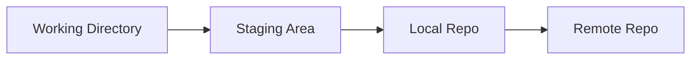

# 📚 Git: Versioonihaldus ja GitHub

**Kestus:** Max 45 min (loeng) + 3×45 min (labor)  
**Teemad:** Git põhitõed, branch'id, GitHub koostöö, commit kvaliteet

---

## 🎯 Õpiväljundid

Pärast seda moodulit oskate:
- Selgitada, mis probleemi Git lahendab ja kuidas see töötab
- Luua repository ja teha tähenduslikke commit'e
- Hallata branch'e ja merge'ida muudatusi
- Ühendada oma projekti GitHubiga ja teha pull request'e
- Kasutada parimaid tavasid (`.gitignore`, head commit-sõnumid)

---

## 📖 Moodul 1: Sissejuhatus Versioonihaldusesse

### Git'i Ajalugu

* **Looja:** Linus Torvalds (2005)
* **Miks?** Vajalik Linux kerneli jaoks, olemasolevad süsteemid ei sobinud
* **Areng:**

  * 2005: Esimene versioon
  * 2008: GitHub loodi
  * Tänapäev: maailma populaarseim VCS

### Miks on versioonihaldus vajalik?

**Probleem ilma Git'ita:**

Oled kunagi teinud sellist asja?

```
projekt.py
projekt_final.py
projekt_final_v2.py
projekt_final_v2_REAL.py
projekt_final_v2_REAL_fixed.py
```

Või veel hullem:
- Kustutasid kogemata 3 tunni töö ja Ctrl+Z ei aita?
- Tahad näha, mis sa 2 nädalat tagasi tegid?
- Töötad koos sõbraga ja teie muudatused konfliktsid?

**Git lahendab need probleemid:**

* ✅ Taasta vanu versioone (ajamasin sinu koodile!)
* ✅ Väldi töö kadumist (kõik on salvestatud)
* ✅ Lahenda konflikte meeskonnatöös (Git teab, kes mida muutis)
* ✅ Eksperimenteeri vabalt (branch'id = paralleeluniversumid)
* ✅ Näita oma tööd (GitHub = CV programmeerijale)

### Git vs teised

* **Hajutatud** (iga arendaja omab ajalugu)
* **Kiire** (toimub lokaalselt)
* **Branching** (lihtne paralleeltöö)
* **Tööstusstandard**

### Põhimõisted: Workflow



* **Working Directory** – failid, mida redigeerid
* **Staging Area** – muudatuste ooteala enne commit’i
* **Local Repository** – ajaloo salvestus
* **Remote Repository** – GitHub vms

---

## 📖 Moodul 2: Git'i Kohalik Kasutamine

### Installimine

* **Windows:** `winget install --id Git.Git`
* **macOS:** `brew install git`
* **Linux:** `sudo apt install git` jne

Kontroll: `git --version`

### Esmakordne seadistamine

```bash
git config --global user.name "Teie Nimi"
git config --global user.email "teie.email@example.com"
git config --list
```

### Repo loomine

**Variant 1: Uus projekt (git init)**

```bash
# Loo kaust
mkdir minu-projekt
cd minu-projekt

# Alusta Git'i kasutamist
git init

# Nüüd see kaust on Git repositoorium!
```

**Variant 2: Olemasolev projekt (git clone)**

```bash
# Kopeeri kellegi teise projekt
git clone https://github.com/kasutaja/projekt.git

# Nüüd sul on kohalik koopia koos kogu ajalooga
```

### Põhitöövoog (the Git loop)

**1. Tee muudatus failis**
```bash
echo "print('Tere maailm')" > hello.py
```

**2. Vaata, mis muutus**
```bash
git status
# Output: Untracked files: hello.py (Git ei jälgi seda veel)
```

**3. Lisa staging area'sse**
```bash
git add hello.py
# Või lisa kõik: git add .
```

**4. Tee commit (salvesta ajalukku)**
```bash
git commit -m "Lisa tervitusprogramm"
```

**5. Vaata ajalugu**
```bash
git log --oneline
# Näed kõiki oma commit'e
```

### Olulised käsud (cheat sheet)

```bash
# VAATAMINE
git status              # Mis on muutunud?
git log --oneline       # Ajalugu (kompaktne)
git log --graph --all   # Ajalugu graafina
git diff                # Mis täpselt muutus?
git show HEAD           # Viimane commit detailselt

# PÕHITÖÖVOOG
git add <fail>          # Lisa staging area'sse
git add .               # Lisa kõik muudatused
git commit -m "Sõnum"   # Salvesta commit
git commit -am "Sõnum"  # Add + commit koos (ainult jälgitavad failid)

# BRANCHING
git branch              # Vaata branch'e
git branch uus-branch   # Loo uus branch
git checkout uus-branch # Liigu teise branch'i
git checkout -b uus     # Loo ja liigu korraga
git merge teise-branch  # Merge teine branch praegusesse

# TAGASIVÕTMINE
git checkout -- <fail>  # Tühista töökausta muudatus
git reset HEAD <fail>   # Eemalda staging area'st
git revert <commit>     # Loo uus commit, mis tühistab vana
```

---

## 📖 Moodul 3: Kaugrepositooriumid ja GitHub

### GitHub – mis see on?

**Git ≠ GitHub!**

- **Git:** Tööriist (nagu Word programm)
- **GitHub:** Teenus (nagu OneDrive või Dropbox koodile)

**Miks GitHub?**
- ☁️ **Cloud backup** – kui arvuti põleb ära, kood jääb alles
- 🤝 **Koostöö** – mitme inimese samaaegselt töötamine
- 📂 **Portfolio** – näita tööandjale, mida oskad
- 🌍 **Avalik kood** – jaga maailmaga, avalik lähtekoodiga projektid

### Remote'i seadistamine

**1. Loo GitHubis repositoorium** (veebi kaudu)

**2. Ühenda lokaalne repo GitHubiga:**

```bash
# Lisa remote (nimi tavaliselt "origin")
git remote add origin https://github.com/kasutaja/projekt.git

# Kontrolli
git remote -v
# Output:
# origin  https://github.com/kasutaja/projekt.git (fetch)
# origin  https://github.com/kasutaja/projekt.git (push)
```

**3. Saada esimene kord üles:**

```bash
git push -u origin main
# -u = --set-upstream (edaspidi piisab lihtsalt "git push")
```

### Põhiline töövoog GitHubiga

**Iga päev, kui alustad tööd:**

```bash
# 1. Võta uusimad muudatused
git pull origin main

# 2. Tee oma töö
echo "uus kood" >> fail.py

# 3. Salvesta lokaalselt
git add .
git commit -m "Lisa uus funktsioon"

# 4. Võta taas uusimad (äkki keegi muutis vahepeal?)
git pull origin main

# 5. Saada oma muudatused üles
git push origin main
```

**Miks pull kaks korda?** Et vältida konflikte – kui keegi teine muutis samal ajal, näed seda enne push'i!

### Branch'ide töö GitHubiga

**Feature branch workflow:**

```bash
# 1. Loo branch uue feature jaoks
git checkout -b feature/login-system

# 2. Tee töö ja commit'id
git add .
git commit -m "Lisa kasutaja autentimine"

# 3. Push branch GitHubi
git push -u origin feature/login-system

# 4. Tee Pull Request (PR) GitHub veebis
# 5. Keegi vaatab üle ja merge'ib main'i
# 6. Puhasta lokaalselt
git checkout main
git pull origin main
git branch -d feature/login-system
```

### SSH vs HTTPS

**HTTPS (lihtsam algajale):**
```bash
git clone https://github.com/user/repo.git
# Küsib username + password (või token)
```

**SSH (parem, turvalisem):**
```bash
# 1. Genereeri SSH võti
ssh-keygen -t ed25519 -C "sinu.email@example.com"

# 2. Lisa avalik võti GitHubi (Settings → SSH keys)
cat ~/.ssh/id_ed25519.pub

# 3. Kasuta SSH URL'i
git clone git@github.com:user/repo.git
# Ei küsi enam parooli!
```

### Autentimine

* **SSH võtmed** (turvaline, soovitatav) või **Personal Access Token** HTTPS jaoks

---

## 📖 Moodul 4: Koostöö ja Parimad Tavad

### Pull Request Workflow

1. Loo feature branch
2. Tee muudatused ja commit'id
3. Push branch'i GitHubi
4. Tee Pull Request (PR)
5. (Keegi teine) vaatab üle ja merge'ib

### Commit kvaliteet

**Hea commit-sõnum:**
```
Lisa kasutaja autentimise funktsioon

Lisasin JWT põhise autentimise, et kasutajad saaksid
turvaliselt sisse logida.
```

**Halb commit-sõnum:**
```
fix
update
asdfg
WIP
```

### `.gitignore` näited

```gitignore
# Python
*.pyc
__pycache__/
venv/

# Node.js
node_modules/
.env

# IDE
.vscode/
.idea/

# OS
.DS_Store
Thumbs.db

# Logs
*.log
```

### Mida MITTE repos hoida?

❌ **Paroolid ja API võtmed**  
❌ **Suured meediafailid** (videod, pildid > 1MB)  
❌ **Build failid** (compiled code, cache)  
❌ **IDE seaded** (kui ei ole meeskonna standard)  
❌ **OS failid** (`.DS_Store`, `Thumbs.db`)

---

## 🔄 Kokkuvõte ja Refleksioon

### Põhiline töövoog

```bash
# Iga päev:
git pull origin main       # võta uusim
# ... tee töö ...
git add .
git commit -m "Selge sõnum"
git push origin main

# Feature jaoks:
git checkout -b feature/uus
# ... tee töö ...
git add .
git commit -m "Selge sõnum"
git push origin feature/uus
# Tee PR GitHub'is
```

### 💭 Refleksioonküsimused (mõtle läbi)

1. **Kuidas Git lahendab "final_final_v2_REAL.docx" probleemi?**
2. **Millal on mõistlik teha uus commit?** (iga rida? iga fail? iga feature?)
3. **Miks on branch'id kasulikud, kui töötad üksi?**
4. **Kuidas aitab GitHub sul paremaks programmeerijaks saada?**

### 🎯 Järgmised sammud

- **Labor:** Harjuta kõiki neid käske praktikas!
- **Kodutöö:** Loo oma projekt ja näita Git oskusi
- **Edasijõudnud:** Vaata `lisapraktika.md` (Git hooks, Actions, jne)

---

**Küsimus enne lab'i alustamist:** Kui Git oleks superjõud, siis milline see oleks ja miks? 🦸‍♂️