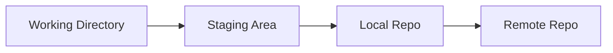

# 📚 Git Version Control: Versioonihaldus ja GitHub

**Kestus:** 3 tundi
**Eesmärk:** Omandada Git'i täielikud oskused - alates kohalikust kasutamisest kuni meeskonnatööni GitHub'is

---

## 📖 Moodul 1: Sissejuhatus Versioonihaldusesse

### Git'i Ajalugu

* **Looja:** Linus Torvalds (2005)
* **Miks?** Vajalik Linux kerneli jaoks, olemasolevad süsteemid ei sobinud
* **Areng:**

  * 2005: Esimene versioon
  * 2008: GitHub loodi
  * Tänapäev: maailma populaarseim VCS

### Miks on versioonihaldus vajalik?

Git aitab:

* taastada vanu versioone
* vältida töö kadumist
* lahendada konflikte meeskonnatöös

### Git vs teised

* **Hajutatud** (iga arendaja omab ajalugu)
* **Kiire** (toimub lokaalselt)
* **Branching** (lihtne paralleeltöö)
* **Tööstusstandard**

### Põhimõisted: Workflow



* **Working Directory** – failid, mida redigeerid
* **Staging Area** – muudatuste ooteala enne commit’i
* **Local Repository** – ajaloo salvestus
* **Remote Repository** – GitHub vms

---

## 📖 Moodul 2: Git'i Kohalik Kasutamine

### Installimine

* **Windows:** `winget install --id Git.Git`
* **macOS:** `brew install git`
* **Linux:** `sudo apt install git` jne

Kontroll: `git --version`

### Esmakordne seadistamine

```bash
git config --global user.name "Teie Nimi"
git config --global user.email "teie.email@example.com"
git config --list
```

### Repo loomine

* **git init** – uue projekti jaoks
* **git clone** – olemasoleva repo kopeerimine

### Põhitöövoog

```bash
git status
git add .
git commit -m "Sõnum"
```

### Olulised käsud

```bash
git diff              # muudatuste vaatamine
git log --oneline     # kompaktne ajalugu
git branch            # harud
git checkout -b uus   # uue haru loomine
git merge haru        # haru ühendamine
```

---

## 📖 Moodul 3: Kaugrepositooriumid ja GitHub

### GitHub

* Hosting + koostöö + portfolio
* Git = tööriist, GitHub = teenus

### Remote haldamine

```bash
git remote add origin https://github.com/kasutaja/projekt.git
git remote -v
```

### Põhiline töövoog meeskonnas

```bash
git pull origin main   # võta uusim
# tee muudatused
git add .
git commit -m "Muudatus"
git pull origin main   # kontrolli uusi muudatusi
git push origin main   # saada üles
```

### Branchide saatmine

```bash
git push -u origin feature-branch
git push origin --delete feature-branch
```

### Rebase

```bash
git pull --rebase origin main
git rebase -i HEAD~3
```

### Autentimine

* **SSH võtmed** või **Personal Access Token** HTTPS jaoks

---

## 📖 Moodul 4: Koostöö ja Projektihaldus

### Pull Request Workflow

1. Fork & Clone
2. Loo feature branch
3. Tee muudatused
4. Push ja PR GitHub'is
5. Code review ja merge

### PR haldus

* Lisa selge pealkiri ja kirjeldus
* Kasuta squash merge’i puhtaks ajaloos
* Vajadusel amend või rebase

### Projektihaldus

* **Issues** bugide/feature’de jaoks
* **Branch protection rules** main’i kaitsmiseks
* **CI/CD** GitHub Actions’iga

---

## 🔄 Kokkuvõte

### Workflow kokkuvõte

* Iga päev: `pull → töö → add/commit → push`
* Feature jaoks: `branch → töö → push → PR`

### Parimad praktikad

* Selged commit’i sõnumid
* Harude nimetamine: `feature/…`, `bugfix/…`
* Merge vs Rebase õigesti kasutada
* Ära commiti paroole või API võtmeid