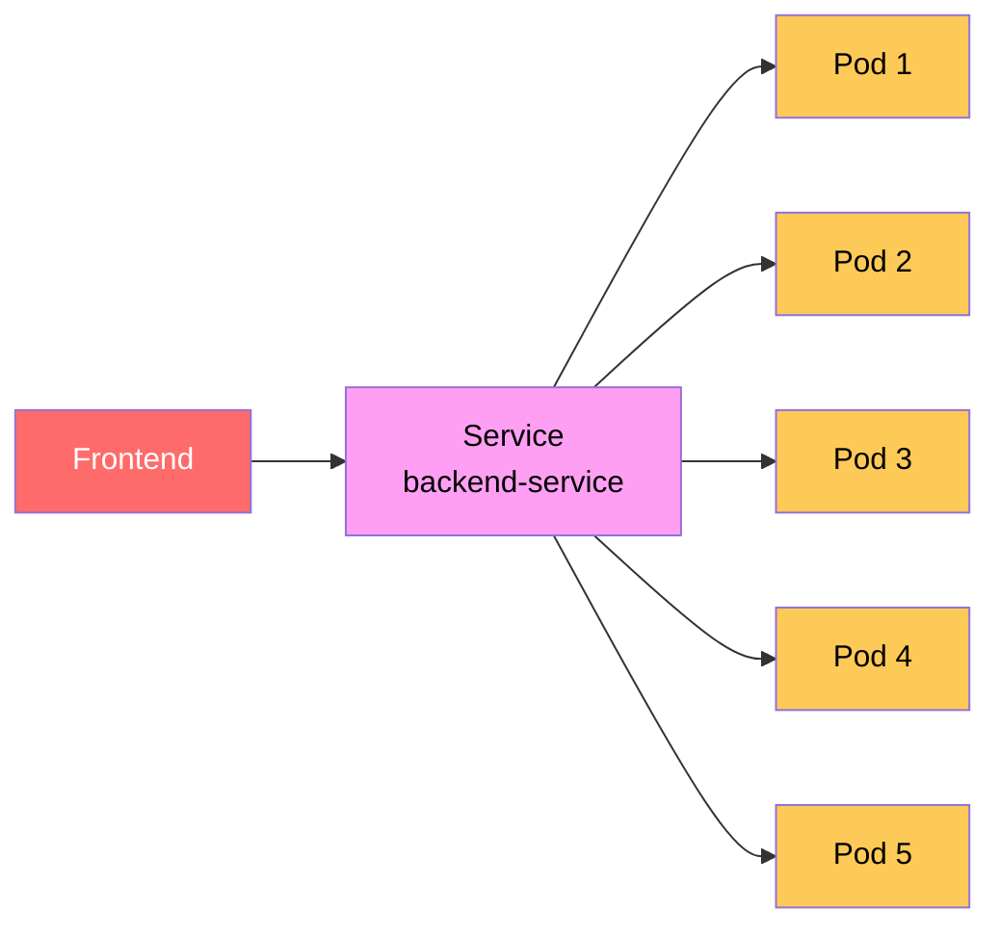
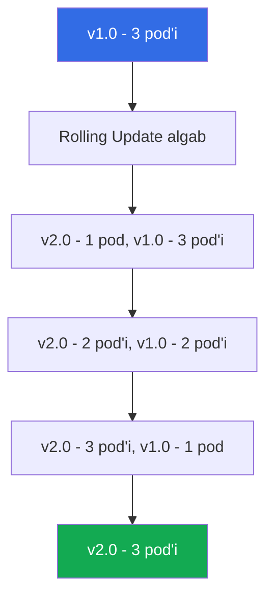
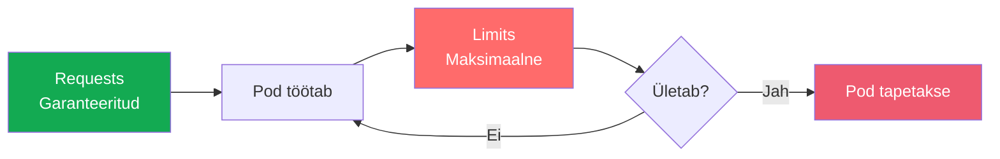
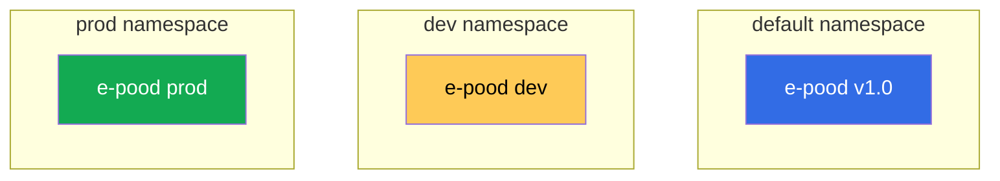
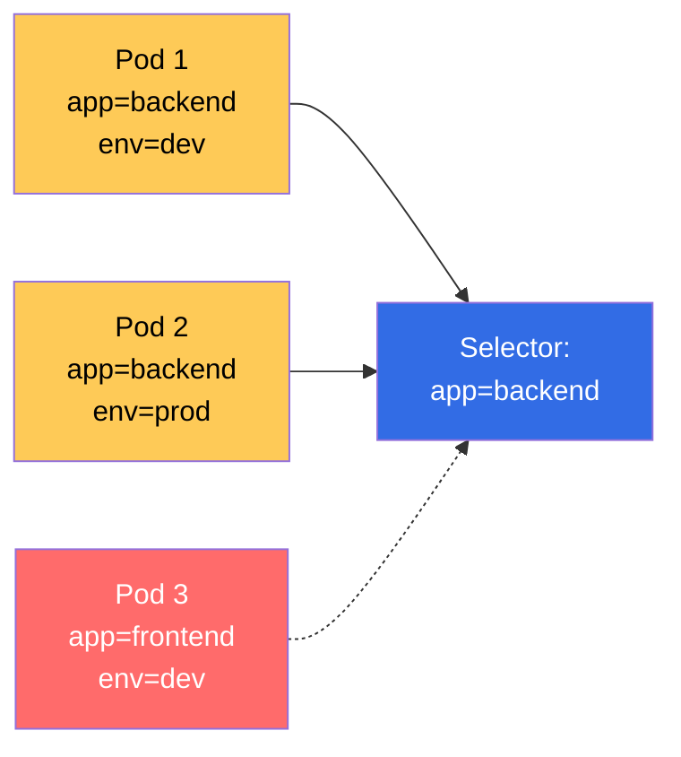
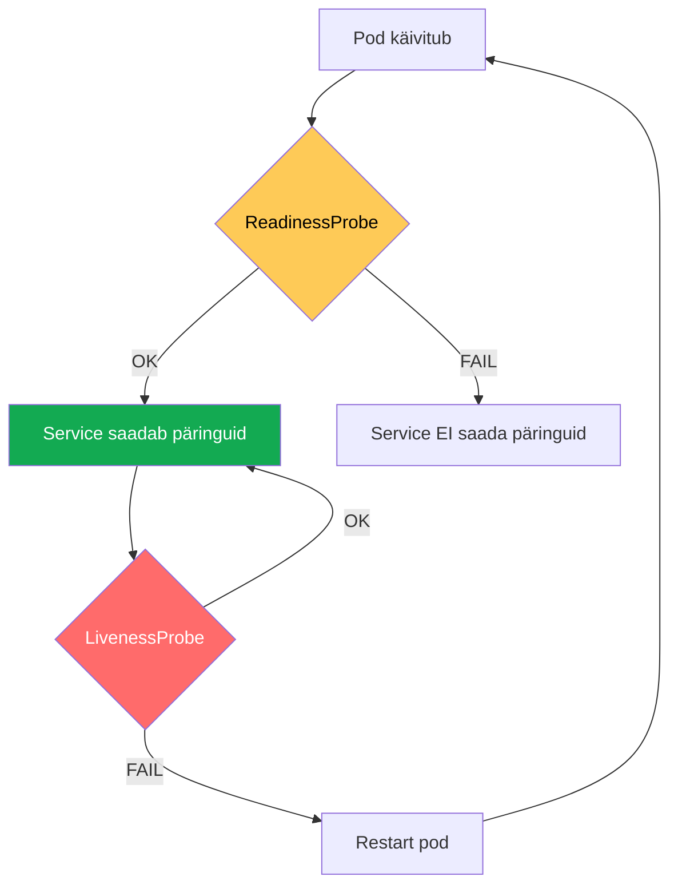
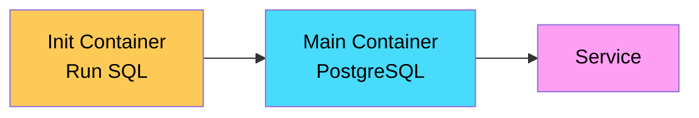

#  Kubernetes Lisaülesanded

**Eeltingimused:** Kubernetes põhiteadmised, Minikube seadistatud

---

##  Õpiväljundid

Pärast lisaülesandeid oskate:
- Skaleerida rakendusi ja hallata load balancing'ut
- Teha rolling update'e ja rollback'e
- Hallata ConfigMap'e ja Secret'e
- Seadistada resource limits ja requests
- Kasutada namespaces'e efektiivselt

---

##  Sisukord

1. [Sissejuhatus](#sissejuhatus)
2. [Ülesanne 1: Skaleerimine ja Load Balancing](#ülesanne-1-skaleerimine-ja-load-balancing)
3. [Ülesanne 2: Rolling Update ja Rollback](#ülesanne-2-rolling-update-ja-rollback)
4. [Ülesanne 3: ConfigMap Muutmine](#ülesanne-3-configmap-muutmine)
5. [Ülesanne 4: Resource Limits ja Requests](#ülesanne-4-resource-limits-ja-requests)
6. [Ülesanne 5: Namespaces](#ülesanne-5-namespaces)
7. [Ülesanne 6: Labels ja Selectors](#ülesanne-6-labels-ja-selectors)
8. [Ülesanne 7: Health Checks](#ülesanne-7-health-checks)
9. [Ülesanne 8: Init Containers](#ülesanne-8-init-containers)

---

#  Sissejuhatus

Need ülesanded täiendavad põhilabi. Iga ülesanne õpetab üht Kubernetes kontseptsiooni põhjalikult.

**Eeldus:** Oled teinud põhilabi ja e-pood töötab.

**Nõuded:**
- Minikube töötab
- kubectl installitud
- Põhilab e-pood rakendatud

---

#  Ülesanne 1: Skaleerimine ja Load Balancing

## Ülevaade

Õpid skaleerima backend'i mitmeks koopiaks ja vaatad kuidas Kubernetes Service teeb load balancing'u. Backend skaleeritakse 1 → 5 pod'i ja vaatame kuidas päringud jaotuvad.



 Service teeb **round-robin** load balancing: päring 1 → pod 1, päring 2 → pod 2, jne.

## 1. Skaleeri Backend'i

###  VM SEES

```bash
# Vaata praegust seisu
kubectl get pods -l app=backend
# NAME                          READY   STATUS    RESTARTS   AGE
# backend-api-xxx               1/1     Running   0          10m

# Skalee 5 koopiaks
kubectl scale deployment backend-api --replicas=5

# Vaata kuidas pod'id luuakse
kubectl get pods -l app=backend -w
# Näed:
# backend-api-aaa   1/1   Running   0   10m  ← Vana
# backend-api-bbb   0/1   Pending   0   0s   ← Uus
# backend-api-ccc   0/1   Pending   0   0s
# backend-api-ddd   0/1   Pending   0   0s
# backend-api-eee   0/1   Pending   0   0s
# ...
# backend-api-bbb   1/1   Running   0   30s  ← Valmis
# backend-api-ccc   1/1   Running   0   30s
# ...

# Ctrl + C

# Kontrolli - peaks olema 5 pod'i
kubectl get pods -l app=backend
```

## 2. Vaata Load Balancing'u

 Lisa backend koodi juurde pod hostname, et näha kumba pod'i päring läks.

###  VM SEES

```bash
# Muuda backend ConfigMap
nano ~/k8s-lab/backend/1-configmap.yaml
```

Lisa `server.js` faili `/api/products` endpoint'i juurde hostname:

```yaml
    // API: kõik tooted
    app.get('/api/products', async (req, res) => {
      try {
        const result = await pool.query('SELECT * FROM products ORDER BY id');
        res.json({ 
          success: true,
          count: result.rows.length,
          pod: process.env.HOSTNAME,  // ← LISA SEE RIDA
          data: result.rows 
        });
      } catch (err) {
        console.error('Database error:', err);
        res.status(500).json({ error: err.message });
      }
    });
```

**Salvesta:** `Ctrl + O` → Enter → `Ctrl + X`

```bash
# Rakenda muudatus
kubectl apply -f ~/k8s-lab/backend/1-configmap.yaml

# Restart pod'id (et võtaksid uue ConfigMap'i)
kubectl rollout restart deployment backend-api

# Oota kuni valmis
kubectl rollout status deployment backend-api
```

## 3. Test Load Balancing'u

```bash
# Port forward
kubectl port-forward service/backend-service 3000:3000 &

# Tee 10 päringut ja vaata pod'i nimesid
for i in {1..10}; do
  curl -s http://localhost:3000/api/products | grep -o '"pod":"[^"]*"'
  sleep 0.5
done

# Näed erinevaid pod nimesid:
# "pod":"backend-api-aaa"
# "pod":"backend-api-bbb"
# "pod":"backend-api-ccc"
# "pod":"backend-api-ddd"
# "pod":"backend-api-eee"
# "pod":"backend-api-aaa"  ← Ring algab otsast
# ...

kill %1
```

 Näed, et päringud jaotuvad **ümber kõigi pod'ide** vahel!

## 4. Vaata Service Endpoints

```bash
# Service hoiab kõigi pod'ide IP'd
kubectl get endpoints backend-service

# Näed:
# NAME              ENDPOINTS
# backend-service   10.244.0.10:3000,10.244.0.11:3000,10.244.0.12:3000,...
#                   ^^^^^^^^^^^^^ 5 IP aadressi

# Detailne vaade
kubectl describe endpoints backend-service
```

## Common Errors

**Pod'id ei käivitu:**
```bash
# Kontrolli ressursse
kubectl describe nodes
# Kui "Insufficient memory" või "Insufficient cpu" → VM vajab rohkem ressursse
```

**Lahendus:**
```bash
# Vähenda replikaid
kubectl scale deployment backend-api --replicas=3
```

## Cleanup

```bash
# Tagasi 1 pod'ile
kubectl scale deployment backend-api --replicas=1

# Eemalda hostname muudatus (optional)
# Muuda tagasi backend/1-configmap.yaml
# kubectl apply -f ~/k8s-lab/backend/1-configmap.yaml
# kubectl rollout restart deployment backend-api
```

---

#  Ülesanne 2: Rolling Update ja Rollback

## Ülevaade

Õpid uuendama rakendust **zero downtime'iga**. Kubernetes teeb rolling update - loob uued pod'id enne vanade kustutamist. Õpid ka tagasi pöörama (rollback).



 Rolling update garanteerib, et alati on **vähemalt 1 pod töötamas**.

## 1. Vaata Deployment Ajalugu

```bash
# Vaata praegust versiooni
kubectl rollout history deployment/frontend

# Näed:
# REVISION  CHANGE-CAUSE
# 1         <none>
```

## 2. Uuenda Frontend (v2.0)

 Muudame HTML'i tausavärvi ja versiooni numbrit.

###  VM SEES

```bash
nano ~/k8s-lab/frontend/1-html.yaml
```

Muuda:
1. **Background gradient** (rea ~13):
```yaml
background: linear-gradient(135deg, #f093fb 0%, #f5576c 100%);  # Roosa
# Oli: background: linear-gradient(135deg, #667eea 0%, #764ba2 100%);
```

2. **Versiooni number** (rea ~25):
```yaml
<p><strong>Versioon:</strong> <span style="color: blue;">v2.0</span></p>
# Oli: v1.0
```

**Salvesta:** `Ctrl + O` → Enter → `Ctrl + X`

```bash
# Rakenda muudatus
kubectl apply -f ~/k8s-lab/frontend/1-html.yaml

# Restart deployment (rolling update)
kubectl rollout restart deployment/frontend

# Jälgi rolling update'i
kubectl rollout status deployment/frontend
# Näed:
# Waiting for deployment "frontend" rollout to finish: 0 of 1 updated replicas are available...
# deployment "frontend" successfully rolled out
```

## 3. Vaata Rolling Update Protsessi

 Rolling update loomise järjekord:

```bash
# Vaata pod'ide ajalugu (tee kiiresti!)
kubectl get pods -l app=frontend -w

# Näed:
# NAME              READY   STATUS        RESTARTS   AGE
# frontend-old-xxx  1/1     Running       0          5m   ← Vana pod töötab
# frontend-new-yyy  0/1     Pending       0          0s   ← Uus pod luuakse
# frontend-new-yyy  0/1     ContainerCreating  0     1s
# frontend-new-yyy  1/1     Running       0          5s   ← Uus valmis
# frontend-old-xxx  1/1     Terminating   0          5m   ← Vana kustub ALLES SIIS
```

 **Zero downtime:** Vana pod kustub alles kui uus valmis!

## 4. Kontrolli Brauseris

```bash
# Kui port forward jookseb:
# Ava http://VM-IP:8080
# Peaks nägema:
# - Roosa taust (mitte sinine!)
# - Versioon: v2.0
```

## 5. Rollback v1.0'le

 Midagi läks valesti? Tee rollback!

```bash
# Vaata ajalugu
kubectl rollout history deployment/frontend
# REVISION  CHANGE-CAUSE
# 1         <none>
# 2         <none>

# Rollback eelmisele versioonile
kubectl rollout undo deployment/frontend

# Jälgi
kubectl rollout status deployment/frontend

# Või rollback konkreetsele versioonile:
# kubectl rollout undo deployment/frontend --to-revision=1
```

**Kontrolli brauseris:** Peaks olema jälle sinine taust ja v1.0!

## 6. Deployment Strategy

 Vaata kuidas rolling update seadistatud:

```bash
kubectl describe deployment frontend

# Näed:
# StrategyType: RollingUpdate
# RollingUpdateStrategy: 25% max unavailable, 25% max surge
```

**Max unavailable:** Maksimaalselt 25% pod'idest võib olla alla update'i ajal  
**Max surge:** Maksimaalselt 25% rohkem pod'e võib olla update'i ajal

### Muuda strateegia

```bash
nano ~/k8s-lab/frontend/3-deployment.yaml
```

Lisa `spec:` alla (pärast `replicas:`):

```yaml
spec:
  replicas: 3                    # Muuda 1 → 3
  strategy:                      # ← LISA SEE
    type: RollingUpdate
    rollingUpdate:
      maxUnavailable: 1          # Max 1 pod alla korraga
      maxSurge: 1                # Max 1 extra pod update'i ajal
```

```bash
kubectl apply -f ~/k8s-lab/frontend/3-deployment.yaml
```

## Common Errors

**Update jääb kinni "Waiting for rollout":**
```bash
kubectl describe deployment frontend
# Vaata Events - mis on probleem

# Kui readinessProbe fail:
kubectl logs -l app=frontend
```

**Rollback ei tööta:**
```bash
# Vaata revisione
kubectl rollout history deployment/frontend

# Kui ainult 1 revision:
# - Rollback pole võimalik
# - Pead tegema uue muudatuse
```

## Cleanup

```bash
# Tagasi v1.0
kubectl rollout undo deployment/frontend

# Tagasi 1 replikale (kui muutsid 3'ks)
kubectl scale deployment frontend --replicas=1
```

---

#  Ülesanne 3: ConfigMap Muutmine

## Ülevaade

Õpid muutma ConfigMap'i ja värskendama pod'e **ilma downtime'ita**. Muudame backend API response'i ja vaatame kuidas see mõjutab pod'e.

 ConfigMap muutus **EI UUENDA** automaatselt pod'e! Pead pod'id restartima.

## 1. Lisa Backend'i Uus Endpoint

###  VM SEES

```bash
nano ~/k8s-lab/backend/1-configmap.yaml
```

Lisa `server.js` faili lõppu (enne `const PORT = 3000;`):

```javascript
    // Uus endpoint - info
    app.get('/api/info', (req, res) => {
      res.json({
        version: '1.0',
        pod: process.env.HOSTNAME || 'unknown',
        uptime: process.uptime(),
        timestamp: new Date()
      });
    });
```

**Salvesta:** `Ctrl + O` → Enter → `Ctrl + X`

```bash
# Rakenda ConfigMap muudatus
kubectl apply -f ~/k8s-lab/backend/1-configmap.yaml
# configmap/backend-code configured

# TÄHTIS: ConfigMap on uuendatud, AGA pod'id kasutavad ikka vana!
```

## 2. Test - Vana Kood Veel Töötab

```bash
kubectl port-forward service/backend-service 3000:3000 &

# Proovi uut endpoint'i
curl http://localhost:3000/api/info
# 404 Not Found ← Vana kood, ei tunne /api/info

kill %1
```

 Pod kasutab **vana ConfigMap'i** kuni restart'ini!

## 3. Restart Pod'id (Rolling Update)

```bash
# Restart deployment
kubectl rollout restart deployment backend-api

# Jälgi
kubectl rollout status deployment backend-api
```

## 4. Test - Uus Kood Töötab

```bash
kubectl port-forward service/backend-service 3000:3000 &

curl http://localhost:3000/api/info
# Näed:
# {
#   "version": "1.0",
#   "pod": "backend-api-xxx",
#   "uptime": 45.123,
#   "timestamp": "2025-09-30T..."
# }

kill %1
```

 Nüüd pod kasutab **uut ConfigMap'i**!

## 5. Uuenda Frontend'i ConfigMap Samuti

### Muuda HTML

```bash
nano ~/k8s-lab/frontend/1-html.yaml
```

Lisa JavaScript'i lõppu (enne `</script>`):

```javascript
            // Lisa info endpoint
            fetch('/api/info')
                .then(response => response.json())
                .then(info => {
                    console.log('Backend info:', info);
                    document.getElementById('podname').textContent = info.pod;
                })
                .catch(error => console.error('Info error:', error));
```

```bash
# Rakenda ja restart
kubectl apply -f ~/k8s-lab/frontend/1-html.yaml
kubectl rollout restart deployment frontend
kubectl rollout status deployment frontend
```

## 6. Kontrolli Brauseris

```bash
# Ava brauseris: http://VM-IP:8080
# Ava Console (F12)
# Peaks nägema:
# Backend info: {version: "1.0", pod: "backend-api-xxx", ...}
```

## Common Errors

**ConfigMap muutus ei rakendu:**
```bash
# Kontrolli kas ConfigMap uuendatud
kubectl get configmap backend-code -o yaml | grep -A5 "app.get('/api/info'"

# Kui ei näe → ConfigMap ei uuenenud
kubectl apply -f ~/k8s-lab/backend/1-configmap.yaml

# Restart pod'id
kubectl rollout restart deployment backend-api
```

**404 Not Found pärast restart'i:**
```bash
# Vaata pod logi
kubectl logs -l app=backend

# Kontrolli kas npm install õnnestus
kubectl logs -l app=backend -c npm-install
```

## Cleanup

```bash
# ConfigMap jääb - see on OK
# Kui tahad eemaldada:
# 1. Muuda ConfigMap tagasi
# 2. kubectl apply -f ~/k8s-lab/backend/1-configmap.yaml
# 3. kubectl rollout restart deployment backend-api
```

---

#  Ülesanne 4: Resource Limits ja Requests

## Ülevaade

Õpid seadma CPU ja RAM piiranguid pod'idele. **Requests** on garanteeritud minimaalne, **Limits** on maksimaalne. Kui pod kasutab rohkem kui limit, Kubernetes tapab selle.



 **Requests:** Kubernetes reserveerib selle ressursi  
 **Limits:** Kui ületatakse, pod tapetakse (OOMKilled)

## 1. Vaata Praeguseid Ressursse

```bash
# Vaata pod'ide ressursse
kubectl top pods
# NAME                          CPU(cores)   MEMORY(bytes)
# backend-api-xxx               5m           45Mi
# frontend-xxx                  1m           8Mi
# postgres-0                    10m          32Mi

# Kui "error: Metrics API not available" → Installi metrics-server:
# kubectl apply -f https://github.com/kubernetes-sigs/metrics-server/releases/latest/download/components.yaml
# Minikube'is:
# kubectl patch deployment metrics-server -n kube-system --type='json' -p='[{"op": "add", "path": "/spec/template/spec/containers/0/args/-", "value": "--kubelet-insecure-tls"}]'
```

## 2. Suurenda Backend Resource Limits

###  VM SEES

```bash
nano ~/k8s-lab/backend/2-deployment.yaml
```

Muuda `resources` sektsiooni (rea ~100):

```yaml
        resources:
          requests:
            memory: "128Mi"      # 64Mi → 128Mi (2x suurem)
            cpu: "100m"          # 50m → 100m (2x suurem)
          limits:
            memory: "256Mi"      # 128Mi → 256Mi (2x suurem)
            cpu: "200m"          # 100m → 200m (2x suurem)
```

```bash
# Rakenda
kubectl apply -f ~/k8s-lab/backend/2-deployment.yaml

# Vaata kas pod restart'is
kubectl get pods -l app=backend -w
```

## 3. Test - Loo Memory Leak

 Loome test endpoint'i, mis sööb RAM'i.

```bash
nano ~/k8s-lab/backend/1-configmap.yaml
```

Lisa `server.js` faili lõppu:

```javascript
    // Test endpoint - memory leak
    let memoryHog = [];
    app.get('/api/leak', (req, res) => {
      // Lisa 10MB array'd
      for (let i = 0; i < 10; i++) {
        memoryHog.push(new Array(1024 * 1024).fill('x'));
      }
      res.json({ 
        message: 'Added 10MB',
        totalMB: memoryHog.length * 10
      });
    });
```

```bash
# Rakenda ja restart
kubectl apply -f ~/k8s-lab/backend/1-configmap.yaml
kubectl rollout restart deployment backend-api
kubectl rollout status deployment backend-api
```

## 4. Test Memory Limit

```bash
kubectl port-forward service/backend-service 3000:3000 &

# Vaata praegust kasutust
kubectl top pods -l app=backend
# NAME             CPU   MEMORY
# backend-api-xxx  5m    50Mi

# Kutsu leak endpoint'i mitu korda
for i in {1..30}; do
  curl -s http://localhost:3000/api/leak
  echo " - Call $i"
  sleep 1
done

# Vaata kas pod tapetakse
kubectl get pods -l app=backend -w
# Peaksid nägema:
# backend-api-xxx   1/1   Running    0         2m
# backend-api-xxx   0/1   OOMKilled  0         3m   ← Tapeti!
# backend-api-xxx   1/1   Running    1         3m   ← Uus käivitus

kill %1
```

 Kui pod kasutab rohkem kui `limits.memory`, Kubernetes tapab selle (OOMKilled - Out Of Memory Killed).

## 5. Vaata Events

```bash
kubectl describe pod -l app=backend | grep -A5 "Events:"
# Events:
#   Type     Reason     Age   From               Message
#   ----     ------     ----  ----               -------
#   Warning  BackOff    2m    kubelet            Back-off restarting failed container
#   Normal   Killing    1m    kubelet            Container backend exceeded memory limit
```

## Common Errors

**Pod ei käivitu pärast resource muutust:**
```bash
kubectl describe pod -l app=backend
# Näed:
# 0/1 nodes are available: 1 Insufficient memory.

# VM ei ole piisavalt ressursse!
# Lahendus:
# 1. Vähenda requests/limits
# 2. Lisa VM'ile rohkem RAM'i
```

**OOMKilled liiga kiiresti:**
```bash
# Suurenda limits:
# limits:
#   memory: "512Mi"  # 256Mi → 512Mi
kubectl apply -f ~/k8s-lab/backend/2-deployment.yaml
```

## Cleanup

```bash
# Eemalda leak endpoint (optional)
# Muuda backend/1-configmap.yaml
# kubectl apply -f ~/k8s-lab/backend/1-configmap.yaml
# kubectl rollout restart deployment backend-api

# Või jäta nii - see on OK test jaoks
```

---

#  Ülesanne 5: Namespaces

## Ülevaade

Õpid looma **namespace'e** - eraldatud keskkondi samale klastril. Loome `dev` ja `prod` namespace'd ja rakendame e-poodi mõlemasse.



 Namespace'id võimaldavad:
- Eraldada dev/test/prod keskkondi
- Erinevad resource quota'd
- RBAC (Role-Based Access Control)

## 1. Loo Namespace'd

```bash
# Vaata olemasolevaid namespace'e
kubectl get namespaces
# NAME              STATUS   AGE
# default           Active   1h
# kube-node-lease   Active   1h
# kube-public       Active   1h
# kube-system       Active   1h

# Loo dev namespace
kubectl create namespace dev

# Loo prod namespace
kubectl create namespace prod

# Kontrolli
kubectl get namespaces
# NAME              STATUS   AGE
# default           Active   1h
# dev               Active   5s  ← Uus
# prod              Active   5s  ← Uus
```

## 2. Deploy Dev Keskkonda

###  VM SEES

```bash
# Deploy kõik dev namespace'i
kubectl apply -f ~/k8s-lab/postgres/ -n dev
kubectl apply -f ~/k8s-lab/backend/ -n dev
kubectl apply -f ~/k8s-lab/frontend/ -n dev

# Vaata pod'e
kubectl get pods -n dev
# NAME                          READY   STATUS    RESTARTS   AGE
# backend-api-xxx               1/1     Running   0          30s
# frontend-xxx                  1/1     Running   0          30s
# postgres-0                    1/1     Running   0          30s
```

## 3. Lisa Dev Andmed

```bash
# Kopeeri init.sql
cp ~/k8s-lab/init.sql ~/k8s-lab/init-dev.sql

# Muuda andmeid (optional)
nano ~/k8s-lab/init-dev.sql
# Lisa (DEV) toodete nimede ette

# Käivita SQL dev namespace'is
kubectl exec -i postgres-0 -n dev -- psql -U shopuser -d shopdb < ~/k8s-lab/init-dev.sql

# Test
kubectl exec postgres-0 -n dev -- psql -U shopuser -d shopdb -c "SELECT * FROM products;"
```

## 4. Deploy Prod Keskkonda

```bash
# Deploy prod namespace'i
kubectl apply -f ~/k8s-lab/postgres/ -n prod
kubectl apply -f ~/k8s-lab/backend/ -n prod
kubectl apply -f ~/k8s-lab/frontend/ -n prod

# Lisa prod andmed
kubectl exec -i postgres-0 -n prod -- psql -U shopuser -d shopdb < ~/k8s-lab/init.sql
```

## 5. Võrdle Keskkondi

```bash
# Vaata kõiki pod'e kõigis namespace'des
kubectl get pods --all-namespaces | grep -E '(default|dev|prod)'
# NAMESPACE   NAME                    READY   STATUS
# default     backend-api-xxx         1/1     Running
# default     frontend-xxx            1/1     Running
# default     postgres-0              1/1     Running
# dev         backend-api-yyy         1/1     Running
# dev         frontend-yyy            1/1     Running
# dev         postgres-0              1/1     Running
# prod        backend-api-zzz         1/1     Running
# prod        frontend-zzz            1/1     Running
# prod        postgres-0              1/1     Running

# Kokku 9 pod'i - 3 keskkonnas!
```

## 6. Test Iga Keskkonda

```bash
# Default
kubectl port-forward -n default service/frontend-service 8080:80 &
# Ava: http://VM-IP:8080
kill %1

# Dev
kubectl port-forward -n dev service/frontend-service 8081:80 &
# Ava: http://VM-IP:8081
kill %1

# Prod
kubectl port-forward -n prod service/frontend-service 8082:80 &
# Ava: http://VM-IP:8082
kill %1
```

 Iga keskkond on **täiesti eraldatud**!

## 7. Namespace DNS

 Pod'id erinevates namespace'des saavad omavahel suhelda DNS'iga:

```
<service-name>.<namespace>.svc.cluster.local
```

**Näide:**
```bash
# Dev backend ühendub dev postgres'iga:
# host: 'postgres-service.dev.svc.cluster.local'

# Või lihtsalt (kui samas namespace'is):
# host: 'postgres-service'
```

## 8. Seadista Default Namespace

```bash
# Vaata praegust context'i
kubectl config current-context
# minikube

# Vaata default namespace
kubectl config view | grep namespace
# Kui tühi → default on 'default'

# Muuda default namespace dev'iks
kubectl config set-context --current --namespace=dev

# Nüüd kõik käsud lähevad dev'i:
kubectl get pods
# = kubectl get pods -n dev
```

## Common Errors

**Pod'id ei saa omavahel ühendust:**
```bash
# Kontrolli Service DNS nime
# Sama namespace: postgres-service
# Teine namespace: postgres-service.dev.svc.cluster.local

# Backend ConfigMap'is muuda:
# host: 'postgres-service.dev.svc.cluster.local'
```

**Ressursside konflikt:**
```bash
# Kui VM ei ole piisavalt ressursse:
kubectl delete -f ~/k8s-lab/ -n dev  # Kustuta dev
# Või
kubectl delete -f ~/k8s-lab/ -n prod  # Kustuta prod
```

## Cleanup

```bash
# Kustuta namespace'd (kustutab kõik pod'id!)
kubectl delete namespace dev
kubectl delete namespace prod

# Taasta default namespace
kubectl config set-context --current --namespace=default
```

---

#  Ülesanne 6: Labels ja Selectors

## Ülevaade

Õpid kasutama **label'eid** pod'ide organiseerimiseks ja **selector'eid** nende leidmiseks. Labels on key-value paarid, mis aitavad filtreerida ja gruppeerida ressursse.



 **Labels:** Metadata pod'idel (app, version, env, tier, ...)  
 **Selectors:** Filtrid label'ite järgi

## 1. Vaata Olemasolevaid Label'eid

```bash
# Vaata pod'ide label'eid
kubectl get pods --show-labels
# NAME                    READY   STATUS    LABELS
# backend-api-xxx         1/1     Running   app=backend,pod-template-hash=xxx
# frontend-xxx            1/1     Running   app=frontend,pod-template-hash=xxx
# postgres-0              1/1     Running   app=postgres

# Filtreeri app=backend järgi
kubectl get pods -l app=backend
# Näitab ainult backend pod'e
```

## 2. Lisa Uued Label'id

### Muuda Deployment'e

```bash
nano ~/k8s-lab/backend/2-deployment.yaml
```

Lisa `template.metadata.labels` alla uusi label'eid:

```yaml
    metadata:
      labels:
        app: backend              # Olemasolev
        version: v1.0             # ← LISA
        tier: api                 # ← LISA
        environment: production   # ← LISA
```

```bash
# Rakenda
kubectl apply -f ~/k8s-lab/backend/2-deployment.yaml

# Restart (et uued label'id rakenduks)
kubectl rollout restart deployment backend-api
```

### Sama Frontend ja PostgreSQL'ile

```bash
# Frontend
nano ~/k8s-lab/frontend/3-deployment.yaml
```

Lisa `template.metadata.labels` alla:

```yaml
        app: frontend
        version: v1.0
        tier: web
        environment: production
```

```bash
# PostgreSQL
nano ~/k8s-lab/postgres/4-statefulset.yaml
```

Lisa `template.metadata.labels` alla:

```yaml
        app: postgres
        version: v14
        tier: database
        environment: production
```

```bash
# Rakenda kõik
kubectl apply -f ~/k8s-lab/frontend/3-deployment.yaml
kubectl apply -f ~/k8s-lab/postgres/4-statefulset.yaml

kubectl rollout restart deployment frontend
kubectl rollout restart statefulset postgres
```

## 3. Kasuta Selector'eid

```bash
# Vaata uusi label'eid
kubectl get pods --show-labels

# Filtreeri tier järgi
kubectl get pods -l tier=api
# Näitab ainult backend'i

kubectl get pods -l tier=web
# Näitab ainult frontend'i

kubectl get pods -l tier=database
# Näitab ainult postgres'i

# Filtreeri versiooni järgi
kubectl get pods -l version=v1.0

# Mitme label'iga korraga (AND)
kubectl get pods -l tier=api,environment=production

# Negatiivne filter (NOT)
kubectl get pods -l 'tier!=database'
# Kõik peale database'i

# Set-based selectors
kubectl get pods -l 'tier in (api,web)'
# api VÕI web
```

## 4. Label'id Käsurealt

 Saad lisada label'eid ilma YAML faili muutmata:

```bash
# Lisa label pod'ile
kubectl label pod postgres-0 backup=enabled

# Vaata
kubectl get pod postgres-0 --show-labels
# app=postgres,backup=enabled,...

# Muuda label'it
kubectl label pod postgres-0 backup=disabled --overwrite

# Kustuta label
kubectl label pod postgres-0 backup-
```

## 5. Service Selectors

 Service kasutab selector'eid pod'ide leidmiseks!

```bash
# Vaata backend Service selector'it
kubectl get service backend-service -o yaml | grep -A2 selector
# selector:
#   app: backend

# Muuda selector'it
kubectl edit service backend-service
```

Lisa selector'isse:

```yaml
  selector:
    app: backend
    tier: api       # ← LISA
```

```bash
# Nüüd Service leiab ainult pod'id, kus MÕLEMAD label'id!
```

## 6. Praktiline Näide - Blue-Green Deployment

 Kasutame label'eid blue-green deployment'iks:

```bash
# Muuda backend label'it "green"
kubectl label pod -l app=backend color=green --overwrite

# Loo "blue" versioon
kubectl scale deployment backend-api --replicas=0
# (simuleerime, et blue on vana versioon)

# Service suunab ainult green'i:
kubectl edit service backend-service
```

Lisa:

```yaml
  selector:
    app: backend
    color: green
```

 Kui green töötab, kustutame blue pod'id. Kui probleem, muudame Service selector'i tagasi blue'le!

## Common Errors

**Service ei leia pod'e:**
```bash
kubectl get endpoints backend-service
# ENDPOINTS: <none>

# Probleem: Service selector ei klapi pod label'itega!
kubectl get pods -l app=backend --show-labels
# Kontrolli kas kõik label'id on olemas

# Paranda Service selector
kubectl edit service backend-service
```

## Cleanup

```bash
# Label'id võivad jääda - need on kasulikud
# Kui tahad eemaldada:
# kubectl label pod postgres-0 backup-
# kubectl label pod postgres-0 version-
# jne
```

---

#  Ülesanne 7: Health Checks

## Ülevaade

Õpid seadistama **livenessProbe** ja **readinessProbe** - Kubernetes kasutab neid pod'i tervise kontrollimiseks.



 **ReadinessProbe:** Kas pod valmis päringuteks?  
 **LivenessProbe:** Kas pod töötab korralikult?

## 1. Vaata Praeguseid Probe'e

```bash
kubectl describe pod -l app=backend | grep -A10 "Liveness:"
# Liveness:     http-get http://:3000/health delay=30s period=30s
# Readiness:    http-get http://:3000/ready delay=5s period=10s
```

## 2. Paranda Backend Probe'd

###  VM SEES

```bash
nano ~/k8s-lab/backend/2-deployment.yaml
```

Muuda `livenessProbe` ja `readinessProbe`:

```yaml
        # Liveness: Kas pod töötab?
        livenessProbe:
          httpGet:
            path: /health
            port: 3000
          initialDelaySeconds: 30     # Oota 30s enne esimest check'i
          periodSeconds: 10           # Check iga 10s (oli 30s)
          failureThreshold: 3         # 3x fail → restart
          timeoutSeconds: 5           # Timeout 5s
        
        # Readiness: Kas valmis päringuteks?
        readinessProbe:
          httpGet:
            path: /ready
            port: 3000
          initialDelaySeconds: 5
          periodSeconds: 5            # Check iga 5s (oli 10s)
          failureThreshold: 3
          successThreshold: 1         # 1x success → "ready"
          timeoutSeconds: 5
```

```bash
# Rakenda
kubectl apply -f ~/k8s-lab/backend/2-deployment.yaml
kubectl rollout restart deployment backend-api
```

## 3. Test Liveness Probe

 Loome endpoint'i, mis "tapab" pod'i (liveness fail).

```bash
nano ~/k8s-lab/backend/1-configmap.yaml
```

Lisa `server.js` faili lõppu:

```javascript
    // Test endpoint - crash
    let isAlive = true;
    app.get('/api/kill', (req, res) => {
      isAlive = false;
      res.json({ message: 'Pod will fail liveness probe' });
    });
    
    // Muuda /health endpoint'i
    app.get('/health', (req, res) => {
      if (!isAlive) {
        return res.status(500).json({ status: 'DEAD' });
      }
      res.json({ 
        status: 'OK',
        timestamp: new Date()
      });
    });
```

```bash
# Rakenda
kubectl apply -f ~/k8s-lab/backend/1-configmap.yaml
kubectl rollout restart deployment backend-api
kubectl rollout status deployment backend-api
```

### Test

```bash
# Vaata pod'i
kubectl get pods -l app=backend
# backend-api-xxx   1/1   Running   0   30s

# "Tapa" pod
kubectl port-forward service/backend-service 3000:3000 &
curl http://localhost:3000/api/kill
kill %1

# Jälgi pod'i
kubectl get pods -l app=backend -w
# Näed:
# backend-api-xxx   1/1   Running    0   1m
# backend-api-xxx   1/1   Running    1   2m   ← RESTARTS suurenes!
# Kubernetes restart'is pod'i, sest liveness fail!
```

## 4. Test Readiness Probe

 Loome endpoint'i, mis "pausib" pod'i (readiness fail, aga liveness OK).

```bash
nano ~/k8s-lab/backend/1-configmap.yaml
```

Muuda `/ready` endpoint'i:

```javascript
    let isReady = true;
    app.get('/api/pause', (req, res) => {
      isReady = false;
      res.json({ message: 'Pod will fail readiness probe' });
      // 30s pärast taastu
      setTimeout(() => { isReady = true; }, 30000);
    });
    
    app.get('/ready', async (req, res) => {
      if (!isReady) {
        return res.status(503).json({ ready: false });
      }
      try {
        await pool.query('SELECT 1');
        res.json({ ready: true });
      } catch (err) {
        res.status(503).json({ ready: false });
      }
    });
```

```bash
# Rakenda
kubectl apply -f ~/k8s-lab/backend/1-configmap.yaml
kubectl rollout restart deployment backend-api
```

### Test

```bash
# Skalee 2 pod'i
kubectl scale deployment backend-api --replicas=2

# "Pausi" üks pod
POD1=$(kubectl get pods -l app=backend -o jsonpath='{.items[0].metadata.name}')
kubectl exec $POD1 -- curl -s http://localhost:3000/api/pause

# Jälgi
kubectl get pods -l app=backend -w
# Näed:
# backend-api-aaa   1/1   Running   0   1m
# backend-api-bbb   1/1   Running   0   1m
# backend-api-aaa   0/1   Running   0   1m   ← READY muutus 0/1!
# (30s hiljem)
# backend-api-aaa   1/1   Running   0   2m   ← READY tagasi 1/1
```

 Pod **EI restart'i** (liveness OK), aga Service **ei saada päringuid** (readiness fail)!

## 5. TCP Probe

 Kasutame PostgreSQL'i jaoks TCP probe'i:

```bash
nano ~/k8s-lab/postgres/4-statefulset.yaml
```

Lisa `containers` sektsiooni:

```yaml
      containers:
      - name: postgres
        image: postgres:14-alpine
        ports:
        - containerPort: 5432
        
        # Lisa probe'd
        livenessProbe:
          tcpSocket:
            port: 5432
          initialDelaySeconds: 30
          periodSeconds: 10
        
        readinessProbe:
          tcpSocket:
            port: 5432
          initialDelaySeconds: 5
          periodSeconds: 5
```

```bash
# Rakenda
kubectl apply -f ~/k8s-lab/postgres/4-statefulset.yaml
kubectl rollout restart statefulset postgres
```

## 6. Exec Probe

 Exec probe käivitab käsu pod'is:

```yaml
        livenessProbe:
          exec:
            command:
            - psql
            - -U
            - shopuser
            - -d
            - shopdb
            - -c
            - SELECT 1
          initialDelaySeconds: 30
          periodSeconds: 10
```

## Common Errors

**Pod restart loop:**
```bash
kubectl describe pod -l app=backend | grep -A10 "Events:"
# Liveness probe failed: ...

# Probleem:
# - initialDelaySeconds liiga väike (pod ei jõua käivituda)
# - timeoutSeconds liiga väike
# - Endpoint tagastab vale status code

# Lahendus: Suurenda initialDelaySeconds
```

**Pod jääb "not ready":**
```bash
kubectl describe pod -l app=backend | grep "Readiness probe failed"

# Test endpoint'i käsitsi:
kubectl exec <pod> -- curl -s http://localhost:3000/ready

# Paranda endpoint või probe
```

## Cleanup

```bash
# Eemalda kill/pause endpoint'id (optional)
# Muuda backend/1-configmap.yaml
# kubectl apply + restart

# Skalee tagasi 1'le
kubectl scale deployment backend-api --replicas=1
```

---

#  Ülesanne 8: Init Containers

## Ülevaade

Õpid kasutama **init container'eid** - need käivituvad **ENNE** põhikonteinerit. Loome PostgreSQL'ile init container'i, mis käivitab SQL automaatselt.



 Init container käivitub **esimesena**, peab **õnnestuma**, alles siis käivitub põhikonteiner.

## 1. Loo SQL Init ConfigMap

###  VM SEES

```bash
nano ~/k8s-lab/postgres/0-init-sql.yaml
```

```yaml
# SQL init ConfigMap
apiVersion: v1
kind: ConfigMap
metadata:
  name: postgres-init-sql
  namespace: default
data:
  init.sql: |
    -- Loo tabel kui pole
    CREATE TABLE IF NOT EXISTS products (
        id SERIAL PRIMARY KEY,
        name VARCHAR(100),
        description TEXT,
        price DECIMAL(10,2),
        stock INTEGER
    );
    
    -- Lisa andmed ainult kui tabel tühi
    INSERT INTO products (name, description, price, stock) 
    SELECT * FROM (VALUES
      ('Dell XPS 13', 'Sülearvuti', 1299.99, 5),
      ('Logitech Hiir', 'Juhtmeta', 89.99, 15),
      ('Klaviatuur', 'Mehaaniline', 119.99, 8),
      ('Monitor LG', '4K 27 toll', 449.99, 3),
      ('Kõrvaklapid', 'Sony', 279.99, 12)
    ) AS v
    WHERE NOT EXISTS (SELECT 1 FROM products LIMIT 1);
```

**Salvesta:** `Ctrl + O` → Enter → `Ctrl + X`

```bash
# Rakenda
kubectl apply -f ~/k8s-lab/postgres/0-init-sql.yaml
```

## 2. Lisa Init Container StatefulSet'i

```bash
nano ~/k8s-lab/postgres/4-statefulset.yaml
```

Lisa `spec.template.spec` alla (ENNE `containers:`):

```yaml
    spec:
      # Init container - käivitub ENNE postgres konteinerit
      initContainers:
      - name: init-db
        image: postgres:14-alpine
        command: ['sh', '-c']
        args:
        - |
          echo "Waiting for PostgreSQL to be ready..."
          # Oota kuni postgres port avatud
          until pg_isready -h localhost -U shopuser 2>/dev/null; do
            echo "PostgreSQL not ready, waiting..."
            sleep 2
          done
          
          echo "PostgreSQL ready! Running init SQL..."
          # Käivita SQL
          PGPASSWORD=$POSTGRES_PASSWORD psql -h localhost -U shopuser -d shopdb -f /init/init.sql
          
          echo "Init SQL completed!"
        
        # Environment muutujad (samad mis main container'il)
        env:
        - name: POSTGRES_DB
          valueFrom:
            configMapKeyRef:
              name: postgres-config
              key: POSTGRES_DB
        - name: POSTGRES_USER
          valueFrom:
            configMapKeyRef:
              name: postgres-config
              key: POSTGRES_USER
        - name: POSTGRES_PASSWORD
          valueFrom:
            secretKeyRef:
              name: postgres-secret
              key: POSTGRES_PASSWORD
        
        volumeMounts:
        - name: init-sql
          mountPath: /init         # SQL fail on siin
      
      containers:
      # ... olemasolev postgres container ...
```

Lisa `volumes` sektsiooni alla (kõige lõppu):

```yaml
      volumes:
      - name: postgres-storage
        persistentVolumeClaim:
          claimName: postgres-pvc
      - name: init-sql              # ← LISA SEE
        configMap:
          name: postgres-init-sql
```

**Salvesta:** `Ctrl + O` → Enter → `Ctrl + X`

## 3. Probleem: Init Container Vajab Postgres't

 Init container vajab, et postgres **juba töötaks**, aga postgres käivitub **pärast** init container'it!

**Lahendus:** Kasutame **sidecar pattern'i** - init container ootab kuni postgres valmis.

Aga parem lahendus: **Post-start hook** või **Job**.

### Variant 2: Kubernetes Job

```bash
nano ~/k8s-lab/postgres/6-init-job.yaml
```

```yaml
# Job - käivitub pärast postgres'i deploy'i
apiVersion: batch/v1
kind: Job
metadata:
  name: postgres-init
  namespace: default
spec:
  template:
    spec:
      restartPolicy: OnFailure
      containers:
      - name: init
        image: postgres:14-alpine
        command: ['sh', '-c']
        args:
        - |
          echo "Waiting for PostgreSQL..."
          until pg_isready -h postgres-service -U shopuser; do
            sleep 2
          done
          
          echo "Running init SQL..."
          PGPASSWORD=$POSTGRES_PASSWORD psql -h postgres-service -U shopuser -d shopdb -f /init/init.sql
          echo "Done!"
        
        env:
        - name: POSTGRES_PASSWORD
          valueFrom:
            secretKeyRef:
              name: postgres-secret
              key: POSTGRES_PASSWORD
        
        volumeMounts:
        - name: init-sql
          mountPath: /init
      
      volumes:
      - name: init-sql
        configMap:
          name: postgres-init-sql
```

**Salvesta:** `Ctrl + O` → Enter → `Ctrl + X`

## 4. Deploy Init Job

```bash
# Kustuta vana postgres (et saaksime testida init'i)
kubectl delete statefulset postgres
kubectl delete pvc postgres-pvc

# Deploy uuesti
kubectl apply -f ~/k8s-lab/postgres/

# Oota kuni postgres valmis
kubectl wait --for=condition=ready pod postgres-0 --timeout=120s

# Käivita init job
kubectl apply -f ~/k8s-lab/postgres/6-init-job.yaml

# Jälgi job'i
kubectl get jobs -w
# NAME            COMPLETIONS   DURATION   AGE
# postgres-init   0/1           5s         5s
# postgres-init   1/1           10s        10s  ← Valmis!

# Vaata logi
kubectl logs job/postgres-init
# Waiting for PostgreSQL...
# Running init SQL...
# Done!
```

## 5. Test

```bash
# Kontrolli kas andmed on olemas
kubectl exec postgres-0 -- psql -U shopuser -d shopdb -c "SELECT COUNT(*) FROM products;"
#  count 
# -------
#      5
```

 Andmed lisati automaatselt job'iga!

## 6. Init Container Backend'is

 Backend juba kasutab init container'it npm install'iks:

```bash
kubectl describe pod -l app=backend | grep -A10 "Init Containers:"
# Init Containers:
#   npm-install:
#     Image: node:18-alpine
#     Command:
#       sh
#       -c
#       cp /code/* /app/
#       npm install --production
```

## Common Errors

**Init container fail:**
```bash
kubectl describe pod postgres-0 | grep -A20 "Init Containers:"
# State: Waiting
#   Reason: CrashLoopBackOff

kubectl logs postgres-0 -c init-db
# Vaata error message
```

**Job ei lõpe:**
```bash
kubectl logs job/postgres-init
# Vaata kus kinni jäi

# Kui postgres pole valmis:
kubectl get pods postgres-0
# Kontrolli STATUS

# Kustuta ja proovi uuesti:
kubectl delete job postgres-init
kubectl apply -f ~/k8s-lab/postgres/6-init-job.yaml
```

## Cleanup

```bash
# Kustuta job (jääb "Completed" state'i)
kubectl delete job postgres-init

# Init ConfigMap võib jääda
# kubectl delete configmap postgres-init-sql
```

---

**Lisaülesanded Lõppenud! **

Õppisid:
-  Skaleerimist ja load balancing'u
-  Rolling update'i ja rollback'i
-  ConfigMap muutmist
-  Resource limits'e
-  Namespace'e
-  Label'eid ja selector'eid
-  Health checks'e
-  Init container'eid ja Job'e
