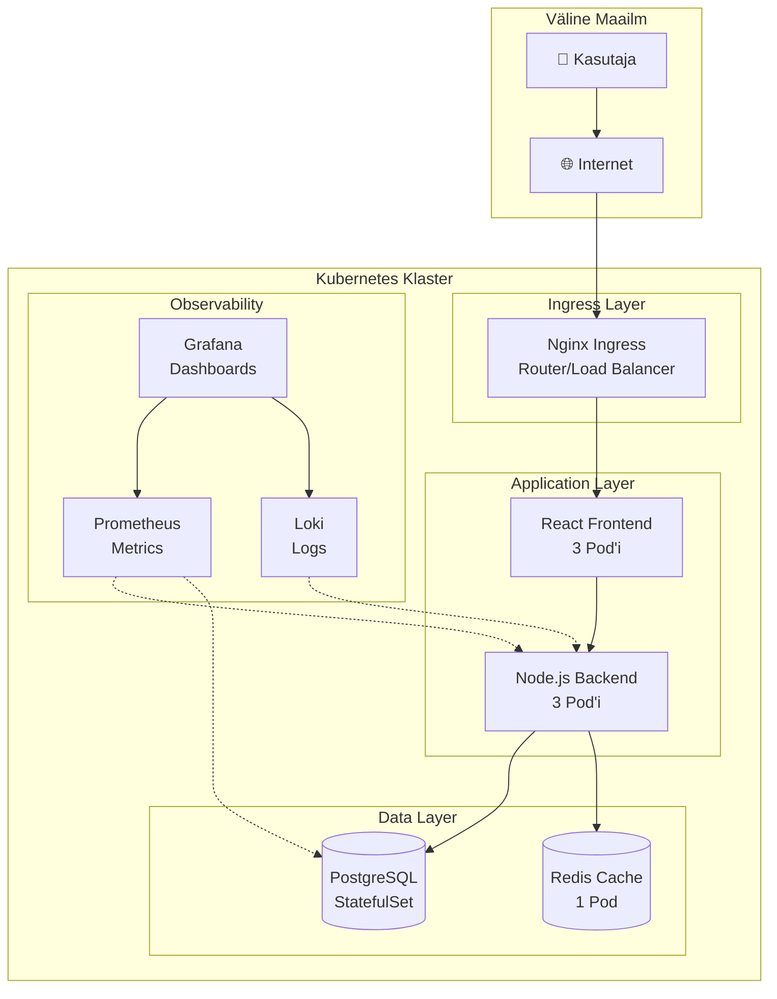

# Kubernetes Labor: E-Pood Mikroteenustega

## Sissejuhatus ja Arhitektuuri Ülevaade

See labor õpetab teid ehitama päris mikroteenuste arhitektuuriga rakendust Kubernetes'is. Iga samm on selgitatud nii, et saate aru, miks me midagi teeme. Labor on mõeldud iseseisvaks läbimiseks ja võtab umbes 4 tundi. Kõik koodinäited sisaldavad kommentaare, mis selgitavad iga rea tähendust.

### Mida Me Ehitame - Süsteemi Arhitektuur



Meie süsteem järgib tööstuse parimaid praktikaid. Kasutaja pääseb rakendusele ligi läbi Ingress'i, mis toimib nagu värav. Frontend serveerib kasutajaliidest, Backend töötleb äriloogikat, andmebaas hoiab andmeid püsivalt. Redis kiirendab sagedasi päringuid. Prometheus ja Loki koguvad meetrikaid ja logisid, Grafana kuvab neid ilusates graafikutes.

## Riistvara Nõuded ja Ettevalmistus

### Kontrollige Oma Arvuti Ressursse

Enne alustamist kontrollige, kas teie arvuti on piisavalt võimas. Kubernetes vajab päris palju ressursse, sest see simuleerib tervet serverite klasteri teie arvutis.

```bash
# Windows PowerShell - kontrollige RAM ja CPU
Get-WmiObject Win32_ComputerSystem | Select-Object NumberOfProcessors, @{Name="TotalRAM_GB";Expression={[math]::Round($_.TotalPhysicalMemory/1GB,2)}}

# macOS/Linux - kontrollige RAM ja CPU  
echo "CPU tuumad: $(nproc)"
echo "RAM: $(free -h | grep Mem | awk '{print $2}')"
echo "Vaba ketas: $(df -h / | tail -1 | awk '{print $4}')"
```

| Komponent | Miinimum | Soovitatav | Miks on vaja? |
|-----------|----------|------------|---------------|
| RAM | 8 GB | 16 GB | Minikube vajab 4GB, ülejäänu teie OS-ile |
| CPU | 4 tuuma | 6+ tuuma | Rohkem tuumi = kiirem käivitus |
| Ketas | 20 GB vaba | 30 GB vaba | Docker image'd võtavad palju ruumi |
| OS | Win10/macOS 10.14/Ubuntu 20.04 | Uusim versioon | Vanemad versioonid ei pruugi toetada |

---

## 1. Keskkonna Seadistamine (45 minutit)

### 1.1 Docker Desktop Installimine (15 minutit)

Docker on konteinerite platvorm, mida Kubernetes kasutab rakenduste käitamiseks. Docker Desktop sisaldab kõike vajalikku - Docker Engine, Docker CLI ja Docker Compose. Ilma Docker'ita ei saa Kubernetes konteinereid käitada.

**Allikas:** https://docs.docker.com/get-docker/

```bash
# Pärast installimist kontrollige, kas Docker töötab
docker --version
# Peaks näitama: Docker version 24.x.x või uuemat

docker run hello-world
# Kui näete "Hello from Docker!" sõnumit, töötab kõik

# Vaadake Docker Desktop Settings > Resources
# Andke Docker'ile vähemalt 4GB RAM-i
```

### 1.2 Minikube Installimine ja Seadistamine (15 minutit)

Minikube loob lokaalse Kubernetes klasteri teie arvutisse. See on nagu mini andmekeskus teie laptop'is. Minikube on ametlik Kubernetes projekt ja parim viis õppimiseks.

**Allikas:** https://minikube.sigs.k8s.io/docs/start/

#### Minikube Versioonide Erinevused ja Ühilduvus

| Versioon | Toetatud OS | Docker Ühilduvus | Multipass Ühilduvus | ARM64 Toetus |
|----------|-------------|------------------|---------------------|---------------|
| v1.34.0 | macOS, Linux, Windows | ✅ Hea | ✅ Hea | ⚠️ Probleemid |
| v1.37.0+ | macOS, Linux, Windows | ✅ Hea | ✅ Hea | ✅ Parem toetus |
| v1.40.0+ | macOS, Linux, Windows | ✅ Hea | ✅ Hea | ✅ Täielik toetus |

**Olulised erinevused:**
- **v1.34.0 ja vanemad**: ARM64 Mac'idel võivad tekkida platform mismatch vead Docker driver'iga
- **v1.37.0+**: Parem ARM64 toetus, vähem platform probleeme
- **v1.40.0+**: Täielik ARM64 toetus, kõige stabiilsem versioon

#### Installatsiooni Valikud

**Valik 1: Homebrew (soovitatav macOS'ile)**
```bash
# macOS - installi uusim versioon
brew install minikube

# Või installi konkreetne versioon
brew install minikube@1.40.0
```

**Valik 2: Otsene alla laadimine (kui Homebrew ei tööta)**
```bash
# macOS ARM64 (Apple Silicon)
curl -LO https://storage.googleapis.com/minikube/releases/latest/minikube-darwin-arm64
sudo install minikube-darwin-arm64 /usr/local/bin/minikube

# macOS Intel
curl -LO https://storage.googleapis.com/minikube/releases/latest/minikube-darwin-amd64
sudo install minikube-darwin-amd64 /usr/local/bin/minikube

# Linux (Ubuntu/Debian)
curl -LO https://storage.googleapis.com/minikube/releases/latest/minikube-linux-amd64
sudo install minikube-linux-amd64 /usr/local/bin/minikube

# Windows (Admin PowerShell)
# Laadige alla: https://minikube.sigs.k8s.io/docs/start/
# Või Chocolatey kaudu:
choco install minikube
```

**Valik 3: Vanema versiooni eemaldamine ja uue installimine**
```bash
# Eemalda vana versioon
sudo rm /usr/local/bin/minikube
# või
brew uninstall minikube

# Installi uus versioon
brew install minikube
```

#### Driver'ite Ühilduvus

| Driver | macOS | Linux | Windows | ARM64 Toetus | Soovitus |
|--------|-------|-------|---------|--------------|----------|
| docker | ✅ | ✅ | ✅ | ⚠️ Probleemid v1.34.0 | Kasuta v1.37.0+ |
| multipass | ✅ | ✅ | ❌ | ✅ Hea | Soovitatav macOS'ile |
| podman | ✅ | ✅ | ❌ | ✅ Hea | Alternatiiv |
| virtualbox | ✅ | ✅ | ✅ | ❌ Ei toeta | Vananenud |
| vmware | ✅ | ✅ | ✅ | ❌ Ei toeta | Vananenud |

#### Kontrollige installatsiooni
```bash
# Kontrollige versiooni
minikube version
# Peaks näitama: minikube version: v1.37.0 või uuemat

# Kontrollige saadaolevaid driver'eid
minikube config defaults driver
```

### 1.3 Kubernetes Klasteri Käivitamine (15 minutit)

Nüüd käivitame päris Kubernetes klasteri. See võtab esimesel korral 5-10 minutit, sest Minikube peab alla laadima kõik vajalikud komponendid (umbes 800MB). Järgmised käivitused on palju kiiremad.

```bash
# Käivita klaster optimeeritud seadetega
# --cpus=2 - annab klastri jaoks 2 CPU tuuma
# --memory=4096 - annab 4GB RAM-i (4096MB)
# --disk-size=20g - reserveerib 20GB kettaruumi
# --driver=docker - kasutab Docker'it (kõige usaldusväärsem)
minikube start \
  --cpus=2 \
  --memory=4096 \
  --disk-size=20g \
  --driver=docker

# Oodake kuni näete:
# ✅ Done! kubectl is now configured to use "minikube" cluster

# Kontrollige, kas klaster töötab
minikube status
# Peaks näitama:
# minikube: Running
# kubelet: Running
# apiserver: Running

# Vaadake klasteri komponente
kubectl get nodes
# NAME       STATUS   ROLES           AGE   VERSION
# minikube   Ready    control-plane   1m    v1.28.0

# Luba vajalikud lisad
minikube addons enable dashboard  # Graafiline UI
minikube addons enable metrics-server  # CPU/RAM monitooring
minikube addons enable ingress  # Välise ligipääsu jaoks
```

**Vea korral:**
```bash
# Kui midagi ei tööta, proovige:
minikube delete  # Kustutab vana klasteri
minikube start --force  # Sunnitud käivitus
```

#### Levinud Probleemid ja Lahendused

**1. Platform Mismatch Error (ARM64 Mac'idel)**
```
WARNING: The requested image's platform (linux/arm64) does not match the detected host platform (linux/amd64/v1)
```
**Lahendus:**
```bash
# Uuenda Minikube uusima versioonini
brew upgrade minikube
# või
sudo rm /usr/local/bin/minikube
brew install minikube

# Kasuta Multipass driver'it
minikube start --driver=multipass
```

**2. Docker Memory Limitation**
```
Docker Desktop has only 3911MB memory but you specified 4096MB
```
**Lahendus:**
```bash
# Vähenda mälu nõuet
minikube start --memory=3000 --cpus=2
# või kasuta Multipass
minikube start --driver=multipass --memory=4000 --cpus=2
```

**3. Driver Mismatch Error**
```
The existing "minikube" cluster was created using the "docker" driver, which is incompatible with requested "multipass" driver
```
**Lahendus:**
```bash
# Kustuta vana klaster ja loo uus
minikube delete
minikube start --driver=multipass
```

**4. Image Pull Errors**
```
minikube was unable to download gcr.io/k8s-minikube/kicbase:v0.0.45
```
**Lahendus:**
```bash
# See on tavaliselt ajutine viga, proovige uuesti
minikube delete
minikube start
```

**5. ARM64 Mac Spetsiifilised Probleemid**
```bash
# Kui Docker driver ei tööta, kasutage Multipass
minikube start --driver=multipass --cpus=2 --memory=4000

# Või kasutage Podman driver'it
minikube start --driver=podman --cpus=2 --memory=4000
```

---

## 2. Kubernetes Dashboard ja Visualiseerimine (30 minutit)

### 2.1 Kubernetes Dashboard (15 minutit)

Kubernetes Dashboard on ametlik veebipõhine UI Kubernetes'i haldamiseks. See näitab kõike, mis klastris toimub - pod'e, service'id, deployment'id. Dashboard on nagu Task Manager, aga terve klasteri jaoks.

**Allikas:** https://kubernetes.io/docs/tasks/access-application-cluster/web-ui-dashboard/

```bash
# Käivitage dashboard uues terminali aknas
# See käsk avab automaatselt brauseri
minikube dashboard

# Terminal näitab midagi sellist:
# 🔌 Enabling dashboard ...
# 🤔 Verifying dashboard health ...
# 🚀 Launching proxy ...
# 🎉 Opening http://127.0.0.1:38647/api/v1/... in your default browser
```

**Dashboard'i kasutamine:**
1. **Namespace selector** (üleval) - valige "All Namespaces" et näha kõike
2. **Workloads** menüü - näete Deployments, Pods, ReplicaSets
3. **Service** menüü - võrgu konfiguratsioon
4. **Config and Storage** - ConfigMaps, Secrets, Volumes
5. **Iga objekti juures** - kolm täppi (...) menüü lubab muuta/kustutada

### 2.2 K9s - Professionaalne Terminal UI (15 minutit)

K9s on terminal'is töötav Kubernetes UI. See on palju kiirem kui kubectl käsud ja professionaalid kasutavad seda iga päev. K9s on nagu Vim, aga Kubernetes'ile.

**Allikas:** https://k9scli.io/

```bash
# Windows installatsioon
choco install k9s
# Või laadige alla: https://github.com/derailed/k9s/releases

# macOS
brew install k9s

# Linux
# Laadige alla viimane versioon GitHubist
curl -sS https://webinstall.dev/k9s | bash

# Käivitage K9s
k9s

# K9s klaviatuurikäsud (need on olulised!):
# : - avab käsurea (command mode)
# :ns - namespace'ide nimekiri
# :po - pod'ide nimekiri  
# :svc - service'ite nimekiri
# :deploy - deployment'ide nimekiri
# Enter - avab detailvaate
# l - näitab logisid
# d - describe (detailne info)
# e - edit (muuda YAML'i)
# ctrl-k - kustuta ressurss
# ESC - tagasi eelmisesse vaatesse
# ? - abi/klaviatuuri spikker
# q või ctrl-c - välju K9s'ist
```

**Harjutus K9s'iga:**
1. Käivitage `k9s`
2. Vajutage `:` ja kirjutage `ns` (namespace'id)
3. Valige `kube-system` namespace (Enter)
4. Vajutage `:po` (näitab pod'e)
5. Valige `coredns` pod
6. Vajutage `l` (näitab logisid)
7. Vajutage `ESC` et minna tagasi

---

## 3. E-Poe Andmebaas (45 minutit)

### 3.1 PostgreSQL StatefulSet (20 minutit)

StatefulSet on Kubernetes'i ressurss andmebaaside jaoks. Erinevalt Deployment'ist, hoiab StatefulSet pod'ide identiteedi ja järjekorra. See on kriitiline andmebaaside jaoks, kus andmed peavad säilima.

**Allikas:** https://kubernetes.io/docs/concepts/workloads/controllers/statefulset/

```yaml
# Looge fail: postgres.yaml
# See YAML fail defineerib kõik PostgreSQL komponendid

# 1. ConfigMap - hoiab andmebaasi seadistust
# ConfigMap on nagu .env fail, aga Kubernetes'is
apiVersion: v1
kind: ConfigMap
metadata:
  name: postgres-config
  labels:
    app: postgres
data:
  # Andmebaasi nimi
  POSTGRES_DB: shopdb
  # Kasutajanimi (mitte-tundlik info)
  POSTGRES_USER: shopuser

---
# 2. Secret - hoiab paroole (krüpteeritud)
# Secret on nagu ConfigMap, aga tundliku info jaoks
apiVersion: v1  
kind: Secret
metadata:
  name: postgres-secret
type: Opaque
data:
  # Parool on base64 kodeeritud: echo -n 'secretpassword' | base64
  # Tulemus: c2VjcmV0cGFzc3dvcmQ=
  POSTGRES_PASSWORD: c2VjcmV0cGFzc3dvcmQ=

---
# 3. PersistentVolumeClaim - küsib kettaruumi
# See on nagu "tahan 1GB kõvaketast" taotlus
apiVersion: v1
kind: PersistentVolumeClaim
metadata:
  name: postgres-pvc
spec:
  accessModes:
    - ReadWriteOnce  # Üks pod saab kirjutada
  resources:
    requests:
      storage: 1Gi  # Küsi 1GB kettaruumi

---
# 4. StatefulSet - PostgreSQL server ise
apiVersion: apps/v1
kind: StatefulSet
metadata:
  name: postgres
spec:
  serviceName: postgres-service  # Vajab headless service'i
  replicas: 1  # Ainult 1 koopia (master)
  selector:
    matchLabels:
      app: postgres
  template:
    metadata:
      labels:
        app: postgres
    spec:
      containers:
      - name: postgres
        image: postgres:14-alpine  # Alpine = väike image (50MB vs 350MB)
        ports:
        - containerPort: 5432  # PostgreSQL vaikimisi port
          name: postgres
        env:
        # Võta seaded ConfigMap'ist
        - name: POSTGRES_DB
          valueFrom:
            configMapKeyRef:
              name: postgres-config
              key: POSTGRES_DB
        - name: POSTGRES_USER
          valueFrom:
            configMapKeyRef:
              name: postgres-config
              key: POSTGRES_USER
        # Võta parool Secret'ist (turvalisem)
        - name: POSTGRES_PASSWORD
          valueFrom:
            secretKeyRef:
              name: postgres-secret
              key: POSTGRES_PASSWORD
        volumeMounts:
        - name: postgres-storage
          mountPath: /var/lib/postgresql/data  # Kuhu PostgreSQL salvestab andmed
        resources:
          requests:
            memory: "256Mi"  # Minimaalne RAM
            cpu: "250m"  # 0.25 CPU tuuma
          limits:
            memory: "512Mi"  # Maksimaalne RAM
            cpu: "500m"  # 0.5 CPU tuuma
        # Kontrolli kas andmebaas töötab
        livenessProbe:
          exec:
            command:
            - pg_isready
            - -U
            - shopuser
          initialDelaySeconds: 30  # Oota 30 sekundit enne kontrollimist
          periodSeconds: 10  # Kontrolli iga 10 sekundi tagant
      volumes:
      - name: postgres-storage
        persistentVolumeClaim:
          claimName: postgres-pvc  # Kasuta eelnevalt loodud PVC'd

---
# 5. Service - võimaldab teistel pod'idel andmebaasiga ühenduda
apiVersion: v1
kind: Service
metadata:
  name: postgres-service
spec:
  selector:
    app: postgres  # Leiab pod'id selle label'iga
  ports:
  - port: 5432  # Service'i port
    targetPort: 5432  # Pod'i port
  type: ClusterIP  # Ainult klasteri sees (mitte väljast)
```

### 3.2 Deploy ja Seadista Andmebaas (15 minutit)

Nüüd deploy'ime PostgreSQL'i ja loome vajalikud tabelid. Kubernetes loob automaatselt kõik ressursid õiges järjekorras.

```bash
# Deploy PostgreSQL
kubectl apply -f postgres.yaml

# Jälgi pod'i käivitumist (võib võtta 30-60 sekundit)
kubectl get pods -w
# Oodake kuni postgres-0 STATE on "Running"
# Ctrl+C et lõpetada jälgimine

# Kontrolli, kas kõik ressursid on loodud
kubectl get all | grep postgres
kubectl get pvc  # Peab näitama "Bound" staatust
kubectl get secrets  # Peab näitama postgres-secret
kubectl get configmap  # Peab näitama postgres-config

# Loo andmebaasi tabelid
# kubectl exec käivitab käsu pod'i sees
kubectl exec -it postgres-0 -- psql -U shopuser -d shopdb

# PostgreSQL prompt'is (shopdb=>), kopeeri ja kleebi:
```

```sql
-- Loome toodete tabeli
CREATE TABLE products (
    id SERIAL PRIMARY KEY,
    name VARCHAR(100) NOT NULL,
    description TEXT,
    price DECIMAL(10,2) NOT NULL,
    stock INTEGER DEFAULT 0,
    category VARCHAR(50),
    image_url VARCHAR(200),
    created_at TIMESTAMP DEFAULT CURRENT_TIMESTAMP
);

-- Loome kasutajate tabeli
CREATE TABLE users (
    id SERIAL PRIMARY KEY,
    username VARCHAR(50) UNIQUE NOT NULL,
    email VARCHAR(100) UNIQUE NOT NULL,
    password_hash VARCHAR(200),
    created_at TIMESTAMP DEFAULT CURRENT_TIMESTAMP
);

-- Loome tellimuste tabeli
CREATE TABLE orders (
    id SERIAL PRIMARY KEY,
    user_id INTEGER REFERENCES users(id),
    total DECIMAL(10,2),
    status VARCHAR(20) DEFAULT 'pending',
    created_at TIMESTAMP DEFAULT CURRENT_TIMESTAMP
);

-- Sisestame näidistooted
INSERT INTO products (name, description, price, stock, category) VALUES
('Sülearvuti Dell XPS 13', 'Õhuke ja kerge sülearvuti', 1299.99, 5, 'Arvutid'),
('Hiir Logitech MX Master', 'Ergnoomiline juhtmeta hiir', 89.99, 15, 'Tarvikud'),
('Klaviatuur Keychron K2', 'Mehaaniline 65% klaviatuur', 119.99, 8, 'Tarvikud'),
('Monitor LG 27"', '4K IPS panel, 27 tolline', 449.99, 3, 'Monitorid'),
('Kõrvaklapid Sony WH-1000XM4', 'Mürasummutusega kõrvaklapid', 279.99, 12, 'Audio'),
('iPad Air', 'Apple tahvelarvuti', 699.99, 7, 'Tahvlid'),
('Samsung Galaxy S23', 'Android nutitelefon', 899.99, 10, 'Telefonid'),
('Veebikaamera Logitech C920', '1080p HD veebikaamera', 79.99, 20, 'Tarvikud');

-- Kontrolli, kas andmed on sisestatud
SELECT * FROM products;

-- Välju PostgreSQL'ist
\q
```

### 3.3 Testi Andmebaasi Ühendust (10 minutit)

Testime, kas andmebaas on kättesaadav ja töötab korrektselt. Loome ajutise test pod'i, mis proovib andmebaasiga ühenduda.

```bash
# Loo test pod PostgreSQL kliendiga
kubectl run postgres-test --image=postgres:14-alpine --rm -it --restart=Never -- \
  psql -h postgres-service -U shopuser -d shopdb -c "SELECT count(*) FROM products;"

# Peaks näitama:
#  count 
# -------
#      8
# (1 row)

# Vaata Service'i detaile
kubectl describe service postgres-service
# Endpoints näitab pod'i IP aadressi

# Vaata pod'i logisid
kubectl logs postgres-0 --tail=20
```

---

## 4. Node.js Backend API (45 minutit)

### 4.1 Backend API Kood ja Deployment (25 minutit)

Backend on REST API, mis suhtleb andmebaasiga ja serveerib JSON andmeid. Kasutame Node.js Express framework'i, sest see on lihtne ja kiire.

**Allikas:** https://expressjs.com/

```yaml
# Looge fail: backend.yaml

# ConfigMap API koodiga
# See on natuke ebatavaline, aga õppimiseks mugav
# Produktsioonis kasutaksite Docker image'i
apiVersion: v1
kind: ConfigMap
metadata:
  name: backend-code
data:
  # package.json - Node.js projekti konfiguratsioon
  package.json: |
    {
      "name": "shop-backend",
      "version": "1.0.0",
      "description": "E-poe REST API",
      "main": "server.js",
      "scripts": {
        "start": "node server.js"
      },
      "dependencies": {
        "express": "^4.18.2",
        "pg": "^8.11.0",
        "cors": "^2.8.5",
        "dotenv": "^16.3.1"
      }
    }
  
  # server.js - API põhikood
  server.js: |
    // Impordi vajalikud teegid
    const express = require('express');
    const { Pool } = require('pg');  // PostgreSQL klient
    const cors = require('cors');  // Lubab cross-origin päringuid
    
    // Loo Express app
    const app = express();
    
    // Middleware
    app.use(cors());  // Luba kõik CORS päringud
    app.use(express.json());  // Parse JSON body'd
    
    // PostgreSQL ühendus
    // Pool hoiab mitut ühendust avatud efektiivsuse jaoks
    const pool = new Pool({
      host: process.env.DB_HOST || 'postgres-service',
      port: process.env.DB_PORT || 5432,
      database: process.env.DB_NAME || 'shopdb',
      user: process.env.DB_USER || 'shopuser',
      password: process.env.DB_PASSWORD || 'secretpassword',
      max: 20,  // Max 20 ühendust
      idleTimeoutMillis: 30000,  // Sulge idle ühendused 30s pärast
      connectionTimeoutMillis: 2000,  // Timeout uue ühenduse loomisel
    });
    
    // Health check endpoint - Kubernetes kasutab seda
    app.get('/health', (req, res) => {
      res.json({ 
        status: 'OK',
        timestamp: new Date().toISOString(),
        uptime: process.uptime() + ' seconds',
        memory: (process.memoryUsage().heapUsed / 1024 / 1024).toFixed(2) + ' MB'
      });
    });
    
    // Ready check - kontrollib andmebaasi ühendust
    app.get('/ready', async (req, res) => {
      try {
        await pool.query('SELECT 1');
        res.json({ ready: true });
      } catch (err) {
        res.status(503).json({ ready: false, error: err.message });
      }
    });
    
    // GET /api/products - kõik tooted
    app.get('/api/products', async (req, res) => {
      try {
        console.log('Fetching all products...');
        const result = await pool.query(
          'SELECT * FROM products ORDER BY created_at DESC'
        );
        res.json({
          success: true,
          count: result.rows.length,
          data: result.rows
        });
      } catch (err) {
        console.error('Database error:', err);
        res.status(500).json({ 
          success: false,
          error: 'Database error', 
          message: err.message 
        });
      }
    });
    
    // GET /api/products/:id - üks toode
    app.get('/api/products/:id', async (req, res) => {
      try {
        const { id } = req.params;
        console.log(`Fetching product ${id}...`);
        
        const result = await pool.query(
          'SELECT * FROM products WHERE id = $1',
          [id]
        );
        
        if (result.rows.length === 0) {
          return res.status(404).json({ 
            success: false,
            error: 'Product not found' 
          });
        }
        
        res.json({
          success: true,
          data: result.rows[0]
        });
      } catch (err) {
        console.error('Database error:', err);
        res.status(500).json({ 
          success: false,
          error: 'Database error',
          message: err.message 
        });
      }
    });
    
    // POST /api/products/:id/buy - osta toode
    app.post('/api/products/:id/buy', async (req, res) => {
      const client = await pool.connect();
      try {
        const { id } = req.params;
        const { quantity = 1 } = req.body;
        
        console.log(`Buying ${quantity} of product ${id}...`);
        
        // Alusta transaktsioon
        await client.query('BEGIN');
        
        // Lukusta rida, et vältida race condition'e
        const result = await client.query(
          'SELECT * FROM products WHERE id = $1 FOR UPDATE',
          [id]
        );
        
        if (result.rows.length === 0) {
          await client.query('ROLLBACK');
          return res.status(404).json({ 
            success: false,
            error: 'Product not found' 
          });
        }
        
        const product = result.rows[0];
        
        if (product.stock < quantity) {
          await client.query('ROLLBACK');
          return res.status(400).json({ 
            success: false,
            error: 'Not enough stock',
            available: product.stock
          });
        }
        
        // Uuenda laoseisu
        await client.query(
          'UPDATE products SET stock = stock - $1 WHERE id = $2',
          [quantity, id]
        );
        
        // Kinnita transaktsioon
        await client.query('COMMIT');
        
        res.json({
          success: true,
          message: `Successfully bought ${quantity} items`,
          remaining_stock: product.stock - quantity
        });
        
      } catch (err) {
        await client.query('ROLLBACK');
        console.error('Transaction error:', err);
        res.status(500).json({ 
          success: false,
          error: 'Transaction failed',
          message: err.message 
        });
      } finally {
        client.release();
      }
    });
    
    // GET /api/stats - statistika
    app.get('/api/stats', async (req, res) => {
      try {
        const stats = await pool.query(`
          SELECT 
            COUNT(*) as total_products,
            SUM(stock) as total_stock,
            AVG(price) as average_price,
            MIN(price) as min_price,
            MAX(price) as max_price
          FROM products
        `);
        
        res.json({
          success: true,
          data: stats.rows[0]
        });
      } catch (err) {
        res.status(500).json({ 
          success: false,
          error: err.message 
        });
      }
    });
    
    // Käivita server
    const PORT = process.env.PORT || 3000;
    app.listen(PORT, () => {
      console.log(`Backend API running on port ${PORT}`);
      console.log(`Database: ${pool.options.host}:${pool.options.port}/${pool.options.database}`);
    });

---
# Deployment - 3 API serverit
apiVersion: apps/v1
kind: Deployment
metadata:
  name: backend-api
spec:
  replicas: 3  # 3 koopiat koormuse jaotamiseks
  selector:
    matchLabels:
      app: backend
  template:
    metadata:
      labels:
        app: backend
    spec:
      # Init container - paigaldab Node.js sõltuvused
      initContainers:
      - name: npm-install
        image: node:18-alpine
        command: ['sh', '-c']
        args:
        - |
          echo "Installing npm packages..."
          cp /code/* /app/
          cd /app
          npm install --production
          echo "Installation complete!"
        volumeMounts:
        - name: code
          mountPath: /code
        - name: app
          mountPath: /app
      
      # Põhikonteiner
      containers:
      - name: api
        image: node:18-alpine
        command: ['npm', 'start']
        workingDir: /app
        ports:
        - containerPort: 3000
          name: http
        env:
        - name: NODE_ENV
          value: "production"
        - name: DB_HOST
          value: "postgres-service"
        - name: DB_PASSWORD
          valueFrom:
            secretKeyRef:
              name: postgres-secret
              key: POSTGRES_PASSWORD
        volumeMounts:
        - name: app
          mountPath: /app
        resources:
          requests:
            memory: "128Mi"
            cpu: "100m"
          limits:
            memory: "256Mi"
            cpu: "200m"
        # Kontrolli kas API töötab
        livenessProbe:
          httpGet:
            path: /health
            port: 3000
          initialDelaySeconds: 30
          periodSeconds: 10
        # Kontrolli kas API on valmis päringuid vastu võtma
        readinessProbe:
          httpGet:
            path: /ready
            port: 3000
          initialDelaySeconds: 5
          periodSeconds: 5
      
      volumes:
      - name: code
        configMap:
          name: backend-code
      - name: app
        emptyDir: {}  # Ajutine kaust npm pakettide jaoks

---
# Service - load balancer API serverite vahel
apiVersion: v1
kind: Service
metadata:
  name: backend-service
spec:
  selector:
    app: backend  # Leiab kõik pod'id selle label'iga
  ports:
  - port: 3000  # Service'i port
    targetPort: 3000  # Pod'i port
    protocol: TCP
  type: ClusterIP  # Sisene service
```

### 4.2 Deploy Backend ja Testimine (20 minutit)

Nüüd deploy'ime backend API ja testime, kas see töötab. Backend loob automaatselt 3 pod'i ja Kubernetes jaotab päringud nende vahel.

```bash
# Deploy backend
kubectl apply -f backend.yaml

# Oota kuni kõik 3 pod'i on valmis (1-2 minutit)
kubectl get pods -w
# Peaks nägema 3 backend pod'i Running staatuses
# backend-api-xxxxx-xxx  1/1  Running

# Vaata pod'ide logisid
kubectl logs -l app=backend --tail=10

# Testi API otse pod'ist
# Port-forward teeb pod'i pordi kättesaadavaks localhost'is
kubectl port-forward service/backend-service 3000:3000 &

# Testi health endpoint
curl http://localhost:3000/health
# Peaks tagastama: {"status":"OK","timestamp":"...","uptime":"...","memory":"..."}

# Testi products endpoint
curl http://localhost:3000/api/products
# Peaks tagastama toodete nimekirja JSON formaadis

# Testi üksiku toote päringut
curl http://localhost:3000/api/products/1

# Testi statistika endpoint
curl http://localhost:3000/api/stats

# Sulge port-forward (leia protsessi ID ja katkesta)
ps aux | grep port-forward
kill <PID>
```

---

## 5. React Frontend (45 minutit)

### 5.1 Frontend Rakenduse Kood (20 minutit)

Frontend on React rakendus, mis kuvab tooteid ja võimaldab neid "osta". Kasutame lihtsat HTML + JavaScript'i, et vältida keerulisi build protsesse.

**Allikas:** https://react.dev/

```yaml
# Looge fail: frontend.yaml

# ConfigMap frontend koodiga
apiVersion: v1
kind: ConfigMap
metadata:
  name: frontend-code
data:
  # index.html - põhileht
  index.html: |
    <!DOCTYPE html>
    <html lang="et">
    <head>
        <meta charset="UTF-8">
        <meta name="viewport" content="width=device-width, initial-scale=1.0">
        <title>Kubernetes E-Pood</title>
        <!-- React CDN - lihtsam kui npm build -->
        <script crossorigin src="https://unpkg.com/react@18/umd/react.production.min.js"></script>
        <script crossorigin src="https://unpkg.com/react-dom@18/umd/react-dom.production.min.js"></script>
        <script src="https://unpkg.com/@babel/standalone/babel.min.js"></script>
        <!-- Axios HTTP päringute jaoks -->
        <script src="https://cdn.jsdelivr.net/npm/axios/dist/axios.min.js"></script>
        <style>
            * {
                margin: 0;
                padding: 0;
                box-sizing: border-box;
            }
            
            body {
                font-family: -apple-system, BlinkMacSystemFont, 'Segoe UI', Roboto, sans-serif;
                background: linear-gradient(135deg, #667eea 0%, #764ba2 100%);
                min-height: 100vh;
            }
            
            .container {
                max-width: 1200px;
                margin: 0 auto;
                padding: 20px;
            }
            
            header {
                background: white;
                padding: 20px;
                border-radius: 10px;
                margin-bottom: 30px;
                box-shadow: 0 10px 30px rgba(0,0,0,0.1);
            }
            
            h1 {
                color: #333;
                font-size: 2.5em;
                margin-bottom: 10px;
            }
            
            .subtitle {
                color: #666;
                font-size: 1.1em;
            }
            
            .stats {
                display: grid;
                grid-template-columns: repeat(auto-fit, minmax(200px, 1fr));
                gap: 20px;
                margin: 30px 0;
            }
            
            .stat-card {
                background: white;
                padding: 20px;
                border-radius: 10px;
                text-align: center;
                box-shadow: 0 5px 15px rgba(0,0,0,0.1);
            }
            
            .stat-value {
                font-size: 2em;
                font-weight: bold;
                color: #667eea;
            }
            
            .stat-label {
                color: #666;
                margin-top: 5px;
            }
            
            .products-grid {
                display: grid;
                grid-template-columns: repeat(auto-fill, minmax(280px, 1fr));
                gap: 25px;
                margin-top: 30px;
            }
            
            .product-card {
                background: white;
                border-radius: 10px;
                overflow: hidden;
                box-shadow: 0 5px 15px rgba(0,0,0,0.1);
                transition: transform 0.3s, box-shadow 0.3s;
            }
            
            .product-card:hover {
                transform: translateY(-5px);
                box-shadow: 0 10px 30px rgba(0,0,0,0.15);
            }
            
            .product-header {
                background: linear-gradient(135deg, #667eea 0%, #764ba2 100%);
                color: white;
                padding: 20px;
                font-size: 1.3em;
                font-weight: bold;
            }
            
            .product-body {
                padding: 20px;
            }
            
            .product-description {
                color: #666;
                margin-bottom: 15px;
                min-height: 40px;
            }
            
            .product-price {
                font-size: 1.8em;
                font-weight: bold;
                color: #667eea;
                margin-bottom: 10px;
            }
            
            .product-stock {
                display: inline-block;
                padding: 5px 10px;
                border-radius: 20px;
                font-size: 0.9em;
                margin-bottom: 15px;
            }
            
            .in-stock {
                background: #e8f5e9;
                color: #2e7d32;
            }
            
            .low-stock {
                background: #fff3e0;
                color: #ef6c00;
            }
            
            .out-of-stock {
                background: #ffebee;
                color: #c62828;
            }
            
            button {
                width: 100%;
                padding: 12px;
                background: linear-gradient(135deg, #667eea 0%, #764ba2 100%);
                color: white;
                border: none;
                border-radius: 5px;
                font-size: 1.1em;
                font-weight: bold;
                cursor: pointer;
                transition: opacity 0.3s;
            }
            
            button:hover:not(:disabled) {
                opacity: 0.9;
            }
            
            button:disabled {
                opacity: 0.5;
                cursor: not-allowed;
            }
            
            .loading {
                text-align: center;
                padding: 50px;
                color: white;
                font-size: 1.5em;
            }
            
            .error {
                background: #ff5252;
                color: white;
                padding: 20px;
                border-radius: 10px;
                margin: 20px 0;
            }
            
            .success-message {
                position: fixed;
                top: 20px;
                right: 20px;
                background: #4caf50;
                color: white;
                padding: 15px 25px;
                border-radius: 5px;
                box-shadow: 0 5px 15px rgba(0,0,0,0.2);
                animation: slideIn 0.3s ease;
            }
            
            @keyframes slideIn {
                from {
                    transform: translateX(100%);
                }
                to {
                    transform: translateX(0);
                }
            }
        </style>
    </head>
    <body>
        <div id="root"></div>
        
        <script type="text/babel">
            // React rakendus
            const { useState, useEffect } = React;
            
            // API URL - Kubernetes Service DNS nimi
            // Produktsioonis kasutaksite environment variable'it
            const API_URL = window.location.hostname === 'localhost' 
                ? 'http://localhost:3000'
                : 'http://backend-service:3000';
            
            function App() {
                const [products, setProducts] = useState([]);
                const [loading, setLoading] = useState(true);
                const [error, setError] = useState(null);
                const [stats, setStats] = useState(null);
                const [successMessage, setSuccessMessage] = useState('');
                
                // Lae tooted kui komponent mount'ib
                useEffect(() => {
                    loadProducts();
                    loadStats();
                    // Värskenda iga 30 sekundi tagant
                    const interval = setInterval(() => {
                        loadProducts();
                        loadStats();
                    }, 30000);
                    return () => clearInterval(interval);
                }, []);
                
                // Funktsioon toodete laadimiseks
                const loadProducts = async () => {
                    try {
                        console.log('Loading products from:', API_URL);
                        const response = await axios.get(`${API_URL}/api/products`);
                        setProducts(response.data.data);
                        setError(null);
                    } catch (err) {
                        console.error('Error loading products:', err);
                        setError('Ei saanud tooteid laadida. Backend ei vasta.');
                        // Näidisandmed, kui API ei tööta
                        setProducts([
                            {id: 1, name: 'Näidistoode', price: 99.99, stock: 5, description: 'API ei tööta, näitan näidisandmeid'}
                        ]);
                    } finally {
                        setLoading(false);
                    }
                };
                
                // Funktsioon statistika laadimiseks
                const loadStats = async () => {
                    try {
                        const response = await axios.get(`${API_URL}/api/stats`);
                        setStats(response.data.data);
                    } catch (err) {
                        console.error('Error loading stats:', err);
                    }
                };
                
                // Funktsioon toote ostmiseks
                const buyProduct = async (productId, productName) => {
                    try {
                        const response = await axios.post(`${API_URL}/api/products/${productId}/buy`, {
                            quantity: 1
                        });
                        
                        if (response.data.success) {
                            setSuccessMessage(`Ostsite toote: ${productName}`);
                            setTimeout(() => setSuccessMessage(''), 3000);
                            loadProducts(); // Värskenda toodete nimekiri
                            loadStats(); // Värskenda statistika
                        }
                    } catch (err) {
                        console.error('Error buying product:', err);
                        if (err.response?.data?.error === 'Not enough stock') {
                            setError('Toode on otsas!');
                        } else {
                            setError('Ostmine ebaõnnestus. Proovige uuesti.');
                        }
                        setTimeout(() => setError(null), 3000);
                    }
                };
                
                // Funktsioon laoseisu staatuse määramiseks
                const getStockStatus = (stock) => {
                    if (stock === 0) return { class: 'out-of-stock', text: 'Otsas' };
                    if (stock <= 5) return { class: 'low-stock', text: `Ainult ${stock} tk` };
                    return { class: 'in-stock', text: `Laos: ${stock} tk` };
                };
                
                // Renderi UI
                return (
                    <div className="container">
                        <header>
                            <h1>🚀 Kubernetes E-Pood</h1>
                            <p className="subtitle">
                                Töötab Kubernetes klastris • 
                                Backend: {products.length > 0 ? '✅ Ühendatud' : '❌ Ei vasta'} • 
                                Pod: {window.location.hostname}
                            </p>
                        </header>
                        
                        {stats && (
                            <div className="stats">
                                <div className="stat-card">
                                    <div className="stat-value">{stats.total_products}</div>
                                    <div className="stat-label">Tooteid</div>
                                </div>
                                <div className="stat-card">
                                    <div className="stat-value">{Math.round(stats.total_stock)}</div>
                                    <div className="stat-label">Kogus laos</div>
                                </div>
                                <div className="stat-card">
                                    <div className="stat-value">€{parseFloat(stats.average_price).toFixed(2)}</div>
                                    <div className="stat-label">Keskmine hind</div>
                                </div>
                                <div className="stat-card">
                                    <div className="stat-value">€{parseFloat(stats.max_price).toFixed(2)}</div>
                                    <div className="stat-label">Kalleim toode</div>
                                </div>
                            </div>
                        )}
                        
                        {error && (
                            <div className="error">
                                ⚠️ {error}
                            </div>
                        )}
                        
                        {successMessage && (
                            <div className="success-message">
                                ✅ {successMessage}
                            </div>
                        )}
                        
                        {loading ? (
                            <div className="loading">
                                ⏳ Laadin tooteid...
                            </div>
                        ) : (
                            <div className="products-grid">
                                {products.map(product => {
                                    const stockStatus = getStockStatus(product.stock);
                                    return (
                                        <div key={product.id} className="product-card">
                                            <div className="product-header">
                                                {product.name}
                                            </div>
                                            <div className="product-body">
                                                <p className="product-description">
                                                    {product.description || 'Suurepärane toode!'}
                                                </p>
                                                <div className="product-price">
                                                    €{parseFloat(product.price).toFixed(2)}
                                                </div>
                                                <div className={`product-stock ${stockStatus.class}`}>
                                                    {stockStatus.text}
                                                </div>
                                                <button
                                                    onClick={() => buyProduct(product.id, product.name)}
                                                    disabled={product.stock === 0}
                                                >
                                                    {product.stock === 0 ? 'Otsas' : 'Osta'}
                                                </button>
                                            </div>
                                        </div>
                                    );
                                })}
                            </div>
                        )}
                    </div>
                );
            }
            
            // Render React app
            ReactDOM.render(<App />, document.getElementById('root'));
        </script>
    </body>
    </html>
  
  # nginx.conf - serveri konfiguratsioon
  nginx.conf: |
    server {
        listen 80;
        server_name _;
        
        # Frontend failid
        location / {
            root /usr/share/nginx/html;
            index index.html;
            try_files $uri $uri/ /index.html;
        }
        
        # Proxy API päringud backend'i
        location /api {
            proxy_pass http://backend-service:3000;
            proxy_http_version 1.1;
            proxy_set_header Upgrade $http_upgrade;
            proxy_set_header Connection 'upgrade';
            proxy_set_header Host $host;
            proxy_cache_bypass $http_upgrade;
        }
    }

---
# Frontend Deployment
apiVersion: apps/v1
kind: Deployment
metadata:
  name: frontend
spec:
  replicas: 3  # 3 frontend serverit
  selector:
    matchLabels:
      app: frontend
  template:
    metadata:
      labels:
        app: frontend
    spec:
      containers:
      - name: nginx
        image: nginx:alpine
        ports:
        - containerPort: 80
        volumeMounts:
        - name: html
          mountPath: /usr/share/nginx/html
        - name: config
          mountPath: /etc/nginx/conf.d
        resources:
          requests:
            memory: "64Mi"
            cpu: "50m"
          limits:
            memory: "128Mi"
            cpu: "100m"
      volumes:
      - name: html
        configMap:
          name: frontend-code
          items:
          - key: index.html
            path: index.html
      - name: config
        configMap:
          name: frontend-code
          items:
          - key: nginx.conf
            path: default.conf

---
# Frontend Service
apiVersion: v1
kind: Service
metadata:
  name: frontend-service
spec:
  selector:
    app: frontend
  ports:
  - port: 80
    targetPort: 80
  type: NodePort  # Teeb kättesaadavaks väljast
```

### 5.2 Deploy Frontend ja Testimine (25 minutit)

Deploy'ime frontend'i ja testime kogu rakendust. Frontend peaks automaatselt ühenduma backend API'ga ja näitama tooteid andmebaasist.

```bash
# Deploy frontend
kubectl apply -f frontend.yaml

# Oota kuni kõik 3 frontend pod'i on valmis
kubectl get pods -w
# Peaks nägema midagi sellist:
# frontend-xxxxx-xxx   1/1   Running   0   30s
# frontend-xxxxx-yyy   1/1   Running   0   30s
# frontend-xxxxx-zzz   1/1   Running   0   30s

# Vaata mis port Minikube määras frontend'ile
kubectl get service frontend-service
# NAME               TYPE       CLUSTER-IP     EXTERNAL-IP   PORT(S)        AGE
# frontend-service   NodePort   10.96.xx.xx    <none>        80:30XXX/TCP   1m

# Ava frontend brauseris
minikube service frontend-service
# Avaneb brauser automaatselt

# Või kasuta port-forward'i
kubectl port-forward service/frontend-service 8080:80
# Ava brauseris: http://localhost:8080
```

**Testimine brauseris:**
1. Kontrollige, kas näete toodete nimekirja
2. Proovige toodet "osta" - laoseis peaks vähenema
3. Värskendage lehte - näete et laoseis jäi püsima
4. Vaadake Network tab'i Developer Tools'is - näete API päringuid

**Vea korral kontrollige:**
```bash
# Vaata frontend pod'i logisid
kubectl logs -l app=frontend --tail=20

# Vaata backend pod'i logisid
kubectl logs -l app=backend --tail=20

# Kontrolli kas backend service töötab
kubectl exec -it $(kubectl get pods -l app=frontend -o jsonpath='{.items[0].metadata.name}') -- curl http://backend-service:3000/health

# Kontrolli DNS'i
kubectl exec -it $(kubectl get pods -l app=frontend -o jsonpath='{.items[0].metadata.name}') -- nslookup backend-service
```

---

## 6. Monitoring ja Observability (45 minutit)

### 6.1 Prometheus Installeerimine (20 minutit)

Prometheus on de facto standard Kubernetes'i monitooringuteks. See kogub meetrikaid kõigist pod'idest ja salvestab need ajaridade andmebaasi. Kasutame Helm'i, mis on Kubernetes'i paketihaldur.

**Allikas:** https://prometheus.io/docs/introduction/overview/

```bash
# Installi Helm kui pole
# Windows (Chocolatey)
choco install kubernetes-helm

# macOS
brew install helm

# Linux
curl https://raw.githubusercontent.com/helm/helm/main/scripts/get-helm-3 | bash

# Kontrolli Helm versiooni
helm version

# Lisa Prometheus Helm repository
helm repo add prometheus-community https://prometheus-community.github.io/helm-charts
helm repo update

# Installi Prometheus koos Grafana'ga
# See loob monitoring namespace'i ja installeerib kõik komponendid
helm install monitoring prometheus-community/kube-prometheus-stack \
  --namespace monitoring \
  --create-namespace \
  --set prometheus.prometheusSpec.serviceMonitorSelectorNilUsesHelmValues=false \
  --set grafana.adminPassword=admin123

# Oota kuni kõik pod'id on valmis (2-3 minutit)
kubectl get pods -n monitoring -w
# Peaks nägema ~10 pod'i: prometheus, grafana, alertmanager, node-exporter jne
```

### 6.2 Grafana Dashboard (15 minutit)

Grafana on visualiseerimise tööriist, mis kuvab Prometheus'i meetrikaid ilusates graafikutes. Kube-prometheus-stack tuleb juba valmis dashboard'idega.

**Allikas:** https://grafana.com/docs/grafana/latest/

```bash
# Port-forward Grafana
kubectl port-forward -n monitoring service/monitoring-grafana 3000:80 &
echo "Grafana töötab: http://localhost:3000"
echo "Kasutaja: admin"
echo "Parool: admin123"

# Ava brauseris http://localhost:3000
# Login: admin / admin123
```

**Grafana kasutamine:**
1. **Home** → **Dashboards** → valige dashboard
2. **Kubernetes / Compute Resources / Cluster** - üldine klasteri vaade
3. **Kubernetes / Compute Resources / Namespace (Pods)** - pod'ide ressursid
4. **Node Exporter Full** - serveri meetrikad
5. Valige ajavahemik üleval paremal (Last 5 minutes, Last 15 minutes jne)

**Loo oma dashboard:**
1. **Create** (+ ikoon) → **Dashboard**
2. **Add new panel**
3. Query: `rate(container_cpu_usage_seconds_total{pod=~"backend.*"}[5m])`
4. Panel title: "Backend CPU Usage"
5. **Apply**

### 6.3 Custom Metrics Lisamine (10 minutit)

Lisame oma rakendusele Prometheus meetrikaid, et jälgida äriloogikat.

```yaml
# Looge fail: servicemonitor.yaml
# ServiceMonitor ütleb Prometheus'ile, kust meetrikaid koguda
apiVersion: monitoring.coreos.com/v1
kind: ServiceMonitor
metadata:
  name: backend-metrics
  labels:
    app: backend
spec:
  selector:
    matchLabels:
      app: backend
  endpoints:
  - port: http
    interval: 30s
    path: /metrics
```

Lisage backend API'sse metrics endpoint:
```javascript
// Lisage see kood backend server.js faili
// Prometheus meetrikad
app.get('/metrics', async (req, res) => {
    try {
        // Päri statistika andmebaasist
        const stats = await pool.query(`
            SELECT 
                COUNT(*) as total_products,
                SUM(stock) as total_stock
            FROM products
        `);
        
        // Prometheus formaat
        res.set('Content-Type', 'text/plain');
        res.send(`
# HELP shop_products_total Total number of products
# TYPE shop_products_total gauge
shop_products_total ${stats.rows[0].total_products}

# HELP shop_stock_total Total items in stock  
# TYPE shop_stock_total gauge
shop_stock_total ${stats.rows[0].total_stock}

# HELP shop_api_requests_total Total API requests
# TYPE shop_api_requests_total counter
shop_api_requests_total{endpoint="/api/products"} ${Math.floor(Math.random() * 100)}
        `);
    } catch (err) {
        res.status(500).send('Error generating metrics');
    }
});
```

Deploy ServiceMonitor:
```bash
kubectl apply -f servicemonitor.yaml

# Kontrolli Prometheus Targets
kubectl port-forward -n monitoring service/monitoring-kube-prometheus-prometheus 9090:9090
# Ava http://localhost:9090/targets
# Peaks nägema "backend-metrics" target'i
```

---

## 7. Ingress ja Väline Ligipääs (30 minutit)

### 7.1 Nginx Ingress Controller (15 minutit)

Ingress võimaldab pääseda rakendusele ligi domeeninime kaudu. See on nagu reverse proxy või load balancer.

**Allikas:** https://kubernetes.io/docs/concepts/services-networking/ingress/

```bash
# Luba Ingress addon Minikube's
minikube addons enable ingress

# Oota kuni Ingress controller käivitub
kubectl get pods -n ingress-nginx -w
# ingress-nginx-controller-xxx peaks olema Running staatuses

# Vaata Ingress controller'i IP
kubectl get service -n ingress-nginx
```

### 7.2 Ingress Reeglid (15 minutit)

Loome Ingress reeglid, mis suunavad liikluse õigetele service'itele URL'i põhjal.

```yaml
# Looge fail: ingress.yaml
apiVersion: networking.k8s.io/v1
kind: Ingress
metadata:
  name: shop-ingress
  annotations:
    # Nginx spetsiifilised seaded
    nginx.ingress.kubernetes.io/rewrite-target: /
    nginx.ingress.kubernetes.io/enable-cors: "true"
spec:
  ingressClassName: nginx
  rules:
  # Esimene reegel - shop.local domeen
  - host: shop.local
    http:
      paths:
      # Frontend
      - path: /
        pathType: Prefix
        backend:
          service:
            name: frontend-service
            port:
              number: 80
      # API endpoint'id
      - path: /api
        pathType: Prefix
        backend:
          service:
            name: backend-service
            port:
              number: 3000
  # Teine reegel - metrics.local domeen
  - host: metrics.local
    http:
      paths:
      - path: /
        pathType: Prefix
        backend:
          service:
            name: monitoring-grafana
            namespace: monitoring
            port:
              number: 80
```

Deploy ja testi Ingress:
```bash
# Deploy Ingress
kubectl apply -f ingress.yaml

# Vaata Ingress'i
kubectl get ingress
kubectl describe ingress shop-ingress

# Saage Minikube IP
minikube ip
# Näiteks: 192.168.49.2

# Lisa hosts faili (admin õigused vajalikud)
# Windows: C:\Windows\System32\drivers\etc\hosts
# Linux/Mac: /etc/hosts
echo "$(minikube ip) shop.local metrics.local" | sudo tee -a /etc/hosts

# Testi brauseris
# http://shop.local - peaks näitama e-poodi
# http://metrics.local - peaks näitama Grafanat
```

---

## 8. Chaos Engineering ja Testimine (30 minutit)

### 8.1 Testi Pod Failure Recovery (10 minutit)

Kubernetes peab automaatselt taastama kukkunud pod'id. Testime seda, "tappes" pod'e.

```bash
# Vaata töötavaid pod'e
kubectl get pods

# "Tapa" üks backend pod
kubectl delete pod $(kubectl get pods -l app=backend -o jsonpath='{.items[0].metadata.name}')

# Vaata kuidas uus pod tekib automaatselt (10-30 sekundit)
kubectl get pods -w

# Testi kas rakendus töötab endiselt
curl http://shop.local/api/health

# Simuleeri node failure
# Drain - evakueeri kõik pod'id node'ist
kubectl drain minikube --ignore-daemonsets --delete-emptydir-data

# Kõik pod'id peaksid liikuma... aga Minikube'is on ainult 1 node!
# Uncordon - luba node uuesti
kubectl uncordon minikube
```

### 8.2 Load Testing (10 minutit)

Testime, kuidas rakendus käitub koormuse all. Kasutame lihtsat ab (Apache Bench) tööriista.

```bash
# Loo load test pod
kubectl run loadtest --image=httpd:alpine --rm -it -- sh

# Pod'i sees, installeeri ab
apk add apache2-utils

# Test 1: 100 päringut, 10 samaaegset
ab -n 100 -c 10 http://backend-service:3000/api/products

# Test 2: 1000 päringut, 50 samaaegset  
ab -n 1000 -c 50 http://backend-service:3000/api/products

# Vaata tulemusi:
# Requests per second - mitu päringut sekundis
# Time per request - keskmine aeg päringu kohta
# Failed requests - ebaõnnestunud päringud

# Exit pod
exit
```

Vaata Grafanas, kuidas koormus mõjutab:
1. CPU kasutust
2. Memory kasutust
3. Network traffic
4. Response time

### 8.3 Resource Limits Testimine (10 minutit)

Testime, mis juhtub kui pod kasutab liiga palju ressursse.

```bash
# Loo "pahatahtlik" pod, mis üritab kasutada palju mälu
kubectl run memory-hog --image=progrium/stress --rm -it -- \
  --vm 1 --vm-bytes 1G --timeout 30s

# Pod peaks saama OOMKilled (Out Of Memory Killed) kui ületab limiti

# Vaata pod'i sündmuseid
kubectl describe pod memory-hog

# Vaata node'i ressursse
kubectl top nodes
kubectl top pods
```

---

## 9. Debugging ja Troubleshooting (30 minutit)

### 9.1 Pod Debugging (15 minutit)

Õpime, kuidas debuggida pod'e, mis ei tööta korralikult.

```bash
# Põhilised debug käsud

# 1. Vaata pod'i staatust detailselt
kubectl describe pod <pod-name>
# Otsi sektsioone: Events, Conditions, Containers

# 2. Vaata pod'i logisid
kubectl logs <pod-name>
kubectl logs <pod-name> --previous  # Eelmise konteineri logid
kubectl logs -f <pod-name>  # Jälgi reaalajas

# 3. Mine pod'i sisse
kubectl exec -it <pod-name> -- /bin/sh
# või bash kui saadaval
kubectl exec -it <pod-name> -- /bin/bash

# 4. Debug konteiner
# Lisab ajutise debug konteineri pod'i
kubectl debug <pod-name> -it --image=busybox

# 5. Kopeeri failid pod'ist välja
kubectl cp <pod-name>:/path/to/file ./local-file

# 6. Port forwarding debug'imiseks
kubectl port-forward <pod-name> 8080:80
```

**Tavalised probleemid ja lahendused:**

| Probleem | Põhjus | Lahendus |
|----------|--------|----------|
| ImagePullBackOff | Image'it ei leita | Kontrolli image nime, registry ligipääsu |
| CrashLoopBackOff | Container kukub kohe | Vaata logisid, kontrolli käsku |
| Pending | Pole ressursse | Kontrolli node ressursse, PVC staatust |
| OOMKilled | Mälu otsas | Suurenda memory limits |

### 9.2 Service Discovery Debug (15 minutit)

Testime, kas service discovery töötab korralikult.

```bash
# Loo debug pod DNS testimiseks
kubectl run debug --image=nicolaka/netshoot -it --rm -- bash

# Debug pod'i sees:
# Testi DNS
nslookup backend-service
nslookup backend-service.default.svc.cluster.local
nslookup kubernetes

# Testi connectivity
curl http://backend-service:3000/health
ping backend-service

# Testi service endpoints
curl http://kubernetes:443

# Vaata DNS seadistust
cat /etc/resolv.conf

# Exit
exit

# Vaata service endpoints'e
kubectl get endpoints
kubectl describe service backend-service
```

---

## 10. Cleanup ja Kokkuvõte (15 minutit)

### 10.1 Ressursside Puhastamine (10 minutit)

Puhastame kõik loodud ressursid ja peatame Minikube.

```bash
# Kustuta rakenduse komponendid
kubectl delete -f postgres.yaml
kubectl delete -f backend.yaml
kubectl delete -f frontend.yaml
kubectl delete -f ingress.yaml
kubectl delete -f servicemonitor.yaml

# Kustuta monitoring stack
helm uninstall monitoring -n monitoring
kubectl delete namespace monitoring

# Vaata, kas midagi jäi alles
kubectl get all --all-namespaces

# Peata Minikube (säilitab andmed)
minikube stop

# Või kustuta Minikube täielikult
# minikube delete

# Puhasta hosts fail
# Eemalda rida: <minikube-ip> shop.local metrics.local
sudo nano /etc/hosts  # Linux/Mac
# või
notepad C:\Windows\System32\drivers\etc\hosts  # Windows (admin)
```

### 10.2 Mida Õppisite - Kokkuvõte (5 minutit)

Selles 4-tunnises laboris õppisite:

**Kubernetes põhitõed:**
- ✅ Kubernetes klasteri seadistamine Minikube'iga
- ✅ Pod, Deployment, Service kontseptsioonid
- ✅ ConfigMap ja Secret haldus
- ✅ StatefulSet andmebaaside jaoks
- ✅ PersistentVolume salvestuse haldus

**Rakenduse arhitektuur:**
- ✅ 3-tier mikroteenuste arhitektuur
- ✅ PostgreSQL andmebaas StatefulSet'iga
- ✅ Node.js REST API
- ✅ React frontend
- ✅ Service discovery ja load balancing

**Monitooring:**
- ✅ Prometheus meetrikate kogumine
- ✅ Grafana dashboard'ide loomine
- ✅ Custom metrics lisamine
- ✅ Resource monitoring

**Networking:**
- ✅ ClusterIP, NodePort service tüübid
- ✅ Ingress controller ja reeglid
- ✅ DNS ja service discovery

**Operations:**
- ✅ Debugging ja troubleshooting
- ✅ Load testing
- ✅ Chaos engineering
- ✅ Resource limits ja quotas

---

## Järgmised Sammud

### Õppimise Jätkamiseks:

1. **Proovige Kind või K3s** - alternatiivsed local Kubernetes
2. **Õppige Helm Charts** - package management
3. **CI/CD Pipeline** - GitLab CI või GitHub Actions
4. **Service Mesh** - Istio või Linkerd
5. **GitOps** - ArgoCD või Flux

### Sertifikaadid:

- **CKA** (Certified Kubernetes Administrator)
- **CKAD** (Certified Kubernetes Application Developer)  
- **CKS** (Certified Kubernetes Security Specialist)

### Kasulikud Ressursid:

- 📚 Kubernetes dokumentatsioon: https://kubernetes.io/docs/
- 📺 CNCF YouTube: https://www.youtube.com/c/cloudnativefdn
- 💬 Kubernetes Slack: https://kubernetes.slack.com
- 🎓 Kubernetes Academy: https://kubernetes.academy
- 🛠️ Awesome Kubernetes: https://github.com/ramitsurana/awesome-kubernetes

### Projekti GitHub:

Kogu selle labori kood on saadaval:
```bash
git clone https://github.com/example/kubernetes-shop-lab
cd kubernetes-shop-lab
./deploy.sh  # Deploy kõik korraga
```

---

**Palju õnne! 🎉** 

Olete edukalt läbinud Kubernetes labori ja ehitanud päris mikroteenuste rakenduse. See on suurepärane algus teie Kubernetes teekonnale!

**Küsimuste korral:**
- Kubernetes foorum: https://discuss.kubernetes.io
- Stack Overflow: https://stackoverflow.com/questions/tagged/kubernetes
- Reddit: https://reddit.com/r/kubernetes
