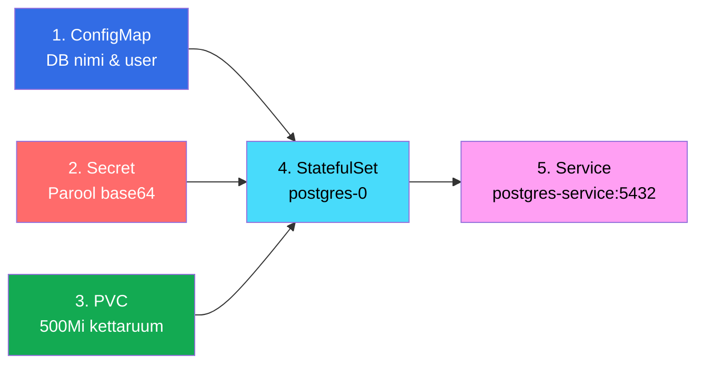
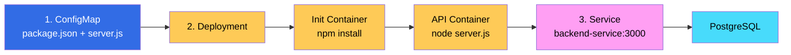
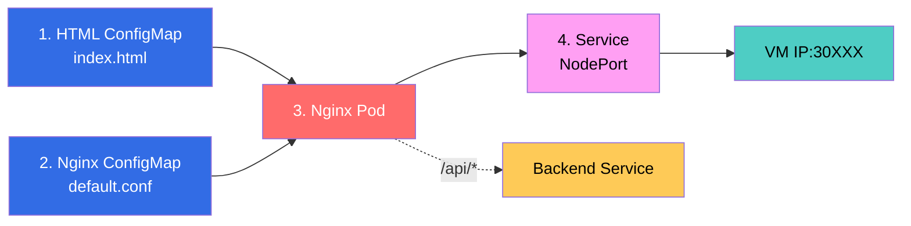

# Kubernetes Labor: E-Pood Mikroteenustega

---

# 📚 Sisukord

1. [Sissejuhatus](#sissejuhatus)
2. [Ettevalmistus](#ettevalmistus)
3. [Kubernetes Klaster](#kubernetes-klaster)
4. [PostgreSQL Andmebaas](#postgresql-andmebaas)
5. [Backend API](#backend-api)
6. [Frontend](#frontend)
7. [Ligipääs ja Testimine](#ligipääs-ja-testimine)
8. [Kubernetes Kontseptid](#kubernetes-kontseptid)
9. [Common Errors](#common-errors)
10. [Cleanup](#cleanup)
11. [Dokumentatsioon](#dokumentatsioon)

---

# 🎯 Sissejuhatus

## Mida Me Ehitame

E-pood kolme komponendiga: andmebaas (PostgreSQL), API server (Node.js), veebileht (Nginx). Kõik komponendid töötavad Kubernetes klastris eraldi pod'ides. Nad suhtlevad omavahel läbi Kubernetes Service'ite.

## Arhitektuur

```mermaid
graph TB
    subgraph "SINU ARVUTI"
        USER[👤 Brauser]
    end
    
    subgraph "VM - Virtual Machine"
        subgraph "Kubernetes Klaster"
            subgraph "Frontend Layer"
                FE[📱 Frontend Pod<br/>nginx:alpine<br/>Port 80]
                FESVC[🚪 frontend-service<br/>NodePort 30XXX]
            end
            
            subgraph "Backend Layer"
                BE[⚙️ Backend Pod<br/>node:18-alpine<br/>Port 3000]
                BESVC[🔗 backend-service<br/>ClusterIP]
            end
            
            subgraph "Data Layer"
                DB[🗄️ postgres-0<br/>postgres:14-alpine<br/>Port 5432]
                DBSVC[🔗 postgres-service<br/>ClusterIP]
                PVC[💾 PVC<br/>500Mi]
            end
            
            subgraph "Configuration"
                CM[📋 ConfigMaps<br/>Seaded & Kood]
                SEC[🔐 Secret<br/>Parool]
            end
        end
    end
    
    USER -->|http://VM-IP:8080| FESVC
    FESVC --> FE
    FE -->|/api/* proxy| BESVC
    BESVC --> BE
    BE -->|SQL| DBSVC
    DBSVC --> DB
    DB -->|data| PVC
    
    CM -.->|env vars| FE
    CM -.->|env vars| BE
    CM -.->|env vars| DB
    SEC -.->|password| DB
    
    style USER fill:#4ecdc4,color:#000
    style FE fill:#ff6b6b,color:#fff
    style BE fill:#feca57,color:#000
    style DB fill:#48dbfb,color:#000
    style FESVC fill:#ff9ff3,color:#000
    style BESVC fill:#ff9ff3,color:#000
    style DBSVC fill:#ff9ff3,color:#000
    style PVC fill:#1dd1a1,color:#fff
    style CM fill:#326ce5,color:#fff
    style SEC fill:#ee5a6f,color:#fff
```



💡 **Andmete voog:**
1. Sina avad brauseris `http://VM-IP:8080`
2. Frontend (Nginx) serveerib HTML lehte
3. JavaScript teeb API päringu `/api/products`
4. Nginx proxy edastab päringu backend'i
5. Backend (Node.js) teeb SQL query PostgreSQL'i
6. PostgreSQL saadab tooted tagasi
7. Backend saadab JSON vastuse
8. JavaScript näitab tooteid lehel

⚡ **Kubernetes eelised:**
- Iga komponent saab iseseisvalt uueneda
- Kui frontend kukub, backend ja DB töötavad edasi
- Saame skaleerida (backend 1→10 pod'i)
- Self-healing - kui pod kukub, Kubernetes loob uue

## Failide Struktuur

```
k8s-lab/
├── postgres/
│   ├── 1-configmap.yaml     # Avalikud seaded (DB nimi, user)
│   ├── 2-secret.yaml        # Parool (base64, turvaline)
│   ├── 3-pvc.yaml          # Kettaruum 500MB (andmed säilivad)
│   ├── 4-statefulset.yaml  # Pod definitsioon (püsiv nimi: postgres-0)
│   └── 5-service.yaml      # Võrgu ligipääs (DNS: postgres-service:5432)
├── backend/
│   ├── 1-configmap.yaml    # Node.js kood (package.json + server.js)
│   ├── 2-deployment.yaml   # Pod definitsioon (skaleeritav)
│   └── 3-service.yaml      # Võrgu ligipääs (DNS: backend-service:3000)
└── frontend/
    ├── 1-html.yaml         # HTML leht + JavaScript
    ├── 2-nginx.yaml        # Nginx config (proxy /api/*)
    ├── 3-deployment.yaml   # Pod definitsioon
    └── 4-service.yaml      # Välise ligipääsu (NodePort)
```

📝 Failide nimetused algavad numbriga, et teaksid rakendamise järjekorda.

---

# 💻 Ettevalmistus

## 1. VM Loomine

### 📍 **KOHALIK ARVUTI** - Windows + VirtualBox

```
1. Laadige Ubuntu Server 22.04 ISO
   https://ubuntu.com/download/server
   
2. VirtualBox'is:
   - New VM → Ubuntu 64-bit
   - 2 CPU, 4GB RAM, 15GB disk
   - Network: NAT
   
3. Installige Ubuntu:
   - Username: student
   - Password: oma valik
```

### 📍 **KOHALIK ARVUTI** - Mac + Multipass

```bash
# Looge VM
multipass launch --name k8s-lab --cpus 2 --memory 4G --disk 15G

# Sisenemine
multipass shell k8s-lab
```

## 2. Kubernetes Setup

### 📍 **VM SEES** - Kõik järgnevad käsud

```bash
# Kontrollige arhitektuuri
uname -m
# x86_64 = AMD64 (Intel/AMD protsessorid)
# aarch64 = ARM64 (Apple Silicon M1/M2)

# Docker
curl -fsSL https://get.docker.com | sh
sudo usermod -aG docker $USER
newgrp docker

# Kubectl (vali õige versioon)
# AMD64:
curl -LO "https://dl.k8s.io/release/$(curl -L -s https://dl.k8s.io/release/stable.txt)/bin/linux/amd64/kubectl"
# ARM64:
# curl -LO "https://dl.k8s.io/release/$(curl -L -s https://dl.k8s.io/release/stable.txt)/bin/linux/arm64/kubectl"

chmod +x kubectl
sudo mv kubectl /usr/local/bin/

# Minikube (vali õige versioon)  
# AMD64:
curl -LO https://storage.googleapis.com/minikube/releases/latest/minikube-linux-amd64
# ARM64:
# curl -LO https://storage.googleapis.com/minikube/releases/latest/minikube-linux-arm64

chmod +x minikube-linux-*
sudo mv minikube-linux-* /usr/local/bin/minikube
```

---

# ☸️ Kubernetes Klaster

### 📍 **VM SEES**

```bash
# Käivita Minikube
minikube start --cpus=2 --memory=2000 --driver=docker

# Kontrolli
minikube status
kubectl get nodes

# Loo projekti kaustad
mkdir -p ~/k8s-lab/{postgres,backend,frontend}
cd ~/k8s-lab
```

---

# 🗄️ PostgreSQL Andmebaas

## Ülevaade



💡 PostgreSQL vajab 5 eraldi faili. ConfigMap hoiab avalikke seadeid nagu andmebaasi nimi. Secret hoiab parooli turvaliselt (base64 encoded). PVC küsib kettaruumi, et andmed säiliksid restart'imisel. StatefulSet loob andmebaasi pod'i püsiva nimega `postgres-0`. Service annab DNS nime `postgres-service:5432`, et teised komponendid leiaksid andmebaasi üles.

⚡ **StatefulSet vs Deployment:** StatefulSet annab püsiva nime (`postgres-0`), Deployment annaks suvalise (`postgres-xyz-abc`). Andmebaas vajab püsivat identiteeti, et PVC leiaks õige pod'i.

⚡ **PVC vajalikkus:** Ilma PVC'ta kaovad kõik andmebaasi andmed, kui pod taaskäivitub. PVC on nagu "external hard drive" konteinerile.

## FAIL 1: ConfigMap - Avalikud Seaded

💡 ConfigMap on nagu `.env` fail Kubernetes'is. Siia paneme info, mis pole salajane. Kui hiljem tahate andmebaasi nime muuta, muudate ainult seda faili - pole vaja konteinerit uuesti ehitada.

### 📍 **VM SEES**

```bash
nano ~/k8s-lab/postgres/1-configmap.yaml
```

```yaml
# ConfigMap hoiab konfiguratsiooni, mis POLE salajane
# Saab muuta ilma konteinerit rebuild'imata
# Kõik pod'id näevad samu väärtusi
apiVersion: v1                    # Kubernetes API versioon (v1 = stable core API)
kind: ConfigMap                   # Ressursi tüüp
metadata:
  name: postgres-config           # Nimi - teised failid viitavad sellele
  namespace: default              # Namespace (vaikimisi 'default')
data:                            # Key-value paarid
  POSTGRES_DB: shopdb            # Andmebaasi nimi - muutub env variable'iks pod'is
  POSTGRES_USER: shopuser        # Kasutajanimi - pole salajane, seega ConfigMap OK

# Kuidas StatefulSet seda kasutab:
# env:
#   - name: POSTGRES_DB
#     valueFrom:
#       configMapKeyRef:
#         name: postgres-config    ← See name
#         key: POSTGRES_DB         ← See key
# Tulemus: Pod'is on env variable POSTGRES_DB='shopdb'
```

**Salvesta:** `Ctrl + O` → Enter → `Ctrl + X`

## FAIL 2: Secret - Paroolid

💡 Secret on spetsiaalselt paroolide jaoks. Kubernetes salvestab Secret'id krüpteeritult etcd andmebaasis. Parool peab olema base64 formaadis - see pole krüpteering, lihtsalt encoding, aga Kubernetes nõuab seda.

### 📍 **VM SEES**

```bash
# Arvuta parool base64 formaadis
echo -n 'secretpassword' | base64
# Tulemus: c2VjcmV0cGFzc3dvcmQ=

nano ~/k8s-lab/postgres/2-secret.yaml
```

```yaml
# Secret hoiab tundlikku infot turvaliselt
# Kubernetes krüpteerib automaatselt etcd'sse
# Ainult volitatud pod'id saavad lugeda (RBAC)
apiVersion: v1
kind: Secret                      # Secret, mitte ConfigMap!
metadata:
  name: postgres-secret           # Nimi viitamiseks
  namespace: default
type: Opaque                      # Tavaline secret (generic)
                                  # Teised tüübid: kubernetes.io/tls, kubernetes.io/dockerconfigjson
data:
  # Parool PEAB olema base64 kodeeritud
  # echo -n 'secretpassword' | base64 → c2VjcmV0cGFzc3dvcmQ=
  POSTGRES_PASSWORD: c2VjcmV0cGFzc3dvcmQ=
  
# Kuidas StatefulSet seda kasutab:
# env:
#   - name: POSTGRES_PASSWORD
#     valueFrom:
#       secretKeyRef:              ← Secret'ist, mitte ConfigMap'ist!
#         name: postgres-secret    ← See name
#         key: POSTGRES_PASSWORD   ← See key
# Kubernetes dekodeerib automaatselt base64 → 'secretpassword'
```

**Salvesta:** `Ctrl + O` → Enter → `Ctrl + X`

## FAIL 3: PVC - Püsiv Kettaruum

💡 PVC (Persistent Volume Claim) on taotlus kettaruumi jaoks. Ilma selleta kaovad kõik andmebaasi andmed, kui pod taaskäivitub. PVC tagab, et PostgreSQL'i andmed salvestatakse kettale ja jäävad alles.

### 📍 **VM SEES**

```bash
nano ~/k8s-lab/postgres/3-pvc.yaml
```

```yaml
# PVC = Persistent Volume Claim - "Ma tahan 500MB kettaruumi"
# Ilma: pod restart = kõik andmed kadunud ❌
# PVC'ga: pod restart = andmed säilivad ✅
apiVersion: v1
kind: PersistentVolumeClaim       # Küsib salvestust
metadata:
  name: postgres-pvc              # Nimi - StatefulSet viitab sellele
  namespace: default
spec:
  accessModes:
    - ReadWriteOnce               # RWO = Üks pod korraga kirjutab
                                  # ReadOnlyMany = mitu pod'i loevad
                                  # ReadWriteMany = mitu pod'i kirjutavad (harv!)
  resources:
    requests:
      storage: 500Mi              # 500 megabaiti
                                  # Võimalikud: 1Gi, 10Gi, 100Gi

# Kuidas StatefulSet seda kasutab:
# volumes:
#   - name: postgres-storage
#     persistentVolumeClaim:
#       claimName: postgres-pvc    ← See name
# volumeMounts:
#   - name: postgres-storage
#     mountPath: /var/lib/postgresql/data  ← PostgreSQL andmete asukoht
```

**Salvesta:** `Ctrl + O` → Enter → `Ctrl + X`

## FAIL 4: StatefulSet - Andmebaasi Pod

💡 StatefulSet loob PostgreSQL pod'i. Erinevalt Deployment'ist annab StatefulSet püsiva nime (`postgres-0`). Andmebaas vajab püsivat nime, et PVC leiaks õige pod'i. StatefulSet garanteerib ka õige käivituse järjekorra.

### 📍 **VM SEES**

```bash
nano ~/k8s-lab/postgres/4-statefulset.yaml
```

```yaml
# StatefulSet annab püsiva identiteedi
# postgres-0 vs postgres-random-xyz ← Deployment annaks random nime
# Andmebaasid vajavad stabiilsust!
apiVersion: apps/v1
kind: StatefulSet                 # MITTE Deployment!
metadata:
  name: postgres
  namespace: default
spec:
  serviceName: postgres-service   # Headless service nimi (peab klappima fail 5'ga)
  replicas: 1                     # ALATI 1 andmebaasi jaoks
                                  # (master-replica setup on keeruline)
  selector:
    matchLabels:
      app: postgres               # Peab klappima template.metadata.labels'iga
  
  template:                       # Pod'i mall (blueprint)
    metadata:
      labels:
        app: postgres             # Service leiab pod'id selle label'i järgi
    spec:
      containers:
      - name: postgres            # Konteineri nimi (suvaline)
        image: postgres:14-alpine # Docker image: postgres v14, alpine = väike (50MB vs 350MB)
        
        ports:
        - containerPort: 5432     # PostgreSQL standard port
          name: postgres          # Pordi nimi (optional, aga hea dokumentatsioon)
        
        # Environment muutujad
        env:
        # ConfigMap'ist (fail 1)
        - name: POSTGRES_DB       # Env variable nimi pod'is
          valueFrom:
            configMapKeyRef:      # Võta ConfigMap'ist
              name: postgres-config  # Fail 1 nimi
              key: POSTGRES_DB       # ConfigMap data key
        
        - name: POSTGRES_USER
          valueFrom:
            configMapKeyRef:
              name: postgres-config
              key: POSTGRES_USER
        
        # Secret'ist (fail 2)
        - name: POSTGRES_PASSWORD
          valueFrom:
            secretKeyRef:         # Võta Secret'ist (turvaline!)
              name: postgres-secret  # Fail 2 nimi
              key: POSTGRES_PASSWORD # Secret data key
        
        # PostgreSQL spetsiifiline - vajab alamkausta
        - name: PGDATA
          value: /var/lib/postgresql/data/pgdata
        
        # Kus hoiame andmeid (mount PVC)
        volumeMounts:
        - name: postgres-storage  # Volume nimi (volumes'ist all)
          mountPath: /var/lib/postgresql/data  # PostgreSQL vaikimisi andmete asukoht
        
        # Ressursi piirangud (väikse VM jaoks)
        resources:
          requests:
            memory: "128Mi"       # Garanteeritud RAM (minimaalne)
            cpu: "100m"           # 0.1 CPU tuuma (100 millicore)
          limits:
            memory: "256Mi"       # Maksimaalne RAM (kui üle, Kubernetes tapab pod'i)
            cpu: "200m"           # 0.2 CPU tuuma max
      
      # Volumes - kust võtame salvestuse
      volumes:
      - name: postgres-storage    # Nimi - volumeMounts kasutab seda
        persistentVolumeClaim:
          claimName: postgres-pvc # Fail 3 nimi (PVC)
```

**Salvesta:** `Ctrl + O` → Enter → `Ctrl + X`

## FAIL 5: Service - Võrgu Ligipääs

💡 Service annab andmebaasile püsiva võrguaadressi ja DNS nime. Ilma Service'ita peaks backend teadma pod'i IP aadressi, mis muutub iga restart'iga. Service annab DNS nime (`postgres-service`), mis ei muutu kunagi. See on nagu telefoni kontakt vs telefoninumber.

### 📍 **VM SEES**

```bash
nano ~/k8s-lab/postgres/5-service.yaml
```

```yaml
# Service = püsiv võrguaadress ja DNS nimi
# Backend kasutab: postgres-service:5432 ← See DNS nimi töötab alati!
apiVersion: v1
kind: Service
metadata:
  name: postgres-service          # DNS nimi!
  namespace: default
spec:
  selector:
    app: postgres                 # Leiab pod'id selle label'iga (fail 4: template.metadata.labels)
  ports:
  - port: 5432                    # Service port (väline)
    targetPort: 5432              # Container port (pod sees)
    protocol: TCP
    # Tähendab: kui keegi ühendub 5432 → suuna pod'i 5432
  type: ClusterIP                 # Ainult klastri sees!
                                  # NodePort = väljast ligipääs portiga 30000-32767
                                  # LoadBalancer = AWS/GCP load balancer

# Kuidas backend ühendub:
# const pool = new Pool({
#   host: 'postgres-service',  ← See name! Kubernetes DNS teeb automaatselt tõlke
#   port: 5432                 ← See port!
# });
# Kubernetes DNS: postgres-service → 10.96.x.x (Service ClusterIP)
```

**Salvesta:** `Ctrl + O` → Enter → `Ctrl + X`

## PostgreSQL Deploy ja Test

### 📍 **VM SEES**

```bash
# Deploy kõik PostgreSQL failid korraga
kubectl apply -f ~/k8s-lab/postgres/

# Näed:
# configmap/postgres-config created
# secret/postgres-secret created
# persistentvolumeclaim/postgres-pvc created
# statefulset.apps/postgres created
# service/postgres-service created

# Kontrolli mis loodi
kubectl get all
kubectl get pvc
kubectl get configmap
kubectl get secret

# Oota kuni pod töötab (max 120 sekundit)
kubectl wait --for=condition=ready pod postgres-0 --timeout=120s

# Initsialiseeri andmebaas testdata'ga
cat > ~/k8s-lab/init.sql << 'EOF'
CREATE TABLE products (
    id SERIAL PRIMARY KEY,
    name VARCHAR(100),
    description TEXT,
    price DECIMAL(10,2),
    stock INTEGER
);

INSERT INTO products (name, description, price, stock) VALUES
('Dell XPS 13', 'Sülearvuti', 1299.99, 5),
('Logitech Hiir', 'Juhtmeta', 89.99, 15),
('Klaviatuur', 'Mehaaniline', 119.99, 8),
('Monitor LG', '4K 27 toll', 449.99, 3),
('Kõrvaklapid', 'Sony', 279.99, 12);
EOF

# Käivita SQL pod'is
kubectl exec -i postgres-0 -- psql -U shopuser -d shopdb < ~/k8s-lab/init.sql

# Test - vaata tooteid
kubectl exec postgres-0 -- psql -U shopuser -d shopdb -c "SELECT * FROM products;"
```

### ✅ Kontrollpunkt
Peate nägema 5 toodet tabelis!

---

# 🔧 Backend API

## Ülevaade



💡 Backend on Node.js API server. Ta ühendub PostgreSQL'iga ja serveerib JSON andmeid. Kasutame Deployment'i, sest backend on stateless - tal pole püsiandmeid. Saab skaleerida mitme koopiaga.

⚡ **Init Container:** Init container käivitub ENNE põhikonteinerit. Meie kasutame npm pakettide installimiseks. Alles kui init container valmis, käivitub põhikonteiner.

## FAIL 1: ConfigMap - Node.js Kood

💡 Tavaliselt ehitatakse Docker image koodiga. Õppimise jaoks hoiame koodi ConfigMap'is. See lubab muuta koodi ilma Docker'it kasutamata. Produktsioonis ÄRGE tehke nii - kasutage Docker image'it!

### 📍 **VM SEES**

```bash
nano ~/k8s-lab/backend/1-configmap.yaml
```

```yaml
# Backend kood ConfigMap'is
# Ebatavaline, aga õppimiseks mugav (ei vaja Docker build'i)
apiVersion: v1
kind: ConfigMap
metadata:
  name: backend-code
  namespace: default
data:
  # package.json - Node.js sõltuvused
  # | tähendab multiline string YAML'is
  package.json: |
    {
      "name": "shop-backend",
      "version": "1.0.0",
      "main": "server.js",
      "dependencies": {
        "express": "^4.18.2",
        "pg": "^8.11.0",
        "cors": "^2.8.5"
      }
    }
  
  # server.js - API kood
  server.js: |
    const express = require('express');
    const { Pool } = require('pg');
    const cors = require('cors');
    
    const app = express();
    
    // Middleware seadistus
    app.use(cors());              // Luba cross-origin requests (frontend'ist)
    app.use(express.json());      // Parse JSON body automaatselt
    
    // PostgreSQL ühendus pool
    const pool = new Pool({
      host: 'postgres-service',   // Service DNS nimi! (fail 5)
      port: 5432,                 // PostgreSQL port
      database: 'shopdb',         // DB nimi (postgres/fail 1)
      user: 'shopuser',           // User (postgres/fail 1)
      password: 'secretpassword', // Parool (postgres/fail 2)
      max: 5                      // Max 5 ühendust pool'is
    });
    
    // Health check endpoint - Kubernetes livenessProbe kasutab
    app.get('/health', (req, res) => {
      res.json({ 
        status: 'OK',
        timestamp: new Date()
      });
    });
    
    // Ready check - Kubernetes readinessProbe kasutab
    // Kontrollib kas DB connection töötab
    app.get('/ready', async (req, res) => {
      try {
        await pool.query('SELECT 1');  // Lihtne test query
        res.json({ ready: true });
      } catch (err) {
        res.status(503).json({ ready: false });  // 503 = Service Unavailable
      }
    });
    
    // API endpoint: kõik tooted
    app.get('/api/products', async (req, res) => {
      try {
        const result = await pool.query('SELECT * FROM products ORDER BY id');
        res.json({ 
          success: true,
          count: result.rows.length,
          data: result.rows 
        });
      } catch (err) {
        console.error('Database error:', err);
        res.status(500).json({ error: err.message });  // 500 = Internal Server Error
      }
    });
    
    // API endpoint: üks toode ID järgi
    app.get('/api/products/:id', async (req, res) => {
      try {
        const result = await pool.query(
          'SELECT * FROM products WHERE id = $1',  // $1 = parameterized query (SQL injection kaitse)
          [req.params.id]
        );
        
        if (result.rows.length === 0) {
          return res.status(404).json({ error: 'Product not found' });  // 404 = Not Found
        }
        
        res.json({ 
          success: true,
          data: result.rows[0] 
        });
      } catch (err) {
        res.status(500).json({ error: err.message });
      }
    });
    
    // Käivita server
    const PORT = 3000;
    app.listen(PORT, () => {
      console.log('Backend API running on port', PORT);
    });
```

**Salvesta:** `Ctrl + O` → Enter → `Ctrl + X`

## FAIL 2: Deployment

💡 Deployment sobib stateless rakendustele. Backend ei salvesta midagi, ainult töötleb päringuid. Deployment lubab skaleerida (1→10 pod'i) ja teeb automaatse taaskäivituse kui pod kukub. Init container installib npm paketid enne põhikonteineri käivitust.

⚡ **Probes:** `livenessProbe` kontrollib kas pod töötab (kui ei, restart). `readinessProbe` kontrollib kas pod valmis päringuteks (kui ei, Service ei saada päringuid).

### 📍 **VM SEES**

```bash
nano ~/k8s-lab/backend/2-deployment.yaml
```

```yaml
# Deployment backend API jaoks
# Stateless, skaleeritav, self-healing
apiVersion: apps/v1
kind: Deployment                  # Mitte StatefulSet! (backend on stateless)
metadata:
  name: backend-api
  namespace: default
spec:
  replicas: 1                     # Alusta 1, saab skaleerida: kubectl scale deployment backend-api --replicas=3
  selector:
    matchLabels:
      app: backend                # Peab klappima template.metadata.labels'iga
  
  template:                       # Pod'i mall
    metadata:
      labels:
        app: backend              # Service leiab pod'id selle järgi (fail 3)
    spec:
      # Init container - käivitub ENNE põhikonteinerit
      # Kasutame npm install'iks
      initContainers:
      - name: npm-install
        image: node:18-alpine     # Node.js 18 alpine (väike image)
        command: ['sh', '-c']     # Shell käsk
        args:
        - |                       # Multiline käsk
          echo "Installing npm packages..."
          cp /code/* /app/        # Kopeeri ConfigMap failid (package.json + server.js)
          cd /app
          npm install --production # Installi dependencies (--production = ei installi dev dependencies)
          echo "Dependencies installed!"
        volumeMounts:
        - name: code              # ConfigMap mount (volumes'ist all)
          mountPath: /code        # Mount ConfigMap siia (read-only)
        - name: app
          mountPath: /app         # NPM installib siia (read-write)
        resources:
          limits:
            memory: "256Mi"
            cpu: "200m"
      
      # Põhikonteiner - käivitub PÄRAST init'i
      containers:
      - name: api
        image: node:18-alpine
        command: ['node', '/app/server.js']  # Käivita server
        workingDir: /app                     # Working directory
        
        ports:
        - containerPort: 3000     # API port
          name: http              # Pordi nimi (dokumentatsioon)
        
        volumeMounts:
        - name: app               # Init container installis npm paketid siia
          mountPath: /app
        
        # Health checks
        # livenessProbe = kas konteiner töötab?
        # Kui 3x fail → restart pod
        livenessProbe:
          httpGet:
            path: /health         # GET /health endpoint
            port: 3000
          initialDelaySeconds: 30 # Oota 30s enne esimest check'i (npm install vajab aega)
          periodSeconds: 30       # Check iga 30s
          failureThreshold: 3     # 3x fail → restart
        
        # readinessProbe = kas valmis päringuteks?
        # Kui fail → Service ei saada päringuid sellele pod'ile
        readinessProbe:
          httpGet:
            path: /ready          # GET /ready endpoint (kontrollib DB connection'i)
            port: 3000
          initialDelaySeconds: 5  # Alusta kiiresti (server käivitub ruttu)
          periodSeconds: 10       # Check iga 10s
          failureThreshold: 3     # 3x fail → märgi "not ready"
        
        # Ressursid
        resources:
          requests:
            memory: "64Mi"        # Garanteeritud (Kubernetes reserveerib)
            cpu: "50m"            # 0.05 CPU tuuma
          limits:
            memory: "128Mi"       # Maksimaalne (üle → Kubernetes tapab)
            cpu: "100m"           # 0.1 CPU tuuma max
      
      # Volumes - kust pod võtab andmeid
      volumes:
      - name: code                # ConfigMap volume
        configMap:
          name: backend-code      # Fail 1
      - name: app                 # Ajutine volume npm pakettide jaoks
        emptyDir: {}             # emptyDir = ajutine (kaob pod restart'iga, aga pole vaja - npm install käib init container'is uuesti)
```

**Salvesta:** `Ctrl + O` → Enter → `Ctrl + X`

## FAIL 3: Service

💡 Backend Service teeb load balancing'u kui on mitu pod'i. DNS nimi `backend-service` on kättesaadav kõigile pod'idele klastris. Frontend kasutab seda nime API päringuteks.

### 📍 **VM SEES**

```bash
nano ~/k8s-lab/backend/3-service.yaml
```

```yaml
# Service backend API jaoks
# Load balancer ja DNS
apiVersion: v1
kind: Service
metadata:
  name: backend-service           # DNS nimi - frontend kasutab seda!
  namespace: default
spec:
  selector:
    app: backend                  # Leiab pod'id label'iga app=backend (fail 2)
  ports:
  - port: 3000                    # Service port
    targetPort: 3000              # Container port (pod sees)
    protocol: TCP
  type: ClusterIP                 # Ainult klastri sees (frontend proxy'b siia)

# Kuidas frontend kasutab:
# Nginx config:
#   proxy_pass http://backend-service:3000;  ← See DNS nimi!
# Kubernetes DNS: backend-service → 10.96.x.x (Service ClusterIP)
```

**Salvesta:** `Ctrl + O` → Enter → `Ctrl + X`

## Backend Deploy ja Test

### 📍 **VM SEES**

```bash
# Deploy kõik backend failid
kubectl apply -f ~/k8s-lab/backend/

# Oota kuni valmis (npm install võtab aega - 30-60s)
kubectl get pods -l app=backend -w
# Näed:
# NAME                          READY   STATUS     RESTARTS   AGE
# backend-api-xxx               0/1     Init:0/1   0          5s   ← Init container töötab
# backend-api-xxx               0/1     PodInitializing   0   35s  ← Init valmis, põhikonteiner käivitub
# backend-api-xxx               1/1     Running    0          40s  ← Valmis!

# Ctrl + C et peatada watch

# Test API
kubectl port-forward service/backend-service 3000:3000 &
# Port forward töötab taustal

curl http://localhost:3000/health
# Peaks tagastama: {"status":"OK","timestamp":"..."}

curl http://localhost:3000/api/products
# Peaks tagastama: {"success":true,"count":5,"data":[...]}

kill %1  # Peata port-forward

# Vaata logisid
kubectl logs -l app=backend
```

### ✅ Kontrollpunkt
API peab tagastama 5 toodet JSON formaadis!

---

# 🎨 Frontend

## Ülevaade



💡 Frontend on Nginx server, mis serveerib HTML lehte. Nginx teeb ka proxy API päringutele backend'i. Kasutame NodePort Service'i, et pääseda ligi väljast.

⚡ **Nginx reverse proxy:** Päring `/` → serveerib HTML. Päring `/api/*` → edastab `backend-service:3000`.

## FAIL 1: HTML ConfigMap

💡 HTML ja JavaScript on ConfigMap'is. See lubab muuta kasutajaliidest ilma Docker image't ehitamata. JavaScript teeb AJAX päringuid backend API'sse.

### 📍 **VM SEES**

```bash
nano ~/k8s-lab/frontend/1-html.yaml
```

```yaml
# Frontend HTML ja JavaScript
apiVersion: v1
kind: ConfigMap
metadata:
  name: frontend-html
  namespace: default
data:
  index.html: |
    <!DOCTYPE html>
    <html lang="et">
    <head>
        <meta charset="UTF-8">
        <title>Kubernetes E-Pood</title>
        <style>
            /* CSS stiilid */
            body {
                font-family: Arial, sans-serif;
                background: linear-gradient(135deg, #667eea 0%, #764ba2 100%);
                padding: 20px;
            }
            .container {
                max-width: 800px;
                margin: 0 auto;
                background: white;
                padding: 20px;
                border-radius: 10px;
                box-shadow: 0 10px 30px rgba(0,0,0,0.1);
            }
            h1 {
                color: #333;
            }
            .info {
                background: #e7f3ff;
                padding: 15px;
                margin: 20px 0;
                border-radius: 5px;
            }
            .product {
                border: 1px solid #ddd;
                padding: 15px;
                margin: 10px 0;
                border-radius: 5px;
                transition: transform 0.2s;
            }
            .product:hover {
                transform: translateY(-2px);
                box-shadow: 0 5px 15px rgba(0,0,0,0.1);
            }
            .stock {
                color: green;
                font-weight: bold;
            }
            .error {
                color: red;
                background: #ffeeee;
                padding: 10px;
                border-radius: 5px;
            }
        </style>
    </head>
    <body>
        <div class="container">
            <h1>🚀 Kubernetes E-Pood</h1>
            
            <div class="info">
                <p><strong>Pod:</strong> <span id="podname"></span></p>
                <p><strong>Versioon:</strong> <span style="color: blue;">v1.0</span></p>
                <p><strong>Staatus:</strong> <span id="status">Kontrollin...</span></p>
            </div>
            
            <h2>Tooted:</h2>
            <div id="products">Laadin tooteid...</div>
        </div>
        
        <script>
            // Näita pod'i hostname (kui mitu frontend pod'i, siis näed kumb serveeris)
            document.getElementById('podname').textContent = location.hostname;
            
            // Lae tooted API'st
            // Päring läheb: /api/products
            // Nginx proxy edastab: backend-service:3000/api/products
            fetch('/api/products')
                .then(response => {
                    if (!response.ok) {
                        throw new Error('API ei vasta');
                    }
                    return response.json();
                })
                .then(data => {
                    // Uuenda staatus
                    document.getElementById('status').textContent = '✅ Ühendatud';
                    
                    // Näita tooted
                    if (data.data && data.data.length > 0) {
                        let html = '';
                        data.data.forEach(product => {
                            html += `
                                <div class="product">
                                    <h3>${product.name}</h3>
                                    <p>${product.description || 'Toote kirjeldus'}</p>
                                    <p><strong>Hind:</strong> €${product.price}</p>
                                    <p class="stock">Laos: ${product.stock} tk</p>
                                </div>
                            `;
                        });
                        document.getElementById('products').innerHTML = html;
                    } else {
                        document.getElementById('products').innerHTML = 
                            '<p>Tooteid ei leitud</p>';
                    }
                })
                .catch(error => {
                    document.getElementById('status').textContent = '❌ Viga';
                    document.getElementById('products').innerHTML = 
                        `<div class="error">Viga: ${error.message}</div>`;
                });
        </script>
    </body>
    </html>
```

**Salvesta:** `Ctrl + O` → Enter → `Ctrl + X`

## FAIL 2: Nginx Config

💡 Nginx konfiguratsioon määrab, kuidas käsitleda päringuid. Staatilised failid (HTML, CSS) serveeritakse otse. API päringud (`/api/*`) suunatakse backend-service'isse. See on reverse proxy.

### 📍 **VM SEES**

```bash
nano ~/k8s-lab/frontend/2-nginx.yaml
```

```yaml
# Nginx server konfiguratsioon
apiVersion: v1
kind: ConfigMap
metadata:
  name: nginx-config
  namespace: default
data:
  default.conf: |
    server {
        listen 80;                # Kuula port 80 (HTTP)
        server_name _;            # Kõik domeeninimed (_= wildcard)
        
        # Staatilised failid (HTML, CSS, JS, images)
        location / {
            root /usr/share/nginx/html;      # HTML fail on siin (fail 1 mount'itakse siia)
            index index.html;                # Default fail
            try_files $uri $uri/ /index.html;  # SPA routing (kõik teed → index.html)
        }
        
        # API proxy - edasta backend'i
        location /api {
            # Kui päring: GET /api/products
            # Siis edasta: http://backend-service:3000/api/products
            proxy_pass http://backend-service:3000;  # Backend Service DNS nimi (backend/fail 3)
            
            # HTTP/1.1 headers (WebSocket support)
            proxy_http_version 1.1;
            proxy_set_header Upgrade $http_upgrade;
            proxy_set_header Connection 'upgrade';
            
            # Forward headers (et backend näeks õiget IP'd jne)
            proxy_set_header Host $host;
            proxy_cache_bypass $http_upgrade;
        }
    }
```

**Salvesta:** `Ctrl + O` → Enter → `Ctrl + X`

## FAIL 3: Deployment

💡 Frontend Deployment loob Nginx pod'i. Volume mount'id ühendavad ConfigMap'id õigetesse kohtadesse. Nginx loeb automaatselt konfiguratsiooni `/etc/nginx/conf.d` kaustast.

### 📍 **VM SEES**

```bash
nano ~/k8s-lab/frontend/3-deployment.yaml
```

```yaml
# Frontend Deployment
apiVersion: apps/v1
kind: Deployment
metadata:
  name: frontend
  namespace: default
spec:
  replicas: 1                     # Alusta 1 koopiaga, saab skaleerida
  selector:
    matchLabels:
      app: frontend
  
  template:
    metadata:
      labels:
        app: frontend              # Service label (fail 4)
    spec:
      containers:
      - name: nginx
        image: nginx:alpine        # Nginx alpine (väike image ~25MB)
        
        ports:
        - containerPort: 80        # HTTP port
          name: http
        
        # Mount ConfigMaps õigetesse kohtadesse
        volumeMounts:
        - name: html               # HTML ConfigMap (fail 1)
          mountPath: /usr/share/nginx/html  # Nginx otsib HTML'i siit
        - name: config             # Nginx config ConfigMap (fail 2)
          mountPath: /etc/nginx/conf.d      # Nginx loeb config'i siit
        
        resources:
          requests:
            memory: "32Mi"
            cpu: "25m"            # 0.025 CPU tuuma (väga vähe, Nginx on väga efektiivne)
          limits:
            memory: "64Mi"
            cpu: "50m"
      
      # Volumes - ConfigMap'id
      volumes:
      - name: html
        configMap:
          name: frontend-html      # Fail 1
      - name: config
        configMap:
          name: nginx-config       # Fail 2
```

**Salvesta:** `Ctrl + O` → Enter → `Ctrl + X`

## FAIL 4: Service - NodePort

💡 NodePort Service teeb frontend'i kättesaadavaks väljast. Kubernetes valib automaatselt pordi vahemikus 30000-32767. See port on avatud kõigil node'idel. ClusterIP oleks ainult sisevõrgus.

### 📍 **VM SEES**

```bash
nano ~/k8s-lab/frontend/4-service.yaml
```

```yaml
# Frontend Service - väline ligipääs
apiVersion: v1
kind: Service
metadata:
  name: frontend-service
  namespace: default
spec:
  selector:
    app: frontend                  # Leiab frontend pod'id (fail 3)
  ports:
  - port: 80                       # Service port (sisene)
    targetPort: 80                 # Container port (pod sees)
    protocol: TCP
    # nodePort: 30080              # Optional - määra kindel port (30000-32767)
                                   # Kui ei määra, Kubernetes valib automaatselt
  type: NodePort                   # Väline ligipääs!
                                   # Kubernetes valib pordi 30000-32767
                                   # Avab pordi kõigil node'idel (Minikube'is ainult 1 node)

# Kuidas ligipääs:
# 1. NodePort: http://<NODE-IP>:30XXX
# 2. Port forward: kubectl port-forward service/frontend-service 8080:80
```

**Salvesta:** `Ctrl + O` → Enter → `Ctrl + X`

## Frontend Deploy

### 📍 **VM SEES**

```bash
# Deploy kõik frontend failid
kubectl apply -f ~/k8s-lab/frontend/

# Vaata mis port määrati
kubectl get service frontend-service
# Näed:
# NAME               TYPE       CLUSTER-IP      EXTERNAL-IP   PORT(S)        AGE
# frontend-service   NodePort   10.96.xxx.xxx   <none>        80:30XXX/TCP   5s
#                                                                  ^^^^^ See port!

# Oota kuni valmis
kubectl get pods -l app=frontend -w
# frontend-xxx   1/1   Running   0   10s

# Ctrl + C
```

---

# 🌐 Ligipääs ja Testimine

## Port Forwarding

💡 Port forward teeb Service'i kättesaadavaks su kohalikul arvutil. Kubernetes loob tunneli VM'ist sinu arvutisse.

### 📍 **VM SEES - Terminal 1**

```bash
# Port forward kõigile IP'dele (0.0.0.0 = kõik võrguliidese# Port forward kõigile IP'dele (0.0.0.0 = kõik võrguliidese)
kubectl port-forward --address 0.0.0.0 service/frontend-service 8080:80

# Jätke töötama! Näed:
# Forwarding from 0.0.0.0:8080 -> 80
# See terminal peab jääma avatuks
```

### 📍 **KOHALIK ARVUTI - Brauser**

```bash
# Leia VM IP
# Multipass:
multipass info k8s-lab | grep IPv4
# Näed: IPv4: 192.168.64.2

# VirtualBox:
# VM'is käivita: ip addr show
# Otsi: inet 192.168.x.x

# Ava brauseris:
http://192.168.64.2:8080
# Asenda 192.168.64.2 oma VM IP'ga
```

### ✅ Mida Peaksite Nägema

- Valge kast sinise taustaga
- "🚀 Kubernetes E-Pood" pealkiri
- Pod'i hostname
- "✅ Ühendatud" staatus
- 5 toodet:
  - Dell XPS 13 - €1299.99 - Laos: 5 tk
  - Logitech Hiir - €89.99 - Laos: 15 tk
  - Klaviatuur - €119.99 - Laos: 8 tk
  - Monitor LG - €449.99 - Laos: 3 tk
  - Kõrvaklapid - €279.99 - Laos: 12 tk

---

# 🧪 Kubernetes Kontseptid

## Self-Healing Test

💡 Kubernetes jälgib, et Deployment'is oleks alati õige arv pod'e. Kui pod kustud, loob Kubernetes automaatselt uue.

### 📍 **VM SEES**

```bash
# Kustuta backend pod
kubectl delete pod $(kubectl get pods -l app=backend -o jsonpath='{.items[0].metadata.name}')

# Vaata kuidas taastub
kubectl get pods -l app=backend -w
```

Kubernetes näeb, et Deployment tahab 1 pod'i, aga on 0. Loob automaatselt uue pod'i. See on self-healing.

## Skaleerimine

```bash
# Skalee 3 koopiaga
kubectl scale deployment backend-api --replicas=3

kubectl get pods -l app=backend
```

Service teeb automaatse load balancing'u 3 pod'i vahel.

## Rolling Update

```bash
# Muuda environment
kubectl set env deployment/frontend VERSION=v2.0

kubectl rollout status deployment/frontend
```

Kubernetes loob uue pod'i v2.0, ootab kuni valmis, siis kustutab vana. Zero downtime!

---

# ⚠️ Common Errors

## 1. Pod ei käivitu

**Symptom:**
```bash
kubectl get pods
# NAME             READY   STATUS             RESTARTS   AGE
# backend-api-xxx  0/1     CrashLoopBackOff   5          3m
```

💡 `CrashLoopBackOff` tähendab, et pod crashib ja Kubernetes proovib uuesti.

**Debug:**
```bash
# Vaata detaile
kubectl describe pod backend-api-xxx

# Vaata logi
kubectl logs backend-api-xxx

# Kui on init container:
kubectl logs backend-api-xxx -c npm-install
```

**Võimalikud põhjused:**
- Init container fail (npm install error)
- ConfigMap puudub
- Resource limits liiga väikesed

---

## 2. API ei vasta

**Symptom:**
```bash
curl http://localhost:3000/api/products
# Connection refused
```

**Debug:**
```bash
# Kas Service olemas?
kubectl get svc backend-service

# Kas Endpoints olemas?
kubectl get endpoints backend-service

# Vaata pod staatus
kubectl get pods -l app=backend

# Vaata backend logi
kubectl logs -l app=backend
```

**Võimalikud põhjused:**
- Backend pole valmis (readinessProbe fail)
- PostgreSQL pole kättesaadav
- Service selector vale

---

## 3. PostgreSQL ühendus fail

**Symptom:**
```bash
kubectl logs -l app=backend
# Error: connect ECONNREFUSED postgres-service:5432
```

**Debug:**
```bash
# Kas postgres pod töötab?
kubectl get pods postgres-0

# Kas DB vastab?
kubectl exec postgres-0 -- psql -U shopuser -d shopdb -c "SELECT 1"

# Kas Service olemas?
kubectl get svc postgres-service
```

**Võimalikud põhjused:**
- PostgreSQL pole valmis
- Vale parool
- PVC bind fail

---

## 4. Frontend näitab "Viga"

**Symptom:**  
Brauseris näed: "Viga: API ei vasta"

**Debug:**
```bash
# Ava browser console (F12)
# Vaata Network tab

# Vaata Nginx logi
kubectl logs -l app=frontend

# Vaata backend logi
kubectl logs -l app=backend

# Test API otse
kubectl port-forward service/backend-service 3000:3000 &
curl http://localhost:3000/api/products
kill %1
```

**Võimalikud põhjused:**
- Nginx proxy config vale
- Backend service nimi vale
- CORS error

---

## 5. PVC Pending

**Symptom:**
```bash
kubectl get pvc
# NAME          STATUS    VOLUME   CAPACITY
# postgres-pvc  Pending
```

**Debug:**
```bash
# Vaata detaile
kubectl describe pvc postgres-pvc

# Kontrolli VM ruumi
minikube ssh
df -h
exit
```

**Lahendus:**
```bash
# Kustuta PVC ja loo uuesti
kubectl delete pvc postgres-pvc
kubectl apply -f ~/k8s-lab/postgres/3-pvc.yaml
```

---

# 🧹 Cleanup

## Kustuta Rakendused

### 📍 **VM SEES**

```bash
# Kustuta kõik komponendid
kubectl delete -f ~/k8s-lab/frontend/
kubectl delete -f ~/k8s-lab/backend/
kubectl delete -f ~/k8s-lab/postgres/

# Kontrolli
kubectl get all
kubectl get pvc
kubectl get configmap
kubectl get secret
```

## Kustuta PVC (andmed kaovad!)

```bash
kubectl delete pvc postgres-pvc
```

## Peata Minikube

```bash
# Peata klaster (ei kustuta)
minikube stop

# Käivita uuesti:
# minikube start
```

## Kustuta Minikube

```bash
# Kustuta kogu klaster
minikube delete
```

## Kustuta VM

### Multipass
```bash
# Kohalik arvuti
multipass delete k8s-lab
multipass purge
```

### VirtualBox
```
VirtualBox UI → Right-click → Remove → Delete all files
```

---

# 📚 Dokumentatsioon

## Kubernetes Ressursid
- **ConfigMap**: https://kubernetes.io/docs/concepts/configuration/configmap/
- **Secret**: https://kubernetes.io/docs/concepts/configuration/secret/
- **Deployment**: https://kubernetes.io/docs/concepts/workloads/controllers/deployment/
- **StatefulSet**: https://kubernetes.io/docs/concepts/workloads/controllers/statefulset/
- **Service**: https://kubernetes.io/docs/concepts/services-networking/service/
- **PVC**: https://kubernetes.io/docs/concepts/storage/persistent-volumes/

## kubectl Käsud
- **Cheatsheet**: https://kubernetes.io/docs/reference/kubectl/cheatsheet/
- **Reference**: https://kubernetes.io/docs/reference/kubectl/

## Debugging
```bash
kubectl describe pod <name>       # Detailne info
kubectl logs <pod-name>           # Logid
kubectl exec -it <pod> -- bash    # Sisene pod'i
kubectl get events               # Klasteri sündmused
```

---

**Labor Lõppenud! 🎉**
