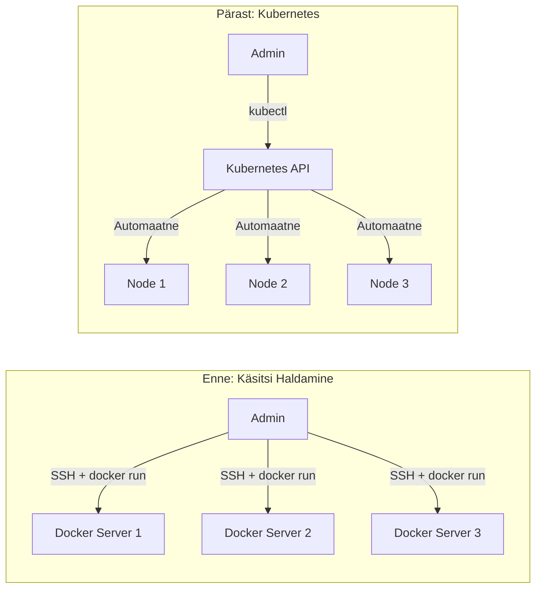
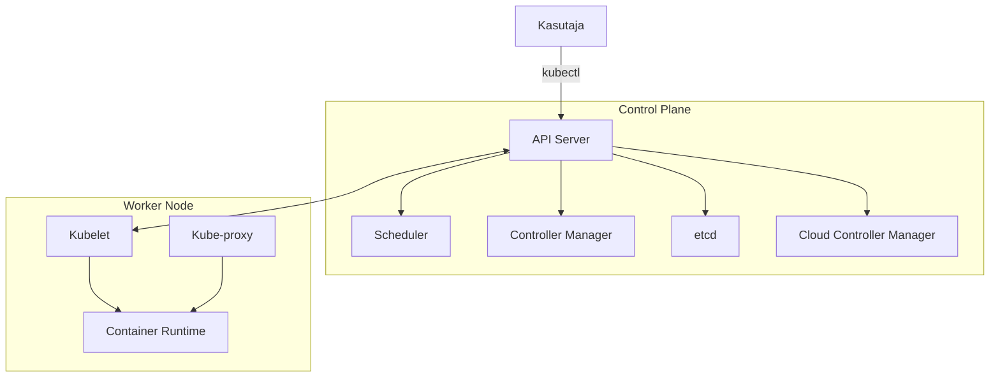

# Kubernetes: Sissejuhatus Konteinerite Orkestreerimisse

## 1. Mis on Kubernetes ja Miks Me Seda Vajame?
[Celebrating 10 years of Kubernetes: the evolution of database operators](https://www.cncf.io/blog/2024/06/28/celebrating-10-years-of-kubernetes-the-evolution-of-database-operators/)

### 1.1 Kubernetes'i Sünd ja Ajalugu


Alustame päris algusest - mis üldse on Kubernetes? 

Kubernetes on avatud lähtekoodiga platvorm, mille Google tegi avalikuks 2014. aastal, tuginedes nende 15-aastasele kogemusele miljardite konteinerite käitamisel nädalas. 

Google'i insenerid Craig McLuckie, Joe Beda ja Brendan Burns lõid Kubernetes'i, et tuua Google'i sisemise süsteemi Borg'i õppetunnid kõigile kättesaadavaks. 

Nimi "Kubernetes" tuleb kreeka keelest ja tähendab tüürimeest või piloti - see juhib teie konteinereid nagu kapten juhib laeva. 

Tänapäeval haldab Cloud Native Computing Foundation (CNCF) Kubernetes'i arendust, ning see on muutunud de facto standardiks konteinerite orkestreerimiseks.

Allikas: https://kubernetes.io/docs/concepts/overview/

### 1.2 Probleem, Mida Kubernetes Lahendab

Kujutage ette, et teil on veebirakendus, mis töötab Docker'i konteineris. Alguses on teil üks server ja paar konteinerit - lihtne hallata käsitsi kubectl või docker käskudega. 

Kuid mis juhtub, kui teil on 100 serverit ja 1000 konteinerit? Kuidas tagata, et kui üks server kukub, teie rakendus jätkab tööd? Kuidas uuendada rakendust ilma katkestusteta? 

Just neid probleeme lahendab Kubernetes automaatselt - see on nagu intelligentne orkestrijuht, kes tagab, et kõik konteinerid mängivad õiget meloodiat õigel ajal õiges kohas.



### 1.3 Kubernetes vs Docker


Paljud arvavad ekslikult, et Kubernetes ja Docker on konkurendid - see pole tõsi. 

Docker on konteinerite loomise ja käitamise tehnoloogia, Kubernetes aga haldab neid konteinereid suurel skaalal. Docker on nagu üksik auto, Kubernetes on nagu intelligentne liikluskorralduse süsteem, mis juhib tuhandeid autosid. 

Tegelikult kasutab Kubernetes ise Docker'it (või teisi konteinerite runtime'e nagu containerd või CRI-O) konteinerite käitamiseks. 

Lihtsalt öeldes: Docker pakendab ja käitab, Kubernetes orkestreerib ja haldab.

| Aspekt | Docker | Kubernetes |
|--------|--------|------------|
| Eesmärk | Konteinerite loomine ja käitamine | Konteinerite orkestratsioon |
| Skaala | Üksikud konteinerid | Tuhanded konteinerid |
| Keerukus | Lihtne õppida | Keeruline, vajab aega |
| Kasutus | Arenduses | Produktsioonis |
| Failover | Käsitsi | Automaatne |

Allikas: https://www.redhat.com/en/topics/containers/what-is-kubernetes

## 2. Kubernetes'i Põhikontseptsioonid

### 2.1 Klaster ja Node'id


Kubernetes klaster koosneb vähemalt ühest Control Plane node'ist (vanem nimetus Master) ja mitmest Worker node'ist. 

Control Plane on nagu ajurakk - seal toimub kogu otsustamine, planeerimine ja jälgimine. Worker node'id on nagu käed ja jalad - seal jooksevad tegelikud rakendused. 

Iga node on füüsiline või virtuaalne server, millel töötab Kubernetes'i tarkvara. 

Minimaalne produktsiooni klaster vajab vähemalt 3 Control Plane node'i (kõrge käideldavuse jaoks) ja 2+ Worker node'i.

```yaml
# Lihtne näide: kuidas vaadata oma klasteri node'e
kubectl get nodes

# Väljund näeb välja selline:
NAME                STATUS   ROLES           AGE   VERSION
master-node-1       Ready    control-plane   30d   v1.28.0
worker-node-1       Ready    <none>          30d   v1.28.0
worker-node-2       Ready    <none>          30d   v1.28.0
```

### 2.2 Pod - Väikseim Üksus Kubernetes'is


Pod on Kubernetes'i aatom - väikseim juurutatav üksus. 

Pod võib sisaldada ühte või mitut konteinerit, kuid praktikas on tavaliselt üks konteiner pod'i kohta. Kõik konteinerid pod'is jagavad sama võrgu (IP aadressi) ja salvestusruumi. 

Miks mitte lihtsalt kasutada konteinereid otse? Pod annab meile abstraktsiooni kihi - Kubernetes ei pea teadma, kas kasutate Docker'it, containerd'i või midagi muud. 

Samuti võimaldab pod lisada kõrvalmahuteid (sidecar containers) logimiseks või monitoorimiseks.

```yaml
# Lihtne Pod definitsioon
apiVersion: v1
kind: Pod
metadata:
  name: minu-esimene-pod
  labels:
    app: veebileht
spec:
  containers:
  - name: nginx
    image: nginx:latest
    ports:
    - containerPort: 80
```

### 2.3 Deployment - Deklaratiivne Rakenduse Haldamine


Deployment on Kubernetes'i võimas kontseptsioon, mis hoiab teie rakenduse soovitud olekus. 

Te ütlete "ma tahan 3 koopiat oma rakendusest" ja Kubernetes tagab, et need 3 koopiat alati töötavad. Kui üks pod kukub, loob Deployment automaatselt uue. 

Kui uuendate rakendust, teeb Deployment seda järk-järgult (rolling update), tagades null downtime'i. 

See on nagu autopiloot lennukis - te määrate sihtkoha, Kubernetes viib teid sinna.

```yaml
# Deployment näide - hoiab alati 3 pod'i töös
apiVersion: apps/v1
kind: Deployment
metadata:
  name: veebileht-deployment
spec:
  replicas: 3  # Soovime 3 koopiat
  selector:
    matchLabels:
      app: veebileht
  template:
    metadata:
      labels:
        app: veebileht
    spec:
      containers:
      - name: nginx
        image: nginx:1.21
        ports:
        - containerPort: 80
        resources:
          requests:
            memory: "64Mi"
            cpu: "250m"
          limits:
            memory: "128Mi"
            cpu: "500m"
```

## 3. Kubernetes'i Arhitektuur

### 3.1 Control Plane Komponendid

Control Plane koosneb viiest põhikomponendist, millest igaüks täidab spetsiifilist rolli:

**API Server (kube-apiserver)** on keskne suhtluspunkt - kõik käsud ja päringud käivad läbi tema.

**Scheduler (kube-scheduler)** otsustab, millisele node'ile pod paigutada, võttes arvesse ressursse ja piiranguid.

**Controller Manager (kube-controller-manager)** jooksutab kontrollereid, mis jälgivad klasteri olekut ja teevad muudatusi.

**etcd** on hajutatud võti-väärtus andmebaas, kus hoitakse kogu klasteri konfiguratsiooni.

**Cloud Controller Manager** suhtleb pilveteenuse pakkujaga (AWS, Azure, GCP).



Allikas: https://kubernetes.io/docs/concepts/architecture/

### 3.2 Worker Node Komponendid

## Worker Node komponendid

Igal Worker node'il töötavad kolm põhikomponenti:

**Kubelet** on agent, mis suhtleb Control Plane'iga ja tagab, et pod'id töötavad vastavalt spetsifikatsioonile.

**Kube-proxy** haldab võrgureegleid ja võimaldab teenuste kaudu ligipääsu pod'idele.

**Container Runtime** (Docker, containerd või CRI-O) käitab tegelikke konteinereid.

Need komponendid töötavad koos nagu hästi õlitatud masin - kubelet saab käsud, container runtime käivitab konteinerid, ja kube-proxy tagab, et neile pääseb ligi.

### 3.3 Kuidas Kõik Koos Töötab


Vaatame, mis juhtub, kui te loote uue deployment'i käsuga `kubectl apply -f deployment.yaml`:

Kubectl saadab YAML faili API serverisse, mis valideerib ja salvestab selle etcd'sse. 

Controller Manager märkab uue deployment'i ja loob ReplicaSet'i, mis omakorda loob vajalikud pod'id. 

Scheduler märkab uusi pod'e, millel pole määratud node'i, ja otsustab, kuhu need paigutada. 

Kubelet vastaval node'il saab teate uuest pod'ist ja käivitab konteinerid. 

Kogu see protsess võtab tavaliselt paar sekundit ja on täielikult automatiseeritud.

```bash
# Praktiline näide: deployment'i loomine
kubectl apply -f deployment.yaml

# Jälgi, kuidas pod'id käivituvad
kubectl get pods -w

# Vaata detailset infot
kubectl describe deployment veebileht-deployment

# Vaata logisid
kubectl logs -f deployment/veebileht-deployment
```

## 4. Service ja Networking

### 4.1 Service - Stabiilne Ligipääs Pod'idele


Pod'idel on dünaamilised IP aadressid - iga kord kui pod taaskäivitub, saab ta uue IP. 

Service lahendab selle probleemi, pakkudes stabiilset DNS nime ja IP aadressi pod'ide grupile. Service toimib nagu koormusjaotur, suunates liikluse automaatselt töötavatele pod'idele. 

Kubernetes'is on neli service tüüpi: **ClusterIP** (vaikimisi, ainult klasteri sees), **NodePort** (avab pordi igal node'il), **LoadBalancer** (loob välise koormusjaoturi pilves) ja **ExternalName** (DNS alias välisele teenusele).

```yaml
# Service näide
apiVersion: v1
kind: Service
metadata:
  name: veebileht-service
spec:
  selector:
    app: veebileht  # Leiab pod'id selle label'iga
  ports:
  - port: 80        # Service port
    targetPort: 80  # Pod'i port
  type: ClusterIP   # Ainult klasteri sees
```

### 4.2 DNS ja Service Discovery

Kubernetes'il on sisseehitatud DNS server (tavaliselt CoreDNS), mis võimaldab teenustel üksteist leida nimede järgi. 

Iga service saab DNS kirje kujul `<service-name>.<namespace>.svc.cluster.local`. 

Näiteks kui teil on service nimega "database" namespace'is "production", saavad teised pod'id sellega ühenduda kasutades nime `database.production.svc.cluster.local` või lihtsalt `database` kui nad on samas namespace'is. 

See teeb mikroteenuste arhitektuuri lihtsamaks - te ei pea hardkoodima IP aadresse.

| DNS Formaat | Näide | Kasutus |
|------------|--------|---------|
| Lühike nimi | `database` | Sama namespace |
| Namespace.service | `database.production` | Teine namespace |
| Täielik FQDN | `database.production.svc.cluster.local` | Alati töötab |

### 4.3 Ingress - Väline Ligipääs

Service'id on head klasteri sees, kuid kuidas pääseda ligi väljast? 

Ingress on HTTP/HTTPS ruuter, mis suunab välise liikluse õigetele service'idele URL-i põhjal. Ingress Controller (näiteks NGINX või Traefik) jälgib Ingress ressursse ja konfigureerib end vastavalt. 

See on nagu intelligentne väravavaht - vaatab, mida külaline küsib, ja suunab ta õigesse kohta. 

Ingress võimaldab ka SSL/TLS terminatsiooni, virtuaalhostide tuge ja URL-põhist marsruutimist.

```yaml
# Ingress näide
apiVersion: networking.k8s.io/v1
kind: Ingress
metadata:
  name: veebileht-ingress
spec:
  rules:
  - host: minurakendus.ee
    http:
      paths:
      - path: /
        pathType: Prefix
        backend:
          service:
            name: veebileht-service
            port:
              number: 80
```

Allikas: https://kubernetes.io/docs/concepts/services-networking/ingress/

## 5. Storage ja ConfigMaps

### 5.1 ConfigMaps ja Secrets

ConfigMap võimaldab eraldada konfiguratsiooni koodist - te saate muuta seadeid ilma konteinerit ümber ehitamata. ConfigMap võib sisaldada võti-väärtus paare või terveid konfiguratsioonifaile. 

Secrets on sarnased ConfigMap'idega, kuid mõeldud tundlike andmete jaoks nagu paroolid või API võtmed. Kubernetes salvestab Secret'id base64 kodeeritult ja piirab neile ligipääsu. 

Mõlemad saab mount'ida pod'i kas keskkonna muutujatena või failidena.

```yaml
# ConfigMap näide
apiVersion: v1
kind: ConfigMap
metadata:
  name: app-config
data:
  database_url: "postgres://localhost:5432/myapp"
  log_level: "debug"
  
---
# Secret näide
apiVersion: v1
kind: Secret
metadata:
  name: app-secret
type: Opaque
data:
  password: cGFzc3dvcmQxMjM=  # base64 encoded

---
# Kasutamine Pod'is
apiVersion: v1
kind: Pod
metadata:
  name: app-pod
spec:
  containers:
  - name: app
    image: myapp:latest
    env:
    - name: DATABASE_URL
      valueFrom:
        configMapKeyRef:
          name: app-config
          key: database_url
    - name: DB_PASSWORD
      valueFrom:
        secretKeyRef:
          name: app-secret
          key: password
```

### 5.2 Persistent Volumes

Konteinerid on loomult ajutised - kui konteiner taaskäivitub, kaob kogu data. 

Persistent Volumes (PV) lahendavad selle probleemi, pakkudes püsivat salvestust, mis elab kauem kui pod. PersistentVolumeClaim (PVC) on kasutaja taotlus salvestuse jaoks, nagu "ma vajan 10GB kiiret SSD salvestust". 

Kubernetes leiab sobiva PV ja seob need kokku. 

See on nagu üürikorteri otsimine - te esitate nõuded (PVC), ja Kubernetes leiab sobiva korteri (PV).

```yaml
# PersistentVolumeClaim näide
apiVersion: v1
kind: PersistentVolumeClaim
metadata:
  name: database-pvc
spec:
  accessModes:
    - ReadWriteOnce
  resources:
    requests:
      storage: 10Gi
  storageClassName: fast-ssd
```

## 6. Praktiline Alustamine

### 6.1 Minikube - Kohalik Kubernetes

Minikube on parim viis Kubernetes'i õppimiseks kohalikus arvutis. 

See loob ühe-node'i klasteri virtuaalmasinas või Docker'is, võimaldades teil katsetada ilma pilvekuludeta. Minikube sisaldab kõiki Kubernetes'i komponente ja lisaks mitmeid kasulikke addon'e nagu dashboard, metrics-server ja ingress controller. 

Installimine on lihtne ja töötab Windows'il, macOS'il ja Linux'il. 

Minikube on ideaalne õppimiseks ja arenduseks, kuid mitte produktsiooniks.

```bash
# Minikube installimine (Linux)
curl -LO https://storage.googleapis.com/minikube/releases/latest/minikube-linux-amd64
sudo install minikube-linux-amd64 /usr/local/bin/minikube

# Käivita klaster
minikube start

# Kontrolli staatust
minikube status

# Ava dashboard
minikube dashboard

# Lisa ingress
minikube addons enable ingress
```

Allikas: https://minikube.sigs.k8s.io/docs/start/

### 6.2 kubectl - Kubernetes'i Käsurea Tööriist

kubectl on peamine tööriist Kubernetes'iga suhtlemiseks käsurealt. 

See on nagu kaugjuhtimispult teie klasteri jaoks - saate luua, muuta, kustutada ja jälgida ressursse. kubectl töötab deklaratiivselt (YAML failidega) või imperatiivselt (käskudega). 

Kõige kasulikumad käsud on `get` (näita ressursse), `describe` (detailne info), `logs` (vaata logisid), `exec` (käivita käsk pod'is) ja `apply` (rakenda muudatusi). 

kubectl'i õppimine on Kubernetes'i kasutamise alus.

```bash
# Põhilised kubectl käsud
kubectl get pods                    # Näita kõiki pod'e
kubectl get pods -o wide            # Detailne vaade
kubectl describe pod nginx-pod      # Täielik info pod'i kohta
kubectl logs nginx-pod              # Vaata pod'i logisid
kubectl exec -it nginx-pod -- bash  # Mine pod'i sisse
kubectl apply -f deployment.yaml    # Rakenda konfiguratsioon
kubectl delete pod nginx-pod        # Kustuta pod
```

### 6.3 Esimene Deployment

Loome nüüd päris deployment'i, mis käitab lihtsat veebirakendust. 

See deployment loob 3 pod'i, igaüks nginx konteineriga, ja tagab, et nad alati töötavad. Kui kustutate pod'i, loob Kubernetes automaatselt uue. 

See on Kubernetes'i võlu - deklaratiivne lähenemine, kus te ütlete, mida tahate, mitte kuidas seda teha. 

Proovige muuta replicate arvu või container image'i versiooni ja vaadake, kuidas Kubernetes teeb rolling update'i.

```yaml
# deployment.yaml - salvestage see fail
apiVersion: apps/v1
kind: Deployment
metadata:
  name: minu-veebirakendus
spec:
  replicas: 3
  selector:
    matchLabels:
      app: veebirakendus
  template:
    metadata:
      labels:
        app: veebirakendus
    spec:
      containers:
      - name: nginx
        image: nginx:1.21
        ports:
        - containerPort: 80
        resources:
          requests:
            memory: "64Mi"
            cpu: "250m"
          limits:
            memory: "128Mi"
            cpu: "500m"

---
apiVersion: v1
kind: Service
metadata:
  name: veebirakendus-service
spec:
  selector:
    app: veebirakendus
  ports:
  - port: 80
    targetPort: 80
  type: LoadBalancer
```

```bash
# Rakenda deployment
kubectl apply -f deployment.yaml

# Jälgi pod'ide loomist
kubectl get pods -w

# Testi skaleerimist
kubectl scale deployment minu-veebirakendus --replicas=5

# Testi teenuse ligipääsu (Minikube'is)
minikube service veebirakendus-service
```

## Kokkuvõte

Kubernetes on võimas tööriist, mis automatiseerib konteinerite haldamise produktsioonis. 

Põhikontseptsioonid on Pod (väikseim üksus), Deployment (hoiab rakenduse töös), Service (võimaldab ligipääsu) ja ConfigMap/Secret (konfiguratsioon). 

Kubernetes'i õppimine võtab aega, kuid tasub end ära - see on muutunud tööstuse standardiks ja nõudlus Kubernetes'i oskustega inseneride järele kasvab pidevalt. 

Alustage Minikube'iga, õppige kubectl'i põhikäske ja ehitage järk-järgult keerukamaid rakendusi.

---

Järgmises loengus sukeldume sügavamale Kubernetes'i võrgu arhitektuuri ja õpime, kuidas mikroteenused omavahel suhtlevad.

---

**Soovitatav kirjandus:**
- "Kubernetes: Up and Running" - Kelsey Hightower, Brendan Burns, Joe Beda
- "The Kubernetes Book" - Nigel Poulton
- Ametlik dokumentatsioon: https://kubernetes.io/docs/
